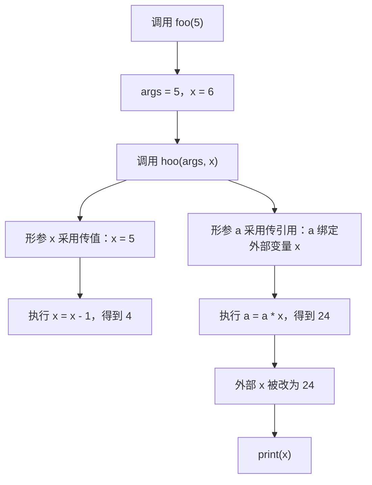
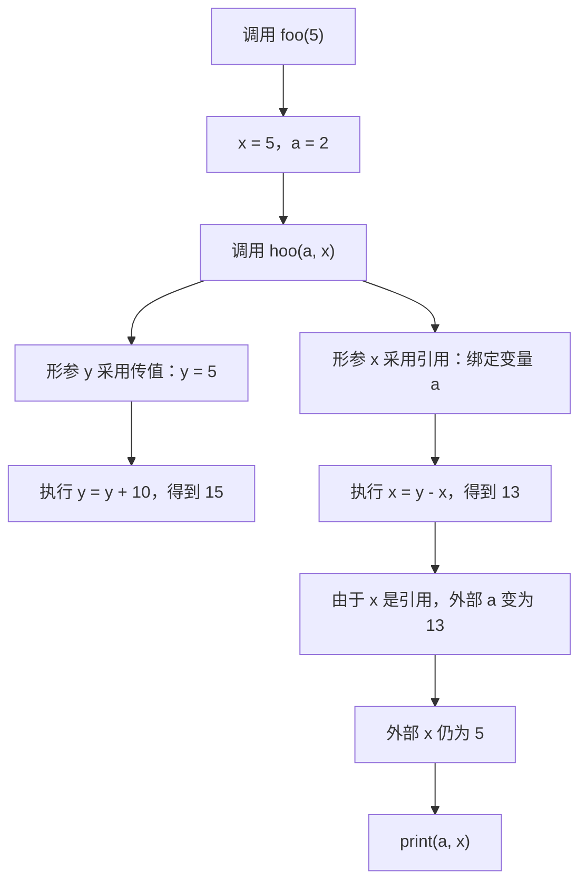
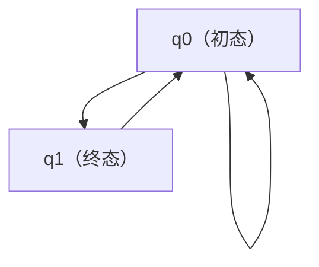
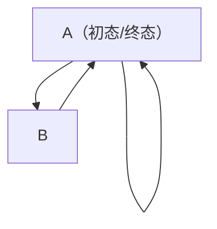
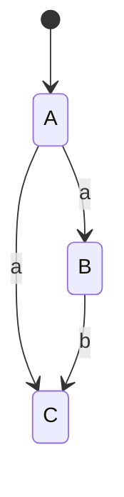

# chapter 2 - 程序设计语言

> 适用对象：**软件设计师新手备考**
>

```text
程序设计语言
├─ 程序设计语言概述
│  ├─ 编译程序与解释程序
│  ├─ 程序设计语言基本成分
│  │  ├─ 数据类型
│  │  ├─ 常量与变量
│  │  ├─ 控制结构
│  │  └─ 逻辑表达式与短路求值
│  └─ 函数调用
│     ├─ 传值调用
│     └─ 传引用调用
└─ 语言处理程序基础
   ├─ 编译程序基本原理
   ├─ 符号表
   ├─ 词法/语法/语义分析
   ├─ 中间代码与目标代码
   ├─ 正规式与有限自动机
   ├─ 文法与句子构造
   └─ 中缀/后缀表达式与语法树
```

# 二、复习建议

| 轮次 | 目标 | 做法 | 输出物 |
|---|---|---|---|
| 第 1 轮 | 建概念骨架 | 先看总记忆表，再过知识点表格 | 能说出每个概念的“一句话定义” |
| 第 2 轮 | 学会做选择题 | 每个专题至少做 2 题，强制说出题眼 | 会用“先抓题眼，再套知识点” |
| 第 3 轮 | 攻克易错点 | 专盯传值/传引用、短路求值、编译阶段 | 形成个人错题表 |
| 第 4 轮 | 冲刺提分 | 只看口诀、流程图、原题答案方向 | 5~10 分钟能快速过完本章 |

# 三、章节笔记

## 总记忆表

| 模块 | 高频考点 | 一句话记忆 |
|---|---|---|
| 编译 vs 解释 | 是否生成独立目标程序 | **编译产物独立跑，解释边翻边执行** |
| 控制结构 | 顺序、选择、循环 | **三大结构不含递归** |
| 数据类型 | 作用与陷阱项 | **分配、检查、约束；不是为动态结构而设** |
| 常量变量 | 是否可改、是否有类型 | **常量不能改，但常量也有类型** |
| 逻辑表达式 | 优先级与短路 | **先非后与再或；&& 左假停，|| 左真停** |
| 参数传递 | 传值/传引用 | **值只带进去，引用能带出来** |
| 编译过程 | 词法→语法→语义 | **前三步必须有，顺序不能乱** |
| 符号表 | 记录名字和属性 | **声明进表，执行翻译** |
| 中间代码 | 机器无关 | **后缀、三地址、四元式都常见** |
| 自动机 | 词法分析工具 | **自动机识别单词，不分析句法** |
| 文法 | 句子定义 | **从 S 出发，只剩终结符** |
| 表达式 | 中缀/后缀/语法树 | **后序遍历得后缀，栈求逆波兰** |

## 程序设计语言总览图

```text
高级语言程序
   │
   ├─ 编译方式
   │    ├─ 词法分析
   │    ├─ 语法分析
   │    ├─ 语义分析
   │    ├─（可选）中间代码生成
   │    ├─（可选）代码优化
   │    └─ 目标代码生成 → 独立目标程序
   │
   └─ 解释方式
        ├─ 词法分析
        ├─ 语法分析
        └─ 语义分析 → 边解释边执行
```

## 编译程序和解释程序

### 1. 知识点

| 项目 | 编译程序 | 解释程序 |
|---|---|---|
| 是否生成独立目标程序 | **生成** | **不生成** |
| 运行时是否还需要源程序 | 不需要 | 需要 |
| 翻译程序是否参与运行控制 | 一般不参与 | 参与 |
| 运行效率 | 较高 | 较低 |
| 适合场景 | 追求执行效率 | 调试、脚本、交互式执行 |

### 2. 例题分析

**例 1**  
题干问“将高级语言源程序翻译成目标程序的是谁”。  
先抓题眼：**目标程序**。  
解释程序不生成独立目标程序，能直接对应的是**编译程序**。

**例 2**  
题干问“哪种方式运行时还要参与控制”。  
先抓题眼：**参与运行控制**。  
这是解释程序的典型特征。

### 3. 记忆技巧

- **编译先整批翻，解释边翻边跑**
- **独立目标程序** 这 6 个字一出现，优先想到编译

---

## 程序设计语言基本成分

### 1. 知识点

| 成分 | 内容 | 常考陷阱 |
|---|---|---|
| 数据 | 常量、变量、数据类型 | 常量也有类型 |
| 运算 | 算术、关系、逻辑 | 不要把赋值当运算 |
| 控制 | 顺序、选择、循环 | 递归不是三大基本控制结构 |
| 传输 | 赋值、输入、输出 | 题目有时写成“数据传输” |

### 2. 公式/模板

无复杂公式，但有固定答题模板：

$$
\text{程序设计语言基本成分} = \text{数据} + \text{运算} + \text{控制} + \text{传输}
$$

### 3. 例题分析

**例 1**  
问“三种基本控制结构”。  
直接背结论：**顺序、选择、循环**。

**例 2**  
问“控制包括顺序、什么、循环”。  
只要不是“选择”，基本都不对。

### 4. 记忆技巧

- **数运控传** 四字记忆
- **顺选循** 三字记忆

---

## 数据类型

### 1. 知识点

| 作用 | 说明 | 是否高频 |
|---|---|---|
| 合理分配存储单元 | 不同类型占用空间可不同 | 高 |
| 做表达式合法性检查 | 如整型与浮点型混用 | 高 |
| 限定取值范围与允许运算 | 如布尔不能乱做算术 | 高 |
| 便于定义动态数据结构 | **不是设定“必须有类型”的直接理由** | 高陷阱 |

### 2. 公式/模板

当整型与浮点型混合运算时，通常发生**整型提升为浮点型**：

$$
int + float \Rightarrow float
$$

### 3. 例题分析

**例 1**  
题目问“其作用不包括”。  
看到“不包括”，就要找陷阱项。高频陷阱是：**便于定义动态数据结构**。

**例 2**  
题目问“何时涉及整型转浮点型”。  
整型变量与浮点型变量相加时，为保持精度，通常发生整型向浮点型提升。

### 4. 记忆技巧

- **分配、检查、约束** 是正项
- **动态结构、强转** 常作干扰项

---

## 常量和变量

### 1. 知识点

| 项目 | 变量 | 常量 |
|---|---|---|
| 运行过程中能否改变 | 可以 | 不可以 |
| 是否有类型属性 | 有 | **也有** |
| 是否可被赋值 | 可以 | 不可以 |
| 是否对应存储/值表示 | 有 | 题目常简化为“没有单独存储单元” |

### 2. 例题分析

**例 1**  
“变量具有类型属性，常量没有”这句话是错的。  
常量同样有类型，比如整型常量、字符常量、字符串常量。

**例 2**  
“局部变量在运行时不能改变”也是错的。  
局部变量只是作用域局部，不代表值不可变。

### 3. 记忆技巧

- **常量不变，变量能变**
- **常量也有类型** 是高频陷阱句

---

## 逻辑表达式与短路求值

### 1. 知识点

| 运算 | 含义 | 短路规则 |
|---|---|---|
| `!` / `not` | 非 | 优先级最高 |
| `&&` / `and` | 与 | 左边假，整体假，右边不算 |
| `||` / `or` | 或 | 左边真，整体真，右边不算 |

### 2. 公式/模板

$$
\text{优先级：} \quad not/! \; > \; and/\&\& \; > \; or/||
$$

短路判定模板：

```text
A && B：先看 A，A 假则停
A || B：先看 A，A 真则停
```

### 3. 例题分析

**例 1**  
`x and y or not z`  
先算 `not z`，再算 `x and y`，最后与 `or` 结合。  
若 `x` 为假，则 `x and y` 已经为假，是否还要看 `z`，要看后面 `or not z` 是否能决定整体值。

**例 2**  
`x && (y || !z)`  
若 `x` 为假，整个式子立刻为假，括号里都不用算。

### 4. 记忆技巧

- **与看假，或看真**
- **先非后与再或**

---

## 传值调用与传引用调用

### 1. 知识点

| 项目 | 传值调用 | 传引用调用 |
|---|---|---|
| 传递内容 | 实参的值 | 实参的地址/别名关系 |
| 实参可否是常量/表达式 | 可以 | 一般不可以 |
| 能否双向传递数据效果 | 不可以 | 可以 |
| 形参变化是否影响实参 | 不影响 | 影响 |

### 2. 公式/模板

函数调用的思维模板：

```text
传值：复制一份给形参，改形参不改实参
传引用：形参就是实参别名，改形参就是改实参
```

### 3. 例题分析

**例 1**  
问“引用调用传递的是实参的什么”。  
抓题眼：**引用/地址**。答案方向就是实参的地址。

**例 2**  
问“实参可以是变量，也可以是常量和表达式”的是哪种。  
这是传值调用的特征。

### 4. 记忆技巧

- **值进去，引用连出去**
- **能不能改回原变量**，是判断传值/传引用最快的方法

---

## 编译程序基本原理

### 1. 知识点

| 阶段 | 是否编译和解释都需要 | 输出/作用 |
|---|---|---|
| 词法分析 | 是 | 记号流 |
| 语法分析 | 是 | 语法树 |
| 语义分析 | 是 | 类型检查、静态语义检查 |
| 中间代码生成 | 编译中可选 | 机器无关表示 |
| 代码优化 | 编译中可选 | 提升效率 |
| 目标代码生成 | 编译需要 | 机器相关目标代码 |

### 2. 公式/模板

```text
公共阶段：词法 → 语法 → 语义
编译附加：中间代码 → 优化 → 目标代码
```

### 3. 例题分析

**例 1**  
凡是说“解释方式可以跳过词法、语法分析”的，一律错。  
前三步是公共基础步骤。

**例 2**  
凡是说“中间代码生成和代码优化一定不可省略”的，也不对。  
它们在编译中常见，但**不是绝对必须**。

### 4. 记忆技巧

- **前三步谁都跑不掉**
- **后两步常见但可省**

---

## 符号表

### 1. 知识点

| 内容 | 说明 |
|---|---|
| 记录对象 | 标识符、类型、作用域、存储信息等 |
| 主要用途 | 语义检查、代码生成 |
| 高频考法 | 声明语句填什么表、符号表干什么 |

### 2. 例题分析

**例**  
声明语句关注的是“把名字和属性登记起来”，这就是**符号表**的工作。  
可执行语句则更偏向翻译成中间代码/目标代码。

### 3. 记忆技巧

- **名字先进表，执行再翻译**

---

## 词法、语法、语义分析与目标代码生成

### 1. 知识点

| 阶段 | 输入 | 输出 | 主要任务 |
|---|---|---|---|
| 词法分析 | 源程序 | 记号流 | 把字符序列切分成单词符号 |
| 语法分析 | 记号流 | 语法树 | 检查句子结构是否合法 |
| 语义分析 | 语法树 | 带属性信息/检查结果 | 类型检查、静态语义检查 |
| 目标代码生成 | 中间表示等 | 目标代码 | 做机器相关翻译 |

### 2. 例题分析

**例 1**  
“语法分析阶段可以发现程序中所有语法错误”是对的。  
但“可以发现程序中所有错误”是错的，因为动态语义错误要到运行时才暴露。

**例 2**  
“寄存器分配处于哪个阶段”  
这属于与具体机器密切相关的工作，因此在**目标代码生成**阶段。

### 3. 记忆技巧

- **词法认单词，语法看结构，语义查含义**
- **寄存器分配看机器，所以归目标代码**

---

## 程序异常和错误

### 1. 知识点

| 错误类型 | 能否编译发现 | 例子 |
|---|---|---|
| 语法错误 | 通常能 | 括号不匹配、关键字误写 |
| 静态语义错误 | 多数能 | 类型不匹配、未声明即使用 |
| 动态语义错误 | 通常不能 | 除数为 0、越界、死循环风险等 |

### 2. 例题分析

**例**  
`a / 0` 形式上语法可能完全正确，但真正运行时才会出问题。  
所以它常作为“编译不一定能发现的动态语义错误”。

### 3. 记忆技巧

- **能不能运行到那一步**，决定很多错误是否能暴露

---

## 中间代码

### 1. 知识点

| 项目 | 结论 |
|---|---|
| 是否依赖具体机器 | 不依赖 |
| 作用 | 提高可移植性，利于机器无关优化 |
| 常见形式 | 后缀式、三地址码、三元式、四元式、树/图 |
| 常见误导项 | 正规式、栈、队列 |

### 2. 例题分析

**例 1**  
问“不是中间代码表示”的，常选**正规式**。  
正规式是描述正规语言的，不是编译中间表示。

**例 2**  
问“为什么引入中间代码”。  
答案方向是：**机器无关、便于优化、利于移植**。

### 3. 记忆技巧

- **中间代码不看机器脸色**
- **后缀、三地址、四元式最常见**

---

## 正规式、有限自动机、文法

### 1. 知识点

| 模块 | 核心结论 |
|---|---|
| 正规式 | 描述正规语言 |
| 有穷自动机 | 识别正规集，是词法分析工具 |
| DFA | 同一状态对同一输入只有一个后继 |
| NFA | 可有多个后继 |
| 上下文无关文法 | 程序设计语言语法规则最常用 |
| 句子 | 从开始符号 S 推导出来且只含终结符 |

### 2. 流程图

```text
正规式  ←→  有穷自动机
   │            │
   └──── 都对应正规语言 ────┘

上下文无关文法
   │
   ├─ 描述程序语言的大多数语法规则
   └─ 从开始符号 S 推导句子
```

### 3. 例题分析

**例 1**  
问“有穷自动机适合做什么”。  
直接答：**词法分析**。

**例 2**  
问“程序设计语言的大多数语法现象用什么描述”。  
直接锁定：**上下文无关文法**。

### 4. 记忆技巧

- **自动机认单词，文法管句子**
- **程序语法多数看 2 型：上下文无关文法**

---

## 中缀、后缀表达式与语法树

### 1. 知识点

| 形式 | 特点 | 高频结论 |
|---|---|---|
| 中缀式 | 运算符在中间 | 最符合人类习惯 |
| 后缀式 | 运算符在后面 | 逆波兰式，可用栈求值 |
| 语法树 | 树形结构表示表达式 | 中序=中缀，后序=后缀 |

### 2. 公式/模板

$$
\text{中序遍历} \Rightarrow \text{中缀式}
$$

$$
\text{后序遍历} \Rightarrow \text{后缀式}
$$

### 3. 例题分析

**例 1**  
逆波兰式求值工具是什么？  
答案方向：**栈**。

**例 2**  
语法树给出后求后缀式。  
做法：**左子树 → 右子树 → 根**。

### 4. 记忆技巧

- **后缀靠栈，后序得后缀**
- **根最后写，就是后缀**

# 四、原题与解析

## 编译程序和解释程序

> 解题主线：先抓“是否生成独立目标程序、运行时谁参与控制”这两个题眼。编译：生成独立目标程序；解释：不生成独立目标程序，解释程序与源程序一起参与运行。

### 题 1

**原题**
将高级语言源程序翻译成目标程序的是 （48） 。（2012年下半年）

- （48） A. 解释程序		B. 编译程序			C. 链接程序		D. 汇编程序

**解析**
先抓“是否生成独立目标程序、运行时谁参与控制”这两个题眼。编译：生成独立目标程序；解释：不生成独立目标程序，解释程序与源程序一起参与运行。

**正确答案**
B

**答案方向**
优先根据固定定义直接排除干扰项，通常可以定位到唯一正确方向。

### 题 2
**原题**
以下关于解释程序和编译程序的叙述中，正确的是 （20） 。（2013年上半年）

- （20） A. 编译程序和解释程序都生成源程序的目标程序
- B. 编译程序和解释程序都不生成源程序的目标程序
- C. 编译程序生成源程序的目标程序，而解释程序则不然
- D. 编译程序不生成源程序的目标程序，而解释程序反之

**解析**
先抓“是否生成独立目标程序、运行时谁参与控制”这两个题眼。编译：生成独立目标程序；解释：不生成独立目标程序，解释程序与源程序一起参与运行。

**正确答案**
C

**答案方向**
优先根据固定定义直接排除干扰项，通常可以定位到唯一正确方向。

### 题 3
**原题**
以下关于实现高级程序设计语言的编译和解释方式的叙述中，正确的是 （48） 。（2014年上半年）

- （48） A. 在编译方式下产生源程序的目标程序，在解释方式下不产生
- B. 在解释方式下产生源程序的目标程序，在编译方式下不产生
- C. 编译和解释方式都产生源程序的目标程序，差别是优化效率不同
- D. 编译和解释方式都不产生源程序的目标程序，差别在是否优化

**解析**
先抓“是否生成独立目标程序、运行时谁参与控制”这两个题眼。编译：生成独立目标程序；解释：不生成独立目标程序，解释程序与源程序一起参与运行。

**正确答案**
A

**答案方向**
优先根据固定定义直接排除干扰项，通常可以定位到唯一正确方向。

### 题 4
**原题**
以下关于高级程序设计语言实现的编译和解释方式的叙述中，正确的是 （20） 。（2016年上半年）

- （20） A. 编译程序不参与用户程序的运行控制，而解释程序则参与
- B. 编译程序可以用高级语言编写，而解释程序只能用汇编语言编写
- C. 编译方式处理源程序时不进行优化，而解释方式则进行优化
- D. 编译方式不生成源程序的目标程序，而解释方式则生成

**解析**
先抓“是否生成独立目标程序、运行时谁参与控制”这两个题眼。编译：生成独立目标程序；解释：不生成独立目标程序，解释程序与源程序一起参与运行。

**正确答案**
A

**答案方向**
优先根据固定定义直接排除干扰项，通常可以定位到唯一正确方向。

### 题 5
**原题**
将高级语言源程序翻译为可在计算机上执行的形式有多种不同的方式，其中， （21） 。（2018年上半年）

- （21） A. 编译方式和解释方式都生成逻辑上与源程序等价的目标程序
- B. 编译方式和解释方式都不生成逻辑上与源程序等价的目标程序
- C. 编译方式生成逻辑上与源程序等价的目标程序，解释方式不生成
- D. 解释方式生成逻辑上与源程序等价的目标程序，编译方式不生成

**解析**
先抓“是否生成独立目标程序、运行时谁参与控制”这两个题眼。编译：生成独立目标程序；解释：不生成独立目标程序，解释程序与源程序一起参与运行。

**正确答案**
C

**答案方向**
优先根据固定定义直接排除干扰项，通常可以定位到唯一正确方向。

## 基本控制结构

> 解题主线：先记住三种基本控制结构只有：顺序、选择、循环。凡是递归、堆栈、调用返回都不是“基本控制结构”。

### 题 6
**原题**
程序的三种基本控制结构是 （33） 。（2010年上半年）

> 原题含图、代码段或补充条件，建议与上传 Word 对照查看。
> 通用的高级程序设计语言一般都会提供描述数据、运算、控制和数据传输的语言成分，其中，控制包括顺序、 （20） 和循环结构。（2019年上半年）

- （33） A. 过程、子程序和分程序			B. 顺序、选择和重复
- C. 递归、堆栈和队列				D. 调用、返回和跳转
- （20） A. 选择				B. 递归			C. 递推			D. 函数

**解析**
先记住三种基本控制结构只有：顺序、选择、循环。凡是递归、堆栈、调用返回都不是“基本控制结构”。

**正确答案**
第 1 问：B

第 2 问：A

**答案方向**
优先根据固定定义直接排除干扰项，通常可以定位到唯一正确方向。

## 数据类型

> 解题主线：抓住“类型的作用”三件事：分配存储单元、做类型检查、限定取值范围与运算。凡是“便于定义动态数据结构、强制类型转换”通常不是设定类型的直接理由。

### 题 7
**原题**
许多程序设计语言规定，程序中的数据都必须具有类型，其作用不包括 （20） 。（2009年下半年）

> 原题含图、代码段或补充条件，建议与上传 Word 对照查看。
> 若一种程序设计语言规定其程序中的数据必须具有类型，则有利于 （22） 。（2011年上半年）
> 某程序设计语言规定在源程序中的数据都必须具有类型，然而， （28） 并不是做出此规定的理由。（2011年下半年）

- （20） A. 便于为数据合理分配存储单元
- B. 便于对参与表达式计算的数据对象进行检查
- C. 便于定义动态数据结构
- D. 便于规定数据对象的取值范围及能够进行的运算
- ①在翻译程序的过程中为数据合理分配存储单元
- ②对参与表达式计算的数据对象进行检查
- ③定义和应用动态数据结构
- ④规定数据对象的取值范围及能够进行的运算
- ⑤对数据进行强制类型转换
- （22） A. ①②③		B. ①②④		C. ②④⑤			D. ③④⑤
- （28） A. 为数据合理分配存储单元
- B. 可以定义和使用动态数据结构
- C. 可以规定数据对象的取值范围及能够进行的运算
- D. 对参与表达式求值的数据对象可以进行合法性检查

**解析**
抓住“类型的作用”三件事：分配存储单元、做类型检查、限定取值范围与运算。凡是“便于定义动态数据结构、强制类型转换”通常不是设定类型的直接理由。

**正确答案**
第 1 问：C

第 2 问：B

第 3 问：B

**答案方向**
优先根据固定定义直接排除干扰项，通常可以定位到唯一正确方向。

### 题 8
**原题**
在程序运行过程中， （22） 时涉及整型数据转换为浮点型数据的操作。（2018年下半年）

- （22） A. 将浮点型变量赋值给整型变量
- B. 将整型常量赋值给整型变量
- C. 将整型变量与浮点型变量相加
- D. 将浮点型常量与浮点型变量相加

**解析**
抓住“类型的作用”三件事：分配存储单元、做类型检查、限定取值范围与运算。凡是“便于定义动态数据结构、强制类型转换”通常不是设定类型的直接理由。

**正确答案**
C

**答案方向**
优先根据固定定义直接排除干扰项，通常可以定位到唯一正确方向。

## 常量变量

> 解题主线：看是否可改、是否有存储单元、是否有类型。常量不能赋值修改；变量在运行中可变。常量也有类型属性，这是常见陷阱。

### 题 9
**原题**
以下关于变量和常量的叙述中，错误的是 （20） 。（2010年下半年）

- （20） A. 变量的取值在程序运行过程中可以改变，常量则不行
- B. 变量具有类型属性，常量则没有
- C. 变量具有对应的存储单元，常量则没有
- D. 可以对变量赋值，不能对常量赋值

**解析**
看是否可改、是否有存储单元、是否有类型。常量不能赋值修改；变量在运行中可变。常量也有类型属性，这是常见陷阱。

**正确答案**
B

**答案方向**
优先根据固定定义直接排除干扰项，通常可以定位到唯一正确方向。

### 题 10
**原题**
以下关于程序设计语言的叙述中，错误的是 （20） 。（2015年上半年）

- （20） A. 程序设计语言的基本成分包括数据、运算、控制和传输等
- B. 高级程序设计语言不依赖于具体的机器硬件
- C. 程序中局部变量的值在运行时不能改变
- D. 程序中常量的值在运行时不能改变

**解析**
看是否可改、是否有存储单元、是否有类型。常量不能赋值修改；变量在运行中可变。常量也有类型属性，这是常见陷阱。

**正确答案**
C

**答案方向**
优先根据固定定义直接排除干扰项，通常可以定位到唯一正确方向。

## 逻辑表达式

> 解题主线：先按优先级化简，再做短路。优先级一般是 not/! > and/&& > or/||。&& 左边假就短路，|| 左边真就短路。

### 题 11
**原题**
对于逻辑表达式“x and y or not z”，and、or、not分别是逻辑与、或、非运算，优先级从高到低为not、and、or，and、or为左结合，not为右结合，若进行短路计算，则 （20） 。（2012年上半年）

- （20） A. x为真时，整个表达式的值即为真，不需要计算y和z的值
- B. x为假时，整个表达式的值即为假，不需要计算y和z的值
- C. x为真时，根据y的值决定是否需要计算z的值
- D. x为假时，根据y的值决定是否需要计算z的值

**解析**
先按优先级化简，再做短路。优先级一般是 not/! > and/&& > or/||。&& 左边假就短路，|| 左边真就短路。

**正确答案**
C

**答案方向**
优先根据固定定义直接排除干扰项，通常可以定位到唯一正确方向。

### 题 12
**原题**
逻辑表达式求值时常采用短路计算方式。“&&”、“||”、“!”分别表示逻辑与、或、非运算，“&&”、“||”为左结合，“!”为右结合，优先级从高到低为“!”、“&&”、“||”。对逻辑表达式“x&&(y || !z)”进行短路计算方式求值时， （20） 。（2016年下半年）

- （20） A. x为真，则整个表达式的值即为真，不需要计算y和z的值
- B. x为假，则整个表达式的值即为假，不需要计算y和z的值
- C. x为真，再根据z的值决定是否需要计算y的值
- D. x为假，再根据y的值决定是否需要计算z的值

**解析**
先按优先级化简，再做短路。优先级一般是 not/! > and/&& > or/||。&& 左边假就短路，|| 左边真就短路。

**正确答案**
B

**答案方向**
优先根据固定定义直接排除干扰项，通常可以定位到唯一正确方向。

### 题 13
**原题**
对布尔表达式进行短路求值是指：无须对表达式中所有操作数或运算符进行计算就可确定表达式的值。对于表达式"”， （20） 时可进行短路计算。（2018年下半年）

- （20） A. d为true			B. a为true		C. b为true		D. c为true

**解析**
先按优先级化简，再做短路。优先级一般是 not/! > and/&& > or/||。&& 左边假就短路，|| 左边真就短路。

**答案方向**
优先根据固定定义直接排除干扰项，通常可以定位到唯一正确方向。

## 传值调用与传引用调用概念

> 解题主线：先区分“传什么”。传值传的是值，实参可为变量/常量/表达式，不能双向改动；传引用传的是地址，实参必须可取地址，形参变化会反映到实参。

### 题 14
**原题**
函数调用时，基本的参数传递方式有传值与传地址两种， （20） 。（2009年上半年）

- （20） A. 在传值方式下，形参将值传给实参
- B. 在传值方式下，实参不能是数组元素
- C. 在传地址方式下，形参和实参间可以实现数据的双向传递
- D. 在传地址方式下，实参可以是任意的变量和表达式

**解析**
先区分“传什么”。传值传的是值，实参可为变量/常量/表达式，不能双向改动；传引用传的是地址，实参必须可取地址，形参变化会反映到实参。

**正确答案**
C

**答案方向**
优先根据固定定义直接排除干扰项，通常可以定位到唯一正确方向。

### 题 15
**原题**
传值与传地址是函数调用时常采用的信息传递方式， （50） 。（2011年上半年）

- （50） A. 在传值方式下，是将形参的值传给实参
- B. 在传值方式下，形参可以是任意形式的表达式
- C. 在传地址方式下，是将实参的地址传给形参
- D. 在传地址方式下，实参可以是任意形式的表达式

**解析**
先区分“传什么”。传值传的是值，实参可为变量/常量/表达式，不能双向改动；传引用传的是地址，实参必须可取地址，形参变化会反映到实参。

**正确答案**
C

**答案方向**
优先根据固定定义直接排除干扰项，通常可以定位到唯一正确方向。

### 题 16
**原题**
函数（过程）调用时，常采用传值与传地址两种方式在实参与形参间传递信息。以下叙述中，正确的是 （50） 。（2012年上半年）

- （50） A. 在传值方式下，将形参的值传给实参，因此，形参必须是常量或变量
- B. 在传值方式下，将实参的值传给形参，因此，实参必须是常量或变量
- C. 在传地址方式下，将形参的地址传给实参，因此，形参必须有地址
- D. 在传地址方式下，将实参的地址传给形参，因此，实参必须有地址

**解析**
先区分“传什么”。传值传的是值，实参可为变量/常量/表达式，不能双向改动；传引用传的是地址，实参必须可取地址，形参变化会反映到实参。

**正确答案**
D

**答案方向**
优先根据固定定义直接排除干扰项，通常可以定位到唯一正确方向。

### 题 17
**原题**
以下关于传值调用与引用调用的叙述中，正确的是 （21） 。（2013年上半年）

- ①在传值调用方式下，可以实现形参和实参间双向传递数据的效果
- ②在传值调用方式下，实参可以是变量，也可以是常量和表达式
- ③在引用调用方式下，可以实现形参和实参间双向传递数据的效果
- ④在引用调用方式下，实参可以是变量，也可以是常量和表达式
- （21） A. ①③			B. ①④			C. ②③			D. ②④

**解析**
先区分“传什么”。传值传的是值，实参可为变量/常量/表达式，不能双向改动；传引用传的是地址，实参必须可取地址，形参变化会反映到实参。

**正确答案**
C

**答案方向**
优先根据固定定义直接排除干扰项，通常可以定位到唯一正确方向。

### 题 18
**原题**
程序运行过程中常使用参数在函数（过程）间传递信息，引用调用传递的是实参的 （20） 。（2013年下半年）

> 原题含图、代码段或补充条件，建议与上传 Word 对照查看。
> 在引用调用方式下进行函数调用是将 （21） 。（2014年上半年）
> 常用的函数参数传递方式有传值与传引用两种。 （21） 。（2016年下半年）

- （20） A. 地址			B. 类型				C. 名称				D. 值
- （21） A. 实参的值传递给形参				B. 实参的地址传递给形参
- C. 形参的值传递给实参				D. 形参的地址传递给实参
- （21） A. 在传值方式下，形参与实参之间互相传值
- B. 在传值方式下，实参不能是变量
- C. 在传引用方式下，修改形参实质上改变了实参的值。
- D. 在传引用方式下，实参可以是任意的变量和表达式。

**解析**
先区分“传什么”。传值传的是值，实参可为变量/常量/表达式，不能双向改动；传引用传的是地址，实参必须可取地址，形参变化会反映到实参。

**正确答案**
第 1 问：A

第 2 问：B

第 3 问：C

**答案方向**
优先根据固定定义直接排除干扰项，通常可以定位到唯一正确方向。

## 传值调用与传引用调用概念计算

> 解题主线：按“先建初值表 → 进入函数 → 分清哪个参数被改回去 → 退出函数再看外部变量”来算。凡是引用参数，其变化会带回调用点；值参数只在函数体内变化。

### 题 19

**正确答案**
- 第 1 问（传值调用）：**B（16）**
- 第 2 问（引用调用）：**D（24）**
**原题**
函数t、f的定义如下所示，其中，a是整型全局变量。设调用函数t前a的值为5，则在函数t中以传值调用（call by value） 方式调用函数f时，输出为 （49） 在函数t中以引用调用（call by reference） 方式调用函数f时，输出为 （50） 。（2011年下半年）

- （49） A. 12				B. 16				C. 20				D. 24
- （50） A. 12				B. 16				C. 20				D. 24

**解析**
按“先建初值表 → 进入函数 → 分清哪个参数被改回去 → 退出函数再看外部变量”来算。凡是引用参数，其变化会带回调用点；值参数只在函数体内变化。

**答案方向**
按题图/代码逐步推演：先写中间过程，再核对选项，不要直接凭感觉选。

### 题 20

**正确答案**
- **A（33）**
**原题**
函数t()、f()的定义如下所示，若调用函数t时传递给x的值为5，并且调用函数f()时，第一个参数采用传值（call by value）方式，第二个参数采用传引用（call by reference）方式，则函数t的返回值为 （50） 。（2015年下半年）

- （50） A. 33			B. 22				C. 11			D. 负数

**解析**
按“先建初值表 → 进入函数 → 分清哪个参数被改回去 → 退出函数再看外部变量”来算。凡是引用参数，其变化会带回调用点；值参数只在函数体内变化。

**答案方向**
按题图/代码逐步推演：先写中间过程，再核对选项，不要直接凭感觉选。

### 题 21

#### 题图重构（代码块版）

```cpp
void f(int x, int &a) {
    x = x + 6;
    a = a + x;
}

void main() {
    int x = 1;
    f(5, x);
    print(x);
}
```

**正确答案**
- **D（12）**
**原题**
函数main()、f()的定义如下所示，调用函数f()时，第一个参数采用传值（call by value）方式，第二个参数采用传引用（call by reference）方式，main函数中“print(x)”执行后输出的值为 （50） 。（2016年上半年）

- （50） A. 1				B. 6			C. 11				D. 12

**解析**
按“先建初值表 → 进入函数 → 分清哪个参数被改回去 → 退出函数再看外部变量”来算。凡是引用参数，其变化会带回调用点；值参数只在函数体内变化。

**答案方向**
按题图/代码逐步推演：先写中间过程，再核对选项，不要直接凭感觉选。

### 题 22

#### 题图重构（代码块版）

```cpp
void f(int x, int &a) {
    x = x * x - 1;
    a = a + x;
}

void main() {
    int x = 5;
    f(x + 1, x);
    print(x);
}
```

**正确答案**
- **B（40）**
**原题**
函数main()、f()的定义如下所示，调用函数f()时，第一个参数采用传值（call by value）方式，第二个参数采用传引用（call by reference）方式，main()函数中“print(x)”执行后输出的值为 （49） 。（2017年上半年）

- （49） A. 11			B. 40				C. 45			D. 70

**解析**
按“先建初值表 → 进入函数 → 分清哪个参数被改回去 → 退出函数再看外部变量”来算。凡是引用参数，其变化会带回调用点；值参数只在函数体内变化。

**答案方向**
按题图/代码逐步推演：先写中间过程，再核对选项，不要直接凭感觉选。

### 题 23
**原题**
函数main()、f()的定义如下所示。调用函数f()时，第一个参数采用传值（call by value）方式，第二个参数采用传引用（call by reference）方式，则函数main()执行后输出的值为 （50） 。（2017年下半年）

- （50） A. 10			B. 19				C. 20				D. 29

**解析**
按“先建初值表 → 进入函数 → 分清哪个参数被改回去 → 退出函数再看外部变量”来算。凡是引用参数，其变化会带回调用点；值参数只在函数体内变化。

**答案方向**
按题图/代码逐步推演：先写中间过程，再核对选项，不要直接凭感觉选。

### 题 24
**原题**
函数f和g的定义如下图所示。执行函数f时若采用引用（call by reference）方式调用函数g（a），则函数f的返回值为 （50） 。（2018年下半年）

- （50） A. 14			B. 18			C. 24			D. 28

**解析**
按“先建初值表 → 进入函数 → 分清哪个参数被改回去 → 退出函数再看外部变量”来算。凡是引用参数，其变化会带回调用点；值参数只在函数体内变化。

**答案方向**
按题图/代码逐步推演：先写中间过程，再核对选项，不要直接凭感觉选。

### 题 25
**原题**
函数f、g的定义如下，执行表达式“y=f(2)”的运算时，函数调用g(la)分别采用引用调用（call by reference）方式和值调用（call by value）方式，则该表达式求值结束后y的值分别为 （50） 。（2019年上半年）

- （50） A. 9、6			B. 20、6		C. 20、9				D. 30、9

**解析**
按“先建初值表 → 进入函数 → 分清哪个参数被改回去 → 退出函数再看外部变量”来算。凡是引用参数，其变化会带回调用点；值参数只在函数体内变化。

**答案方向**
按题图/代码逐步推演：先写中间过程，再核对选项，不要直接凭感觉选。

### 题 26
**原题**
函数foo()、hoo()定义如下，调用函数hoo()时，第一个参数采用传值（call by value）方式，第二个参数采用传引用（call by reference）方式。设有函数调用foo(5)，那么“print(x)”执行后输出的值为 （48） 。（2020年下半年）

#### 题图重构（代码块版）

```cpp
void foo(int args) {
    int x = 6;
    hoo(args, x);
    print(x);
}

void hoo(int x, int &a) {
    x = x - 1;
    a = a * x;
    return;
}
```

#### 调用过程图



- （48） A. 24			B. 25				C. 30			D. 36

**解析**
按“先建初值表 → 进入函数 → 分清哪个参数被改回去 → 退出函数再看外部变量”来算。  
本题中第一个参数 `x` 是值传递，只在函数内部变化；第二个参数 `a` 是引用传递，实际绑定的是 `foo` 里的变量 `x`。  
所以 `hoo` 内部先令局部 `x = 4`，再执行 `a = a * x = 6 * 4 = 24`，因此外部 `x` 被改成 24。

**正确答案**
A

**答案方向**
先分清“谁是值参数、谁是引用参数”，再顺序模拟执行，最终输出应落在 **24**。

### 题 27
**原题**
函数foo()、hoo()定义如下，调用函数hoo(a, x)的两个参数分别采用引用调用（call by reference）和值调用（call by value）方式传递，则函数调用foo(5)的输出结果为 （50） 。（2021年上半年）

#### 题图重构（代码块版）

```cpp
void foo(int x) {
    int a = 2;
    hoo(a, x);
    print(a, x);
}

void hoo(int &x, int y) {
    y = y + 10;
    x = y - x;
    return;
}
```

#### 调用过程图



- （50） A. 2，5			B. 2，15			C. 13，5			D. 13，15

**解析**
关键是看 `hoo(a, x)` 的对应关系：第一个形参是引用，所以会改动外部变量 `a`；第二个形参是值传递，所以只会改局部副本 `y`。  
进入 `hoo` 后：`y = 5`，再执行 `y = y + 10` 得到 15。  
随后 `x = y - x`，这里的 `x` 实际绑定的是外部变量 `a`，因此 `a = 15 - 2 = 13`。  
外部变量 `x` 仍保持 5 不变。

**正确答案**
C

**答案方向**
输出应为 **13，5**。

## 编译程序基本原理

> 解题主线：必须记牢：词法分析、语法分析、语义分析是编译和解释都不可省略的公共阶段；中间代码生成、代码优化在编译方式下可以省略。

### 题 28
**原题**
以下关于高级语言程序的编译和解释的叙述中，正确的是 （48） 。（2010年上半年）

- （48） A. 编译方式下，可以省略对源程序的词法分析、语法分析
- B. 解释方式下，可以省略对源程序的词法分析、语法分析
- C. 编译方式下，在机器上运行的目标程序完全独立于源程序
- D. 解释方式下，在机器上运行的目标程序完全独立于源程序

**解析**
必须记牢：词法分析、语法分析、语义分析是编译和解释都不可省略的公共阶段；中间代码生成、代码优化在编译方式下可以省略。

**正确答案**
C

**答案方向**
优先根据固定定义直接排除干扰项，通常可以定位到唯一正确方向。

### 题 29
**原题**
编译和解释是实现高级程序设计语言翻译的两种基本形式。以下关于编译与解释的叙述中，正确的是 （51） 。（2012年上半年）

> 原题含图、代码段或补充条件，建议与上传 Word 对照查看。
> 目标代码
> 标代码
> 目标代码

- （51） A. 在解释方式下，对源程序不进行词法分析和语法分析，直接进行语义分析
- B. 在解释方式下，无需进行词法、语法和语义分析，而是直接产生源程序的
- C. 在编译方式下，必须进行词法、语法和语义分析，然后再产生源程序的目
- D. 在编译方式下，必须先形成源程序的中间代码，然后再产生与机器对应的

**解析**
必须记牢：词法分析、语法分析、语义分析是编译和解释都不可省略的公共阶段；中间代码生成、代码优化在编译方式下可以省略。

**正确答案**
C

**答案方向**
优先根据固定定义直接排除干扰项，通常可以定位到唯一正确方向。

### 题 30
**原题**
对高级语言源程序进行编译或解释的过程可以分为多个阶段，解释方式不包含 （48） 阶段。（2015年上半年）

- （48） A. 词法分析		B. 语法分析		C. 语义分析		D. 目标代码生成

**解析**
必须记牢：词法分析、语法分析、语义分析是编译和解释都不可省略的公共阶段；中间代码生成、代码优化在编译方式下可以省略。

**正确答案**
D

**答案方向**
优先根据固定定义直接排除干扰项，通常可以定位到唯一正确方向。

### 题 31
**原题**
编译器和解释器是两种基本的高级语言处理程序。编译器对高级语言源程序的处理过程可以划分为词法分析、语法分析、语义分析、中间代码生成、代码优化、目标代码生成等阶段，其中， （20） 并不是每个编译器都必需的，与编译器相比，解释器 （21） 。（2015年下半年）

- （20） A. 词法分析和语法分析					B. 语义分析和中间代码生成
- C. 中间代码生成和代码优化				D. 代码优化和目标代码生成
- （21） A. 不参与运行控制，程序执行的速度慢
- B. 参与运行控制，程序执行的速度慢
- C. 参与运行控制，程序执行的速度快
- D. 不参与运行控制，程序执行的速度快

**解析**
必须记牢：词法分析、语法分析、语义分析是编译和解释都不可省略的公共阶段；中间代码生成、代码优化在编译方式下可以省略。

**正确答案**
第 1 问：C

第 2 问：B

**答案方向**
优先根据固定定义直接排除干扰项，通常可以定位到唯一正确方向。

## 符号表

> 解题主线：声明语句主要是“填符号表”，执行语句主要是“翻译成中间代码或目标代码”。符号表记录名字、类型、作用域等静态信息。

### 题 32
**原题**
编译过程中，对高级语言程序语句的翻译主要考虑声明语句和可执行语句。对声明语句，主要是将所需要的信息正确地填入合理组织的 （49） 中；对可执行语句，则是 （50） 。（2013年上半年）（了解即可）

> 原题含图、代码段或补充条件，建议与上传 Word 对照查看。
> 编译程序对高级语言源程序进行编译的过程中，要不断收集、记录和使用源程序中一些相关符号的类型和特征等信息，并将其存入 （22） 中。（2014年上半年）
> 在对高级语言源程序进行编译或解释处理的过程中，需要不断收集、记录和使用源程序中一些相关符号的类型和特征等信息，并将其存入 （22） 中。（2019年上半年）
> 对高级程序语言进行编译的过程中，使用 （21） 来记录源程序中各个字符的必要信息，以辅助语义的正确性检查和代码生成。（2021年下半年）

- （49） A. 符号表			B. 栈			C. 队列			D. 树
- （50） A. 翻译成机器代码并加以执行			B. 转换成语法树
- C. 翻译成中间代码或目标代码			D. 转换成有限自动机
- （22） A. 符号表							B. 哈希表
- C. 动态查找表						D. 栈和队列
- （22） A. 哈希表		B. 符号表			C. 堆栈				D. 队列
- （21） A. 决策表		B. 符号表		C. 广义表		D. 索引表

**解析**
声明语句主要是“填符号表”，执行语句主要是“翻译成中间代码或目标代码”。符号表记录名字、类型、作用域等静态信息。

**正确答案**
第 1 问：A / C

第 2 问：A

第 3 问：B

第 4 问：B

**答案方向**
优先根据固定定义直接排除干扰项，通常可以定位到唯一正确方向。

## 词法、语法、语义分析与目标代码生成

> 解题主线：看输入输出和职责：词法“源程序→记号流”；语法“记号流→语法树”；语义做类型检查和静态语义检查；目标代码生成与具体机器相关。

### 题 33
**原题**
以下关于编译系统对某高级语言进行翻译的叙述中，错误的是 （48） 。（2009年下半年）

> 原题含图、代码段或补充条件，建议与上传 Word 对照查看。
> 编译程序对C语言源程序进行语法分析时，可以确定 （22） 。（2010年上半年）
> 编译程序分析源程序的阶段依次是 （21） 。（2010年下半年）

- （48） A. 词法分析将把源程序看作一个线性字符序列进行分析
- B. 语法分析阶段可以发现程序中所有的语法错误
- C. 语义分析阶段可以发现程序中所有的语义错误
- D. 目标代码生成阶段的工作与目标机器的体系结构相关
- （22） A. 变量是否定义（或声明）		B. 变量的值是否正确
- C. 循环语句的执行次数			D. 循环条件是否正确
- （21） A. 词法分析、语法分析、语义分析
- B. 语法分析、词法分析、语义分析
- C. 语义分析、语法分析、词法分析
- D. 语义分析、词法分析、语法分析

**解析**
看输入输出和职责：词法“源程序→记号流”；语法“记号流→语法树”；语义做类型检查和静态语义检查；目标代码生成与具体机器相关。

**正确答案**
第 1 问：C

第 2 问：A

第 3 问：A

**答案方向**
优先根据固定定义直接排除干扰项，通常可以定位到唯一正确方向。

### 题 34
**原题**
以下关于高级程序设计语言翻译的叙述中，正确的是 （48） 。（2011年上半年）

- （48） A. 可以先进行语法分析，再进行词法分析
- B. 在语法分析阶段可以发现程序中的所有错误
- C. 语义分析阶段的工作与目标机器的体系结构密切相关
- D. 目标代码生成阶段的工作与目标机器的体系结构密切相关

**解析**
看输入输出和职责：词法“源程序→记号流”；语法“记号流→语法树”；语义做类型检查和静态语义检查；目标代码生成与具体机器相关。

**正确答案**
D

**答案方向**
优先根据固定定义直接排除干扰项，通常可以定位到唯一正确方向。

### 题 35
**原题**
对高级语言源程序进行编译的过程可以分为多个阶段，分配寄存器的工作在 （48） 阶段进行。（2014年下半年）

- （48） A. 词法分析								B. 语法分析
- C. 语义分析								D. 目标代码生成

**解析**
看输入输出和职责：词法“源程序→记号流”；语法“记号流→语法树”；语义做类型检查和静态语义检查；目标代码生成与具体机器相关。

**正确答案**
D

**答案方向**
优先根据固定定义直接排除干扰项，通常可以定位到唯一正确方向。

### 题 36
**原题**
在以阶段划分的编译过程中，判断程序语句的形式是否正确属于 （22） 阶段的工作。（2017年上半年）

> 原题含图、代码段或补充条件，建议与上传 Word 对照查看。
> 编译过程中进行的语法分析主要是分析 （48） 。（2017年下半年）
> 在以阶段划分的编译器中， （48） 阶段的主要作用是分析程序中的句子结构是否正确。（2018年下半年）
> 以编译方式翻译C/C++源程序的过程中， （21） 阶段的主要任务是对各条语句的结构进行合法性分析。（2019年上半年）

- （22） A. 词法分析		B. 语法分析			C. 语义分析		D. 代码生成
- （48） A. 源程序中的标识符是否合法			B. 程序语句的含义是否合法
- C. 程序语句的结构是否合法			D. 表达式的类型是否合法
- （48） A. 词法分析		B. 语法分析			C. 语义分析		D. 代码生成
- （21） A. 词法分析							B. 语义分析
- C. 语法分析							D. 目标代码生成

**解析**
看输入输出和职责：词法“源程序→记号流”；语法“记号流→语法树”；语义做类型检查和静态语义检查；目标代码生成与具体机器相关。

**正确答案**
第 1 问：B

第 2 问：C

第 3 问：B

第 4 问：C

**答案方向**
优先根据固定定义直接排除干扰项，通常可以定位到唯一正确方向。

### 题 37
**原题**
在以阶段划分的编译器中， （48） 阶段的主要作用是分析构成程序的字符及由字符按照构造规则构成的符号是否符合程序语言的规定。（2019年上半年）

- （48） A. 词法分析		B. 语法分析			C. 语义分析		D. 代码生成

**解析**
看输入输出和职责：词法“源程序→记号流”；语法“记号流→语法树”；语义做类型检查和静态语义检查；目标代码生成与具体机器相关。

**正确答案**
A

**答案方向**
优先根据固定定义直接排除干扰项，通常可以定位到唯一正确方向。

### 题 38
**原题**
将编译器的工作过程划分为词法分析，语法分析，语义分析，中间代码生成，代码优化和目标代码生成时，语法分析阶段的输入是 （20） 。若程序中的括号不配对，则会在 （21） 阶段检查出错误。（2019年下半年）

> 原题含图、代码段或补充条件，建议与上传 Word 对照查看。
> 以编译方式翻译C/C++源程序的过程中，类型检查在 （21） 阶段处理。（2021年上半年）
> （21） A、词法分析						B、语义分析
> C、语法分析						D、目标代码生成

- （20） A. 记号流		B. 字符流		C. 源程序		D. 分析树
- （21） A. 词法分析		B. 语法分析		C. 语义分析		D. 目标代码生成

**解析**
看输入输出和职责：词法“源程序→记号流”；语法“记号流→语法树”；语义做类型检查和静态语义检查；目标代码生成与具体机器相关。

**正确答案**
第 1 问：A

第 2 问：B

补充题（2021年上半年）：B

**答案方向**
优先根据固定定义直接排除干扰项，通常可以定位到唯一正确方向。

## 程序异常和错误

> 解题主线：区分编译期能发现的静态错误与运行期才暴露的动态语义错误。比如除数为 0、未初始化变量取值结果不确定，多数属于运行阶段问题。

### 题 39
**原题**
若C程序的表达式中引用了未赋初值的变量，则 （20） 。（2011年下半年）（了解即可）

- （20） A. 编译时一定会报告错误信息，该程序不能运行
- B. 可以通过编译并运行，但运行时一定会报告异常
- C. 可以通过编译，但链接时一定会报告错误信息而不能运行
- D. 可以通过编译并运行，但运行结果不一定是期望的结果

**解析**
区分编译期能发现的静态错误与运行期才暴露的动态语义错误。比如除数为 0、未初始化变量取值结果不确定，多数属于运行阶段问题。

**正确答案**
D

**答案方向**
优先根据固定定义直接排除干扰项，通常可以定位到唯一正确方向。

### 题 40
**原题**
以下关于程序错误的叙述中，正确的是 （50） 。（2012年下半年）

- （50） A. 编译正确的程序必然不包含语法错误
- B. 编译正确的程序必然不包含语义错误
- C. 除数为0的错误可以在语义分析阶段检查出来
- D. 除数为0的错误可以在语法分析阶段检查出来

**解析**
区分编译期能发现的静态错误与运行期才暴露的动态语义错误。比如除数为 0、未初始化变量取值结果不确定，多数属于运行阶段问题。

**正确答案**
A

**答案方向**
优先根据固定定义直接排除干扰项，通常可以定位到唯一正确方向。

### 题 41
**原题**
在某C/C++程序中，整型变量a的值为0且应用在表达式“”中，则最可能发生的情形是 （50） 。（2014年上半年）

> 原题含图、代码段或补充条件，建议与上传 Word 对照查看。
> 某程序运行时陷入死循环，则可能的原因是程序中存在 （48） 。（2015年下半年）
> 运行下面的C程序代码段，会出现 （50） 错误。（2016年下半年）

- （50） A. 编译时报告有语法错误				B. 编译时报告有逻辑错误
- C. 运行时报告有语法错误				D. 运行时产生异常
- （48） A. 词法错误							B. 语法错误
- C. 动态的语义错误					D. 静态的语义错误
- （50） A. 变量未定义	B. 静态语义		C. 语法			D. 动态语义

**解析**
区分编译期能发现的静态错误与运行期才暴露的动态语义错误。比如除数为 0、未初始化变量取值结果不确定，多数属于运行阶段问题。

**正确答案**
第 1 问：D

第 2 问：C

第 3 问：D

**答案方向**
优先根据固定定义直接排除干扰项，通常可以定位到唯一正确方向。

## 中间代码

> 解题主线：中间代码与机器无关，便于优化和移植。常见形式有后缀式、三地址码、四元式、树/图；正则式不是中间代码。

### 题 42
**原题**
将高级语言源程序翻译为机器语言程序的过程中常引入中间代码。以下关于中间代码的叙述中，错误的是 （22） 。（2009年下半年）

- （22） A. 不同的高级程序语言可以产生同一种中间代码
- B. 使用中间代码有利于进行与机器无关的优化处理
- C. 使用中间代码有利于提高编译程序的可移植性
- D. 中间代码与机器语言代码在指令结构上必须一致

**解析**
中间代码与机器无关，便于优化和移植。常见形式有后缀式、三地址码、四元式、树/图；正则式不是中间代码。

**正确答案**
D

**答案方向**
优先根据固定定义直接排除干扰项，通常可以定位到唯一正确方向。

### 题 43
**原题**
在对程序语言进行翻译的过程中，常采用一些与之等价的中间代码表示形式。常用的中间代码表示不包括 （49） 。（2012年下半年）

- （49） A. 树			B. 后缀式			C. 四元式		D. 正则式

**解析**
中间代码与机器无关，便于优化和移植。常见形式有后缀式、三地址码、四元式、树/图；正则式不是中间代码。

**正确答案**
D

**答案方向**
优先根据固定定义直接排除干扰项，通常可以定位到唯一正确方向。

### 题 44
**原题**
将高级语言程序翻译为机器语言程序的过程中，常引入中间代码，其好处是 （48） 。（2013年下半年）

- （48） A. 有利于进行反编译处理			B. 有利于进行与机器无关的优化处理
- C. 尽早发现语法错误				D. 可以简化语法和语义分析

**解析**
中间代码与机器无关，便于优化和移植。常见形式有后缀式、三地址码、四元式、树/图；正则式不是中间代码。

**正确答案**
B

**答案方向**
优先根据固定定义直接排除干扰项，通常可以定位到唯一正确方向。

### 题 45
**原题**
将高级语言源程序翻译成机器语言程序的过程中，常引入中间代码。以下关于中间代码的叙述中，不正确的是 （22） 。（2014年下半年）

- （22） A. 中间代码不依赖于具体的机器
- B. 使用中间代码可提高编译程序的可移植性
- C. 中间代码可以用树或图表示
- D. 中间代码可以用栈和队列表示

**解析**
中间代码与机器无关，便于优化和移植。常见形式有后缀式、三地址码、四元式、树/图；正则式不是中间代码。

**正确答案**
D

**答案方向**
优先根据固定定义直接排除干扰项，通常可以定位到唯一正确方向。

### 题 46
**原题**
将高级语言源程序先转化为一种中间代码是现代编译器的常见处理方式。常用的中间代码有后缀式、 （22） 、树等。（2016年上半年）

- （22） A. 前缀码		B. 三地址码			C. 符号表		D. 补码和移码

**解析**
中间代码与机器无关，便于优化和移植。常见形式有后缀式、三地址码、四元式、树/图；正则式不是中间代码。

**正确答案**
B

**答案方向**
优先根据固定定义直接排除干扰项，通常可以定位到唯一正确方向。

### 题 47
**原题**
将高级语言源程序通过编译或解释方式进行翻译时，可以先生成与源程序等价的某种中间代码。以下关于中间代码的叙途中，正确的是 （22） 。（2017年下半年）

- （22） A. 中间代码常采用符号表来表示
- B. 后缀式和三地址码是常用的中间代码
- C. 对中间代码进行优化要依据运行程序的机器特性
- D. 中间代码不能跨平台

**解析**
中间代码与机器无关，便于优化和移植。常见形式有后缀式、三地址码、四元式、树/图；正则式不是中间代码。

**正确答案**
B

**答案方向**
优先根据固定定义直接排除干扰项，通常可以定位到唯一正确方向。

## 正规式

> 解题主线：正规式题先识别语言特征，再拼“连接、并、闭包”。高频题眼是“偶数个 a”“每个 a 后至少一个 b”“以某字符开头/结尾”。

### 题 48
**原题**
由a、b构造且仅包含偶数个a的串的集合用正规式表示为 （49） 。（2009年上半年）

> 原题含图、代码段或补充条件，建议与上传 Word 对照查看。
> 对于正规式，其正规集中字符串的特点是 （50） 。（2010年上半年）
> 语言的正规表达式是 （21） （2012年下半年）

- （49） A. 					B.
- C. 				D.
- （50） A. 开头和结尾必须是0				B. 1必须出现偶数次
- C. 0不能连续出现					D. 1不能连续出现
- （21） A. 							B.
- C. 							D.

**解析**
正规式题先识别语言特征，再拼“连接、并、闭包”。高频题眼是“偶数个 a”“每个 a 后至少一个 b”“以某字符开头/结尾”。

**答案方向**
先识别题目对应的模型，再用该模型的标准规则判断。

### 题 49
**原题**
由字符a、b构成的字符串中，若每个a后至少跟一个b，则该字符串集合可用正规式表示为 （48） 。（2016年下半年）

- （48） A. 		B. 		C. 		D.

**解析**
正规式题先识别语言特征，再拼“连接、并、闭包”。高频题眼是“偶数个 a”“每个 a 后至少一个 b”“以某字符开头/结尾”。

**答案方向**
先识别题目对应的模型，再用该模型的标准规则判断。

### 题 50
**原题**
在仅由字符a、b构成的所有字符串中，其中以b结尾的字符串集合可用正规式表示为 （21） 。（2017年上半年）

- （21） A. 		B. 			C. 		D.

**解析**
正规式题先识别语言特征，再拼“连接、并、闭包”。高频题眼是“偶数个 a”“每个 a 后至少一个 b”“以某字符开头/结尾”。

**答案方向**
先识别题目对应的模型，再用该模型的标准规则判断。

## 有穷自动机

> 解题主线：有穷自动机是词法分析工具，不负责语法和语义分析。

### 题 51
**原题**
对高级语言源程序进行编译的过程中，有穷自动机（NFA或DFA）是进行 （49） 的适当工具。（2013年下半年）

- （49） A. 词法分析		B. 语法分析		C. 语义分析			D. 出错处理

**解析**
有穷自动机是词法分析工具，不负责语法和语义分析。

**正确答案**
A

**答案方向**
优先根据固定定义直接排除干扰项，通常可以定位到唯一正确方向。

## 识别串有限自动机

> 解题主线：做图题时先找初态和终态，再顺着输入串走边；能走到终态则可识别。若问语言特征，就观察状态所记录的“约束含义”。

### 题 52

#### 题图重构（状态图版）



**正确答案**
- **D**
**原题**
下图所示有限自动机的特点是 （48） 。（2009年上半年）

- （48） A. 识别的0、1串是以0开头且以1结尾
- B. 识别的0、1串中1的数目为偶数
- C. 识别的0、1串中0后面必须是1
- D. 识别的0、1串中1不能连续出现

**解析**
做图题时先找初态和终态，再顺着输入串走边；能走到终态则可识别。若问语言特征，就观察状态所记录的“约束含义”。

**答案方向**
按题图/代码逐步推演：先写中间过程，再核对选项，不要直接凭感觉选。

### 题 53

**正确答案**
- **B（aaaa）**
**原题**
下图所示的有限自动机中，0是初始状态，3是终止状态，该自动机可以识别 （22） 。（2010年下半年）

- （22） A. abab			B. aaaa				C. bbbb			D. abba

**解析**
做图题时先找初态和终态，再顺着输入串走边；能走到终态则可识别。若问语言特征，就观察状态所记录的“约束含义”。

**答案方向**
按题图/代码逐步推演：先写中间过程，再核对选项，不要直接凭感觉选。

### 题 54

**正确答案**
- **C（0101）**
**原题**
下图所示为一个有限自动机（其中，A是初态、C是终态），该自动机可识别 （49） 。（2011年上半年）

- （49） A. 0000			B. 1111			C. 0101			D. 1010

**解析**
做图题时先找初态和终态，再顺着输入串走边；能走到终态则可识别。若问语言特征，就观察状态所记录的“约束含义”。

**答案方向**
按题图/代码逐步推演：先写中间过程，再核对选项，不要直接凭感觉选。

### 题 55

**正确答案**
- **C（必须以 01 结尾）**
**原题**
下图所示为一个有限自动机（其中，A是初态、C是终态），该自动机所识别的字符串的特点是 （48） 。（2012年上半年）

- （48） A. 必须以11结尾的0、1串		B. 必须以00结尾的0、1串
- C. 必须以01结尾的0、1串		D. 必须以10结尾的0、1串

**解析**
做图题时先找初态和终态，再顺着输入串走边；能走到终态则可识别。若问语言特征，就观察状态所记录的“约束含义”。

**答案方向**
按题图/代码逐步推演：先写中间过程，再核对选项，不要直接凭感觉选。

### 题 56

#### 题图重构（状态图版）



**正确答案**
- **A**
**原题**
以下关于下图所示有限自动机的叙述中，不正确的是 （49） 。（2014年下半年）

> 原题含图、代码段或补充条件，建议与上传 Word 对照查看。
> 某非确定的有限自动机（NFA）的状态转换图如下图所示（既是初态也是终态），与该NFA等价的确定的有限自动机（DFA）是 （49） 。（2015年上半年）

- （49） A. 该自动机识别的字符串中a不能连续出现
- B. 该自动机识别的字符串中b不能连续出现
- C. 该自动机识别的非空字符串必须以a结尾
- D. 该自动机识别的字符串可以为空串
- （49） A. 		B.
- C. 			D.

**解析**
做图题时先找初态和终态，再顺着输入串走边；能走到终态则可识别。若问语言特征，就观察状态所记录的“约束含义”。

**答案方向**
按题图/代码逐步推演：先写中间过程，再核对选项，不要直接凭感觉选。

### 题 57

**正确答案**
- **D**
**原题**
某非确定的有限自动机（NFA）的状态转换图如下图所示（既是初态也是终态）。以下关于该NFA的叙述中，正确的是 （49） 。（2015年下半年）

- （49） A. 其可识别的0、1序列的长度为偶数
- B. 其可识别的0、1序列中0与1的个数相同
- C. 其可识别的非空0、1序列中开头和结尾字符都是0
- D. 其可识别的非空0、1序列中结尾字符是1

**解析**
做图题时先找初态和终态，再顺着输入串走边；能走到终态则可识别。若问语言特征，就观察状态所记录的“约束含义”。

**答案方向**
按题图/代码逐步推演：先写中间过程，再核对选项，不要直接凭感觉选。

### 题 58

**正确答案**
- **B（abab）**
**原题**
某确定的有限自动机（DFA）的状态转换图如下图所示（A是初态，C是终态），则该DFA能识别 （49） 。（2016年上半年）

- （49） A. aabb			B. abab			C. baba			D. abba

**解析**
做图题时先找初态和终态，再顺着输入串走边；能走到终态则可识别。若问语言特征，就观察状态所记录的“约束含义”。

**答案方向**
按题图/代码逐步推演：先写中间过程，再核对选项，不要直接凭感觉选。

### 题 59

**正确答案**
- **B（10101）**
**原题**
某确定的有限自动机（DFA）的状态转换图如下图所示（A是初态，D、E是终态），则该DFA能识别 （48） 。（2017年上半年）

- （48） A. 00110		B. 10101			C. 11100		D. 11001

**解析**
做图题时先找初态和终态，再顺着输入串走边；能走到终态则可识别。若问语言特征，就观察状态所记录的“约束含义”。

**答案方向**
按题图/代码逐步推演：先写中间过程，再核对选项，不要直接凭感觉选。

### 题 60

**正确答案**
- **B（abab）**
**原题**
某确定的有限自动机（DFA）的状态转换图如下图所示（0是初态,4是终态），则该DFA能识别 （49） 。（2017年下半年）

- （49） A. aaab			B. abab				C. bbba			D. abba

**解析**
做图题时先找初态和终态，再顺着输入串走边；能走到终态则可识别。若问语言特征，就观察状态所记录的“约束含义”。

**答案方向**
按题图/代码逐步推演：先写中间过程，再核对选项，不要直接凭感觉选。

### 题 61

**正确答案**
- **B（0101）**
**原题**
下图所示为一个不确定有限自动机（NFA）的状态转换图。该NFA可识别字符串 （49） 。（2018年下半年）

- （49） A. 0110			B. 0101			C. 1100			D. 1010

**解析**
做图题时先找初态和终态，再顺着输入串走边；能走到终态则可识别。若问语言特征，就观察状态所记录的“约束含义”。

**答案方向**
按题图/代码逐步推演：先写中间过程，再核对选项，不要直接凭感觉选。

### 题 62

**正确答案**
- **应选与原 NFA 子集构造等价的 DFA 图**
**原题**
下图所示为一个不确定有限自动机（NFA）的状态转换图，与该NFA等价的DFA是 （49） 。（2019年上半年）

**解析**
做图题时先找初态和终态，再顺着输入串走边；能走到终态则可识别。若问语言特征，就观察状态所记录的“约束含义”。

**答案方向**
按题图/代码逐步推演：先写中间过程，再核对选项，不要直接凭感觉选。

### 题 63

**正确答案**
- **D（0101）**
**原题**
某有限自动机的状态转换图如下图所示，该自动机可识别 （50） 。（2020年下半年）

- （50） A. 1001			B. 1100			C. 1010			D. 0101

**解析**
做图题时先找初态和终态，再顺着输入串走边；能走到终态则可识别。若问语言特征，就观察状态所记录的“约束含义”。

**答案方向**
按题图/代码逐步推演：先写中间过程，再核对选项，不要直接凭感觉选。

### 题 64
**原题**
下图所示为一个非确定的有限自动机（NFA），S0为初态，S3为终态。该NFA识别的字符串为 （22） 。（2021年下半年）

- （22） A. 不能包含连续的字符“0”		B. 不能包含连续的字符“1”
- C. 必须以“101”开头			D. 必须以“101”结尾

**解析**
做图题时先找初态和终态，再顺着输入串走边；能走到终态则可识别。若问语言特征，就观察状态所记录的“约束含义”。

**答案方向**
按题图/代码逐步推演：先写中间过程，再核对选项，不要直接凭感觉选。

## 确定与不确定的有限自动机

> 解题主线：判断 DFA/NFA 的关键是：同一状态对同一输入是否只有唯一后继。唯一后继是 DFA，否则是 NFA。

### 题 65
**原题**
下图所示为两个有限自动机M1和M2（A是初态、C是终态）， （48） 。（2010年下半年）

#### 题图重构（DFA / NFA 对比图）




> 第一幅可作为 **DFA** 阅读模板：同一状态同一输入只有唯一后继。  
> 第二幅可作为 **NFA** 阅读模板：同一状态同一输入可指向多个后继。
> 下图所示有限自动机（DFA）是 （49） 。（2021年上半年）

- （48） A. M1和M2都是确定的有限自动机
- B. M1和M2都是不确定的有限自动机
- C. M1是确定的有限自动机，M2是不确定的有限自动机
- D. M1是不确定的有限自动机，M2是确定的有限自动机
- （49） A. 确定的有限自动机，它能识别以bab结尾的
- B. 确定的有限自动机，他不能识别以bab结尾的
- C. 非确定的有限自动机，他能识别以bab结尾的
- D. 非确定的有限自动机，他不能识别以bab结尾的

**解析**
判断 DFA/NFA 的关键是：同一状态对同一输入是否只有唯一后继。唯一后继是 DFA，否则是 NFA。

**正确答案**
第 1 问：C

**答案方向**
按题图/代码逐步推演：先写中间过程，再核对选项，不要直接凭感觉选。

## 正规式有限自动机

> 解题主线：先从自动机读语言，再写正规式；或先按正规式拆出“并、连接、闭包”，再对应到状态转移。

### 题 66
**原题**
下图所示为一个有限自动机（其中，A是初态、C是终态），该自动机识别的语言可用正规式 （48） 表示。（2011年下半年）

- （48） A. 		B. 		C. 	D.

**解析**
先从自动机读语言，再写正规式；或先按正规式拆出“并、连接、闭包”，再对应到状态转移。

**答案方向**
按题图/代码逐步推演：先写中间过程，再核对选项，不要直接凭感觉选。

### 题 67
**原题**
下图所示为一个不确定有限自动机（NFA）的状态装换图。该NFA识别的字符串集合可用正规式 （48） 描述。（2018年上半年）

> 原题含图、代码段或补充条件，建议与上传 Word 对照查看。
> 某有限自动机的状态转换图如下图所示，与该自动机等价的正规式是 （50） 。（2019年下半年）

- （48） A. 				B. 		C. 			D.
- （50） A. 		B. 			C. 		D.

**解析**
先从自动机读语言，再写正规式；或先按正规式拆出“并、连接、闭包”，再对应到状态转移。

**答案方向**
按题图/代码逐步推演：先写中间过程，再核对选项，不要直接凭感觉选。

## 文法概念

> 解题主线：句子必须是从开始符号 S 出发推导得到、且只含终结符的符号串。程序设计语言多数语法规则用上下文无关文法描述。

### 题 68
**原题**
设某语言的语法规则用上下文无关文法G=（N, T, P, S）表示，其中N是非终结符号的集合，T是终结符号的集合，P是产生式集合，S是开始符号，令，那么符合该语言的句子是 （50） 。（2009年上半年）

#### 题图重构（分析树模板）

```text
            S
         /  |  \
        a   A   B
           / \   \
          c   b    d
```

> 该类图只为说明“句子 = 从开始符号 S 出发，最终只剩终结符”的判断方式。
> 由某上下文无关文法M[S]推导出某句子的分析树如下图所示，则错误的叙述是 （50） 。（2009年下半年）
> 大多数程序设计语言的语法规则用 （49） 描述即可。（2014年上半年）
> 对于大多数通用程序设计语言，用 （50） 描述其语法即可。（2014年下半年）

- （50） A. 从S出发推导的、仅包含T中符号的符号串
- B. 从N中符号出发推导的、仅包含T中符号的符号串
- C. 从S出发推导的、包含V中符号的符号串
- D. 从N中符号出发推导的、包含V中符号的符号串
- （50） A. 该文法推导出的句子必须以“a”开头
- B. acabcbdcc是该文法推导出的一个句子
- C. “S→aAcB”是该文法的一个产生式
- D. a、b、c、d属于该文法的终结符号集
- （49） A. 正规文法							B. 上下文无关文法
- C. 上下文有关文法					D. 短语结构文法
- （50） A. 正规文法								B. 上下文无关文法
- C. 上下文有关文法						D. 短语结构文法

**解析**
句子必须是从开始符号 S 出发推导得到、且只含终结符的符号串。程序设计语言多数语法规则用上下文无关文法描述。

**答案方向**
优先根据固定定义直接排除干扰项，通常可以定位到唯一正确方向。

### 题 69
**原题**
乔姆斯基（Chomsky）将文法分为4种类型，程序设计语言的大多数语法现象可用其中的 （49） 描述。（2016年下半年）

- （49） A. 上下文有关文法				B. 上下文无关文法
- C. 正规文法						D. 短语结构文法

**解析**
句子必须是从开始符号 S 出发推导得到、且只含终结符的符号串。程序设计语言多数语法规则用上下文无关文法描述。

**正确答案**
B

**答案方向**
优先根据固定定义直接排除干扰项，通常可以定位到唯一正确方向。

## 构造文法句子

> 解题主线：先看产生式能生成什么模式，再判断选项是否能由开始符号逐步推导出来。不会推导的，就不是该文法的句子。

### 题 70
**原题**
己知文法其中S是开始符号。从S出发可以推导出 （21） 。（2013年下半年）

- （21） A. 所有由0构成的字符串				B. 所有由1构成的字符串
- C. 某些0和1个数相等的字符串		D. 所有0和1个数不同的字符串

**解析**
先看产生式能生成什么模式，再判断选项是否能由开始符号逐步推导出来。不会推导的，就不是该文法的句子。

**答案方向**
按题图/代码逐步推演：先写中间过程，再核对选项，不要直接凭感觉选。

### 题 71
**原题**
简单算术表达式的结构可以用下面的上下文无关文法进行描述（E为开始符号）， （49） 是符合该文法的句子。（2018年上半年）

- （49） A. 							B.
- C. 							D.

**解析**
先看产生式能生成什么模式，再判断选项是否能由开始符号逐步推导出来。不会推导的，就不是该文法的句子。

**答案方向**
按题图/代码逐步推演：先写中间过程，再核对选项，不要直接凭感觉选。

### 题 72
**原题**
程序设计语言的大多数语法现象可以用CFG（上、下文无关文法）表示。下面的CFG产生式集用于描述简单算术表达式，其中表示加、减、乘运算，id表示单个字母表示的变量，那么符合该文法的表达式为 （49） 。（2020年下半年）

> 原题含图、代码段或补充条件，建议与上传 Word 对照查看。
> P：E→E+T | ET | T
> T→TF | F
> F→F | id
> 设有描述简单算术表达式的上下文无关文法如下，其中id表示单字母。
> E→E+T | T
> T→F*T | F
> F→ id

- （49） A. 	B. 	C. 		D.

**解析**
先看产生式能生成什么模式，再判断选项是否能由开始符号逐步推导出来。不会推导的，就不是该文法的句子。

**答案方向**
按题图/代码逐步推演：先写中间过程，再核对选项，不要直接凭感觉选。

### 题 73

**正确答案描述**
- 应选 **根节点为 `+`，左子树为 `a`，右子树为连续乘法 `b*c*d`** 的那一项
**原题**
与使用该文法描述的表达式 `a+b*c*d` 相符的语法树为 （48） 。（2021年上半年）

#### 题图重构（语法树版）

若文法满足“`*` 优先级高于 `+`，且同级按既定结合性展开”，则 `a+b*c*d` 的语法树应先把 `b*c*d` 归入乘法层，再与 `a` 做加法。可重构为：

```text
        +
       / \
      a   *
         / \
        *   d
       / \
      b   c
```

也可写成自顶向下的层次：

```text
E
├─ E
│  └─ a
├─ +
└─ T
   ├─ T
   │  ├─ b
   │  ├─ *
   │  └─ c
   ├─ *
   └─ d
```

**解析**
判断这类题，核心不是先看图长什么样，而是先看表达式结构：  
`a+b*c*d` 一定是“根为加号”，左子树是 `a`，右子树是连续乘法。  
只要某个选项把 `+` 放在乘法节点下面，或把 `a+b` 先结合，再去乘 `c*d`，就不符合通常优先级。

**答案方向**
先判根节点，再判右子树是否为乘法连乘结构。根应为 **+**，右侧应是 `b*c*d` 的乘法树。

## 中、后缀表达式

> 解题主线：中缀转后缀要靠运算符优先级和栈；逆波兰式求值也用栈。见到“树的后序遍历”就想到后缀式。

### 题 74
**原题**
逻辑表达式的后缀式为 （21） 。（其中分别表示逻辑与、逻辑或，表示关系运算大于，对逻辑表达式进行短路求值）（2010年上半年）

- （21） A. 			B.
- C. 			D.

**解析**
中缀转后缀要靠运算符优先级和栈；逆波兰式求值也用栈。见到“树的后序遍历”就想到后缀式。

**答案方向**
按题图/代码逐步推演：先写中间过程，再核对选项，不要直接凭感觉选。

### 题 75
**原题**
算术表达式采用逆波兰式表示时不用括号，可以利用 （20） 进行求值。与逆波兰式对应的中缀表达式是 （21） 。（2011年上半年）

- （20） A. 数组			B. 栈			C. 队列				D. 散列表
- （21） A. 					B.
- C. 				D.

**解析**
中缀转后缀要靠运算符优先级和栈；逆波兰式求值也用栈。见到“树的后序遍历”就想到后缀式。

**答案方向**
按题图/代码逐步推演：先写中间过程，再核对选项，不要直接凭感觉选。

### 题 76
**原题**
算术表达式的后缀式是 （22） （表示算术的减、加、乘运算，运算符的优先级和结合性遵循惯例）。（2012年上半年）

- （22） A. 						B.
- C. 						D.

**解析**
中缀转后缀要靠运算符优先级和栈；逆波兰式求值也用栈。见到“树的后序遍历”就想到后缀式。

**答案方向**
按题图/代码逐步推演：先写中间过程，再核对选项，不要直接凭感觉选。

### 题 77
**原题**
算术表达式的后缀式是 （22） （表示算术的减、加、乘运算，运算符的优先级和结合性遵循惯例）。（2012年下半年）

- （22） A. 						B.
- C. 						D.

**解析**
中缀转后缀要靠运算符优先级和栈；逆波兰式求值也用栈。见到“树的后序遍历”就想到后缀式。

**答案方向**
按题图/代码逐步推演：先写中间过程，再核对选项，不要直接凭感觉选。

### 题 78
**原题**
算术表达式的后缀式是 （22） （表示算术的减、加、乘运算，运算符的优先级和结合性遵循惯例）。（2013年下半年）

> 原题含图、代码段或补充条件，建议与上传 Word 对照查看。
> 算术表达式“”的后缀式是 （21） 。（2014年下半年）

- （22） A. 						B.
- C. 						D.
- （21） A. 					B.
- C. 					D.

**解析**
中缀转后缀要靠运算符优先级和栈；逆波兰式求值也用栈。见到“树的后序遍历”就想到后缀式。

**答案方向**
按题图/代码逐步推演：先写中间过程，再核对选项，不要直接凭感觉选。

### 题 79
**原题**
表达式采用逆波兰式表示时，利用 （22） 进行求值。（2015年下半年）

> 原题含图、代码段或补充条件，建议与上传 Word 对照查看。
> 表达式的后缀式（逆波兰式）是 （22） 。（2019年下半年）

- （22） A. 栈				B. 队列				C. 符号表		D. 散列表
- （22） A. 					B.
- C. 						D.

**解析**
中缀转后缀要靠运算符优先级和栈；逆波兰式求值也用栈。见到“树的后序遍历”就想到后缀式。

**答案方向**
按题图/代码逐步推演：先写中间过程，再核对选项，不要直接凭感觉选。

### 题 80
**原题**
算术表达式的后缀式为 （20） 。（2021年上半年）

- （20） A. 					B.
- C. 				D.

**解析**
中缀转后缀要靠运算符优先级和栈；逆波兰式求值也用栈。见到“树的后序遍历”就想到后缀式。

**答案方向**
按题图/代码逐步推演：先写中间过程，再核对选项，不要直接凭感觉选。

## 语法树求中、后缀表达式

> 解题主线：树题按遍历即可：中序=中缀，后序=后缀。先看根运算符，再看左右子树层级。

### 题 81
**原题**
与算术表达式““对应的树是 （21） 。（2015年上半年）

- （21） A. 			B.
- C. 				D.

**解析**
树题按遍历即可：中序=中缀，后序=后缀。先看根运算符，再看左右子树层级。

**答案方向**
按题图/代码逐步推演：先写中间过程，再核对选项，不要直接凭感觉选。

### 题 82

**正确答案**
- 后缀式为：`abcd**+`
**原题**
下图为一个表达式的语法树，该表达式的后缀形式为 （50） 。（2017年上半年）

#### 题图重构（语法树版）

结合原题图的层次，可抽象为“根为 `+`，右子树为乘法”，重构如下：

```text
        +
       / \
      a   *
         / \
        b   *
           / \
          c   d
```

#### 后缀式求法

后缀式就是对语法树做 **后序遍历（左 → 右 → 根）**：

```text
a  b  c  d  *  *  +
```

合并写法：

```text
abcd**+
```

**解析**
树题先不要急着看选项，先自己按“左子树 → 右子树 → 根”写一遍。  
本题根节点是 `+`，所以最后一个运算符一定是 `+`；右子树是两层乘法，所以在 `+` 之前会连续出现两个 `*`。

**答案方向**
抓住“后序遍历=后缀式”，先自己写出 `abcd**+` 这一类结构，再回头对照选项。

### 题 83
**原题**
对于后缀表达式（其中表示二元算术运算减，加，乘），与该后缀式等价的语法树为 （22） 。（2018年上半年）

**解析**
树题按遍历即可：中序=中缀，后序=后缀。先看根运算符，再看左右子树层级。

**答案方向**
按题图/代码逐步推演：先写中间过程，再核对选项，不要直接凭感觉选。

### 题 84

**正确答案描述**
- 若题图考“树 → 中缀式”，应选与树结构严格一致、括号补全正确的表达式
- 若题图考“树 → 后缀式”，应选按 **后序遍历** 得到的那一项
**原题**
下面二叉树表示的简单算术表达式为 （21） 。（2018年下半年）

> 某表达式的语法树如下图所示，其后缀式（逆波兰式）是 （20） 。（2020年下半年）

#### 题图重构 1：由二叉树写中缀表达式

重构为下列典型结构时：

```text
        -
       / \
      *   b
     / \
    x   +
       / \
      5   y
```

则其中缀表达式为：

$$
x * (5 + y) - b
$$

#### 题图重构 2：由语法树写后缀式

若语法树为：

```text
        *
       / \
      +   d
     / \
    a   -
       / \
      b   c
```

则后缀式按后序遍历得到：

```text
abc-+d*
```

**解析**
这类题一般是双向考法：  
- **树 → 中缀式**：做中序遍历，必要时补括号。  
- **树 → 后缀式**：做后序遍历。  
先认清根节点，再逐层还原左右子树，往往比直接蒙选项更快。

**答案方向**
中缀式看中序遍历，后缀式看后序遍历。根在哪，最后一个运算符通常就在哪。

### 题 85

**正确答案描述**
- 应选与二叉树中序遍历一致、并正确补括号的表达式
- 外层根节点为减号，因此整式一定呈现为“左大块 - 右小块”的结构
**原题**
下图所示的二叉树表示的算数表达式是 （20） （其中的 `*`、`/`、`-` 表示乘、除、减运算）。（2021年下半年）

#### 题图重构（二叉树版）

```text
          -
         / \
        *   b
       / \
      a   /
         / \
        /   d
       / \
      b   c
```

为避免层次混淆，可等价写成更清晰的结构：

```text
        -
       / \
      *   b
     / \
    a   /
       / \
      /   d
     / \
    b   c
```

对应的中缀表达式应写成：

$$
a * (b / c / d) - b
$$

若按更常见的二叉树结合方式，也可以还原为：

$$
a * ((b / c) / d) - b
$$

**解析**
这类题的关键不是先写完整式子，而是先判断：  
1. 根节点是什么运算符；  
2. 左子树和右子树分别代表什么；  
3. 哪些子树内部需要补括号。  
只要根是减号，整式最外层一定是“左边一大块减右边一小块”。

**答案方向**
先确定根节点，再用中序遍历写表达式，乘除混合时别漏括号。

## 杂题选讲

> 解题主线：这部分重在辨概念：脚本语言多解释执行；标记语言用于描述结构/格式；反编译和反汇编不能保证还原原始源程序。

### 题 86
**原题**
已知某高级语言源程序A经编译后得到机器C上的目标程序B，则 （21） 。（2009年上半年）

- （21） A. 对B进行反编译，不能还原出源程序A
- B. 对B进行反汇编，不能得到与源程序A等价的汇编程序代码
- C. 对B进行反编译，得到的是源程序A的变量声明和算法流程
- D. 对A和B进行交叉编译，可以产生在机器C上运行的动态链接库

**解析**
这部分重在辨概念：脚本语言多解释执行；标记语言用于描述结构/格式；反编译和反汇编不能保证还原原始源程序。

**正确答案**
A

**答案方向**
先识别题目对应的模型，再用该模型的标准规则判断。

### 题 87
**原题**
下面关于程序语言的叙述，错误的是 （22） 。（2009年上半年）

- （22） A. 脚本语言属于动态语言，其程序结构可以在运行中改变
- B. 脚本语言一般通过脚本引擎解释执行，不产生独立保存的目标程序
- C. php、JavaScript属于静态语言，其所有成分可在编译时确定
- D. C语言属于静态语言，其所有成分可在编译时确定

**解析**
这部分重在辨概念：脚本语言多解释执行；标记语言用于描述结构/格式；反编译和反汇编不能保证还原原始源程序。

**正确答案**
C

**答案方向**
先识别题目对应的模型，再用该模型的标准规则判断。

### 题 88
**原题**
以下关于C/C++语言指针变量的叙述中，正确的是 （21） 。（2009年下半年）

- （21） A. 指针变量可以是全局变量也可以是局部变量
- B. 必须为指针变量与指针所指向的变量分配相同大小的存储空间
- C. 对指针变量进行算术运算是没有意义的
- D. 指针变量必须由动态产生的数据对象来赋值

**解析**
这部分重在辨概念：脚本语言多解释执行；标记语言用于描述结构/格式；反编译和反汇编不能保证还原原始源程序。

**正确答案**
A

**答案方向**
先识别题目对应的模型，再用该模型的标准规则判断。

### 题 89
**原题**
若一个程序语言可以提供链表的定义和运算，则其运行时的 （49） 。（2009年下半年）

- （49） A. 数据空间适合采用静态存储分配策略
- B. 数据空间必须采用堆存储分配策略
- C. 指令空间需要采用栈结构
- D. 指令代码必须放入堆区

**解析**
这部分重在辨概念：脚本语言多解释执行；标记语言用于描述结构/格式；反编译和反汇编不能保证还原原始源程序。

**正确答案**
B

**答案方向**
先识别题目对应的模型，再用该模型的标准规则判断。

### 题 90
**原题**
标记语言用一系列约定好的标记来对电子文档进行标记，以实现对电子文档的语义、结构及格式的定义。 （49） 不是标记语言。（2010年上半年）

- （49） A. HTML		B. XML				C. WML		D. PHP

**解析**
这部分重在辨概念：脚本语言多解释执行；标记语言用于描述结构/格式；反编译和反汇编不能保证还原原始源程序。

**正确答案**
D

**答案方向**
先识别题目对应的模型，再用该模型的标准规则判断。

### 题 91
**原题**
以下关于可视化程序设计的叙述中，错误的是 （49） 。（2010年下半年）

- （49） A. 可视化程序设计使开发应用程序无需编写程序代码
- B. 可视化程序设计基于面向对象的思想，引入了控件和事件驱动
- C. 在可视化程序设计中，构造应用程序界面就像搭积木
- D. 在可视化程序设计中，采用解释方式可随时查看程序的运行效果

**解析**
这部分重在辨概念：脚本语言多解释执行；标记语言用于描述结构/格式；反编译和反汇编不能保证还原原始源程序。

**正确答案**
A

**答案方向**
先识别题目对应的模型，再用该模型的标准规则判断。

### 题 92
**原题**
以下关于汇编语言的叙述中，错误的是 （50） 。（2010年下半年）

> 原题含图、代码段或补充条件，建议与上传 Word 对照查看。
> 可用于编写独立程序和快速脚本的语言是 （20） 。（2012年下半年）

- （50） A. 汇编语言源程序中的指令语句将被翻译成机器代码
- B. 汇编程序先将源程序中的伪指令翻译成机器代码，然后再翻译指令语句
- C. 汇编程序以汇编语言源程序为输入，以机器语言表示的目标程序为输出
- D. 汇编语言的指令语句必须具有操作码字段，可以没有操作数字段
- （20） A. Python			B. Prolog		C. Java			D. C#

**解析**
这部分重在辨概念：脚本语言多解释执行；标记语言用于描述结构/格式；反编译和反汇编不能保证还原原始源程序。

**正确答案**
第 1 问：B

第 2 问：A

**答案方向**
先识别题目对应的模型，再用该模型的标准规则判断。

### 题 93
**原题**
在对高级语言源程序进行编译的过程中，为源程序中变量所分配的存储单元的地址属于 （22） 。（2013年上半年）

- （22） A. 逻辑地址		B. 物理地址		C. 接口地址		D. 线性地址

**解析**
这部分重在辨概念：脚本语言多解释执行；标记语言用于描述结构/格式；反编译和反汇编不能保证还原原始源程序。

**正确答案**
A

**答案方向**
先识别题目对应的模型，再用该模型的标准规则判断。

### 题 94
**原题**
以下关于语言的叙述中，正确的是 （48） 。（2013年上半年）

- （48） A. 可用正规式“”描述，但不能通过有限自动机识别
- B. 可用正规式“”表示，但可用有限自动机识别
- C. 不能用正规式表示，但可用有限自动机识别
- D. 不能用正规式表示，也不能通过有限自动机识别

**解析**
这部分重在辨概念：脚本语言多解释执行；标记语言用于描述结构/格式；反编译和反汇编不能保证还原原始源程序。

**答案方向**
先识别题目对应的模型，再用该模型的标准规则判断。

### 题 95
**原题**
弱类型语言（动态类型语言）是指不需要进行变量/对象类型声明的语言。 （50） 属于弱类型语言。（2013年下半年）

> 原题含图、代码段或补充条件，建议与上传 Word 对照查看。
> 以下程序设计语言中， （20） 更适合用来进行动态网页处理。（2014年上半年）
> C程序中全局变量的存储空间在 （22） 分配。（2015年上半年）
> 递归下降分析方法是一种 （50） 方法。（2015年上半年）

- （50） A. Java			B. C/C++		C. Python			D. C#
- （20） A. HTML			B. LISP			C. PHP			D. JAVA/C++
- （22） A. 代码区		B. 静态数据区			C. 栈区			D. 堆区
- （50） A. 自底向上的语法分析				B. 自上而下的语法分析
- C. 自底向上的词法分析				D. 自上而下的词法分析

**解析**
这部分重在辨概念：脚本语言多解释执行；标记语言用于描述结构/格式；反编译和反汇编不能保证还原原始源程序。

**正确答案**
第 1 问：C

第 2 问：C

第 3 问：B

第 4 问：B

**答案方向**
先识别题目对应的模型，再用该模型的标准规则判断。

### 题 96
**原题**
以下关于脚本语言的叙述中，正确的是 （21） 。（2016年上半年）

- （21） A. 脚本语言是通用的程序设计语言
- B. 脚本语言更适合应用在系统级程序开发中
- C. 脚本语言主要采用解释方式实现
- D. 脚本语言中不能定义函数和调用函数

**解析**
这部分重在辨概念：脚本语言多解释执行；标记语言用于描述结构/格式；反编译和反汇编不能保证还原原始源程序。

**正确答案**
C

**答案方向**
先识别题目对应的模型，再用该模型的标准规则判断。

### 题 97
**原题**
移进—归约分析法是编译程序（或解释程序）对高级语言源程序进行语法分析的一种方法，属于 （48） 的语法分析方法。（2016年上半年）

- （48） A. 自顶向下（或自上而下）		B. 自底向上（或自下而上）
- C. 自左向右						D. 自右向左

**解析**
这部分重在辨概念：脚本语言多解释执行；标记语言用于描述结构/格式；反编译和反汇编不能保证还原原始源程序。

**正确答案**
B

**答案方向**
先识别题目对应的模型，再用该模型的标准规则判断。

### 题 98
**原题**
在高级语言源程序中，常需要用户定义的标识符为程序中的对象命名，常见的命名对象有 （20） 。（2017年上半年）

> 原题含图、代码段或补充条件，建议与上传 Word 对照查看。
> 更适合用来开发操作系统的编程语言是 （20） 。（2017年下半年）

- ①关键字（或保留字）	②变量	③函数	④数据类型	⑤注释
- （20） A. ①②③		B. ②③④			C. ①③⑤		D. ②④⑤
- （20） A. C/C++		B. Java				C. Python		D. JavaScript

**解析**
这部分重在辨概念：脚本语言多解释执行；标记语言用于描述结构/格式；反编译和反汇编不能保证还原原始源程序。

**正确答案**
第 1 问：B

第 2 问：A

**答案方向**
先识别题目对应的模型，再用该模型的标准规则判断。

### 题 99
**原题**
以下关于程序设计语言的叙述中，不正确的是 （21） 。（2017年下半年）

> 原题含图、代码段或补充条件，建议与上传 Word 对照查看。
> （20） 是一种函数式编程语言。（2018年上半年）
> 语法指导翻译是一种 （50） 方法。（2018年上半年）

- （21） A. 脚本语言中不使用变量和函数
- B. 标记语言常用于描述格式化和链接
- C. 脚本语言采用解释方式实现
- D. 编译型语言的执行效率更高
- （20） A. Lisp			B. Prolog		C. Python		D. Java/C++
- （50） A. 动态语义分析							B. 中间代码优化
- C. 静态语义分析							D. 目标代码优化

**解析**
这部分重在辨概念：脚本语言多解释执行；标记语言用于描述结构/格式；反编译和反汇编不能保证还原原始源程序。

**正确答案**
第 1 问：A

第 2 问：A

第 3 问：C

**答案方向**
先识别题目对应的模型，再用该模型的标准规则判断。

### 题 100
**原题**
计算机执行程序时，内存分为静态数据区、代码区、栈区和堆区。其中 （48） 一般在进行函数调用和返回时由系统进行控制和管理， （49） 由用户在程序中根据需要申请和释放。（2019年下半年）

- （48） A. 静态数据域		B. 代码区		C. 栈区			D.堆区
- （49） A. 静态数据域		B. 代码区		C. 栈区			D.堆区

**解析**
这部分重在辨概念：脚本语言多解释执行；标记语言用于描述结构/格式；反编译和反汇编不能保证还原原始源程序。

**正确答案**
第 1 问：C

第 2 问：D

**答案方向**
先识别题目对应的模型，再用该模型的标准规则判断。

### 题 101
**原题**
用C/C++语言为某个应用编写的程序，经过 （21） 后形成可执行程序。（2020年下半年）

> 原题含图、代码段或补充条件，建议与上传 Word 对照查看。
> （21） A、预处理、编译、汇编、链接			B、编译、预处理、汇编、链接
> C、汇编、预处理、链接、编译			D、链接、预处理、编译、汇编

**解析**
这部分重在辨概念：脚本语言多解释执行；标记语言用于描述结构/格式；反编译和反汇编不能保证还原原始源程序。

**正确答案**
A

**答案方向**
先识别题目对应的模型，再用该模型的标准规则判断。

### 题 102
**原题**
Java语言符合的特征有 （22） 和自动的垃圾回收处理。（2021年上半年）

> 原题含图、代码段或补充条件，建议与上传 Word 对照查看。
> Python语言的特点不包括 （48） 。（2021年下半年）
> 在Python语言中 （49） 是一种可变的、有序的序列结构，其中元素可以重复。（2021年下半年）
> 在Python语言的模块中， （50） 不支持深度学习模型。（2021年下半年）

- ①采用即时编译
- ②采用静态优化编译
- ③对象在堆空间分配
- ④对象在栈空间分配
- （22） A. ①③			B. ①④				C. ②③				D. ②④
- （48） A. 跨平台、开源						B. 编译型
- C. 支持面向对象程序设计				D. 动态编程
- （49） A. 元组（tuptle）						B. 字符串（str）
- C. 列表（list）						D. 集合（set）
- （50） A. TensorFlow		B. Matplotlib	C. PyTorch		D. Keras

**解析**
这部分重在辨概念：脚本语言多解释执行；标记语言用于描述结构/格式；反编译和反汇编不能保证还原原始源程序。

**正确答案**
第 1 问：A

第 2 问：B

第 3 问：C

第 4 问：B

**答案方向**
先识别题目对应的模型，再用该模型的标准规则判断。

# 五、本章总结

## 先抓最稳的分

- 编译与解释的区别
- 三种基本控制结构
- 数据类型的三大作用
- 常量与变量的基本判断
- 传值与传引用的核心差异
- 编译过程前三步：词法、语法、语义

## 再抓计算题

- 逻辑表达式短路求值
- 传值/传引用代码跟踪
- 有限自动机识别串
- 中缀、后缀、语法树互转

## 最后处理零散题

- 符号表作用
- 中间代码特点
- 正规式、自动机、文法之间的对应
- 脚本语言、标记语言、反编译/反汇编等杂项

## 冲刺版口诀总表

```text
编译产物独立跑，解释边翻边执行
顺选循是三结构，递归不在基本里
类型作用三件套：分配、检查、范围到
常量不能随便改，常量照样也有型
先非后与再或看，&&左假停，||左真完
值只进去不回来，引用一改实参改
词法语法加语义，前三步骤不能弃
声明先进符号表，执行再去做翻译
中间代码机器无关，后缀四元式最常见
自动机认单词，文法管句子
中序得中缀，后序得后缀，逆波兰求值用栈最稳
```


