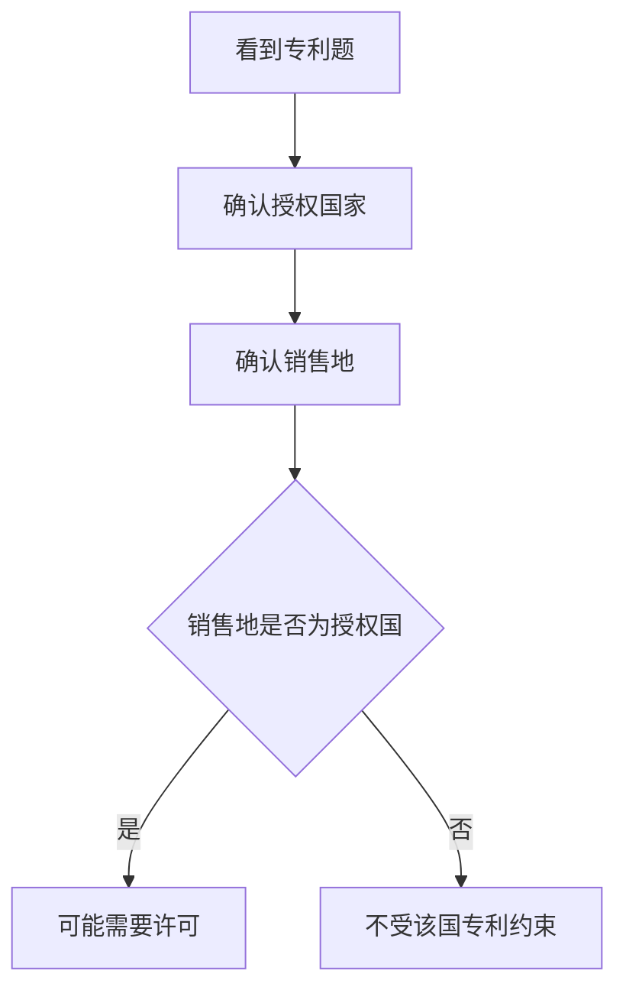
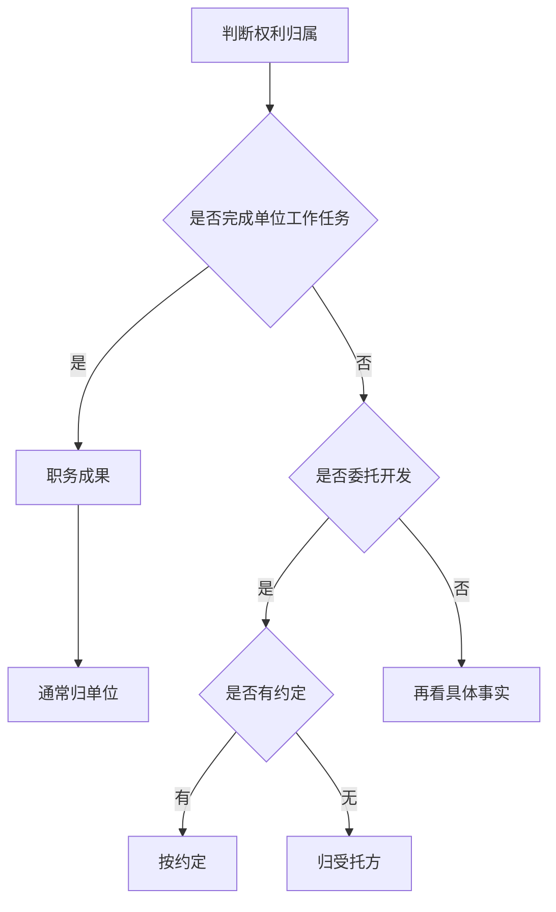
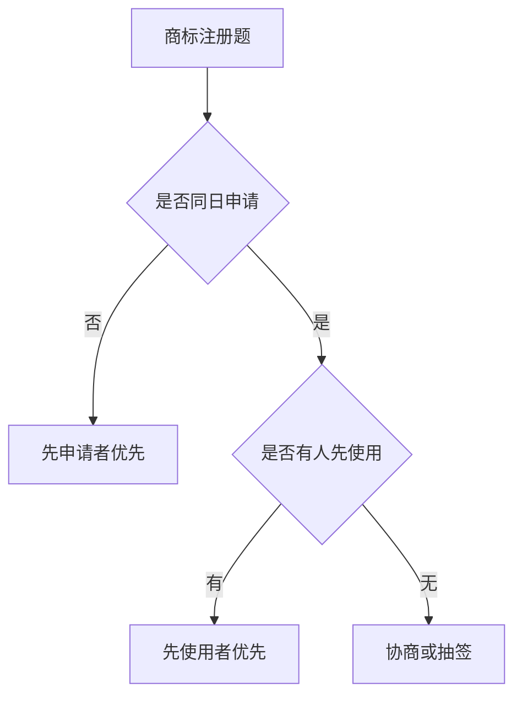

# chapter 4 - 知识产权与标准化基础：笔记和例题整理

> **适用对象**：软件设计师新手备考  

# 一、当前整理范围

```text
知识产权与标准化基础
├─ 1. 著作权
│  ├─ 著作人身权
│  ├─ 著作财产权
│  └─ 保护期限
├─ 2. 软件著作权
│  ├─ 产生时间
│  ├─ 保护客体
│  ├─ 不保护对象
│  └─ 基本法律文件
├─ 3. 权利归属
│  ├─ 职务作品
│  ├─ 职务发明
│  ├─ 委托开发
│  └─ 利用单位物质技术条件完成的成果
├─ 4. 侵权判定
│  ├─ 未经许可复制、发行、修改、署名
│  ├─ 善意购买侵权复制品
│  └─ 合理使用与引用
├─ 5. 商业秘密权
│  ├─ 技术信息
│  ├─ 经营信息
│  └─ 保密措施
├─ 6. 专利权
│  ├─ 地域性
│  ├─ 先申请原则
│  └─ 同日申请处理
├─ 7. 商标权
│  ├─ 注册商标所有人
│  ├─ 续展
│  ├─ 同日申请
│  └─ 近似商标
└─ 8. 标准化基础
   ├─ 标准分类
   └─ 标准代号
```

# 二、复习建议

| 轮次 | 目标 | 建议做法 | 关注重点 |
|---|---|---|---|
| 第 1 轮 | 建立框架 | 先背“权利类型—归属—期限—侵权”四条主线 | 著作权、软件著作权、职务作品、委托开发 |
| 第 2 轮 | 会做典型题 | 每类题抓题眼，不急着背整段法条 | “完成即产生”“有约定从约定”“先申请”“同日先使用” |
| 第 3 轮 | 处理易混项 | 把相似题放在一起比较 | 职务 vs 委托；专利 vs 商标；著作权 vs 商业秘密 |
| 第 4 轮 | 冲刺记忆 | 只看口诀表和错题题眼 | 保护期限、归属规则、侵权复制品处理 |

# 三、章节笔记

## 总记忆表

| 模块 | 记忆句 |
|---|---|
| 著作权期限 | **署名、修改、保护完整**永久；**发表权**有期限。 |
| 软件著作权产生 | **开发完成之日**产生，不等登记、不等发表。 |
| 软件著作权客体 | 保护**源程序、目标程序、软件文档**；不保护思想、算法本身、操作方法。 |
| 职务作品 | 为完成单位工作任务开发的软件或文档，考试中通常归**单位/公司**。 |
| 委托开发 | **有约定从约定，无约定归受托方**。 |
| 商业秘密 | 保护**未公开**且能带来利益并采取保密措施的技术信息、经营信息。 |
| 专利地域性 | 哪国授权，哪国保护；美国专利在中国不当然受保护。 |
| 专利申请 | **先申请先得**；同日申请一般协商，不能重复授权。 |
| 商标注册 | 先申请；同日则先使用；都未用或协商不成则抽签。 |
| 合理引用 | 只能引用**已发表**作品，用于介绍、评论或说明，不构成主要部分。 |

## 1. 著作权

### 1. 知识点

| 类别 | 权利 | 是否受时间限制 | 做题落点 |
|---|---|---|---|
| 著作人身权 | 发表权 | 是 | 问“受时间限制”时常选它 |
| 著作人身权 | 署名权 | 否 | 问“不受限制、永久保护”常选它 |
| 著作人身权 | 修改权 | 否 | 问“永久保护”也常选它 |
| 著作人身权 | 保护作品完整权 | 否 | 与署名权、修改权一起记 |
| 著作财产权 | 复制权、发行权、展览权等 | 是 | 选项中除四个人身权外，多数按财产权处理 |

### 2. 公式/模板

```text
著作权做题模板：
先看是否是四个人身权
├─ 署名权、修改权、保护作品完整权：永久
├─ 发表权：有期限
└─ 复制、发行、展览等：财产权，有期限
```

### 3. 例题分析

**例 1**：问“保护期受时间限制”的著作权权利。  
先抓题眼：受时间限制。署名、修改、保护完整都永久，发表权有期限，所以选**发表权**。

**例 2**：问“受到永久保护”的权利。  
先抓题眼：永久。若选项中有署名权、修改权、保护作品完整权，就优先从这三项中找。

### 4. 记忆技巧

```text
署名修改保完整，永久保护不用慌；
发表虽然是人身，保护期限要记清。
```

## 2. 专利地域性

### 1. 知识点

| 判断点 | 结论 | 例子 |
|---|---|---|
| 专利只在授权国有效 | 具有地域性 | 美国专利只在美国受保护 |
| 未在中国申请 | 在中国不享有中国专利保护 | 在中国销售不因该美国专利付费 |
| 返销授权国 | 可能落入授权国专利保护 | 返销美国要考虑美国专利许可 |

### 2. 流程图



### 3. 例题分析

**例 1**：美国专利未在中国申请，在中国销售是否需要支付美国专利许可费？  
答案方向：不需要。因为美国专利不自动在中国生效。

### 4. 记忆技巧

```text
专利有国界，授权在哪国，保护在哪国。
```

## 3. 软件著作权

### 1. 知识点

| 考点 | 正确说法 | 错误陷阱 |
|---|---|---|
| 产生时间 | 软件开发完成之日起产生 | 首次发表、登记认可、产生创作意图 |
| 保护客体 | 源程序、目标程序、软件文档 | 软件开发思想、处理过程、操作方法、数学概念 |
| 基本法律文件 | 《中华人民共和国著作权法》《计算机软件保护条例》 | 软件法、版权法等干扰项 |
| 购买软件 | 通常取得使用权或载体所有权 | 不当然取得复制权、著作权、商标权 |

### 2. 模板

```text
软件著作权判断：
完成了吗？完成即产生。
保护什么？程序和文档。
不保护什么？思想、方法、算法本身。
买到了什么？通常只是使用许可或载体所有权。
```

### 3. 例题分析

**例 1**：软件著作权什么时候产生？  
题眼是“产生时间”，不是“登记时间”。结论：**开发完成之日**。

**例 2**：软件著作权客体不包括什么？  
源程序、目标程序、软件文档都保护；软件开发思想不保护。

### 4. 记忆技巧

```text
程序文档受保护，思想方法不保护；
软件完成即有权，登记发表不是点。
```

## 4. 职务作品、职务发明与委托开发

### 1. 知识点

| 类型 | 题眼 | 权利归属 | 常见干扰 |
|---|---|---|---|
| 职务软件/文档 | 任职期间、完成公司任务、按公司规定、归档 | 公司/单位 | “独立完成”“业余时间”“实习身份” |
| 职务发明 | 为完成单位交给的工作任务 | 任务单位 | “兼职”“业余时间” |
| 委托开发 | A接受B委托开发 | 有约定从约定；无约定归受托方 | “委托方出钱所以归委托方” |
| 利用单位物质技术条件 | 实验室、材料、未公开资料 | 原则归单位，有特别约定从约定 | “一定归个人/一定归单位”绝对化选项 |

### 2. 流程图



### 3. 例题分析

**例 1**：程序员按公司规定编写软件文档并归档。  
题眼是“按公司规定、归档”。结论：职务作品，著作权归公司。

**例 2**：甲公司受乙公司委托开发软件，无合同约定。  
题眼是“委托开发、无约定”。结论：著作权归受托方甲公司。

### 4. 记忆技巧

```text
公司任务归公司，委托无约归受托；
业余兼职别迷惑，关键要看谁交活。
```

## 5. 侵权判定与合理使用

### 1. 知识点

| 情形 | 判断 | 做题方向 |
|---|---|---|
| 未经许可复制、销售软件 | 侵权 | 侵犯软件著作权 |
| 修改别人程序并署自己名 | 侵权 | 侵犯著作权和署名权相关权益 |
| 善意购入侵权复制品后知道 | 不能无条件继续使用 | 支付合理费用后可继续使用 |
| 合理使用 | 不经许可、不付报酬 | 但范围有限 |
| 学术引用 | 引用已发表作品，且不构成主要部分 | 不能引用未发表作品 |

### 2. 过程表

| 做题步骤 | 问自己什么 | 结论模板 |
|---|---|---|
| 第一步 | 软件是否已经完成？ | 完成即有著作权 |
| 第二步 | 是否未经许可复制、修改、署名、销售？ | 是则倾向侵权 |
| 第三步 | 是否善意购买侵权复制品？ | 知道后支付合理费用再继续使用 |
| 第四步 | 是否属于合理引用？ | 必须是已发表作品，且适量引用 |

### 3. 例题分析

**例 1**：甲把程序手稿扔掉，乙修改后署名发表。  
题眼是“程序已完成”。丢弃载体不等于放弃著作权，乙侵权。

**例 2**：企业不知情购买侵权软件，后来知道。  
题眼是“未知情购买，知道后继续使用”。结论：支付合理费用后可以继续使用。

### 4. 记忆技巧

```text
完成就有权，丢稿不丢权；
善意买盗版，知道后付钱。
```

## 6. 商业秘密权

### 1. 知识点

| 构成要件 | 说明 | 题目关键词 |
|---|---|---|
| 未公开 | 公众不能轻易获得 | 技术秘密、内部资料 |
| 有价值 | 能带来经济利益或竞争优势 | 技术领先、市场竞争优势 |
| 保密措施 | 权利人采取保密约束 | 保密制度、保密协议、员工保密约束 |

### 2. 例题分析

**例**：公司对软件技术信息、经营信息采取保密措施。  
题眼是“技术信息、经营信息、保密措施”。结论：商业秘密权。

### 3. 记忆技巧

```text
秘密三条件：没公开、有价值、有保密。
```

## 7. 专利权申请

### 1. 知识点

| 场景 | 规则 | 典型答案 |
|---|---|---|
| 先后申请同一发明 | 先申请原则 | 先申请人 |
| 同日申请同一发明 | 协商确定 | 协商确定申请人 |
| 同日申请且不能解决 | 可能共同申请、放弃补偿、都不授权 | 不能分别都授权 |
| 单纯算法、规则、代码 | 通常不能直接取得专利权 | 具体技术方案才可能 |

### 2. 例题分析

**例 1**：甲比乙早一天申请。  
题眼是“早一天”。结论：甲获得申请权。

**例 2**：甲先完成，乙先使用，但同一天申请。  
题眼是“同一天申请”。结论：不看先完成或先使用，由双方协商确定。

### 3. 记忆技巧

```text
专利先申请，同日靠协商；
先发明先使用，都不是首要项。
```

## 8. 商标权与商标注册

### 1. 知识点

| 考点 | 规则 | 易错点 |
|---|---|---|
| 商标权人 | 注册商标所有人 | 不是设计人、制作人、普通使用人 |
| 保护期限 | 可续展 | 因续展可能无限期拥有 |
| 同日申请 | 先使用者优先 | 比专利多一个“先使用”判断 |
| 同日且均未使用 | 协商或抽签 | 不能都注册近似商标 |
| 必须注册商标商品 | 烟草制品等 | 软件题中常作杂题出现 |
| 地名商标 | 县级以上行政区划地名一般不得用 | 有其他含义可能例外 |

### 2. 商标注册判断流程



### 3. 例题分析

**例 1**：甲乙同日申请近似商标，乙先使用。  
结论：乙获准注册。

**例 2**：甲乙同日申请相同商标，双方均未使用。  
结论：协商或抽签确定。

### 4. 记忆技巧

```text
商标先申请，同日看先用；
都没用抽签，续展可长久。
```

## 9. 标准化基础（同章低频补充）

### 1. 知识点

| 标准类型 | 常见代号或例子 | 记忆方向 |
|---|---|---|
| 国际标准 | ISO、IEC | 国际组织制定 |
| 国家标准 | GB、GB/T、GB/Z | 强制、推荐、指导 |
| 行业标准 | IEEE、GJB、QC 等 | 行业或专业领域 |
| 地方标准 | DB + 行政区划代码 | 地方一级行政机构 |
| 企业标准 | Q/ + 企业代号 | 企业内部制定 |

### 2. 记忆技巧

```text
GB强制，GB/T推荐，GB/Z指导；
DB看地方，Q/看企业。
```

# 四、按专题插入原题与解析

## 著作权保护期限

### 题 1
**原题**  
以下著作权权利中， （10） 的保护期受时间限制。（2015年下半年）

- A. 署名权
- B. 修改权
- C. 发表权
- D. 保护作品完整权

**解析**  
先抓题眼：看到“保护期受时间限制”，先区分著作人身权。署名权、修改权、保护作品完整权不受时间限制；发表权虽然属于人身权，但有期限限制。因此落到发表权。

**正确答案**  
C

**答案方向**  
发表权有期限；署名、修改、保护完整永久。

### 题 2
**原题**  
著作权中， （14） 的保护期不受限制。（2018年上半年）

- A. 发表权
- B. 发行权
- C. 署名权
- D. 展览权

**解析**  
先抓题眼：题眼是“不受限制”。四个选项中，署名权属于著作人身权且永久保护；发表权有期限，发行权和展览权属于财产权，也有期限。

**正确答案**  
C

**答案方向**  
看到“不受限制”，优先找署名权、修改权、保护作品完整权。

### 题 3
**原题**  
按照我国著作权法的权利保护期，以下权利中， （14） 受到永久保护。（2020年下半年）

- A. 发表权
- B. 修改权
- C. 复制权
- D. 发行权

**解析**  
先抓题眼：题眼是“永久保护”。修改权属于著作人身权中的永久保护权利；发表权、复制权、发行权都受期限限制。

**正确答案**  
B

**答案方向**  
永久保护三件套：署名、修改、保护完整。

## 专利地域性

### 题 4
**原题**  
中国企业M与美国公司L进行技术合作，合同约定M使用一项在有效期内的美国专利，但该项美国专利未在中国和其他国家提出申请。对于M销售依照该专利生产的产品，以下叙述正确的是 （11）。（2012年上半年）

- A. 在中国销售，M需要向L支付专利许可使用费
- B. 返销美国，M不需要向L支付专利许可使用费
- C. 在其他国家销售，M需要向L支付专利许可使用费
- D. 在中国销售，M不需要向L支付专利许可使用费

**解析**  
先抓题眼：先抓题眼：美国专利、未在中国申请。专利具有地域性，只在授权国受到保护。该专利在美国有效，在中国不受中国专利保护，所以在中国销售不需要因该美国专利支付许可费。

**正确答案**  
D

**答案方向**  
专利看地域：在哪国授权，在哪国保护。

### 题 5
**原题**  
美国某公司与中国某企业谈技术合作，合同约定使用1项美国专利，且该技术未在中国和其他国家申请专利。依照该专利生产的产品 （11） 需要向美国公司支付许可使用费。（2016年上半年）

- A. 在中国销售，中国企业
- B. 如果返销美国，中国企业不
- C. 在其他国家销售，中国企业
- D. 在中国销售，中国企业不

**解析**  
先抓题眼：把选项嵌回原句判断。美国专利只在美国受保护，在中国销售不需要向美国公司支付该美国专利许可费；若返销美国，则会落入美国专利保护地域。

**正确答案**  
D

**答案方向**  
把“不”字带回原句读一遍，专利地域性不会骗人。

## 软件著作权

### 题 6
**原题**  
关于软件著作权产生的时间，下面表述正确的是 （10）。（2009年上半年）

- A. 自作品首次公开发表时
- B. 自作者有创作意图时
- C. 自作品得到国家著作权行政管理部门认可时
- D. 自作品完成创作之日

**解析**  
先抓题眼：软件著作权自软件开发完成之日起产生，不以发表、登记、批准为条件。

**正确答案**  
D

**答案方向**  
软件完成即产生，登记不是产生条件。

### 题 7
**原题**  
软件著作权的客体不包括 （10）。（2012年上半年）

- A. 源程序
- B. 目标程序
- C. 软件文档
- D. 软件开发思想

**解析**  
先抓题眼：软件著作权保护计算机程序及其有关文档，包括源程序、目标程序和软件文档；思想、处理过程、操作方法、数学概念不受软件著作权保护。

**正确答案**  
D

**答案方向**  
保护表达，不保护思想。

### 题 8
**原题**  
以下关于计算机软件著作权的叙述中，正确的是 （12）。（2018年上半年）

- A. 非法进行拷贝，发布或更改软件的人被称为软件盗版者
- B. 《计算机软件保护条例》是国家知识产权局颁布的
- C. 软件著作权属于软件开发者，软件著作权自软件开发完成之日起产生
- D. 用户购买了具有版权的软件，则具有对该软件的使用权和复制权

**解析**  
先抓题眼：题眼是“正确”。软件著作权一般属于软件开发者，并且自开发完成之日起产生。购买正版软件通常取得使用许可，不当然取得复制权；《计算机软件保护条例》也不是国家知识产权局颁布。

**正确答案**  
C

**答案方向**  
完成即产生，购买不等于获得复制权。

### 题 9
**原题**  
（13） 是构成我国保护计算机软件著作权的两个基本法律文件。（2018年下半年）

- A. 《软件法》和《计算机软件保护条例》
- B. 《中华人民共和国著作权法》和《计算机软件保护条例》
- C. 《软件法》和《中华人民共和国著作权法》
- D. 《中华人民共和国版权法》和《计算机软件保护条例》

**解析**  
先抓题眼：我国保护计算机软件著作权的基本法律文件是《中华人民共和国著作权法》和《计算机软件保护条例》。

**正确答案**  
B

**答案方向**  
没有“软件法”，也不是“版权法”。

### 题 10
**原题**  
根据《计算机软件保护条例》的规定，对软件著作权的保护不包括 （12）。（2021年上半年）

- A. 目标程序
- B. 软件文档
- C. 源程序
- D. 开发软件所有的操作方法

**解析**  
先抓题眼：软件著作权保护源程序、目标程序和相关文档，不保护开发软件所用的思想、处理过程、操作方法或数学概念。

**正确答案**  
D

**答案方向**  
操作方法不属于软件著作权客体。

### 题 11
**原题**  
（12） 是构成我国保护计算机软件著作权的两个基本法律文件。（2021年下半年）

- A. 《计算机软件保护条例》和《软件法》
- B. 《中华人民共和国著作权法》和《软件法》
- C. 《中华人民共和国著作权法》和《计算机软件保护条例》
- D. 《中华人民共和国版权法》和《中华人民共和国著作权法》

**解析**  
先抓题眼：该题与2018年题同考点。基本文件是《中华人民共和国著作权法》和《计算机软件保护条例》。

**正确答案**  
C

**答案方向**  
法律文件题直接背固定搭配。

## 职务作品

### 题 12
**原题**  
王某是一名程序员，按公司规定完成软件文档并上交公司存档，自己没有留存。王某要求借出复印被公司拒绝。以下叙述正确的是 （11）。（2010年上半年）

- A. 该软件文档属于职务作品，著作权归公司
- B. 该软件文档不属于职务作品，程序员享有著作权
- C. 该软件文档属于职务作品，但程序员享有复制权
- D. 该软件文档不属于职务作品，著作权由公司和程序员共同享有

**解析**  
先抓题眼：题眼是“按公司规定完成、上交公司存档”。这是完成单位工作任务形成的软件文档，属于职务作品，著作权由公司享有。

**正确答案**  
A

**答案方向**  
按单位任务完成的软件和文档，默认公司享有。

## 职务发明

### 题 13
**原题**  
李某在某软件公司兼职，为完成该公司交给的工作，做出一项涉及计算机程序的发明。李某认为是业余时间完成，可以个人名义申请专利。该发明的专利申请权应归属 （12）。（2010年下半年）

- A. 李某
- B. 李某所在单位
- C. 李某兼职的软件公司
- D. 李某和软件公司约定的一方

**解析**  
先抓题眼：先抓题眼：为完成兼职软件公司交给的工作。是否业余时间不是核心，只要是完成该单位工作任务，就属于该单位的职务发明，申请权归交付任务的软件公司。

**正确答案**  
C

**答案方向**  
职务发明看任务来源，不看是不是业余时间。

## 职务作品

### 题 14
**原题**  
王某任职期间根据M公司的业务要求开发“海运出口业务系统”，并由公司使用。王某取得软件著作权登记证书，著作权人为王某。以下说法正确的是 （11）。（2011年下半年）

- A. 著作权属于王某
- B. 著作权属于M公司
- C. 著作权属于王某和M公司
- D. 王某获取的软件著作权登记证不可以撤销

**解析**  
先抓题眼：题眼是“任职期间、根据公司业务要求开发、公司使用”。登记证书不是权利归属的最终依据。该软件属于职务软件，著作权归M公司。

**正确答案**  
B

**答案方向**  
登记可纠错，职务软件归单位。

## 职务发明

### 题 15
**原题**  
X公司软件工程师张某兼职于Y科技公司，为完成Y公司交给的工作做出涉及计算机程序的发明。该专利申请权应归属 （11）。（2012年下半年）

- A. 张某
- B. X软件公司
- C. Y科技公司
- D. 张某和Y科技公司

**解析**  
先抓题眼：该题与兼职发明同型。关键不是张某原单位，而是为完成Y公司交给的任务，因此申请权归Y科技公司。

**正确答案**  
C

**答案方向**  
谁交任务、为谁完成，权利就看谁。

## 职务作品

### 题 16
**原题**  
王某是一名软件设计师，按公司规定编写软件文档并上交公司存档。这些软件文档属于职务作品且 （10）。（2013年上半年）

- A. 其著作权由公司享有
- B. 其著作权由软件设计师享有
- C. 除其署名权以外，著作权的其他权利由软件设计师享有
- D. 其著作权由公司和软件设计师共同享有

**解析**  
先抓题眼：按公司规定编写并归档的软件文档，是职务作品。考试中此类题稳定落点为公司享有著作权。

**正确答案**  
A

**答案方向**  
职务软件文档：公司享有。

### 题 17
**原题**  
王某每当软件开发完成后均按公司规定编写软件文档，并提交公司存档。那么该软件文档的著作权 （10） 享有。（2015年上半年）

- A. 应由公司
- B. 应由公司和王某共同
- C. 应由王某
- D. 除署名权以外，著作权的其他权利由王某

**解析**  
先抓题眼：题干仍是“公司规定、提交公司存档”。属于职务软件文档，著作权归公司。

**正确答案**  
A

**答案方向**  
看到“按公司规定、存档”，直接选公司。

### 题 18
**原题**  
王某独立承担公司综合信息管理系统程序设计工作，系统交付试运行后辞职并带走源程序，拒不交还。王某认为源程序由自己独立完成。王某的行为 （11）。（2015年下半年）

- A. 侵犯了公司的软件著作权
- B. 未侵犯公司的软件著作权
- C. 侵犯了公司的商业秘密权
- D. 不涉及侵犯公司的软件著作权

**解析**  
先抓题眼：题眼是“公司软件项目、任职期间、交付用户”。即使由王某独立编码，也属于职务软件，著作权归公司。带走源程序拒不交还，侵犯公司软件著作权。

**正确答案**  
A

**答案方向**  
独立完成不等于个人享有，先看是否职务任务。

### 题 19
**原题**  
某软件公司项目组程序员在程序编写完成后均按公司规定撰写文档并上交公司存档。该软件文档著作权应由 （12） 享有。（2017年下半年）

- A. 程序员
- B. 公司与项目组共同
- C. 公司
- D. 项目组全体人员

**解析**  
先抓题眼：软件文档按公司规定形成并归档，属于职务作品。著作权由公司享有。

**正确答案**  
C

**答案方向**  
项目组不是独立著作权主体，选公司。

### 题 20
**原题**  
王某完成某项软件开发后按公司规定进行软件归档。以下有关该软件著作权的叙述中，正确的是 （13）。（2018年上半年）

- A. 著作权应由公司和王某共同享有
- B. 著作权应由公司享有
- C. 著作权应由王某享有
- D. 除署名权以外，著作权的其它权利由王某享有

**解析**  
先抓题眼：题眼是“按公司规定进行软件归档”。这是典型职务软件，著作权归公司。

**正确答案**  
B

**答案方向**  
职务软件归公司，署名权另记。

### 题 21
**原题**  
李工是某软件公司的软件设计师，每当软件开发完成均按公司规定申请软件著作权，该软件的著作权 （13）。（2019年下半年）

- A. 应由李工享有
- B. 应由公司和李工共同享有
- C. 应由公司享有
- D. 除署名权以外，著作权的其他权利由李工享有

**解析**  
先抓题眼：题眼是“某软件公司的软件设计师、按公司规定申请”。该软件为职务软件，著作权由公司享有。

**正确答案**  
C

**答案方向**  
公司员工按规定开发的软件，优先选公司。

### 题 22
**原题**  
小王是非全日制研究生，在甲公司实习，负责公司某软件项目开发并撰写软件文档。以下叙述正确的是 （13）。（2020年下半年）

- A. 该软件文档属于职务作品，但小王享有全部权利
- B. 该软件文档属于职务作品，甲公司享有全部权利
- C. 该软件文档不属于职务作品，小王享有全部权利
- D. 该软件文档不属于职务作品，甲公司和小王共同享有全部权利

**解析**  
先抓题眼：题眼是“在甲公司实习、负责公司软件项目”。实习或非全日制身份不是核心，只要是完成公司任务，文档属于职务作品，甲公司享有权利。

**正确答案**  
B

**答案方向**  
身份不重要，任务属性重要。

## 委托开发

### 题 23
**原题**  
甲公司接受乙公司委托开发应用软件，双方没有订立任何书面合同。在此情形下 （10） 享有该软件的著作权。（2014年下半年）

- A. 甲公司
- B. 甲、乙公司共同
- C. 乙公司
- D. 甲、乙公司均不

**解析**  
先抓题眼：题眼是“委托开发、无合同约定”。委托开发有约定从约定；无约定，著作权归受托方。甲是受托开发方。

**正确答案**  
A

**答案方向**  
委托开发无约定，归受托方。

### 题 24
**原题**  
甲软件公司受乙企业委托开发信息系统管理软件，合同中未对著作权归属作明确约定。该软件著作权由 （10） 享有。（2017年上半年）

- A. 甲
- B. 乙
- C. 甲与乙共同
- D. 软件设计师

**解析**  
先抓题眼：仍是委托开发无约定。甲是受托方，著作权归甲。

**正确答案**  
A

**答案方向**  
委托方出钱不等于默认拥有著作权。

## 委托开发与物质条件

### 题 25
**原题**  
刘某完全利用任职单位的实验材料、实验室和不对外公开的技术资料完成一项发明。以下叙述正确的是 （12）。（2019年上半年）

- A. 无论有无特别约定，该成果都属于单位
- B. 原则上应归单位所有，但若单位与刘某对成果归属有特别约定时遵从约定
- C. 取决于是否是单位分派给刘某的
- D. 无论有无特别约定，该成果都属于刘某

**解析**  
先抓题眼：题眼是“完全利用任职单位实验材料、实验室、未公开技术资料”。原则上属于单位成果；但如果单位与完成者有特别约定，按约定处理。

**正确答案**  
B

**答案方向**  
利用单位物质技术条件：原则归单位，有约定从约定。

### 题 26
**原题**  
李某受非任职单位委托，利用该单位实验室、实验材料和技术资料开发软件产品。对该软件权利归属，表达正确的是 （12）。（2019年下半年）

- A. 该软件属于委托单位
- B. 若有特别约定则从约定；无约定原则上归属于李某
- C. 取决于是否属于单位分派给李某的
- D. 无论有无约定，该软件属于李某

**解析**  
先抓题眼：题眼是“非任职单位委托”。这是委托开发，不是职务作品。委托开发有约定从约定；无约定归受托开发者李某。

**正确答案**  
B

**答案方向**  
委托开发无约定归受托方，不因使用实验室自动归委托方。

## 委托开发

### 题 27
**原题**  
X公司接受Y公司的委托开发应用软件，双方没有订立任何书面合同。在此情形下， （13） 享有该软件著作权。（2021年下半年）

- A. X、Y公司共同
- B. X公司
- C. Y公司
- D. X、Y公司均不

**解析**  
先抓题眼：委托开发无书面合同约定时，著作权归受托方。X公司是接受委托并实际开发的一方。

**正确答案**  
B

**答案方向**  
委托开发固定题型：无约定选受托方。

## 侵权判定

### 题 28
**原题**  
程序员甲将近期编写的程序手稿扔到乙家垃圾筒，乙将该程序稍加修改并署乙名发表。以下说法正确的是 （11）。（2009年上半年）

- A. 乙的行为侵犯了甲的软件著作权
- B. 乙没有侵犯，因为甲已将程序手稿丢弃
- C. 乙没有侵犯，因为乙已将程序修改
- D. 甲没有发表该程序并弃之，乙修改后发表应享有著作权

**解析**  
先抓题眼：软件著作权自创作完成产生，不以发表为条件。丢弃手稿不等于放弃著作权，乙未经许可修改并署名发表，侵犯甲的软件著作权。

**正确答案**  
A

**答案方向**  
完成即有权；丢弃载体不等于放弃权利。

## 侵权复制品

### 题 29
**原题**  
甲经销商擅自复制并销售乙公司OA软件光盘构成侵权。丙企业未知情购入10张并安装使用，在知道为侵权复制品后，以下说法正确的是 （11）。（2013年上半年）

- A. 丙使用行为侵权，须承担赔偿责任
- B. 丙不侵权，可以继续使用
- C. 丙使用行为侵权，支付合理费用后可以继续使用
- D. 丙不侵权，不需承担任何法律责任

**解析**  
先抓题眼：题眼是“未知情购入，后来知道”。善意取得侵权复制品一般不承担赔偿责任，但知道后不能无条件继续使用；支付合理费用后可以继续使用。

**正确答案**  
C

**答案方向**  
善意购买后知道：支付合理费用，才可继续用。

## 署名权

### 题 30
**原题**  
张某参与开发管理系统软件后辞职，项目负责人将开发者署名改为接替工作的李某。该项目负责人的行为 （10）。（2016年上半年）

- A. 侵犯了张某开发者身份权（署名权）
- B. 不构成侵权，因为张某不是软件著作权人
- C. 只是行使管理者权利，不构成侵权
- D. 不构成侵权，因为张某已不是项目组成员

**解析**  
先抓题眼：题眼是“将开发者署名更改”。署名权属于著作人身权，职务作品中开发人员通常仍享有署名权。擅自改署名侵犯开发者身份权。

**正确答案**  
A

**答案方向**  
职务作品常考：财产权归单位，署名权仍要尊重。

## 侵权判定

### 题 31
**原题**  
某程序员受一公司委托开发软件，三个月后又受另一公司委托开发类似软件，仅将前一委托开发的软件略作修改即提交给第二家公司。此行为 （14）。（2018年下半年）

- A. 属于开发者的特权
- B. 属于正常使用著作权
- C. 不构成侵权
- D. 构成侵权

**解析**  
先抓题眼：第一个委托软件的权利归属至少受合同或委托关系约束，程序员不能把前一个成果略改后交给第二家公司。该行为侵犯前一软件权利人的著作权或相关权益。

**正确答案**  
D

**答案方向**  
换客户不能复用前客户成果交付。

## 侵权复制品

### 题 32
**原题**  
A经销商擅自复制并销售B公司OA软件光盘，C企业未知情购入100张并安装使用。C知道为侵权复制品后，以下说法正确的是 （14）。（2021年上半年）

- A. C使用行为侵权，须承担赔偿责任
- B. C使用行为侵权，支付合理费用后可以继续使用
- C. C不侵权，可以继续使用
- D. C不侵权，不需承担任何法律责任

**解析**  
先抓题眼：这是2013年同型题。善意购入者知道侵权事实后，不能免费继续使用；支付合理费用后可以继续使用。

**正确答案**  
B

**答案方向**  
未知情不是永久免责，知道后要处理。

### 题 33
**原题**  
广大公司擅自复制并销售恭大公司OA软件构成侵权。鸿达公司不知情购入并安装使用。知道为侵权复制品后，其使用行为 （14）。（2021年下半年）

- A. 侵权，支付合理费用后可以继续使用
- B. 侵权，须承担赔偿责任
- C. 不侵权，可继续使用
- D. 不侵权，不需承担任何法律责任

**解析**  
先抓题眼：同型题继续考“善意购入侵权复制品”。知道后若继续使用，需要支付合理费用。题目选项将落点写成“侵权，支付合理费用后可以继续使用”。

**正确答案**  
A

**答案方向**  
侵权复制品题，最稳选“支付合理费用后继续使用”。

## 商业秘密权

### 题 34
**原题**  
利用 （11） 可以对软件的技术信息、经营信息提供保护。（2010年下半年）

- A. 著作权
- B. 专利权
- C. 商业秘密权
- D. 商标权

**解析**  
先抓题眼：题眼是“技术信息、经营信息”。商业秘密权保护未公开、能带来经济利益、采取保密措施的信息。

**正确答案**  
C

**答案方向**  
技术秘密、经营秘密，优先商业秘密权。

## 商业秘密与商标

### 题 35
**原题**  
某软件公司财务软件技术领先并采取保密措施，还冠以“用友”商标但未注册。此情况下，公司仅享有该软件产品的 （11）。（2011年上半年）

- A. 软件著作权和专利权
- B. 商业秘密权和专利权
- C. 软件著作权和商业秘密权
- D. 软件著作权和商标权

**解析**  
先抓题眼：软件开发完成即享有软件著作权；采取保密措施保护技术秘密，可享有商业秘密权。商标未注册，不能说享有注册商标专用权；题干也未说明获得专利授权。

**正确答案**  
C

**答案方向**  
未注册商标不选商标权；未申请授权不选专利权。

## 商业秘密与专利

### 题 36
**原题**  
M软件公司的软件产品注册商标为M，并对员工进行了保密约束。此情形下该公司不享有 （10）。（2012年下半年）

- A. 商业秘密权
- B. 著作权
- C. 专利权
- D. 商标权

**解析**  
先抓题眼：注册商标对应商标权，软件开发完成有著作权，采取保密约束可保护商业秘密。题干没有申请或授权专利，因此不享有专利权。

**正确答案**  
C

**答案方向**  
专利权必须申请并授权，不能凭“技术领先”自动取得。

## 专利申请

### 题 37
**原题**  
两个以上申请人分别就相同内容的计算机程序发明创造，先后向国务院专利行政部门提出申请， （10） 可以获得专利申请权。（2010年上半年）

- A. 所有申请人均
- B. 先申请人
- C. 先使用人
- D. 先发明人

**解析**  
先抓题眼：专利申请采用先申请原则。先后申请时，先申请人获得专利申请权。

**正确答案**  
B

**答案方向**  
专利不是先发明，也不是先使用，而是先申请。

### 题 38
**原题**  
甲、乙公司分别完成相同计算机程序发明，甲先完成，乙先使用，双方同一天申请发明专利。此情形下， （11） 可获得专利权。（2015年上半年）

- A. 甲公司
- B. 甲、乙公司均
- C. 乙公司
- D. 由甲、乙公司协商确定谁

**解析**  
先抓题眼：题眼是“同一天申请”。专利同日申请相同发明创造时，不按先完成或先使用，通常由申请人协商确定。

**正确答案**  
D

**答案方向**  
同日申请不看先发明、先使用，看协商。

### 题 39
**原题**  
甲公司软件设计师完成一项涉及计算机程序的发明，之后乙公司也完成相同发明，甲、乙同一天申请。此情形下， （11） 是专利权申请人。（2016年下半年）

- A. 甲公司
- B. 甲、乙两公司
- C. 乙公司
- D. 由甲、乙公司协商确定的公司

**解析**  
先抓题眼：同日申请相同发明创造，先完成不是决定因素，应由双方协商确定申请人。

**正确答案**  
D

**答案方向**  
同日同发明：协商。

### 题 40
**原题**  
甲、乙同一天就同样发明创造提交专利申请。下列说法中，不可能采用 （12）。（2017年上半年）

- A. 甲、乙作为共同申请人
- B. 甲或乙一方放弃权利并从另一方得到补偿
- C. 甲、乙都不授予专利权
- D. 甲、乙都授予专利权

**解析**  
先抓题眼：同样发明创造不能同时授予两个重复专利。共同申请、一方放弃或均不授权都可能出现；分别都授权不可能。

**正确答案**  
D

**答案方向**  
一项发明不能双重授权。

### 题 41
**原题**  
甲、乙分别就相同内容的计算机软件发明创造提出专利申请，甲先于乙一日提出，则 （12）。（2020年下半年）

- A. 甲获得该项专利申请权
- B. 乙获得该项专利申请权
- C. 甲和乙都获得
- D. 甲和乙都不能获得

**解析**  
先抓题眼：先后申请时采用先申请原则，甲早一天提出，甲获得申请权。

**正确答案**  
A

**答案方向**  
先一天就是先申请。

## 商标权

### 题 42
**原题**  
软件商标权的权利人是指 （10）。（2010年下半年）

- A. 软件商标设计人
- B. 软件商标制作人
- C. 软件商标使用人
- D. 软件注册商标所有人

**解析**  
先抓题眼：商标权以注册商标专用权为核心，权利人是注册商标所有人，不是设计人、制作人或普通使用人。

**正确答案**  
D

**答案方向**  
商标权看注册所有人。

## 商标权保护期限

### 题 43
**原题**  
（10） 的保护期限是可以延长的。（2016年下半年）

- A. 专利权
- B. 商标权
- C. 著作权
- D. 商业秘密权

**解析**  
先抓题眼：商标权可以通过续展延长保护期限；专利权期限固定，著作权一般有法定期限，商业秘密无固定保护期但不是“延长保护期限”的典型表述。

**正确答案**  
B

**答案方向**  
能续展的是商标。

### 题 44
**原题**  
有可能无限期拥有的知识产权是 （12）。（2018年下半年）

- A. 著作权
- B. 专利权
- C. 商标权
- D. 集成电路布图设计权

**解析**  
先抓题眼：商标权可以不断续展，理论上可能无限期拥有。专利权和集成电路布图设计权都有固定期限，著作财产权也有期限。

**正确答案**  
C

**答案方向**  
无限续展，想到商标。

## 商标与侵权

### 题 45
**原题**  
甲购买工具软件并用其开发“恒友”软件。销售新软件时向客户提供工具软件复制品，则该行为 （13）。甲未注册“恒友”商标即推向市场并获好评，三个月后乙推出类似软件并注册“恒友”，其行为 （14）。（2019年上半年）

- （13）A. 侵犯了著作权
- （13）B. 不构成侵权行为
- （13）C. 侵犯了专利权
- （13）D. 属于不正当竞争
- （14）A. 侵犯了著作权
- （14）B. 不构成侵权行为
- （14）C. 侵犯了商标权
- （14）D. 属于不正当竞争

**解析**  
先抓题眼：第一空：购买工具软件只取得合法使用权，向客户提供其复制品属于未经许可复制发行，侵犯著作权。第二空：甲虽未注册商标，但已使用并形成市场声誉，乙抢注并推出类似软件，按考试语境落到不正当竞争。

**正确答案**  
（13）A；（14）D

**答案方向**  
软件复制品看著作权；抢注他人已有影响标识看不正当竞争。

## 商标注册

### 题 46
**原题**  
甲、乙两软件公司同日申请“用友”和“用有”商标注册，两财务软件相似。甲第一次使用时间为2009年7月，乙为2009年5月。此情形下， （11） 能获准注册。（2014年上半年）

- A. “用友”
- B. “用友”与“用有”都
- C. “用有”
- D. 由甲、乙抽签结果确定谁

**解析**  
先抓题眼：题眼是“同日申请、近似商标、乙先使用”。商标同日申请时，先使用者优先。乙的“用有”先使用，故乙获准注册。

**正确答案**  
C

**答案方向**  
商标同日申请先看先使用。

### 题 47
**原题**  
甲、乙软件公司同日申请“大堂”和“大唐”商标注册，两财务软件相似，且双方均不同意放弃。此情形下， （11） 获准注册。（2014年下半年）

- A. “大堂”
- B. “大堂”与“大唐”都能
- C. “大唐”
- D. 由甲、乙抽签结果确定谁能

**解析**  
先抓题眼：同日申请近似商标，若无法通过先使用或协商解决，则通过抽签确定。

**正确答案**  
D

**答案方向**  
同日、近似、协商不成：抽签。

### 题 48
**原题**  
甲、乙两厂产品类似且都使用“B”商标。同一天申请注册，申请前两厂均未使用“B”。此情形下， （12） 能核准注册。（2016年下半年）

- A. 甲厂
- B. 由甲、乙厂抽签确定的厂
- C. 乙厂
- D. 甲、乙两厂

**解析**  
先抓题眼：同日申请且都未使用，不能按先使用判断，只能协商或抽签。选项中给出抽签确定。

**正确答案**  
B

**答案方向**  
商标同日同未用：抽签。

### 题 49
**原题**  
甲、乙互联网公司同日申请“宏达”和“鸿达”商标，两个库存管理软件相似。甲第一次使用为2019年7月，乙为2019年5月。此情景下， （13） 能获准注册。（2021年上半年）

- A. “宏达”
- B. “宏达”和“鸿达”均
- C. 由甲、乙协商哪个
- D. “鸿达”

**解析**  
先抓题眼：同日申请近似商标，先使用者优先。乙的“鸿达”使用时间更早。

**正确答案**  
D

**答案方向**  
同日申请先看先使用，乙更早。

## 杂题

### 题 50
**原题**  
下列智力成果中，能取得专利权的是 （10）。（2009年下半年）

- A. 计算机程序代码
- B. 游戏的规则和方法
- C. 计算机算法
- D. 用于控制测试过程的程序

**解析**  
先抓题眼：单纯程序代码、游戏规则方法、算法本身通常不授予专利。若程序用于控制测试过程，体现具体技术方案和技术效果，则可作为发明创造申请专利。

**正确答案**  
D

**答案方向**  
算法本身不行，技术控制方案可以。

## 许可使用

### 题 51
**原题**  
软件权利人与被许可方签订许可合同。合同约定时间和地域范围内，权利人不得再许可第三人以相同方法使用，但权利人可以自己使用。该项许可使用是 （11）。（2009年下半年）

- A. 独家许可使用
- B. 独占许可使用
- C. 普通许可使用
- D. 部分许可使用

**解析**  
先抓题眼：题眼是“不得再许可第三人，但权利人自己可以使用”。这是独家许可使用。独占许可通常连权利人自己也不能使用；普通许可则可再许可多人。

**正确答案**  
A

**答案方向**  
自己还能用，是独家；自己也不能用，是独占。

## 翻译权

### 题 52
**原题**  
下列关于软件著作权中翻译权的叙述不正确的是：翻译权是指 （10） 的权利。（2011年上半年）

- A. 将原软件从一种自然语言文字转换成另一种自然语言文字
- B. 将原软件从一种程序设计语言转换成另一种程序设计语言
- C. 软件著作权人对其软件享有的以其它各种语言文字形式再表现
- D. 对软件的操作界面或者程序中涉及的语言文字翻译成另一种语言文字

**解析**  
先抓题眼：软件著作权中的翻译权主要针对自然语言文字转换。将一种程序设计语言改写成另一种程序设计语言，更接近改编而非翻译。

**正确答案**  
B

**答案方向**  
自然语言是翻译；程序语言转换不是翻译权的典型落点。

## 合理使用

### 题 53
**原题**  
（10） 指可以不经著作权人许可，不需支付报酬，使用其作品。（2011年下半年）

- A. 合理使用
- B. 许可使用
- C. 强制许可使用
- D. 法定许可使用

**解析**  
先抓题眼：题干直接给出“不经许可、不支付报酬”。这是合理使用的核心特征。

**正确答案**  
A

**答案方向**  
不许可不付费，叫合理使用。

## 引用资料

### 题 54
**原题**  
为说明某一问题，在学术论文中需要引用某些资料。以下叙述中， （13） 是不正确的。（2013年下半年）

- A. 既可引用发表的作品，也可引用未发表的作品
- B. 只能限于介绍、评论作品
- C. 只要不构成自己作品的主要部分，可适当引用资料
- D. 不必征得原作者同意，不需要支付报酬

**解析**  
先抓题眼：合理引用只能引用已经发表的作品，并且限于介绍、评论或说明问题，引用不得构成自己作品的主要部分，通常不需许可和付酬。A说可以引用未发表作品，错误。

**正确答案**  
A

**答案方向**  
合理引用：已发表、为说明、适当量、不付酬。

## 著作权法不保护对象

### 题 55
**原题**  
以下作品中，不适用或不受著作权法保护的是 （14）。（2013年下半年）

- A. 某教师在课堂上的讲课
- B. 某作家的作品《红河谷》
- C. 最高人民法院组织编写的《行政诉讼案例选编》
- D. 国务院颁布的《计算机软件保护条例》

**解析**  
先抓题眼：法律、法规、国家机关具有立法、行政、司法性质的文件及其正式译文，不适用著作权法保护。《计算机软件保护条例》属于法规。

**正确答案**  
D

**答案方向**  
法律法规、公文、时事新闻、通用表格公式不保护。

## 美术作品原件

### 题 56
**原题**  
王某买了一幅美术作品原件，则他享有该美术作品的 （10）。（2014年上半年）

- A. 著作权
- B. 所有权
- C. 展览权
- D. 所有权与其展览权

**解析**  
先抓题眼：购买美术作品原件取得物的所有权；美术作品原件所有人通常还享有对该原件的展览权，但不当然取得复制、发行等著作权。

**正确答案**  
D

**答案方向**  
买原件：有所有权和原件展览权，不等于买著作权。

## 强制注册商标

### 题 57
**原题**  
根据我国商标法，下列商品中必须使用注册商标的是 （11）。（2017年上半年）

- A. 医疗仪器
- B. 墙壁涂料
- C. 无糖食品
- D. 烟草制品

**解析**  
先抓题眼：考试常考必须使用注册商标的商品：人用药品和烟草制品等。四个选项中只有烟草制品符合。

**正确答案**  
D

**答案方向**  
强制注册记烟草、人用药品。

## 地名商标

### 题 58
**原题**  
我国商标法规定申请注册商标不得使用县级以上行政区地名。以下商标注册申请，经审查，能获准注册的是 （13）。（2017年下半年）

- A. 青岛（市）
- B. 黄山（市）
- C. 海口（市）
- D. 长沙（市）

**解析**  
先抓题眼：县级以上行政区划地名一般不得作为商标，但地名具有其他含义的除外。黄山除行政区划外，也具有著名自然景观含义，考试通常落到可注册。

**正确答案**  
B

**答案方向**  
地名一般不能用，有其他含义可例外。

## 软件光盘购买

### 题 59
**原题**  
李某购买了一张有注册商标的应用软件光盘，则李某享有 （14）。（2017年下半年）

- A. 注册商标专用权
- B. 该光盘的所有权
- C. 该软件的著作权
- D. 该软件的所有权

**解析**  
先抓题眼：购买软件光盘取得的是该物理光盘的所有权和软件使用许可，不取得注册商标专用权，也不取得软件著作权或软件本身所有权。

**正确答案**  
B

**答案方向**  
买光盘，只买到载体所有权。

# 五、本章总结

## 先抓最稳的分

先拿定义型和固定搭配题：软件著作权完成即产生，保护源程序、目标程序和软件文档；基本法律文件是《中华人民共和国著作权法》和《计算机软件保护条例》；著作权永久保护三件套是署名权、修改权、保护作品完整权。

## 再抓计算题

本章严格来说没有复杂计算题，但有“规则推导题”。例如专利先申请、商标同日先使用、委托开发无约定归受托方。这类题要像做计算题一样按步骤套规则，不要凭生活经验判断。

## 最后处理零散题

最后处理商业秘密、合理引用、地名商标、美术作品原件、许可使用等杂题。这些题数量不多，但容易因概念混淆丢分。建议把它们放入冲刺口诀表反复看。

## 冲刺版口诀总表

```text
一、著作权
署名修改保完整，永久保护不用慌；
发表权有期限，财产权也有期限。

二、软件著作权
软件完成即有权，登记发表不是点；
源目文档受保护，思想方法不保护。

三、职务与委托
公司任务归公司，独立完成也别慌；
委托开发看约定，无约定归受托方。

四、侵权
完成就有权，丢稿不丢权；
善意买盗版，知道后付钱。

五、商业秘密
未公开、有价值、有保密，三项满足才成秘密。

六、专利
专利有国界，授权才保护；
专利先申请，同日靠协商。

七、商标
商标先申请，同日看先用；
都没用抽签，续展可长久。

八、杂题
合理引用已发表，不能成为主内容；
买光盘得载体，买原件有展览；
烟草制品要注册，地名商标看例外。
```


---

## 使用建议

1. 第一遍只看“总记忆表”和“冲刺版口诀总表”。
2. 第二遍按专题刷题，每题只抓题眼，不背长句。
3. 第三遍重点看错题：职务作品、委托开发、侵权复制品、商标同日申请最容易混。
