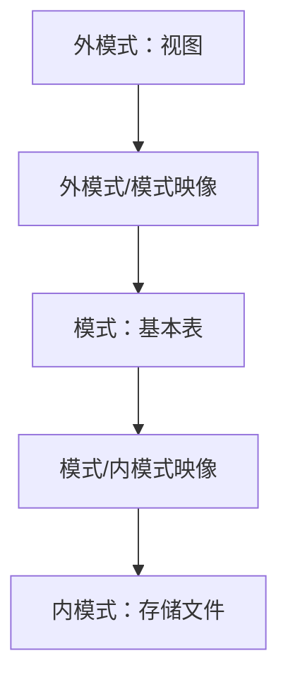
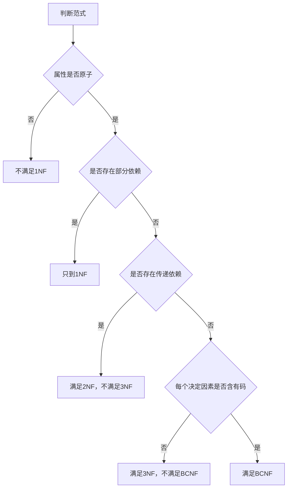
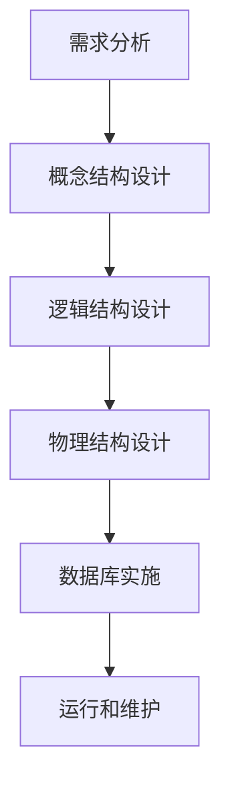
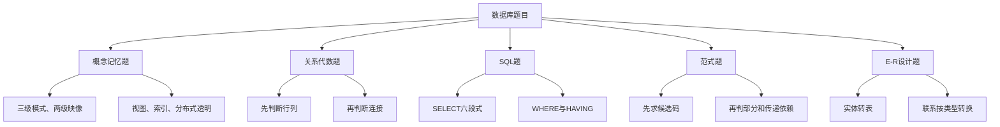

# chapter 5 - 数据库技术基础

>  **适用对象**：软件设计师新手备考  

# 一、当前整理范围

```text
数据库技术基础
├─ 1. 数据库基本概念
│  ├─ 数据库、数据库系统、DBMS
│  ├─ DBMS功能
│  └─ 数据独立性
├─ 2. 数据模型
│  ├─ 概念数据模型
│  ├─ 基本数据模型
│  ├─ 数据模型三要素
│  └─ 关系模型
├─ 3. 三级模式与两级映像
│  ├─ 外模式
│  ├─ 模式
│  ├─ 内模式
│  ├─ 外模式/模式映像
│  └─ 模式/内模式映像
├─ 4. 关系数据库基础
│  ├─ 关系、属性、元组、域
│  ├─ 码、候选码、主码、外码
│  └─ 实体完整性、参照完整性、用户自定义完整性
├─ 5. 关系代数
│  ├─ 并、差、笛卡尔积
│  ├─ 选择、投影
│  ├─ 连接、自然连接、外连接
│  └─ 关系代数转 SQL
├─ 6. SQL语言
│  ├─ DDL、DML、DCL
│  ├─ SELECT查询
│  ├─ GROUP BY与HAVING
│  ├─ 视图
│  ├─ 索引
│  └─ 存储过程、函数、触发器
├─ 7. 函数依赖与属性闭包
│  ├─ 函数依赖
│  ├─ 完全依赖、部分依赖、传递依赖
│  ├─ Armstrong公理
│  └─ 属性闭包求候选码
├─ 8. 范式
│  ├─ 1NF
│  ├─ 2NF
│  ├─ 3NF
│  └─ BCNF
├─ 9. E-R图与数据库设计
│  ├─ 实体、属性、联系
│  ├─ 1:1、1:n、m:n转换
│  ├─ E-R图合并冲突
│  └─ 需求分析、概念设计、逻辑设计、物理设计
├─ 10. 事务与恢复
│  ├─ ACID
│  ├─ 故障类型
│  ├─ 转储
│  └─ 日志恢复
├─ 11. 并发控制与封锁
│  ├─ 丢失修改
│  ├─ 读脏数据
│  ├─ 不可重复读
│  ├─ S锁、X锁
│  └─ 三级封锁协议
└─ 12. 分布式数据库
   ├─ 分片透明
   ├─ 复制透明
   ├─ 位置透明
   ├─ 逻辑透明
   └─ 共享性、自治性、可用性、分布性
```

# 二、复习建议

| 轮次 | 目标 | 建议做法 | 关注重点 |
|---|---|---|---|
| 第 1 轮 | 建立数据库章节骨架 | 先背“三级模式—关系代数—SQL—范式—事务”五条主线 | 外模式/模式/内模式、选择/投影/连接、ACID |
| 第 2 轮 | 会做常规选择题 | 把原题按专题刷，不按年份刷 | 数据模型、两级映像、SQL子句顺序、分布式透明性 |
| 第 3 轮 | 攻克计算与推导题 | 专门练关系代数、自然连接、属性闭包、范式判断 | 自然连接列数、候选码、2NF/3NF/BCNF |
| 第 4 轮 | 冲刺记忆 | 只看总记忆表、口诀表和错题 | 视图/基本表/存储文件，S锁/X锁，数据库设计阶段 |

# 三、章节笔记

## 总记忆表

| 模块 | 记忆句 |
|---|---|
| 数据模型 | **二维表**就是关系模型。 |
| 三级模式 | **视图外、表模式、文件内**。 |
| 两级映像 | **物理改模式/内模式，逻辑改外模式/模式**。 |
| 关系代数 | **选择挑行，投影挑列，连接拼表**。 |
| 自然连接 | 同名属性只保留一份，元组必须在同名属性上相等。 |
| SQL顺序 | `SELECT → FROM → WHERE → GROUP BY → HAVING → ORDER BY`。 |
| 视图 | 虚表，存定义，不一定存数据。 |
| 索引 | 加快查询，但会增加维护成本。 |
| 函数依赖 | X值相同，则Y值必相同，记作 $X \to Y$。 |
| 2NF | 消除非主属性对码的**部分依赖**。 |
| 3NF | 消除非主属性对码的**传递依赖**。 |
| BCNF | 每个决定因素都必须包含候选码。 |
| E-R转换 | **m:n联系必须单独成表**。 |
| 数据库设计 | 需求定边界，概念画E-R，逻辑转关系并规范化。 |
| 事务ACID | 原子全不全；一致守规则；隔离看不见；持久不丢失。 |
| 封锁 | S锁可共享读，X锁独占读写。 |
| 分布式透明性 | 分片不知怎么切，复制不知几份，位置不知在哪，逻辑不知模型。 |

## 1. 数据库基本概念与数据模型

### 1. 知识点

| 名称 | 含义 | 做题题眼 |
|---|---|---|
| 数据库 DB | 长期存储、有组织、可共享的数据集合 | “数据集合” |
| 数据库管理系统 DBMS | 管理数据库的软件 | “定义、操纵、运行控制、维护” |
| 数据库系统 DBS | 数据库 + 硬件 + 软件 + 人员 | 范围最大 |
| 概念数据模型 | 从用户角度描述数据 | E-R模型 |
| 基本数据模型 | 从计算机实现角度描述数据 | 层次、网状、关系、面向对象 |
| 关系模型 | 用二维表表达实体及联系 | “二维表格结构” |
| 数据模型三要素 | 数据结构、数据操作、完整性约束 | 静态、动态、约束 |

### 2. 模板

```text
看到“二维表” → 关系模型
看到“用户观点、现实世界抽象” → 概念模型 / E-R模型
看到“计算机实现” → 基本数据模型
看到“模型三要素” → 数据结构 + 数据操作 + 完整性约束
```

### 3. 例题分析

**例 1**：采用二维表格结构表达实体类型及实体间联系的数据模型是什么？  
先抓题眼：**二维表格结构**。数据库中用二维表表示数据的是关系模型。  
**正确答案**：C（关系模型）

### 4. 记忆技巧

```text
二维表，关系模；
E-R图，概念模；
增删改查是操作，完整性管约束。
```

## 2. 三级模式结构与两级映像

### 1. 知识点

| 层次 | 又称 | 对应对象 | 说明 |
|---|---|---|---|
| 外模式 | 用户模式 / 子模式 | **视图** | 用户看到的数据局部逻辑结构 |
| 模式 | 概念模式 | **基本表** | 数据库全体数据的逻辑结构 |
| 内模式 | 存储模式 | **存储文件** | 数据物理存储结构 |

| 映像 | 连接层次 | 作用 | 对应独立性 |
|---|---|---|---|
| 外模式/模式映像 | 外模式 ↔ 模式 | 用户视图到概念结构的转换 | **逻辑独立性** |
| 模式/内模式映像 | 模式 ↔ 内模式 | 概念结构到物理存储的转换 | **物理独立性** |

> 一个数据库可以有多个外模式，但通常只有一个模式和一个内模式。

### 2. 流程图



### 3. 例题分析

**例 1**：外模式、模式、内模式分别对应什么？  
先抓题眼：三级模式和具体对象的对应。视图是用户看到的局部数据；基本表是逻辑表；存储文件是物理层。  
**正确答案**：B（视图、基本表和存储文件）

**例 2**：物理独立性和逻辑独立性分别通过修改什么映像完成？  
先抓题眼：物理变化在“模式—内模式”之间；逻辑变化在“外模式—模式”之间。  
**正确答案**：D（模式与内模式之间的映像、外模式与模式之间的映像）

### 4. 记忆技巧

```text
外视图，模基表，内文件；
物理往内改，逻辑往外改。
```

## 3. 关系数据库基本术语与完整性约束

### 1. 知识点

| 术语 | 含义 | 做题落点 |
|---|---|---|
| 关系 | 一张二维表 | 表 |
| 元组 | 表中的一行 | 记录 |
| 属性 | 表中的一列 | 字段 |
| 域 | 属性取值范围 | 数据类型或值域 |
| 目/度 | 属性个数 | 列数 |
| 基数 | 元组个数 | 行数 |
| 候选码 | 能唯一标识元组的最小属性组 | 可作为主码 |
| 主码 | 被选中的候选码 | 主键 |
| 主属性 | 包含在任一候选码中的属性 | 判断范式要用 |
| 非主属性 | 不包含在任何候选码中的属性 | 2NF、3NF常考 |
| 外码 | 本关系属性是另一关系的主码 | 参照完整性 |

| 完整性 | 规则 | 典型题眼 |
|---|---|---|
| 实体完整性 | 主属性不能取空值 | 主码不能为空 |
| 参照完整性 | 外码要么为空，要么等于被参照关系某个主码值 | 外键引用 |
| 用户自定义完整性 | 由具体应用语义决定 | 年龄范围、成绩范围 |

### 2. 例题分析

**例 1**：某关系中属性组能唯一标识一个元组，且去掉任一属性后不能唯一标识，该属性组是什么？  
先抓题眼：唯一标识 + 最小。  
**正确答案**：候选码

### 3. 记忆技巧

```text
表是关系，行元组，列属性；
候选能唯一，主码挑一个；
主码不为空，外码要能对上。
```

## 4. 关系代数

### 1. 知识点

| 运算 | 符号 | 作用 | 记忆 |
|---|---|---|---|
| 并 | $R \cup S$ | 合并两个结构相同关系的元组 | 行合并 |
| 差 | $R - S$ | 属于R但不属于S的元组 | 行相减 |
| 笛卡尔积 | $R \times S$ | 两表所有元组两两组合 | 列相加、行相乘 |
| 选择 | $\sigma_F(R)$ | 选满足条件的行 | 横向挑行 |
| 投影 | $\pi_A(R)$ | 选指定属性列 | 纵向挑列 |
| 连接 | $R \bowtie_F S$ | 按条件拼接元组 | 条件拼表 |
| 自然连接 | $R \bowtie S$ | 同名属性相等后连接，且同名列只保留一份 | 同名合并 |
| 外连接 | 左、右、全外连接 | 保留不匹配元组，用NULL补齐 | 不丢边 |

### 2. 公式/模板

若 $R$ 有 $r$ 个属性、$m$ 个元组，$S$ 有 $s$ 个属性、$n$ 个元组，则：

$$
R \times S \text{ 的属性列数}=r+s
$$

$$
R \times S \text{ 的元组数}=m \times n
$$

若 $R(A,B,C,D)$ 与 $S(A,C,E,F)$ 自然连接，共同属性为 $A,C$，则：

$$
\text{自然连接后属性列数}=4+4-2=6
$$

自然连接列数模板：

```text
自然连接列数 = R列数 + S列数 - 同名属性个数
自然连接元组数 = 找同名属性取值相等的组合数
```

### 3. 例题分析

**例 1**：给定 $R(A,B,C,D)$ 和 $S(A,C,E,F)$，自然连接后的属性列数是多少？  
先抓题眼：共同属性是 $A,C$，同名属性只保留一份。  
计算：$4+4-2=6$。  
**正确答案**：B（6）

**例 2**：给定 $R(A,B,C,D,E)$ 和 $S(A,C,E,F,G)$，自然连接后属性列是什么？  
先抓题眼：共同属性 $A,C,E$ 只保留一份；其余属性 $B,D,F,G$ 保留。  
结果属性为：$R.A,R.B,R.C,R.D,R.E,S.F,S.G$。  
**正确答案**：B

### 4. 记忆技巧

```text
选择挑行，投影挑列；
笛卡尔积行相乘，列相加；
自然连接看同名，同名相等才拼接；
同名列只留一份。
```

## 5. 关系代数转 SQL

### 1. 知识点

| 关系代数 | SQL对应 | 说明 |
|---|---|---|
| 投影 $\pi$ | SELECT | 选列 |
| 选择 $\sigma$ | WHERE | 选行 |
| 笛卡尔积 $\times$ | FROM R, S | 多表来源 |
| 连接条件 | WHERE R.a = S.a | 表之间匹配 |
| 自然连接 | 同名属性相等条件 | SQL中要显式写条件 |

### 2. 模板

```sql
SELECT 投影列
FROM 关系1, 关系2
WHERE 连接条件 AND 查询条件;
```

例如：

```sql
SELECT R.A, R.B, R.C, R.D, S.E
FROM R, S
WHERE R.C = S.C AND R.D = S.D;
```

### 3. 例题分析

**例 1**：若 $R(A,B,C,D)$ 和 $S(C,D,E)$ 自然连接后查询 $R$ 中属性和 $S.E$，SQL 的 FROM 应写什么？  
先抓题眼：涉及两个关系，FROM中应同时出现 $R,S$。  
**正确答案**：C（R, S）

**例 2**：自然连接 $R(A,B,C,D)$ 与 $S(C,D,E)$ 的 WHERE 条件是什么？  
先抓题眼：共同属性是 $C,D$。  
应写：`R.C = S.C AND R.D = S.D`。  
**答案方向**：共同属性全部相等，不能漏写，也不能用 OR。

### 4. 记忆技巧

```text
π进SELECT，σ进WHERE；
多表进FROM，连接条件也在WHERE。
```

## 6. SQL语言

### 1. 知识点

| 类别 | 常用语句 | 作用 |
|---|---|---|
| DDL | CREATE、ALTER、DROP | 定义、修改、删除数据库对象 |
| DML | SELECT、INSERT、UPDATE、DELETE | 查询和更新数据 |
| DCL | GRANT、REVOKE | 授权和收回权限 |
| 事务控制 | COMMIT、ROLLBACK | 提交和回滚事务 |

### 2. SELECT基本模板

```sql
SELECT [DISTINCT] 目标列
FROM 表名或视图名
WHERE 条件
GROUP BY 分组列
HAVING 分组条件
ORDER BY 排序列 ASC|DESC;
```

| 子句 | 执行含义 | 常见考法 |
|---|---|---|
| SELECT | 输出哪些列 | 聚集函数、别名 |
| FROM | 从哪些表取数据 | 多表连接 |
| WHERE | 分组前筛选行 | 不能直接写聚集条件 |
| GROUP BY | 按列分组 | 与聚集函数搭配 |
| HAVING | 分组后筛选组 | 常与COUNT、AVG等搭配 |
| ORDER BY | 排序 | ASC升序、DESC降序 |

### 3. 聚集函数

| 函数 | 含义 |
|---|---|
| COUNT | 计数 |
| SUM | 求和 |
| AVG | 平均值 |
| MAX | 最大值 |
| MIN | 最小值 |

### 4. 例题分析

**例 1**：查询各种零件的平均单价、最高单价与最低单价之间差距，应使用哪些函数？  
先抓题眼：平均单价对应 `AVG(单价)`；最高与最低差距对应 `MAX(单价)-MIN(单价)`；“各种零件”要按零件号分组。  
**答案方向**：`SELECT 零件号, AVG(单价), MAX(单价)-MIN(单价) FROM P GROUP BY 零件号;`

**例 2**：`HAVING` 可以单独使用吗？  
先抓题眼：HAVING是分组后的筛选。软件设计师考试中通常认为它应与 `GROUP BY` 搭配使用。  
**答案方向**：分组条件用 HAVING，普通行条件用 WHERE。

### 5. 记忆技巧

```text
where先筛行，group再分组；
having筛分组，order最后排。
```

## 7. 视图、索引、存储过程与触发器

### 1. 知识点

| 对象 | 本质 | 作用 | 易错点 |
|---|---|---|---|
| 视图 | 虚表 | 简化查询、隐藏数据、提供安全性 | 不一定实际存储数据 |
| 索引 | 辅助存取结构 | 提高查询速度 | 更新时要维护索引 |
| 存储过程 | 预先编译的一组SQL程序 | 封装操作、隐藏表结构、供第三方调用 | 常用于安全的数据更新接口 |
| 触发器 | 事件触发的过程 | 自动维护约束、审计 | 由INSERT/UPDATE/DELETE等触发 |

### 2. 视图模板

```sql
CREATE VIEW 视图名(列名列表)
AS
SELECT 查询语句
WITH CHECK OPTION;
```

### 3. 索引模板

```sql
CREATE [UNIQUE] INDEX 索引名
ON 表名(列名 ASC|DESC);
```

### 4. 例题分析

**例 1**：数据库安全机制中，向第三方提供什么来调用数据更新，从而不暴露关系模式？  
先抓题眼：第三方调用、数据更新、隐藏表结构。视图偏“看”，存储过程偏“封装操作”。  
**正确答案**：B（存储过程）

### 5. 记忆技巧

```text
视图像窗口，索引像目录；
过程封操作，触发器自动动。
```

## 8. 函数依赖与属性闭包

### 1. 知识点

| 类型 | 定义 | 例子 |
|---|---|---|
| 函数依赖 | 若X相同则Y必相同，记作 $X \to Y$ | 学号 → 姓名 |
| 平凡依赖 | $Y \subseteq X$ 时 $X \to Y$ | AB → A |
| 非平凡依赖 | $Y \nsubseteq X$ 时 $X \to Y$ | A → B |
| 完全依赖 | X能决定Y，X任一真子集不能决定Y | (学号,课程号) → 成绩 |
| 部分依赖 | X能决定Y，X的真子集也能决定Y | (学号,课程号) → 姓名 |
| 传递依赖 | $X \to Y, Y \to Z$，则Z传递依赖于X | 学号 → 系号 → 系名 |

### 2. 属性闭包模板

求 $X^+$：

```text
第1步：把X中的属性放入X+
第2步：扫描函数依赖集F
第3步：若某依赖左部已经包含在X+中，则把右部加入X+
第4步：重复扫描，直到X+不再变化
第5步：若X+包含全部属性，则X是超码；若再无真子集能决定全部属性，则X是候选码
```

### 3. 例题分析

**例 1**：已知 $F=\{A\to B, B\to C\}$，求 $A^+$。  
先抓题眼：从A出发能推出什么。  
过程：$A^+=\{A\}$；由 $A\to B$ 得到B；由 $B\to C$ 得到C。  
结论：$A^+=\{A,B,C\}$。

### 4. 记忆技巧

```text
闭包就是“从我能推出谁”；
候选码就是“能推出全部，而且不能再删”。
```

## 9. 范式

### 1. 知识点

| 范式 | 要求 | 消除的问题 | 做题题眼 |
|---|---|---|---|
| 1NF | 属性不可再分 | 表中不能套表、不能多值属性 | 原子性 |
| 2NF | 1NF + 非主属性完全依赖于码 | 部分依赖 | 组合码时常考 |
| 3NF | 2NF + 非主属性不传递依赖于码 | 传递依赖 | 非主属性经中间属性推出 |
| BCNF | 每个决定因素都包含候选码 | 主属性相关异常 | 左部必须是超码 |

### 2. 判断流程



### 3. 例题分析

**例 1**：关系 $R(学号,课程号,姓名,成绩)$，函数依赖为 $(学号,课程号)\to 成绩$，$学号\to 姓名$。该关系有什么问题？  
先抓题眼：候选码是 $(学号,课程号)$，但姓名只依赖于学号，即依赖于候选码的一部分。  
结论：存在**部分依赖**，不满足2NF。  
**答案方向**：分解为学生表和选课表。

**例 2**：关系 $R(学号,系号,系名)$，函数依赖为 $学号\to 系号$，$系号\to 系名$。该关系有什么问题？  
先抓题眼：学号通过系号推出系名。  
结论：存在**传递依赖**，不满足3NF。  
**答案方向**：分解为学生表和系表。

### 4. 记忆技巧

```text
1NF看原子，2NF去部分；
3NF去传递，BCNF看决定因素。
```

## 10. E-R图与逻辑结构设计

### 1. 知识点

| E-R元素 | 含义 | 转换为关系模式时 |
|---|---|---|
| 实体 | 可区分的对象 | 转成一个关系模式 |
| 属性 | 实体或联系的特征 | 转成关系的属性 |
| 联系 | 实体之间的对应关系 | 根据联系类型转换 |

| 联系类型 | 转换规则 | 考试落点 |
|---|---|---|
| 1:1 | 可合并到任一方，也可单独成表 | 不一定单独成表 |
| 1:n | 通常把1方主码加入n方 | 不一定单独成表 |
| m:n | 必须把联系转成独立关系模式 | 必考 |

### 2. E-R合并冲突

| 冲突类型 | 说明 | 例子 |
|---|---|---|
| 属性冲突 | 同一属性取值类型、范围、单位不一致 | 工资单位“元/月”和“万元/年” |
| 命名冲突 | 同名异义或异名同义 | “编号”含义不同；“客户”和“顾客”同义 |
| 结构冲突 | 同一对象在不同E-R图中抽象方式不同 | 一个图中“地址”为属性，另一个图中“地址”为实体 |

### 3. 例题分析

**例 1**：两个实体之间的联系在什么类型下必须转换成独立关系模式？  
先抓题眼：必须单独成表。多对多联系需要同时保存两端主码以及联系自身属性，因此必须独立成表。  
**正确答案**：D（*:*）

### 4. 记忆技巧

```text
一对一，可并任一边；
一对多，主码放多边；
多对多，联系单独建。
```

## 11. 数据库设计阶段

### 1. 知识点

| 阶段 | 主要任务 | 典型成果 |
|---|---|---|
| 需求分析 | 收集需求、确定系统边界 | 需求说明文档、数据字典、数据流图 |
| 概念结构设计 | 抽象实体、属性、联系 | E-R图 |
| 逻辑结构设计 | E-R图转关系模式、规范化 | 关系模式、用户视图、完整性约束 |
| 物理结构设计 | 确定存储结构、索引、存取路径 | 存储方案、索引方案 |
| 实施 | 建库、装入数据、编写应用 | 可运行系统 |
| 运行维护 | 监控、调整、备份恢复 | 维护记录 |

### 2. 流程图



### 3. 例题分析

**例 1**：确定系统边界和关系规范化分别在哪个阶段进行？  
先抓题眼：系统边界属于需求分析；关系规范化属于逻辑结构设计。  
**正确答案**：A（需求分析和逻辑设计）

**例 2**：逻辑结构设计阶段以哪个阶段形成的什么作为设计依据？  
先抓题眼：逻辑设计是在需求分析之后进行，需要需求说明、数据字典和数据流图作为依据。  
**正确答案**：A，C

### 4. 记忆技巧

```text
需求定边界，概念画E-R；
逻辑转关系，物理定存取。
```

## 12. 事务管理、备份与恢复

### 1. 知识点

| ACID | 含义 | 题眼 |
|---|---|---|
| 原子性 Atomicity | 事务操作要么全做，要么全不做 | “不可分割”“全做或全不做” |
| 一致性 Consistency | 事务执行前后数据库保持一致状态 | “不破坏约束” |
| 隔离性 Isolation | 并发事务之间互不干扰 | “提交前对其他事务不可见” |
| 持久性 Durability | 提交后结果永久保存 | “系统故障也不丢失” |

| 故障类型 | 说明 | 恢复依据 |
|---|---|---|
| 事务故障 | 某个事务内部出错 | 日志撤销 |
| 系统故障 | 系统停止运行、重启 | 日志恢复 |
| 介质故障 | 磁盘等存储介质损坏 | 后备副本 + 日志 |
| 病毒破坏 | 人为程序破坏 | 备份与安全机制 |

### 2. 恢复模板

```text
数据库恢复 = 尽可能短时间内恢复到故障发生前或某个一致状态
基本手段 = 数据转储 + 日志文件
静态转储 = 转储期间不允许修改数据库
动态转储 = 转储期间允许数据库操作
海量转储 = 全部转储
增量转储 = 只转储上次以后变化的数据
```

### 3. 例题分析

**例 1**：多个事务并发执行时，某事务提交前更新操作对其他事务不可见，这是事务的什么性质？  
先抓题眼：对其他事务不可见。  
**正确答案**：C（隔离性）

**例 2**：事务提交后，即使系统发生故障，执行结果仍不会丢失，这是什么性质？  
先抓题眼：提交后不丢。  
**正确答案**：D（持久性）

**例 3**：数据库恢复是什么？  
先抓题眼：恢复不是重装系统，而是恢复数据状态。  
**正确答案**：D（在尽可能短的时间内，把数据库恢复到故障发生前的状态）

### 4. 记忆技巧

```text
原子全不全，一致守规则；
隔离看不见，持久提交不丢。
```

## 13. 并发控制与封锁

### 1. 知识点

| 问题 | 含义 | 原因 |
|---|---|---|
| 丢失修改 | 一个事务的修改覆盖另一个事务修改 | 写写冲突 |
| 读脏数据 | 读到其他事务未提交的数据 | 读到脏值 |
| 不可重复读 | 同一事务两次读同一数据结果不同 | 读期间被改 |

| 锁 | 含义 | 兼容性 |
|---|---|---|
| 共享锁 S锁 | 只读锁 | S锁之间兼容 |
| 排他锁 X锁 | 写锁 / 独占锁 | 与S锁、X锁都不兼容 |

| 已加锁情况 | 其他事务再加S锁 | 其他事务再加X锁 |
|---|---|---|
| 已有S锁 | 成功 | 失败 |
| 已有X锁 | 失败 | 失败 |

### 2. 三级封锁协议

| 协议 | 规则 | 能解决的问题 |
|---|---|---|
| 一级封锁协议 | 修改前加X锁，事务结束释放 | 丢失修改 |
| 二级封锁协议 | 一级 + 读前加S锁，读完释放 | 丢失修改、读脏数据 |
| 三级封锁协议 | 一级 + 读前加S锁，事务结束释放 | 丢失修改、读脏数据、不可重复读 |

### 3. 例题分析

**例 1**：若事务T对数据A加了共享锁，其他事务对A再加共享锁和排他锁能否成功？  
先抓题眼：已有S锁。S锁之间兼容，X锁与S锁不兼容。  
结论：加共享锁成功，加排他锁失败。  
**正确答案**：C

**例 2**：若数据A已有排他锁，其他事务还能加共享锁或排他锁吗？  
先抓题眼：已有X锁。X锁独占，与任何锁都不兼容。  
结论：共享锁和排他锁都失败。  
**答案方向**：看到X锁，其他锁基本都失败。

### 4. 记忆技巧

```text
S锁读共享，S和S能共处；
X锁写独占，谁来都不行。
```

## 14. 分布式数据库

### 1. 知识点

| 概念 | 含义 | 题眼 |
|---|---|---|
| 分片透明 | 不知道表如何被分块存储 | “怎么分块” |
| 复制透明 | 不知道数据复制到哪些节点、如何复制 | “几份副本” |
| 位置透明 | 不知道数据存放的物理位置 | “在哪个场地” |
| 逻辑透明 | 不知道局部场地使用哪种数据模型 | “局部数据模型” |
| 共享性 | 数据分布在不同节点但可共享 | “数据共享” |
| 自治性 | 每个节点可独立管理本地数据 | “本地独立管理” |
| 可用性 | 某场地故障时可用其他副本 | “故障不瘫痪” |
| 分布性 | 数据存储在不同场地 | “不同场地存储” |

### 2. 例题分析

**例 1**：用户无需知道数据存放的物理位置，是什么透明？  
先抓题眼：物理位置。  
**正确答案**：D（位置透明）

**例 2**：用户无需知道逻辑访问的表具体如何分块存储，是什么透明？  
先抓题眼：分块。  
**正确答案**：C（分片透明）

**例 3**：某场地故障时，系统可使用其他场地副本而不至于瘫痪，是什么特性？  
先抓题眼：故障后仍可用。  
**正确答案**：C（可用性）

### 3. 记忆技巧

```text
分片不知怎么切，复制不知几份存；
位置不知在哪里，逻辑不知啥模型；
故障不瘫痪，记作可用性。
```

# 四、按专题插入原题与解析

## 专题一：数据模型、三级模式、两级映像

### 题 1
**原题**  
采用二维表格结构表达实体类型及实体间联系的数据模型是（51）。（2009年上半年）

- A. 层次模型
- B. 网状模型
- C. 关系模型
- D. 面向对象模型

**解析**  
先抓题眼：二维表格结构。数据库中二维表就是关系模型。层次模型是树形结构，网状模型是图状结构，面向对象模型以对象为核心。  
**正确答案**：C

**答案方向**  
看到“二维表”，直接选关系模型。

### 题 2
**原题**  
数据库系统通常采用三级模式结构：外模式、模式和内模式。这三级模式分别对应数据库的（51）。（2015年下半年）

- A. 基本表、存储文件和视图
- B. 视图、基本表和存储文件
- C. 基本表、视图和存储文件
- D. 视图、存储文件和基本表

**解析**  
先抓题眼：外模式、模式、内模式的顺序。外模式对应视图，模式对应基本表，内模式对应存储文件。  
**正确答案**：B

**答案方向**  
固定记忆：外视图、模基表、内文件。

### 题 3
**原题**  
数据库系统中的视图、存储文件和基本表分别对应数据库系统结构中的（51）。（2018年下半年）

- A. 模式、内模式和外模式
- B. 外模式、模式和内模式
- C. 模式、外模式和内模式
- D. 外模式、内模式和模式

**解析**  
先抓题眼：题目顺序是“视图、存储文件、基本表”。视图对应外模式，存储文件对应内模式，基本表对应模式。  
**正确答案**：D

**答案方向**  
不要被顺序绕晕，先分别配对，再看选项顺序。

### 题 4
**原题**  
数据的物理独立性和逻辑独立性分别是通过修改（51）来完成的。（2016年上半年）

- A. 外模式与内模式之间的映像、模式与内模式之间的映像
- B. 外模式与内模式之间的映像、外模式与模式之间的映像
- C. 外模式与模式之间的映像、模式与内模式之间的映像
- D. 模式与内模式之间的映像、外模式与模式之间的映像

**解析**  
先抓题眼：物理独立性和逻辑独立性。物理存储变化影响内模式，因此靠模式/内模式映像；逻辑结构变化影响模式和外模式之间的关系，因此靠外模式/模式映像。  
**正确答案**：D

**答案方向**  
物理往内找，逻辑往外找。

### 题 5
**原题**  
以下关于数据库两级映像的叙述中，正确的是（51）。（2019年下半年）

- A. 模式/内模式映像实现了外模式到内模式之间的相互转换
- B. 模式/内模式映像实现了概念模式到内模式之间的相互转换
- C. 外模式/模式的映像实现了概念模式到内模式之间的相互转换
- D. 外模式/内模式的映像实现了外模式到内模式之间的相互转换

**解析**  
先抓题眼：模式就是概念模式。模式/内模式映像连接概念模式与内模式，所以B正确。数据库没有“外模式/内模式映像”这一标准两级映像。  
**正确答案**：B

**答案方向**  
两级映像只有两个：外/模，模/内。

## 专题二：关系代数

### 题 6
**原题**  
给定关系 $R(A,B,C,D)$ 和关系 $S(A,C,E,F)$，对其进行自然连接运算后的属性列为（54）个。（2016年下半年）

- A. 4
- B. 5
- C. 6
- D. 8

**解析**  
先抓题眼：自然连接，同名属性只保留一份。R有4列，S有4列，共同属性是A、C两个，所以结果列数为 $4+4-2=6$。  
**正确答案**：C

**答案方向**  
自然连接列数 = 两表列数之和 - 同名属性数。

### 题 7
**原题**  
给定关系 $R(A,B,C,D)$ 和 $S(C,D,E)$，若关系R与S进行自然连接运算，则运算后的元组属性列数为（55）。（2018年下半年）

- A. 4
- B. 5
- C. 6
- D. 7

**解析**  
先抓题眼：共同属性是C、D两个。R有4列，S有3列，自然连接后同名列只保留一份，因此列数为 $4+3-2=5$。  
**正确答案**：B

**答案方向**  
同名属性越多，结果列数减少越多。

### 题 8
**原题**  
给定关系 $R(A,B,C,D,E)$ 和关系 $S(A,C,E,F,G)$，对其进行自然连接运算后其结果集的属性列为（51）。（2019年上半年）

- A. R.A, R.C, R.E, S.A, S.C, S.E
- B. R.A, R.B, R.C, R.D, R.E, S.F, S.G
- C. R.A, R.B, R.C, R.D, R.E, S.A, S.C, S.E
- D. R.A, R.B, R.C, R.D, R.E, S.A, S.C, S.E, S.F, S.G

**解析**  
先抓题眼：自然连接后的属性列。共同属性A、C、E只保留一份，R中B、D保留，S中F、G保留。  
**正确答案**：B

**答案方向**  
自然连接不是简单拼接，重复的同名列不能重复出现。

### 题 9
**原题**  
下列查询 $B=“大数据”$ 且 $F=“开发平台”$，结果集属性列为A、B、C、F的关系代数表达式中，查询效率最高的是（56）。（2016年下半年）

**解析**  
先抓题眼：查询效率最高。关系代数优化的基本原则是：**先选择、先投影，再连接**。也就是尽早减少参与连接的元组数和属性列数。  
**正确答案**：选择“先对相关关系做 $B=大数据$、$F=开发平台$ 的选择，再投影必要列，最后连接”的选项。

**答案方向**  
效率题不看形式复杂度，优先选“选择下推、投影下推”的表达式。

### 题 10
**原题**  
关系R、S进行左外联接、右外联接和完全外联接时，如何判断元组个数？

**解析**  
先抓题眼：外连接。自然连接结果先算出来；左外连接在自然连接基础上补左表未匹配元组；右外连接补右表未匹配元组；完全外连接两边都补。  
**正确答案**：以原题表中匹配情况为准，按“自然连接 + 未匹配行补NULL”计算。

**答案方向**  
外连接题不要只数匹配行，要看保留哪一侧的不匹配行。

## 专题三：关系代数转SQL与SQL查询

### 题 11
**原题**  
若有关系 $R(A,B,C,D)$ 和 $S(C,D,E)$，则与关系代数表达式等价的SQL语句如下：

```sql
SELECT （53） FROM （54） WHERE （55）;
```

（54）应选择什么？

- A. R
- B. S
- C. R, S
- D. RS

**解析**  
先抓题眼：表达式涉及R和S两个关系。SQL中多表查询要在FROM中列出两个关系。  
**正确答案**：C

**答案方向**  
关系代数里出现几个关系，SQL的FROM通常就列几个表。

### 题 12
**原题**  
给定关系模式 $R(A,B,C,D)$、$S(C,D,E)$，SQL语句中自然连接条件应写为哪种形式？

**解析**  
先抓题眼：共同属性是C和D。自然连接要求共同属性都相等，因此WHERE中应写：

```sql
R.C = S.C AND R.D = S.D
```

**正确答案**：选择同时包含 `R.C = S.C` 与 `R.D = S.D`，且用 `AND` 连接的选项。

**答案方向**  
自然连接条件不能漏共同属性，也不能用OR。

### 题 13
**原题**  
给定关系 $R(A,B,C,D)$ 和 $S(B,C,E,F)$，与关系代数表达式等价的SQL语句如下：

```sql
SELECT （54） FROM R, S （55）;
```

若题目连接条件只涉及 $R.B=S.B$，则（55）应选择什么？

- A. WHERE R.B = S.B
- B. HAVING R.B = S.B
- C. WHERE R.B = S.E
- D. HAVING R.B = S.E

**解析**  
先抓题眼：普通连接条件写在WHERE中，不写HAVING。HAVING用于分组后的筛选。  
**正确答案**：A

**答案方向**  
连接条件用WHERE；分组聚集条件才考虑HAVING。

### 题 14
**原题**  
某销售公司数据库的零件P关系中，同一种零件可由不同供应商供应，一个供应商可以供应多种零件。零件关系的主键为（53）。

- A. 零件号, 零件名称
- B. 零件号, 供应商
- C. 零件号, 供应商所在地
- D. 供应商, 供应商所在地

**解析**  
先抓题眼：同一种零件可由不同供应商供应，所以单独零件号不能唯一确定一条记录；一个供应商可以供应多种零件，所以单独供应商也不能唯一确定。零件号+供应商可以唯一标识某供应商供应的某零件。  
**正确答案**：B

**答案方向**  
主键要能唯一标识一行，遇到多对多供应关系常用组合键。

### 题 15
**原题**  
查询各种零件的平均单价、最高单价与最低单价之间差距的SQL语句，应如何写关键部分？

**解析**  
先抓题眼：“各种零件”表示按零件号分组；平均单价用 `AVG`；最高最低差距用 `MAX - MIN`。  
**正确答案**：选择含有 `AVG(单价), MAX(单价)-MIN(单价)` 和 `GROUP BY 零件号` 的选项。

**答案方向**  
“各种/每种/每个”常提示GROUP BY。

## 专题四：视图、索引、函数、过程

### 题 16
**原题**  
视图是数据库中的什么对象？

**解析**  
先抓题眼：视图由查询定义导出。它是虚表，数据库中通常保存视图定义，而不是把视图数据作为基本表独立保存。  
**正确答案**：虚表

**答案方向**  
看到“隐藏部分数据、简化查询、安全访问”，优先想到视图。

### 题 17
**原题**  
数据库的安全机制中，通过提供（56）供第三方开发人员调用进行数据更新，从而保证数据库的关系模式不会被第三方所获取。（2021年下半年）

- A. 触发器
- B. 存储过程
- C. 视图
- D. 索引

**解析**  
先抓题眼：供第三方调用、进行数据更新、隐藏关系模式。存储过程可以封装对表的访问和更新逻辑，只暴露过程接口。  
**正确答案**：B

**答案方向**  
“封装数据库操作接口”选存储过程。

### 题 18
**原题**  
用SQL创建“给定学院名求该学院教师数”的函数时，函数返回类型应写什么？

**解析**  
先抓题眼：函数返回教师数量，数量是整数。SQL函数定义中返回类型一般写 `returns integer`，局部变量声明写 `declare d_count integer`。  
**正确答案**：第一个空选A，第二个空选D

**答案方向**  
返回类型用 `returns`，局部变量用 `declare`。

## 专题五：函数依赖与范式

### 题 19
**原题**  
若关系模式中每个分量都是不可再分的数据项，则该关系模式属于哪一范式？

**解析**  
先抓题眼：不可再分。第一范式要求属性值具有原子性。  
**正确答案**：1NF

**答案方向**  
原子性对应1NF。

### 题 20
**原题**  
若关系模式已经满足1NF，且每个非主属性都完全函数依赖于码，则属于哪一范式？

**解析**  
先抓题眼：非主属性完全依赖于码。2NF就是在1NF基础上消除非主属性对码的部分依赖。  
**正确答案**：2NF

**答案方向**  
“完全依赖于码”对应2NF。

### 题 21
**原题**  
若关系模式已经满足2NF，且不存在非主属性对码的传递依赖，则属于哪一范式？

**解析**  
先抓题眼：消除传递依赖。3NF在2NF基础上消除非主属性对码的传递依赖。  
**正确答案**：3NF

**答案方向**  
“无传递依赖”对应3NF。

### 题 22
**原题**  
Armstrong公理中，若 $X\to Y$，且 $Y\to Z$，则可推出什么？

**解析**  
先抓题眼：依赖传递。由 $X\to Y$ 和 $Y\to Z$ 可推出 $X\to Z$，这就是传递律。  
**正确答案**：选择 $X\to Z$ 的选项

**答案方向**  
函数依赖推理常考自反律、增广律、传递律。

### 题 23
**原题**  
如何判断一个属性组是否为候选码？

**解析**  
先抓题眼：候选码 = 能推出全部属性 + 最小。先求属性闭包，如果闭包包含关系模式全部属性，则该属性组是超码；再检查能否删掉其中某个属性，若不能删，则是候选码。  
**正确答案**：闭包包含全部属性且无真子集能包含全部属性

**答案方向**  
候选码题一定做闭包，不能凭感觉。

## 专题六：E-R图与数据库设计

### 题 24
**原题**  
如下E-R图中，两个实体R1、R2之间有一个联系E，当E的类型为（51）时必须将E转换成一个独立的关系模式？（2021年上半年）

- A. 1:1
- B. 1:*
- C. *:1
- D. *:*

**解析**  
先抓题眼：必须独立成关系模式。多对多联系需要保存两个实体的主码以及联系本身属性，因此必须转成独立关系。  
**正确答案**：D

**答案方向**  
多对多联系，单独建表。

### 题 25
**原题**  
确定系统边界和关系规范化分别在数据库设计的（51）阶段进行。（2010年上半年）

- A. 需求分析和逻辑设计
- B. 需求分析和概念设计
- C. 需求分析和物理设计
- D. 逻辑设计和概念设计

**解析**  
先抓题眼：确定系统边界属于需求分析；关系规范化属于逻辑结构设计。  
**正确答案**：A

**答案方向**  
需求定边界，逻辑做规范化。

### 题 26
**原题**  
在数据库逻辑结构设计阶段，需要（51）阶段形成的（52）作为设计依据。（2014年下半年）

（51）
- A. 需求分析
- B. 概念结构设计
- C. 物理结构设计
- D. 数据库运行和维护

（52）
- A. 程序文档、数据字典和数据流图
- B. 需求说明文档、程序文档和数据流图
- C. 需求说明文档、数据字典和数据流图
- D. 需求说明文档、数据字典和程序文档

**解析**  
先抓题眼：逻辑结构设计以前的依据来自需求分析成果。需求分析的典型成果包括需求说明文档、数据字典和数据流图。  
**正确答案**：A，C

**答案方向**  
需求分析成果：需求说明、数据字典、数据流图。

### 题 27
**原题**  
关系规范化在数据库设计的（52）阶段进行。（2016年上半年）

- A. 需求分析
- B. 概念设计
- C. 逻辑设计
- D. 物理设计

**解析**  
先抓题眼：规范化是对关系模式进行优化，属于逻辑结构设计阶段。  
**正确答案**：C

**答案方向**  
E-R转关系、关系规范化，都属于逻辑设计。

## 专题七：事务、恢复与封锁

### 题 28
**原题**  
“当多个事务并发执行时，任一事务的更新操作直到其成功提交的整个过程对其他事务都是不可见的”，这一性质通常被称为事务的（53）。（2014年上半年）

- A. 原子性
- B. 一致性
- C. 隔离性
- D. 持久性

**解析**  
先抓题眼：对其他事务不可见。事务之间互不干扰是隔离性。  
**正确答案**：C

**答案方向**  
“并发、不可见、互不干扰”对应隔离性。

### 题 29
**原题**  
事务的（56）是指，当某个事务提交后，即使系统发生故障，事务的执行结果仍不会丢失。（2019年下半年）

- A. 原子性
- B. 一致性
- C. 隔离性
- D. 持久性

**解析**  
先抓题眼：提交后不丢失。事务提交后的结果永久有效是持久性。  
**正确答案**：D

**答案方向**  
“COMMIT后不丢”就是持久性。

### 题 30
**原题**  
软硬件故障常造成数据库中的数据破坏。数据库恢复就是（53）。（2009年下半年）

- A. 重新安装数据库管理系统和应用程序
- B. 重新安装应用程序，并将数据库做镜像
- C. 重新安装数据库管理系统，并将数据库做镜像
- D. 在尽可能短的时间内，把数据库恢复到故障发生前的状态

**解析**  
先抓题眼：数据库恢复的对象是数据一致状态，不是简单重装软件。  
**正确答案**：D

**答案方向**  
恢复题选“恢复到故障发生前状态”。

### 题 31
**原题**  
若事务T对数据A加了共享锁，其他事务对数据A加共享锁和排他锁的结果分别是什么？

- A. 共享锁、排他锁都成功
- B. 共享锁、排他锁都失败
- C. 共享锁成功，排他锁失败
- D. 排他锁成功，共享锁失败

**解析**  
先抓题眼：已有共享锁。共享锁与共享锁兼容，共享锁与排他锁不兼容。  
**正确答案**：C

**答案方向**  
S锁只和S锁兼容。

### 题 32
**原题**  
若事务T对数据A加了排他锁，其他事务对数据A加共享锁和排他锁的结果分别是什么？

- A. 共享锁、排他锁都成功
- B. 共享锁、排他锁都失败
- C. 共享锁成功，排他锁失败
- D. 排他锁成功，共享锁失败

**解析**  
先抓题眼：已有排他锁。排他锁是独占锁，其他事务不能再加任何锁。  
**正确答案**：B

**答案方向**  
X锁谁都不兼容。

## 专题八：分布式数据库与数据仓库

### 题 33
**原题**  
在分布式数据库系统中，（55）是指用户无需知道数据存放的物理位置。（2013年下半年）

- A. 分片透明
- B. 复制透明
- C. 逻辑透明
- D. 位置透明

**解析**  
先抓题眼：物理位置。用户不需要知道数据在哪个场地，就是位置透明。  
**正确答案**：D

**答案方向**  
“在哪里”对应位置透明。

### 题 34
**原题**  
在分布式数据库中，局部数据模型透明，即用户或应用程序无需知道局部使用的是哪种数据模型，这是（53）；用户不需要知道逻辑上访问的表具体如何分块存储，这是（54）。（2015年下半年）

- A. 分片透明
- B. 复制透明
- C. 位置透明
- D. 逻辑透明

**解析**  
先抓题眼：局部数据模型对应逻辑透明；如何分块存储对应分片透明。  
**正确答案**：D，A

**答案方向**  
模型是逻辑，分块是分片。

### 题 35
**原题**  
当某一场地故障时，系统可以使用其他场地上的副本而不至于使整个系统瘫痪。这称为分布式数据库的（56）。（2019年上半年）

- A. 共享性
- B. 自治性
- C. 可用性
- D. 分布性

**解析**  
先抓题眼：某场地故障，系统仍可使用。故障后仍能提供服务是可用性。  
**正确答案**：C

**答案方向**  
“故障不瘫痪”对应可用性。

### 题 36
**原题**  
某集团公司需要从时间、地区和商品种类三个维度分析某家店商品销售数据，最适合采用（56）。（2018年上半年）

- A. Data Extraction
- B. OLAP
- C. OLTP
- D. ETL

**解析**  
先抓题眼：多维分析。按时间、地区、商品种类等维度分析数据，是联机分析处理OLAP。OLTP偏事务处理，ETL偏抽取转换装载。  
**正确答案**：B

**答案方向**  
“多维分析”选OLAP。

## 四、专题强化：高频题型二次展开

> 这一部分专门补足“会背但不会做题”的薄弱点。数据库章节上午题常见特点是：题干短、概念密、选项相近；下午题则更偏 E-R 图、关系模式、主键、外键和规范化。复习时不要只背定义，而要把每类题固化成一个可执行的判断流程。

### 专题 1：三级模式与两级映像的快判题

#### 1. 高频题眼表

| 题眼 | 对应概念 | 直接落点 |
|---|---|---|
| 用户能看到的数据、局部逻辑视图、视图 | 外模式 | 面向用户，通常对应**视图** |
| 全体数据的逻辑结构、基本表、概念模式 | 模式 | 数据库整体逻辑结构，通常对应**基本表** |
| 物理存储、文件组织、索引、存储路径 | 内模式 | 数据的物理组织，通常对应**存储文件** |
| 修改存储结构但不影响基本表 | 物理独立性 | 修改**模式/内模式映像** |
| 修改概念模式但尽量不影响用户视图 | 逻辑独立性 | 修改**外模式/模式映像** |
| 一个数据库有几个模式 | 模式唯一 | 一个数据库只有**一个模式** |
| 一个数据库有几个外模式 | 外模式多个 | 不同用户可有不同外模式 |

#### 2. 做题流程

```text
看到三级模式题
├─ 第一步：找对象
│  ├─ 视图、用户视图、子模式 → 外模式
│  ├─ 基本表、全局逻辑结构 → 模式
│  └─ 存储文件、物理组织、索引 → 内模式
├─ 第二步：找独立性
│  ├─ 物理存储变了，逻辑不变 → 物理独立性
│  └─ 全局逻辑变了，用户视图尽量不变 → 逻辑独立性
└─ 第三步：落映像
   ├─ 物理独立性 → 模式/内模式映像
   └─ 逻辑独立性 → 外模式/模式映像
```

#### 3. 例题强化

### 题 37
**原题**  
某数据库系统为了提高查询效率，对某基本表建立了聚簇索引。该操作主要改变数据库的（ ）。

- A. 外模式
- B. 模式
- C. 内模式
- D. 用户模式

**解析**  
先抓题眼：**聚簇索引**。索引不是用户看到的视图，也不是基本表的逻辑属性集合，而是数据在磁盘上的组织和访问路径。建立聚簇索引会影响记录的物理排列或存取方式，因此属于内模式范围。  
再套知识点：内模式描述数据的物理结构、存储方式、索引组织和文件组织。  
最后落答案：选内模式。

**正确答案**  
C

**答案方向**  
看到“索引、存储结构、物理组织、存取路径”，优先选**内模式**。

### 题 38
**原题**  
数据库系统采用三级模式结构，若数据库的物理存储结构发生改变，但用户应用程序不需要修改，这体现的是（ ）。

- A. 数据共享性
- B. 物理独立性
- C. 逻辑独立性
- D. 数据完整性

**解析**  
先抓题眼：**物理存储结构发生改变**。存储结构改变但上层逻辑和应用程序不变，说明物理层变化被映像屏蔽。  
两级映像中，模式/内模式映像负责概念模式和内模式之间的转换，它支撑物理独立性。逻辑独立性对应外模式/模式映像，题干没有说概念模式发生改变。  
因此选物理独立性。

**正确答案**  
B

**答案方向**  
“物理变，应用不变”就是**物理独立性**；“逻辑表结构变，用户视图尽量不变”才是逻辑独立性。

### 专题 2：关系模型基本术语与完整性约束

#### 1. 术语对照表

| 关系模型术语 | 通俗理解 | 考试说法 | 易混点 |
|---|---|---|---|
| 关系 | 一张二维表 | 表 | 关系不是“联系”本身，而是表结构及元组集合 |
| 元组 | 表中的一行 | 记录 | 元组个数叫基数 |
| 属性 | 表中的一列 | 字段 | 属性个数叫度或目 |
| 域 | 属性取值范围 | 值集合 | 域要求原子性 |
| 候选码 | 能唯一标识元组的最小属性组 | 候选关键字 | 可以有多个 |
| 主码 | 从候选码中选出的一个 | 主键 | 主码属性不能为空 |
| 主属性 | 出现在任一候选码中的属性 | 码属性 | 不是只出现在主码中才叫主属性 |
| 非主属性 | 不出现在任何候选码中的属性 | 非码属性 | 判断范式时常用 |
| 外码 | 本关系中引用其他关系主码的属性 | 外键 | 外码可以为空，具体看语义约束 |

#### 2. 三类完整性约束

| 完整性 | 约束对象 | 一句话判断 | 例子 |
|---|---|---|---|
| 实体完整性 | 主码 | 主码不能取空值 | 学号作为主码，学号不能为空 |
| 参照完整性 | 外码 | 外码要么为空，要么等于被参照关系的某个主码值 | 选课表中的学号必须存在于学生表 |
| 用户自定义完整性 | 具体业务属性 | 符合业务规则 | 成绩在 0 到 100 之间，库存量不能为负 |

#### 3. 例题强化

### 题 39
**原题**  
在学生关系 S（学号，姓名，学院号）和学院关系 D（学院号，学院名）中，S 中的“学院号”用于说明学生所属学院。若要求学生所属学院必须已经在 D 中存在，则该约束属于（ ）。

- A. 实体完整性
- B. 参照完整性
- C. 用户自定义完整性
- D. 域完整性

**解析**  
先抓题眼：S 中的学院号要参照 D 中已经存在的学院号。  
这不是主码不能为空，所以不是实体完整性；也不是成绩范围、库存范围这类业务规则。它体现的是一个关系中的外码必须引用另一个关系中的主码。  
因此属于参照完整性。

**正确答案**  
B

**答案方向**  
看到“外键必须在被引用表中存在”，直接落到**参照完整性**。

### 题 40
**原题**  
若关系 R（A, B, C）有候选码 AB 和 AC，则下列说法正确的是（ ）。

- A. A、B、C 都是主属性
- B. 只有 A 是主属性
- C. 只有 A、B 是主属性
- D. 只有 A、C 是主属性

**解析**  
先抓题眼：候选码为 AB 和 AC。  
主属性的定义是：**出现在任一候选码中的属性**。A 出现在两个候选码中，B 出现在候选码 AB 中，C 出现在候选码 AC 中，所以 A、B、C 都是主属性。  
注意，主属性不是“主码中的属性”。即使最终选 AB 为主码，C 仍然因为出现在候选码 AC 中而属于主属性。

**正确答案**  
A

**答案方向**  
判断主属性时看**所有候选码**，不是只看选定的主码。

### 专题 3：关系代数的“行列判断法”

关系代数是数据库章节最容易丢分的部分。新手常犯的错误是：看到符号就慌，或者把选择和投影反过来。考试中应先判断“挑行还是挑列”，再判断“是否连接多个关系”。

#### 1. 运算符记忆表

| 运算 | 符号 | 作用方向 | 做题关键词 |
|---|---|---|---|
| 选择 | $\sigma$ | 横向挑行 | WHERE 条件、满足某条件的元组 |
| 投影 | $\pi$ | 纵向挑列 | SELECT 哪些属性列 |
| 并 | $\cup$ | 合并元组 | 两关系结构相同 |
| 差 | $-$ | 去掉元组 | 属于 R 但不属于 S |
| 笛卡尔积 | $\times$ | 两表机械组合 | 列数相加、行数相乘 |
| 连接 | $\bowtie$ | 按条件拼表 | 两关系满足连接条件 |
| 自然连接 | $\bowtie$ | 同名列相等拼接 | 同名属性只保留一份 |
| 外连接 | 左、右、全 | 保留未匹配行 | 未匹配属性补 NULL |

#### 2. 关系代数到 SQL 的对应

| 关系代数 | SQL 写法 | 解释 |
|---|---|---|
| $\pi_{A,B}(R)$ | `SELECT A, B FROM R` | 投影对应 SELECT 列 |
| $\sigma_{B='信息'}(R)$ | `SELECT * FROM R WHERE B='信息'` | 选择对应 WHERE 条件 |
| $R \times S$ | `FROM R, S` | 多表 FROM 默认笛卡尔积 |
| $\sigma_{R.C=S.C}(R \times S)$ | `FROM R, S WHERE R.C=S.C` | 条件连接 |
| $\pi_{A,B}(\sigma_{条件}(R))$ | `SELECT A,B FROM R WHERE 条件` | 先筛行再取列 |

#### 3. 自然连接列数计算

```text
自然连接列数 = R的列数 + S的列数 - 同名属性个数
```

例如：

| 关系 | 属性 |
|---|---|
| R | A, B, C, D |
| S | C, D, E |

R 和 S 的同名属性是 C、D，共 2 个。自然连接后列数为：

$$
4 + 3 - 2 = 5
$$

结果属性通常可写为：A、B、C、D、E。

#### 4. 自然连接元组数判断

自然连接不是简单相乘。它要看同名属性上的值是否相等：

```text
自然连接元组数判断：
1. 找同名属性
2. 对每个R元组，找S中同名属性值完全相同的元组
3. 匹配成功才拼接
4. 同名列只保留一份
```

若 R 与 S 没有同名属性，自然连接退化为笛卡尔积；若有同名属性但没有任何同名值匹配，结果元组数为 0。

#### 5. 查询优化口诀

```text
先选后连，先投后传；
能早筛就早筛，能少列就少列。
```

选择运算会减少行数，投影运算会减少列数。关系代数表达式查询效率最高的选项，通常是把选择条件尽量下推到各自基本关系上，再做连接，最后做投影。

### 题 41
**原题**  
给定关系 R（A, B, C, D）和 S（C, D, E），R 与 S 自然连接后的属性列数为（ ）。

- A. 4
- B. 5
- C. 6
- D. 7

**解析**  
先抓题眼：自然连接。  
R 有 4 列，S 有 3 列，同名属性为 C、D 两列。自然连接时，同名属性只保留一份，所以结果列数不是 7，而是 $4+3-2=5$。  
因此选择 B。

**正确答案**  
B

**答案方向**  
自然连接列数：**总列数减同名列数**。

### 题 42
**原题**  
关系 R（A, B）有 3 个元组，关系 S（C, D）有 4 个元组，且 R 与 S 没有同名属性。则 R 与 S 自然连接后的元组数为（ ）。

- A. 3
- B. 4
- C. 7
- D. 12

**解析**  
先抓题眼：没有同名属性。  
自然连接需要按同名属性相等进行匹配。如果没有同名属性，则没有可比较条件，此时自然连接等价于笛卡尔积。笛卡尔积的元组数为 $3 \times 4 = 12$。  
因此选 D。

**正确答案**  
D

**答案方向**  
无同名属性时，自然连接按**笛卡尔积**处理。

### 题 43
**原题**  
某查询要求从学生表 S 中找出学院名为“计算机学院”的学生学号和姓名。关系代数表达式最合理的组织方式是（ ）。

- A. 先投影学号姓名，再选择学院名
- B. 先选择学院名，再投影学号姓名
- C. 先做笛卡尔积，再投影
- D. 直接对全表做并运算

**解析**  
先抓题眼：找出学院名为“计算机学院”的学生，并只输出学号和姓名。  
选择运算负责挑行，投影运算负责挑列。若先投影学号和姓名，学院名这一列已经被丢掉，后面就无法判断学院名是否为“计算机学院”。所以应先选择，再投影。  
因此选 B。

**正确答案**  
B

**答案方向**  
涉及筛选条件的列，不能在选择前被投影掉。

### 专题 4：SQL 查询题的固定模板

SQL 题在软件设计师考试中常常以填空选择形式出现。新手做题时不要从选项开始看，应先把自然语言拆成“查什么、从哪查、满足什么条件、是否分组、是否排序”。

#### 1. SELECT 六段式

```sql
SELECT 目标列
FROM 表名或视图名
WHERE 行筛选条件
GROUP BY 分组列
HAVING 组筛选条件
ORDER BY 排序列;
```

| 子句 | 是否常考 | 作用 | 易错点 |
|---|---|---|---|
| SELECT | 必考 | 指定输出列 | 聚集查询时，非聚集列通常要出现在 GROUP BY 中 |
| FROM | 必考 | 指定数据来源 | 多表查询要写所有相关表 |
| WHERE | 必考 | 对元组筛选 | 不能直接筛选聚集函数结果 |
| GROUP BY | 高频 | 分组 | 与 AVG、SUM、COUNT 等配合 |
| HAVING | 高频 | 对分组后结果筛选 | 不能单独脱离 GROUP BY 理解 |
| ORDER BY | 较低 | 排序 | 默认 ASC，降序 DESC |

#### 2. WHERE 与 HAVING 的区别

| 比较项 | WHERE | HAVING |
|---|---|---|
| 执行时机 | 分组前 | 分组后 |
| 筛选对象 | 行 | 组 |
| 是否可用聚集函数 | 一般不用聚集函数筛选 | 常用于 AVG、COUNT、SUM 等条件 |
| 典型题眼 | “年龄大于20的学生” | “平均成绩大于80的课程” |

#### 3. 聚集函数记忆表

| 函数 | 含义 | 题眼 |
|---|---|---|
| `COUNT(*)` | 统计元组个数 | 多少条记录、人数、门数 |
| `SUM(列)` | 求和 | 总销售额、总库存 |
| `AVG(列)` | 平均值 | 平均成绩、平均单价 |
| `MAX(列)` | 最大值 | 最高单价、最高成绩 |
| `MIN(列)` | 最小值 | 最低单价、最低成绩 |

### 题 44
**原题**  
查询每个课程号及其平均成绩，并只保留平均成绩大于 80 的课程。下列 SQL 结构中最合理的是（ ）。

- A. `SELECT 课程号, AVG(成绩) FROM SC WHERE AVG(成绩)>80 GROUP BY 课程号;`
- B. `SELECT 课程号, AVG(成绩) FROM SC GROUP BY 课程号 HAVING AVG(成绩)>80;`
- C. `SELECT 课程号, 成绩 FROM SC HAVING 成绩>80;`
- D. `SELECT 课程号, AVG(成绩) FROM SC ORDER BY AVG(成绩)>80;`

**解析**  
先抓题眼：每个课程号的平均成绩，说明要按课程号分组；只保留平均成绩大于 80 的课程，说明筛选的是分组后的聚集结果。  
WHERE 用于分组前筛选行，不能用来筛选 AVG(成绩) 这样的分组结果。HAVING 用于分组后筛选组。  
因此结构应为 `GROUP BY 课程号 HAVING AVG(成绩)>80`。

**正确答案**  
B

**答案方向**  
“每个……平均……且平均值大于……”优先想到 **GROUP BY + HAVING**。

### 题 45
**原题**  
学生表 S（Sno, Sname, Age, Dept）中，查询计算机系年龄大于 20 岁学生的学号和姓名，应选择的 SQL 是（ ）。

- A. `SELECT Sno, Sname FROM S WHERE Dept='计算机' AND Age>20;`
- B. `SELECT * FROM S WHERE Dept='计算机' OR Age>20;`
- C. `SELECT Sno, Sname FROM S GROUP BY Dept HAVING Age>20;`
- D. `SELECT Sno, Sname WHERE Dept='计算机' AND Age>20 FROM S;`

**解析**  
先抓题眼：查询学号和姓名，所以 SELECT 后只能保留 Sno、Sname；数据来自学生表 S；条件是计算机系并且年龄大于 20，所以 WHERE 中用 AND。  
B 错在输出全部列且 OR 改变语义；C 错在无须分组；D 错在 SQL 子句顺序错误。  
因此选 A。

**正确答案**  
A

**答案方向**  
普通行条件用 WHERE；多个条件同时满足用 AND。

### 专题 5：视图、索引、存储过程、触发器

#### 1. 视图

视图是从一个或多个基本表或其他视图导出的虚表。数据库中通常保存视图定义，而不保存视图对应的全部数据。考试中遇到“虚拟表”“简化用户查询”“保护数据安全”“提供外模式”时，基本都指向视图。

| 视图作用 | 做题理解 |
|---|---|
| 简化查询 | 把复杂查询封装成一个虚表 |
| 提高安全性 | 用户只能看到视图暴露的列和行 |
| 提供逻辑独立性 | 基本表变化时，可通过视图屏蔽一部分变化 |
| 支持外模式 | 视图常对应外模式 |

视图题最常见陷阱是“视图是真实存在并保存数据的表”。这通常错误。视图是虚表，其数据来自基本表或其他视图。

#### 2. 索引

索引类似书的目录，用于加快查询速度，但会增加插入、删除、修改时的维护成本。创建索引改变的是数据存储和访问路径，属于内模式层面的变化。

| 索引特点 | 考试落点 |
|---|---|
| 加快查询 | 特别适合经常作为查询条件的列 |
| 占用空间 | 不是越多越好 |
| 更新维护成本 | 插入、删除、修改时索引也要维护 |
| 聚簇索引影响物理顺序 | 改变内模式 |

#### 3. 存储过程

存储过程是存储在数据库中的一组预编译 SQL 语句。题干出现“第三方通过调用实现某个业务操作”“把一组数据库操作封装起来”“减少网络传输、提高复用性”，常选存储过程。

#### 4. 触发器

触发器由事件自动触发执行。题干出现“当插入、删除、修改某表时自动执行”“不需要用户显式调用”“自动维护相关数据”，常选触发器。

### 题 46
**原题**  
在销售系统中，每当向销售明细表插入一条记录时，系统自动更新商品库存表中的库存数量。最适合实现该功能的是（ ）。

- A. 视图
- B. 索引
- C. 触发器
- D. 游标

**解析**  
先抓题眼：每当插入记录时，系统自动更新另一张表。  
“事件发生后自动执行”是触发器的典型特征。视图用于虚拟表和安全控制；索引用于加快查询；游标用于逐行处理结果集。  
因此选 C。

**正确答案**  
C

**答案方向**  
“插入、删除、修改后自动执行”对应**触发器**。

### 题 47
**原题**  
某系统需要把“生成月度报表”涉及的多条 SQL 操作封装起来，供应用程序统一调用。较合适的数据库对象是（ ）。

- A. 存储过程
- B. 索引
- C. 外码
- D. 约束

**解析**  
先抓题眼：多条 SQL 操作、封装、供程序调用。  
存储过程正是把一组 SQL 语句存储在数据库端，并通过名称调用执行。索引不是封装操作；外码和约束用于保证数据完整性。  
因此选 A。

**正确答案**  
A

**答案方向**  
“封装一组数据库操作供调用”对应**存储过程**。

### 专题 6：函数依赖、属性闭包与候选码

函数依赖和候选码是范式题的入口。若候选码找错，后面的主属性、部分依赖、传递依赖、范式判断都会错。

#### 1. 函数依赖核心定义

设关系模式 R(U)，X 和 Y 是属性集 U 的子集。如果任意两个元组在 X 上取值相同，则它们在 Y 上取值也必然相同，就称 X 函数决定 Y，记作：

$$
X \rightarrow Y
$$

通俗理解：知道 X，就能唯一确定 Y。

#### 2. 属性闭包求法

```text
求 X+：
1. 初始：X+ = X
2. 扫描依赖集 F
3. 若某个依赖 A→B 的左部 A 已包含在 X+ 中，则把 B 加入 X+
4. 重复扫描，直到 X+ 不再增加
5. 若 X+ 包含全部属性 U，则 X 是超码
6. 若删去 X 中任一属性后都不能推出 U，则 X 是候选码
```

#### 3. 必含属性技巧

候选码题可以先用“必含属性”快速缩小范围：

| 属性类型 | 判断方法 | 处理方式 |
|---|---|---|
| 从不出现在任何依赖右部的属性 | 无法由其他属性推出 | 候选码通常必须包含 |
| 只出现在右部、不出现在左部的属性 | 可被推出，通常不用主动放入 | 除非题目特殊 |
| 左右都出现的属性 | 视闭包计算而定 | 需要进一步判断 |
| 不出现在任何依赖中的属性 | 无法推出别人，也无法被推出 | 候选码必须包含 |

#### 4. 例题强化

### 题 48
**原题**  
给定关系模式 R(U, F)，其中 U={A, B, C, D, E, H}，F={A→B, A→C, C→D, AE→H}。关系模式 R 的候选码为（ ）。

- A. AC
- B. AB
- C. AE
- D. DE

**解析**  
先抓题眼：求候选码。  
第一步看必含属性：E 不出现在任何函数依赖右部，所以 E 无法由其他属性推出，候选码必须包含 E。A 也不出现在右部，并且它能推出 B、C，再由 C 推出 D，所以 A 很关键。  
第二步求 AE 的闭包：

```text
AE+ 初始 = {A, E}
由 A→B，加入 B，得到 {A, E, B}
由 A→C，加入 C，得到 {A, E, B, C}
由 C→D，加入 D，得到 {A, E, B, C, D}
由 AE→H，加入 H，得到 {A, E, B, C, D, H}
```

AE 能推出全部属性，所以 AE 是超码。再看最小性：A 单独不能推出 E 和 H；E 单独不能推出其他属性。因此 AE 是候选码。  
选项中 AE 对应 C。

**正确答案**  
C

**答案方向**  
求候选码先找“不在右部”的属性，再做闭包。

### 题 49
**原题**  
给定 R(U, F)，U={A, B, C}，F={AB→C, C→B}。下列说法正确的是（ ）。

- A. 有候选码 AB 和 AC，且 A、B、C 都是主属性
- B. 只有候选码 AB，且 C 为非主属性
- C. 只有候选码 AC，且 B 为非主属性
- D. 有候选码 BC 和 AC，且 A 为非主属性

**解析**  
先抓题眼：候选码与主属性。  
属性 A 不出现在任何依赖右部，因此候选码必须包含 A。计算 AB 的闭包：AB→C，因此 AB+={A,B,C}，AB 是候选码。计算 AC 的闭包：C→B，因此 AC+={A,C,B}，AC 也是候选码。  
B 和 C 虽然各自可以被推出，但由于 B 出现在候选码 AB 中，C 出现在候选码 AC 中，所以 A、B、C 都是主属性。  
因此选 A。

**正确答案**  
A

**答案方向**  
主属性看所有候选码；AB 和 AC 都能推出全集。

### 专题 7：范式判断的分层法

范式题最怕“直接看定义”。更稳的方法是：先求候选码，再分主属性和非主属性，最后逐层排除。

#### 1. 范式层次表

| 范式 | 判断核心 | 消除的问题 | 常见题眼 |
|---|---|---|---|
| 1NF | 属性不可再分 | 非原子属性 | 表格中不能再嵌表、不能出现重复组 |
| 2NF | 非主属性完全依赖于候选码 | 非主属性对码的部分依赖 | 复合码的一部分决定非主属性 |
| 3NF | 非主属性不传递依赖于候选码 | 非主属性对码的传递依赖 | 码→非码→非码 |
| BCNF | 每个决定因素都包含候选码 | 主属性相关异常 | 任意 X→Y 中 X 都应为超码 |

#### 2. 判断流程

```text
范式判断：
1. 默认关系表满足1NF，除非题目明确有非原子属性
2. 求候选码
3. 标出主属性和非主属性
4. 若存在“候选码的一部分 → 非主属性”，则不是2NF，只到1NF
5. 若不存在部分依赖，但存在“候选码 → 非主属性 → 非主属性”，则是2NF，不到3NF
6. 若达到3NF，再检查每个函数依赖的决定因素是否包含候选码
7. 若存在非候选码决定其他属性，则通常不到BCNF
```

#### 3. 典型依赖模式

| 依赖模式 | 判断 |
|---|---|
| AB→C，A→C，且 AB 是候选码，C 是非主属性 | C 部分依赖于 AB，不满足 2NF |
| A→B，B→C，A 是候选码，B、C 是非主属性 | C 传递依赖于 A，不满足 3NF |
| A→B，A 不是候选码，但 B 是主属性 | 可能满足 3NF，但不满足 BCNF |
| 每个 X→Y 中 X 都是超码 | 满足 BCNF |

### 题 50
**原题**  
关系模式 P（零件号，零件名称，供应商，供应商所在地，库存量），函数依赖集为：零件号→零件名称，（零件号，供应商）→库存量，供应商→供应商所在地。若候选码为（零件号，供应商），则 P 最高达到（ ）。

- A. 1NF
- B. 2NF
- C. 3NF
- D. BCNF

**解析**  
先抓题眼：候选码是复合属性（零件号，供应商）。  
非主属性包括零件名称、供应商所在地、库存量。由于“零件号→零件名称”，候选码的一部分“零件号”就能决定非主属性“零件名称”；又由于“供应商→供应商所在地”，候选码的一部分“供应商”也能决定非主属性“供应商所在地”。  
这说明存在非主属性对候选码的部分函数依赖，所以不满足 2NF，只能达到 1NF。

**正确答案**  
A

**答案方向**  
复合码中“一部分决定非主属性”就是**部分依赖**，最高只到 1NF。

### 题 51
**原题**  
关系 R（学号，学院号，学院名），函数依赖为：学号→学院号，学院号→学院名。若学号为候选码，则 R 最高达到（ ）。

- A. 1NF
- B. 2NF
- C. 3NF
- D. BCNF

**解析**  
先抓题眼：学号是单属性候选码。单属性码不存在“码的一部分”，因此不存在部分依赖，至少满足 2NF。  
但存在学号→学院号，学院号→学院名，且学院号不是候选码，学院名是非主属性，所以学院名通过学院号传递依赖于学号。  
因此 R 不满足 3NF，最高达到 2NF。

**正确答案**  
B

**答案方向**  
单属性码通常不考部分依赖；再看是否有**传递依赖**。

### 题 52
**原题**  
关系 R（A, B, C），函数依赖集 F={A→B, B→A, A→C}。候选码为 A 和 B。判断 R 是否满足 BCNF。

- A. 不满足 2NF
- B. 满足 2NF 但不满足 3NF
- C. 满足 3NF 但不满足 BCNF
- D. 满足 BCNF

**解析**  
先抓题眼：候选码 A 和 B。检查每个函数依赖的决定因素：A→B 中 A 是候选码；B→A 中 B 是候选码；A→C 中 A 也是候选码。  
BCNF 要求每个非平凡函数依赖的决定因素都包含候选码。本题每个决定因素本身就是候选码，因此满足 BCNF。

**正确答案**  
D

**答案方向**  
BCNF 看每条依赖左部是不是超码。

### 专题 8：E-R 图转换与数据库设计

E-R 图是下午题的高频内容，也会在上午题中考转换规则。新手需要把“联系类型”和“关系模式”对应起来。

#### 1. E-R 基本构件

| 构件 | 图中常见表示 | 转换落点 |
|---|---|---|
| 实体 | 矩形 | 转换为关系模式 |
| 属性 | 椭圆 | 转换为关系的属性 |
| 联系 | 菱形 | 视联系类型决定是否单独建表 |
| 1:1 联系 | 一对一 | 可并入任一方，也可独立建表 |
| 1:n 联系 | 一对多 | 通常把 1 端主码加入 n 端作为外码 |
| m:n 联系 | 多对多 | 必须转换为独立关系模式 |

#### 2. 联系转换规则

| 联系类型 | 转换方法 | 主键处理 |
|---|---|---|
| 1:1 | 可把任一方主键加入另一方 | 加入方作为外键，必要时加唯一约束 |
| 1:n | 把 1 端主键加入 n 端 | n 端新增外键 |
| m:n | 建立独立联系表 | 两端主键共同组成联系表主键，联系属性也放入联系表 |
| 三个实体之间的 m:n 联系 | 建立独立关系模式 | 三个实体的关键字共同组成该关系模式关键字 |

#### 3. E-R 图合并冲突

| 冲突类型 | 含义 | 处理方式 |
|---|---|---|
| 属性冲突 | 同一属性类型、取值范围或单位不一致 | 统一属性定义和取值域 |
| 命名冲突 | 同名异义或异名同义 | 改名或建立统一命名规范 |
| 结构冲突 | 同一对象在不同图中被抽象成实体、属性或联系 | 重新统一抽象层次 |

### 题 53
**原题**  
E-R 模型向关系模型转换时，三个实体之间的多对多联系应转换为一个独立的关系模式，该关系模式的关键字通常由（ ）组成。

- A. 多对多联系自身的属性
- B. 三个实体的关键字
- C. 任意一个实体的关键字
- D. 任意两个实体的关键字

**解析**  
先抓题眼：三个实体之间、多对多联系、转换为独立关系模式。  
多对多联系不能简单把某一方主键放到另一方，否则无法表达多方之间的组合关系。三个实体之间的多对多联系要单独建表，并把三个实体的关键字共同放入联系表，通常共同构成该联系表的关键字。  
因此选 B。

**正确答案**  
B

**答案方向**  
多对多联系单独建表；几方参与，就带几方主键。

### 题 54
**原题**  
在合并多个局部 E-R 图时，同一对象在一个局部图中被设计为实体，在另一个局部图中被设计为属性。这属于（ ）。

- A. 属性冲突
- B. 命名冲突
- C. 结构冲突
- D. 完整性冲突

**解析**  
先抓题眼：同一对象在不同图中的抽象方式不同。  
命名冲突是名字问题，例如同名异义或异名同义；属性冲突多指属性类型、单位、取值范围不一致。本题是“实体还是属性”的结构层次不一致，因此属于结构冲突。

**正确答案**  
C

**答案方向**  
“实体、属性、联系之间抽象不一致”选**结构冲突**。

### 专题 9：事务、故障恢复与封锁协议

#### 1. ACID 表

| 特性 | 含义 | 题眼 |
|---|---|---|
| 原子性 | 要么全做，要么全不做 | 事务不可分割、失败回滚 |
| 一致性 | 从一个一致状态到另一个一致状态 | 完整性约束不被破坏 |
| 隔离性 | 并发事务互不干扰 | 未提交结果对其他事务不可见 |
| 持久性 | 提交后永久有效 | 系统故障后已提交结果不丢失 |

#### 2. 故障类型

| 故障 | 特点 | 恢复依据 |
|---|---|---|
| 事务故障 | 单个事务出错 | 日志撤销该事务 |
| 系统故障 | 系统停止运行，内存丢失，磁盘未坏 | 日志撤销未提交事务、重做已提交事务 |
| 介质故障 | 磁盘损坏等硬故障 | 后备副本 + 日志 |
| 病毒或人为破坏 | 人为插入破坏程序 | 备份、日志、安全机制 |

#### 3. 并发问题

| 问题 | 现象 | 简单例子 |
|---|---|---|
| 丢失修改 | 两个事务同时修改，后写覆盖前写 | 两人同时改库存，最后只保留一个结果 |
| 读脏数据 | 读到未提交事务的数据 | T1 修改后未提交，T2 已读取，T1 又回滚 |
| 不可重复读 | 同一事务两次读取同一数据结果不同 | T1 两次查余额，中间 T2 修改并提交 |

#### 4. S 锁与 X 锁

| 已加锁 | 其他事务申请 S 锁 | 其他事务申请 X 锁 |
|---|---|---|
| 无锁 | 成功 | 成功 |
| S 锁 | 成功 | 失败 |
| X 锁 | 失败 | 失败 |

一句话：**S 锁只兼容 S 锁，X 锁谁都不兼容**。

#### 5. 三级封锁协议

| 协议 | 加锁规则 | 解决问题 |
|---|---|---|
| 一级封锁协议 | 修改前加 X 锁，事务结束释放 | 防止丢失修改 |
| 二级封锁协议 | 一级基础上，读前加 S 锁，读完释放 | 防止丢失修改、读脏数据 |
| 三级封锁协议 | 一级基础上，读前加 S 锁，事务结束释放 | 防止丢失修改、读脏数据、不可重复读 |

### 题 55
**原题**  
若事务 T1 对数据 A 加了共享锁，则事务 T2 对数据 A 申请共享锁和排他锁的结果分别是（ ）。

- A. 共享锁成功，排他锁成功
- B. 共享锁成功，排他锁失败
- C. 共享锁失败，排他锁成功
- D. 共享锁失败，排他锁失败

**解析**  
先抓题眼：T1 已经对 A 加了共享锁。  
共享锁用于读，多个事务可以同时读同一数据，所以 T2 再申请共享锁可以成功。排他锁用于写，写操作要求独占，不能与已有共享锁并存，所以 T2 申请排他锁失败。  
因此选 B。

**正确答案**  
B

**答案方向**  
S 与 S 兼容，S 与 X 不兼容。

### 题 56
**原题**  
为了防止丢失修改、读脏数据和不可重复读，应采用（ ）。

- A. 一级封锁协议
- B. 二级封锁协议
- C. 三级封锁协议
- D. 不加锁协议

**解析**  
先抓题眼：三个问题都要防止。  
一级封锁协议只能防止丢失修改；二级封锁协议可以防止丢失修改和读脏数据，但读完释放 S 锁，不能防止不可重复读；三级封锁协议要求读锁保持到事务结束，可以防止不可重复读。  
因此选 C。

**正确答案**  
C

**答案方向**  
“三个并发问题全防”选**三级封锁协议**。

### 专题 10：分布式数据库透明性与特性

分布式数据库题多为记忆题，但选项非常相似。最稳的办法是抓题眼中的“不知道什么”。

#### 1. 四种透明性

| 透明性 | 用户不知道什么 | 记忆句 |
|---|---|---|
| 分片透明 | 不知道表如何被切分 | “分片”就是怎么切 |
| 复制透明 | 不知道数据复制到哪些节点 | “复制”就是几份副本 |
| 位置透明 | 不知道数据存在哪里 | “位置”就是在哪里 |
| 逻辑透明 | 不知道局部场地使用什么数据模型 | “逻辑”就是什么模型 |

#### 2. 四种特性

| 特性 | 含义 | 题眼 |
|---|---|---|
| 共享性 | 不同结点的数据可共享 | 数据共享 |
| 自治性 | 各结点能独立管理本地数据 | 本地独立管理 |
| 可用性 | 某场地故障时系统仍可用 | 故障不瘫痪，有副本可用 |
| 分布性 | 数据存储在不同场地 | 多地点存储 |

### 题 57
**原题**  
用户访问分布式数据库时，不需要知道某个数据表实际存放在哪个场地。这称为（ ）。

- A. 分片透明
- B. 复制透明
- C. 位置透明
- D. 逻辑透明

**解析**  
先抓题眼：不知道实际存放在哪个场地。  
“在哪个场地”对应物理位置，所以是位置透明。分片透明强调不知道怎么切分，复制透明强调不知道复制到哪些节点，逻辑透明强调不知道局部数据库模型。  
因此选 C。

**正确答案**  
C

**答案方向**  
“不知道在哪里”就是**位置透明**。

### 题 58
**原题**  
用户访问一个逻辑关系时，不需要知道该关系被水平或垂直划分成哪些片段。这称为（ ）。

- A. 分片透明
- B. 复制透明
- C. 位置透明
- D. 逻辑透明

**解析**  
先抓题眼：不知道关系被划分成哪些片段。  
这正是分片透明。水平分片、垂直分片、混合分片都属于“怎么切”的问题。  
因此选 A。

**正确答案**  
A

**答案方向**  
“不知道怎么分块、怎么切片”就是**分片透明**。

### 专题 11：下午题中的数据库设计落点

软件设计师下午题中的数据库题一般不要求写复杂 SQL，而是围绕 E-R 图、关系模式、主键、外键、联系类型和规范化展开。答题时要注意：不要把上午题的概念背诵直接搬过去，而要落到表结构上。

#### 1. 下午题常见问法

| 问法 | 答题落点 |
|---|---|
| 补充 E-R 图中的实体 | 从业务名词中找可独立存在的对象 |
| 补充属性 | 从题干数据项中找描述实体的字段 |
| 判断联系类型 | 看一个 A 对应几个 B，一个 B 对应几个 A |
| 转换关系模式 | 实体转表，联系按 1:1、1:n、m:n 处理 |
| 补主键 | 找唯一标识记录的最小属性组 |
| 补外键 | 看哪个表引用哪个表的主键 |
| 判断冗余或范式 | 找部分依赖和传递依赖 |

#### 2. 联系类型判断法

```text
判断 1:1、1:n、m:n：
1. 固定左边一个实体，看右边最多有几个
2. 固定右边一个实体，看左边最多有几个
3. 一边最多一个、另一边最多一个 → 1:1
4. 一边最多多个、另一边最多一个 → 1:n
5. 两边都可能多个 → m:n
```

例如：

| 业务描述 | 联系类型 | 理由 |
|---|---|---|
| 一个学院有多个学生，一个学生只属于一个学院 | 1:n | 学院对学生一对多 |
| 一个学生可选多门课程，一门课程可被多个学生选 | m:n | 学生和课程两边都多 |
| 一个身份证号对应一个公民，一个公民对应一个身份证号 | 1:1 | 双方唯一 |

#### 3. 主键与外键填写模板

```text
关系模式：学生（学号，姓名，学院号）
主键：学号
外键：学院号，引用 学院（学院号）

关系模式：选课（学号，课程号，成绩）
主键：（学号，课程号）
外键：学号，引用 学生（学号）
外键：课程号，引用 课程（课程号）
```

下午题写答案时应尽量使用题干中的字段名，不随意改名。如果题干中已有“编号、代码、ID”等字段，通常优先作为主键候选。

### 题 59
**原题**  
某教务系统中，一个学生可以选修多门课程，一门课程也可以被多个学生选修，选课时需要记录成绩。将该联系转换为关系模式，较合理的是（ ）。

- A. 学生（学号，姓名，课程号，成绩）
- B. 课程（课程号，课程名，学号，成绩）
- C. 选课（学号，课程号，成绩）
- D. 学生课程（姓名，课程名，成绩）

**解析**  
先抓题眼：学生与课程是多对多联系，并且联系本身有属性“成绩”。  
多对多联系必须转换为独立关系模式，把两端实体的主键放入该关系模式，并作为联合主键；联系属性也放在该关系中。因此应为选课（学号，课程号，成绩）。  
A、B 都把多对多联系强行塞到一端，会造成重复和冗余；D 使用姓名、课程名作为键不稳定，不如使用编号。

**正确答案**  
C

**答案方向**  
多对多联系 + 联系属性 → 独立关系表。

### 题 60
**原题**  
数据库设计中，把 E-R 图转换为关系模式，并进行关系规范化，属于（ ）。

- A. 需求分析阶段
- B. 概念结构设计阶段
- C. 逻辑结构设计阶段
- D. 物理结构设计阶段

**解析**  
先抓题眼：E-R 图转换为关系模式、规范化。  
需求分析主要形成需求说明、数据字典、数据流图；概念结构设计主要形成 E-R 图；逻辑结构设计把 E-R 图转换为具体数据模型，并进行规范化；物理结构设计考虑存储结构、索引和存取路径。  
因此选 C。

**正确答案**  
C

**答案方向**  
“E-R 转关系 + 规范化”属于**逻辑结构设计**。

### 专题 12：综合做题路线图

数据库章节可以按下面的路线复习。新手不要平均用力，应把“稳定记忆题”和“可训练计算题”分开处理。



| 题型 | 第一步 | 第二步 | 最后落点 |
|---|---|---|---|
| 三级模式 | 找视图、基本表、存储文件 | 找物理或逻辑变化 | 外模式、模式、内模式或映像 |
| 关系代数 | 判断选择还是投影 | 判断是否连接 | 行列数、SQL 等价式、效率最高表达式 |
| SQL | 拆查什么、从哪查、条件 | 判断分组与聚集 | SELECT、FROM、WHERE、GROUP BY、HAVING |
| 范式 | 求候选码 | 找主属性和非主属性 | 1NF、2NF、3NF、BCNF |
| E-R | 找实体和联系 | 判断 1:1、1:n、m:n | 关系模式、主键、外键 |
| 事务封锁 | 判断读写锁 | 查兼容矩阵 | S 锁、X 锁、三级封锁协议 |
| 分布式 | 找“不知道什么” | 对照透明性 | 分片、复制、位置、逻辑透明 |

### 60 题后的补充训练方向

```text
冲刺刷题顺序：
1. 先刷三级模式、两级映像、分布式透明性：这些题最像送分题。
2. 再刷 SQL 基本查询：重点是 WHERE、GROUP BY、HAVING。
3. 接着刷关系代数：重点是自然连接列数、元组数、查询优化。
4. 最后刷函数依赖和范式：每题都先写闭包，不要凭感觉判断。
5. 下午题单独训练 E-R 转关系：主键、外键、联系表必须写规范。
```


# 五、本章总结

## 先抓最稳的分

数据库章节最稳的分来自记忆型题：

| 必背点 | 直接落点 |
|---|---|
| 二维表 | 关系模型 |
| 外模式、模式、内模式 | 视图、基本表、存储文件 |
| 物理独立性 | 模式/内模式映像 |
| 逻辑独立性 | 外模式/模式映像 |
| 事务提交后不丢 | 持久性 |
| 事务间不可见 | 隔离性 |
| 物理位置不知 | 位置透明 |
| 分块方式不知 | 分片透明 |
| 局部数据模型不知 | 逻辑透明 |

## 再抓计算题

计算题主要集中在关系代数和范式：

```text
关系代数计算：
1. 笛卡尔积：列数相加，行数相乘
2. 自然连接：同名列只保留一份
3. 外连接：自然连接 + 未匹配元组补NULL
4. 查询优化：选择、投影尽量提前

范式计算：
1. 先找候选码
2. 再分主属性、非主属性
3. 看部分依赖 → 判断2NF
4. 看传递依赖 → 判断3NF
5. 看决定因素是否含有码 → 判断BCNF
```

## 最后处理零散题

零散题多是视图、索引、存储过程、触发器、数据库设计阶段、分布式数据库透明性。复习时不宜展开太多工程细节，只要掌握考试选项的关键词即可。

| 零散点 | 关键词 |
|---|---|
| 视图 | 虚表、安全、简化查询 |
| 索引 | 加快查询、增加维护成本 |
| 存储过程 | 封装操作、供第三方调用 |
| 触发器 | 事件触发、自动执行 |
| 需求分析 | 系统边界、需求说明、数据字典、数据流图 |
| 概念设计 | E-R图 |
| 逻辑设计 | E-R转关系、规范化 |
| 物理设计 | 存储结构、索引、存取路径 |

## 冲刺版口诀总表

```text
数据库：DB是数据，DBMS是软件，DBS范围最大。
数据模型：二维表就是关系模型。
三要素：结构、操作、约束。
三级模式：外视图，模基表，内文件。
两级映像：物理模内，逻辑外模。
关系术语：行元组，列属性，列数叫度，行数叫基数。
完整性：主码不空，外码对上，自定义看语义。
关系代数：选择挑行，投影挑列，连接拼表。
笛卡尔积：列相加，行相乘。
自然连接：同名相等，同名列只留一份。
SQL顺序：SELECT FROM WHERE GROUP HAVING ORDER。
WHERE筛行，HAVING筛组。
视图是虚表，索引像目录。
存储过程封操作，触发器自动动。
函数依赖：X同则Y同，记作X到Y。
候选码：闭包推全部，删谁都不行。
1NF看原子，2NF去部分，3NF去传递，BCNF看决定因素。
E-R转换：一对一可合并，一对多码放多边，多对多单独建表。
数据库设计：需求定边界，概念画E-R，逻辑做规范化，物理定存取。
事务ACID：原子全不全，一致守规则，隔离看不见，持久不丢失。
封锁：S读共享，X写独占；S只容S，X谁都不容。
分布式：分片不知怎么切，复制不知几份存，位置不知在哪里，逻辑不知啥模型。
可用性：故障不瘫痪。
OLAP：多维分析。
```
