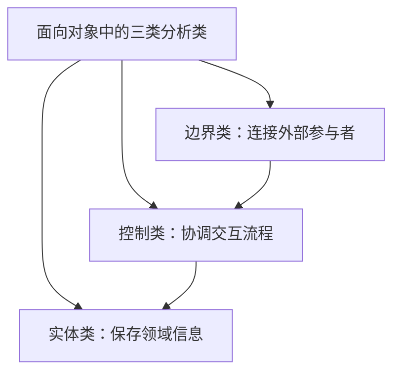
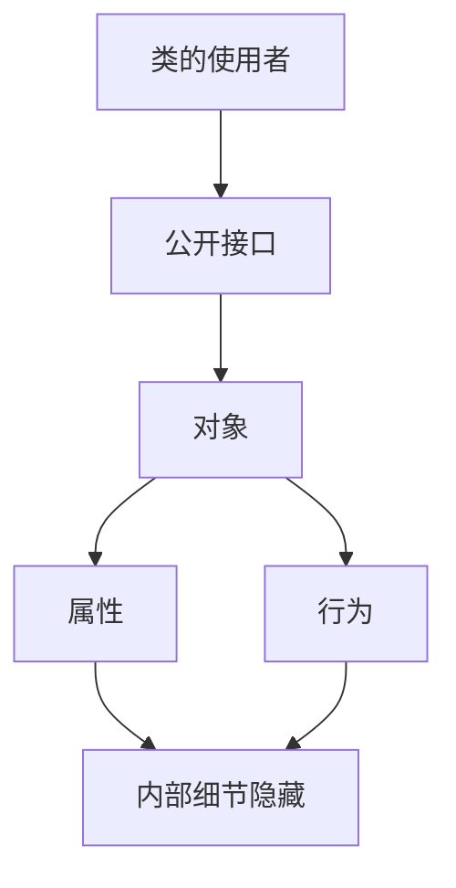
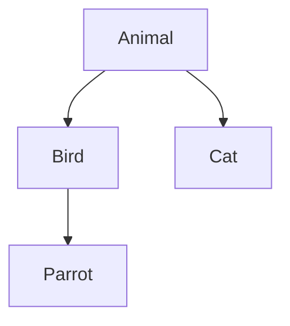
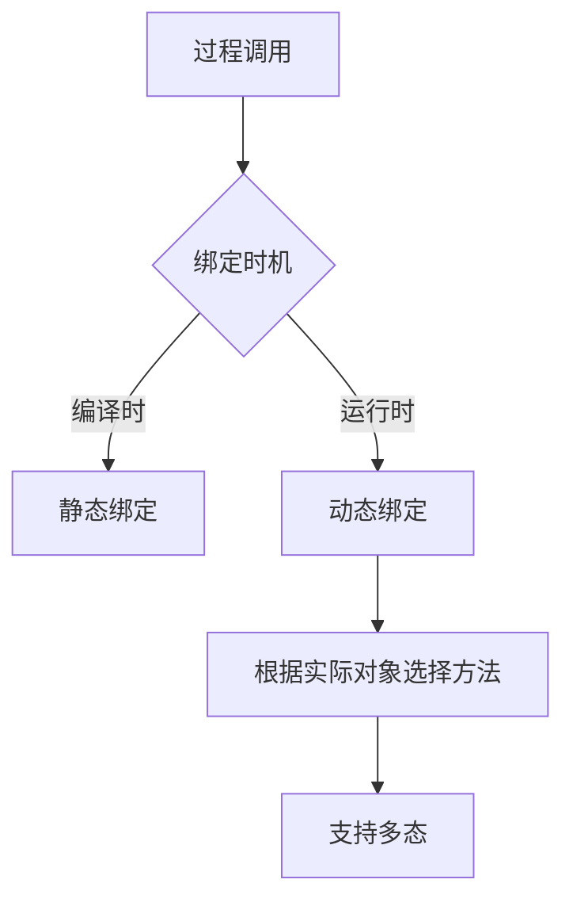
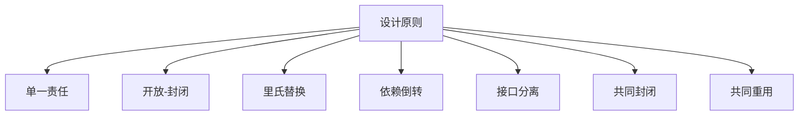

# chapter 6 - 面向对象技术

>  **适用对象**：软件设计师新手备考  

# 一、当前整理范围

```text
面向对象技术
├─ 1. 面向对象基本概念
│  ├─ 对象
│  ├─ 类
│  ├─ 消息
│  ├─ 状态
│  └─ 方法
├─ 2. 类的类型与一般特殊关系
│  ├─ 实体类
│  ├─ 边界类
│  ├─ 控制类
│  └─ 泛化关系
├─ 3. 封装、继承、多态
│  ├─ 封装与信息隐藏
│  ├─ 继承与子类扩展
│  ├─ 方法覆盖
│  ├─ 方法重载
│  └─ 多态的四种形式
├─ 4. 静态绑定与动态绑定
│  ├─ 编译时绑定
│  ├─ 运行时绑定
│  └─ 动态绑定支持多态
├─ 5. 面向对象设计原则
│  ├─ 单一责任原则
│  ├─ 开放-封闭原则
│  ├─ 里氏替换原则
│  ├─ 依赖倒转原则
│  ├─ 接口分离原则
│  ├─ 共同封闭原则
│  └─ 共同重用原则
├─ 6. 面向对象分析与设计
│  ├─ 面向对象分析目标
│  ├─ 面向对象分析活动
│  ├─ 面向对象设计活动
│  └─ 分析、设计、程序设计的区别
├─ 7. 面向对象程序设计语言
│  ├─ 消息传递
│  ├─ 类与实例
│  ├─ 封装对象
│  ├─ 继承与多态
│  └─ 静态成员
└─ 8. 杂题选讲
   ├─ 对象特性
   ├─ 接口与抽象类
   ├─ 领域类模型
   └─ 分析阶段关注点
```

# 二、复习建议

| 轮次 | 目标 | 建议做法 | 关注重点 |
|---|---|---|---|
| 第 1 轮 | 建立概念框架 | 先把对象、类、封装、继承、多态、消息六个词背准 | 对象三要素、类是对象抽象、消息通信 |
| 第 2 轮 | 会做定义题 | 按专题刷“类、对象、封装、继承、多态、绑定”题 | 实体/边界/控制类，重载/覆盖，静态/动态绑定 |
| 第 3 轮 | 处理易混项 | 把成对概念放一起比较 | 继承 vs 泛化；重载 vs 覆盖；封装 vs 信息隐藏；分析 vs 设计 |
| 第 4 轮 | 冲刺题眼 | 只看口诀、总表和原题答案方向 | “一般特殊”“同名不同参”“同一消息不同响应”“运行时绑定” |

# 三、章节笔记

## 总记忆表

| 模块 | 记忆句 |
|---|---|
| 面向对象核心 | **对象 + 类 + 继承 + 消息通信**，考试常问定义。 |
| 对象 | 对象通常由**对象名、属性、操作**组成；状态是属性及其当前值。 |
| 类 | 类是对象的**抽象定义**，同一类对象共享**属性和行为**。 |
| 实体类 | 保存领域信息并提供相关处理行为，是应用领域核心类。 |
| 边界类 | 系统内部对象和系统外参与者之间的联系媒介。 |
| 控制类 | 协调边界类与实体类之间的交互，控制活动流。 |
| 封装 | 把**数据和行为**绑定为整体，本质是**信息隐藏**。 |
| private | 只有本类中定义的方法可以访问。 |
| 继承 | 父类与子类之间共享属性和方法，是“一般—特殊”关系。 |
| 覆盖 | 子类用适合自己的实现替换父类中的相应实现。 |
| 重载 | 同名方法，参数个数、类型或顺序不同。 |
| 多态 | 不同对象收到同一消息产生不同结果。 |
| 参数多态 | 最纯、最广泛的多态。 |
| 包含多态 | 子类型化，父类变量可引用子类对象。 |
| 过载多态 | 同一名字在不同上下文中含义不同。 |
| 强制多态 | 通过强制类型转换实现。 |
| 静态绑定 | 编译时绑定。 |
| 动态绑定 | 运行时绑定，支持多态。 |
| 开放-封闭 | 对**扩展开放**，对**修改关闭**。 |
| 里氏替换 | 基类对象出现处，子类对象一定可以出现。 |
| 依赖倒转 | 依赖抽象，不依赖实现。 |
| 接口分离 | 不强迫客户依赖不用的方法。 |
| 共同封闭 | 一个包中所有类对同一类变化共同封闭。 |
| 共同重用 | 重用包中一个类，就要重用包中所有类。 |
| 面向对象分析 | 理解问题域，建立独立于实现的分析模型。 |
| 面向对象设计 | 理解解决方案，要考虑技术与实现层面。 |

## 1. 面向对象基本概念

### 1. 知识点

| 概念 | 核心含义 | 题目关键词 | 易错点 |
|---|---|---|---|
| 对象 | 系统运行时的基本实体 | 对象名、属性、操作 | 对象不是只有数据，也不是只有操作 |
| 类 | 一组相似对象的抽象定义 | 模板、抽象、相同属性和服务 | 一个类可以产生多个对象，不是只能产生一个 |
| 属性 | 对象的数据特征 | 成员变量、数据 | 属性值形成对象状态 |
| 方法/操作 | 对象可执行的行为 | 成员函数、服务、操作 | 方法与消息不是同一个概念 |
| 消息 | 对象之间通信的构造 | 请求服务、对象通信 | 消息不是对象的组成部分 |
| 状态 | 对象所有属性及其当前值 | 当前值、动态值 | 状态不是唯一 ID |

### 2. 模板

```text
对象类题判断模板：
看到“运行时实体” → 对象
看到“一组对象的抽象” → 类
看到“对象由什么组成” → 对象名 + 属性 + 操作
看到“属性当前值” → 状态
看到“对象之间通信” → 消息
```

### 3. 例题分析

**例 1**：以下关于类和对象的叙述中，错误的是？  
先抓题眼：“类是模板，用它仅可以产生一个对象”。类是模板，但一个类可以产生多个对象，所以“仅可以产生一个对象”错误。

**例 2**：对象的组成部分不包括什么？  
对象通常由对象名、属性、操作组成；状态与属性当前值相关；消息是对象间通信机制，不是对象组成部分。

### 4. 记忆技巧

```text
对象三件套：名字、属性、操作；
类是对象模子，一类多个对象；
状态看属性值，通信靠消息。
```

## 2. 类的类型与一般特殊关系

### 1. 知识点

| 类类型 | 作用 | 常见题眼 | 答案方向 |
|---|---|---|---|
| 实体类 | 保存系统中需要长期存在的信息，并提供相关处理行为 | 核心类、保存信息、领域对象 | 实体类 |
| 边界类 / 接口类 | 连接系统内对象与系统外参与者 | 用户交互、外部参与者、界面、接口 | 边界类 / 接口类 |
| 控制类 | 协调边界类和实体类之间的交互 | 协调、控制活动流、用例控制行为 | 控制类 |
| 一般—特殊关系 | 父类与子类关系 | 交通工具与飞机、Animal 与 Bird | 继承 / 泛化 |

### 2. 图示



### 3. 例题分析

**例 1**：应用领域中的核心类，一般用于保存系统中的信息并提供相关处理行为。  
题眼是“核心类、保存信息、处理行为”，直接落到**实体类**。

**例 2**：系统内对象和系统外参与者的联系媒介。  
题眼是“联系媒介、系统外参与者”，直接落到**边界类**。

**例 3**：交通工具与飞机之间是什么关系？  
交通工具是一般概念，飞机是特殊概念，所以是一般—特殊关系，也就是继承/泛化关系。

### 4. 记忆技巧

```text
实体管数据，边界接外部，控制管流程；
一般特殊看“是不是一种”，飞机是交通工具。
```

## 3. 方法重载与方法覆盖

### 1. 知识点

| 概念 | 定义 | 发生位置 | 题眼 | 典型答案 |
|---|---|---|---|---|
| 方法重载 | 同名方法，参数表不同 | 同一个类中常见，也可在继承体系中出现 | 同名、参数个数/类型/顺序不同 | 重载 |
| 方法覆盖 | 子类重新实现父类同名同参方法 | 父类与子类之间 | 子类置换父类实现、同名同参 | 覆盖 |

### 2. 对比表

| 对比项 | 重载 | 覆盖 |
|---|---|---|
| 方法名 | 相同 | 相同 |
| 参数表 | 必须不同 | 通常相同 |
| 关系要求 | 不要求父子类 | 必须在继承关系中 |
| 考试题眼 | 同名不同参 | 子类替换父类实现 |
| 目的 | 一个名字表达多种调用形式 | 子类提供特化实现 |

### 3. 例题分析

**例 1**：一个类可以具有多个同名而参数类型列表不同的方法。  
题眼是“同名、参数类型列表不同”，答案为**方法重载**。

**例 2**：子类在父类接口基础上，用适合自己的实现置换父类中的相应实现。  
题眼是“子类、置换父类实现”，答案为**覆盖**。

### 4. 记忆技巧

```text
重载：同名不同参；
覆盖：子类换父类。
```

## 4. 封装

### 1. 知识点

| 考点 | 正确说法 | 易错说法 |
|---|---|---|
| 封装本质 | 信息隐藏 | 封装是多态、聚合 |
| 封装对象 | 数据和行为的整体 | 只封装数据 |
| private | 只有此类中定义的方法可访问 | 同包类、所有 public 方法都可访问 |
| 软件复用作用 | 使用者不需要知道组件内部如何工作 | 不需要写文档、组件一定更有效 |
| 类定义 | 一组对象的抽象定义 | 一组对象的实例 |
| 成员变量/成员函数 | 属性和方法 | 值和方法、属性和活动 |
| this | 区分对象属性与局部变量名 | private、protected、public |

### 2. 图示



### 3. 例题分析

**例 1**：在定义类时，将属性声明为 private 的目的是什么？  
题眼是“private”。private 的目的不是让属性不可更改，而是实现数据隐藏，避免外部随意访问和意外更改。

**例 2**：封装在软件复用中的作用是什么？  
题眼是“复用”。封装让其他开发人员无需了解组件内部工作机制，只需要通过接口使用。

### 4. 记忆技巧

```text
封装是信息隐藏，数据行为绑一起；
private 只让本类碰，this 区分同名变量。
```

## 5. 继承

### 1. 知识点

| 考点 | 正确说法 | 易错点 |
|---|---|---|
| 继承定义 | 父类和子类之间共享数据和方法的机制 | 不是封装、不是消息 |
| 关系本质 | 一般—特殊关系 | 平级概念不是继承 |
| 子类能力 | 可以拥有父类属性和方法，也可以有新的属性和行为 | 只能新增行为、只能有父类属性 |
| 多重继承 | 两个及以上类作为一个类的超类 | 可能产生二义性成员 |
| 继承用途 | 在已存在类的基础上创建新类 | 不是在已存在状态中添加状态 |
| 继承限制 | 有些语言只支持单继承，有些支持多继承 | “继承仅允许单重继承”绝对化错误 |

### 2. 继承关系图



### 3. 例题分析

**例 1**：继承仅仅允许单重继承，不允许一个子类有多个父类。  
题眼是“仅仅”。面向对象继承机制本身可以有单继承和多继承，不同语言支持程度不同，因此该说法错误。

**例 2**：采用继承机制创建子类时，子类中可以有什么？  
子类可以继承父类属性和行为，也可以新增自己的属性和行为。因此选“可以有新的属性和行为”。

### 4. 记忆技巧

```text
继承看父子，一般到特殊；
子类可继承，也能加新招；
多继承很强，但可能二义。
```

## 6. 多态

### 1. 知识点

| 多态形式 | 含义 | 常见题眼 |
|---|---|---|
| 参数多态 | 对不同类型参数统一处理，最纯、应用广泛 | 最纯的多态 |
| 包含多态 | 子类型化，父类变量可引用子类对象 | 子类型化、超类与子类 |
| 过载多态 | 同一个名字在不同上下文中含义不同 | 同名、不同上下文 |
| 强制多态 | 通过强制类型转换实现 | 强制类型转换 |

### 2. 多态本质

```text
同一消息 + 不同接收对象 = 不同响应结果
```

### 3. 例题分析

**例 1**：不同对象收到同一消息可以产生完全不同的结果。  
题眼是“同一消息、不同结果”，直接落到**多态**。

**例 2**：同一个名字在不同上下文中代表不同含义。  
题眼是“同一个名字、不同上下文”，这是**过载多态**。

**例 3**：Bird 和 Cat 是 Animal 的子类，Parrot 是 Bird 的子类。bird 是 Bird 对象，parrot 是 Parrot 对象。  
`parrot` 可以看作 `Bird` 的对象，也可以看作 `Animal` 的对象；`bird` 不能看作 `Parrot` 的对象，因为父类对象不能当作子类对象。

### 4. 记忆技巧

```text
同一消息不同响，多态考点最常考；
参数最纯，包含子类；过载同名，强制转型。
```

## 7. 静态绑定与动态绑定

### 1. 知识点

| 概念 | 绑定时机 | 依据 | 作用 |
|---|---|---|---|
| 静态绑定 | 编译时 | 静态类型 | 编译前/编译时确定调用代码 |
| 动态绑定 | 运行时 | 实际接收对象类型 | 支持多态，运行时决定调用哪个方法 |

### 2. 流程图



### 3. 例题分析

**例 1**：绑定在编译时进行。  
题眼是“编译时”，答案为**静态绑定**。

**例 2**：过程调用和响应代码的结合直到调用发生时才进行。  
题眼是“运行时、调用发生时”，答案为**动态绑定**。

### 4. 记忆技巧

```text
编译时静态，运行时动态；
动态绑方法，多态才开花。
```

## 8. 面向对象设计原则

### 1. 知识点

| 原则 | 核心说法 | 题眼 |
|---|---|---|
| 单一责任原则 | 一个类仅有一个引起它变化的原因 | 一个类、一个变化原因 |
| 开放-封闭原则 | 软件实体对扩展开放，对修改关闭 | 可扩展、不可修改 |
| 里氏替换原则 | 基类对象出现的地方，子类对象一定可以出现 | 基类对象、子类对象 |
| 依赖倒转原则 | 依赖抽象，不依赖实现 | 高层不依赖底层、抽象不依赖细节 |
| 接口分离原则 | 不强迫客户依赖不用的方法 | 不用的方法、接口属于客户 |
| 共同封闭原则 | 包内类对同一类变化共同封闭 | 一个变化影响包中所有类 |
| 共同重用原则 | 重用包中一个类，就重用包中所有类 | 重用一个类，重用所有类 |

### 2. 关系图



### 3. 例题分析

**例 1**：高层模块不应该依赖底层模块，抽象不应该依赖细节，细节可以依赖抽象。  
题眼是“高层、底层、抽象、细节”，这是依赖倒转原则。若选项说“高层模块无法不依赖底层模块”，则错误。

**例 2**：软件实体可以扩展但不可修改。  
题眼是“扩展、修改”，答案为开放-封闭原则。

**例 3**：一个变化若对一个包产生影响，则将对包中所有类产生影响，而不影响其他包。  
题眼是“包、同一类性质的变化”，答案为共同封闭原则。

### 4. 记忆技巧

```text
单责一个因，开闭扩不改；
里氏子替父，倒转依抽象；
接口别强迫，封闭同变化；
重用要成包，一个用全用。
```

## 9. 面向对象分析与设计

### 1. 知识点

| 阶段 | 主要任务 | 常见题眼 | 不该做什么 |
|---|---|---|---|
| 面向对象分析 | 理解问题域，建立分析模型 | 问题域、系统责任、需求、独立于实现 | 不关注技术实现细节，不做程序设计 |
| 面向对象设计 | 给出解决方案 | 解决方案、技术、实现、UML 表达 | 不在分析之前进行 |
| 面向对象程序设计 | 用 OO 语言实现设计方案 | 选择语言、对象集合、类继承组织 | 不是分析，也不是设计 |

### 2. 分析活动顺序

```text
面向对象分析常见活动顺序：
认定对象
→ 组织对象
→ 描述对象间的相互作用
→ 确定对象的操作
→ 定义对象的内部信息
```

### 3. 识别对象技巧

| 需求描述成分 | 常见处理 |
|---|---|
| 名词短语 | 候选对象、候选类 |
| 动词短语 | 候选操作、候选方法 |
| 形容词 | 候选属性修饰信息 |
| 副词 | 通常不是对象识别重点 |

### 4. 例题分析

**例 1**：面向对象分析第一步是什么？  
分析阶段首先确定问题域，理解问题，再认定对象和组织对象。

**例 2**：从需求描述中选择什么来识别对象？  
对象多对应现实世界中的实体，需求中的名词短语常是候选对象。

### 5. 记忆技巧

```text
分析先问题，名词找对象；
设计给方案，实现才写码。
```

## 10. 面向对象程序设计语言与静态成员

### 1. 知识点

| 考点 | 正确说法 | 易错点 |
|---|---|---|
| 对象通信 | 对象之间通过消息传递通信 | 不是通过继承通信 |
| OO 程序设计 | 选择 OO 语言，把程序组织为协作对象集合 | 不是分析、不是测试 |
| 好的 OO 语言 | 支持封装对象、类与实例、继承和多态 | “必须支持通过指针引用”不是必要条件 |
| 静态数据成员 | 被该类对象共享，可被类方法访问 | 不一定不可修改 |
| 静态方法 | 通常只能直接访问静态成员 | 不能直接访问实例成员 |

### 2. 例题分析

**例 1**：对象之间通过什么方式通信？  
面向对象的对象之间通过消息传递通信。

**例 2**：静态数据成员的值不可修改。  
静态数据成员由该类对象共享，但并不意味着它的值不可修改，所以“不正确”。

### 3. 记忆技巧

```text
对象通信靠消息，程序设计才选语言；
静态成员大家共享，共享不等于不能改。
```

# 四、按专题插入原题与解析

## 专题一：类、对象与消息

### 题 1
**原题**  
在面向对象分析与设计中， （38） 是应用领域中的核心类，一般用于保存系统中的信息以及提供针对这些信息的相关处理行为； （39） 是系统内对象和系统外参与者的联系媒介； （40） 主要是协调上述两种类对象之间的交互。（2009年上半年）

- （38）A. 控制类　B. 边界类　C. 实体类　D. 软件类
- （39）A. 控制类　B. 边界类　C. 实体类　D. 软件类
- （40）A. 控制类　B. 边界类　C. 实体类　D. 软件类

**解析**  
先抓题眼：“核心类、保存系统信息、提供处理行为”对应实体类；“系统内对象和系统外参与者的联系媒介”对应边界类；“协调交互”对应控制类。

**正确答案**  
（38）C；（39）B；（40）A

**答案方向**  
实体存数据，边界连外部，控制管协调。

### 题 2
**原题**  
类 （37） 之间存在着一般和特殊的关系。（2014年下半年）

- A. 汽车与轮船
- B. 交通工具与飞机
- C. 轮船与飞机
- D. 汽车与飞机

**解析**  
先抓题眼：“一般和特殊”。交通工具是一般概念，飞机是一种交通工具，是特殊概念。汽车与轮船、轮船与飞机、汽车与飞机都是并列关系。

**正确答案**  
B

**答案方向**  
看到“一般—特殊”，用“是不是一种”判断。

### 题 3
**原题**  
在某销售系统中，客户采用扫描二维码进行支付。若采用面向对象方法开发该销售系统，则客户类属于 （39） 类，二维码类属于 （40） 类。（2018年下半年）

- （39）A. 接口　B. 实体　C. 控制　D. 状态
- （40）A. 接口　B. 实体　C. 控制　D. 状态

**解析**  
客户是销售系统中的业务对象，需要保存客户相关信息，属于实体类。二维码用于客户与系统交互、作为支付入口，可视为接口/边界性质的类。

**正确答案**  
（39）B；（40）A

**答案方向**  
业务对象多为实体类；交互入口多为接口/边界类。

### 题 4
**原题**  
采用面向对象方法进行系统开发时，以下与新型冠状病毒有关的对象中，存在“一般—特殊”关系的是 （38） 。（2020年下半年）

- A. 确诊病人和治愈病人
- B. 确诊病人和疑似病人
- C. 医生和病人
- D. 发热病人和确诊病人

**解析**  
先抓题眼：“一般—特殊”。确诊病人通常属于发热病人中的一种具体情形，发热病人范围更大，确诊病人范围更具体。其他选项多为并列或状态变化关系。

**正确答案**  
D

**答案方向**  
一般特殊关系可用“X 是一种 Y 吗”检验。

### 题 5
**原题**  
以下关于类和对象的叙述中，错误的是 （37） 。（2009年下半年）

- A. 类是具有相同属性和服务的一组对象的集合
- B. 类是一个对象模板，用它仅可以产生一个对象
- C. 在客观世界中实际存在的是类的实例，即对象
- D. 类为属于该类的全部对象提供了统一的抽象描述

**解析**  
类可以看作对象的模板，但一个类可以产生多个对象，不能说“仅可以产生一个对象”。A、C、D 都符合类与对象的基本定义。

**正确答案**  
B

**答案方向**  
类是模板，但不是“一类只造一个对象”。

### 题 6
**原题**  
采用面向对象开发方法时，对象是系统运行时基本实体。以下关于对象的叙述中，正确的是 （37） 。（2011年下半年）

- A. 对象只能包括数据（属性）
- B. 对象只能包括操作（行为）
- C. 对象一定有相同的属性和行为
- D. 对象通常由对象名、属性和操作三个部分组成

**解析**  
对象不是只有数据，也不是只有操作。对象通常由对象名、属性和操作组成。同一类对象通常共享属性和行为的抽象描述，但不能说所有对象一定有相同属性和行为。

**正确答案**  
D

**答案方向**  
对象三要素：对象名、属性、操作。

### 题 7
**原题**  
在面向对象的系统中，对象是运行时实体，其组成部分不包括 （37） ；一个类定义了一组大体相似的对象，这些对象共享 （38） 。（2015年下半年）

- （37）A. 消息　B. 行为（操作）　C. 对象名　D. 状态
- （38）A. 属性和状态　B. 对象名和状态　C. 行为和多重度　D. 属性和行为

**解析**  
对象由对象名、属性/状态、行为组成；消息是对象之间通信的机制，不是对象的组成部分。类定义了一组相似对象，这些对象共享的是属性和行为的抽象描述，而不是对象名和具体状态。

**正确答案**  
（37）A；（38）D

**答案方向**  
消息用于通信；类共享属性和行为。

### 题 8
**原题**  
对象的 （37） 标识了该对象的所有属性（通常是静态的）以及每个属性的当前值（通常是动态的）。（2018年上半年）

- A. 状态
- B. 唯一ID
- C. 行为
- D. 语义

**解析**  
先抓题眼：“所有属性及其当前值”。对象状态就是对象属性及属性当前值的集合。

**正确答案**  
A

**答案方向**  
看到“属性当前值”，选状态。

## 专题二：方法重载、封装与 this

### 题 9
**原题**  
一个类可以具有多个同名而参数类型列表不同的方法，被称为方法 （39） 。（2015年上半年）

- A. 重载
- B. 调用
- C. 重置
- D. 标记

**解析**  
同名方法只要参数类型、个数或顺序不同，就是方法重载。

**正确答案**  
A

**答案方向**  
同名不同参，选重载。

### 题 10
**原题**  
一个类中可以拥有多个名称相同而参数表（参数类型或参数个数或参数类型顺序）不同的方法，称为 （37） 。（2019年上半年）

- A. 方法标记
- B. 方法调用
- C. 方法重载
- D. 方法覆盖

**解析**  
题干已经给出重载的完整特征：同名，参数表不同。覆盖强调子类替换父类同名同参方法，不符合本题。

**正确答案**  
C

**答案方向**  
参数表不同是重载；子类替换实现是覆盖。

### 题 11
**原题**  
一个类是 （38） 。在定义类时，将属性声明为private的目的是 （39） 。（2011年下半年）

- （38）A. 一组对象的封装　B. 表示一组对象的层次关系　C. 一组对象的实例　D. 一组对象的抽象定义
- （39）A. 实现数据隐藏，以免意外更改　B. 操作符重载　C. 实现属性值不可更改　D. 实现属性值对类的所有对象共享

**解析**  
类是对一组对象的抽象定义。private 的目的在于数据隐藏，限制外部直接访问，避免意外修改；它不是让属性永远不能改，也不是实现共享。

**正确答案**  
（38）D；（39）A

**答案方向**  
类是抽象定义；private 是数据隐藏。

### 题 12
**原题**  
在面向对象软件开发中，封装是一种 （42） 技术，其目的是使对象的使用者和生产者分离。（2011年下半年）

- A. 接口管理
- B. 信息隐藏
- C. 多态
- D. 聚合

**解析**  
封装的本质是信息隐藏。使用者只需通过接口使用对象，不需要了解内部实现。

**正确答案**  
B

**答案方向**  
封装 = 信息隐藏。

### 题 13
**原题**  
以下关于封装在软件复用中所充当的角色的叙述，正确的是 （38） 。（2012年上半年）

- A. 封装使得其他开发人员不需要知道一个软件组件内部如何工作
- B. 封装使得软件组件更有效地工作
- C. 封装使得软件开发人员不需要编制开发文档
- D. 封装使得软件组件开发更加容易

**解析**  
封装隐藏内部实现细节，有利于复用。它不等于一定提高运行效率，也不等于可以不写文档。

**正确答案**  
A

**答案方向**  
封装让使用者“不知道内部也能用”。

### 题 14
**原题**  
对象、类、继承和消息传递是面向对象的4个核心概念。其中对象是封装 （37） 的整体。（2015年上半年）

- A. 命名空间
- B. 要完成任务
- C. 一组数据
- D. 数据和行为

**解析**  
对象封装的是数据和行为。只说“一组数据”不完整，因为对象还包含操作/方法。

**正确答案**  
D

**答案方向**  
对象 = 数据 + 行为。

### 题 15
**原题**  
在面向对象方法中，将逻辑上相关的数据以及行为绑定在一起，使信息对使用者隐蔽称为 （37） 。当类中的属性或方法被设计为private时， （38） 可以对其进行访问。（2017年下半年）

- （37）A. 抽象　B. 继承　C. 封装　D. 多态
- （38）A. 应用程序中所有方法　B. 只有此类中定义的方法　C. 只有此类中定义的public方法　D. 同一个包中的类中定义的方法

**解析**  
数据和行为绑定、信息对使用者隐蔽，是封装。private 表示私有访问权限，一般只有本类中定义的方法能访问。

**正确答案**  
（37）C；（38）B

**答案方向**  
封装隐藏信息；private 只给本类访问。

### 题 16
**原题**  
一个类中，成员变量和成员函数有时也可以分别被称为 （37） 。（2019年下半年）

- A. 属性和活动
- B. 值和方法
- C. 数据和活动
- D. 属性和方法

**解析**  
成员变量对应属性，成员函数对应方法。

**正确答案**  
D

**答案方向**  
变量叫属性，函数叫方法。

### 题 17
**原题**  
面向对象程序设计语言C++、JAVA中，关键字 （37） 可以用于区分同名的对象属性和局部变量名。（2020年下半年）

- A. private
- B. protected
- C. public
- D. this

**解析**  
`this` 表示当前对象，可用于区分当前对象的成员属性和局部变量。private、protected、public 是访问控制关键字。

**正确答案**  
D

**答案方向**  
同名属性与局部变量，想到 this。

## 专题三：继承与覆盖

### 题 18
**原题**  
（38） 是把对象的属性和服务结合成一个独立的系统单元，并尽可能隐藏对象的内部细节； （39） 是指子类可以自动拥有父类的全部属性和服务； （40） 是对象发出的服务请求，一般包含提供服务的对象标识、服务标识、输入信息和应答信息等。（2009年下半年）

- （38）A. 继承　B. 多态　C. 消息　D. 封装
- （39）A. 继承　B. 多态　C. 消息　D. 封装
- （40）A. 继承　B. 多态　C. 消息　D. 封装

**解析**  
“属性和服务结合并隐藏细节”是封装；“子类自动拥有父类属性和服务”是继承；“对象发出的服务请求”是消息。

**正确答案**  
（38）D；（39）A；（40）C

**答案方向**  
封装藏细节，继承得父类，消息发请求。

### 题 19
**原题**  
以下关于面向对象继承的叙述中，错误的是 （37） 。（2010年上半年）

- A. 继承是父类和子类之间共享数据和方法的机制
- B. 继承定义了一种类与类之间的关系
- C. 继承关系中的子类将拥有父类的全部属性和方法
- D. 继承仅仅允许单重继承，即不允许一个子类有多个父类

**解析**  
A、B、C 是继承的基本描述。D 的“仅仅允许单重继承”过于绝对，面向对象方法中存在多重继承，是否支持取决于具体语言。

**正确答案**  
D

**答案方向**  
继承不等于只能单继承。

### 题 20
**原题**  
在面向对象技术中， （41） 定义了超类和子类之间的关系，子类中以更具体的方式实现从父类继承来的方法称为 （42） ，不同类的对象通过 （43） 相互通信。（2013年下半年）

- （41）A. 覆盖　B. 继承　C. 消息　D. 多态
- （42）A. 覆盖　B. 继承　C. 消息　D. 多态
- （43）A. 覆盖　B. 继承　C. 消息　D. 多态

**解析**  
超类和子类之间是继承关系。子类更具体地实现父类方法，是覆盖。对象之间通信依靠消息。

**正确答案**  
（41）B；（42）A；（43）C

**答案方向**  
父子是继承，子改父法是覆盖，对象通信靠消息。

### 题 21
**原题**  
在面向对象方法中， （37） 是父类和子类之间共享数据和方法的机制。子类在原有父类接口的基础上，用适合于自己要求的实现去置换父类中的相应实现称为 （38） 。（2016年上半年）

- （37）A. 封装　B. 继承　C. 覆盖　D. 多态
- （38）A. 封装　B. 继承　C. 覆盖　D. 多态

**解析**  
共享父类数据和方法是继承。子类替换父类实现是覆盖。

**正确答案**  
（37）B；（38）C

**答案方向**  
共享是继承，替换是覆盖。

### 题 22
**原题**  
在面向对象方法中，两个及以上的类作为一个类的超类时，称为 （37） ，使用它可能造成子类中存在 （38） 的成员。（2017年上半年）

- （37）A. 多重继承　B. 多态　C. 封装　D. 层次继承
- （38）A. 动态　B. 私有　C. 公共　D. 二义性

**解析**  
一个子类有两个及以上超类，就是多重继承。多重继承可能从不同父类继承到同名成员，造成二义性。

**正确答案**  
（37）A；（38）D

**答案方向**  
多父类是多重继承，风险是二义性。

### 题 23
**原题**  
采用继承机制创建子类时，子类中 （39） 。（2017年下半年）

- A. 只能有父类中的属性
- B. 只能有父类中的行为
- C. 只能新增行为
- D. 可以有新的属性和行为

**解析**  
子类既可以继承父类已有属性和行为，也可以定义自己的新属性和新行为。

**正确答案**  
D

**答案方向**  
子类不只是复制父类，还能扩展。

### 题 24
**原题**  
在面向对象方法中，继承用于 （37） 。（2018年下半年）

- A. 在已存在的类的基础上创建新类
- B. 在已存在的类中添加新的方法
- C. 在已存在的类中添加新的属性
- D. 在已存在的状态中添加新的状态

**解析**  
继承的作用是在已有类的基础上创建新类。B、C 只是修改已有类，不是继承的本质。

**正确答案**  
A

**答案方向**  
继承 = 基于已有类创建新类。

## 专题四：多态

### 题 25
**原题**  
在面向对象技术中， （38） 说明一个对象具有多种形态， （39） 定义超类与子类的关系。（2012年下半年）

- （38）A. 继承　B. 组合　C. 封装　D. 多态
- （39）A. 继承　B. 组合　C. 封装　D. 多态

**解析**  
一个对象具有多种形态是多态；超类与子类关系由继承定义。

**正确答案**  
（38）D；（39）A

**答案方向**  
形态多是多态，父子类是继承。

### 题 26
**原题**  
在多态的几种不同形式中， （37） 多态是一种特定的多态，指同一个名字在不同上下文中可代表不同的含义。（2013年上半年）

- A. 参数
- B. 包含
- C. 过载
- D. 强制

**解析**  
“同一个名字在不同上下文中代表不同含义”是过载多态，也与重载的“同名不同参”相呼应。

**正确答案**  
C

**答案方向**  
同名不同义，选过载多态。

### 题 27
**原题**  
在面向对象技术中，不同的对象在收到同一消息时可以产生完全不同的结果，这一现象称为 （39） ，它由 （40） 机制来支持。利用类的层次关系，把具有通用功能的消息存放在高层次，而不同的实现这一功能的行为放在较低层次，在这些低层次上生成的对象能够给通用消息以不同的响应。（2014年上半年）

- （39）A. 绑定　B. 继承　C. 消息　D. 多态
- （40）A. 绑定　B. 继承　C. 消息　D. 多态

**解析**  
“同一消息，不同对象，不同结果”是多态。题干后半句强调通过类层次关系把通用功能放在高层、具体实现放在低层，说明多态由继承机制支持。

**正确答案**  
（39）D；（40）B

**答案方向**  
多态现象靠继承体系支撑。

### 题 28
**原题**  
多态分为参数多态、包含多态、过载多态和强制多态四种不同形式，其中 （38） 多态在许多语言中都存在，最常见的例子就是子类型化。（2014年下半年）

- A. 参数
- B. 包含
- C. 过载
- D. 强制

**解析**  
子类型化是包含多态的典型表现。比如父类引用指向子类对象。

**正确答案**  
B

**答案方向**  
看到“子类型化”，选包含多态。

### 题 29
**原题**  
在面向对象方法中，不同对象收到同一消息可以产生完全不同的结果，这一现象称为 （37） 。在使用时，用户可以发送一个通用的消息，而实现的细节则由接收对象自行决定。（2016年下半年）

- A. 接口
- B. 继承
- C. 覆盖
- D. 多态

**解析**  
题眼仍然是“同一消息、不同结果”。实现细节由接收对象决定，这是多态的典型描述。

**正确答案**  
D

**答案方向**  
同一消息不同响应，选多态。

### 题 30
**原题**  
在面向对象方法中，多态指的是 （40） 。（2017年上半年）

- A. 客户类无需知道所调用方法的特定子类的实现
- B. 对象动态地修改类
- C. 一个对象对应多张数据库表
- D. 子类只能够覆盖父类中非抽象的方法

**解析**  
多态让客户端只发送通用消息，不需要知道具体子类如何实现。B、C 与多态无关；D 表述过窄且不准确。

**正确答案**  
A

**答案方向**  
多态使调用者面向统一接口，不关心具体实现。

### 题 31
**原题**  
同一消息可以调用多种不同种类的对象的方法，这些类有某个相同的超类，这种现象是 （40）。（2018年上半年）

- A. 类型转换
- B. 映射
- C. 单态
- D. 多态

**解析**  
同一消息调用不同对象的方法，并且这些对象有共同超类，是继承体系下的多态。

**正确答案**  
D

**答案方向**  
同一消息 + 多类对象 + 共同超类 = 多态。

### 题 32
**原题**  
（38） 多态是指操作（方法）具有相同的名称、且在不同的上下文中所代表的含义不同。（2018年下半年）

- A. 参数
- B. 包含
- C. 过载
- D. 强制

**解析**  
“相同名称、不同上下文、不同含义”直接对应过载多态。

**正确答案**  
C

**答案方向**  
同名不同义，过载多态。

### 题 33
**原题**  
多态有不同的形式， （40） 的多态是指同一个名字在不同上下文中所代表的含义不同。（2020年下半年）

- A. 参数
- B. 包含
- C. 过载
- D. 强制

**解析**  
题眼与上一题相同，“同一个名字在不同上下文中代表不同含义”就是过载多态。

**正确答案**  
C

**答案方向**  
同名不同义，还是过载。

### 题 34
**原题**  
假设Bird和Cat是Animal的子类，Parrot是Bird的子类，bird是Bird的一个对象，cat是Cat的一个对象，parrot是Parrot的一个对象。以下叙述中不正确的是 （39） 。假设Animal类中定义接口move()，Bird、Cat和Parrot分别实现自己的move()，调用move()时，不同对象收到同一消息可以产生各自不同的结果，这一现象称为 （40） 。（2021年上半年）

- （39）A. cat和bird可看作是Animal的对象
- B. parrot和bird可看作是Animal的对象
- C. bird可看作是Parrot的对象
- D. parrot可以看作是Bird的对象
- （40）A. 封装　B. 继承　C. 消息传递　D. 多态

**解析**  
继承关系为 `Animal → Bird → Parrot`，以及 `Animal → Cat`。子类对象可以当作父类对象使用，所以 cat、bird 可看作 Animal 对象，parrot 可看作 Bird 或 Animal 对象。但 Bird 对象不能反过来看作 Parrot 对象，因为父类对象不一定是某个子类对象。不同对象调用 move() 得到不同结果，是多态。

**正确答案**  
（39）C；（40）D

**答案方向**  
子类能向上看父类，父类不能随便向下看子类；同一 move() 不同响应是多态。

## 专题五：静态绑定与动态绑定

### 题 35
**原题**  
不同的对象收到同一消息可以产生完全不同的结果，这一现象叫做 （38） 。绑定是一个把过程调用和响应调用所需要执行的代码加以结合的过程。在一般的程序设计语言中，绑定在编译时进行的，叫做 （39） ；而 （40） 则是在运行时进行的，即一个给定的过程调用和代码的结合直到调用发生时才进行的。（2010年上半年）

- （38）A. 继承　B. 多态　C. 动态绑定　D. 静态绑定
- （39）A. 继承　B. 多态　C. 动态绑定　D. 静态绑定
- （40）A. 继承　B. 多态　C. 动态绑定　D. 静态绑定

**解析**  
“同一消息不同结果”是多态；编译时绑定是静态绑定；运行时绑定是动态绑定。

**正确答案**  
（38）B；（39）D；（40）C

**答案方向**  
多态看现象，静态看编译，动态看运行。

### 题 36
**原题**  
在有些程序设计语言中，过程调用和响应调用需执行的代码的绑定直到运行时才进行，这种绑定称为 （39） 。（2012年上半年）

- A. 静态绑定
- B. 动态绑定
- C. 过载绑定
- D. 强制绑定

**解析**  
题眼是“直到运行时才进行”。运行时绑定就是动态绑定。

**正确答案**  
B

**答案方向**  
运行时绑定，直接选动态绑定。

### 题 37
**原题**  
某些程序设计语言中，在运行过程中当一个对象发送消息请求服务时，根据接收对象的具体情况将请求的操作与实现的方法进行连接，称为 （38） 。（2014年上半年）

- A. 静态绑定
- B. 通用绑定
- C. 动态绑定
- D. 过载绑定

**解析**  
运行过程中根据接收对象具体情况决定调用哪个方法，是动态绑定。

**正确答案**  
C

**答案方向**  
根据实际对象选方法，选动态绑定。

### 题 38
**原题**  
在面向对象方法中，支持多态的是 （38） 。（2016年下半年）

- A. 静态分配
- B. 动态分配
- C. 静态类型
- D. 动态绑定

**解析**  
多态要求运行时根据实际对象决定调用方法，因此由动态绑定支持。

**正确答案**  
D

**答案方向**  
多态靠动态绑定。

### 题 39
**原题**  
在下列机制中， （38） 是指过程调用和响应调用所需执行的代码在运行时加以结合；而 （39） 是过程调用和响应调用所需执行的代码在编译时加以结合。（2018年上半年）

- （38）A. 消息传递　B. 类型检查　C. 静态绑定　D. 动态绑定
- （39）A. 消息传递　B. 类型检查　C. 静态绑定　D. 动态绑定

**解析**  
运行时结合是动态绑定，编译时结合是静态绑定。

**正确答案**  
（38）D；（39）C

**答案方向**  
运行动态，编译静态。

### 题 40
**原题**  
（40） 绑定是指在运行时把过程调用和响应调用所需要执行的代码加以结合。（2019年下半年）

- A. 动态
- B. 过载
- C. 静态
- D. 参数

**解析**  
运行时把调用与代码结合，称为动态绑定。

**正确答案**  
A

**答案方向**  
运行时 = 动态。

## 专题六：面向对象设计原则

### 题 41
**原题**  
以下关于面向对象设计的叙述中，错误的是 （42） 。（2009年下半年）

- A. 高层模块不应该依赖于底层模块
- B. 抽象不应该依赖于细节
- C. 细节可以依赖于抽象
- D. 高层模块无法不依赖于底层模块

**解析**  
依赖倒转原则要求高层模块不依赖底层模块，二者都依赖抽象；抽象不依赖细节，细节依赖抽象。因此 D 与原则相反。

**正确答案**  
D

**答案方向**  
高层、底层、抽象、细节，锁定依赖倒转原则。

### 题 42
**原题**  
开-闭原则是指一个软件实体应当对 （37） 开放，对 （38） 关闭；里氏代换原则是指任何 （39） 可以出现的地方， （40） 一定可以出现。依赖倒转原则就是要依赖于 （41） ，而不依赖于 （42） ，或者说要针对接口编程，不要针对实现编程。（2010年下半年）

- （37）A. 修改　B. 扩展　C. 分析　D. 设计
- （38）A. 修改　B. 扩展　C. 分析　D. 设计
- （39）A. 变量　B. 常量　C. 基类对象　D. 子类对象
- （40）A. 变量　B. 常量　C. 基类对象　D. 子类对象
- （41）A. 程序设计语言　B. 建模语言　C. 实现　D. 抽象
- （42）A. 程序设计语言　B. 建模语言　C. 实现　D. 抽象

**解析**  
开闭原则：对扩展开放，对修改关闭。里氏替换：基类对象可以出现的地方，子类对象一定可以出现。依赖倒转：依赖抽象，不依赖实现。

**正确答案**  
（37）B；（38）A；（39）C；（40）D；（41）D；（42）C

**答案方向**  
扩展开、修改关；基类处可放子类；依赖抽象别依实现。

### 题 43
**原题**  
进行面向对象设计时，就一个类而言，应该仅有一个引起它变化的原因，这属于 （39） 设计原则。（2019年上半年）

- A. 单一责任
- B. 开放-封闭
- C. 接口分离
- D. 里氏替换

**解析**  
题眼是“一个类、仅有一个引起它变化的原因”，这是单一责任原则。

**正确答案**  
A

**答案方向**  
一个类一个变化原因，选单一责任。

### 题 44
**原题**  
进行面向对象系统设计时，软件实体（类、模块、函数等）应该是可以扩展但不可修改的，这属于 （39） 设计原则。（2019年下半年）

- A. 共同重用
- B. 开放-封闭
- C. 接口分离
- D. 共同封闭

**解析**  
“可以扩展但不可修改”就是开放-封闭原则。

**正确答案**  
B

**答案方向**  
扩展开放，修改关闭。

### 题 45
**原题**  
进行面向对象系统设计时，针对包中的所有类对于同一类性质的变化。一个变化若对一个包产生影响，则将对该包中的所有类产生影响，而对于其他的包不造成任何影响。这属于 （39） 设计原则。（2020年下半年）

- A. 共同重用
- B. 开放—封闭
- C. 接口分离
- D. 共同封闭

**解析**  
题眼是“一个包、同一类性质的变化、影响包中所有类”。这对应共同封闭原则。

**正确答案**  
D

**答案方向**  
同一变化关在同一个包里，选共同封闭。

### 题 46
**原题**  
采用面向对象方法进行系统设计时，不应该强迫客户依赖于他们不用的方法，接口属于客户，不属于它所在的类的层次结构。即：依赖于抽象，不要依赖于具体，同时在抽象级别不应该有对于细节的依赖。这属于 （38） 。（2021年上半年）

- A. 单一责任
- B. 开放—封闭
- C. 接口分离
- D. 里氏替换

**解析**  
题眼是“不应该强迫客户依赖于他们不用的方法”。这是接口分离原则。

**正确答案**  
C

**答案方向**  
不用的方法别强迫，选接口分离。

### 题 47
**原题**  
在面向对象设计时，如果重用了包中的一个类，那么就要重用包中的所有类，这属于 （38） 原则。（2021年下半年）

- A. 接口分离
- B. 开放-封闭
- C. 共同封闭
- D. 共同重用

**解析**  
题眼是“重用了包中的一个类，就要重用包中的所有类”。这是共同重用原则。

**正确答案**  
D

**答案方向**  
重用一个就重用全部，选共同重用。

## 专题七：面向对象分析与设计

### 题 48
**原题**  
下面关于面向对象分析与面向对象设计的说法中，不正确的是 （37） 。（2009年上半年）

- A. 面向对象分析侧重于理解问题
- B. 面向对象设计侧重于理解解决方案
- C. 面向对象分析描述软件要做什么
- D. 面向对象设计一般不关注技术和实现层面的细节

**解析**  
面向对象分析关注问题域，描述软件要做什么；面向对象设计关注解决方案，需要考虑技术和实现层面的细节。因此 D 错。

**正确答案**  
D

**答案方向**  
分析理解问题，设计理解方案；设计要考虑实现。

### 题 49
**原题**  
以下关于面向对象分析的叙述中，错误的是 （41） 。（2009年下半年）

- A. 面向对象分析着重分析问题域和系统责任
- B. 面向对象分析需要考虑系统的测试问题
- C. 面向对象分析忽略与系统实现有关的问题
- D. 面向对象分析建立独立于实现的系统分析模型

**解析**  
面向对象分析关注问题域和系统责任，建立独立于实现的分析模型，一般忽略实现细节。测试问题不是分析阶段的主要关注点。

**正确答案**  
B

**答案方向**  
分析阶段不主要考虑测试问题。

### 题 50
**原题**  
（41） 不是面向对象分析阶段需要完成的。（2010年上半年）

- A. 认定对象
- B. 组织对象
- C. 实现对象及其相互关系
- D. 描述对象间的相互作用

**解析**  
面向对象分析包括认定对象、组织对象、描述对象间相互作用、确定对象操作、定义对象内部信息。实现对象及其相互关系属于设计/程序设计阶段。

**正确答案**  
C

**答案方向**  
分析不负责实现。

### 题 51
**原题**  
以下关于面向对象设计的叙述中，错误的是 （42） 。（2010年上半年）

- A. 面向对象设计应在面向对象分析之前，因为只有产生了设计结果才可对其进行分析
- B. 面向对象设计与面向对象分析是面向对象软件过程中两个重要的阶段
- C. 面向对象设计应该依赖于面向对象分析的结果
- D. 面向对象设计产生的结果在形式上可以与面向对象分析产生的结果类似，例如都可以使用UML表达

**解析**  
软件过程通常先分析再设计。设计依赖分析结果，而不是设计在分析之前。因此 A 错。

**正确答案**  
A

**答案方向**  
先分析问题，再设计方案。

### 题 52
**原题**  
面向对象分析的第一步是 （37） 。（2011年上半年）

- A. 定义服务
- B. 确定附加的系统约束
- C. 确定问题域
- D. 定义类和对象

**解析**  
面向对象分析首先要确定问题域，理解系统所处的业务环境和责任边界，然后再识别对象、类和关系。

**正确答案**  
C

**答案方向**  
分析第一步：确定问题域。

### 题 53
**原题**  
面向对象分析的目的是为了获得对应用问题的理解，其主要活动不包括 （39） 。（2016年下半年）

- A. 认定并组织对象
- B. 描述对象间的相互作用
- C. 面向对象程序设计
- D. 确定基于对象的操作

**解析**  
A、B、D 都是分析活动；C 是程序设计阶段活动，不属于分析阶段。

**正确答案**  
C

**答案方向**  
分析不写程序，程序设计是后续阶段。

### 题 54
**原题**  
面向对象分析过程中，从给定需求描述中选择 （40） 来识别对象。（2017年下半年）

- A. 动词短语
- B. 名词短语
- C. 形容词
- D. 副词

**解析**  
对象通常对应问题域中的实体，需求描述中的名词短语常作为候选对象或候选类。

**正确答案**  
B

**答案方向**  
名词找对象，动词找操作。

### 题 55
**原题**  
面向对象分析时，执行的活动顺序通常是 （37） 。（2021年上半年）

- A. 认定对象、组织对象、描述对象的相互作用、确定对象的操作
- B. 认定对象、定义属性、组织对象、确定对象的操作
- C. 认定对象、描述对象间的相互作用、确定对象的操作、识别包
- D. 识别类及对象、识别关系、定义属性、确定对象的操作

**解析**  
面向对象分析活动通常为：认定对象、组织对象、描述对象间的相互作用、确定对象的操作、定义对象内部信息。A 与该顺序最吻合。

**正确答案**  
A

**答案方向**  
认定对象 → 组织对象 → 描述交互 → 确定操作。

### 题 56
**原题**  
面向对象设计时包含的主要活动是 （37） 。（2021年下半年）

- A. 认定对象，组织对象，描述对象间的相互作用，确定对象的操作
- B. 认定对象，定义属性，组织对象，确定对象的操作
- C. 识别类及对象，确定对象的操作，描述对象间的相互作用，识别关系
- D. 识别类及对象，定义属性，定义服务，识别关系，识别包

**解析**  
A 更像面向对象分析活动；面向对象设计更侧重识别类及对象、定义属性、定义服务、识别关系和包等设计模型细化活动。

**正确答案**  
D

**答案方向**  
设计活动要落到类、属性、服务、关系、包。

## 专题八：面向对象程序设计语言与杂题

### 题 57
**原题**  
在面向对象程序设计语言中，对象之间通过 （39） 方式进行通信。以下关于好的面向对象程序设计语言的叙述中，不正确的是 （40） 。（2014年下半年）

- （39）A. 消息传递　B. 继承　C. 引用　D. 多态
- （40）A. 应该支持被封装的对象　B. 应该支持类与实例的概念　C. 应该支持通过指针进行引用　D. 应该支持继承和多态

**解析**  
对象之间通过消息传递通信。好的面向对象语言应支持封装、类与实例、继承和多态；通过指针引用不是面向对象语言的必要条件。

**正确答案**  
（39）A；（40）C

**答案方向**  
通信靠消息；指针不是 OO 语言必备特征。

### 题 58
**原题**  
面向对象 （38） 选择合适的面向对象程序设计语言，将程序组织为相互协作的对象集合，每个对象表示某个类的实例，类通过继承等关系进行组织。（2015年上半年）

- A. 分析
- B. 设计
- C. 程序设计
- D. 测试

**解析**  
选择程序设计语言并组织程序对象集合，属于面向对象程序设计阶段。

**正确答案**  
C

**答案方向**  
选语言、写程序，属于程序设计。

### 题 59
**原题**  
下列关于一个类的静态成员的描述中，不正确的是 （38） 。（2011年上半年）

- A. 类的静态方法只能访问该类的静态数据成员
- B. 静态数据成员可被该类的所有方法访问
- C. 该类的对象共享其静态数据成员的值
- D. 该类的静态数据成员的值不可修改

**解析**  
静态数据成员被类的对象共享，可以被类方法访问，但共享不等于不可修改。是否可修改取决于是否声明为常量、访问权限等。

**正确答案**  
D

**答案方向**  
静态成员是共享，不是只读。

### 题 60
**原题**  
在面向对象技术中，对象具有以下特性： （37） 。

① 清晰的边界　② 良好定义的行为　③ 确定的位置和数量　④ 可扩展性

- A. ②④
- B. ①②③④
- C. ①②④
- D. ①②

**解析**  
对象具有清晰边界、良好定义的行为和可扩展性。对象不要求具有固定的位置和数量。

**正确答案**  
C

**答案方向**  
对象特性记 ①②④，不选“确定的位置和数量”。

### 题 61
**原题**  
继承是父类和子类之间共享数据和方法的机制。以下关于继承的叙述中，不正确的是（38）。有关于图中doIt()方法的叙述中，正确的是 （39）。（2013年上半年）

图示可等价重构为：

```text
<<interface>> Thing1
        doIt()
           △
           │ realization
   ┌───────┴────────┐
 Thing2           Thing3
   △
   │ inheritance
 ┌─┴────┐
Thing4 Thing5
```

- （38）A. 一个父类可以有多个子类，这些子类都是父类的特例
- B. 父类描述了这些子类的公共属性和操作
- C. 子类可以继承它的父类（或祖先类）中的属性和操作而不必自己定义
- D. 子类中可以定义自己的新操作而不能定义和父类同名的操作
- （39）A. doIt()必须由Thing3实现，同时可能由Thing4实现
- B. doIt()必须由Thing5实现
- C. doIt()必须由Thing2、Thing3、Thing4和Thing5实现
- D. doIt()已经由Thing1实现，因而无需其它类实现

**解析**  
（38）子类可以定义新的操作，也可以覆盖父类中同名操作，因此“不能定义和父类同名的操作”错误。  
（39）接口 Thing1 只声明 doIt()，不提供普通实现。Thing3 直接实现接口，必须实现 doIt()。Thing2 若为抽象类，可以暂不实现 doIt()，其具体子类在需要时实现。按原题图和常见答案方向，Thing4 可能需要实现，而不是所有类都必须实现。

**正确答案**  
（38）D；（39）A

**答案方向**  
子类可以同名覆盖；接口只声明，具体类负责实现。

### 题 62
**原题**  
在领域类模型中不包含 （37） 。（2013年下半年）

- A. 属性
- B. 操作
- C. 关联
- D. 领域对象

**解析**  
领域类模型通常描述领域对象、属性和对象之间的关联，重点表达问题域概念结构。操作更多属于设计类模型或实现细化内容，领域类模型中通常不包含操作。

**正确答案**  
B

**答案方向**  
领域类模型重对象、属性、关联，不重操作。

### 题 63
**原题**  
采用面向对象方法进行软件开发，在分析阶段，架构师主要关注系统的 （39） 。（2017年上半年）

- A. 技术
- B. 部署
- C. 实现
- D. 行为

**解析**  
分析阶段关注问题域、系统责任和外部可观察行为，不主要关注技术、部署和实现细节。

**正确答案**  
D

**答案方向**  
分析阶段看系统行为，不看技术实现。

# 五、本章总结

## 先抓最稳的分

面向对象章节最稳的分来自定义题和概念辨析题。新手应优先掌握以下题眼：

| 题眼 | 直接答案 |
|---|---|
| 核心类、保存信息 | 实体类 |
| 系统外参与者联系媒介 | 边界类 / 接口类 |
| 协调交互 | 控制类 |
| 对象组成 | 对象名、属性、操作 |
| 属性当前值 | 状态 |
| 对象间通信 | 消息 |
| 数据和行为绑定、信息隐藏 | 封装 |
| 父类子类共享数据和方法 | 继承 |
| 子类替换父类实现 | 覆盖 |
| 同名不同参数 | 重载 |
| 同一消息不同结果 | 多态 |
| 编译时绑定 | 静态绑定 |
| 运行时绑定 | 动态绑定 |

## 再抓计算题

本章几乎不涉及传统数值计算，所谓“推导题”主要是关系判断题，解题过程应写成逻辑链：

```text
判断类层次：
先找最一般概念
→ 再找特殊概念
→ 子类对象可以看作父类对象
→ 父类对象不能随便看作子类对象
```

```text
判断多态：
是否同一消息？
是否不同对象？
是否产生不同响应？
三者都满足 → 多态
```

```text
判断设计原则：
一个类一个变化原因 → 单一责任
扩展开放修改关闭 → 开放-封闭
父类处可用子类 → 里氏替换
依赖抽象不依赖实现 → 依赖倒转
不强迫依赖不用方法 → 接口分离
包内类共同应对变化 → 共同封闭
重用一个类就重用整个包 → 共同重用
```

## 最后处理零散题

零散题主要集中在静态成员、领域类模型、面向对象语言特征、分析与设计阶段区别。处理策略如下：

| 零散考点 | 处理方式 |
|---|---|
| 静态成员 | 记住“共享不等于不可修改” |
| OO 语言 | 支持封装、类与实例、继承、多态；指针不是必备 |
| 领域类模型 | 重领域对象、属性、关联；一般不含操作 |
| 分析阶段 | 关注问题域、系统责任、行为，不关注实现 |
| 设计阶段 | 关注解决方案，要考虑实现和技术细节 |

## 冲刺版口诀总表

```text
对象三件套：名字属性加操作。
类是抽象模：一类能造多对象。
实体存数据，边界连外部，控制管流程。
封装藏细节，private 本类见。
继承父到子，一般到特殊。
重载同名不同参，覆盖子类换父法。
同一消息不同响，多态一定要选上。
参数最纯，包含子类；过载同名，强制转型。
静态编译定，动态运行定；多态靠动态绑定。
开闭扩不改，里氏子替父。
倒转依抽象，接口别强迫。
共同封闭看变化，共同重用看整包。
分析看问题，设计看方案，实现才写码。
名词找对象，动词找操作。
静态成员大家享，共享不等于不能改。
领域模型看对象属性关联，操作通常别往里填。
```
