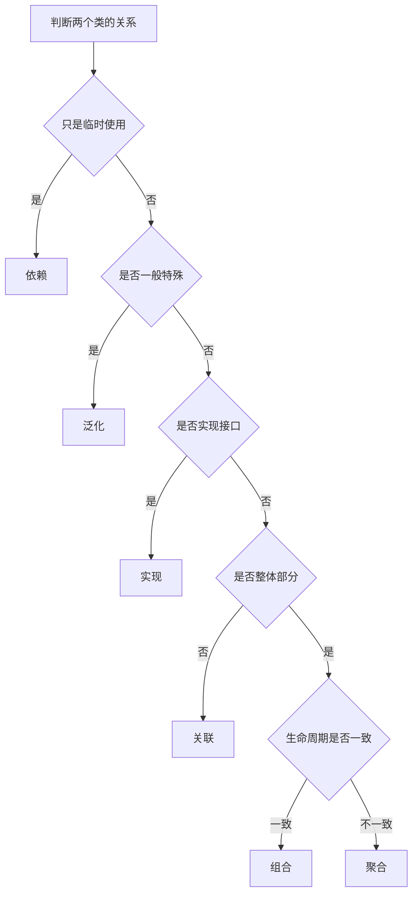
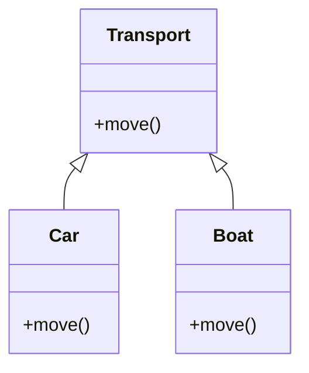
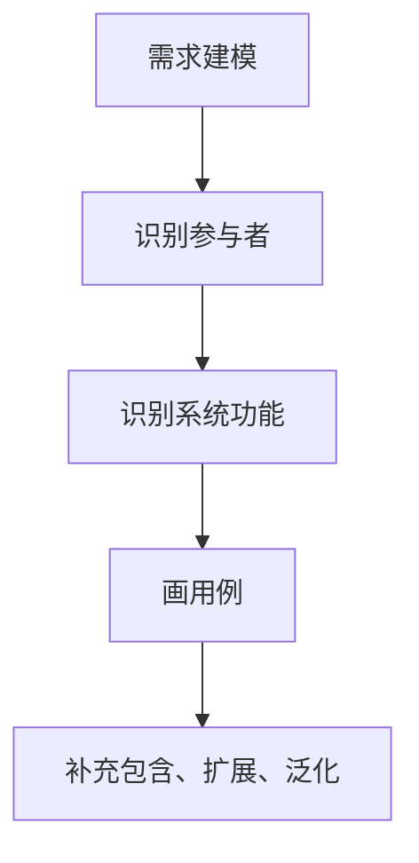
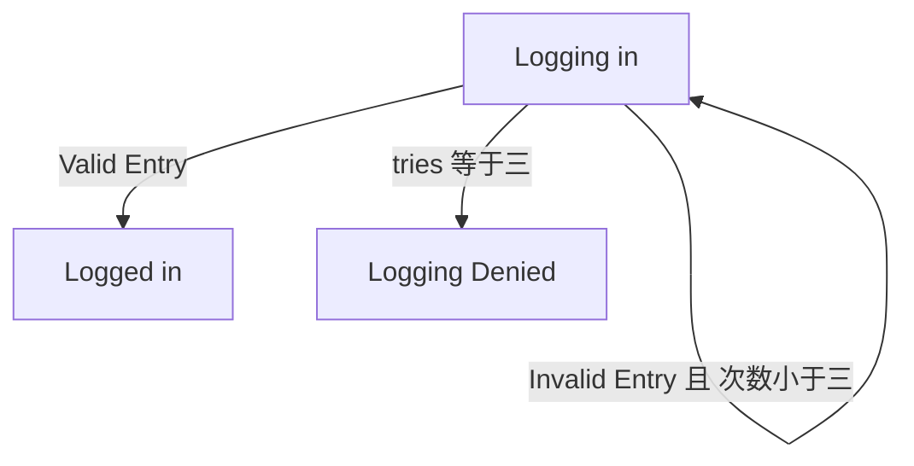

# chapter 7 - UML：笔记和例题整理

**适用对象**：软件设计师新手备考  
# 一、当前整理范围

```text
UML
├─ 1. UML 基本构成
│  ├─ UML 事物
│  │  ├─ 结构事物
│  │  ├─ 行为事物
│  │  ├─ 分组事物
│  │  └─ 注释事物
│  └─ UML 关系
│     ├─ 依赖
│     ├─ 关联
│     ├─ 聚合
│     ├─ 组合
│     ├─ 泛化
│     └─ 实现
├─ 2. 静态建模图
│  ├─ 类图
│  ├─ 对象图
│  └─ 用例图
├─ 3. 动态建模图
│  ├─ 序列图
│  ├─ 通信图
│  ├─ 状态图
│  └─ 活动图
├─ 4. 物理建模图
│  ├─ 构件图
│  └─ 部署图
└─ 5. 综合判断题
   ├─ 图类型识别
   ├─ 图适用场景
   ├─ 消息与接口判断
   └─ 静态、动态、物理视图区分
```

# 二、复习建议

| 轮次 | 目标 | 建议做法 | 关注重点 |
|---|---|---|---|
| 第 1 轮 | 先能认图 | 把 UML 图按“静态、动态、物理”三类记住 | 类图、用例图、序列图、状态图、活动图、构件图、部署图 |
| 第 2 轮 | 会判关系 | 重点比较依赖、关联、聚合、组合、泛化、实现 | 生命周期、整体部分、一般特殊、接口实现 |
| 第 3 轮 | 会读图 | 对图中箭头、菱形、多重度、生命线、分叉汇合逐个识别 | 类图、对象图、序列图、通信图、活动图 |
| 第 4 轮 | 做综合题 | 按专题刷原题，先写题眼再选答案 | 图片题、关系题、状态图题、组件/部署题 |

# 三、章节笔记

## 总记忆表

| 模块 | 记忆句 |
|---|---|
| UML 事物 | 类、接口、构件是**结构事物**；注释是**注释事物**。 |
| 依赖 | **临时使用**就是依赖；方法里用一下，不长期保存。 |
| 关联 | 对象之间有长期连接；可有多重度、角色名、导航性。 |
| 聚合 | 弱整体-部分；部分可独立存在，生命周期不一致。 |
| 组合 | 强整体-部分；整体消失，部分通常随之消失。 |
| 泛化 | 一般-特殊；父类与子类；继承关系。 |
| 实现 | 类或构件实现接口；接口声明服务，实现者提供服务。 |
| 类图 | 表示类、接口、协作及其关系；适合系统词汇、协作、逻辑数据库模式。 |
| 对象图 | 某一时刻对象和对象间关系，是类图的实例快照。 |
| 用例图 | 建模需求，说明系统要给参与者提供什么功能。 |
| 序列图 | 按时间顺序展示对象之间消息。 |
| 通信图 | 强调对象组织结构和消息编号。 |
| 状态图 | 描述反应型对象在事件触发下的状态变化。 |
| 活动图 | 描述业务流程、控制流、并发分叉与同步汇合。 |
| 构件图 | 展示组件之间的组织和依赖。 |
| 部署图 | 展示软件组件与硬件节点之间的物理关系。 |

## 1. UML 事物

### 1. 知识点

| UML 事物 | 典型内容 | 题目常见说法 | 做题落点 |
|---|---|---|---|
| 结构事物 | 类、接口、协作、用例、主动类、构件、节点 | “名词性元素”“静态骨架” | 类、接口、构件选结构 |
| 行为事物 | 交互、状态机、活动 | “动态行为”“消息交互”“状态变化” | 序列图、通信图、状态图、活动图相关 |
| 分组事物 | 包 | “组织模型元素” | 包是分组 |
| 注释事物 | 注释、约束、说明 | “依附于元素，对其约束或解释” | 注释事物 |

### 2. 记忆模板

```text
结构事物像“名词”：类、接口、构件、节点；
行为事物像“动词”：交互、状态机、活动；
分组事物像“文件夹”：包；
注释事物像“便签”：说明和约束。
```

### 3. 例题分析

**例 1**  
类、接口、构件属于哪种 UML 事物？  
先抓题眼：类、接口、构件是系统静态结构中的组成元素。  
结论：属于**结构事物**。

**例 2**  
依附于元素或一组元素之上，对其进行约束或解释的简单符号是什么？  
先抓题眼：约束、解释、附着在元素上。  
结论：属于**注释事物**。

### 4. 记忆技巧

```text
类接口构件看结构；
交互状态看行为；
包是分组；
便签解释是注释。
```

## 2. UML 关系

### 1. 知识点

| 关系 | 图形记忆 | 含义 | 题眼 |
|---|---|---|---|
| 依赖 | 虚线箭头 | 一个元素使用另一个元素，变化会影响使用者 | 方法中临时使用、调用库函数 |
| 关联 | 实线 | 对象之间有连接 | 对象间长期联系、多重度、角色名 |
| 聚合 | 空心菱形 | 弱整体-部分 | 部分可共享、可独立存在 |
| 组合 | 实心菱形 | 强整体-部分 | 生命周期一致，整体销毁部分销毁 |
| 泛化 | 空心三角箭头 | 一般-特殊 | 父类、子类、继承 |
| 实现 | 虚线空心三角 | 类/构件实现接口 | 接口、实现、服务声明 |

### 2. 关系判断流程



### 3. 例题分析

**例 1：方法中临时使用对象**  
类 A 仅在方法 `Method1` 中定义并使用类 B 的对象，A 的其他部分不涉及 B。  
先抓题眼：只在方法内部临时使用，不作为属性长期保存。  
结论：A 与 B 是**依赖**关系。

**例 2：属性包含对象且随整体销毁**  
类 A 的某个属性是类 B 的对象，并且 A 对象消失时 B 对象也随之消失。  
先抓题眼：属性包含 + 生命周期一致。  
结论：A 与 B 是**组合**关系。

**例 3：整体与部分可分离**  
整体对象消失后，部分对象仍然可以存在并继续工作。  
先抓题眼：整体-部分，但部分可独立存在。  
结论：是**聚合**关系。

### 4. 记忆技巧

```text
临时用，依赖；
长期连，关联；
空菱弱聚合；
实菱强组合；
父子是泛化；
接口靠实现。
```

## 3. 多重度与关联类

### 1. 知识点

| 内容 | 含义 | 题眼 |
|---|---|---|
| 多重度 | 一个类的实例能与另一个类的多少个实例关联 | `1`、`0..1`、`*`、`1..*`、`2..4` |
| 角色名 | 关联端对象在关系中扮演的角色 | owner、pet、employee |
| 关联类 | 当“关系本身”需要记录属性时，把关系建成类 | 医生治疗病人要记录日期时间 |
| 多个关联 | 两个类之间可以存在多个由不同角色标识的关联 | 同类之间不同业务语义 |

### 2. 多重度常见写法

| 写法 | 含义 | 例子 |
|---|---|---|
| `1` | 恰好 1 个 | 一个订单对应一个买家 |
| `0..1` | 0 个或 1 个 | 可选关联 |
| `*` | 0 个或多个 | 一个客户可有多个订单 |
| `1..*` | 至少 1 个 | 一个项目至少一个成员 |
| `2..4` | 2 到 4 个 | 限定数量范围 |

### 3. 例题分析

**例 1：多重度定义**  
题目问“UML 中关联的多重度是指什么”。  
先抓题眼：多重度不是调用次数，也不是方法个数，而是实例之间的数量对应。  
结论：一个类的实例能够与另一个类的多少个实例相关联。

**例 2：医生与病人治疗记录**  
医生可以治疗多位病人，病人可以由多名医生治疗，且同一医生可能多次治疗同一病人，还要记录日期和时间。  
先抓题眼：医生与病人之间的“治疗关系”本身有属性。  
结论：应建立关联类 `Treatment`，把日期、时间放到关联类中。

### 4. 记忆技巧

```text
多重度看数量；
关系有属性，关系变成类。
```

## 4. 类图

### 1. 知识点

| 内容 | 说明 | 考试题眼 |
|---|---|---|
| 类图用途 | 展示类、接口、协作及其静态关系 | 系统词汇、简单协作、逻辑数据库模式 |
| 类图不适合 | 不用于对象快照 | 对象快照是对象图 |
| 方法覆盖 | 子类以更具体方式实现父类同名方法 | `Car.move()`、`Boat.move()` 覆盖 `Transport.move()` |
| 组合/聚合 | 类图中常用菱形表示 | 生命周期判断 |
| 继承/泛化 | 空心三角箭头指向父类 | 一般-特殊关系 |

### 2. 类图稳定表达示例



> 上图只用于说明“父类与子类 + 子类覆盖父类方法”的结构。Typora 若对 Mermaid 类图支持不稳定，可改用 ASCII 图。

```text
Transport
└─ move()

Car 继承 Transport，并重新实现 move()
Boat 继承 Transport，并重新实现 move()
```

### 3. 例题分析

**例 1：Car 和 Boat 中的 move()**  
Car、Boat 继承 Transport，且都重新定义 `move()`。  
先抓题眼：子类中以适合自己的方式重新实现父类方法。  
结论：这是**覆盖**，不是重载。重载强调同名方法参数表不同；覆盖强调子类重写父类方法。

**例 2：类图不用于什么建模**  
类图可用于系统词汇、简单协作、逻辑数据库模式。  
先抓题眼：“对象快照”。  
结论：对象快照是对象图，不是类图。

### 4. 记忆技巧

```text
类图看静态结构；
对象快照找对象图；
同名不同参是重载；
子类改父类是覆盖。
```

## 5. 对象图

### 1. 知识点

| 内容 | 说明 |
|---|---|
| 对象图 | 某一时刻一组对象以及它们之间的关系 |
| 类图与对象图关系 | 对象图是类图在某一时刻的实例快照 |
| 对象表示 | `对象名:类名` |
| 判断一致性 | 对象图中的对象连接数必须符合类图多重度 |

### 2. 判断模板

```text
对象图一致性判断：
1. 先看类图中每个关联端的多重度。
2. 再数对象图中每个对象实际连接了几个对象。
3. 若连接数量超出多重度，或缺少必须连接，则对象图不一致。
```

### 3. 例题分析

**例**  
类图规定 `A 1 —— * B`，表示一个 B 对象必须关联唯一一个 A 对象，而一个 A 对象可以关联多个 B 对象。  
若某对象图中一个 `b1:B` 同时连接了两个 `A` 对象，则违反 B 端“唯一一个 A”的约束。  
结论：该对象图与类图不一致。

### 4. 记忆技巧

```text
类图是规则；
对象图是某一刻的实例；
对象图是否正确，就拿多重度逐个核对。
```

## 6. 用例图

### 1. 知识点

| 元素 | 说明 | 题眼 |
|---|---|---|
| 参与者 | 人、硬件或其他系统可以扮演的角色 | 小人图标、外部用户、外部系统 |
| 用例 | 系统为参与者提供的功能 | 椭圆 |
| 包含 | 公共必做行为抽取 | `include` |
| 扩展 | 特定条件下追加行为 | `extend` |
| 泛化 | 参与者或用例的一般-特殊关系 | 空心三角箭头 |

### 2. 用例图定位



### 3. 例题分析

**例 1：参与者含义**  
题目问 UML 用例图中参与者表示什么。  
先抓题眼：参与者不一定是真人，也可以是外部硬件、其他系统。  
结论：表示人、硬件或其他系统可以扮演的角色。

**例 2：对新系统需求建模**  
题目问“对新开发系统的需求进行建模，规划开发什么功能或测试用例，采用哪种图最适合”。  
结论：用例图。

### 4. 记忆技巧

```text
需求功能看用例；
外部角色叫参与者；
小人不一定是人，也可能是系统或硬件。
```

## 7. 序列图

### 1. 知识点

| 内容 | 说明 | 题眼 |
|---|---|---|
| 序列图 | 按时间顺序展示对象之间消息 | 生命线竖向排列，消息从上到下 |
| 同步消息 | 调用者等待返回 | 实线箭头，阻塞调用 |
| 异步消息 | 调用者不等待控制权返回 | 不引起调用者终止执行而等待 |
| 返回消息 | 返回结果 | 虚线箭头 |
| 类必须实现的方法 | 指向该类生命线的调用消息通常对应该类方法 | 不把返回消息当方法 |

### 2. 消息判断模板

```text
读序列图：
1. 看谁发消息，谁收消息。
2. 指向某对象生命线的调用消息，通常是该对象要实现的方法。
3. 虚线返回消息不是业务方法。
4. 同步消息要等返回；异步消息不等返回。
```

### 3. 例题分析

**例 1：Account 应实现哪些方法**  
序列图中若消息 `check()`、`plus()`、`minus()` 指向 `Account` 对象，说明 Account 需要提供这些操作。  
返回消息如 `evaluation` 只表示返回结果，不是 Account 必须实现的方法。  
结论：选包含 `check()`、`plus()`、`minus()` 的选项。

**例 2：异步消息与同步消息不同**  
题眼是“异步”。  
同步消息类似阻塞调用；异步消息发送后调用者不必等待控制权返回。  
结论：异步消息并不引起调用者终止执行而等待控制权的返回。

### 4. 记忆技巧

```text
序列图看时间；
从上到下读消息；
虚线是返回，不当方法；
异步不等待，同步要等待。
```

## 8. 通信图

### 1. 知识点

| 内容 | 说明 | 题眼 |
|---|---|---|
| 通信图 | 展示对象之间的消息流及其顺序 | 对象用连接线组织，消息带编号 |
| 与序列图区别 | 通信图强调对象结构；序列图强调时间顺序 | 编号如 `1`、`1.1`、`2.1` |
| 消息编号 | 表示调用顺序和嵌套关系 | `2.1` 表示第 2 步中的子消息 |

### 2. 通信图读法

```text
通信图做题：
1. 先找目标对象。
2. 再看发往目标对象的消息名。
3. 按消息编号判断顺序。
4. 如果题目问“某对象获取某信息的消息”，只找该对象对应的那条消息。
```

### 3. 例题分析

**例：Mapping 对象获取汽车当前位置**  
题眼是“Mapping 对象获取汽车当前位置 GPS Location”。  
图中发向 GPS Location 或由 Mapping 调用获取位置的消息通常是 `2:getCarPos()` 或其下级位置消息。  
若题目指定“Mapping 对象获取汽车当前位置的消息”，答案落在 `2:getCarPos()`。

### 4. 记忆技巧

```text
序列图看上下；
通信图看编号；
找对象、找消息、看编号。
```

## 9. 状态图

### 1. 知识点

| 内容 | 说明 | 题眼 |
|---|---|---|
| 状态图用途 | 对系统、类或用例的动态方面建模，通常用于反应型对象 | 状态、事件、转换 |
| 状态 | 对象生命周期中的条件或状况 | Logging in、Logged in |
| 转换 | 从一个状态到另一个状态 | 箭头 |
| 事件触发器 | 引发转换的事件 | `Valid Entry`、`e1` |
| 监护条件 | 事件发生后才检查的布尔条件 | `[tries < 3]` |
| 转换效果 | 转换时执行的动作 | `tries++` |
| do 动作 | 状态内部持续执行的活动 | `do/action` |
| exit 动作 | 离开状态时执行 | `exit/action` |

### 2. 状态转换模板

```text
事件 [监护条件] / 转换效果

例：
Invalid Entry [tries < 3] / tries++

含义：
当 Invalid Entry 事件发生时，若 tries < 3 成立，则发生转换，并执行 tries++。
```

### 3. 状态图稳定表达示例



### 4. 例题分析

**例 1：`[tries < 3]` 与 `tries++`**  
先抓题眼：方括号中的条件是监护条件；斜线后的动作是转换后效果。  
结论：`[tries < 3]` 是**监护条件**，`tries++` 是**转换后效果**。

**例 2：状态图不用于什么**  
状态图描述一个对象在事件触发下的状态变化，不用于描述多个对象之间的交互。  
多个对象之间的交互应看序列图或通信图。  
结论：说“用于描述多个对象之间的交互”的选项错误。

**例 3：没有终点状态是否无效**  
状态图可以没有终点状态。  
结论：不能因为没有 final 状态就判定状态图无效。

### 5. 记忆技巧

```text
状态图看一个对象怎么变；
事件触发转换；
方括号是条件；
斜线后是动作。
```

## 10. 活动图

### 1. 知识点

| 内容 | 说明 | 题眼 |
|---|---|---|
| 活动图用途 | 建模复杂用例中的业务处理流程 | 活动流、控制流、业务流程 |
| 分支 | 根据条件选择路径 | 菱形，有监护表达式 |
| 合并 | 多条可选路径合并 | 菱形汇入 |
| 分叉 | 一条流拆成多条并发流 | 粗横线，一进多出 |
| 汇合 | 多条并发流同步后继续 | 粗横线，多进一出 |
| 最大线程数 | 同一时刻并行分支的最大数量 | 看分叉后的并行路径数 |

### 2. 活动图读法

```text
活动图并发题：
1. 找粗横线分叉点。
2. 数分叉后同时可走的分支数。
3. 碰到汇合粗横线后，必须等并发分支都结束。
4. 最大线程数取整个图中同时并发活动数量的最大值。
```

### 3. 例题分析

**例 1：复杂业务流程建模工具**  
题眼是“复杂用例中的业务处理流程”。  
状态图看状态变化，序列图看消息时间，类图看静态结构。  
结论：最佳工具是**活动图**。

**例 2：能同时执行的活动**  
活动图中粗横线分叉后的活动可并行执行；在汇合点之前可同时运行。  
做题时不用逐字背图，只要沿控制流找到“同一分叉产生且未汇合”的活动即可。

### 4. 记忆技巧

```text
业务流程用活动图；
粗线分叉能并行；
粗线汇合要等待。
```

## 11. 构件图（组件图）

### 1. 知识点

| 内容 | 说明 | 题眼 |
|---|---|---|
| 构件图 | 展示组件之间的组织和依赖 | component、组件、接口 |
| 供接口 | 组件提供的服务 | 棒棒糖接口 |
| 需接口 | 组件需要调用的服务 | 插座接口 |
| 组件依赖 | 组件之间通过接口协作 | 需要某接口、实现某接口 |

> 注意：本章材料中特别标注“官方教程的供接口和需接口反了，图已经纠正”。因此遇到 2018 年下半年组件图题时，要按材料中纠正后的图判断：①②分别为**需接口、供接口**。

### 2. 构件图判断模板

```text
组件图题：
1. 看到 component 或组件符号，优先判构件图。
2. 问“用于展示什么”，答组件之间的组织和依赖。
3. 棒棒糖是供接口，插座是需接口。
4. 谁需要接口，谁就调用别人提供的服务。
```

### 3. 例题分析

**例 1：AccountManagement 需要什么**  
若 AccountManagement 通过需接口连接到 CreditCardServices 提供的 IdentityVerifier 接口，说明 AccountManagement 调用 CreditCardServices 实现的接口。  
结论：不是自己实现，而是**调用 CreditCardServices 实现的 IdentityVerifier 接口**。

**例 2：组件图用途**  
题眼是“组件之间的组织和依赖”。  
结论：是组件图，不是部署图。部署图强调软件与硬件的物理分布。

### 4. 记忆技巧

```text
组件图看软件部件；
棒棒糖提供服务；
插座需要服务；
部署图才看硬件节点。
```

## 12. 部署图

### 1. 知识点

| 内容 | 说明 | 题眼 |
|---|---|---|
| 部署图 | 展示交付系统中软件和硬件之间的物理关系 | 节点、设备、处理器、构件部署 |
| 使用阶段 | 通常在实施阶段使用 | 交付、安装、部署 |
| 与组件图区别 | 组件图看软件组件依赖；部署图看硬件节点与软件部署 | 物理模型、计算机系统分布 |

### 2. 对比表

| 图 | 核心对象 | 重点 |
|---|---|---|
| 构件图 | 软件组件、接口 | 组件之间的组织与依赖 |
| 部署图 | 硬件节点、软件构件 | 软件与硬件之间的物理关系 |

### 3. 例题分析

**例 1：表示软件组件和硬件之间的物理关系**  
题眼是“软件组件和硬件”“物理关系”。  
结论：部署图。

**例 2：部署图通常在哪个阶段使用**  
题眼是“部署”。需求分析和架构设计更偏建模；实现是编码；部署图通常用于实施部署。  
结论：实施阶段。

### 4. 记忆技巧

```text
组件图：软件之间；
部署图：软件放到硬件上。
```

## 13. UML 图总和

### 1. 知识点总表

| 分类 | 图 | 核心用途 |
|---|---|---|
| 静态建模 | 类图 | 类、接口、协作及其关系 |
| 静态建模 | 对象图 | 某一时刻对象快照 |
| 静态建模 | 用例图 | 需求功能与参与者 |
| 动态建模 | 序列图 | 按时间顺序的消息交互 |
| 动态建模 | 通信图 | 对象组织结构和消息编号 |
| 动态建模 | 状态图 | 反应型对象状态变化 |
| 动态建模 | 活动图 | 业务流程和并发控制 |
| 物理建模 | 构件图 | 软件组件组织和依赖 |
| 物理建模 | 部署图 | 软件与硬件物理关系 |

### 2. 交互图范围

| 是否交互图 | 图 |
|---|---|
| 是 | 序列图 |
| 是 | 通信图 |
| 是 | 定时图 |
| 否 | 对象图 |

### 3. 记忆技巧

```text
静态：类、对象、用例；
动态：序列、通信、状态、活动；
物理：构件、部署；
交互图：序列、通信、定时，不含对象图。
```

# 四、按专题插入原题与解析

## 专题一：UML 事物

### 题 1
**原题**  
UML 中有 4 种事物：结构事物、行为事物、分组事物和注释事物。类、接口、构件属于（41）事物；一个依附于一个元素或一组元素之上对其进行约束或解释的简单符号为（42）事物。（2014 年下半年）

- （41）A. 结构　B. 行为　C. 分组　D. 注释
- （42）A. 结构　B. 行为　C. 分组　D. 注释

**解析**  
先抓题眼：类、接口、构件都是 UML 静态结构中的模型元素，属于结构事物。  
“依附于元素或一组元素，对其进行约束或解释”是注释的定义。  
因此（41）选结构，（42）选注释。

**正确答案**  
（41）A；（42）D

**答案方向**  
类接口构件看结构；解释约束看注释。

## 专题二：UML 关系

### 题 2
**原题**  
若类 A 仅在其方法 Method1 中定义并使用了类 B 的一个对象，类 A 其他部分的代码都不涉及类 B，那么类 A 与类 B 的关系应为（41）；若类 A 的某个属性是类 B 的一个对象，并且类 A 对象消失时，类 B 对象也随之消失，则类 A 与类 B 的关系应为（42）。（2009 年上半年）

- A. 关联
- B. 依赖
- C. 聚合
- D. 组合

**解析**  
先抓题眼：第一空只是在方法内部临时使用类 B，不长期持有 B 的对象，这是依赖。  
第二空是属性包含对象，并且整体 A 消失时部分 B 也消失，生命周期一致，是强整体-部分关系，即组合。

**正确答案**  
（41）B；（42）D

**答案方向**  
方法里临时用是依赖；整体销毁部分也销毁是组合。

### 题 3
**原题**  
若类 A 需要使用标准数学函数类库中提供的功能，那么类 A 与标准类库提供的类之间存在（45）关系；若类 A 中包含了其他类的实例，且当类 A 的实例消失时，其包含的其他类的实例也消失，则存在（46）关系；若类 A 的实例消失时，其他类的实例仍然存在并继续工作，则存在（47）关系。（2010 年上半年）

- A. 依赖
- B. 关联
- C. 聚合
- D. 组合

**解析**  
先抓题眼：使用标准类库功能，是“使用”关系，属于依赖。  
包含的实例随 A 消失而消失，生命周期一致，是组合。  
A 消失后部分仍然存在，是弱整体-部分关系，即聚合。

**正确答案**  
（45）A；（46）D；（47）C

**答案方向**  
使用库函数是依赖；同生共死是组合；可独立存在是聚合。

### 题 4
**原题**  
（43）是一种很强的“拥有”关系，“部分”和“整体”的生命周期通常一样；（44）同样表示“拥有”关系，但“部分”对象可以共享，也可以脱离“整体”单独存在。上述两种关系都是（45）关系的特殊种类。（2010 年下半年）

- A. 聚合
- B. 组合
- C. 继承
- D. 关联

**解析**  
强拥有、生命周期通常一样，是组合。  
弱拥有、部分对象可共享、可独立存在，是聚合。  
聚合和组合都属于关联的特殊形式。

**正确答案**  
（43）B；（44）A；（45）D

**答案方向**  
组合强，聚合弱；二者都是关联的特殊情况。

### 题 5
**原题**  
面向对象技术中，组合关系表示（37）。（2012 年上半年）

- A. 包与其中模型元素的关系
- B. 用例之间的一种关系
- C. 类与其对象的关系
- D. 整体与其部分之间的一种关系

**解析**  
先抓题眼：组合是 composition。它不是包关系，也不是用例关系，更不是类和对象的实例关系。组合表达强整体-部分。

**正确答案**  
D

**答案方向**  
看到组合，直接落到整体与部分。

### 题 6
**原题**  
（37）是一个类与它的一个或多个细化类之间的关系，即一般与特殊的关系。（2014 年上半年）

- A. 泛化
- B. 关联
- C. 聚集
- D. 组合

**解析**  
先抓题眼：一般与特殊。UML 中表示一般-特殊关系的是泛化，也就是继承关系的建模表达。

**正确答案**  
A

**答案方向**  
一般特殊选泛化。

### 题 7
**原题**  
UML 中有 4 种关系：依赖、关联、泛化和实现。（40）是一种结构关系，描述了一组链，链是对象之间的连接；（41）是一种特殊/一般关系，使子元素共享其父元素的结构和行为。（2015 年上半年）

- A. 依赖
- B. 关联
- C. 泛化
- D. 实现

**解析**  
“描述一组链，链是对象之间的连接”是关联的定义。  
“特殊/一般关系，使子元素共享父元素结构和行为”是泛化。

**正确答案**  
（40）B；（41）C

**答案方向**  
链是关联；特殊一般是泛化。

### 题 8
**原题**  
UML 中关联是一个结构关系，描述了一组链。两个类之间（40）关联。（2016 年上半年）

- A. 不能有多个
- B. 可以有多个由不同角色标识的
- C. 可以有任意多个
- D. 的多个关联必须聚合成一个

**解析**  
先抓题眼：两个类之间可能因为业务语义不同而存在多条关联，但应通过不同角色名加以区分。不是任意多个，也不是必须聚合成一个。

**正确答案**  
B

**答案方向**  
两个类之间可有多个关联，但要用不同角色标识。

### 题 9
**原题**  
将汽车作为一个系统，以下（38）之间不属于组成（Composition）关系。（2019 年上半年）

- A. 汽车和座位
- B. 汽车和车窗
- C. 汽车和发动机
- D. 汽车和音乐系统

**解析**  
先抓题眼：Composition 表示强整体-部分。座位、车窗、发动机通常可视为汽车组成部分。音乐系统更像可选设备，不一定是汽车必不可少的组成部分。  
因此选音乐系统。

**正确答案**  
D

**答案方向**  
组合题看是否“必然组成、生命周期强绑定”。

### 题 10
**原题**  
聚合对象是指一个对象（40）。（2019 年上半年）

- A. 只有静态方法
- B. 只有基本类型的属性
- C. 包含其它对象
- D. 只包含基本类型的属性和实例方法

**解析**  
聚合强调整体包含部分，因此聚合对象就是包含其他对象的对象。与是否只有静态方法、基本类型属性无关。

**正确答案**  
C

**答案方向**  
聚合对象就是包含其他对象。

### 题 11
**原题**  
电商系统中识别出网店、商品、购物车、订单、买家、库存、支付等类。其中，购物车与商品之间适合采用（39）关系，网店与商品之间适合采用（40）关系。（2021 年下半年）

- A. 关联
- B. 依赖
- C. 组合
- D. 聚合

**解析**  
先抓题眼：购物车与商品之间通常是业务上的连接，购物车删除不意味着商品删除，因此不应建组合。考试语境中多落为普通关联。  
网店包含商品，商品可以脱离某个网店或被其他关系复用，属于弱整体-部分，更适合聚合。  

**正确答案**  
（39）A；（40）D

**答案方向**  
购物车和商品偏关联；网店包含商品偏聚合；只要商品不随整体销毁，就别选组合。

## 专题三：多重度与关联类

### 题 12
**原题**  
UML 中关联的多重度是指（42）。（2011 年上半年）

- A. 一个类中被另一个类调用的方法个数
- B. 一个类的某个方法被另一个类调用的次数
- C. 一个类的实例能够与另一个类的多少个实例相关联
- D. 两个类所具有的相同的方法和属性

**解析**  
先抓题眼：多重度看“数量对应”，不是方法调用次数。  
它描述一个类的实例能和另一个类的多少个实例发生关联。

**正确答案**  
C

**答案方向**  
多重度 = 实例之间的数量关系。

### 题 13
**原题**  
一个公司负责多个项目，每个项目由一个员工团队开发。下列 UML 概念图中，（41）最适合描述这一场景。（2012 年下半年）

- A. 图 A
- B. 图 B
- C. 图 C
- D. 图 D

**解析**  
先抓题眼：Company 负责多个 Project；每个 Project 由一个 Team 开发；Team 由多个 Employee 组成。  
正确图应体现 Company 与 Project 的一对多关系，以及 Project 与 Team 的对应关系，Team 与 Employee 的一对多关系。  
在原题图中，图 B 对关系和多重度表达最贴近。

**正确答案**  
B

**答案方向**  
图形题不要先看图名，先翻译场景中的“一个/多个/由……组成”。

### 题 14
**原题**  
描述一些人（Person）将动物（Animal）养为宠物（Pet）的是图（43）。（2013 年上半年）

- A. ①
- B. ②
- C. ③
- D. ④

**解析**  
先抓题眼：“Pet”不是新动物种类，而是 Animal 在 Person 关系中的角色，即一些 Animal 被 Person 作为宠物饲养。  
正确图应表达 Person 与 Animal 的关联，并在 Animal 一端标注 pet 角色，而不是把 Pet 当成独立类或继承类。  

**正确答案**  
A

**答案方向**  
角色名不是类；“养为宠物”常是关联角色，不一定要建 Pet 类。

### 题 15
**原题**  
采用面向对象方法进行系统开发时，需要对两者之间关系创建新类的是（38）。（2019 年下半年）

- A. 汽车和座位
- B. 主人和宠物
- C. 医生和病人
- D. 部门和员工

**解析**  
先抓题眼：什么时候需要“关系类”？当两个类之间的关系本身需要记录属性时。医生与病人之间的“治疗”往往要记录时间、诊断、次数等属性，因此适合把关系建成新类。  
其他选项通常可以用普通关联、聚合或组合表示。

**正确答案**  
C

**答案方向**  
关系上有属性，就创建关联类；医生—病人—治疗是高频模型。

## 专题四：类图与对象图

### 题 16
**原题**  
UML 类图中，Car 和 Boat 类中的 `move()` 方法（39）了 Transport 类中的 `move()` 方法。（2015 年下半年）

- A. 继承
- B. 覆盖（重置）
- C. 重载
- D. 聚合

**解析**  
先抓题眼：Car 和 Boat 是 Transport 的子类，并重新实现父类的 `move()`。  
重载是同一类中同名方法参数表不同；覆盖是子类重写父类方法。  
本题是覆盖。

**正确答案**  
B

**答案方向**  
子类重写父类同名方法，选覆盖。

### 题 17
**原题**  
医生可以治疗多位病人，病人可以由多名医生治疗，同一医生可能多次治疗同一病人。要记录治疗日期和时间。下列图中（43）是描述此场景的模型；这些图是 UML（42）。（2016 年下半年）

- （42）A. 用例图　B. 对象图　C. 类图　D. 协作图
- （43）A. ①　B. ②　C. ③　D. ④

**解析**  
先抓题眼：Doctor、Patient、Treatment 是类，图中展示类及其关系，因此是类图。  
治疗关系具有日期和时间属性，因此应把 Treatment 建成关联类。原图中①能表达 Doctor 与 Patient 之间的多对多治疗关系，并把 Treatment 作为关联类记录 date、time。

**正确答案**  
（42）C；（43）A

**答案方向**  
看到类框和关系选类图；关系有属性选关联类。

### 题 18
**原题**  
如图所示的 UML 类图中，Shop 和 Magazine 之间为（41）关系，Magazine 和 Page 之间为（42）关系。UML 类图通常不用于对（43）进行建模。（2017 年下半年）

- A. 关联
- B. 依赖
- C. 组合
- D. 继承

第三空选项：
- A. 系统的词汇
- B. 简单的协作
- C. 逻辑数据库模式
- D. 对象快照

**解析**  
Shop sells Magazine，表达普通关联。  
Magazine 由 Page 组成，且 Page 通常依附于 Magazine，是强整体-部分关系，属于组合。  
类图用于系统词汇、简单协作、逻辑数据库模式；对象快照属于对象图。

**正确答案**  
（41）A；（42）C；（43）D

**答案方向**  
普通销售是关联；杂志和页面是组合；对象快照找对象图。

### 题 19
**原题**  
下图所示 UML 图为（42），有关该图的叙述中，不正确的是（43）。（2019 年下半年）

- （42）A. 对象图　B. 类图　C. 组件图　D. 部署图
- （43）A. 如果 B 的一个实例被删除，所有包含 A 的实例都被删除  
  B. A 的一个实例可以与 B 的一个实例关联  
  C. B 的一个实例被唯一的一个 A 的实例所包含  
  D. B 的一个实例可与 B 的另外两个实例关联

**解析**  
图中展示类 A、B 及其关联、多重度和组合关系，是类图。  
组合菱形在 A 一端，表示 A 包含 B。若 A 被删除，B 通常随之删除；不是 B 删除导致包含 A 的实例被删除。  
因此 A 选项方向颠倒，不正确。

**正确答案**  
（42）B；（43）A

**答案方向**  
组合关系要看菱形在哪端；整体删部分，不是部分删整体。

### 题 20
**原题**  
某类图如图所示，下列选项错误的是（41）。（2020 年下半年）

- A. 一个 A1 的对象可能与一个 A2 的对象关联
- B. 一个 A 的非直接对象可能与一个 A1 的对象关联
- C. 类 B1 的对象可能通过 A2 与 C1 的对象关联
- D. 有可能 A 的直接对象与 B1 的对象关联

**解析**  
先抓题眼：图中 A 是抽象类，A1、A2 是 A 的具体子类。抽象类 A 不会直接产生对象。  
因此凡是说“A 的直接对象”参与关联的说法都不成立。  
选项 D 说“有可能 A 的直接对象与 B1 的对象关联”，错误点在“直接对象”。

**正确答案**  
D

**答案方向**  
抽象类不能直接实例化；看到“抽象类的直接对象”要警惕。

### 题 21
**原题**  
UML 图中，对象图展现了（42），（43）所示对象图与给定类图不一致。（2020 年下半年）

- （42）A. 一组对象、接口、协作和它们之间的关系  
  B. 一组用例、参与者以及它们之间的关系  
  C. 某一时刻一组对象以及它们之间的关系  
  D. 以时间顺序组织的对象之间的交互活动

**解析**  
对象图是类图的实例快照，表示某一时刻对象及对象之间的关系。  
判断对象图是否一致，要拿类图多重度逐一核对。原题图中不一致的是 A 图，因为对象连接数量违反了类图端的多重度约束。

**正确答案**  
（42）C；（43）A

**答案方向**  
对象图 = 某一时刻对象快照；图是否一致看多重度。

## 专题五：用例图

### 题 22
**原题**  
如下所示 UML 图中，（Ⅰ）是（40），（Ⅱ）是（41），（Ⅲ）是（42）。（2015 年下半年）

- A. 参与者
- B. 用例
- C. 泛化关系
- D. 包含关系

**解析**  
图中小人表示参与者；椭圆表示用例；带 `include` 的虚线关系表示包含关系。  
因此（Ⅰ）为参与者，（Ⅱ）为用例，（Ⅲ）为包含关系。

**正确答案**  
（40）A；（41）B；（42）D

**答案方向**  
小人参与者，椭圆用例，include 是包含。

### 题 23
**原题**  
在 UML 用例图中，参与者表示（39）。（2016 年上半年）

- A. 人、硬件或其他系统可以扮演的角色
- B. 可以完成多种动作的相同用户
- C. 不管角色的实际物理用户
- D. 带接口的物理系统或者硬件设计

**解析**  
参与者是系统外部与系统交互的角色。它可以是人，也可以是硬件设备或其他系统。  
选项 A 概括最准确。

**正确答案**  
A

**答案方向**  
参与者不是只能是人；外部系统和硬件也可以是参与者。

## 专题六：序列图与通信图

### 题 24
**原题**  
UML 序列图中，（39）表示返回消息，Account 应该实现的方法有（40）。（2013 年下半年）

- （39）A. xfer　B. check　C. evaluation　D. minus
- （40）A. xfer()  
  B. xfer()、plus() 和 minus()  
  C. check()、plus() 和 minus()  
  D. xfer()、evaluation()、plus() 和 minus()

**解析**  
先抓题眼：虚线箭头通常表示返回消息。图中 `evaluation` 是返回消息。  
Account 应实现指向 Account 生命线的调用消息，如 `check()`、`plus()`、`minus()`；返回消息不算方法。

**正确答案**  
（39）C；（40）B

**答案方向**  
虚线是返回；指向类的调用消息才是方法。

### 题 25
**原题**  
如下 UML 序列图中，（42）表示返回消息，Account 类必须实现的方法有（43）。（2014 年上半年）

- （42）A. tansID　B. balance　C. withdraw　D. deposit
- （43）A. start()  
  B. checkBalance() 和 withdraw()  
  C. deposit()  
  D. checkBalance()、withdraw() 和 deposit()

**解析**  
图中 `balance` 是返回余额的返回消息。  
Account 类的生命线上收到 `checkBalance()` 和 `withdraw()`，因此 Account 必须实现这两个方法。`deposit()` 指向另一个 Account 对象，不属于当前 src Account 必须实现的方法判断点。

**正确答案**  
（42）B；（43）D

**答案方向**  
返回消息不当方法；题目问“Account 类”时，要看所有 Account 实例接收的调用消息。

### 题 26
**原题**  
下图所示 UML 图为（42），用于展示系统中（43）。（2019 年上半年）

- （42）A. 用例图　B. 活动图　C. 序列图　D. 交互图
- （43）A. 一个用例和一个对象的行为  
  B. 一个用例和多个对象的行为  
  C. 多个用例和一个对象的行为  
  D. 多个用例和多个对象的行为

**解析**  
图中有对象生命线、消息箭头，并按时间从上到下排列，是序列图。  
序列图通常展示一个用例场景中多个对象之间的行为和交互。

**正确答案**  
（42）C；（43）B

**答案方向**  
生命线 + 时间顺序消息 = 序列图；通常描述一个用例中多个对象的行为。

### 题 27
**原题**  
给定 UML 图，判断（41）图类型、（42）图中方框元素、（43）带编号箭头含义。（2017 年上半年）

- （41）A. 序列图　B. 状态图　C. 通信图　D. 活动图
- （42）A. 类　B. 对象　C. 流名称　D. 消息
- （43）A. 类　B. 对象　C. 流名称　D. 消息

**解析**  
图中对象之间通过连接线发送编号消息，强调对象组织结构和消息顺序，是通信图。  
通信图中的矩形通常表示对象，带编号的箭头表示消息。

**正确答案**  
（41）C；（42）B；（43）D

**答案方向**  
有对象连接 + 编号消息，选通信图。

### 题 28
**原题**  
汽车导航系统图为 UML 的（41），用于展示（42）。Mapping 对象获取汽车当前位置的消息为（43）。（2018 年上半年）

- （41）A. 类图　B. 组件图　C. 通信图　D. 部署图
- （42）A. 对象之间的消息流及其顺序  
  B. 完成任务所进行的活动流  
  C. 对象的状态转换及其事件顺序  
  D. 对象之间信息的时间顺序
- （43）A. 1:getGraphic()　B. 2:getCarPos()　C. 1.1:CurrentArea()　D. 2.1:getCarLocation()

**解析**  
图中多个对象通过编号消息交互，是通信图。通信图用于展示对象之间的消息流及其顺序。  
Mapping 获取汽车当前位置，对应消息为 `2:getCarPos()`。

**正确答案**  
（41）C；（42）A；（43）B

**答案方向**  
通信图看编号；Mapping 获取位置找 `getCarPos()`。

### 题 29
**原题**  
UML 序列图中，异步消息与同步消息不同，（40）。图中（41）表示同步消息，（42）表示异步消息，（43）表示返回消息。（2012 年上半年）

- （40）A. 异步消息并不引起调用者终止执行而等待控制权的返回  
  B. 异步消息和阻塞调用有相同的效果  
  C. 异步消息是同步消息的响应  
  D. 异步消息和同步消息一样等待返回消息

**解析**  
先抓题眼：异步消息发送后，调用者不必阻塞等待。  
图中实线实心箭头一般表示同步调用，开放箭头表示异步消息，虚线表示返回消息。按照原图编号判断，同步消息为 1，异步消息为 3，返回消息为 2。

**正确答案**  
（40）A；（41）A；（42）C；（43）B

**答案方向**  
异步不等待；虚线返回；同步通常阻塞等待。

## 专题七：状态图

### 题 30
**原题**  
以下关于 UML 状态图的叙述中，不正确的是（41）。对给定状态图的描述正确的是（42）。（2013 年上半年）

- （41）A. 用于描述一个对象在多个用例中的行为  
  B. 用于某些具有多个状态的对象而不是系统中大多数或全部对象  
  C. 用于描述多个对象之间的交互  
  D. 可以用于用户界面或控制对象
- （42）A. ON 是一个并发状态  
  B. 因为此状态图中没有终点状态，所以此图是无效的  
  C. play、stop 和 rew 是动作  
  D. ON 是超状态

**解析**  
状态图描述一个对象的状态变化，不是描述多个对象之间交互；多个对象交互应看序列图或通信图。  
图中 ON 包含 Idle、Playing、Rewinding 等子状态，因此 ON 是超状态。play、stop、rew 是触发事件，不是动作。没有终点状态不代表图无效。

**正确答案**  
（41）C；（42）D

**答案方向**  
状态图看单个反应型对象；多个对象交互不是状态图。

### 题 31
**原题**  
如下状态图中，（40）时，不一定会离开状态 B。（2016 年下半年）

- A. 状态 B 中的两个结束状态均达到
- B. 在当前状态为 B2 时，事件 e2 发生
- C. 事件 e2 发生
- D. 事件 e1 发生

**解析**  
状态 B 内有并发子状态区域。若只说事件 e2 发生，不一定当前处在能响应该事件的子状态上，因此不一定离开状态 B。  
若两个结束状态均达到，通常可触发复合状态完成；若当前在 B2 且 e2 发生，则满足更具体条件。

**正确答案**  
C

**答案方向**  
状态图题要看“当前活动子状态”；只说事件发生，不一定能转换。

### 题 32
**原题**  
以下关于 UML 状态图中转换的叙述中，不正确的是（41）。（2016 年下半年）

- A. 活动可以在转换时执行也可以在状态内执行
- B. 监护条件只有在相应的事件发生时才进行检查
- C. 一个转换可以有事件触发器、监护条件和一个状态
- D. 事件触发转换

**解析**  
转换可以带事件触发器、监护条件和动作效果，但不是“带一个状态”。状态是转换的源或目标，而不是转换自身的组成部分。  
因此 C 错。

**正确答案**  
C

**答案方向**  
转换格式是“事件 [条件] / 动作”，不是“事件、条件、状态”。

### 题 33
**原题**  
以下关于 UML 状态图的叙述中，不正确的是（41）。（2019 年下半年）

- A. 活动可以在状态内执行，也可以在迁移时执行
- B. 若事件触发一个没有特定监护条件的迁移，则对象离开当前状态
- C. 迁移可以包含事件触发器，监护条件和状态
- D. 事件触发迁移

**解析**  
与上一题同理，迁移可以包含事件触发器、监护条件和动作效果，而不是包含“状态”。状态是迁移的源状态或目标状态。  
因此 C 错。

**正确答案**  
C

**答案方向**  
看到“迁移包含状态”要判错。

### 题 34
**原题**  
当 UML 状态用于对系统、类或用例的动态方面建模时，通常是对（41）建模。给定状态图中，假设活动状态是 A，事件 `b=0` 发生并且 `a>5`，发生 C 到 D 转换条件的是（42），有关状态图的叙述中，不正确的是（43）。（2021 年上半年）

- （41）A. 系统的词汇　B. 反应型对象　C. 活动流程　D. 对象快照

**解析**  
状态图通常对反应型对象建模。  
题中 C 到 D 转换条件依赖复合状态 C 中 A、B 区域动作完成情况。原题解析落点为：一旦状态 A 和 B 的所有动作完成，满足向 D 转换的条件。  
关于时间事件，`when(b=5)` 属于变化事件，不是时间事件，因此说它是时间事件不正确。

**正确答案**  
（41）B；（42）B；（43）C

**答案方向**  
状态图看反应型对象；`after` 常是时间事件，`when` 更偏变化条件。

### 题 35
**原题**  
用户登录失败次数不能超过 3 次。状态图中活动状态为 Logging in，当 Valid Entry 发生时（41）。其中 `[tries<3]` 和 `tries++` 分别为（42）和（43）。（2021 年下半年）

- （41）A. 保持在 Logging in 状态  
  B. 若 `[tries<3]` 为 true，则 Logging in 变为下一个活动状态  
  C. Logging in 立刻变为下一个活动状态  
  D. 若 tries=3 为 true，则 Logging in 变为下一个活动状态
- （42）A. 状态　B. 转换　C. 监护条件　D. 转换后效果
- （43）A. 状态　B. 转换　C. 监护条件　D. 转换后效果

**解析**  
图中 Valid Entry 通常表示登录信息有效，发生后从 Logging in 转到 Logged in。  
`[tries<3]` 写在方括号中，是监护条件。`tries++` 是在转换过程中执行的动作效果，即转换后效果。

**正确答案**  
（41）C；（42）C；（43）D

**答案方向**  
有效输入直接进入登录成功；方括号是监护条件，斜线后动作是转换效果。

## 专题八：活动图

### 题 36
**原题**  
下列活动图中可以同时执行的活动是（43）。（2012 年下半年）

- A. a44 和 a66
- B. a22，a33 和 a44
- C. a11 和 a77
- D. a66 和 a77

**解析**  
先抓题眼：活动图中粗横线分叉后的活动可以并发执行。  
原图中 a22、a33、a44 由同一分叉产生，在汇合之前可以同时执行。

**正确答案**  
B

**答案方向**  
并发题找分叉粗线，同一分叉后的活动可同时执行。

### 题 37
**原题**  
在执行如下 UML 活动图时，能同时运行的最大线程数为（38）。（2013 年下半年）

- A. 4
- B. 3
- C. 2
- D. 1

**解析**  
先找活动图中分叉产生的并行路径。原图任一时刻最多有 2 条路径同时运行，后续汇合后再继续执行。  
因此最大线程数为 2。

**正确答案**  
C

**答案方向**  
最大线程数不是看活动总数，而是看同一时刻最大并发分支数。

### 题 38
**原题**  
对一个复杂用例中的业务处理流程进行进一步建模的最佳工具是 UML（41）。（2014 年上半年）

- A. 状态图
- B. 顺序图
- C. 类图
- D. 活动图

**解析**  
先抓题眼：复杂用例中的业务处理流程。  
业务流程、控制流、分支、并发最适合用活动图表达。状态图偏对象状态，顺序图偏对象消息，类图偏静态结构。

**正确答案**  
D

**答案方向**  
业务流程选活动图。

### 题 39
**原题**  
如下所示 UML 图是（41），图中（Ⅰ）表示（42），（Ⅱ）表示（43）。（2016 年上半年）

- （41）A. 序列图　B. 状态图　C. 通信图　D. 活动图
- （42）A. 合并分叉　B. 分支　C. 合并汇合　D. 流
- （43）A. 分支条件　B. 监护表达式　C. 动作名　D. 流名称

**解析**  
图中有活动节点、开始/结束、控制流和分支汇合，是活动图。  
菱形结构用于分支或合并；题中（Ⅰ）对应分支结构，（Ⅱ）标注在控制流上表示监护表达式。

**正确答案**  
（41）D；（42）A；（43）B

**答案方向**  
活动图看流程；分支条件写在控制流上，属于监护表达式。

## 专题九：构件图与部署图

### 题 40
**原题**  
下图属于 UML 中的（46），其中 AccountManagement 需要（47）。（2009 年上半年）

- （46）A. 组件图　B. 部署图　C. 类图　D. 对象图
- （47）A. 实现 IdentityVerifier 接口并被 CreditCardServices 调用  
  B. 调用 CreditCardServices 实现的 IdentityVerifier 接口  
  C. 实现 IdentityVerifier 接口并被 Logger 调用  
  D. 调用 Logger 实现的 IdentityVerifier 接口

**解析**  
图中有 component 标识和接口连接，是组件图。  
AccountManagement 通过需接口使用 CreditCardServices 提供的 IdentityVerifier 接口，因此是调用 CreditCardServices 实现的接口。

**正确答案**  
（46）A；（47）B

**答案方向**  
组件图看 component；需要接口的一方是调用者，供接口的一方是实现者。

### 题 41
**原题**  
下图所示为 UML（43）。（2015 年下半年）

- A. 类图
- B. 部署图
- C. 组件图
- D. 网络图

**解析**  
图中展示软件组件及其依赖关系，而不是类与类的静态关系，也不是硬件节点部署。  
因此是组件图。

**正确答案**  
C

**答案方向**  
软件组件之间的依赖，选组件图。

### 题 42
**原题**  
下图所示 UML 图为（41），用于展示（42）。①和②分别表示（43）。（2018 年下半年）

- （41）A. 类图　B. 组件图　C. 通信图　D. 部署图
- （42）A. 一组对象、接口、协作和它们之间的关系  
  B. 收发消息的对象的结构组织  
  C. 组件之间的组织和依赖  
  D. 面向对象系统的物理模型
- （43）A. 供接口和供接口　B. 需接口和需接口　C. 供接口和需接口　D. 需接口和供接口

**解析**  
图中展示组件和接口，是组件图。组件图用于展示组件之间的组织和依赖。  
根据本章材料对原题图的纠正，①和②分别表示需接口和供接口。

**正确答案**  
（41）B；（42）C；（43）D

**答案方向**  
组件图题要分清供接口与需接口；本题按纠正图选“需接口、供接口”。

### 题 43
**原题**  
采用 UML 进行面向对象开发时，部署图通常在（45）阶段使用。（2011 年下半年）

- A. 需求分析
- B. 架构设计
- C. 实现
- D. 实施

**解析**  
部署图展示系统交付时软件构件如何部署到硬件节点上，因此最贴近实施阶段。

**正确答案**  
D

**答案方向**  
部署图对应实施部署。

### 题 44
**原题**  
如果要表示待开发软件系统中软件组件和硬件之间的物理关系，通常采用 UML 中的（40）。（2012 年下半年）

- A. 组件图
- B. 部署图
- C. 类图
- D. 网络图

**解析**  
题眼是“软件组件和硬件之间的物理关系”。组件图只看软件组件依赖；部署图才表示软件与硬件的物理部署关系。

**正确答案**  
B

**答案方向**  
软件 + 硬件 + 物理关系 = 部署图。

### 题 45
**原题**  
在 UML 图中，（41）图用于展示所交付系统中软件和硬件之间的物理关系。（2019 年上半年）

- A. 类
- B. 组件
- C. 通信
- D. 部署

**解析**  
同样抓题眼：“所交付系统”“软件和硬件”“物理关系”。  
答案是部署图。

**正确答案**  
D

**答案方向**  
交付系统物理关系选部署图。

## 专题十：UML 图总和与杂题

### 题 46
**原题**  
UML 的设计视图包含类、接口和协作，其中设计视图的静态方面由（39）和（40）表现；动态方面由交互图、（41）表现。（2011 年上半年）

- （39）A. 类图　B. 状态图　C. 活动图　D. 序列图
- （40）A. 交互图　B. 对象图　C. 通信图　D. 定时图
- （41）A. 状态图和类图　B. 类图和活动图　C. 对象图和状态图　D. 状态图和活动图

**解析**  
设计视图的静态方面主要由类图和对象图表现。  
动态方面由交互图、状态图、活动图表现。  
因此依次选择类图、对象图、状态图和活动图。

**正确答案**  
（39）A；（40）B；（41）D

**答案方向**  
静态：类图、对象图；动态：交互图、状态图、活动图。

### 题 47
**原题**  
UML 图中，一张交互图显示一个交互，由一组对象及其关系组成，包含对象之间可能传递的消息。（45）不是交互图。（2014 年下半年）

- A. 序列图
- B. 对象图
- C. 通信图
- D. 时序图

**解析**  
序列图、通信图、时序图都属于交互图。对象图是结构图，用于展示某一时刻对象快照，不是交互图。

**正确答案**  
B

**答案方向**  
交互图不含对象图。

### 题 48
**原题**  
UML 图中，对新开发系统的需求进行建模，规划开发什么功能或测试用例，采用（42）最适合；展示交付系统的软件组件和硬件之间关系的图是（43）。（2015 年上半年）

- （42）A. 类图　B. 对象图　C. 用例图　D. 交互图
- （43）A. 类图　B. 部署图　C. 组件图　D. 网络图

**解析**  
需求建模、规划系统功能和测试用例，选用例图。  
软件组件与硬件之间的物理关系，选部署图。

**正确答案**  
（42）C；（43）B

**答案方向**  
需求功能看用例图；软硬物理关系看部署图。

### 题 49
**原题**  
业务用例和参与者一起描述（46），而业务对象模型描述（47）。（2011 年下半年）

- （46）A. 工作过程中的静态元素  
  B. 工作过程中的动态元素  
  C. 工作过程中的逻辑视图  
  D. 组织支持的业务过程
- （47）A. 业务结构  
  B. 结构元素如何完成业务用例  
  C. 业务结构以及结构元素如何完成业务用例  
  D. 组织支持的业务过程

**解析**  
业务用例和参与者描述组织支持的业务过程，即“要做什么业务”。  
业务对象模型描述业务结构及结构元素如何完成业务用例，即“业务中有哪些对象、它们如何协作”。

**正确答案**  
（46）D；（47）C

**答案方向**  
业务用例偏过程；业务对象模型偏结构和实现业务用例的协作。

### 题 50
**原题**  
UML 中接口可用于（42）。（2012 年下半年）

- A. 提供构造型名称为 `<<interface>>` 的具体类
- B. Java 和 C++ 程序设计中，而 C# 程序设计中不支持
- C. 定义可以在多个类中重用的可执行逻辑
- D. 声明对象类所需要的服务

**解析**  
接口不是具体类，也不是可执行逻辑的复用体。接口声明一组服务，由实现类提供具体实现。C# 也支持接口。  
因此选 D。

**正确答案**  
D

**答案方向**  
接口只声明服务，不实现业务逻辑。

### 题 51
**原题**  
以下关于 UML 部署图的叙述中，正确的是（40）。（2013 年上半年）

- A. 因为一条消息总是有某种响应，所以部署组件之间的依赖是双向的
- B. 部署组件之间的依赖关系类似于包依赖
- C. 部署图不用于描述代码的物理模块
- D. 部署图不用于描述系统在不同计算机系统的物理分布

**解析**  
部署图中可以展示物理节点和部署到节点上的构件，其依赖关系可类似包依赖进行理解。  
依赖不一定是双向；部署图可以描述代码物理模块，也可以描述系统在不同计算机系统中的物理分布。  
因此 B 正确。

**正确答案**  
B

**答案方向**  
部署图强调物理分布；“不用于物理分布”的说法要判错。

# 五、本章总结

## 先抓最稳的分

UML 最稳的分来自图类型和基本关系。新手应先记住以下对应关系：

| 题眼 | 直接落点 |
|---|---|
| 类、接口、构件 | 结构事物 |
| 注释、约束、解释 | 注释事物 |
| 需求、参与者、系统功能 | 用例图 |
| 类、接口、属性、方法、多重度 | 类图 |
| 某一时刻对象 | 对象图 |
| 生命线、时间顺序消息 | 序列图 |
| 编号消息、对象连接 | 通信图 |
| 状态、事件、转换 | 状态图 |
| 业务流程、分支、并发 | 活动图 |
| 组件、接口、依赖 | 构件图 |
| 软件和硬件物理关系 | 部署图 |

## 再抓计算题

UML 本章严格计算题不多，但有“数量判断型”题，主要集中在多重度、对象图一致性、活动图最大并发线程数。

| 类型 | 做法 |
|---|---|
| 多重度 | 数对象连接数量是否落在范围内 |
| 对象图一致性 | 用类图多重度逐个核对对象图 |
| 活动图并发 | 找分叉粗线，数同时可执行分支 |
| 序列图方法判断 | 看指向某类生命线的调用消息，排除返回消息 |
| 通信图编号 | 按 `1`、`1.1`、`2.1` 判断调用顺序 |

## 最后处理零散题

零散题主要是接口、业务对象模型、部署图阶段、交互图范围。这些题不难，但容易被术语绕住。最后冲刺时把“接口声明服务”“部署图实施阶段”“对象图不是交互图”背熟即可。

## 冲刺版口诀总表

```text
UML 三大类：
静态类对象用例；
动态序列通信状态活动；
物理构件部署。

UML 事物：
类接口构件是结构；
交互状态活动是行为；
包是分组；
便签约束是注释。

UML 关系：
临时用依赖；
长期连关联；
空菱聚合；
实菱组合；
父子泛化；
接口实现。

类图对象图：
类图是规则；
对象图是快照；
对象图对不对，拿多重度核对。

用例图：
小人参与者；
椭圆是用例；
需求功能看用例。

序列图：
生命线从上往下；
实线调用，虚线返回；
返回消息不是方法。

通信图：
对象连线加编号；
编号表示消息顺序；
强调组织结构。

状态图：
状态遇事件才迁移；
方括号是监护；
斜线后是效果；
反应型对象用状态图。

活动图：
业务流程活动图；
粗线分叉并发；
粗线汇合同步。

构件与部署：
组件之间看构件图；
软硬物理看部署图；
棒棒糖供接口，插座需接口。

常见陷阱：
对象图不是交互图；
状态图不描述多个对象交互；
组合不是聚合，关键看生命周期；
关系有属性，建关联类。
```
