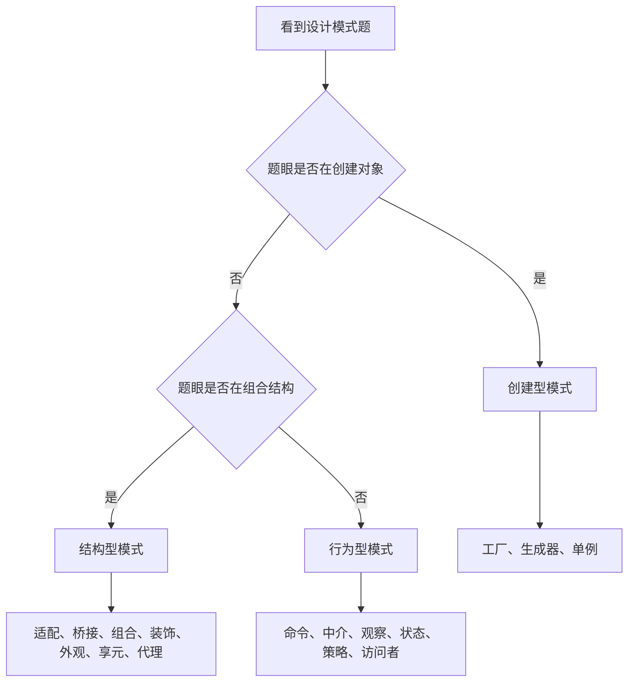
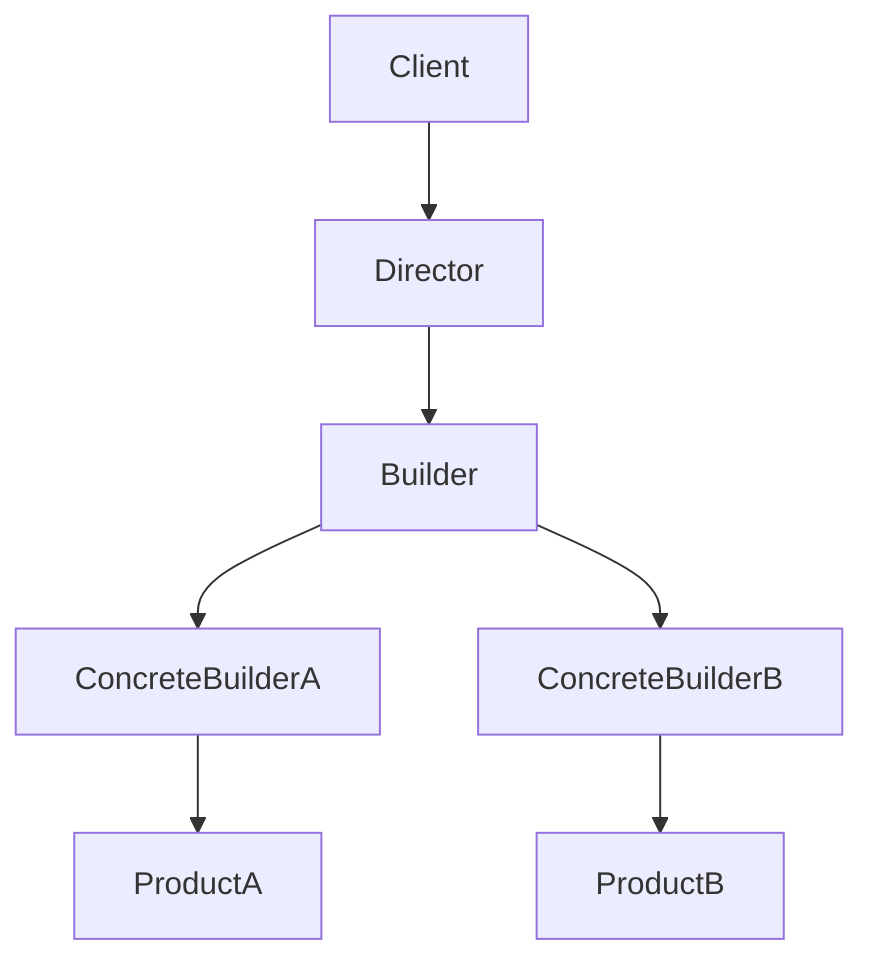
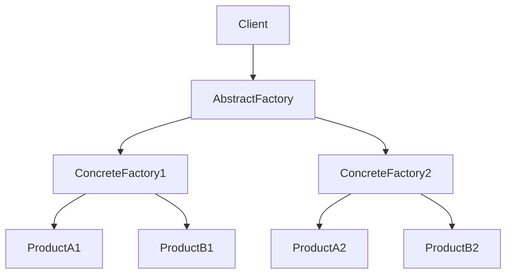
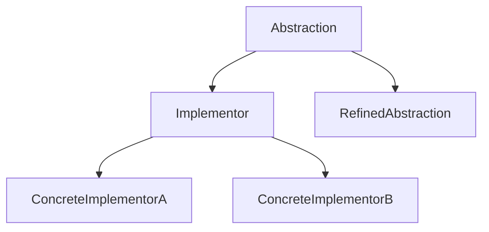
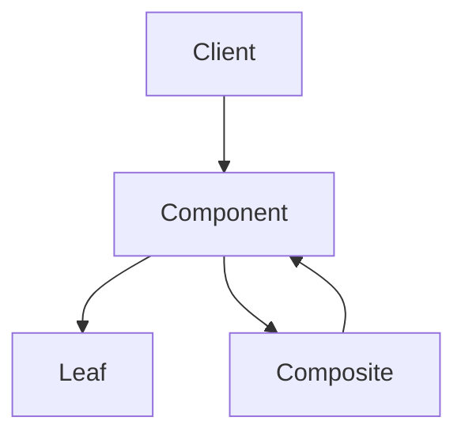
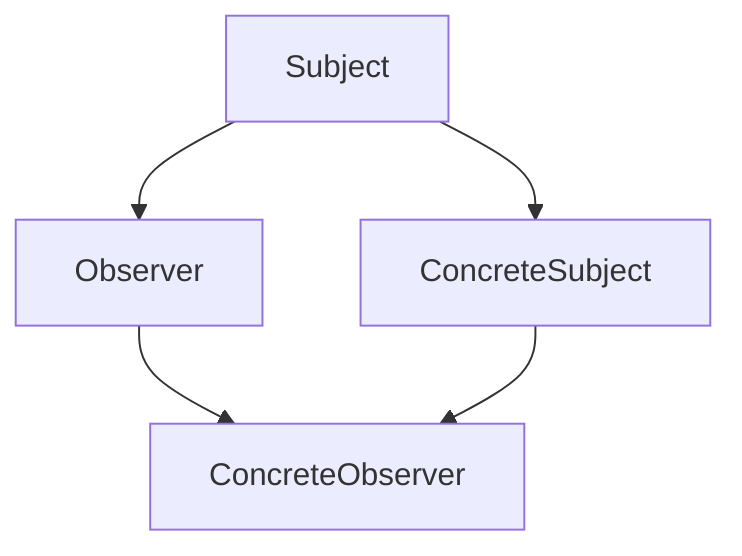
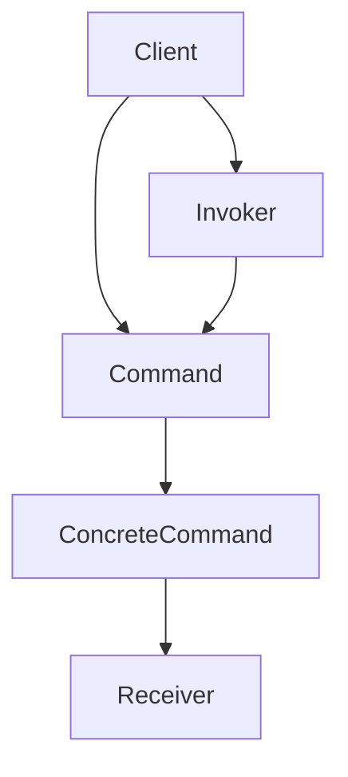
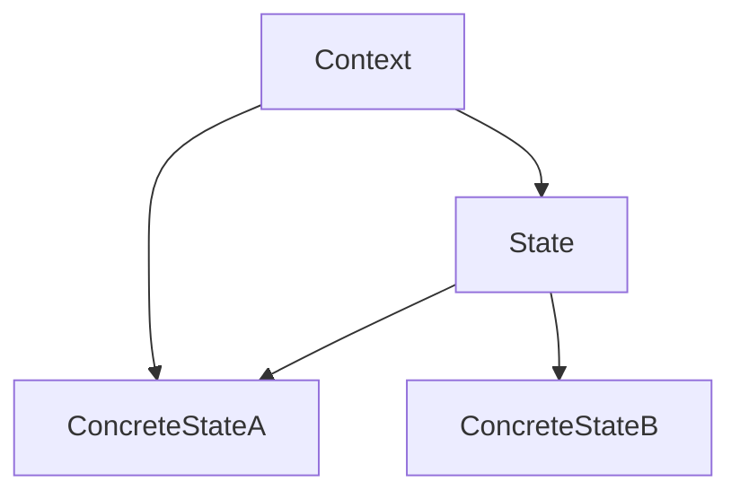

# chapter 8 - 设计模式：笔记和例题整理

**适用对象**：软件设计师新手备考  
# 一、当前整理范围

```text
设计模式
├─ 0. 设计模式基础
│  ├─ 设计模式的作用
│  ├─ 设计模式四要素
│  └─ 创建型、结构型、行为型三大类
├─ 1. 创建型模式
│  ├─ 工厂方法 Factory Method
│  ├─ 抽象工厂 Abstract Factory
│  ├─ 生成器 Builder
│  ├─ 原型 Prototype
│  └─ 单例 Singleton
├─ 2. 结构型模式
│  ├─ 适配器 Adapter
│  ├─ 桥接 Bridge
│  ├─ 组合 Composite
│  ├─ 装饰器 Decorator
│  ├─ 外观 Facade
│  ├─ 享元 Flyweight
│  └─ 代理 Proxy
├─ 3. 行为型模式
│  ├─ 责任链 Chain of Responsibility
│  ├─ 命令 Command
│  ├─ 解释器 Interpreter
│  ├─ 迭代器 Iterator
│  ├─ 中介者 Mediator
│  ├─ 备忘录 Memento
│  ├─ 观察者 Observer
│  ├─ 状态 State
│  ├─ 策略 Strategy
│  ├─ 模板方法 Template Method
│  └─ 访问者 Visitor
└─ 4. 高频综合判断
   ├─ 适配器、装饰器、代理、外观对比
   ├─ 桥接、策略、状态对比
   ├─ 组合、享元、单例对比
   ├─ 观察者、中介者、命令对比
   └─ 根据题眼快速落选项
```

# 二、复习建议

| 轮次 | 目标 | 建议做法 | 关注重点 |
|---|---|---|---|
| 第 1 轮 | 建立三大类框架 | 先背创建型、结构型、行为型分别解决什么问题 | 创建对象、组织结构、分配行为 |
| 第 2 轮 | 背高频模式题眼 | 把每个模式压缩成“关键词 + 适用场景 + 常见角色” | 抽象工厂、生成器、单例、桥接、组合、装饰器、外观、观察者、状态、策略、访问者 |
| 第 3 轮 | 做图题与场景题 | 看到类图先找角色名，例如 Subject、Observer、Command、Builder、State、Strategy | 图中类名、继承层次、聚合关系、接口方向 |
| 第 4 轮 | 冲刺易混模式 | 专门对比容易混的模式，不再孤立背定义 | 适配器/装饰/代理/外观；桥接/策略/状态；观察者/中介者/命令 |

# 三、章节笔记

## 总记忆表

| 模块 | 记忆句 |
|---|---|
| 设计模式目的 | **复用成功的设计和体系结构**，不是保证速度最优，也不是减少类数量。 |
| 创建型模式 | 关注“**对象怎么创建**”，常考工厂方法、抽象工厂、生成器、单例。 |
| 结构型模式 | 关注“**类和对象怎么组合**”，常考适配器、桥接、组合、装饰器、外观、享元、代理。 |
| 行为型模式 | 关注“**对象之间职责怎么分配、消息怎么流动**”，常考命令、中介者、观察者、状态、策略、访问者。 |
| 抽象工厂 | 创建**一系列相关或相互依赖的产品对象**，典型题眼是“产品族、不同平台 GUI”。 |
| 生成器 | 将**复杂对象的构建与表示分离**，同样构建过程可创建不同表示。 |
| 单例 | 保证一个类**仅有一个实例**，并提供全局访问点。 |
| 适配器 | 把已有类的接口转换成客户希望的接口，解决**接口不兼容**。 |
| 桥接 | 将**抽象部分与实现部分分离**，两个维度都能独立变化。 |
| 组合 | 树形结构表示**部分—整体**，客户一致对待叶子和组合对象。 |
| 装饰器 | 在不改对象结构、不用子类扩展时，**动态添加职责**。 |
| 外观 | 为复杂子系统提供**统一、简单接口**。 |
| 享元 | 大量细粒度对象造成存储开销时，使用**共享技术**。 |
| 代理 | 提供相同接口，**控制对对象的访问**。 |
| 命令 | 将**请求封装为对象**，支持排队、日志、撤销。 |
| 中介者 | 用一个中介对象封装复杂交互，降低对象间网状耦合。 |
| 观察者 | 一对多依赖，一个对象改变时自动通知依赖对象。 |
| 状态 | 对象行为随内部状态改变，看起来像改变了类。 |
| 策略 | 定义一系列算法，封装并使其可互换。 |
| 访问者 | 对对象结构中的对象增加不同操作，常见 `accept(Visitor)`。 |

## 0. 设计模式基础

### 1. 知识点

| 考点 | 内容 | 做题落点 |
|---|---|---|
| 设计模式作用 | 对反复出现的设计问题给出可复用解决方案 | 看到“采用设计模式是为了什么”，选“复用成功的设计” |
| 设计模式四要素 | 模式名称、问题、解决方案、效果 | 偏概念题，常用于排除“只看代码实现”的选项 |
| 创建型模式 | 抽象对象创建过程 | 工厂方法、抽象工厂、生成器、原型、单例 |
| 结构型模式 | 处理类或对象组合 | 适配器、桥接、组合、装饰器、外观、享元、代理 |
| 行为型模式 | 描述对象间职责分配和协作 | 命令、中介者、观察者、状态、策略、访问者等 |

### 2. 总分类表

| 类型 | 解决问题 | 高频模式 | 考试常见问法 |
|---|---|---|---|
| 创建型 | 谁来创建对象、如何屏蔽创建细节 | 抽象工厂、生成器、单例、工厂方法 | “创建一系列产品”“构建复杂对象”“唯一实例” |
| 结构型 | 类/对象如何组合成更大结构 | 适配器、桥接、组合、装饰器、外观、享元、代理 | “接口不兼容”“部分整体”“动态添加职责”“共享大量对象” |
| 行为型 | 行为如何变化、消息如何传递 | 命令、中介者、观察者、状态、策略、访问者 | “请求封装”“发布订阅”“状态改变行为”“算法可替换” |

### 3. 总流程图



### 4. 例题分析

**例 1**：问“采用设计模式的目的”。  
先抓题眼：设计模式不是性能优化技术，也不是为了减少类数量。它的核心价值是复用成熟设计经验。  
**结论**：复用成功的设计。

**例 2**：问“结构型模式有哪些”。  
先抓题眼：结构型处理类和对象的组合。适配器属于结构型；命令和状态属于行为型；生成器属于创建型。  
**结论**：选适配器。

### 5. 记忆技巧

```text
创建管生产，结构管拼装，行为管协作。
复用成功设计，不是速度最优。
```

## 1. 创建型模式

### 1. 知识点

| 模式 | 英文 | 核心意图 | 高频题眼 | 类型 |
|---|---|---|---|---|
| 工厂方法 | Factory Method | 定义创建对象接口，让子类决定实例化哪一个类 | “让子类决定创建哪个类” | 创建型类模式 |
| 抽象工厂 | Abstract Factory | 创建一系列相关或相互依赖对象的接口 | “产品族”“不同平台 GUI”“相关产品联合使用” | 创建型对象模式 |
| 生成器 | Builder | 复杂对象构建与表示分离 | “构建步骤相同，表示不同”“套餐、主餐、饮料、玩具” | 创建型对象模式 |
| 原型 | Prototype | 通过复制原型创建对象 | “复制对象”“克隆” | 创建型对象模式 |
| 单例 | Singleton | 保证一个类只有一个实例 | “唯一实例”“全局访问点” | 创建型对象模式 |

### 2. 创建型模式对比表

| 题目描述 | 优先考虑 | 为什么不是其他模式 |
|---|---|---|
| 一个系统要由多个产品系列中的一个来配置 | 抽象工厂 | 不是生成器，生成器强调复杂对象的构建步骤 |
| GUI 在 Windows、Linux、Mac 下有不同按钮、文本框、菜单 | 抽象工厂 | 同一产品族的一组相关产品 |
| 儿童套餐：主餐、饮料、玩具，制作过程相同，套餐表示不同 | 生成器 | 不是抽象工厂，因为重点不是产品族，而是构建过程 |
| 希望类 A 所有使用者都使用同一个实例 | 单例 | 不是 final/abstract；final 防继承，abstract 不能实例化 |
| 让子类决定实例化哪一个类 | 工厂方法 | 不是抽象工厂；抽象工厂通常是一族产品 |

### 3. 生成器模式结构图



### 4. 抽象工厂模式结构图



### 5. 例题分析

**例 1：GUI 多平台组件**  
题眼是“不同平台的并行类层次结构”。例如 WindowsButton、MacButton、WindowsTextBox、MacTextBox 属于不同产品族。系统需要一次性切换整套产品族。  
**结论**：抽象工厂。

**例 2：儿童套餐**  
题眼是“主餐、饮料、玩具”“制作过程相同”“餐品表示不同”“Waiter 调度厨师”。Waiter 相当于 Director，PizzaBuilder 相当于 Builder 接口，具体 Builder 负责不同套餐表示。  
**结论**：生成器。

**例 3：只有一个实例**  
题眼是“所有使用者都使用 A 的同一个实例”。这不是继承控制，而是实例控制。  
**结论**：单例。

### 6. 记忆技巧

```text
产品族找抽象工厂；
步骤同、表示异，找生成器；
子类决定创建谁，找工厂方法；
唯一实例，找单例；
复制克隆，找原型。
```

## 2. 结构型模式

### 1. 知识点

| 模式 | 英文 | 核心意图 | 高频题眼 | 类型 |
|---|---|---|---|---|
| 适配器 | Adapter | 将一个类接口转换成客户希望的接口 | 接口不兼容、已有类接口不符合需求 | 结构型类/对象模式 |
| 桥接 | Bridge | 抽象部分与实现部分分离，使二者独立变化 | 两个维度独立扩展，如图形与绘制程序、Web 应用与主题 | 结构型对象模式 |
| 组合 | Composite | 树形结构表示部分—整体，统一处理叶子和组合 | 部分整体、树形结构、一致性 | 结构型对象模式 |
| 装饰器 | Decorator | 动态给对象添加职责 | 不用子类扩展、动态添加功能 | 结构型对象模式 |
| 外观 | Facade | 为复杂子系统提供简单接口 | 简化接口、统一入口、复杂子系统 | 结构型对象模式 |
| 享元 | Flyweight | 共享大量细粒度对象，降低内存开销 | 大量对象、存储开销、共享技术 | 结构型对象模式 |
| 代理 | Proxy | 为对象提供代理以控制访问 | 控制访问、远程代理、保护代理、虚代理 | 结构型对象模式 |

### 2. 结构型模式易混对照

| 易混组 | 模式 | 包装对象数量 | 目的 | 题眼 |
|---|---|---:|---|---|
| 包装类模式 | 适配器 | 包装一个已有对象 | 转换接口 | “接口不符合需求” |
| 包装类模式 | 装饰器 | 包装一个对象 | 添加额外行为 | “动态添加职责” |
| 包装类模式 | 代理 | 包装一个对象 | 控制访问 | “控制对对象的访问” |
| 包装类模式 | 外观 | 包装一系列对象 | 简化复杂子系统接口 | “为复杂子系统提供简单接口” |
| 结构扩展 | 桥接 | 抽象和实现两条继承线 | 两个维度独立变化 | “抽象部分与实现部分分离” |
| 结构扩展 | 组合 | 叶子和容器统一 | 部分—整体层次 | “树形结构，一致使用” |
| 性能优化 | 享元 | 共享对象 | 减少大量对象开销 | “大量细粒度对象” |

### 3. 桥接模式结构图



### 4. 组合模式结构图



### 5. 例题分析

**例 1：接口不兼容**  
题眼是“将一个类的接口转换成客户希望的另外一个接口”。  
**结论**：适配器。

**例 2：Web 应用和主题样式**  
一个维度是 WebApplication，可以有 Blog、News、Shop；另一个维度是 Theme，可以有 Light、Dark。两个维度都可能变化。  
**结论**：桥接。

**例 3：文件夹与文件、公司与部门**  
题眼是“部分—整体”“树形结构”“单个对象和组合对象一致使用”。  
**结论**：组合。

**例 4：给对象动态添加职责**  
题眼是“动态地给一个对象添加额外职责”，且“不适合用子类扩展”。  
**结论**：装饰器。

**例 5：复杂子系统统一入口**  
题眼是“需要为复杂子系统提供一个简单接口”。  
**结论**：外观。

### 6. 记忆技巧

```text
接口不合找适配，两个维度找桥接；
部分整体用组合，动态加责装饰器；
复杂系统用外观，大量对象用享元；
控制访问找代理。
```

## 3. 行为型模式

### 1. 知识点

| 模式 | 英文 | 核心意图 | 高频题眼 | 类型 |
|---|---|---|---|---|
| 责任链 | Chain of Responsibility | 多个对象都有机会处理请求，沿链传递 | 请求沿链传递，直到被处理 | 行为型对象模式 |
| 命令 | Command | 将请求封装为对象 | 请求参数化、排队、日志、撤销 | 行为型对象模式 |
| 解释器 | Interpreter | 为语言定义文法并解释句子 | 抽象语法树、解释执行 | 行为型类模式 |
| 迭代器 | Iterator | 顺序访问聚合对象元素且不暴露内部表示 | 遍历集合、访问聚合对象 | 行为型对象模式 |
| 中介者 | Mediator | 用中介对象封装一系列对象交互 | 网状通信复杂、降低耦合 | 行为型对象模式 |
| 备忘录 | Memento | 保存并恢复对象内部状态 | 恢复到先前状态、撤销状态 | 行为型对象模式 |
| 观察者 | Observer | 一对多依赖，对象改变时通知依赖者 | 发布订阅、监听者、自动通知 | 行为型对象模式 |
| 状态 | State | 对象内部状态改变时改变行为 | 状态决定行为，看起来像改变类 | 行为型对象模式 |
| 策略 | Strategy | 封装一系列算法并可互换 | 打折、返利、满减；算法变体 | 行为型对象模式 |
| 模板方法 | Template Method | 在父类定义算法骨架，子类实现步骤 | 算法骨架固定，步骤可变 | 行为型类模式 |
| 访问者 | Visitor | 对对象结构增加很多不相关操作 | `accept(visitor)`、对象结构稳定、操作变化 | 行为型对象模式 |

### 2. 行为型模式易混对照

| 易混组 | 模式 | 核心区别 | 题眼 |
|---|---|---|---|
| 行为变化 | 策略 | 算法可替换，通常由客户选择策略 | 打折、返利、满减、算法变体 |
| 行为变化 | 状态 | 行为由对象内部状态决定，运行时随状态变化 | 库存、金额、连接状态、登录次数 |
| 通知协作 | 观察者 | 一个主题通知多个观察者 | 发布订阅、一对多依赖 |
| 通知协作 | 中介者 | 中介对象集中管理多对象交互 | 网状依赖混乱、对象不直接引用 |
| 请求处理 | 命令 | 请求封装为对象，可撤销、排队、日志 | 买入/卖出命令、Operation 接口 |
| 请求处理 | 责任链 | 多个对象沿链处理请求 | 多个处理者、传递请求直到处理 |
| 遍历与扩展 | 迭代器 | 遍历聚合对象元素 | 顺序访问、不暴露内部结构 |
| 遍历与扩展 | 访问者 | 对对象结构增加操作 | accept 方法，Visitor 作为参数 |

### 3. 观察者模式结构图



### 4. 命令模式结构图



### 5. 状态模式结构图



### 6. 例题分析

**例 1：股票买卖操作**  
题眼是“将请求封装为对象”“对请求排队或记录日志”“支持撤销”。BuyOperation、SellOperation 等是具体命令，Operation 是命令接口。  
**结论**：命令模式。

**例 2：用户组与权限映射**  
题眼是“用户和组之间关系复杂，由映射维护”“对象不需要显式互相引用”“耦合松散”。  
**结论**：中介者模式。

**例 3：发布—订阅消息模型**  
题眼是“订阅主题”“有新消息时所有订阅者收到通知”。  
**结论**：观察者模式。

**例 4：自动售货机**  
题眼是“库存、金额、找零能力、所选项目不同，行为不同”。行为由内部状态决定。  
**结论**：状态模式。

**例 5：打折、返利、满减促销**  
题眼是“不同时期不同促销算法”“算法可替换”。  
**结论**：策略模式。

**例 6：购物车商品结账，人工或自动计算总价**  
题眼是“对对象结构中的对象进行很多不同操作”“accept 方法以 Visitor 为参数”。  
**结论**：访问者模式。

### 7. 记忆技巧

```text
请求对象化是命令，复杂通信找中介；
一改多通知观察者，状态变行为是状态；
算法替换用策略，遍历聚合迭代器；
accept传Visitor，新增操作访问者。
```

## 4. 高频模式细讲

### 4.1 抽象工厂模式

| 项目 | 内容 |
|---|---|
| 意图 | 提供创建一系列相关或相互依赖对象的接口，而无需指定具体类。 |
| 角色 | AbstractFactory、ConcreteFactory、AbstractProduct、ConcreteProduct、Client。 |
| 适用 | 系统要由多个产品系列中的一个配置；强调一系列相关产品联合使用。 |
| 不适用 | 只是接口不兼容时不选它，应选适配器。 |
| 考试题眼 | “产品族”“多个产品系列”“不同平台 GUI 组件”。 |

**细理解**：抽象工厂解决的不是“如何构建一个复杂对象”，而是“如何创建一整套匹配的产品”。例如 Windows 风格按钮、Windows 风格文本框、Windows 风格菜单必须配套使用；Mac 风格按钮、Mac 风格文本框、Mac 风格菜单也必须配套使用。

### 4.2 生成器模式

| 项目 | 内容 |
|---|---|
| 意图 | 将复杂对象的构建与表示分离，使同样构建过程可以创建不同表示。 |
| 角色 | Builder、ConcreteBuilder、Director、Product。 |
| 适用 | 构建复杂对象的算法应独立于组成部分及装配方式；构造过程允许不同表示。 |
| 高频类名 | Waiter、Director、Builder、ConcreteBuilder、Product。 |
| 考试题眼 | “主餐、饮料、玩具”“制作过程相同”“不同套餐”。 |

**细理解**：生成器强调“步骤”。比如做套餐都要经历“做主餐—取饮料—放玩具—打包”，但具体套餐可能是辣味比萨套餐、奶酪比萨套餐。步骤相同，产品表示不同。

### 4.3 单例模式

| 项目 | 内容 |
|---|---|
| 意图 | 保证一个类仅有一个实例，并提供访问该实例的全局访问点。 |
| 适用 | 系统中某对象应唯一，例如配置管理器、日志管理器。 |
| 高频错误项 | “只有一个方法”“只有一个属性”“方法只能被唯一类调用”。 |
| 考试题眼 | “所有使用者使用同一个实例”“唯一实例”。 |

**细理解**：单例控制的是“对象个数”，不是方法个数、属性个数，也不是调用者个数。

### 4.4 适配器模式

| 项目 | 内容 |
|---|---|
| 意图 | 将一个类的接口转换成客户希望的接口。 |
| 角色 | Target、Adapter、Adaptee、Client。 |
| 适用 | 想使用已有类，但其接口不符合需求。 |
| 题眼 | “接口不兼容”“已有类接口不符合要求”。 |

**细理解**：适配器常出现在“旧系统可用，但接口不合新系统要求”的场景。它像转接头，把插头形状转换一下，不是给对象增加新职责，也不是控制访问。

### 4.5 桥接模式

| 项目 | 内容 |
|---|---|
| 意图 | 将抽象部分与实现部分分离，使它们都可以独立变化。 |
| 角色 | Abstraction、RefinedAbstraction、Implementor、ConcreteImplementor。 |
| 适用 | 不希望抽象和实现有固定绑定关系；抽象和实现都需要扩展。 |
| 题眼 | “两个维度独立变化”“图形和绘制程序”“应用和主题”。 |

**细理解**：桥接不是普通继承，而是把两个变化方向拆开。例如形状可以扩展为圆形、矩形；绘制程序可以扩展为 V1、V2。如果用继承，可能出现 CircleV1、CircleV2、RectangleV1、RectangleV2 的类爆炸；桥接把 Shape 和 Drawing 分离。

### 4.6 组合模式

| 项目 | 内容 |
|---|---|
| 意图 | 将对象组合成树形结构表示部分—整体层次，使客户一致使用单个对象和组合对象。 |
| 角色 | Component、Leaf、Composite、Client。 |
| 适用 | 表示对象的部分—整体层次结构。 |
| 题眼 | “树形结构”“部分—整体”“单个对象和组合对象一致使用”。 |

**细理解**：组合模式最像文件系统。文件是叶子，文件夹是组合对象，客户可以对二者都执行打开、删除、显示等统一操作。

### 4.7 装饰器模式

| 项目 | 内容 |
|---|---|
| 意图 | 动态地给对象添加一些额外职责。 |
| 适用 | 不适合通过子类扩展已有类；希望透明地给单个对象增加功能。 |
| 题眼 | “动态添加职责”“不使用子类”“添加额外行为”。 |
| 易混 | 适配器转换接口；代理控制访问；外观简化子系统；装饰器增加职责。 |

### 4.8 外观模式

| 项目 | 内容 |
|---|---|
| 意图 | 为复杂子系统提供统一的高层接口，使子系统更易使用。 |
| 适用 | 需要为复杂子系统提供简单接口。 |
| 题眼 | “一系列对象包装起来简化接口”“复杂子系统简单入口”。 |

### 4.9 享元模式

| 项目 | 内容 |
|---|---|
| 意图 | 运用共享技术有效支持大量细粒度对象。 |
| 适用 | 大量对象造成很大存储开销。 |
| 题眼 | “大量对象”“共享”“减少内存”。 |

### 4.10 代理模式

| 项目 | 内容 |
|---|---|
| 意图 | 为其他对象提供一种代理以控制对这个对象的访问。 |
| 适用 | 需要访问控制、远程访问、懒加载、保护访问。 |
| 题眼 | “提供相同接口”“控制访问”。 |

### 4.11 命令模式

| 项目 | 内容 |
|---|---|
| 意图 | 将请求封装为对象。 |
| 适用 | 需要参数化请求、排队请求、记录日志、撤销操作。 |
| 角色 | Command、ConcreteCommand、Invoker、Receiver、Client。 |
| 题眼 | “请求封装为对象”“排队”“日志”“撤销”。 |

### 4.12 中介者模式

| 项目 | 内容 |
|---|---|
| 意图 | 用中介对象封装一系列对象交互。 |
| 适用 | 一组对象以定义良好但复杂方式通信，相互依赖结构混乱。 |
| 题眼 | “对象不显式相互引用”“耦合松散”“复杂通信”。 |
| 易混 | 观察者通过发布订阅分布通信；中介者集中封装通信。 |

### 4.13 观察者模式

| 项目 | 内容 |
|---|---|
| 意图 | 定义对象间一对多依赖，当一个对象改变时，所有依赖者自动得到通知。 |
| 适用 | 发布订阅、监听器、一个主题多个观察者。 |
| 角色 | Subject、ConcreteSubject、Observer、ConcreteObserver。 |
| 题眼 | “通知依赖它的所有对象”“发布/订阅”“监听者”。 |

### 4.14 状态模式

| 项目 | 内容 |
|---|---|
| 意图 | 允许对象在内部状态改变时改变它的行为。 |
| 适用 | 对象行为取决于状态，并且运行时状态改变。 |
| 角色 | Context、State、ConcreteState。 |
| 题眼 | “状态改变行为”“TCP 连接状态”“自动售货机状态”。 |

### 4.15 策略模式

| 项目 | 内容 |
|---|---|
| 意图 | 定义一系列算法，封装起来并使其可相互替换。 |
| 适用 | 需要使用算法的不同变体；许多相关类仅行为有异。 |
| 题眼 | “算法可替换”“打折、返利、满减”。 |

### 4.16 访问者模式

| 项目 | 内容 |
|---|---|
| 意图 | 在不改变对象结构中各元素类的前提下，定义作用于这些元素的新操作。 |
| 适用 | 需要对对象结构中的对象进行很多不同且不相关的操作。 |
| 角色 | Visitor、ConcreteVisitor、Element、ConcreteElement、ObjectStructure。 |
| 题眼 | “Visitor 对象是 accept 方法参数”“对象结构稳定，操作多变”。 |

# 四、按专题插入原题与解析

## 专题一：设计模式基础与分类

### 题 1
**原题**  
在面向对象软件开发过程中，采用设计模式 （43）。（2011年上半年）

- A. 以复用成功的设计
- B. 以保证程序的运行速度达到最优值
- C. 以减少设计过程创建的类的个数
- D. 允许在非面向对象程序设计语言中使用面向对象的概念

**解析**  
先抓题眼：题目问“采用设计模式的目的”。设计模式是对常见设计问题的成熟解决方案总结，核心价值是复用成功设计经验。它不保证程序速度一定最优，也不一定减少类数量，很多模式反而会增加类。  
**正确答案**：A  
**答案方向**：看到“设计模式目的”，优先选“复用成功的设计”。

### 题 2
**原题**  
设计模式根据目的进行分类，可以分为创建型、结构型和行为型三种。其中结构型模式用于处理类和对象的组合。（44）模式是一种结构型模式。（2012年上半年）

- A. 适配器（Adapter）
- B. 命令（Command）
- C. 生成器（Builder）
- D. 状态（State）

**解析**  
先抓题眼：问结构型模式。适配器属于结构型；命令和状态属于行为型；生成器属于创建型。  
**正确答案**：A  
**答案方向**：结构型常背“适桥组装外享代”。

## 专题二：创建型模式

### 题 3
**原题**  
下列 UML 类图表示的是 （43） 设计模式。关于该设计模式的叙述中，错误的是（44）。（2010年上半年）

（43）
- A. 工厂方法
- B. 策略
- C. 抽象工厂
- D. 观察者

（44）
- A. 提供创建一系列相关或相互依赖的对象的接口，而无需指定这些对象所属的具体类
- B. 可应用于一个系统要由多个产品系列中的一个来配置的时候
- C. 可应用于强调一系列相关产品对象的设计以便进行联合使用的时候
- D. 可应用于希望使用已经存在的类，但其接口不符合需求的时候

**解析**  
先抓题眼：A、B、C 都是抽象工厂模式的典型描述，强调产品族和相关产品对象的联合创建。D 的“已有类接口不符合需求”是适配器模式的典型题眼，不是抽象工厂。  
**正确答案**：43-C；44-D  
**答案方向**：产品族选抽象工厂；接口不合选适配器。

### 题 4
**原题**  
为图形用户界面（GUI）组件定义不同平台的并行类层次结构，适合采用 （44） 模式。（2016年上半年）

- A. 享元（Flyweight）
- B. 抽象工厂（Abstract Factory）
- C. 外观（Facade）
- D. 装饰器（Decorator）

**解析**  
先抓题眼：“不同平台”“并行类层次结构”。GUI 组件往往是一个产品族，例如 WindowsButton、WindowsMenu、MacButton、MacMenu。要按平台创建一整套相关对象，适合抽象工厂。  
**正确答案**：B  
**答案方向**：不同平台的一组相关组件，优先抽象工厂。

### 题 5
**原题**  
下图所示为 （46） 设计模式，适用于 （47）。（2014年下半年）

（46）
- A. 抽象工厂（Abstract Factory）
- B. 生成器（Builder）
- C. 工厂方法（Factory Method）
- D. 原型（Prototype）

（47）
- A. 一个系统要由多个产品系列中的一个来配置时
- B. 当一个类希望由它的子类来指定它所创建的对象时
- C. 当创建复杂对象的算法应该独立于该对象的组成部分及其装配方式时
- D. 当一个系统应该独立于它的产品创建、构成和表示时

**解析**  
先抓题眼：生成器模式通常出现 Director、Builder、ConcreteBuilder、Product。其意图是把复杂对象的构建过程与对象表示分离。选项 C 正是生成器的适用性描述。A 更像抽象工厂，B 是工厂方法。  
**正确答案**：46-B；47-C  
**答案方向**：复杂对象 + 构建步骤独立，选生成器。

### 题 6
**原题**  
（46）模式将一个复杂对象的构建与其表示分离，使得同样的构建过程可以创建不同的表示。以下 （47） 情况适合选用该模式。  
①抽象复杂对象的构建步骤  
②基于构建过程的具体实现构建复杂对象的不同表示  
③一个类仅有一个实例  
④一个类的实例只能有几个不同状态组合中的一种  
（2016年下半年）

（46）
- A. 生成器（Builder）
- B. 工厂方法（Factory Method）
- C. 原型（Prototype）
- D. 单例（Singleton）

（47）
- A. ①②
- B. ②③
- C. ③④
- D. ①④

**解析**  
先抓题眼：“复杂对象的构建与表示分离”直接对应生成器。①和②都围绕构建步骤和不同表示；③是单例；④更接近状态数量限制，不是生成器重点。  
**正确答案**：46-A；47-A  
**答案方向**：生成器 = 构建过程 + 不同表示。

### 题 7
**原题**  
某快餐厅主要制作并出售儿童套餐，一般包括主餐、饮料和玩具，其餐品种类可能不同，但制作过程相同。前台服务员 Waiter 调度厨师制作套餐。该设计采用 （44） 模式。其中， （45） 构造一个使用 Builder 接口的对象。该模式属于 （46） 模式，该模式适用于 （47） 的情况。（2020年下半年）

（44）
- A. 生成器（Builder）
- B. 抽象工厂（Abstract Factory）
- C. 原型（Prototype）
- D. 工厂方法（Factory Method）

（45）
- A. PizzaBuilder
- B. SpicyPizzaBuilder
- C. Waiter
- D. Pizza

（46）
- A. 创建型对象
- B. 结构型对象
- C. 行为型对象
- D. 结构型类

（47）
- A. 当一个系统应该独立于它的产品创建、构成和表示时
- B. 当一个类希望由它的子类来指定它所创建的对象的时候
- C. 当要强调一系列相关的产品对象的设计以便进行联合使用时
- D. 当构造过程必须允许被构造的对象有不同的表示时

**解析**  
先抓题眼：儿童套餐由多个组成部分构成，制作过程相同但套餐表示不同。Waiter 调度构建过程，等价于 Director，使用 Builder 接口构造产品。生成器属于创建型对象模式。D 描述“构造过程允许不同表示”，正是生成器适用场景。  
**正确答案**：44-A；45-C；46-A；47-D  
**答案方向**：套餐、步骤、不同表示、Waiter，锁定生成器。

### 题 8
**原题**  
以下关于 Singleton（单例）模式的描述中，正确的是 （46）。（2011年上半年）

- A. 它描述了只有一个方法的类的集合
- B. 它描述了只有一个属性的类的集合
- C. 它能够保证一个类的方法只能被一个唯一的类调用
- D. 它能够保证一个类只产生唯一的一个实例

**解析**  
先抓题眼：Singleton 控制的是实例数量，而不是方法数量、属性数量，也不是调用者数量。  
**正确答案**：D  
**答案方向**：单例 = 一个类只产生一个实例。

### 题 9
**原题**  
欲使类 A 的所有使用者都使用 A 的同一个实例，应 （47）。（2012年下半年）

- A. 将 A 标识为 final
- B. 将 A 标识为 abstract
- C. 将单例（Singleton）模式应用于 A
- D. 将备忘（Memento）模式应用于 A

**解析**  
先抓题眼：“同一个实例”。final 用于限制继承，abstract 不能直接实例化，Memento 用于保存状态；只有 Singleton 保证全局唯一实例。  
**正确答案**：C  
**答案方向**：同一个实例，直接选单例。

### 题 10
**原题**  
以下关于 Singleton（单例）设计模式的叙述中，不正确的是 （44）。（2015年下半年）

- A. 单例模式是创建型模式
- B. 单例模式保证一个类仅有一个实例
- C. 单例类提供一个访问唯一实例的全局访问点
- D. 单例类提供一个创建一系列相关或相互依赖对象的接口

**解析**  
先抓题眼：“不正确”。A、B、C 都是单例模式描述。D 是抽象工厂模式的描述。  
**正确答案**：D  
**答案方向**：一系列相关对象 = 抽象工厂；唯一实例 = 单例。

## 专题三：结构型模式

### 题 11
**原题**  
（47）将一个类的接口转换成客户希望的另外一个接口，使得原本由于接口不兼容而不能一起工作的那些类可以一起工作。（2011年上半年）

- A. Adapter（适配器）模式
- B. Command（命令）模式
- C. Singleton（单例）模式
- D. Strategy（策略）模式

**解析**  
先抓题眼：“接口转换”“接口不兼容”。这是适配器模式的标准定义。  
**正确答案**：A  
**答案方向**：接口不兼容，适配器。

### 题 12
**原题**  
设计模式 （44） 将抽象部分与其实现部分相分离，使它们都可以独立地变化。类图中， （45） 用于定义实现部分的接口。（2011年上半年）

（44）
- A. Bridge（桥接）
- B. Composite（组合）
- C. Facade（外观）
- D. Singleton（单例）

（45）
- A. Abstraction
- B. ConcreteImplementorA
- C. ConcreteImplementorB
- D. Implementor

**解析**  
先抓题眼：“抽象部分与实现部分分离”。这是桥接模式。桥接结构中 Implementor 定义实现部分接口，Abstraction 维护对 Implementor 的引用。  
**正确答案**：44-A；45-D  
**答案方向**：桥接题中“实现接口”通常叫 Implementor。

### 题 13
**原题**  
创建 Web 应用框架，可创建博客、新闻网站、网上商店等具体 Web 应用，并可为每个 Web 应用创建浅色或深色主题样式。该类图适合采用 （44） 模式。其中 （45） 是客户程序使用的主要接口，维护对主题类型的应用。此模式为 （46） ，体现的最主要意图是 （47）。（2018年上半年）

（44）
- A. 观察者（Observer）
- B. 访问者（Visitor）
- C. 策略（Strategy）
- D. 桥接（Bridge）

（45）
- A. WebApplication
- B. Blog
- C. Theme
- D. Light

（46）
- A. 创建型对象模式
- B. 结构型对象模式
- C. 行为型类模式
- D. 行为型对象模式

（47）
- A. 将抽象部分与其实现部分分离，使它们都可以独立地变化
- B. 动态地给一个对象添加一些额外的职责
- C. 为其他对象提供一种代理以控制对这个对象的访问
- D. 将一个类的接口转换成客户希望的另一个接口

**解析**  
先抓题眼：Web 应用类型和主题样式是两个独立变化维度。桥接模式用于将抽象和实现分离。WebApplication 是客户程序使用的抽象接口，Theme 是实现维度。桥接属于结构型对象模式。  
**正确答案**：44-D；45-A；46-B；47-A  
**答案方向**：两个维度都扩展，选桥接。

### 题 14
**原题**  
欲开发一个绘图软件，要求使用不同的绘图程序绘制不同的图形，并不断扩充新的图形和新的绘图程序。该设计采用 （44） 模式。其中 （45） 定义了实现类的接口，该模式适用于 （46） 的情况，该模式属于 （47） 模式。（2019年下半年）

（44）
- A. 适配器（Adapter）
- B. 装饰（Decorator）
- C. 桥接（Bridge）
- D. 组合（Composite）

（45）
- A. Shape
- B. Circle 和 Rectangle
- C. V1Drawing 和 V2Drawing
- D. Drawing

（46）
- A. 不希望在抽象和它的实现部分之间有一个固定绑定关系
- B. 想表示对象的部分—整体层次结构
- C. 想使用一个已经存在的类，而它的接口不符合要求
- D. 在不影响其他对象的情况下，以动态、透明的方式给单个对象添加职责

（47）
- A. 创建型对象
- B. 结构型对象
- C. 行为型对象
- D. 结构型类

**解析**  
先抓题眼：图形类型 Shape 与绘图程序 Drawing 是两个变化维度。Drawing 是实现类接口，V1Drawing/V2Drawing 是具体实现。桥接适用于抽象与实现不希望固定绑定，属于结构型对象模式。  
**正确答案**：44-C；45-D；46-A；47-B  
**答案方向**：图形 × 绘图程序，二维变化，桥接。

### 题 15
**原题**  
设计模式中的 （45） 模式将对象组合成树形结构以表示“部分-整体”的层次结构，使得客户对单个对象和组合对象的使用具有一致性。其中， （46） 定义有子部件的那些部件的行为；组合部件的对象由 （47） 通过 Component 提供的接口操作。（2012年上半年）

（45）
- A. 代理（Proxy）
- B. 桥接器（Bridge）
- C. 组合（Composite）
- D. 装饰器（Decorator）

（46）
- A. Client
- B. Component
- C. Leaf
- D. Composite

（47）
- A. Client
- B. Component
- C. Leaf
- D. Composite

**解析**  
先抓题眼：“树形结构”“部分—整体”“单个对象和组合对象一致性”。这是组合模式。Composite 定义有子部件的部件行为；Client 通过 Component 接口操作组合对象。  
**正确答案**：45-C；46-D；47-A  
**答案方向**：部分整体树形结构，选组合；有孩子的是 Composite。

### 题 16
**原题**  
下图所示为 （46） 设计模式，适用于 （47）。（2013年下半年）

（46）
- A. 组件（Component）
- B. 适配器（Adapter）
- C. 组合（Composite）
- D. 装饰器（Decorator）

（47）
- A. 表示对象的部分—整体层次结构
- B. 不希望在抽象和它的实现部分之间有一个固定的绑定关系
- C. 在不影响其他对象的情况下，以动态、透明的方式给单个对象添加职责
- D. 使所有接口不兼容类可以一起工作

**解析**  
先抓题眼：图中若出现 Component、Leaf、Composite，并且 Composite 可以包含 Component，则是组合模式。适用场景是表示部分—整体层次。  
**正确答案**：46-C；47-A  
**答案方向**：Component/Leaf/Composite，直接锁定组合。

### 题 17
**原题**  
下图所示为 （44） 设计模式，属于 （45） 设计模式，适用于 （46）。（2015年上半年）

（44）
- A. 代理（Proxy）
- B. 生成器（Builder）
- C. 组合（Composite）
- D. 观察者（Observer）

（45）
- A. 创建型
- B. 结构型
- C. 行为
- D. 结构型和行为

（46）
- A. 表示对象的部分-整体层次结构时
- B. 当一个对象必须通知其它对象，而它又不能假定其它对象是谁时
- C. 当创建复杂对象的算法应该独立于该对象的组成部分及其装配方式时
- D. 在需要比较通用和复杂的对象指针代替简单的指针时

**解析**  
先抓题眼：组合模式属于结构型模式，适用于部分—整体层次结构。B 是观察者，C 是生成器。  
**正确答案**：44-C；45-B；46-A  
**答案方向**：组合 = 结构型 = 部分整体。

### 题 18
**原题**  
欲动态地给一个对象添加职责，宜采用 （43） 模式。（2011年下半年）

- A. 适配器（Adapter）
- B. 桥接（Bridge）
- C. 组合（Composite）
- D. 装饰器（Decorator）

**解析**  
先抓题眼：“动态地给对象添加职责”。这是装饰器模式标准定义。  
**正确答案**：D  
**答案方向**：动态加职责，不改对象结构，装饰器。

### 题 19
**原题**  
下图所示为 （44） 设计模式，适用于 （45）。（2014年上半年）

（44）
- A. 适配器（Adapter）
- B. 责任链（Chain of Responsibility）
- C. 外观（Facade）
- D. 桥接（Bridge）

（45）
- A. 有多个对象可以处理一个请求，在运行时刻自动确定由哪个对象处理
- B. 想使用一个已经存在的类，而其接口不符合要求
- C. 类的抽象和其实现之间不希望有一个固定的绑定关系
- D. 需要为一个复杂子系统提供一个简单接口

**解析**  
先抓题眼：外观模式为复杂子系统提供统一、简单、高层接口。A 是责任链，B 是适配器，C 是桥接。  
**正确答案**：44-C；45-D  
**答案方向**：复杂子系统 + 简单接口，外观。

### 题 20
**原题**  
装饰器（Decorator）模式用于 （46）；外观（Facade）模式用于 （47）。（2017年上半年）  
①将一个对象加以包装以给客户提供其希望的另外一个接口  
②将一个对象加以包装以提供一些额外的行为  
③将一个对象加以包装以控制对这个对象的访问  
④将一系列对象加以包装以简化其接口

（46）
- A. ①
- B. ②
- C. ③
- D. ④

（47）
- A. ①
- B. ②
- C. ③
- D. ④

**解析**  
先抓题眼：①是适配器，②是装饰器，③是代理，④是外观。  
**正确答案**：46-B；47-D  
**答案方向**：一个对象加行为是装饰器；一系列对象简化接口是外观。

### 题 21
**原题**  
因使用大量的对象而造成很大的存储开销时，适合采用 （47） 模式进行对象共享，以减少对象数量从而达到较少的内存占用并提升性能。（2016年上半年）

- A. 组合（Composite）
- B. 享元（Flyweight）
- C. 迭代器（Iterator）
- D. 备忘（Memento）

**解析**  
先抓题眼：“大量对象”“存储开销”“对象共享”。享元模式使用共享技术支持大量细粒度对象。  
**正确答案**：B  
**答案方向**：大量对象、省内存、共享，享元。

### 题 22
**原题**  
（44）模式通过提供与对象相同的接口来控制对这个对象的访问。（2011年下半年）

- A. 适配器（Adapter）
- B. 代理（Proxy）
- C. 组合（Composite）
- D. 装饰器（Decorator）

**解析**  
先抓题眼：“相同接口”“控制访问”。代理模式为真实对象提供代理，控制访问真实对象。  
**正确答案**：B  
**答案方向**：控制访问，代理。

## 专题四：行为型模式

### 题 23
**原题**  
（45）设计模式将一个请求封装为一个对象，从而使得可以用不同的请求对客户进行参数化，对请求排队或记录请求日志，以及支持可撤销的操作。（2016年上半年）

- A. 命令（Command）
- B. 责任链（Chain of Responsibility）
- C. 观察者（Observer）
- D. 策略（Strategy）

**解析**  
先抓题眼：“请求封装为对象”“排队”“日志”“撤销”。这是命令模式。  
**正确答案**：A  
**答案方向**：请求对象化，命令。

### 题 24
**原题**  
股票交易中，股票代理 Broker 根据客户发出的股票操作指示进行股票买卖。该设计采用 （44） 模式，其中， （45） 声明执行操作的接口。该模式属于 （46） 模式，该模式适用于 （47）。（2021年上半年）

（44）
- A. 命令（Command）
- B. 观察者（Observer）
- C. 状态（State）
- D. 中介者（Mediator）

（45）
- A. Operation
- B. SellOperation / BuyOperation / ViewOperation
- C. Broker
- D. Stock

（46）
- A. 结构类型
- B. 结构型对象
- C. 创建类型
- D. 行为型对象

（47）
- A. 一个对象必须通知其他对象，而它又不能假定其他对象是谁
- B. 抽象出执行的动作以参数化某对象
- C. 一个对象的行为决定于其状态且必须在运行时刻根据状态改变行为
- D. 一个对象引用其他很多对象并且直接与这些对象通信，导致难以复用该对象

**解析**  
先抓题眼：“股票操作指示”“买入、卖出、查看”等请求被封装为对象。Operation 是命令接口，SellOperation/BuyOperation/ViewOperation 是具体命令；Broker 类似 Invoker；Stock 类似 Receiver。命令模式属于行为型对象模式。  
**正确答案**：44-A；45-A；46-D；47-B  
**答案方向**：请求封装、可参数化，选命令。

### 题 25
**原题**  
在某系统中，不同组访问数据权限不同，每个用户可以是一个或多个组中的成员，每个组包含零个或多个用户。现要求在用户和组之间设计映射，将用户和组之间的关系由映射进行维护。该设计采用 （44） 模式。该模式属于 （45） ，该模式适用 （46）。（2021年下半年）

（44）
- A. 状态（State）
- B. 策略（Strategy）
- C. 解释器（Interpreter）
- D. 中介者（Mediator）

（45）
- A. 创建型类
- B. 创建型对象
- C. 行为型对象
- D. 行为型类

（46）
- A. 需要使用一个算法的不同变体
- B. 有一个语言需要解释执行，并且可将句子表示为一个抽象语法树
- C. 一个对象的行为决定于其状态且必须在运行时刻根据状态改变行为
- D. 一组对象以定义良好但是复杂的方式进行通信，产生的相互依赖关系结构混乱且难以理解

**解析**  
先抓题眼：“用户和组之间的关系由映射维护”“对象不需要显式相互引用”“耦合松散”。这是中介者模式。中介者属于行为型对象模式。A 是策略，B 是解释器，C 是状态。  
**正确答案**：44-D；45-C；46-D  
**答案方向**：复杂网状交互集中到中介对象，选中介者。

### 题 26
**原题**  
下列 UML 类图表示的是 （46） 设计模式。该设计模式中， （47）。（2009年下半年）

（46）
- A. 备忘录（Memento）
- B. 策略（Strategy）
- C. 状态（State）
- D. 观察者（Observer）

（47）
- A. 一个 Subject 对象可对应多个 Observer 对象
- B. Subject 只能有一个 ConcreteSubject 子类
- C. Observer 只能有一个 ConcreteObserver 子类
- D. 一个 Subject 对象必须至少对应一个 Observer 对象

**解析**  
先抓题眼：Subject、Observer、ConcreteSubject、ConcreteObserver 是观察者模式的典型角色。一个 Subject 可以有任意多个观察者；并不限定 Subject 或 Observer 只能有一个子类，也不要求必须至少有一个观察者。  
**正确答案**：46-D；47-A  
**答案方向**：Subject 对多个 Observer，一对多通知。

### 题 27
**原题**  
下面的 UML 类图描绘的是 （46） 设计模式。关于该设计模式的叙述中，错误的是（47）。（2010年下半年）

（46）
- A. 桥接
- B. 策略
- C. 抽象工厂
- D. 观察者

（47）
- A. 该设计模式中的 Observer 需要维护至少一个 Subject 对象
- B. 该设计模式中的 ConcreteObserver 可以绕过 Subject 及其子类的封装
- C. 该设计模式中一个 Subject 对象需要维护多个 Observer 对象
- D. 该设计模式中 Subject 需要通知 Observer 对象其自身的状态变化

**解析**  
先抓题眼：Subject 通知 Observer 是观察者模式。错误项通常落在“绕过封装”上。观察者通过 Subject 提供的接口得到通知或状态，不应绕过 Subject 及其子类的封装。  
**正确答案**：46-D；47-B  
**答案方向**：观察者是通知机制，不是破坏封装机制。

### 题 28
**原题**  
（40）设计模式允许一个对象在其状态改变时，通知依赖它的所有对象。该设计模式类图中， （41） 在其状态发生改变时，向它的各个观察者发出通知。（2011年下半年）

（40）
- A. 命令（Command）
- B. 责任链（Chain of Responsibility）
- C. 观察者（Observer）
- D. 迭代器（Iterator）

（41）
- A. Subject
- B. ConcreteSubject
- C. Observer
- D. ConcreteObserver

**解析**  
先抓题眼：“状态改变时通知依赖它的所有对象”是观察者模式。真正保存具体状态并在改变后通知观察者的是 ConcreteSubject。Subject 提供注册、删除、通知等抽象接口。  
**正确答案**：40-C；41-B  
**答案方向**：具体主题状态变化，通知观察者。

### 题 29
**原题**  
在发布-订阅消息模型中，订阅者订阅一个主题后，当该主题有新消息到达时，所有订阅者都会收到通知。（45）设计模式最适合这一模型。（2013年下半年）

- A. 适配器（Adapter）
- B. 通知（Notifier）
- C. 状态（State）
- D. 观察者（Observer）

**解析**  
先抓题眼：“发布—订阅”“主题”“所有订阅者收到通知”。这是观察者模式的典型应用。  
**正确答案**：D  
**答案方向**：发布订阅，观察者。

### 题 30
**原题**  
（46）设计模式最适合用于发布/订阅消息模型，即当订阅者注册一个主题后，此主题有新消息到来时订阅者就会收到通知。（2016年上半年）

- A. 适配器（Adapter）
- B. 通知（Notifier）
- C. 观察者（Observer）
- D. 状态（State）

**解析**  
先抓题眼：发布/订阅模型即一对多通知机制。  
**正确答案**：C  
**答案方向**：发布订阅，仍然选观察者。

### 题 31
**原题**  
下图所示为观察者模式的抽象示意图，其中 （44） 知道其观察者，可以有任意多个观察者观察同一个目标；提供注册和删除观察者对象的接口。此模式体现的最主要特征是 （45）。（2017年上半年）

（44）
- A. Subject
- B. Observer
- C. ConcreteSubject
- D. ConcreteObserver

（45）
- A. 类应该对扩展开放，对修改关闭
- B. 使所要交互的对象尽量松耦合
- C. 组合优先于继承使用
- D. 仅与直接关联类交互

**解析**  
先抓题眼：“知道其观察者”“注册和删除观察者接口”对应 Subject。观察者模式让主题和观察者之间通过抽象接口通信，主要体现交互对象松耦合。  
**正确答案**：44-A；45-B  
**答案方向**：Subject 管理 Observer；观察者强调松耦合。

### 题 32
**原题**  
观察者（Observer）模式适用于 （47）。（2019年上半年）

- A. 访问一个聚合对象的内容而无须暴露它的内部表示
- B. 减少多个对象或类之间的通信复杂性
- C. 将对象的状态恢复到先前的状态
- D. 一对多对象依赖关系，当一个对象修改后，依赖它的对象都自动得到通知

**解析**  
先抓题眼：A 是迭代器，B 是中介者，C 是备忘录，D 是观察者。  
**正确答案**：D  
**答案方向**：一对多依赖、自动通知，观察者。

### 题 33
**原题**  
（44）模式使得一个对象在其内部状态改变时通过调用另一个类中的方法改变其行为，使这个对象看起来如同修改了它的类。TCP 连接结构图实例中，该模式的核心思想是引入抽象类 （45） 表示 TCP 连接状态。当一个 （46） 对象收到请求时，它根据当前状态做出不同反应。（2012年下半年）

（44）
- A. 适配器（Adapter）
- B. 命令（Command）
- C. 观察者（Visitor）
- D. 状态（State）

（45）
- A. TCPConnection
- B. state
- C. TCPState
- D. TCPEstablished

（46）
- A. TCPConnection
- B. state
- C. TCPState
- D. TCPEstablished

**解析**  
先抓题眼：“内部状态改变时改变行为”是状态模式。TCPState 是抽象状态类；TCPConnection 是上下文对象，收到请求后根据当前状态委派给具体状态处理。  
**正确答案**：44-D；45-C；46-A  
**答案方向**：状态类表示状态，上下文根据状态反应。

### 题 34
**原题**  
自动售货机根据库存、存放货币量、找零能力、所选项目等不同，在货币存入并进行选择时具有不同的行为。该业务需求适合采用 （44） 模式。其中 （45） 是客户程序使用的主要接口，可用状态来对其进行配置。此模式为 （46） ，体现的最主要意图是 （47）。（2017年下半年）

（44）
- A. 观察者（Observer）
- B. 状态（State）
- C. 策略（Strategy）
- D. 访问者（Visitor）

（45）
- A. VendingMachineState
- B. Buy
- C. VendingDepositState
- D. VendingStockState

（46）
- A. 创建型对象模式
- B. 结构型对象模式
- C. 行为型类模式
- D. 行为型对象模式

（47）
- A. 当一个对象状态改变时所有依赖它的对象得到通知并自动更新
- B. 在不破坏封装性的前提下，捕获对象的内部状态并在对象之外保存
- C. 一个对象在其内部状态改变时改变其行为
- D. 将请求封装为对象从而可以使用不同的请求对客户进行参数化

**解析**  
先抓题眼：“库存、金额、找零能力不同导致行为不同”。行为由状态决定，是状态模式。Buy 是上下文或客户主要接口，VendingMachineState 是状态接口。状态模式属于行为型对象模式。  
**正确答案**：44-B；45-B；46-D；47-C  
**答案方向**：内部状态决定行为，选状态。

### 题 35
**原题**  
（44）设计模式定义一系列算法，把它们一个个封装起来，并且使它们可相互替换。这一模式使得算法可独立于它的客户而变化。（2013年下半年）

- A. 策略（Strategy）
- B. 抽象工厂（Abstract Factory）
- C. 观察者（Observer）
- D. 状态（State）

**解析**  
先抓题眼：“一系列算法”“封装”“可相互替换”。这是策略模式标准定义。  
**正确答案**：A  
**答案方向**：算法可替换，策略。

### 题 36
**原题**  
（44）模式定义一系列算法，把它们一个个封装起来，并且使它们可以相互替换，使得算法可以独立于使用它们的客户而变化。以下 （45） 情况适合选用该模式。  
①一个客户需要使用一组相关对象  
②一个对象的改变需要改变其它对象  
③需要使用一个算法的不同变体  
④许多相关的类仅仅是行为有异  
（2016年下半年）

（44）
- A. 命令（Command）
- B. 责任链（Chain of Responsibility）
- C. 观察者（Observer）
- D. 策略（Strategy）

（45）
- A. ①②
- B. ②③
- C. ③④
- D. ①④

**解析**  
先抓题眼：“算法不同变体”“相关类仅行为有异”。③④符合策略模式；①偏抽象工厂；②偏观察者。  
**正确答案**：44-D；45-C  
**答案方向**：算法变体、行为有异，策略。

### 题 37
**原题**  
在设计某购物中心的收银软件系统时，要求能够支持在不同时期推出打折、返利、满减等不同促销活动，则适合采用 （47） 模式。（2021年下半年）

- A. 策略（Strategy）
- B. 访问者（Visitor）
- C. 观察者（Observer）
- D. 中介者（Mediator）

**解析**  
先抓题眼：“打折、返利、满减”都是促销算法或计价策略。不同策略之间可替换，客户系统不必固定某一种算法。  
**正确答案**：A  
**答案方向**：促销算法可替换，策略。

### 题 38
**原题**  
某些设计模式会引入总是被用作参数的对象。例如 （47） 对象是一个多态 accept 方法的参数。（2015年上半年）

- A. Visitor
- B. Command
- C. Memento
- D. Observer

**解析**  
先抓题眼：“accept 方法的参数”。访问者模式中 Element 定义 `accept(Visitor v)`，具体元素接收访问者。  
**正确答案**：A  
**答案方向**：accept 参数是 Visitor。

### 题 39
**原题**  
超市销售系统中，顾客将物品加入购物车，在收银台人工或自动地将购物车中每个物品的价格汇总后结账。该设计采用了 （44） 模式。其中 （45） 定义以一个 Checkout 对象为参数的 accept 操作。此模式为 （46） ，适用于 （47）。（2018年下半年）

（44）
- A. 观察者（Observer）
- B. 访问者（Visitor）
- C. 策略（Strategy）
- D. 桥接器（Bridge）

（45）
- A. Item
- B. Shopping_Cart
- C. Checkout
- D. Manual 和 Auto

（46）
- A. 创建型对象模式
- B. 结构型对象模式
- C. 行为型类模式
- D. 行为型对象模式

（47）
- A. 必须保存一个对象在某一个时刻的部分状态
- B. 想在不明确指定接收者的情况下向多个对象中的一个提交一个请求
- C. 需要对一个对象结构中的对象进行很多不同的并且不相关的操作
- D. 在不同的时刻指定、排列和执行请求

**解析**  
先抓题眼：“accept 操作”“以 Checkout 对象为参数”。Item 是元素类，Checkout 是访问者；Manual 和 Auto 是具体访问者或具体结算方式。访问者属于行为型对象模式，适用于对象结构稳定但需要增加很多不同操作的情况。  
**正确答案**：44-B；45-A；46-D；47-C  
**答案方向**：accept + Visitor 参数，访问者。

## 专题五：设计模式综合题

### 题 40
**原题**  
当不适合采用生成子类的方法对已有的类进行扩充时，可以采用 （43） 设计模式动态地给一个对象添加一些额外的职责；当应用程序由于使用大量对象造成很大的存储开销时，可以采用 （44） 设计模式运用共享技术；当想使用一个已经存在的类，但其接口不符合需求时，可以采用 （45） 设计模式将该类的接口转换成我们希望的接口。（2009年上半年）

（43）
- A. 命令（Command）
- B. 适配器（Adapter）
- C. 装饰（Decorate）
- D. 享元（Flyweight）

（44）
- A. 命令（Command）
- B. 适配器（Adapter）
- C. 装饰（Decorate）
- D. 享元（Flyweight）

（45）
- A. 命令（Command）
- B. 适配器（Adapter）
- C. 装饰（Decorate）
- D. 享元（Flyweight）

**解析**  
先抓题眼：动态添加额外职责是装饰器；大量对象共享减少开销是享元；已有类接口不符合需求是适配器。  
**正确答案**：43-C；44-D；45-B  
**答案方向**：动态职责装饰器；共享对象享元；接口转换适配器。

### 题 41
**原题**  
采用 （43） 设计模式可保证一个类仅有一个实例；采用 （44） 设计模式可将对象组合成树形结构以表示“部分-整体”的层次结构；采用 （45） 设计模式可动态地给一个对象添加一些额外的职责。（2009年下半年）

（43）
- A. 命令（Command）
- B. 单例（Singleton）
- C. 装饰（Decorate）
- D. 组合（Composite）

（44）
- A. 命令（Command）
- B. 单例（Singleton）
- C. 装饰（Decorate）
- D. 组合（Composite）

（45）
- A. 命令（Command）
- B. 单例（Singleton）
- C. 装饰（Decorate）
- D. 组合（Composite）

**解析**  
先抓题眼：唯一实例是单例；部分—整体树形结构是组合；动态添加职责是装饰。  
**正确答案**：43-B；44-D；45-C  
**答案方向**：唯一单例，树形组合，动态装饰。

### 题 42
**原题**  
（44）设计模式能使一个对象的状态发生改变时通知所有依赖它的监听者；（45）设计模式限制类的实例对象只能有一个。适配器设计模式可以用于 （46）。用于为一个对象添加更多功能而不使用子类的是 （47） 设计模式。（2013年上半年）

（44）
- A. 责任链（Chain of Responsibility）
- B. 命令（Command）
- C. 抽象工厂（Abstract Factory）
- D. 观察者（Observer）

（45）
- A. 原型（Prototype）
- B. 工厂方法（Factory Method）
- C. 单例（Singleton）
- D. 生成器（Builder）

（46）
- A. 将已有类的接口转换成和目标接口兼容
- B. 改进系统性能
- C. 将客户端代码数据转换成目标接口期望的合适的格式
- D. 使所有接口不兼容类可以一起工作

（47）
- A. 桥接（Bridge）
- B. 适配器（Adapter）
- C. 组合（Composite）
- D. 装饰器（Decorator）

**解析**  
先抓题眼：状态改变通知监听者是观察者；限制实例唯一是单例；适配器是接口转换；不使用子类给对象加功能是装饰器。D 的“使所有接口不兼容类可以一起工作”说法过绝对，适配器通常是转换已有类接口与目标接口兼容。  
**正确答案**：44-D；45-C；46-A；47-D  
**答案方向**：通知观察者，唯一单例，接口适配，加责装饰。

### 题 43
**原题**  
下列设计模式中，（46）模式既是类结构型模式，又是对象结构型模式。此模式与 （47） 模式类似的特征是，都给另一个对象提供了一定程度上的间接性，都涉及从自身以外的一个接口向这个对象转发请求。（2014年上半年）

（46）
- A. 桥接（Bridge）
- B. 适配器（Adapter）
- C. 组成（Composite）
- D. 装饰器（Decorator）

（47）
- A. 桥接（Bridge）
- B. 适配器（Adapter）
- C. 组成（Composite）
- D. 装饰器（Decorator）

**解析**  
先抓题眼：“既是类结构型又是对象结构型”是适配器，因为适配器既有类适配器也有对象适配器。适配器和装饰器都通过某种间接转发请求给另一个对象。  
**正确答案**：46-B；47-D  
**答案方向**：类/对象两种适配器；类似转发请求的是装饰器。

### 题 44
**原题**  
一组对象以定义良好但是复杂的方式进行通信，产生的相互依赖关系结构混乱且难以理解。采用 （43） 模式，用一个中介对象来封装一系列的对象交互。此模式与 （44） 模式是相互竞争的模式，主要差别是：前者的中介对象封装了其他对象间的通信，而后者通过引入其他对象来分布通信。（2014年下半年）

（43）
- A. 解释器（Interpreter）
- B. 策略（Strategy）
- C. 中介者（Mediator）
- D. 观察者（Observer）

（44）
- A. 解释器（Interpreter）
- B. 策略（Strategy）
- C. 中介者（Mediator）
- D. 观察者（Observer）

**解析**  
先抓题眼：“中介对象封装一系列对象交互”是中介者。它与观察者都能降低对象间显式耦合，但差别是中介者集中管理通信，观察者通过发布订阅分布通信。  
**正确答案**：43-C；44-D  
**答案方向**：集中通信中介者；分布通知观察者。

### 题 45
**原题**  
（45）设计模式能够动态地给一个对象添加一些额外的职责而无需修改此对象的结构；（46）设计模式定义一个用于创建对象的接口，让子类决定实例化哪一个类；欲使一个后端数据模型能够被多个前端用户界面连接，采用 （47） 模式最适合。（2015年下半年）

（45）
- A. 组合（Composite）
- B. 外观（Facade）
- C. 享元（Flyweight）
- D. 装饰器（Decorator）

（46）
- A. 工厂方法（Factory Method）
- B. 享元（Flyweight）
- C. 观察者（Observer）
- D. 中介者（Mediator）

（47）
- A. 装饰器（Decorator）
- B. 享元（Flyweight）
- C. 观察者（Observer）
- D. 中介者（Mediator）

**解析**  
先抓题眼：动态添加职责是装饰器；让子类决定实例化哪个类是工厂方法；一个后端数据模型连接多个前端界面，模型变化要通知多个界面，适合观察者。  
**正确答案**：45-D；46-A；47-C  
**答案方向**：后端模型对多个前端更新，观察者。

### 题 46
**原题**  
以下设计模式中，（44）模式使多个对象都有机会处理请求，将这些对象连成一条链，并沿着这条链传递该请求，直到有一个对象处理为止；（45）模式提供一种方法顺序访问一个聚合对象中的各个元素，且不需要暴露该对象的内部表示。这两种模式均为 （46）。（2019年上半年）

（44）
- A. 责任链（Chain of Responsibility）
- B. 解释器（Interpreter）
- C. 命令（Command）
- D. 迭代器（Iterator）

（45）
- A. 责任链（Chain of Responsibility）
- B. 解释器（Interpreter）
- C. 命令（Command）
- D. 迭代器（Iterator）

（46）
- A. 创建型对象模式
- B. 结构型对象模式
- C. 行为型对象模式
- D. 行为型类模式

**解析**  
先抓题眼：“多个对象都有机会处理请求，连成一条链”是责任链；“顺序访问聚合对象元素，不暴露内部表示”是迭代器。二者均属于行为型对象模式。  
**正确答案**：44-A；45-D；46-C  
**答案方向**：链上传请求责任链；遍历聚合迭代器。

# 五、本章总结

## 先抓最稳的分

| 最稳题眼 | 直接答案 |
|---|---|
| 复用成功设计 | 设计模式作用 |
| 唯一实例 | 单例 |
| 产品族、不同平台 GUI | 抽象工厂 |
| 构建复杂对象，步骤相同、表示不同 | 生成器 |
| 接口不兼容 | 适配器 |
| 抽象与实现独立变化 | 桥接 |
| 部分—整体树形结构 | 组合 |
| 动态添加职责 | 装饰器 |
| 复杂子系统简单接口 | 外观 |
| 大量对象共享、减少内存 | 享元 |
| 控制访问 | 代理 |
| 请求封装成对象 | 命令 |
| 复杂通信集中到一个对象 | 中介者 |
| 发布订阅、一对多通知 | 观察者 |
| 内部状态改变行为 | 状态 |
| 算法可替换 | 策略 |
| accept 传 Visitor | 访问者 |

## 再抓计算题

本章基本不考数值计算，但会考“分类 + 角色 + 适用性”的组合判断。可以把这类题看成“模式识别题”，其解题过程相当于三步匹配：

| 步骤 | 问题 | 示例 |
|---|---|---|
| 第一步 | 题目在讲创建、结构还是行为？ | “创建一系列相关对象”属于创建型 |
| 第二步 | 题眼对应哪个模式？ | “接口不兼容”对应适配器 |
| 第三步 | 角色名是否支持判断？ | Subject/Observer 支持观察者；Command/Receiver 支持命令 |

## 最后处理零散题

1. **工厂方法 vs 抽象工厂**：工厂方法让子类决定创建哪个类；抽象工厂创建一族相关产品。
2. **抽象工厂 vs 生成器**：抽象工厂关注产品族；生成器关注复杂对象构建步骤。
3. **适配器 vs 装饰器**：适配器改接口；装饰器加职责。
4. **装饰器 vs 代理**：装饰器增强功能；代理控制访问。
5. **外观 vs 适配器**：外观简化一组子系统接口；适配器转换已有类接口。
6. **桥接 vs 策略**：桥接拆结构维度；策略替换算法。
7. **状态 vs 策略**：状态由对象内部状态驱动；策略通常由外部选择算法。
8. **中介者 vs 观察者**：中介者集中通信；观察者分布通知。
9. **访问者 vs 迭代器**：访问者增加操作；迭代器遍历对象。

## 冲刺版口诀总表

```text
设计模式为复用，三类先分清：
创建管对象，结构管组合，行为管协作。

创建型：
产品族，抽象工厂；
步骤同、表示异，生成器；
子类决定创建谁，工厂方法；
唯一实例，单例；
复制克隆，原型。

结构型：
接口不合，适配器；
两维变化，桥接起；
部分整体，组合树；
动态加责，装饰器；
复杂入口，外观立；
大量共享，享元记；
控制访问，代理替。

行为型：
请求对象化，命令；
对象网太乱，中介；
一改多通知，观察者；
状态变行为，状态；
算法互替换，策略；
遍历聚合，迭代器；
保存恢复，备忘录；
链上处理，责任链；
accept传参，访问者；
语法解释，解释器；
骨架固定，模板法。

易混口诀：
适配改接口，装饰加功能，代理控访问，外观简接口。
桥接拆两维，策略换算法，状态随内变。
中介集中管，观察分布传。
```
