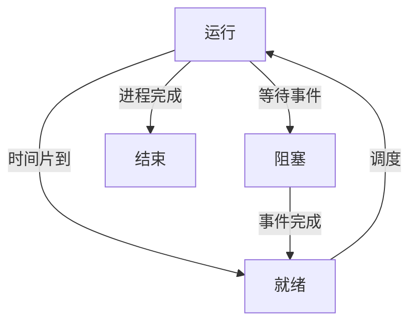
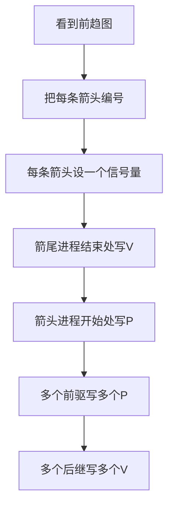

# chapter 9 - 操作系统知识：笔记和例题整理

**适用对象**：软件设计师新手备考  
# 一、当前整理范围

```text
操作系统知识
├─ 1. 计算机系统层次结构
│  ├─ 裸机
│  ├─ 操作系统
│  ├─ 系统软件
│  └─ 应用软件
├─ 2. 进程管理
│  ├─ 程序与进程
│  ├─ 三态模型
│  ├─ PCB组织
│  ├─ 前趋图
│  ├─ PV操作
│  ├─ 同步与互斥
│  ├─ 死锁
│  ├─ 进程资源图
│  ├─ 死锁避免
│  └─ 线程
├─ 3. 存储管理
│  ├─ 局部性原理
│  ├─ 分页存储管理
│  ├─ 请求分页与页面置换
│  ├─ 段页式存储管理
│  ├─ 地址变换
│  └─ 可变分区
├─ 4. 设备管理
│  ├─ I/O软件层次
│  ├─ 缓冲技术
│  ├─ 单缓冲
│  ├─ 双缓冲
│  ├─ 磁盘调度
│  └─ 旋转调度
├─ 5. 文件管理
│  ├─ 文件控制块
│  ├─ 目录结构
│  ├─ 多级索引结构
│  ├─ 链式存储
│  └─ 位示图
└─ 6. 操作系统杂题
   ├─ Windows文件关联
   ├─ 文件属性安全级别
   ├─ 实时操作系统
   ├─ 嵌入式系统初始化
   ├─ I/O中断
   └─ 云计算部署模型
```

# 二、复习建议

| 轮次 | 目标 | 建议做法 | 关注重点 |
|---|---|---|---|
| 第 1 轮 | 建立框架 | 先按“进程—存储—设备—文件”四条线看总记忆表 | 进程三态、PV、分页、磁盘、文件索引 |
| 第 2 轮 | 掌握公式 | 每个公式至少手算 2 道题，不要只背结论 | 死锁资源数、地址变换、位示图、缓冲时间 |
| 第 3 轮 | 攻克图题 | 前趋图、进程资源图、目录树、页表题放在一起练 | 图中箭头含义、P/V位置、路径起点、页号页内地址 |
| 第 4 轮 | 冲刺提分 | 只看“题眼—模板—答案方向” | 负信号量、线程共享、SCAN/CSCAN、目录文件崩溃影响最大 |

# 三、章节笔记

## 总记忆表

| 模块 | 记忆句 |
|---|---|
| 操作系统位置 | 操作系统是裸机上的第一层软件，向上支撑系统软件和应用软件。 |
| 进程三态 | 运行有 CPU，有资源；就绪无 CPU，有资源；阻塞无 CPU，等事件或资源。 |
| PV操作 | P 是申请，先减；V 是释放，后加；P 可能阻塞，V 可能唤醒。 |
| 同步信号量 | 前驱完成后 V，后继开始前 P。 |
| 互斥信号量 | 初值为 1，进入临界区前 P，离开临界区后 V。 |
| 死锁资源数 | $m \ge n(w-1)+1$ 可保证不死锁。 |
| 资源图化简 | 先看资源能否满足某进程申请，能满足就运行完并释放资源。 |
| 线程共享 | 线程共享进程代码、全局变量、打开文件；不共享各自栈和寄存器现场。 |
| 局部性 | 循环导致时间局部性，顺序执行导致空间局部性。 |
| 分页地址 | 逻辑地址 = 页号 + 页内地址；物理地址 = 页框号 + 页内地址。 |
| 页面大小 4K | 页内地址低 12 位；十六进制中低 3 位通常是页内地址。 |
| 段页式地址 | 段号位数定段数，页号位数定每段最大页数，页内位数定页大小。 |
| 单缓冲 | 常考公式：$(T+M)\times n+C$，注意题目给出的前提。 |
| 双缓冲 | 常按流水线思想：首块启动后，多数块按最大阶段时间推进。 |
| 磁盘调度 | FCFS看顺序，SSTF看最近，SCAN看方向，CSCAN单向循环。 |
| 目录路径 | 全文件名含文件名；绝对路径从根开始；相对路径从当前目录开始。 |
| 位示图 | 物理块号除以字长得字号；容量除以块大小除以字长得字数。 |

---

## 1. 计算机系统层次结构

### 1. 知识点

| 层次 | 含义 | 题目常见判断 |
|---|---|---|
| 裸机 | 只有硬件，没有软件 | 不能直接方便地为用户服务 |
| 操作系统 | 裸机上的第一层软件 | 管理硬件、软件资源，提供用户接口 |
| 系统软件 | 语言处理程序、数据库管理系统等 | 建立在操作系统基础上 |
| 应用软件 | 财务软件、办公软件、气象预报软件等 | 面向具体用户任务 |

> 系统软件不要误选应用软件。**编译程序、汇编程序、Java解释器、数据库管理系统**通常按系统软件处理；**财务软件、办公管理软件、汽车防盗程序、气象预报软件**通常按应用软件处理。

### 2. 结构图

```text
用户
├─ 应用软件
├─ 系统软件
├─ 操作系统
└─ 裸机硬件
```

### 3. 例题分析

**例 1**：操作系统是裸机上的第几层软件？  
先抓题眼：裸机上的第一层软件。操作系统直接管理硬件资源，其他软件建立在操作系统基础上。  
**结论**：操作系统位于硬件之上、系统软件和应用软件之下。

### 4. 记忆技巧

```text
硬件上面是操作，
系统软件靠它活；
用户最终用应用，
层次顺序别倒说。
```

---

## 2. 进程与三态模型

### 1. 知识点

| 状态 | 是否占有 CPU | 是否具备运行所需资源 | 说明 |
|---|---:|---:|---|
| 运行 | 是 | 是 | 正在处理机上执行 |
| 就绪 | 否 | 是 | 万事俱备，只差 CPU |
| 阻塞/等待 | 否 | 否 | 等待 I/O、事件或资源 |

### 2. 状态转换图



### 3. 做题模板

```text
三态题判断：
1. 谁当前运行？
2. 若时间片到：运行 -> 就绪，队首就绪 -> 运行
3. 若运行进程释放某设备：等待该设备的进程 -> 就绪，不一定立即运行
4. 单处理机下同时只能有一个运行进程
5. FCFS下通常先到的就绪进程优先运行
```

### 4. 例题分析

**例 1：释放扫描仪后的状态判断**  
题干：单处理机，P1运行，P2就绪，P3等待打印机，P4等待扫描仪。若 P1 释放扫描仪。  
先抓题眼：P1释放的是扫描仪，所以等待扫描仪的 P4 被唤醒，进入**就绪**。P1没有放弃 CPU，所以 P1仍是运行；P2仍就绪；P3仍等待打印机。  
**正确答案**：B  
**答案方向**：释放设备只唤醒等待该设备的进程为就绪，不代表立刻运行。

**例 2：时间片到后的状态判断**  
若 P1 时间片到，则 P1 从运行转为就绪，P2 按先来先服务进入运行，P3/P4仍等待各自设备。  
**正确答案方向**：P1就绪、P2运行、P3等待、P4等待。

### 5. 记忆技巧

```text
就绪只差CPU，阻塞还差事件；
释放设备只唤醒，是否运行看调度。
```

---

## 3. 前趋图与 PV 操作

### 1. 知识点

| 图中关系 | PV设置 | 解释 |
|---|---|---|
| $P_i \rightarrow P_j$ | 设信号量 $S_{ij}=0$ | 表示 $P_j$ 必须等待 $P_i$ 完成 |
| 前驱进程结束后 | $V(S_{ij})$ | 通知后继：我完成了 |
| 后继进程开始前 | $P(S_{ij})$ | 等待前驱完成 |
| 一个进程有多个前驱 | 开始前做多个 P | 所有前驱都完成才可运行 |
| 一个进程有多个后继 | 结束后做多个 V | 分别通知所有后继 |

### 2. 公式/模板

```text
前趋图PV模板：
每一条箭头 = 一个同步信号量，初值0

Pi --> Pj
Pi结尾：V(Sij)
Pj开头：P(Sij)

多个箭头进入某进程：
Pj开头：P(Sa) P(Sb) ...

多个箭头离开某进程：
Pi结尾：V(Sx) V(Sy) ...
```

### 3. 流程图



### 4. 例题分析

**例 1：P1、P2、P3、P4前趋图题**  
先抓题眼：题目给出多个进程的先后约束，并要求在程序空缺处填 P/V 操作。  
解题时不要直接看选项，先把图中的每条边当作一个信号量。例如若存在：

```text
P1 ──S1──> P3
P2 ──S2──> P3
P3 ──S4──> P4
```

则应写成：

```text
P1结束：V(S1)
P2结束：V(S2)
P3开始：P(S1) P(S2)
P3结束：V(S4)
P4开始：P(S4)
```

**答案方向**：箭尾写 V，箭头写 P；一个结点有几个入边，开始前就有几个 P。

**例 2：P1〜P5前趋图题**  
这类题经常设置 5 个或 6 个信号量。做法仍不变：

| 步骤 | 做法 |
|---|---|
| 第一步 | 先数箭头数，通常箭头数 = 同步信号量数 |
| 第二步 | 给每条箭头编号，如 S1、S2、S3 |
| 第三步 | 写出每个进程的“前置 P”和“后置 V” |
| 第四步 | 与选项逐项匹配 |

**答案方向**：不要背具体年份题答案，背“边对应信号量”的机械规则。

### 5. 易错提醒

| 易错点 | 正确处理 |
|---|---|
| 把 P/V 写反 | 前驱完成后 V，后继开始前 P |
| 一个进程多个前驱只写一个 P | 每个前驱都要等，所以写多个 P |
| 一个进程多个后继只写一个 V | 每个后继都要通知，所以写多个 V |
| 信号量初值写成 1 | 前趋同步信号量初值通常是 0 |

### 6. 记忆技巧

```text
箭尾释放V，箭头等待P；
几条箭头进，就有几个P；
几条箭头出，就有几个V。
```

---

## 4. 信号量机制与 PV 操作

### 1. 知识点

| 操作 | 含义 | 数学变化 | 结果 |
|---|---|---|---|
| P(S) | 申请资源 | $S=S-1$ | 若 $S<0$，进程阻塞 |
| V(S) | 释放资源 | $S=S+1$ | 若释放前有等待者，唤醒一个进程 |
| 互斥信号量 | 控制临界区一次只允许一个进程进入 | 初值通常为 1 | P进V出 |
| 同步信号量 | 控制先后顺序 | 初值通常为 0 | 前者V，后者P |
| 资源信号量 | 控制同类资源数量 | 初值为资源数 | 负值绝对值为等待进程数 |

### 2. 信号量数值意义

| 信号量值 | 含义 |
|---:|---|
| $S>0$ | 还有 $S$ 个可用资源 |
| $S=0$ | 没有空闲资源，但暂无进程等待 |
| $S<0$ | 无可用资源，且有 $|S|$ 个进程等待 |

### 3. 例题分析

**例 1：信号量为 -3**  
题干：n 个进程共享一台扫描仪，信号量 S = -3。  
先抓题眼：负信号量。负值的绝对值就是等待队列中的进程数。  
**正确答案**：C（3）  
**答案方向**：看到 S 为负，直接取绝对值。

**例 2：n 个进程共享两台打印机，信号量范围**  
初值为 2。最多有 n 个进程都执行 P 操作，其中 2 个获得打印机，其余 $n-2$ 个等待。  
最小值为：

$$
2-n
$$

最大值为 2。  
**答案方向**：资源数为 $r$、进程数为 $n$，信号量范围通常为 $[r-n, r]$。

**例 3：共享 3 台扫描仪，S 当前为 1，又执行两次 P 操作**  
每次 P 操作使 S 减 1，所以：

$$
S = 1 - 2 = -1
$$

**答案方向**：P 是减法，不管题干多长，先按次数减。

### 4. 互斥与同步对照

| 场景 | 信号量初值 | P/V位置 |
|---|---:|---|
| 互斥访问临界资源 | 1 | 进入临界区前 P，退出后 V |
| 生产者-消费者空缓冲区 | 缓冲区容量 n | 生产前 P(empty)，生产后 V(full) |
| 生产者-消费者满缓冲区 | 0 | 消费前 P(full)，消费后 V(empty) |
| 前趋同步 | 0 | 前驱结束 V，后继开始 P |

### 5. 记忆技巧

```text
P减资源，V加资源；
互斥初值一，同步初值零；
负数不神秘，绝对值是等待数。
```

---

## 5. 进程同步与互斥应用题

### 1. 生产者—消费者模型

| 信号量 | 含义 | 初值 |
|---|---|---:|
| mutex | 互斥访问缓冲区 | 1 |
| empty | 空缓冲区数量 | n |
| full | 满缓冲区数量 | 0 |

### 2. 伪代码模板

```text
生产者：
P(empty)
P(mutex)
放入产品
V(mutex)
V(full)

消费者：
P(full)
P(mutex)
取出产品
V(mutex)
V(empty)
```

### 3. 例题分析

**例 1：半成品箱容量为 n**  
题干：甲放入半成品，乙取出半成品继续加工。  
先抓题眼：箱子容量 n；一开始箱子为空。  
因此空位信号量初值 n，产品信号量初值 0，互斥信号量初值 1。  
**正确答案**：互斥信号量初值 B（1）；S1/S2 初值 A（n、0）  
**答案方向**：空位初值 = 容量；产品初值 = 0；互斥初值 = 1。

**例 2：自动售票系统互斥访问剩余票数**  
多个售票终端同时修改剩余票数，核心是保护共享变量。  
信号量 S 是互斥信号量，初值为 1。访问临界区前 P(S)，离开临界区后 V(S)。  
**正确答案方向**：S=1；进入修改票数前 P，修改完成后 V。

### 4. 记忆技巧

```text
有箱子：空位n，产品0；
有共享变量：互斥1；
进入先P，出来后V。
```

---

## 6. 死锁

### 1. 知识点

| 项目 | 内容 |
|---|---|
| 死锁含义 | 多个进程互相等待对方占有的资源，导致都无法推进 |
| 死锁必要条件 | 互斥、占有并等待、不可剥夺、循环等待 |
| 死锁处理 | 鸵鸟策略、预防、避免、检测与解除 |
| 常考方向 | 给 n 个进程、每个最多需要 w 个资源，问至少多少资源不死锁 |

### 2. 核心公式

对于 $n$ 个进程，每个进程最多需要 $w$ 个同类互斥资源，保证不发生死锁的最少资源数为：

$$
m_{\min}=n(w-1)+1
$$

等价地：

```text
每个进程最多先拿 w-1 个资源，还差1个才完成。
如果系统还能多出1个资源，就至少能让一个进程完成；
该进程释放资源后，其他进程依次完成。
```

### 3. 例题分析

**例 1：6个进程，每个需要2个资源**  
套公式：

$$
m_{\min}=6(2-1)+1=7
$$

**正确答案**：B（7）  
**答案方向**：$n(w-1)+1$。

**例 2：5个进程，每个需要3个资源**  
套公式：

$$
m_{\min}=5(3-1)+1=11
$$

**正确答案**：C（11）  
**答案方向**：最多每个进程先占 2 个，再多 1 个破局。

**例 3：3个进程，每个需要5个资源**  
套公式：

$$
m_{\min}=3(5-1)+1=13
$$

**正确答案**：B（13）  
**答案方向**：不是 $3\times5=15$，只要能保证至少一个进程完成即可。

**例 4：资源数为8，3个进程，每个进程都需要 i 个，问可能死锁的最小 i**  
系统不死锁条件：

$$
8 \ge 3(i-1)+1
$$

整理：

$$
8 \ge 3i-2
$$

$$
10 \ge 3i
$$

所以 $i \le 3$ 时保证不死锁，可能死锁的最小值是 $i=4$。  
**正确答案**：D（4）  
**答案方向**：问“可能死锁的最小 i”，先求“不死锁最大 i”，再加 1。

### 4. 记忆技巧

```text
死锁资源最少数：
每人先拿差一个，再给一个就破局。
公式 n(w-1)+1。
```

---

## 7. 进程资源图

### 1. 知识点

| 图形元素 | 含义 |
|---|---|
| 进程结点 | P1、P2、P3 |
| 资源结点 | R1、R2 |
| 资源 → 进程 | 资源已分配给该进程 |
| 进程 → 资源 | 进程正在申请该资源 |
| 非阻塞结点 | 当前可获得所需资源，能运行完成 |
| 阻塞结点 | 当前申请资源不能被满足 |

### 2. 化简模板

```text
进程资源图化简：
1. 先统计每类资源总量和已分配量。
2. 判断某进程申请的资源当前是否可满足。
3. 若可满足，该进程是非阻塞结点，可运行完成。
4. 运行完成后释放它占有的全部资源。
5. 重复判断。
6. 若所有进程都能删除，则非死锁。
7. 若剩余进程都无法满足申请，则死锁。
```

### 3. 例题分析

**例 1：图中有非阻塞结点**  
先抓题眼：不要只看是否有环。考试题通常要求“能否化简”。  
若某进程申请可满足，就让该进程运行完并释放资源。释放后其他进程可能变为非阻塞。  
**答案方向**：只要可以逐步删完所有进程，就是非死锁。

**例 2：没有一个进程是非阻塞结点**  
若每个进程都在等待当前不可获得的资源，且无法找到第一个可完成进程，则图不可化简。  
**答案方向**：不可化简通常判为死锁。

### 4. 记忆技巧

```text
资源图先分配，再申请；
能跑完就释放，删完就是安全；
一个都跑不了，基本就是死锁。
```

---

## 8. 死锁避免与银行家算法

### 1. 知识点

| 概念 | 含义 |
|---|---|
| Max | 进程最大资源需求 |
| Allocation | 已分配资源 |
| Need | 尚需资源，$Need=Max-Allocation$ |
| Available | 当前可用资源 |
| 安全序列 | 存在一个进程执行顺序，使所有进程最终完成 |
| 不安全状态 | 不一定已经死锁，但存在进入死锁的风险 |

### 2. 解题模板

```text
银行家算法：
1. 计算 Need = Max - Allocation。
2. 计算 Available = 总资源 - 已分配总和。
3. 找 Need <= Available 的进程。
4. 假设该进程完成，Available += Allocation。
5. 重复直到所有进程完成。
6. 能找到完整序列：安全；找不到：不安全。
```

### 3. 例题分析

**例：企业资金分配题**  
这类题只是银行家算法换成“资金”。  
- 最大资金需求 = Max；
- 已用资金 = Allocation；
- 尚需资金 = Need；
- 企业可用资金 = Available。

先计算每个项目尚需资金，再判断有没有项目的尚需资金不超过可用资金。若能让一个项目完成并还款，就把它已用资金加回可用资金。  
**答案方向**：资金题本质就是银行家算法，不要被“投资款”场景干扰。

### 4. 记忆技巧

```text
银行家不看已用多少，先看还差多少；
谁差得少先满足，完成归还再继续。
```

---

## 9. 线程

### 1. 知识点

| 项目 | 进程 | 线程 |
|---|---|---|
| 基本角色 | 资源分配单位 | 调度和执行单位 |
| 拥有资源 | 拥有独立地址空间和资源 | 基本不独立拥有系统资源 |
| 切换开销 | 较大 | 较小 |
| 可共享内容 | 不同进程一般不共享地址空间 | 同一进程内线程共享代码、全局变量、打开文件 |
| 不共享内容 | — | 各线程私有栈、寄存器、程序计数器 |

### 2. 例题分析

**例 1：线程不能共享什么？**  
选项通常有代码段、打开文件、全局变量、某线程栈指针。  
同一进程内线程共享进程资源，但线程自己的运行现场不能被其他线程共享。  
**正确答案**：某线程的栈指针。  
**答案方向**：看到“某线程的栈指针”，优先判断为不能共享。

**例 2：线程共享叙述错误项**  
“线程 T1、T2 可以共享 T3 的栈指针”是错误的。  
**答案方向**：线程共享进程级资源，不共享其他线程的私有栈和执行现场。

### 3. 记忆技巧

```text
线程共进程资源，不共线程私货；
代码文件全局共，栈和寄存器不共。
```

---

## 10. 局部性原理与页面置换

### 1. 知识点

| 类型 | 含义 | 典型原因 |
|---|---|---|
| 时间局部性 | 访问过的指令或数据不久可能再次访问 | 循环 |
| 空间局部性 | 访问某地址后，不久可能访问其附近地址 | 顺序执行 |
| 修改位 | 页面是否被修改 | 修改过的页淘汰代价大 |
| 访问位 | 页面近期是否被访问 | 未访问页优先淘汰 |

### 2. 页面淘汰常见原则

若题目给出状态位、访问位、修改位，通常按以下思路：

```text
1. 状态位为0：页面不在内存，不作为淘汰候选。
2. 状态位为1：页面在内存，可作为候选。
3. 优先淘汰访问位为0的页。
4. 在访问位相同条件下，优先淘汰修改位为0的页。
5. 修改过的页写回磁盘，代价更大。
```

### 3. 例题分析

**例：访问页面不在内存时，淘汰代价最小的页面**  
先抓题眼：淘汰代价最小，不是最近最久未用。  
通常未访问、未修改的页代价最低；已修改页需要写回磁盘，代价更高。  
**答案方向**：在内存页中找“访问位 0、修改位 0”的页。

### 4. 记忆技巧

```text
换页看在内存，
淘汰看代价；
未访问优先，
未修改更佳。
```

---

## 11. 分页存储管理与地址变换

### 1. 知识点

| 概念 | 含义 |
|---|---|
| 页 | 逻辑地址空间划分出来的等长块 |
| 页框/块 | 物理内存划分出来的等长块 |
| 页号 | 逻辑页编号 |
| 页内地址 | 页内偏移量 |
| 页表 | 页号到页框号的映射表 |
| 状态位 | 页面是否在内存 |

### 2. 地址变换公式

设页面大小为 $2^k$ 字节，则：

$$
页号=\left\lfloor \frac{逻辑地址}{页面大小} \right\rfloor
$$

$$
页内地址=逻辑地址 \bmod 页面大小
$$

查页表得到页框号后：

$$
物理地址=页框号 \times 页面大小 + 页内地址
$$

### 3. 4K页面的快速法

页面大小 4KB：

$$
4KB=4096B=1000H
$$

所以十六进制逻辑地址中：

```text
高位：页号
低三位十六进制：页内地址
```

例如：

```text
逻辑地址 2C25H
页号 = 2
页内地址 = C25H
若页号2对应页框号4
物理地址 = 4C25H
```

### 4. 例题分析

**例 1：逻辑地址 2C25H，页面大小 4K**  
先抓题眼：页面大小 4K，所以低 3 位十六进制 C25H 是页内地址，页号为 2。  
查页表：若页号 2 对应页框号 4，则物理地址为：

$$
4C25H
$$

**正确答案方向**：页内地址不变，只替换页号为页框号。

**例 2：逻辑地址 3C20H，页面大小 4K**  
页号 = 3，页内地址 = C20H。  
若页表中页号 3 对应页框号 5，则物理地址为：

$$
5C20H
$$

**答案方向**：4K 页面下，地址变换常常就是“查表换最高一位”。

**例 3：物理页大小 1KB，逻辑地址 1024**  
1KB = 1024B。  
逻辑地址 1024 正好是第 1 页的起始地址：

$$
页号=1024 / 1024 = 1
$$

页内地址为 0。查进程 A 页表中逻辑页 1 对应的物理页即可。  
**答案方向**：十进制题要先除以页面大小，别用 4K 快速法。

### 5. 记忆技巧

```text
分页地址两段看：
页号查表，页内不变；
4K低三位不动，高位换页框。
```

---

## 12. 段页式存储管理

### 1. 知识点

段页式管理结合了分段和分页：

| 部分 | 作用 |
|---|---|
| 段号 | 标识逻辑段 |
| 页号 | 标识段内页 |
| 页内地址 | 标识页内偏移 |
| 段表 | 找到该段的页表 |
| 页表 | 找到页框号 |

### 2. 地址结构模板

```text
| 段号 | 页号 | 页内地址 |
```

若段号占 $s$ 位，页号占 $p$ 位，页内地址占 $d$ 位：

$$
最多段数=2^s
$$

$$
每段最大页数=2^p
$$

$$
页大小=2^d B
$$

### 3. 例题分析

**例 1：段号8位，页号12位，页内地址12位**  
最多段数：

$$
2^8=256
$$

每段最大页数：

$$
2^{12}=4096
$$

页大小：

$$
2^{12}B=4096B=4KB
$$

**答案方向**：选“最多可有256个段，每段最大允许4096个页，页大小4K”。

**例 2：段号11位，页号11位，页内地址11位**  
最多段数：

$$
2^{11}=2048
$$

每段最大页数：

$$
2^{11}=2048
$$

页大小：

$$
2^{11}B=2KB
$$

**答案方向**：题目选项若写“每段大小均为2048个页”要谨慎，通常应选“每段最大允许有2048个页”。

### 4. 易错点

| 错误说法 | 为什么错 |
|---|---|
| 每个段大小均为固定页数 | 段可以长短不同，只是“最大允许”页数相同 |
| 页号位数决定页大小 | 页内地址位数决定页大小 |
| 段号位数决定每段页数 | 段号位数决定最多段数 |

### 5. 记忆技巧

```text
段号数段数，
页号数页数，
页内定页大；
“最大允许”比“均为”稳。
```

---

## 13. 单缓冲区与双缓冲区

### 1. 知识点

| 符号 | 含义 |
|---|---|
| T | 从磁盘读入缓冲区时间 |
| M | 从缓冲区送用户区时间 |
| C | CPU处理每块数据时间 |
| n | 数据块数 |

### 2. 单缓冲常用模板

在常见软考题中，单缓冲可按：

$$
时间=(T+M)\times n+C
$$

题目通常会给出前提：处理时间 $C$ 小于读入时间 $T$ 或流水关系满足该模板。

### 3. 双缓冲常用思路

双缓冲允许输入、传送、处理更充分重叠，常按流水线方式分析：

```text
1. 先完成第一块的读入。
2. 后续块可与上一块处理重叠。
3. 中间阶段取最长耗时作为节拍。
4. 最后一块还要完成必要的传送和处理。
```

具体题目如果选项给出数值，优先画时间轴而不是死背公式。

### 4. 例题分析

**例：10个磁盘块，T、M、C给定，问单缓冲/双缓冲时间**  
先抓题眼：单缓冲还是双缓冲。  
单缓冲按顺序关系：

```text
读入缓冲区 T
送用户区 M
处理 C
```

但读入下一块可以与处理上一块部分重叠，所以常见模板为：

$$
(T+M)\times n+C
$$

双缓冲则重叠更充分，通常时间更短。  
**答案方向**：若两个选项中一个明显较小，双缓冲一般选较小者，但必须结合题干的 T、M、C 推导。

### 5. 记忆技巧

```text
单缓冲有重叠，但重叠有限；
双缓冲更流水，总时间通常更短。
```

---

## 14. 磁盘调度算法

### 1. 知识点

| 算法 | 判断依据 | 特点 |
|---|---|---|
| FCFS | 请求到达顺序 | 公平，但寻道可能长 |
| SSTF | 离当前磁头最近 | 平均寻道可能较短，但可能饥饿 |
| SCAN | 当前移动方向优先，到端后反向 | 像电梯 |
| CSCAN | 只按一个方向扫描，到端后回到另一端继续 | 等待时间更均匀 |

### 2. 算法对照图

```text
FCFS：
当前 -> 按请求队列顺序服务

SSTF：
当前 -> 每次选最近柱面

SCAN：
当前 -> 沿当前方向服务 -> 到端或无请求后反向

CSCAN：
当前 -> 沿当前方向服务 -> 到端后跳回起点方向继续
```

### 3. 例题分析

**例 1：哪种算法可能随时改变移动臂方向？**  
FCFS按请求顺序，可能前一个请求在左边，下一个请求在右边，所以方向可能随时变。  
SSTF每次选最近请求，也可能左、右来回跳。  
SCAN和CSCAN方向规则更固定。  
**正确答案**：B（先来先服务和最短寻找时间优先）  
**答案方向**：看到“随时改变方向”，选 FCFS + SSTF。

**例 2：SCAN/CSCAN响应序列**  
先抓题眼：当前柱面、刚完成的柱面、移动方向。  
若刚完成 10 号柱面，当前在 13 号柱面，说明磁头正向柱面号增大的方向移动。  
SCAN：先服务当前方向上所有请求，再反向。  
CSCAN：先服务当前方向上所有请求，到头后回到低端，再继续同方向服务。  
**答案方向**：先判断方向，再排序；不要按请求到达顺序。

**例 3：SSTF响应序列**  
每一步都从“当前磁头位置”出发，选距离最近的下一个柱面；服务后当前柱面更新。  
**答案方向**：每一步重算距离，不是一次性整体排序。

### 4. 记忆技巧

```text
FCFS看队列，
SSTF看最近，
SCAN像电梯，
CSCAN单向转圈。
```

---

## 15. 旋转调度与磁盘读取时间

### 1. 知识点

磁盘读取一个数据块通常包括：

| 时间 | 含义 |
|---|---|
| 寻道时间 | 磁头移动到目标磁道 |
| 旋转延迟 | 等目标扇区转到磁头下 |
| 传输时间 | 数据真正读写的时间 |

### 2. 非连续文件读取公式

若读取 $n$ 块文件，每块平均移动 $d$ 个磁道，每移动一个磁道耗时 $t_s$，每块旋转延迟 $t_r$，传输时间 $t_t$，则总时间常按：

$$
总时间=n(d\times t_s+t_r+t_t)
$$

注意：有些题会把“相邻数据块平均移动距离”理解为每读一块都要寻道，按题干语义直接套即可。

### 3. 例题分析

**例 1：100块文件，平均移动10个磁道，每磁道10ms，旋转100ms，传输2ms**  
每块耗时：

$$
10\times10+100+2=202ms
$$

100块：

$$
202\times100=20200ms
$$

**正确答案**：D（20200）  
**答案方向**：每块 = 寻道 + 旋转 + 传输。

**例 2：每磁道6ms，平均距离10，旋转100ms，传输20ms，100块**  
每块耗时：

$$
6\times10+100+20=180ms
$$

总时间：

$$
180\times100=18000ms
$$

**正确答案**：C（18000）  
**答案方向**：不要漏掉传输时间。

**例 3：磁盘转速提高一倍**  
转速提高一倍，旋转一周时间减半，所以平均旋转等待时间减半，数据传输率通常提高。  
考试若单选最稳说法：**旋转等待时间减半**。  
**答案方向**：平均存取时间还包含寻道时间，不能简单减半。

### 4. 记忆技巧

```text
读磁盘三件事：
先寻道，再等待旋转，再传输。
转速翻倍，旋转等待减半。
```

---

## 16. 多级索引结构

### 1. 知识点

| 索引方式 | 含义 |
|---|---|
| 直接地址索引 | 地址项直接指向数据块 |
| 一级间接索引 | 地址项指向索引块，索引块再指向数据块 |
| 二级间接索引 | 地址项指向一级索引块，一级索引块指向二级索引块，二级索引块指向数据块 |
| 三级间接索引 | 再多一级 |

### 2. 块号容量公式

若磁盘块大小为 $B$ 字节，每个块号占 $a$ 字节，则一个索引块可存放块号数：

$$
N=\left\lfloor \frac{B}{a} \right\rfloor
$$

若：
- 直接地址项数为 $d$
- 一级间接地址项数为 $i_1$
- 二级间接地址项数为 $i_2$

则最大数据块数：

$$
d+i_1N+i_2N^2
$$

若每个数据块大小为 $B$，最大文件长度为：

$$
(d+i_1N+i_2N^2)\times B
$$

若 $B$ 用 KB 表示，结果可直接为 KB。

### 3. 例题分析

**例 1：8个地址项，5个直接，2个一级，1个二级，地址项4B，块大小1KB**  
一个索引块能放：

$$
1024/4=256
$$

最大块数：

$$
5+2\times256+1\times256^2=5+512+65536=66053
$$

因为每块 1KB，所以最大文件长度：

$$
66053KB
$$

**正确答案**：D（66053）  
**答案方向**：直接 + 一级 + 二级，不要漏掉 5 个直接块。

**例 2：访问逻辑块号 5 和 518**  
若逻辑块号从 0 开始：
- 0〜4：直接地址；
- 5〜260：第一个一级间接；
- 261〜516：第二个一级间接；
- 517 开始：二级间接。

所以：
- 逻辑块号 5：一级间接；
- 逻辑块号 518：二级间接。

**正确答案**：C（一级间接地址索引和二级间接地址索引）  
**答案方向**：先列出每个索引范围，再定位逻辑块号。

**例 3：逻辑块号 4 和 5**  
0〜4 是直接地址，5 开始进入一级间接。  
**正确答案**：B（直接地址访问和一级间接地址访问）  
**答案方向**：直接地址项有 5 个时，块号 4 仍是直接。

### 4. 记忆技巧

```text
索引块容量 = 块大小 / 块号大小；
一级乘N，二级乘N平方；
逻辑块号从0数，边界最易错。
```

---

## 17. 文件目录与路径

### 1. 知识点

| 名称 | 含义 | 是否含文件名 |
|---|---|---|
| 全文件名 | 从根目录到文件名的完整路径 | 含 |
| 绝对路径 | 从根目录到文件所在目录 | 不含文件名 |
| 相对路径 | 从当前目录到目标文件所在目录 | 通常不含文件名 |
| 当前工作目录 | 相对路径的起点 | — |

### 2. 路径判断模板

```text
路径题：
1. 找当前工作目录。
2. 找目标文件所在目录。
3. 全文件名 = 根目录到目标文件名。
4. 绝对路径 = 根目录到目标文件所在目录。
5. 相对路径 = 当前目录到目标文件所在目录。
6. 注意以 "\" 或 "/" 开头通常表示从根目录开始，不是相对路径。
```

### 3. 例题分析

**例 1：当前目录为 Program，访问 Java-prog 下的 f1.java**  
全文件名从根目录写到文件：

```text
\Program\Java-prog\f1.java
```

相对路径从当前目录 Program 出发，到 Java-prog：

```text
Java-prog\
```

**正确答案方向**：全文件名含文件名；相对路径不从根开始。

**例 2：当前目录为 swshare，访问 flash 目录下 fault.swf**  
全文件名：

```text
\swshare\flash\fault.swf
```

相对路径：

```text
flash\
```

绝对路径：

```text
\swshare\flash\
```

**答案方向**：相对路径前面不要加反斜杠。

### 4. 文件目录崩溃影响

| 文件类型 | 崩溃影响 |
|---|---|
| 目录文件 | 影响较大 |
| 空闲块文件 | 影响也大，但常考更偏目录 |
| 用户数据 | 影响局部文件 |
| 用户程序 | 影响具体程序 |

**考试高频结论**：系统正在将**目录文件**修改结果写回磁盘时崩溃，影响相对较大。

### 5. 记忆技巧

```text
全文件名带文件，
绝对路径从根起，
相对路径看当前，
目录坏了影响大。
```

---

## 18. 位示图

### 1. 知识点

位示图用一个二进制位表示一个物理块状态：

| 位值 | 含义 |
|---:|---|
| 0 | 空闲 |
| 1 | 占用 |

### 2. 物理块号对应字号

若字长为 $W$ 位，物理块号从 0 开始，位示图中字号也从 0 开始：

$$
字号=\left\lfloor \frac{物理块号}{W} \right\rfloor
$$

若题目问“第几个字”且字从 1 开始，则：

$$
第几个字=\left\lfloor \frac{物理块号}{W} \right\rfloor + 1
$$

### 3. 位示图大小

若磁盘容量为 $C$，物理块大小为 $B$，字长为 $W$ 位：

$$
物理块数=\frac{C}{B}
$$

$$
位示图字数=\frac{物理块数}{W}
$$

不足一个字时向上取整。

### 4. 单位换算

| 单位 | 换算 |
|---|---|
| 1GB | 1024MB |
| 1MB | 1024KB |
| 1KB | 1024B |

### 5. 例题分析

**例 1：字长32位，4096号物理块，第几个字描述？**  
若问“第几个字”，按从 1 开始：

$$
4096/32=128
$$

因为 4096 正好是第 129 个字的第 1 位，所以答案为：

$$
128+1=129
$$

**正确答案**：A（129）  
**答案方向**：编号从 0 还是“第几个”从 1 是最大陷阱。

**例 2：磁盘200GB，物理块1MB，字长32位，位示图大小**  
物理块数：

$$
200\times1024=204800
$$

位示图字数：

$$
204800/32=6400
$$

**正确答案**：D（6400）  
**答案方向**：GB 先换成 MB。

**例 3：字长32位，物理块号2053，字号从0开始**  
计算：

$$
2053/32=64余5
$$

所以在编号为 64 的字中。  
**正确答案**：C（64）  
**答案方向**：题目若说“编号为多少的字”，通常从 0 开始，不加 1。

**例 4：字长64位，磁盘1024GB，块大小4MB**  
物理块数：

$$
1024\times1024/4=262144
$$

字数：

$$
262144/64=4096
$$

**正确答案**：C（4096）  
**答案方向**：容量单位统一成 MB。

### 6. 记忆技巧

```text
块号找字号：块号除字长；
问第几个，通常再加一；
位图大小：容量除块大，再除字长。
```

---

## 19. 操作系统杂题

### 1. 常见知识点表

| 考点 | 正确说法 | 易错项 |
|---|---|---|
| 操作系统设计 | 管理硬件资源、软件资源，提供用户接口 | 不负责语言编译器具体设计实现 |
| 键盘鼠标输入 | 最先由中断处理程序获得 | 不是命令解释程序 |
| 文件关联 | 双击 jpg 文件由文件关联决定打开程序 | 不是文件目录决定 |
| 实时系统 | 必须在被控对象规定时间内响应并处理 | 不是一个时间片、机器周期 |
| 嵌入式初始化 | 片级初始化 → 板级初始化 → 系统级初始化 | 系统级以操作系统初始化为主 |
| I/O软件 | 隐藏 I/O 细节，方便用户使用设备 | 不是向用户暴露物理接口 |
| 云部署模型 | 单独为某客户使用的云是私有云 | 不是公有云 |
| 文件属性 | 只读、隐藏属于文件级安全管理 | 不是目录级或系统级 |

### 2. 例题分析

**例 1：操作系统设计不需要考虑什么？**  
操作系统要管理硬件资源、软件资源，并提供用户接口。语言编译器属于系统软件，但其具体设计实现不是操作系统设计内容。  
**正确答案**：D（语言编译器的设计实现）  
**答案方向**：OS 管资源和接口，不负责每个系统软件内部实现。

**例 2：键盘鼠标输入最先由谁获得？**  
键盘、鼠标输入属于外设事件，通常先触发中断，由中断处理程序响应。  
**正确答案**：B（中断处理）  
**答案方向**：外设输入优先想到中断。

**例 3：双击 jpg 文件由什么决定打开程序？**  
Windows 根据扩展名和应用程序之间的文件关联决定打开方式。  
**正确答案**：B（文件关联）  
**答案方向**：看到“双击文件自动打开”，选文件关联。

**例 4：实时系统要求**  
实时系统强调在外部事件的规定时间内响应并处理。  
**正确答案**：D（被控对象规定的时间内做出及时响应并处理）  
**答案方向**：实时不是快，而是“规定时间内正确响应”。

**例 5：私有云**  
云基础设施为某个客户单独使用，属于私有云。  
**正确答案**：B（私有云）  
**答案方向**：单独客户 = 私有云；公众使用 = 公有云。

---

# 四、按专题插入原题与解析

## 专题一：计算机系统层次结构

### 题 1
**原题**  
操作系统是裸机上的第一层软件，其他系统软件（如 （23） 等）和应用软件都是建立在操作系统基础上的。下图①②③分别表示 （24）。（2009年下半年）

（23）  
- A. 编译程序、财务软件和数据库管理系统软件  
- B. 汇编程序、编译程序和Java解释器  
- C. 编译程序、数据库管理系统软件和汽车防盗程序  
- D. 语言处理程序、办公管理软件和气象预报软件  

**解析**  
先抓题眼：题目问“其他系统软件”。系统软件包括汇编程序、编译程序、解释器、数据库管理系统等；财务软件、办公管理软件、汽车防盗程序、气象预报软件属于应用软件。  
所以（23）选 B。  
图中层次一般是最终用户、应用软件开发者、系统软件开发者分别面对不同层次的软件接口，按图形位置判断即可。

**正确答案**  
（23）B

**答案方向**  
系统软件优先找语言处理程序、数据库管理系统；应用软件不要混进去。

### 题 2
**原题**  
计算机系统的层次结构如下图所示，基于硬件之上的软件可分为a、b和c三个层次。图中a、b和c分别表示 （23）。（2017年下半年）

- A. 操作系统、系统软件和应用软件  
- B. 操作系统、应用软件和系统软件  
- C. 应用软件、系统软件和操作系统  
- D. 应用软件、操作系统和系统软件  

**解析**  
先抓题眼：基于硬件之上的第一层是操作系统；操作系统之上是系统软件和应用软件，其中应用软件离用户更近。  
因此从硬件往上通常是：操作系统 → 系统软件 → 应用软件。

**正确答案**  
A

**答案方向**  
硬件上第一层必是操作系统。

---

## 专题二：三态模型与PCB

### 题 3
**原题**  
在单处理机系统中，采用先来先服务调度算法。系统中有4个进程P1、P2、P3、P4，其中P1为运行状态，P2为就绪状态，P3和P4为等待状态，且P3等待打印机，P4等待扫描仪。若P1 （23） ，则P1、P2、P3和P4的状态应分别为 （24）。（2019年上半年）

（23）  
- A. 时间片到  
- B. 释放了扫描仪  
- C. 释放了打印机  
- D. 已完成  

（24）  
- A. 等待、就绪、等待和等待  
- B. 运行、就绪、运行和等待  
- C. 就绪、运行、等待和等待  
- D. 就绪、就绪、等待和运行  

**解析**  
先抓题眼：P1原来正在运行，P2就绪。如果 P1 时间片到，则P1转为就绪，P2按FCFS调度运行，P3、P4仍等待设备。  
这与选项 C 对应。

**正确答案**  
（23）A；（24）C

**答案方向**  
时间片到：运行进程回就绪，队首就绪进程上CPU。

### 题 4
**原题**  
在单处理机计算机系统中有1台打印机、1台扫描仪，系统采用先来先服务调度算法。P1为运行状态，P2为就绪状态，P3等待打印机，P4等待扫描仪。此时，若P1释放了扫描仪，则进程P1、P2、P3、P4的状态分别为（23）。（2021年下半年）

- A. 等待、运行、等待、就绪  
- B. 运行、就绪、等待、就绪  
- C. 就绪、就绪、等待、运行  
- D. 就绪、运行、等待、就绪  

**解析**  
先抓题眼：P1只是释放扫描仪，并没有失去CPU；P4等待扫描仪，所以P4被唤醒进入就绪。P2仍就绪，P3仍等待打印机。  
所以状态为：运行、就绪、等待、就绪。

**正确答案**  
B

**答案方向**  
释放设备只让等待该设备的进程变就绪，不会自动抢占CPU。

---

## 专题三：PV操作与信号量

### 题 5
**原题**  
假设系统采用PV操作实现进程同步与互斥，若有n个进程共享一台扫描仪，那么当信号量S的值为-3时，表示系统中有 （23） 个进程等待使用扫描仪。（2013年下半年）

- A. 0  
- B. n-3  
- C. 3  
- D. n  

**解析**  
先抓题眼：信号量是负数。信号量为负时，其绝对值表示等待该资源的进程数。  
$S=-3$，等待进程数为3。

**正确答案**  
C

**答案方向**  
负信号量的绝对值就是等待进程数。

### 题 6
**原题**  
PV操作是操作系统提供的具有特定功能的原语。利用PV操作可以 （27）。（2019年上半年）

- A. 保证系统不发生死锁  
- B. 实现资源的互斥使用  
- C. 提高资源利用率  
- D. 推迟进程使用共享资源的时间  

**解析**  
先抓题眼：PV操作最基本用途是同步与互斥。它可以实现资源互斥访问，但不能保证系统一定不死锁。使用不当甚至可能导致死锁。

**正确答案**  
B

**答案方向**  
PV = 同步互斥工具，不是死锁万能解药。

### 题 7
**原题**  
假设系统有 n 个进程共享资源 R 且资源 R 的可用数为5。若采用PV操作，则相应的信号量S的取值范围应为 （27）。（2020年下半年）

**解析**  
初值为资源数5。最多 n 个进程都申请该资源时，信号量最小为：

$$
5-n
$$

最大值为5。因此范围为：

$$
[5-n,5]
$$

**正确答案**  
选项中对应 $5-n \le S \le 5$ 的一项。

**答案方向**  
资源数为 r、进程数为 n，信号量范围为 $[r-n,r]$。

---

## 专题四：生产者消费者与同步互斥

### 题 8
**原题**  
某企业生产流水线M共有两位生产者，生产者甲不断地将其工序上加工的半成品放入半成品箱，生产者乙从半成品箱取出继续加工。假设半成品箱可存放 n 件半成品，采用PV操作实现生产者甲和生产者乙的同步可以设置三个信号量S、S1和S2。信号量S是一个互斥信号量，初值为 （22）；S1、S2的初值分别为 （23）。（2011年下半年）

（22）  
- A. 0  
- B. 1  
- C. n  
- D. 任意正整数  

（23）  
- A. n、0  
- B. 0、n  
- C. 1、n  
- D. n、1  

**解析**  
先抓题眼：半成品箱容量 n，初始为空。  
互斥信号量控制临界区访问，初值为1。  
空位信号量初值为 n，产品信号量初值为0。  
所以 S=1，S1/S2 为 n、0。

**正确答案**  
（22）B；（23）A

**答案方向**  
互斥=1；空缓冲=n；满缓冲=0。

### 题 9
**原题**  
铁路自动售票系统有多个售票终端，每个终端创建一个进程管理车票销售。剩余票数是共享数据，用P/V操作实现同步互斥。初始化时系统应将信号量S赋值为 （23），图中（a）、（b）和（c）处应分别填入 （24）。（2018年上半年）

**解析**  
先抓题眼：多个终端同时访问并修改剩余票数。剩余票数是共享变量，需要互斥访问。互斥信号量初值为1。  
访问共享票数前执行 P(S)，完成修改后执行 V(S)。如果流程中存在多个出口，所有离开临界区的位置都要 V(S)。

**正确答案**  
（23）C（1）；（24）选 P(S)、V(S)、V(S) 对应选项。

**答案方向**  
共享票数是临界资源：进临界区P，出临界区V。

---

## 专题五：死锁

### 题 10
**原题**  
若在系统中有若干个互斥资源R，6个并发进程，每个进程都需要2个资源R，那么使系统不发生死锁的资源R的最少数目为 （24）。（2010年上半年）

- A. 6  
- B. 7  
- C. 9  
- D. 12  

**解析**  
套死锁资源公式：

$$
m_{\min}=n(w-1)+1=6(2-1)+1=7
$$

**正确答案**  
B

**答案方向**  
保证不死锁最少资源数：$n(w-1)+1$。

### 题 11
**原题**  
某系统中仅有5个并发进程竞争某类资源，且都需要3个该类资源，那么至少有 （23） 个该类资源，才能保证系统不会发生死锁。（2012年下半年）

- A. 9  
- B. 10  
- C. 11  
- D. 15  

**解析**  
套公式：

$$
m_{\min}=5(3-1)+1=11
$$

**正确答案**  
C

**答案方向**  
每个进程最多先拿2个，还要额外1个资源破局。

### 题 12
**原题**  
某系统中有3个并发进程竞争资源R，每个进程都需要5个R，那么至少有 （24） 个R，才能保证系统不会发生死锁。（2017年上半年）

- A. 12  
- B. 13  
- C. 14  
- D. 15  

**解析**  

$$
m_{\min}=3(5-1)+1=13
$$

**正确答案**  
B

**答案方向**  
不是总需求量15，而是能保证至少一个进程完成的13。

### 题 13
**原题**  
某计算机系统中互斥资源R的可用数为8，系统中有3个进程P1、P2和P3竞争R，且每个进程都需要 i 个R，该系统可能会发生死锁的最小 i 值为 （23）。（2018年下半年）

- A. 1  
- B. 2  
- C. 3  
- D. 4  

**解析**  
不死锁条件：

$$
8 \ge 3(i-1)+1
$$

$$
8 \ge 3i-2
$$

$$
i \le 3
$$

所以当 $i=4$ 时开始可能发生死锁。

**正确答案**  
D

**答案方向**  
问“可能死锁最小值”，先求保证不死锁的最大值，再加1。

---

## 专题六：进程资源图

### 题 14
**原题**  
进程资源图如图所示，判断图是否可化简、是否死锁。（多年份同类题）

**解析**  
这类图题按以下步骤解：
1. 先看资源实例是否已经分配给进程。
2. 再看进程申请的资源当前是否可用。
3. 若某进程的申请可以满足，该进程是非阻塞结点。
4. 假设该进程运行完成并释放资源。
5. 继续化简。
6. 若所有进程可删完，则不是死锁；若剩余进程都无法满足，则死锁。

**正确答案**  
按原图选“可化简/不可化简”对应选项。

**答案方向**  
资源图题不要只看有没有环，关键看能不能一步步化简。

---

## 专题七：线程

### 题 15
**原题**  
在支持多线程的操作系统中，假设进程P创建了若干个线程，那么 （24） 是不能被这些线程共享的。（2013年上半年）

- A. 该进程的代码段  
- B. 该进程中打开的文件  
- C. 该进程的全局变量  
- D. 该进程中某线程的栈指针  

**解析**  
同一进程内线程共享进程的代码段、打开文件和全局变量。但每个线程有自己的栈、寄存器和程序计数器等运行现场。  
某线程的栈指针属于该线程私有信息，不能被其他线程共享。

**正确答案**  
D

**答案方向**  
线程共享进程资源，不共享其他线程的栈和执行现场。

### 题 16
**原题**  
在支持多线程的操作系统中，假设进程P创建了线程T1、T2和T3，那么以下叙述中错误的是 （28）。（2020年下半年）

- A. 线程T1、T2和T3可以共享进程P的代码  
- B. 线程T1、T2可以共享P进程中T3的栈指针  
- C. 线程T1、T2和T3可以共享进程P打开的文件  
- D. 线程T1、T2和T3可以共享进程P的全局变量  

**解析**  
代码、打开文件、全局变量属于进程资源，同一进程内线程可共享。T3的栈指针属于T3线程私有执行现场，不能让T1、T2共享。

**正确答案**  
B

**答案方向**  
“某线程的栈指针”是错误高频项。

---

## 专题八：分页存储管理

### 题 17
**原题**  
某进程有5个页面，页号为0〜4，页面变换表如下所示。页面大小为4KB，逻辑地址为十六进制2C25H，该地址经过变换后，其物理地址应为十六进制 （26）。（2010年上半年）

- A. 2C25H  
- B. 4096H  
- C. 4C25H  
- D. 8C25H  

**解析**  
页面大小 4K = 1000H，低三位十六进制 C25H 为页内地址，页号为 2。  
查页表，页号2对应页框号4，则物理地址为4C25H。

**正确答案**  
C

**答案方向**  
4K页：低三位不变，高位页号查表换成页框号。

### 题 18
**原题**  
某计算机系统页面大小为4K，若进程的页面变换表如下所示，逻辑地址为十六进制1D16H。该地址经过变换后，其物理地址应为十六进制 （26）。（2014年上半年）

**解析**  
页面大小为4K，所以逻辑地址1D16H中：
- 页号为1；
- 页内地址为D16H。

查页表得到页号1对应的页框号，再组合为：

```text
页框号 + D16H
```

若页框号为3，则为3D16H。

**正确答案**  
选项中与页表映射对应的物理地址。

**答案方向**  
页内地址 D16H 保持不变。

### 题 19
**原题**  
假设计算机系统的页面大小为4K，进程P的页面变换表如下表所示。若P要访问的逻辑地址为十六进制3C20H，那么该逻辑地址经过地址变换后，其物理地址应为 （24）。（2020年下半年）

- A. 2048H  
- B. 3C20H  
- C. 5C20H  
- D. 6C20H  

**解析**  
页面大小 4K，逻辑地址3C20H：
- 页号为3；
- 页内地址为C20H。

查页表，若页号3映射到页框号5，则物理地址为5C20H。

**正确答案**  
C

**答案方向**  
3C20H不是直接物理地址，要把页号3换成页框号5。

---

## 专题九：段页式存储管理

### 题 20
**原题**  
假设段页式存储管理系统中的地址结构如下图所示，则系统中 （24）。（2013年下半年）

- A. 页的大小为4K，每个段的大小均为4096个页，最多可有256个段  
- B. 页的大小为4K，每个段最大允许有4096个页，最多可有256个段  
- C. 页的大小为8K，每个段的大小均为2048个页，最多可有128个段  
- D. 页的大小为8K，每个段最大允许有2048个页，最多可有128个段  

**解析**  
若地址结构中段号8位、页号12位、页内地址12位：
- 最多段数：$2^8=256$；
- 每段最大页数：$2^{12}=4096$；
- 页大小：$2^{12}=4096B=4KB$。

注意段的长度可以不同，因此应说“每个段最大允许有4096个页”，而不是“每个段的大小均为4096个页”。

**正确答案**  
B

**答案方向**  
页内位数定页大小；页号位数定每段最大页数；段号位数定最多段数。

### 题 21
**原题**  
假设段页式存储管理系统中的地址结构如下图所示，则系统 （24）。（2014年下半年）

- A. 最多可有2048个段，每个段的大小均为2048个页，页的大小为2K  
- B. 最多可有2048个段，每个段最大允许有2048个页，页的大小为2K  
- C. 最多可有1024个段，每个段的大小均为1024个页，页的大小为4K  
- D. 最多可有1024个段，每个段最大允许有1024个页，页的大小为4K  

**解析**  
若段号、页号、页内地址分别为11位、11位、11位：
- 段数：$2^{11}=2048$；
- 每段最大页数：$2^{11}=2048$；
- 页大小：$2^{11}B=2KB$。

应选择“最大允许”，不是“大小均为”。

**正确答案**  
B

**答案方向**  
段页式题看到“均为”要谨慎，段大小通常不是固定相同的。

---

## 专题十：缓冲区

### 题 22
**原题**  
磁盘块与缓冲区大小相同，每个盘块读入缓冲区的时间为T，由缓冲区送至用户区的时间为M，系统对每个磁盘块数据的处理时间为C。用户需要将大小为10个磁盘块的文件逐块读入、送至用户区并处理，问单缓冲区和双缓冲区时间。（2014/2015同类题）

**解析**  
先抓题眼：单缓冲还是双缓冲。  
单缓冲一般按：

$$
(T+M)\times n+C
$$

双缓冲要画流水线，读下一块、传上一块、处理上一块可更充分重叠，通常总时间比单缓冲短。  
具体数值题把题干给出的 T、M、C 代入即可。

**正确答案**  
按题干 T、M、C 数值代入后选择对应选项。

**答案方向**  
单缓冲套模板，双缓冲画流水线；不要把三段时间简单乘 n。

---

## 专题十一：磁盘调度

### 题 23
**原题**  
在移臂调度算法中， （25） 算法可能会随时改变移动臂的运动方向。（2009年上半年）

- A. 电梯调度和先来先服务  
- B. 先来先服务和最短寻找时间优先  
- C. 单向扫描和先来先服务  
- D. 电梯调度和最短寻找时间优先  

**解析**  
先抓题眼：随时改变移动臂方向。  
FCFS按请求顺序，方向可能随请求任意变化；SSTF每次找最近，也可能左右来回。  
SCAN按方向扫描，CSCAN单向扫描，方向相对固定。

**正确答案**  
B

**答案方向**  
随时变方向：FCFS、SSTF。

### 题 24
**原题**  
在磁盘调度管理中通常 （27）。（2019年下半年）

- A. 先进行旋转调度，再进行移臂调度  
- B. 在访问不同柱面的信息时，只需要进行旋转调度  
- C. 先进行移臂调度，再进行旋转调度  
- D. 在访问同一磁盘的信息时，只需要进行移臂调度  

**解析**  
磁盘访问时，先移动磁臂到目标柱面，再等待目标扇区旋转到磁头下方。  
所以通常先移臂调度，再旋转调度。

**正确答案**  
C

**答案方向**  
先找柱面，再等扇区。

---

## 专题十二：旋转调度与读盘时间

### 题 25
**原题**  
某磁盘磁头从一个磁道移至另一个磁道需要10ms。文件非连续存放，逻辑上相邻数据块平均移动距离为10个磁道，每块旋转延迟时间及传输时间分别为100ms和2ms，读取100块文件需要 （26） ms。（2010年下半年）

- A. 10200  
- B. 11000  
- C. 11200  
- D. 20200  

**解析**  
每块寻道时间：

$$
10\times10=100ms
$$

每块总时间：

$$
100+100+2=202ms
$$

100块：

$$
202\times100=20200ms
$$

**正确答案**  
D

**答案方向**  
每块 = 寻道 + 旋转延迟 + 传输。

### 题 26
**原题**  
某磁盘有100个磁道，磁头从一个磁道移至另一个磁道需要6ms。文件非连续存放，逻辑上相邻数据块平均距离为10个磁道，每块旋转延迟时间及传输时间分别为100ms和20ms，则读取100块文件需要 （25） ms。（2016年上半年）

- A. 12060  
- B. 12600  
- C. 18000  
- D. 186000  

**解析**  
每块寻道：

$$
6\times10=60ms
$$

每块总时间：

$$
60+100+20=180ms
$$

100块：

$$
180\times100=18000ms
$$

**正确答案**  
C

**答案方向**  
平均移动距离已经给出，直接乘每磁道移动时间。

### 题 27
**原题**  
若磁盘的转速提高一倍，则 （5）。（2021年上半年）

- A. 平均存取时间减半  
- B. 平均寻道时间加倍  
- C. 旋转等待时间减半  
- D. 数据传输速率加倍  

**解析**  
转速提高一倍，磁盘旋转一周所需时间减半，因此平均旋转等待时间减半。平均存取时间还包括寻道时间，不一定减半。  
若单选最稳，选旋转等待时间减半。

**正确答案**  
C

**答案方向**  
转速影响旋转等待和传输，不影响寻道时间。

---

## 专题十三：多级索引结构

### 题 28
**原题**  
某文件系统采用链式存储管理方案，磁盘块大小1024字节。文件Myfile.doc由5个逻辑记录组成，每个逻辑记录大小与磁盘块相等，并依次存放在121、75、86、65和114号磁盘块上。若需要存取文件第5120字节处的信息，应该访问 （28） 号磁盘块。（2009年上半年）

- A. 75  
- B. 85  
- C. 65  
- D. 114  

**解析**  
每块1024字节。第5120字节位于第5个逻辑记录中：

```text
1~1024       第1块 121
1025~2048    第2块 75
2049~3072    第3块 86
3073~4096    第4块 65
4097~5120    第5块 114
```

所以访问114号磁盘块。

**正确答案**  
D

**答案方向**  
第5120字节不是第6块，而是第5块最后一个字节。

### 题 29
**原题**  
设文件索引节点中有8个地址项，每个地址项4字节，其中5个直接地址索引，2个一级间接地址索引，1个二级间接地址索引，索引块和数据块大小均为1KB。若要访问逻辑块号分别为5和518，则系统应分别采用 （27）；可表示的单个文件最大长度是 （28） KB。（2012年下半年）

（27）  
- A. 直接地址索引和一级间接地址索引  
- B. 直接地址索引和二级间接地址索引  
- C. 一级间接地址索引和二级间接地址索引  
- D. 一级间接地址索引和一级间接地址索引  

（28）  
- A. 517  
- B. 1029  
- C. 16513  
- D. 66053  

**解析**  
一个索引块能存放：

$$
1024/4=256
$$

逻辑块范围：
- 0〜4：直接地址；
- 5〜260：第一个一级间接；
- 261〜516：第二个一级间接；
- 517以后：二级间接。

所以块号5用一级间接，块号518用二级间接。  
最大块数：

$$
5+2\times256+256^2=66053
$$

每块1KB，所以最大文件长度为66053KB。

**正确答案**  
（27）C；（28）D

**答案方向**  
直接块从0开始数；二级容量是 $256^2$。

### 题 30
**原题**  
某文件系统采用索引节点管理，磁盘索引块和数据块大小均为1KB，每个文件索引节点有8个地址项，每项4字节，其中5个直接、2个一级间接、1个二级间接。若用户要访问逻辑块号4和5的信息，则系统应分别采用 （25），该文件系统可表示的单个文件最大长度是 （26） KB。（2020年下半年）

**解析**  
直接地址索引覆盖逻辑块号0、1、2、3、4，所以块号4是直接地址访问。块号5开始进入一级间接。  
最大长度仍为：

$$
5+2\times256+256^2=66053KB
$$

**正确答案**  
（25）B；（26）D

**答案方向**  
有5个直接地址项时，0〜4都是直接。

---

## 专题十四：目录结构

### 题 31
**原题**  
若某文件系统的目录结构如下图所示，用户要访问文件f1.java，当前工作目录为Program，则该文件的全文件名为 （24），其相对路径为 （25）。（2011年下半年）

（24）  
- A. f1.java  
- B. \Document\Java-prog\f1.java  
- C. D:\Program\Java-prog\f1.java  
- D. \Program\Java-prog\f1.java  

（25）  
- A. Java-prog\  
- B. \Java-prog\  
- C. Program\Java-prog  
- D. \Program\Java-prog\  

**解析**  
全文件名要从根目录写到文件名，因此是：

```text
\Program\Java-prog\f1.java
```

当前目录为 Program，因此相对路径只需要写：

```text
Java-prog\
```

**正确答案**  
（24）D；（25）A

**答案方向**  
相对路径不以反斜杠开头，否则就成了根路径。

### 题 32
**原题**  
若某文件系统的目录结构如下图所示，用户要访问fault.swf，当前工作目录为swshare，则全文件名、相对路径和绝对路径分别是什么？（2014年上半年同类题）

**解析**  
若 fault.swf 位于 swshare 下的 flash 目录中：
- 全文件名：`\swshare\flash\fault.swf`
- 相对路径：`flash\`
- 绝对路径：`\swshare\flash\`

**正确答案方向**  
选项中对应上述三者的一项。

**答案方向**  
全文件名含文件名；绝对路径从根开始；相对路径从当前目录开始。

---

## 专题十五：位示图

### 题 33
**原题**  
某文件管理系统在磁盘上建立位示图，系统字长32位，物理块依次编号0、1、2、…，4096号物理块的使用情况在位示图中的第 （23） 个字中描述；若磁盘容量200GB，物理块大小1MB，位示图大小为 （24） 个字。（2011年上半年）

（23）  
- A. 129  
- B. 257  
- C. 513  
- D. 1025  

（24）  
- A. 600  
- B. 1200  
- C. 3200  
- D. 6400  

**解析**  
4096号块，字长32位：

$$
4096/32=128
$$

由于问“第几个字”，从1开始计数，所以是第129个字。  
磁盘块数：

$$
200GB=200\times1024MB=204800MB
$$

物理块大小1MB，所以块数为204800。位示图字数：

$$
204800/32=6400
$$

**正确答案**  
（23）A；（24）D

**答案方向**  
第几个字要加1；位图大小先统一单位。

### 题 34
**原题**  
某文件管理系统采用位示图记录磁盘使用情况。字长32位，物理块大小4MB，物理块从0编号，位示图字也从0编号。那么16385号物理块在第 （25） 个字中描述；磁盘容量1000GB，位示图需要 （26） 个字。（2013年下半年）

**解析**  
字号从0开始：

$$
16385/32=512余1
$$

所以在编号512的字中。  
磁盘容量：

$$
1000GB=1000\times1024MB
$$

块数：

$$
1000\times1024/4=256000
$$

位示图字数：

$$
256000/32=8000
$$

**正确答案**  
（25）C；（26）D

**答案方向**  
题目若明确“字编号从0开始”，不要加1。

### 题 35
**原题**  
某文件系统采用位示图记录磁盘使用情况。计算机系统字长64位，磁盘容量1024GB，物理块大小4MB，那么位示图大小需要 （25） 个字。（2019年上半年）

- A. 1200  
- B. 2400  
- C. 4096  
- D. 9600  

**解析**  
物理块数：

$$
1024GB=1024\times1024MB
$$

$$
块数=\frac{1024\times1024}{4}=262144
$$

位示图字数：

$$
262144/64=4096
$$

**正确答案**  
C

**答案方向**  
容量除块大小，再除字长。

### 题 36
**原题**  
计算机系统字长128位，磁盘容量2048GB，物理块大小8MB，采用位示图法记录磁盘使用情况，位示图大小需要 （24） 个字。（2021年上半年）

- A. 1024  
- B. 2048  
- C. 4096  
- D. 8192  

**解析**  
物理块数：

$$
2048GB=2048\times1024MB
$$

$$
块数=\frac{2048\times1024}{8}=262144
$$

位示图字数：

$$
262144/128=2048
$$

**正确答案**  
B

**答案方向**  
字长越大，位示图字数越少。

---

## 专题十六：杂题

### 题 37
**原题**  
设计操作系统时不需要考虑的问题是 （23）。（2014年上半年）

- A. 计算机系统中硬件资源的管理  
- B. 计算机系统中软件资源的管理  
- C. 用户与计算机之间的接口  
- D. 语言编译器的设计实现  

**解析**  
操作系统负责管理硬件资源、软件资源，并向用户提供接口。语言编译器是系统软件，但编译器自身的设计实现不是操作系统设计必须考虑的问题。

**正确答案**  
D

**答案方向**  
OS管资源和接口，不负责设计编译器内部。

### 题 38
**原题**  
当用户通过键盘或鼠标进入某应用系统时，通常最先获得键盘或鼠标输入信息的是 （23） 程序。（2016年上半年）

- A. 命令解释  
- B. 中断处理  
- C. 用户登录  
- D. 系统调用  

**解析**  
键盘、鼠标属于外设，输入通常以中断方式通知CPU，最先处理的是中断处理程序。

**正确答案**  
B

**答案方向**  
外设输入先想到中断处理。

### 题 39
**原题**  
在Windows操作系统中，当用户双击“IMG_20160122_103.jpg”文件名时，系统会自动通过建立的 （24） 来决定使用什么程序打开该图像文件。（2016年上半年）

- A. 文件  
- B. 文件关联  
- C. 文件目录  
- D. 临时文件  

**解析**  
Windows通过文件扩展名与应用程序之间的关联关系决定打开方式。

**正确答案**  
B

**答案方向**  
双击文件自动打开 = 文件关联。

### 题 40
**原题**  
实时操作系统主要用于有实时要求的过程控制等领域。实时系统对于来自外部的事件必须在 （23）。（2016年下半年）

- A. 一个时间片内进行处理  
- B. 一个周转时间内进行处理  
- C. 一个机器周期内进行处理  
- D. 被控对象规定的时间内做出及时响应并对其进行处理  

**解析**  
实时系统强调的是在外部环境或被控对象规定的时间约束内响应并完成处理，不是固定一个时间片或机器周期。

**正确答案**  
D

**答案方向**  
实时 = 规定时间内响应，不等于速度无限快。

### 题 41
**原题**  
从减少成本和缩短研发周期考虑，要求嵌入式操作系统能运行在不同微处理器平台上，能针对硬件变化进行结构与功能配置。该要求体现了嵌入式操作系统的 （28）。（2019年上半年）

- A. 可定制性  
- B. 实时性  
- C. 可靠性  
- D. 易移植性  

**解析**  
题干强调“能运行在不同微处理器平台上”，这是跨平台迁移能力，体现易移植性。若强调针对不同硬件裁剪功能，则偏可定制性；本题核心是不同平台。

**正确答案**  
D

**答案方向**  
不同平台运行 = 易移植；按需求裁剪 = 可定制。

### 题 42
**原题**  
以下关于I/O软件的叙述中，正确的是 （26）。（2019年下半年）

- A. I/O软件开放了I/O操作实现的细节，方便用户使用I/O设备  
- B. I/O软件隐藏了I/O操作实现的细节，向用户提供的是物理接口  
- C. I/O软件隐藏了I/O操作实现的细节，方便用户使用I/O设备  
- D. I/O软件开放了I/O操作实现的细节，用户可以使用逻辑地址访问I/O设备  

**解析**  
I/O软件的目标是屏蔽设备操作细节，向用户提供统一、方便的逻辑接口，而不是暴露物理接口。

**正确答案**  
C

**答案方向**  
I/O软件：隐藏细节，方便使用。

### 题 43
**原题**  
云计算有多种部署模型。若云的基础设施是为某个客户单独使用而构建的，那么该部署模型属于 （23）。（2021年上半年）

- A. 公有云  
- B. 私有云  
- C. 社区云  
- D. 混合云  

**解析**  
某个客户单独使用，说明不是面向公众共享，而是专用基础设施，属于私有云。

**正确答案**  
B

**答案方向**  
单客户专用 = 私有云。

---

# 五、本章总结

## 先抓最稳的分

| 必拿题型 | 记忆点 |
|---|---|
| 操作系统层次 | 硬件上第一层是操作系统 |
| 进程三态 | 运行/就绪/阻塞区别 |
| 线程共享 | 共享进程资源，不共享线程栈 |
| 实时系统 | 规定时间内响应 |
| 文件关联 | 双击文件由文件关联决定 |
| 目录文件 | 目录文件崩溃影响大 |
| 私有云 | 单客户专用 |

## 再抓计算题

| 计算题 | 核心公式 |
|---|---|
| 死锁资源数 | $m_{\min}=n(w-1)+1$ |
| PV信号量范围 | $[r-n,r]$ |
| 分页地址变换 | 物理地址 = 页框号 × 页大小 + 页内地址 |
| 段页式地址 | 段数 $2^s$，每段页数 $2^p$，页大小 $2^d$ |
| 多级索引 | 直接 + 一级$N$ + 二级$N^2$ |
| 位示图大小 | 容量 / 块大小 / 字长 |
| 磁盘读块 | 寻道 + 旋转 + 传输 |

## 最后处理零散题

| 零散题 | 答案方向 |
|---|---|
| 键盘鼠标输入 | 中断处理程序 |
| 嵌入式初始化 | 片级 → 板级 → 系统级 |
| I/O软件 | 隐藏细节，方便使用 |
| 磁盘调度 | 先移臂，再旋转 |
| 文件安全属性 | 文件级安全管理 |
| Windows格式化 | FAT、FAT32、NTFS均可选择 |

## 冲刺版口诀总表

```text
【系统层次】
硬件之上先操作，系统应用往上落。

【进程三态】
运行有CPU，就绪等CPU，阻塞等事件。

【PV】
P减V加，P进V出；
同步初值零，互斥初值一；
前驱结束V，后继开始P。

【死锁】
死锁资源保底数：n乘w减一，再加一。
n(w-1)+1，保证至少一个能完成。

【资源图】
先分配，后申请；
能满足就运行，运行完就释放；
删完非死锁，删不完是死锁。

【线程】
代码文件全局共，栈和现场各自用。

【分页】
页号查表，页内不变；
4K页低三位不动，高位换页框。

【段页式】
段号定段数，页号定页数，页内定页大；
均为多半错，最大允许更稳妥。

【缓冲】
单缓冲看TMC，双缓冲看流水；
不要简单全相加。

【磁盘】
FCFS看队列，SSTF看最近；
SCAN像电梯，CSCAN单向扫；
先移臂，后旋转。

【索引】
块号容量=块大小/地址项；
直接从0数，一级乘N，二级乘N平方。

【目录】
全文件名带文件，绝对路径从根起；
相对路径看当前，前面别乱加斜杠。

【位示图】
块号除字长，编号看零一；
容量除块大，再除字长得字数。

【杂题】
实时不是快，是规定时间内响应；
双击靠文件关联；
私有云是单客户专用；
目录文件坏，影响最大。
```
