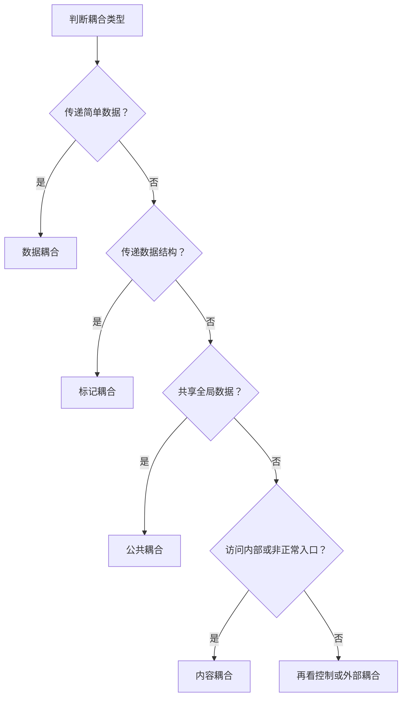
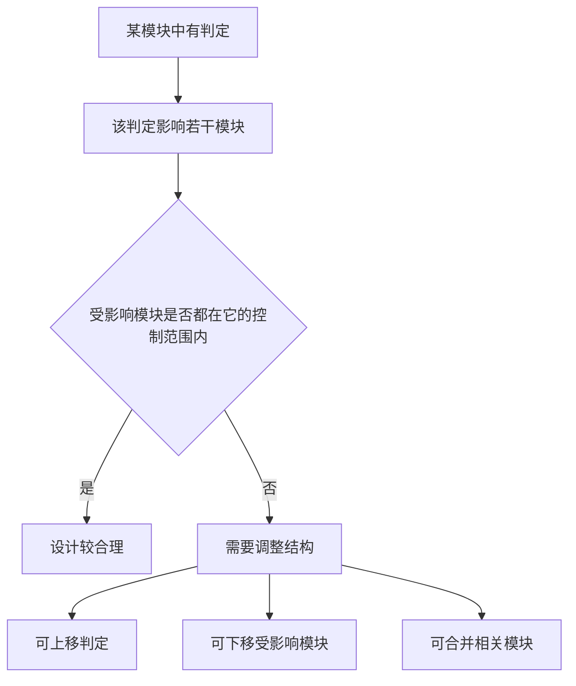

# chapter 10 - 结构化开发

**适用对象**：软件设计师新手备考  
# 一、当前整理范围

```text
结构化开发
├─ 1. 模块独立性
│  ├─ 耦合
│  │  ├─ 数据耦合
│  │  ├─ 标记耦合
│  │  ├─ 控制耦合
│  │  ├─ 外部耦合
│  │  ├─ 公共耦合
│  │  └─ 内容耦合
│  └─ 内聚
│     ├─ 巧合内聚
│     ├─ 逻辑内聚
│     ├─ 时间内聚
│     ├─ 过程内聚
│     ├─ 通信内聚
│     ├─ 顺序内聚
│     └─ 功能内聚
├─ 2. 软件设计原则
│  ├─ 高内聚低耦合
│  ├─ 模块规模适中
│  ├─ 扇入扇出合理
│  ├─ 作用范围在控制范围内
│  └─ 避免病态连接
├─ 3. 系统文档
│  ├─ 系统开发计划
│  ├─ 可行性研究报告
│  ├─ 总体规划报告
│  └─ 用户使用手册
├─ 4. 数据流图 DFD
│  ├─ 外部实体
│  ├─ 加工
│  ├─ 数据流
│  ├─ 数据存储
│  ├─ 顶层图
│  ├─ 父图与子图平衡
│  └─ 数据守恒
├─ 5. 数据字典与加工逻辑
│  ├─ 数据流
│  ├─ 数据项
│  ├─ 数据存储
│  ├─ 基本加工
│  ├─ 结构化语言
│  ├─ 判定表
│  └─ 判定树
└─ 6. 结构化分析与结构化设计杂题
   ├─ SA 结构化分析
   ├─ SD 结构化设计
   ├─ 数据流映射
   ├─ 变换流与事务流
   ├─ 结构图
   ├─ 接口设计
   ├─ 过程设计
   └─ 界面设计黄金准则
```

# 二、复习建议

| 轮次 | 目标 | 建议做法 | 关注重点 |
|---|---|---|---|
| 第 1 轮 | 建立框架 | 先记“模块独立 = 高内聚 + 低耦合”，再看 DFD 四元素 | 耦合、内聚、DFD、数据字典 |
| 第 2 轮 | 稳定做定义题 | 每类耦合和内聚各做 2 道典型题 | 数据耦合 vs 标记耦合；通信内聚 vs 顺序内聚 |
| 第 3 轮 | 处理图题和规则题 | 按“外部实体、加工、数据流、数据存储”检查 DFD | 父子图平衡、数据守恒、加工必须有输入输出 |
| 第 4 轮 | 冲刺提分 | 背口诀表，重点回看错题选项 | 作用范围/控制范围、结构化分析输出、接口设计依据 |

# 三、章节笔记

## 总记忆表

| 模块 | 记忆句 |
|---|---|
| 结构化开发总原则 | **自顶向下、逐层分解、功能分解与抽象**。 |
| 模块独立性 | **高内聚、低耦合**是模块设计的核心目标。 |
| 耦合强弱 | 数据耦合较低，标记/控制更强，公共/内容更危险。 |
| 数据耦合 | 传递简单数据值，例如金额、日期、数量。 |
| 标记耦合 | 传递整个数据结构，例如学生结构体、数据结构 X。 |
| 公共耦合 | 多个模块访问同一个全局数据区。 |
| 内容耦合 | 访问内部数据或从非正常入口进入，是最差耦合。 |
| 内聚强弱 | 巧合最低，功能最高；考试常问“逻辑、通信、顺序”。 |
| 通信内聚 | 多个处理操作同一个数据结构。 |
| 顺序内聚 | 前一处理的输出是后一处理的输入。 |
| 作用范围与控制范围 | **作用范围应该在控制范围之内**。 |
| DFD | 描述数据如何流动、加工和存储，用于**功能建模**。 |
| 顶层 DFD | 只有一个总加工，重点描述系统输入与输出。 |
| 数据字典 | 定义 DFD 中的数据流、数据项、数据存储、基本加工。 |
| 加工逻辑 | 描述输入如何变成输出，不要求写具体算法实现。 |
| 结构化分析输出 | DFD、数据字典、加工逻辑，常补充 ER 图。 |
| 结构化设计输出 | 结构图，不属于结构化分析输出。 |
| 界面黄金准则 | 用户操纵控制、减轻记忆负担、保持界面一致。 |

## 1. 耦合

### 1. 知识点

耦合是模块之间相互连接紧密程度的度量。做题时不要先想“是不是两个模块有关系”，而要看**模块之间传递了什么、共享了什么、有没有直接闯入内部**。

| 耦合类型 | 题眼 | 典型例子 | 做题落点 |
|---|---|---|---|
| 数据耦合 | 传递简单数据项 | 金额、日期、数量、平均成绩 | 简单参数，耦合较低 |
| 标记耦合 | 传递数据结构 | 学生结构体、记录、表、结构 X | 传一整个结构，不是单个字段 |
| 控制耦合 | 传递控制信号 | 参数决定模块执行哪个分支 | “控制变量”“选择功能” |
| 外部耦合 | 依赖外部环境 | 设备、通信协议、文件格式 | 通过软件外部环境联结 |
| 公共耦合 | 访问公共数据区 | 全局变量、公共数据结构 | 多个模块读写同一公共区 |
| 内容耦合 | 访问内部或非正常入口 | A 直接访问 B 内部数据；跳入 B 内部 | 最差，看到“内部、非正常入口”就选 |

### 2. 强弱顺序

```text
耦合由弱到强大致记忆：
数据耦合 < 标记耦合 < 控制耦合 < 外部耦合 < 公共耦合 < 内容耦合

考试口诀：
简单数据是数据，整个结构是标记；
公共变量是公共，内部入口是内容。
```

> 耦合强弱不取决于“模块提供的功能数”，而取决于接口复杂程度、调用方式、通过接口传递的信息类型等。

### 3. 图示理解



### 4. 例题分析

**例 1：模块 A 直接访问模块 B 的内部数据。**  
先抓题眼：“直接访问内部数据”。这已经不是正常参数传递，而是破坏了 B 的信息隐蔽，所以是**内容耦合**。

**例 2：模块 A 将学生姓名、学号、手机号等放入结构体传递给模块 B。**  
题眼是“结构体”。如果只传姓名或学号，是数据耦合；现在传整个学生信息结构体，所以是**标记耦合**。

**例 3：采购子系统给财务子系统传递采购金额、收款方、采购日期。**  
这些都是简单数据项，不是结构体，不是公共变量，所以是**数据耦合**。

### 5. 记忆技巧

```text
耦合四句：
传值叫数据，传包叫标记；
共用叫公共，闯内叫内容；
传开关叫控制，靠外设叫外部；
考试求低耦合，最怕公共和内容。
```

## 2. 内聚

### 1. 知识点

内聚是模块内部各个处理元素结合紧密程度的度量。考试的核心不是背七个定义，而是识别题干中“这些语句为什么被放在同一个模块”。

| 内聚类型 | 题眼 | 典型例子 | 强弱倾向 |
|---|---|---|---|
| 巧合内聚 | 没有任何联系，只是凑在一起 | 多个模块重复的 5 条无关语句抽出成 D | 最低 |
| 逻辑内聚 | 逻辑上相似，通过参数选择 | 输入、输出、查询等相似功能由参数决定 | 较低 |
| 时间内聚 | 同一时间执行 | 初始化、结束清理 | 较低 |
| 过程内聚 | 必须按特定次序执行 | 先检查、再处理、再输出，但数据不一定相接 | 中等 |
| 通信内聚 | 操作同一个数据结构 | 对 X 写数据、从 X 读数据 | 较好 |
| 顺序内聚 | 前一输出是后一输入 | 处理链条，数据逐步传递 | 很好 |
| 功能内聚 | 共同完成一个单一功能 | 缺一不可地完成一个明确功能 | 最高 |

### 2. 强弱顺序

```text
内聚由弱到强：
巧合 < 逻辑 < 时间 < 过程 < 通信 < 顺序 < 功能

考试口诀：
无关巧合，类似逻辑，同时叫时间；
按步过程，同数通信，前出后入顺序；
只干一事，功能最强。
```

### 3. 易混对比

| 易混项 | 区别 | 例子 | 答案方向 |
|---|---|---|---|
| 逻辑内聚 vs 过程内聚 | 逻辑内聚靠参数选择相似功能；过程内聚强调特定步骤 | “参数决定做哪个功能” | 逻辑内聚 |
| 过程内聚 vs 顺序内聚 | 过程只要求顺序；顺序要求前一输出作为后一输入 | “必须以特定次序执行” | 过程内聚 |
| 通信内聚 vs 顺序内聚 | 通信强调同一数据结构；顺序强调数据流接续 | “读写同一数据结构 X” | 通信内聚 |
| 巧合内聚 vs 逻辑内聚 | 巧合完全无关；逻辑至少功能相似 | “语句之间没有联系” | 巧合内聚 |

### 4. 例题分析

**例 1：模块执行几个逻辑上相似的功能，通过参数确定完成哪一个功能。**  
题眼是“逻辑上相似”和“通过参数确定”。这就是逻辑内聚。

**例 2：几个模块有相同的 5 个语句，语句之间没有联系，为避免重复抽出成模块 D。**  
题眼是“没有联系”。这不是复用得好，而是把无关处理硬塞到一起，因此是巧合内聚。

**例 3：模块实现对同一个数据结构区域写数据和读数据。**  
题眼是“同一个数据结构”。虽然有两个动作，但都围绕同一数据结构，因此是通信内聚。

**例 4：各处理元素密切相关于同一功能且必须顺序执行，前一处理元素的输出就是下一处理元素的输入。**  
题眼是“前一输出就是后一输入”。这比普通过程内聚更强，是顺序内聚。

### 5. 记忆技巧

```text
内聚题先看动机：
无关系，巧合；
相似靠参数，逻辑；
同一时间，时间；
只讲顺序，过程；
同一数据，通信；
前出后入，顺序；
单一目标，功能。
```

## 3. 软件设计原则

### 1. 知识点

| 原则 | 正确说法 | 常见错误选项 |
|---|---|---|
| 模块独立 | 高内聚、低耦合 | 高内聚高耦合、低内聚低耦合 |
| 模块规模 | 规模适中 | 模块越小越好 |
| 扇入扇出 | 扇入、扇出合理 | 过高扇出不加控制 |
| 信息隐蔽 | 模块内部数据不让其他模块直接访问 | 允许外部直接访问内部数据 |
| 作用范围与控制范围 | 作用范围应在控制范围之内 | 控制范围应在作用范围之内 |
| 病态连接 | 避免从中部进入模块、访问模块内部 | 通过非正常入口跳入模块 |

### 2. 作用范围与控制范围

| 概念 | 含义 | 做题理解 |
|---|---|---|
| 控制范围 | 一个模块本身及其所有直接或间接调用的下级模块 | 它能“管到”的模块范围 |
| 作用范围 | 受该模块中某个判定影响的所有模块 | 它的判断结果会“影响到”的范围 |
| 正确原则 | 作用范围应该在控制范围之内 | 不能让一个模块的判断影响到它管不到的地方 |



### 3. 例题分析

**例 1：划分软件系统模块时，应尽量做到什么？**  
题眼是“模块划分”。标准答案永远优先考虑**高内聚、低耦合**。

**例 2：模块规模越小越好是否正确？**  
错误。模块过小会增加接口数量和调用复杂度，可能导致系统结构碎片化。考试中“越小越好”属于绝对化干扰项，应改为“规模适中”。

**例 3：模块控制范围在其作用范围内是否正确？**  
错误。应是**作用范围在控制范围内**，不能反过来。

### 4. 记忆技巧

```text
设计原则三句：
高内聚，低耦合；
规模适中，扇入扇出适中；
作用在控制里，别从中间跳进去。
```

## 4. 系统文档

### 1. 知识点

| 文档 | 用途 | 常见题眼 |
|---|---|---|
| 系统开发计划 | 系统开发人员与项目管理人员沟通 | 进度、PERT 图、预算分配 |
| 可行性研究报告 | 规划/分析阶段，论证是否值得做 | 技术、经济、社会可行性 |
| 总体规划报告 | 系统规划阶段与用户沟通 | 总体目标、总体方案 |
| 用户使用手册 | 面向最终用户，通常不是规划和分析阶段交流文档 | 使用说明、操作步骤 |
| 系统设计说明书 | 设计阶段产物 | 模块结构、接口、数据库等 |
| 系统测试报告 | 测试阶段产物 | 测试结论、缺陷情况 |

### 2. 例题分析

**例：用于系统开发人员与项目管理人员沟通的主要文档是什么？**  
题眼是“开发人员与项目管理人员沟通”。项目管理关注进度、资源、预算，因此选**系统开发计划**。

### 3. 记忆技巧

```text
项目经理看计划，用户交流看规划；
使用手册给用户，不是分析阶段主文档。
```

## 5. 数据流图 DFD

### 1. 知识点

数据流图用于从数据流动角度描述系统功能。它关心的是**数据从哪里来、经过什么加工、流向哪里、存到哪里**。

| 元素 | 含义 | 图中作用 | 做题关键词 |
|---|---|---|---|
| 外部实体 | 系统外部的人、组织或系统 | 提供输入或接收输出 | 读者、患者、信用卡管理系统、考试中心 |
| 加工 | 对数据进行处理或变换 | 把输入数据流变成输出数据流 | 审核、生成试题、计算、登记 |
| 数据流 | 数据在元素之间流动 | 有方向的数据 | 报名表、成绩、订单、付款信息 |
| 数据存储 | 系统内部保存数据的地方 | 文件、表、数据库 | 患者信息库、订单库、图书文件 |

### 2. 顶层 DFD

| 层次 | 特点 | 考试落点 |
|---|---|---|
| 顶层图 | 通常只有一个加工，代表整个系统 | 描述系统输入与输出 |
| 0 层图 | 对顶层加工进行分解 | 展示主要加工与数据存储 |
| 1 层及以下 | 对某个加工继续分解 | 必须保持父图与子图平衡 |

### 3. DFD 绘图规则

| 规则 | 正确理解 | 常见错误 |
|---|---|---|
| 数据流起点或终点 | 至少一端必须是加工 | 外部实体直接连数据存储通常错误 |
| 加工输入输出 | 每个加工必须既有输入又有输出 | 只有输入没有输出，或只有输出没有输入 |
| 父图子图平衡 | 子图的输入输出必须与父图对应加工一致 | 子图凭空多出或少掉外部数据流 |
| 数据守恒 | 输出数据应能由输入数据产生 | 无输入产生输出，或输出与输入无关 |
| 命名 | 数据流、加工、数据存储、外部实体都应命名 | 出现未命名元素 |
| 不表示控制流 | DFD 主要表示数据流，不画控制流 | 把程序流程控制画进 DFD |

### 4. 外部实体判断模板

```text
外部实体判断：
系统边界之外，给系统数据或接收系统数据。

人可以是外部实体：考生、读者、患者、阅卷老师。
外部系统也可以是外部实体：信用卡管理系统。
系统内部产生或保存的数据不是外部实体：试题、借书证、患者信息表。
```

### 5. DFD 与 ERD 对比

| 场景 | DFD 中 | ERD 中 |
|---|---|---|
| 患者使用预约系统 | 外部实体 | 实体 |
| 读者使用图书馆系统 | 外部实体 | 实体 |
| 信用卡管理系统提供付款接口 | 外部实体 | 一般不作为本系统内部实体 |
| 试题 | 数据或数据存储内容 | 可作为实体，但在 DFD 中不是外部实体 |

### 6. 例题分析

**例 1：医院预约系统中，患者可以查看专家介绍并预约。用 DFD 建模时患者是什么？用 ERD 建模时患者是什么？**  
先抓题眼：DFD 是功能建模，患者在系统外部与系统交互，所以是外部实体；ERD 是数据建模，患者信息要被记录，所以是实体。

**例 2：机票预订系统中，付款通过信用卡公司的信用卡管理系统接口实现。信用卡管理系统在 DFD 中是什么？**  
题眼是“外部系统提供接口”。它不是本系统内部加工，而是系统边界之外的系统，所以是外部实体。

### 7. 记忆技巧

```text
DFD四件套：外部、加工、数据流、数据存储；
顶层看输入输出，分层看父子平衡；
加工有进有出，数据不能凭空生。
```

## 6. 数据字典与加工逻辑

### 1. 知识点

数据字典用于解释 DFD 中出现的元素，是结构化分析的重要输出。

| 数据字典条目 | 说明 | 考试注意 |
|---|---|---|
| 数据流 | 对 DFD 中数据流的组成进行说明 | 是数据字典条目 |
| 数据项 | 最小数据单位 | 是数据字典条目 |
| 数据存储 | 文件、表、数据集合 | 是数据字典条目 |
| 基本加工 | 最底层加工说明 | 是数据字典条目 |
| 外部实体 | 系统边界外对象 | 常被作为“不包括”选项 |

> 有些教材会把外部实体也作为补充说明对象，但软件设计师考试中，本章真题明确把“外部实体”作为“数据字典条目不包括”的答案方向处理。做题按真题口径记忆。

### 2. 加工逻辑

加工逻辑也称“小说明”，用于描述基本加工把输入数据流变换为输出数据流的规则。

| 表示方法 | 适用场景 | 例子 |
|---|---|---|
| 结构化语言 | 规则较简单，有顺序、选择、循环 | IF 条件 THEN 动作 |
| 判定表 | 条件组合复杂，动作组合明确 | 多条件、多动作对应关系 |
| 判定树 | 条件判断层次清晰 | 按条件逐层分支 |

### 3. 加工规格说明的边界

| 正确内容 | 不应包含 |
|---|---|
| 输入数据流如何变换为输出数据流 | 具体程序实现流程 |
| 加工规则 | 具体数据结构和算法实现 |
| 条件与动作关系 | 代码级细节 |

### 4. 例题分析

**例 1：数据流图中的元素在哪里定义？**  
题眼是“DFD 元素定义”。定义数据流、数据项、数据存储、基本加工的是数据字典。

**例 2：加工逻辑必须实现加工的数据结构和算法吗？**  
错误。加工逻辑描述“加工规则”，不是详细设计阶段的代码实现。数据结构和算法属于过程设计更关心的内容。

### 5. 记忆技巧

```text
数据字典管定义，加工逻辑管规则；
规则不是代码，说明不是算法。
```

## 7. 结构化分析与结构化设计

### 1. 结构化分析 SA

| 内容 | 说明 | 考试落点 |
|---|---|---|
| 指导思想 | 自顶向下，逐层分解 | DFD 建模原则 |
| 基本原则 | 功能分解与抽象 | 不直接进入程序结构 |
| 功能模型 | 数据流图 DFD | 最核心 |
| 数据模型 | E-R 图 | 补充数据建模 |
| 数据说明 | 数据字典 | 定义 DFD 中元素 |
| 加工说明 | 加工逻辑 | 结构化语言、判定表、判定树 |

### 2. 结构化设计 SD

| 设计内容 | 主要任务 | 常见题眼 |
|---|---|---|
| 体系结构设计 | 定义软件主要结构元素及其关系 | 模块结构、软件体系结构 |
| 数据设计 | 设计文件系统结构、数据库表结构 | 基于 E-R 图 |
| 接口设计 | 描述软件与外部环境、模块之间调用关系 | 依据 DFD，描述交互关系 |
| 过程设计 | 确定模块内部算法和数据结构 | 算法、内部数据结构 |

### 3. 结构图

结构图用于描述软件系统的模块以及模块之间的调用关系。

| 基本成分 | 是否属于结构图成分 | 说明 |
|---|---|---|
| 模块 | 是 | 表示一个功能模块 |
| 调用 | 是 | 模块之间的调用关系 |
| 数据 | 是 | 模块间传递的数据 |
| 控制 | 本章真题按“不包括”处理 | 题目问“基本成分不包括”时选控制 |

### 4. 变换流与事务流

| 类型 | 特征 | 映射方向 |
|---|---|---|
| 变换流 | 输入流进入系统，经过中心变换后输出 | 常形成输入、变换、输出三部分模块 |
| 事务流 | 根据事务类型选择不同处理路径 | 常围绕事务中心进行分派 |

> 不同类型数据流有不同映射方法，一个系统不一定只有一种数据流类型。

### 5. 界面设计黄金准则

| 黄金准则 | 含义 |
|---|---|
| 用户操纵控制 | 让用户感觉自己能控制系统 |
| 减轻用户记忆负担 | 尽量通过提示、菜单、默认值降低记忆压力 |
| 保持界面一致 | 操作风格、布局、反馈保持一致 |

“界面美观整洁”当然重要，但不属于 Theo Mandel 三条黄金准则的标准表述。

# 四、按专题插入原题与解析

## 专题一：耦合

### 题 1
**原题**  
模块A直接访问模块B的内部数据，则模块A和模块B的耦合类型为（16）。（2011年上半年）

- A. 数据耦合
- B. 标记耦合
- C. 公共耦合
- D. 内容耦合

**解析**  
先抓题眼：“直接访问内部数据”。这是破坏信息隐蔽的典型情况，属于内容耦合。数据耦合是传简单数据；标记耦合是传数据结构；公共耦合是共享公共数据区。

**正确答案**  
D

**答案方向**  
看到“直接访问内部数据、非正常入口进入模块内部”，选内容耦合。

### 题 2
**原题**  
模块A和模块B都访问相同的全局变量和数据结构，则这两个模块之间的耦合类型为（29）耦合。（2016年上半年）

- A. 公共
- B. 控制
- C. 标记
- D. 数据

**解析**  
先抓题眼：“相同的全局变量和数据结构”。多个模块通过公共数据环境相互作用，即公共耦合。

**正确答案**  
A

**答案方向**  
看到“全局变量、公共数据区、公共数据结构”，优先选公共耦合。

### 题 3
**原题**  
模块A将学生信息，即学生姓名、学号、手机号等放到一个结构体中，传递给模块B。模块A和B之间的耦合类型为（34）耦合。（2017年下半年）

- A. 数据
- B. 标记
- C. 控制
- D. 内容

**解析**  
题眼是“结构体”。传递简单数据项是数据耦合，传递整个数据结构是标记耦合。

**正确答案**  
B

**答案方向**  
看到“结构体、记录、数据结构 X”，选标记耦合。

### 题 4
**原题**  
耦合是模块之间的相对独立性（互相连接的紧密程度）的度量。耦合程度不取决于（33）。（2018年上半年）

- A. 调用模块的方式
- B. 各个模块之间接口的复杂程度
- C. 通过接口的信息类型
- D. 模块提供的功能数

**解析**  
耦合衡量模块之间的连接紧密程度，取决于接口复杂程度、调用方式、接口传递的信息类型。模块自身提供多少功能更接近内聚或职责划分问题，不是耦合程度的直接依据。

**正确答案**  
D

**答案方向**  
问“耦合不取决于什么”，排除调用方式、接口复杂度、传递信息类型，选模块功能数。

### 题 5
**原题**  
采购子系统根据材料价格、数量等信息计算采购金额，并给财务子系统传递采购金额、收款方和采购日期等信息，则这两个子系统之间的耦合类型为（33）耦合。（2018年下半年）

- A. 数据
- B. 标记
- C. 控制
- D. 外部

**解析**  
传递的是采购金额、收款方、采购日期等简单数据项，不是结构体，也不是控制变量，因此为数据耦合。

**正确答案**  
A

**答案方向**  
传递简单字段，选数据耦合。

### 题 6
**原题**  
已知模块A给模块B传递数据结构X，则这两个模块的耦合类型为（32）。（2019年上半年）

- A. 数据耦合
- B. 公共耦合
- C. 外部耦合
- D. 标记耦合

**解析**  
题眼是“传递数据结构 X”。数据结构作为参数传递，属于标记耦合。

**正确答案**  
D

**答案方向**  
传数据结构，不选数据耦合，选标记耦合。

### 题 7
**原题**  
模块A通过非正常入口转入模块B内部，则这两个模块之间是（31）耦合。（2021年上半年）

- A. 数据
- B. 公共
- C. 外部
- D. 内容

**解析**  
题眼是“非正常入口转入模块内部”。这与直接访问内部数据一样，都是内容耦合。

**正确答案**  
D

**答案方向**  
看到“非正常入口”，直接选内容耦合。

## 专题二：内聚

### 题 8
**原题**  
模块A执行几个逻辑上相似的功能，通过参数确定该模块完成哪一个功能，则该模块具有（16）内聚。（2012年上半年）

- A. 顺序
- B. 过程
- C. 逻辑
- D. 功能

**解析**  
题眼是“逻辑上相似”和“通过参数确定”。这是逻辑内聚的典型描述。

**正确答案**  
C

**答案方向**  
相似功能 + 参数选择 = 逻辑内聚。

### 题 9
**原题**  
模块A、B和C都包含相同的5个语句，这些语句之间没有联系。为了避免重复，把这5个语句抽取出来组成一个模块D，则模块D的内聚类型为（16）内聚。（2014年下半年）

- A. 功能
- B. 通信
- C. 逻辑
- D. 巧合

**解析**  
题眼是“这些语句之间没有联系”。无关语句放在同一模块中，是最低级的巧合内聚。

**正确答案**  
D

**答案方向**  
没有任何联系 = 巧合内聚。

### 题 10
**原题**  
某模块实现两个功能：向某个数据结构区域写数据和从该区域读数据。该模块的内聚类型为（32）内聚。（2015年上半年）

- A. 过程
- B. 时间
- C. 逻辑
- D. 通信

**解析**  
虽然模块中有读和写两个处理，但它们都围绕同一个数据结构区域进行操作，因此是通信内聚。

**正确答案**  
D

**答案方向**  
同一数据结构上操作 = 通信内聚。

### 题 11
**原题**  
某模块中有两个处理A和B，分别对数据结构X写数据和读数据，则该模块的内聚类型为（36）内聚。（2016年下半年）

- A. 逻辑
- B. 过程
- C. 通信
- D. 内容

**解析**  
题干再次强调“对数据结构 X 写数据和读数据”。所有处理都围绕同一数据结构，属于通信内聚。

**正确答案**  
C

**答案方向**  
读写同一个数据结构，选通信内聚。

### 题 12
**原题**  
模块A、B和C有相同的程序块，块内的语句之间没有任何联系，现把该程序块取出来，形成新的模块D，则模块D的内聚类型为（33）内聚。以下关于该内聚类型的叙述中，不正确的是（34）。（2017年上半年）

（33）
- A. 巧合
- B. 逻辑
- C. 时间
- D. 过程

（34）
- A. 具有最低的内聚性
- B. 不易修改和维护
- C. 不易理解
- D. 不影响模块间的耦合关系

**解析**  
先抓题眼：“没有任何联系”，所以是巧合内聚。巧合内聚最低、不易理解、不易维护。题目问“不正确”，D 的表述容易误导，因为这种低内聚设计往往会导致模块职责混乱，并可能间接增加模块间依赖。

**正确答案**  
（33）A；（34）D

**答案方向**  
无关语句抽模块 = 巧合；巧合内聚是最低内聚，维护性差。

### 题 13
**原题**  
某模块内涉及多个功能，这些功能必须以特定的次序执行，则该模块的内聚类型为（35）内聚。（2017年下半年）

- A. 时间
- B. 过程
- C. 信息
- D. 功能

**解析**  
题眼是“必须以特定的次序执行”。只强调执行顺序，未说明前一输出作为后一输入，因此是过程内聚。

**正确答案**  
B

**答案方向**  
只说顺序执行 = 过程内聚；说前一输出给后一输入 = 顺序内聚。

### 题 14
**原题**  
某模块中各个处理元素都密切相关于同一功能且必须顺序执行，前一处理元素的输出就是下一处理元素的输入，则该模块的内聚类型为（16）内聚。（2019年下半年）

- A. 过程
- B. 时间
- C. 顺序
- D. 逻辑

**解析**  
题眼是“前一处理元素的输出就是下一处理元素的输入”。这是顺序内聚，比普通过程内聚更强。

**正确答案**  
C

**答案方向**  
前出后入 = 顺序内聚。

### 题 15
**原题**  
若某模块内所有处理元素都在同一个数据结构上操作，则该模块的内聚类型为（31）。（2020年下半年）

- A. 逻辑
- B. 过程
- C. 通信
- D. 功能

**解析**  
题眼是“同一个数据结构”。这是通信内聚。

**正确答案**  
C

**答案方向**  
同一数据结构 = 通信内聚。

## 专题三：软件设计原则

### 题 16
**原题**  
软件设计时需要遵循抽象、模块化、信息隐蔽和模块独立原则。在划分软件系统模块时，应尽量做到（30）。（2010年上半年）

- A. 高内聚高耦合
- B. 高内聚低耦合
- C. 低内聚高耦合
- D. 低内聚低耦合

**解析**  
模块划分的核心原则是高内聚、低耦合。高内聚表示模块内部围绕单一目标，低耦合表示模块之间依赖少。

**正确答案**  
B

**答案方向**  
模块设计一看到“应尽量做到”，优先找高内聚低耦合。

### 题 17
**原题**  
在软件设计阶段，划分模块的原则是：一个模块的（18）。（2012年下半年）

- A. 作用范围应该在其控制范围之内
- B. 控制范围应该在其作用范围之内
- C. 作用范围与控制范围互不包含
- D. 作用范围与控制范围不受任何限制

**解析**  
模块中的判定所影响的范围，应该被该模块能控制的范围包含。否则会出现“判断在这里，影响却跑到管不到的地方”的问题。

**正确答案**  
A

**答案方向**  
固定记忆：作用范围在控制范围之内。

### 题 18
**原题**  
在设计软件的模块结构时，（31）不能改进设计质量。（2016年上半年）

- A. 模块的作用范围应在其控制范围之内
- B. 模块的大小适中
- C. 避免或减少使用病态连接（从中部进入或访问一个模块）
- D. 模块的功能越单纯越好

**解析**  
A、B、C 都是明确的启发式设计原则。D 使用“越……越好”的绝对化表达，容易导致过度分解。模块功能应明确、单一，但不能机械地理解为无限拆小。

**正确答案**  
D

**答案方向**  
考试中“越小越好、越单纯越好”常是绝对化干扰项，规范说法是“规模适中、功能明确”。

### 题 19
**原题**  
在设计软件的模块结构时，（32）不能改进设计质量。（2017年上半年）

- A. 尽量减少高扇出结构
- B. 模块的大小适中
- C. 将具有相似功能的模块合并
- D. 完善模块的功能

**解析**  
减少高扇出、模块大小适中、完善模块功能都有助于改进结构质量。将相似功能简单合并，容易形成逻辑内聚模块，使模块职责混杂，不一定改进设计质量。

**正确答案**  
C

**答案方向**  
“相似功能合并”小心，它可能制造逻辑内聚。

### 题 20
**原题**  
以下关于模块化设计的叙述中，不正确的是（32）。（2018年下半年）

- A. 尽量考虑高内聚、低耦合，保持模块的相对独立性
- B. 模块的控制范围在其作用范围内
- C. 模块的规模适中
- D. 模块的宽度、深度、扇入和扇出适中

**解析**  
B 把关系说反了。正确说法是“模块的作用范围应该在其控制范围之内”。

**正确答案**  
B

**答案方向**  
看到控制范围和作用范围，检查是否写成“作用在控制内”。

### 题 21
**原题**  
以下关于软件设计原则的叙述中，不正确的是（15）。（2019年下半年）

- A. 系统需要划分多个模块，模块的规模越小越好
- B. 考虑信息隐藏，模块内部的数据不能让其他模块直接访问
- C. 模块独立性要好，尽可能高内聚和低耦合
- D. 采用过程抽象和数据抽象设计

**解析**  
模块规模应适中，不是越小越好。过小会带来过多接口和调用关系，反而降低可理解性。

**正确答案**  
A

**答案方向**  
模块规模：适中，不是越小越好。

### 题 22
**原题**  
良好的启发式设计原则上不包括（16）。（2020年下半年）

- A. 提高模块独立性
- B. 模块规模越小越好
- C. 模块作用域在其控制域之内
- D. 降低模块接口复杂性

**解析**  
提高模块独立性、作用范围在控制范围内、降低接口复杂性都是良好设计原则。模块规模仍然是适中，不是越小越好。

**正确答案**  
B

**答案方向**  
“越小越好”是结构化设计题中的高频错误说法。

### 题 23
**原题**  
在软件设计阶段进行模块划分时，一个模块的（16）。（2021年上半年）

- A. 控制范围应该在其作用范围之内
- B. 作用范围应该在其控制范围之内
- C. 作用范围与控制范围互不包含
- D. 作用范围与控制范围不受任何限制

**解析**  
固定原则：作用范围应该在控制范围之内。

**正确答案**  
B

**答案方向**  
作用范围在控制范围内。

### 题 24
**原题**  
以下关于软件设计原则的叙述中，不正确的是（16）。（2021年下半年）

- A. 将系统划分为相对独立的模块
- B. 模块之间的耦合尽可能小
- C. 模块规模越小越好
- D. 模块的扇入系数和扇出系数合理

**解析**  
模块规模应适中，C 的“越小越好”错误。其他选项都符合模块化设计原则。

**正确答案**  
C

**答案方向**  
模块越小越好是错误，规模适中才是正确。

## 专题四：系统文档

### 题 25
**原题**  
在开发信息系统时，用于系统开发人员与项目管理人员沟通的主要文档是（33）。（2009年上半年）

- A. 系统开发合同
- B. 系统设计说明书
- C. 系统开发计划
- D. 系统测试报告

**解析**  
项目管理人员关心的是项目期内进度、资源、任务安排和预算等，因此沟通文档是系统开发计划。

**正确答案**  
C

**答案方向**  
开发人员与项目管理人员沟通，选系统开发计划。

### 题 26
**原题**  
系统开发计划用于系统开发人员与项目管理人员在项目期内进行沟通，它包括（33）和预算分配表等。（2009年下半年）

- A. PERT图
- B. 总体规划
- C. 测试计划
- D. 开发合同

**解析**  
系统开发计划包含进度安排，PERT 图常用于项目计划和进度管理。

**正确答案**  
A

**答案方向**  
系统开发计划 + 项目期沟通 + 进度 = PERT 图。

### 题 27
**原题**  
信息系统的文档是开发人员与用户交流的工具。在系统规划和系统分析阶段，用户与系统分析人员交流所使用的文档不包括（33）。（2021年下半年）

- A. 可行性研究报告
- B. 总体规划报告
- C. 项目开发计划
- D. 用户使用手册

**解析**  
系统规划和系统分析阶段会涉及可行性研究、总体规划、项目开发计划。用户使用手册通常在系统实现、交付和使用阶段面向最终用户，不属于该阶段交流文档。

**正确答案**  
D

**答案方向**  
规划分析阶段不选用户使用手册。

## 专题五：数据流图 DFD

### 题 28
**原题**  
数据流图（DFD）对系统的功能和功能之间的数据流进行建模，其中顶层数据流图描述了系统的（15）。（2012年上半年）

- A. 处理过程
- B. 输入与输出
- C. 数据存储
- D. 数据实体

**解析**  
顶层 DFD 通常把整个系统看作一个加工，重点描述系统与外部实体之间的输入和输出关系。

**正确答案**  
B

**答案方向**  
顶层 DFD = 系统输入与输出。

### 题 29
**原题**  
以下关于数据流图的叙述中，不正确的是（15）。（2012年下半年）

- A. 每条数据流的起点或终点必须是加工
- B. 必须保持父图与子图平衡
- C. 每个加工必须有输入数据流，但可以没有输出数据流
- D. 应保持数据守恒

**解析**  
每个加工必须有输入，也必须有输出。只有输入没有输出称为“黑洞”；只有输出没有输入称为“奇迹”。C 错误。

**正确答案**  
C

**答案方向**  
加工必须有进有出。

### 题 30
**原题**  
在如下所示的数据流图中，共存在（29）个错误。（2013年上半年）

- A. 4
- B. 6
- C. 8
- D. 9

**解析**  
此类题按 DFD 错误检查表逐项查：数据流是否有一端为加工、加工是否有输入输出、数据存储是否直接连接外部实体、是否存在未命名数据流、父子图是否平衡、是否存在数据不守恒。该题图中错误合计为 8 个。

**正确答案**  
C

**答案方向**  
DFD 查错题不要凭感觉数线，按规则逐项排查。

### 题 31
**原题**  
在结构化分析中，用数据流图描述（17）。当采用数据流图对一个图书馆管理系统进行分析时，（18）是一个外部实体。（2016年上半年）

（17）
- A. 数据对象之间的关系，用于对数据建模
- B. 数据在系统中如何被传送或变换，以及如何对数据流进行变换的功能或子功能，用于对功能建模
- C. 系统对外部事件如何响应，如何动作，用于对行为建模
- D. 数据流图中的各个组成部分

（18）
- A. 读者
- B. 图书
- C. 借书证
- D. 借阅

**解析**  
DFD 描述数据如何传送、变换，用于功能建模。图书馆系统中，读者位于系统外部，与系统发生交互，因此是外部实体。图书、借书证、借阅更像系统内部数据或业务对象。

**正确答案**  
（17）B；（18）A

**答案方向**  
DFD = 功能建模；系统外的人或外部系统 = 外部实体。

### 题 32
**原题**  
某医院预约系统的部分需求为：患者可以查看医院发布的专家特长介绍及其就诊时间；系统记录患者信息，患者预约特定时间就诊。用DFD对其进行功能建模时，患者是（15）；用ERD对其进行数据建模时，患者是（16）。（2017年下半年）

（15）
- A. 外部实体
- B. 加工
- C. 数据流
- D. 数据存储

（16）
- A. 实体
- B. 属性
- C. 联系
- D. 弱实体

**解析**  
DFD 从系统功能边界看患者，患者在系统外部与系统交互，是外部实体。ERD 从数据建模看患者，患者信息被记录，是实体。

**正确答案**  
（15）A；（16）A

**答案方向**  
同一个“患者”，在 DFD 中是外部实体，在 ERD 中是实体。

### 题 33
**原题**  
某航空公司拟开发一个机票预订系统，旅客预订机票时使用信用卡付款。付款通过信用卡公司的信用卡管理系统提供的接口实现。若采用数据流图建立需求模型，则信用卡管理系统是（16）。（2018年下半年）

- A. 外部实体
- B. 加工
- C. 数据流
- D. 数据存储

**解析**  
信用卡管理系统是本系统之外的系统，通过接口与本系统交换数据，所以在 DFD 中是外部实体。

**正确答案**  
A

**答案方向**  
外部系统提供接口 = 外部实体。

### 题 34
**原题**  
某考试系统的部分功能描述如下：审核考生报名表，通过审核的考生登录系统，系统自动为其生成一套试题；考试中心提供标准答案；阅卷老师阅卷，提交考生成绩；考生查看自己的成绩。若用数据流图对该系统进行建模，则（14）不是外部实体。（2019年下半年）

- A. 考生
- B. 考试中心
- C. 阅卷老师
- D. 试题

**解析**  
考生、考试中心、阅卷老师都在系统外部与系统交换数据。试题是系统生成或使用的数据，不是外部实体。

**正确答案**  
D

**答案方向**  
外部实体是系统外的人、组织或系统；试题是数据。

## 专题六：数据字典与加工逻辑

### 题 35
**原题**  
以下关于数据流图中基本加工的叙述，不正确的是（15）。（2013年下半年）

- A. 对每一个基本加工，必须有一个加工规格说明
- B. 加工规格说明必须描述把输入数据流变换为输出数据流的加工规则
- C. 加工规格说明必须描述实现加工的具体流程
- D. 决策表可以用来表示加工规格说明

**解析**  
加工规格说明描述加工规则，不要求描述程序实现流程。具体流程和算法属于设计/实现层面的内容。

**正确答案**  
C

**答案方向**  
加工规格说明写规则，不写具体实现流程。

### 题 36
**原题**  
数据字典是结构化分析的一个重要输出。数据字典的条目不包括（15）。（2018年上半年）

- A. 外部实体
- B. 数据流
- C. 数据项
- D. 基本加工

**解析**  
本章真题口径中，数据字典条目包括数据流、数据项、数据存储和基本加工，不包括外部实体。

**正确答案**  
A

**答案方向**  
数据字典条目不包括外部实体。

### 题 37
**原题**  
结构化分析方法中，数据流图中的元素在（15）中进行定义。（2020年下半年）

- A. 加工逻辑
- B. 实体联系图
- C. 流程图
- D. 数据字典

**解析**  
DFD 中的数据流、数据存储、加工等元素需要在数据字典中解释和定义。

**正确答案**  
D

**答案方向**  
定义 DFD 元素 = 数据字典。

### 题 38
**原题**  
下列关于结构化分析方法的数据字典加工逻辑的叙述中，不正确的是（15）。（2021年上半年）

- A. 对每一个基本加工，应该有一个加工逻辑
- B. 加工逻辑描述输入数据流变换为输出数据的加工规则
- C. 加工逻辑必须实现加工的数据结构和算法
- D. 结构化语言，判定树和判定表可以用来表示加工逻辑

**解析**  
加工逻辑描述加工规则，不负责实现数据结构和算法。C 把分析阶段的说明误解为详细设计或编码。

**正确答案**  
C

**答案方向**  
加工逻辑不是代码，不要求实现算法。

## 专题七：结构化开发杂题

### 题 39
**原题**  
在采用结构化方法进行系统分析时，根据分解与抽象的原则，按照系统中数据处理的流程，用（15）来建立系统的逻辑模型，从而完成分析工作。（2009年下半年）

- A. E-R图
- B. 数据流图
- C. 程序流程图
- D. 软件体系结构

**解析**  
结构化分析以数据流图为核心建立系统逻辑模型。E-R 图用于数据建模，程序流程图更偏过程设计或编码层面。

**正确答案**  
B

**答案方向**  
结构化分析逻辑模型 = 数据流图。

### 题 40
**原题**  
利用结构化分析模型进行接口设计时，应以（16）为依据。（2011年下半年）

- A. 数据流图
- B. 实体—关系图
- C. 数据字典
- D. 状态—迁移图

**解析**  
接口设计需要关注系统与外部环境之间、模块之间的数据交互关系，结构化分析模型中最直接的依据是数据流图。

**正确答案**  
A

**答案方向**  
接口设计依据 DFD。

### 题 41
**原题**  
在划分模块时，一个模块的作用范围应该在其控制范围之内。若发现其作用范围不在其控制范围内，则（16）不是适当的处理方法。（2013年下半年）

- A. 将判定所在模块合并到父模块中，使判定处于较高层次
- B. 将受判定影响的模块下移到控制范围内
- C. 将判定上移到层次较高的位置
- D. 将父模块下移，使该判定处于较高层次

**解析**  
若作用范围超出控制范围，常见处理是上移判定、下移受影响模块，或合并相关模块使判定处于更合适层次。D 的“将父模块下移”不是合理的结构调整方式。

**正确答案**  
D

**答案方向**  
调整目标是让判定影响范围落入控制范围，不是随意下移父模块。

### 题 42
**原题**  
以下关于结构化开发方法的叙述中，不正确的是（15）。（2014年上半年）

- A. 将数据流映射为软件系统的模块结构
- B. 一般情况下，数据流类型包括变换流型和事务流型
- C. 不同类型的数据流有不同的映射方法
- D. 一个软件系统只有一种数据流类型

**解析**  
结构化设计可将数据流映射为模块结构，常见数据流类型包括变换流和事务流，不同流型映射方法不同。但一个系统不一定只有一种数据流类型。

**正确答案**  
D

**答案方向**  
“只有一种”是绝对化错误。

### 题 43
**原题**  
模块A提供某个班级某门课程的成绩给模块B，模块B计算平均成绩、最高分和最低分，将计算结果返回给模块A，则模块B在软件结构图中属于（16）模块。（2014年上半年）

- A. 传入
- B. 传出
- C. 变换
- D. 协调

**解析**  
模块B接收成绩数据并计算平均、最高、最低，再输出结果。它完成数据处理和转换，是变换模块。

**正确答案**  
C

**答案方向**  
输入数据，处理后输出结果 = 变换模块。

### 题 44
**原题**  
以下关于结构化开发方法的叙述中，不正确的是（15）。（2014年下半年）

- A. 总的指导思想是自顶向下，逐层分解
- B. 基本原则是功能的分解与抽象
- C. 与面向对象开发方法相比，更适合于大规模、特别复杂的项目
- D. 特别适合于数据处理领域的项目

**解析**  
结构化方法适合数据处理领域，强调自顶向下、逐层分解。但对于大规模、特别复杂且需求变化较多的系统，面向对象方法通常更具优势。

**正确答案**  
C

**答案方向**  
结构化方法不是“大规模特别复杂项目”的优先答案。

### 题 45
**原题**  
在进行子系统结构设计时，需要确定划分后的子系统模块结构，并画出模块结构图。该过程不需要考虑（32）。（2015年下半年）

- A. 每个子系统如何划分成多个模块
- B. 每个子系统采用何种数据结构和核心算法
- C. 如何确定子系统之间、模块之间传送的数据及其调用关系
- D. 如何评价并改进模块结构的质量

**解析**  
子系统结构设计关注模块划分、模块关系、调用关系、数据传递和结构质量。模块内部采用何种数据结构和核心算法属于过程设计或详细设计内容。

**正确答案**  
B

**答案方向**  
结构设计看模块结构；算法和内部数据结构看过程设计。

### 题 46
**原题**  
数据流图中某个加工的一组动作依赖于多个逻辑条件的取值，则用（33）能够清楚地表示复杂的条件组合与应做的动作之间的对应关系。（2015年下半年）

- A. 流程图
- B. NS盒图
- C. 形式语言
- D. 决策树

**解析**  
复杂条件组合与动作对应关系，优先想到判定表或判定树。此题选项中给出决策树，能够表示多条件分支与动作之间的对应关系。

**正确答案**  
D

**答案方向**  
多条件组合题，优先判定表；选项没有判定表时选判定树。

### 题 47
**原题**  
软件开发过程中，需求分析阶段的输出不包括（19）。（2016年上半年）

- A. 数据流图
- B. 实体联系图
- C. 数据字典
- D. 软件体系结构图

**解析**  
需求分析阶段输出包括 DFD、ER 图、数据字典等分析模型。软件体系结构图属于设计阶段输出。

**正确答案**  
D

**答案方向**  
结构图/体系结构图属于设计，不属于需求分析输出。

### 题 48
**原题**  
结构化开发方法中，（15）主要包含对数据结构和算法的设计。（2016年下半年）

- A. 体系结构设计
- B. 数据设计
- C. 接口设计
- D. 过程设计

**解析**  
过程设计也称详细过程设计，主要确定模块内部算法和内部数据结构。

**正确答案**  
D

**答案方向**  
数据结构和算法 = 过程设计。

### 题 49
**原题**  
在采用结构化开发方法进行软件开发时，设计阶段接口设计主要依据需求分析阶段的（15）。接口设计的任务主要是（16）。（2017年上半年）

（15）
- A. 数据流图
- B. E-R图
- C. 状态-迁移图
- D. 加工规格说明

（16）
- A. 定义软件的主要结构元素及其之间的关系
- B. 确定软件涉及的文件系统的结构及数据库的表结构
- C. 描述软件与外部环境之间的交互关系，软件内模块之间的调用关系
- D. 确定软件各个模块内部的算法和数据结构

**解析**  
接口设计依据 DFD，因为 DFD 体现系统与外部实体、加工之间的数据交换。接口设计任务是描述软件与外部环境之间、软件内部模块之间的交互和调用关系。

**正确答案**  
（15）A；（16）C

**答案方向**  
接口设计：依据 DFD，描述交互关系与调用关系。

### 题 50
**原题**  
某商店业务处理系统中，基本加工“检查订货单”的描述为：若订货单金额大于5000元，且欠款时间超过60天，则不予批准；若订货单金额大于5000元，且欠款时间不超过60天，则发出批准书和发货单；若订货单金额小于或等于5000元，则发出批准书和发货单，若欠款时间超过60天，则还要发催款通知书。现采用决策表表示该基本加工，则条件取值的组合数最少是（16）。（2018年上半年）

- A. 2
- B. 3
- C. 4
- D. 5

**解析**  
有两个二值条件：金额是否大于 5000；欠款时间是否超过 60 天。两条件组合共有 $2 \times 2 = 4$ 种，且不同组合下动作不完全相同，因此最少需要 4 种条件取值组合。

**正确答案**  
C

**答案方向**  
两个二值条件通常先算 4 种组合，再看能否合并。

### 题 51
**原题**  
结构化分析的输出不包括（15）。（2018年下半年）

- A. 数据流图
- B. 数据字典
- C. 加工逻辑
- D. 结构图

**解析**  
结构化分析输出包括数据流图、数据字典、加工逻辑。结构图是结构化设计阶段的输出。

**正确答案**  
D

**答案方向**  
分析阶段没有结构图，设计阶段才有。

### 题 52
**原题**  
数据流图建模应遵循（15）的原则。（2019年上半年）

- A. 自顶向下、从具体到抽象
- B. 自顶向下、从抽象到具体
- C. 自底向上、从具体到抽象
- D. 自底向上、从抽象到具体

**解析**  
DFD 建模按顶层图、0 层图、1 层图逐步细化，体现自顶向下、从抽象到具体。

**正确答案**  
B

**答案方向**  
DFD 分层建模 = 自顶向下、从抽象到具体。

### 题 53
**原题**  
结构化设计方法中使用结构图来描述构成软件系统的模块以及这些模块之间的调用关系。结构图的基本成分不包括（16）。（2019年上半年）

- A. 模块
- B. 调用
- C. 数据
- D. 控制

**解析**  
本章教材口径中，结构图基本成分包括模块、调用和数据。题目问“不包括”，应选控制。

**正确答案**  
D

**答案方向**  
结构图基本成分按“模块、调用、数据”记。

### 题 54
**原题**  
Theo Mandel在其关于界面设计所提出的三条“黄金准则”中，不包括（33）。（2019年上半年）

- A. 用户操纵控制
- B. 界面美观整洁
- C. 减轻用户的记忆负担
- D. 保持界面一致

**解析**  
三条黄金准则是用户操纵控制、减轻用户记忆负担、保持界面一致。界面美观整洁虽然重要，但不是这三条的标准表述。

**正确答案**  
B

**答案方向**  
界面黄金准则不包括“界面美观整洁”。

### 题 55
**原题**  
绘制分层数据流图（DFD）时需要注意的问题中，不包括（15）。（2021年下半年）

- A. 给图中的每个数据流、加工、数据存储和外部实体命名
- B. 图中要表示出控制流
- C. 一个加工不适合有过多的数据流
- D. 分解尽可能均匀

**解析**  
DFD 表示数据流，不表示程序控制流。A、C、D 都是绘制 DFD 时需要注意的问题。

**正确答案**  
B

**答案方向**  
DFD 画数据流，不画控制流。

# 五、本章总结

## 先抓最稳的分

结构化开发最稳的分集中在定义型题：耦合、内聚、设计原则、DFD 元素、数据字典。复习时先背下面这些固定落点：

| 题眼 | 答案 |
|---|---|
| 简单数据参数 | 数据耦合 |
| 数据结构、结构体 | 标记耦合 |
| 全局变量、公共数据区 | 公共耦合 |
| 内部数据、非正常入口 | 内容耦合 |
| 无关语句放一起 | 巧合内聚 |
| 相似功能靠参数选择 | 逻辑内聚 |
| 同一数据结构上操作 | 通信内聚 |
| 前一输出是后一输入 | 顺序内聚 |
| 模块划分原则 | 高内聚、低耦合 |
| 作用范围与控制范围 | 作用范围在控制范围内 |
| 顶层 DFD | 描述系统输入与输出 |
| 数据字典 | 定义数据流、数据项、数据存储、基本加工 |

## 再抓计算题

本章严格意义上的计算题不多，主要是判定表条件组合题。做法是：

1. 找有几个条件。
2. 判断每个条件有几个取值。
3. 先算理论组合数，例如两个二值条件是 $2 \times 2 = 4$。
4. 再看是否可以合并相同动作。
5. 若动作不同，不能随意合并。

## 最后处理零散题

零散题主要包括系统文档、结构化分析输出、结构化设计任务、结构图、界面设计黄金准则。

| 零散考点 | 记忆句 |
|---|---|
| 系统开发计划 | 开发人员与项目管理人员沟通，用计划和 PERT 图。 |
| 用户使用手册 | 面向最终用户，不是规划分析阶段主交流文档。 |
| 结构化分析输出 | DFD、数据字典、加工逻辑，不包括结构图。 |
| 接口设计 | 依据 DFD，描述外部接口和模块调用关系。 |
| 过程设计 | 设计模块内部算法和数据结构。 |
| 结构图 | 基本成分按模块、调用、数据记。 |
| 黄金准则 | 用户控制、减轻记忆、一致性。 |

## 冲刺版口诀总表

```text
结构化开发冲刺口诀

一、总原则
自顶向下逐层分，功能抽象建模型；
模块独立最核心，高内聚来低耦合。

二、耦合
简单数据是数据，整包结构是标记；
传控制量是控制，依赖外设是外部；
全局共享是公共，闯进内部是内容。

三、内聚
无关巧合最低级，相似参数叫逻辑；
同时执行是时间，步骤先后是过程；
同一数据是通信，前出后入是顺序；
只干一事功能强，内聚越高越理想。

四、设计原则
规模适中别太小，扇入扇出要合理；
作用范围控制内，病态连接要避免；
信息隐藏别外泄，接口复杂要降低。

五、DFD
外部加工数据流，还有一个数据存；
顶层只看输入出，父子平衡要守恒；
加工必须有进出，不能画成控制流。

六、数据字典
字典定义图元素，数据流项存加工；
加工逻辑写规则，不写代码和算法。

七、结构化分析设计
分析输出三件套：DFD、字典、加工逻辑；
设计输出看结构，接口依据数据流；
过程设计管算法，数据设计管表库。

八、界面黄金准则
用户控制要保留，记忆负担要减轻；
界面风格要一致，美观整洁非三条。
```
