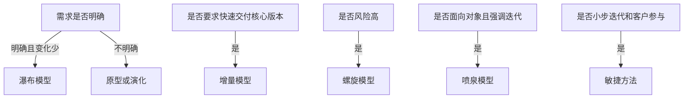
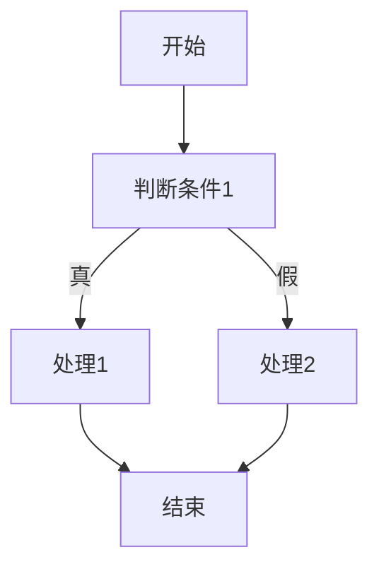

# chapter 11 - 软件工程

**适用对象**：软件设计师新手备考  
# 一、当前整理范围
```text
软件工程
├─ 1. 软件过程与过程改进
│  ├─ CMM
│  ├─ CMMI
│  └─ 过程改进
├─ 2. 软件过程模型
│  ├─ 瀑布模型
│  ├─ 增量模型
│  ├─ 演化模型与原型模型
│  ├─ 螺旋模型
│  ├─ 喷泉模型
│  ├─ 统一过程 UP / RUP
│  └─ 敏捷方法
├─ 3. 需求、设计与测试
│  ├─ 软件需求
│  ├─ 概要设计与详细设计
│  ├─ 系统测试、单元测试、集成测试
│  ├─ 黑盒测试
│  ├─ 白盒测试
│  └─ McCabe 环路复杂度
├─ 4. 运行维护与质量
│  ├─ 可维护性评价指标
│  ├─ 软件维护类型
│  ├─ 文档
│  ├─ 可靠性、可用性、可维护性
│  ├─ ISO/IEC 9126
│  ├─ McCall 质量模型
│  ├─ 软件评审
│  └─ 软件容错技术
└─ 5. 项目管理与杂题
   ├─ 沟通路径
   ├─ 软件项目估算
   ├─ Gantt 图
   ├─ PERT 图与项目活动图
   ├─ 配置管理
   ├─ 风险管理
   ├─ 软件维护工具
   └─ 体系结构、调试、重构等杂题
```
# 二、复习建议
| 轮次 | 目标 | 建议做法 | 关注重点 |
|---|---|---|---|
| 第 1 轮 | 建立框架 | 先按“过程模型—测试—项目管理—维护质量”四大块通读 | 先分清每个模型和每类测试的题眼 |
| 第 2 轮 | 背关键词 | 每个模型和概念只背一句“触发条件” | 瀑布、增量、原型、螺旋、喷泉、UP、敏捷 |
| 第 3 轮 | 练计算题 | 集中刷 McCabe、沟通路径、PERT/活动图、可靠性公式 | 公式代入、路径识别、松弛时间 |
| 第 4 轮 | 查漏补缺 | 只看错题和冲刺口诀 | 文档、维护类型、质量模型、风险管理 |

# 三、章节笔记
## 总记忆表
| 模块 | 记忆句 |
|---|---|
| CMM | 1 初始、2 可重复、3 已定义、4 已管理、5 优化；3 看标准化，4 看量化。 |
| CMMI | 阶段式看组织成熟度，连续式看过程域能力；CL1 已执行，CL5 优化。 |
| 瀑布模型 | 需求明确、变更少、领域熟，瀑布稳；需求不清别选它。 |
| 增量模型 | 先交核心产品，后续一批批增量补齐。 |
| 原型/演化 | 需求不清先做原型，边用边改用演化。 |
| 螺旋模型 | 高风险、大规模、技术新，风险驱动选螺旋。 |
| 喷泉模型 | 面向对象、迭代、无明显阶段界限。 |
| UP/RUP | 用例和风险驱动，架构为中心，迭代增量。 |
| 敏捷 | XP 记沟通、简单、反馈、勇气；Scrum 记 Sprint。 |
| 软件测试 | 测试只能发现错误，不能证明无错。 |
| 黑盒测试 | 按功能规格测，等价类、边界值、错误推测、因果图。 |
| 白盒测试 | 按内部逻辑测，覆盖准则从弱到强逐步加深。 |
| McCabe | 环路复杂度：$V(G)=m-n+2$，或判定结点数 + 1。 |
| 维护类型 | 改错改正，环境适应，功能性能完善，防未来预防。 |
| 沟通路径 | 无主：$n(n-1)/2$；主程序员：$n-1$。 |
| Gantt/PERT | 甘特看时间，PERT 看依赖和关键路径。 |
| 风险管理 | 风险 = 不确定性 + 损失；优先级看风险暴露。 |
| 配置管理 | 标识、版本、变更、状态报告、配置审核。 |


## CMM 与 CMMI

### 1. 知识点

| 对比项 | CMM | CMMI |
|---|---|---|
| 核心含义 | 软件过程能力成熟度模型 | 能力成熟度模型集成 |
| 关注对象 | 组织软件过程成熟度 | 多个过程模型的综合改进 |
| 表示方式 | 5 个成熟度等级 | 阶段式 + 连续式 |
| 常考题眼 | 第 3 级、第 4 级、等级高低 | CL1、CL3、CL5 的含义 |

CMM 五级可直接背成：

| 等级 | 名称 | 题眼 |
|---|---|---|
| 1 | 初始级 | 混乱，靠个人英雄主义 |
| 2 | 可重复级 | 基本项目管理，跟踪费用、进度、功能 |
| 3 | 已定义级 | 过程文档化、标准化，形成组织标准过程 |
| 4 | 已管理级 | 定量理解和控制过程与产品质量 |
| 5 | 优化级 | 持续改进，引入新技术新思想 |

CMMI 连续式能力等级：

| CL | 名称 | 记忆句 |
|---|---|---|
| CL0 | 未完成的 | 没做完，目标未满足 |
| CL1 | 已执行的 | 有输入，能产出可识别输出 |
| CL2 | 已管理的 | 项目级管理，有计划、有监控 |
| CL3 | 已定义的 | 组织标准化、部署和剪裁 |
| CL4 | 定量管理的 | 用度量和统计控制过程 |
| CL5 | 优化的 | 持续优化，应对变化 |

### 2. 公式/模板

```text
CMM：1乱 2管项目 3定标准 4量化 5优化
CMMI：CL1能执行，CL3组织化，CL5会优化
```

### 3. 例题分析

**例 1：CMM 第 3 级核心是什么？**  
先抓题眼：第 3 级“已定义级”。  
再套知识点：已定义级不是量化，也不是持续优化，而是组织级标准过程。  
**结论**：使用标准开发过程或方法论构建系统。

**例 2：CMM 第 4 级核心是什么？**  
题眼是“第 4 级、已管理级”。第 4 级强调对过程和产品进行定量理解与控制。  
**结论**：看到“定量理解、定量控制、度量标准”选第 4 级。

### 4. 记忆技巧

```text
CMM：一乱二管三标准，四量五优别弄反。
CMMI：一执行、三定义、五优化。
```

## 软件过程模型

### 1. 知识点

| 模型 | 适用场景 | 不适合场景 | 高频题眼 |
|---|---|---|---|
| 瀑布模型 | 需求明确、变更少、领域熟悉 | 需求不清、变化频繁 | 大规模、类似项目、严格阶段 |
| 增量模型 | 需要快速交付核心版本 | 难以划分增量、管理复杂 | 第一个可交付版本、优先级高先交付 |
| 原型模型 | 捕获需求、用户说不清 | 大规模复杂系统 | 快速原型、用户反馈 |
| 演化模型 | 需求逐步明确、边用边改 | 管理控制要求极高 | 使用中不断改善 |
| 螺旋模型 | 大规模、高风险、技术新 | 成本敏感、风险分析能力弱 | 风险驱动 |
| 喷泉模型 | 面向对象开发 | 阶段边界要求明显 | 以对象为驱动、迭代、无明显边界 |
| UP/RUP | 用例和风险驱动、架构为中心 | 只考术语时易混阶段名称 | 初启、精化、构建、移交 |
| 敏捷方法 | 需求变化快、小步快跑 | 强计划、文档重型环境 | XP、Scrum、Crystal、AUP |

### 2. 流程图



### 3. 例题分析

**例 1：需求明确、项目规模较大、团队熟悉领域，应选什么模型？**  
先抓题眼：“需求明确”“规模较大”“领域熟悉”“类似项目经验”。  
再套知识点：这是瀑布模型最稳定的适用场景。  
**正确方向**：瀑布模型。

**例 2：技术含量高、客户相关风险多，应选什么模型？**  
先抓题眼：“技术含量高”“风险多”。  
再套知识点：螺旋模型是风险驱动的开发模型。  
**正确方向**：螺旋模型。

**例 3：图形用户/业务系统希望尽快投入使用，后续功能可改善，应选什么模型？**  
先抓题眼：“尽快投入使用”“使用过程中不断改善”。  
再套知识点：先上线可用版本，再迭代增强，符合演化或增量思想。  
**正确方向**：演化/迭代模型。

### 4. 记忆技巧

```text
需求明确瀑布走，需求不清原型救；
先交核心增量好，风险很高螺旋保；
面向对象喷泉绕，敏捷冲刺小步跑。
```

## UP、RUP 与敏捷方法

### 1. 知识点

| 方法 | 高频点 | 易错点 |
|---|---|---|
| RUP/UP | 用例和风险驱动、架构为中心、迭代增量 | 不是“确认阶段”，而是初启、精化、构建、移交 |
| 初启阶段 | 项目初始活动、商业论证 | 不产生完整软件产品 |
| 精化阶段 | 需求分析、架构演进、生命周期架构里程碑 | 常考“生命周期架构” |
| 构建阶段 | 产生实现模型，构建系统 | 结束时形成可集成的软件产品 |
| 移交阶段 | 软件提交、交付用户 | 不是核心编码阶段 |
| XP | 沟通、简单、反馈、勇气；小发布、重构、结对、持续集成 | 测试应尽早写，不是“编完后再写” |
| Scrum | Product Backlog、Sprint Backlog、Sprint | Refactoring 不是 Scrum 步骤 |
| Crystal | 每个项目需要不同策略、约定和方法论 | 与 XP/Scrum 混淆 |
| AUP | 大型任务连续，小型活动迭代 | 不是 Crystal 的“每个系统一套方法论” |

### 2. 模板

```text
UP：谁做=角色，做什么=活动，产生什么=制品，何时做=工作流/阶段。
XP：沟通、简单、反馈、勇气。
Scrum：产品待办、冲刺待办、冲刺。
Crystal：项目不同，方法不同。
```

### 3. 例题分析

**例：RUP 用什么表述“谁做”？**  
先抓题眼：“谁做”。RUP 中“谁做”对应角色。  
**正确方向**：角色。

**例：30 天一次迭代称为冲刺的是哪种敏捷方法？**  
先抓题眼：“冲刺”“按优先级实现产品”“自组织小组”。  
**正确方向**：Scrum。

### 4. 记忆技巧

```text
RUP四阶段：初启定方向，精化定架构，构建做产品，移交给用户。
敏捷三句话：XP重实践，Scrum重冲刺，Crystal因项目而异。
```

## 软件需求、概要设计与详细设计

### 1. 知识点

| 阶段 | 主要任务 | 常考输出/题眼 |
|---|---|---|
| 需求分析 | 明确系统要做什么 | 软件需求规格说明、系统测试目标来源 |
| 概要设计 | 模块划分、体系结构、模块调用关系 | 系统分解为子系统、总体结构 |
| 详细设计 | 模块内部算法、数据结构、过程逻辑 | 算法设计、数据结构设计 |
| 编码 | 将设计转换为程序 | 代码质量、编码规范 |

功能需求与非功能需求：

| 类型 | 判断方法 | 例子 |
|---|---|---|
| 功能需求 | 系统必须完成什么业务功能 | 发工资、生成报表、查询成绩 |
| 非功能需求 | 系统在性能、可靠性、安全性上的约束 | 3 秒响应、100 人并发、精度要求 |
| 设计约束 | 对技术、平台、标准的限定 | 必须用某数据库、某语言 |

### 2. 例题分析

**例：3 秒内响应用户请求属于什么需求？**  
题眼是“响应时间”。这不是系统做什么，而是系统做得多快。  
**正确方向**：非功能需求。

**例：模块划分及模块之间调用关系属于哪个阶段？**  
题眼是“模块划分”和“调用关系”。这属于概要设计。详细设计才进入模块内部算法。  
**正确方向**：概要设计。

### 3. 记忆技巧

```text
需求问“做什么”；概要问“怎么分”；详细问“模块里面怎么干”。
```

## 软件测试总表

### 1. 知识点

| 测试层次 | 重点 | 常考点 |
|---|---|---|
| 单元测试 | 模块内部 | 模块接口、局部数据、路径、边界、错误处理 |
| 集成测试 | 模块组合 | 自顶向下、自底向上、驱动、桩、回归测试 |
| 系统测试 | 完整系统 | 测试目标来自需求分析 |
| 验收测试 | 用户确认 | 是否满足用户需求 |
| 回归测试 | 修改后重测 | 修复一个错误后引入新错误 |

测试原则：

| 正确说法 | 错误说法 |
|---|---|
| 测试目的是发现错误 | 测试目的是证明程序正确 |
| 好测试能发现尚未发现的错误 | 软件测试能证明没有错误 |
| 测试用例要有输入和预期输出 | 只设计输入即可 |
| 要包含合理输入与不合理输入 | 只测合法输入即可 |

### 2. 集成测试对照

| 策略 | 需要什么 | 不需要什么 | 优点 |
|---|---|---|---|
| 自顶向下 | 桩模块 | 驱动模块 | 早期验证主控模块和设计问题 |
| 自底向上 | 驱动模块 | 桩模块 | 早期验证底层模块，并行度较高 |

### 3. 例题分析

**例：修复错误后，旧功能出错，最可能用什么测试发现？**  
题眼是“修改后引起原来正确运行的代码出错”。  
**正确方向**：回归测试。

**例：无法获得第三方组件源代码，应采用什么测试？**  
题眼是“无法获得源代码”。看不到内部逻辑，只能按功能接口测。  
**正确方向**：黑盒测试。

### 4. 记忆技巧

```text
单元测模块，集成测接口；系统看需求，验收看用户；改后怕牵连，回归再来测。
```

## 黑盒测试、白盒测试与 McCabe 度量

### 1. 黑盒测试

| 方法 | 题眼 | 说明 |
|---|---|---|
| 等价类划分 | 有效类、无效类 | 好用例通常不要一次混入多个无效输入 |
| 边界值分析 | 上下限、临界值 | 年龄 20—60，应测 19、20、60、61 |
| 错误推测 | 凭经验猜错 | 依据经验补充测试 |
| 因果图 | 多条件组合 | 条件和动作关系复杂 |

### 2. 白盒测试

| 覆盖准则 | 记忆 | 强弱 |
|---|---|---|
| 语句覆盖 | 每条语句至少执行一次 | 最弱 |
| 判定覆盖/分支覆盖 | 每个判断真假至少一次 | 中等 |
| 条件覆盖 | 每个条件真假至少一次 | 中等 |
| 判定/条件覆盖 | 判定和条件都覆盖 | 较强 |
| 路径覆盖 | 所有可能路径都覆盖 | 最强但成本高 |

### 3. McCabe 公式

$$
V(G)=m-n+2
$$

其中，$m$ 为有向边数，$n$ 为结点数。考试中还有两个快速方法：

$$
V(G)=判定结点数+1
$$

$$
V(G)=区域数
$$

### 4. Mermaid 示例



上图只有 1 个判定结点，所以 $V(G)=1+1=2$。

### 5. 例题分析

**例：McCabe 题让计算环路复杂度。**  
先抓题眼：边数、结点数、判定结点数。  
再套公式：若能数判定，优先用“判定结点数 + 1”。  
最后落答案：与选项匹配。

**例：等价类测试中哪个不是好用例？**  
先抓题眼：输入字段有多个约束。  
好测试用例通常一次只覆盖一个无效等价类；若一个用例同时混入多个无效条件，就不利于定位错误。  
最后落答案：选择“多个无效输入混在一起”的选项。

### 6. 记忆技巧

```text
黑盒不看代码，白盒盯逻辑；
语句最弱，路径最强；
McCabe不慌，判定加一。
```

## 软件维护、文档与质量

### 1. 维护类型

| 类型 | 题眼 | 例子 |
|---|---|---|
| 改正性维护 | 改错 | 修复测试阶段未发现的错误 |
| 适应性维护 | 外部环境变化 | 操作系统、支付接口、数据格式变化 |
| 完善性维护 | 扩充功能、改善性能 | 增加语音输入、优化搜索速度 |
| 预防性维护 | 为未来防错、防退化 | 增加监控设施、防错性程序设计 |

> 有些真题中“增加功能”可能被官方解释为适应性维护，做题时要优先看题干是否强调“外部环境/管理需求变化”。若只是用户体验或性能提升，一般按完善性维护理解。

### 2. 可靠性、可用性、可维护性

| 指标 | 含义 | 常用公式 |
|---|---|---|
| 可靠性 | 给定时间和条件下无失效运行概率 | $MTTF/(1+MTTF)$ |
| 可用性 | 给定时刻可正常服务概率 | $MTBF/(1+MTBF)$ |
| 可维护性 | 规定时间内完成维护活动概率 | $1/(1+MTTR)$ |

### 3. 软件文档

| 正确认识 | 解释 |
|---|---|
| 文档是软件产品的一部分 | 没有文档的软件不能称为完整软件产品 |
| 文档提高可见度 | 让开发进展、需求、设计、测试可追踪 |
| 文档有助于沟通和维护 | 项目人员、用户、维护人员都依赖文档 |
| 高质量文档有利于效益发挥 | 文档不是“拖慢开发”的负担 |

### 4. ISO/IEC 9126 质量模型

| 特性 | 子特性举例 | 高频题眼 |
|---|---|---|
| 功能性 | 适合性、准确性、互操作性、安全性 | 数据隔离、安全性 |
| 可靠性 | 成熟性、容错性、易恢复性 | 故障后恢复 |
| 易使用性 | 易理解性、易学性、易操作性 | 用户使用难易 |
| 效率 | 时间特性、资源特性 | 响应时间、资源消耗 |
| 可维护性 | 易分析性、易改变性、稳定性、易测试性 | 修改、测试、分析 |
| 可移植性 | 适应性、易安装性、共存性、易替换性 | 环境迁移 |

### 5. 记忆技巧

```text
维护四类：改错、适应、完善、预防。
质量六类：功能可靠易使用，效率维护可移植。
文档题：说文档没用，多半错。
```

## 项目管理：沟通、估算、进度、配置与风险

### 1. 沟通路径

无主程序员组中，任意两人都可能沟通：

$$
m=\frac{n(n-1)}{2}
$$

主程序员组中，成员主要与主程序员沟通：

$$
m=n-1
$$

**例：8 人无主程序员组有多少沟通路径？**

$$
\frac{8\times7}{2}=28
$$

### 2. COCOMO 与 COCOMO II

| 模型 | 题眼 |
|---|---|
| 基本 COCOMO | 静态单变量，对整个系统进行估算 |
| 中级 COCOMO | 考虑成本驱动因子 |
| 详细 COCOMO | 更细粒度阶段估算 |
| COCOMO II 应用组装模型 | 对象点 |
| COCOMO II 早期设计模型 | 功能点 |
| COCOMO II 体系结构阶段模型 | 代码行 |

### 3. Gantt 图与 PERT 图

| 图 | 能清晰表达 | 不擅长表达 |
|---|---|---|
| Gantt 图 | 任务开始时间、结束时间、持续时间、并行进展 | 依赖关系、关键任务 |
| PERT 图 | 任务依赖关系、关键路径、最早/最晚时间 | 任务并行进展的直观程度 |

### 4. 项目活动图计算模板

```text
第一步：正推最早时间 E。
第二步：逆推最晚时间 L。
第三步：活动松弛时间 = 后继结点最晚时间 - 前驱结点最早时间 - 活动持续时间。
第四步：松弛时间为 0 的活动组成关键路径。
第五步：关键路径长度就是项目最短工期。
```

### 5. 软件配置管理

| 内容 | 是否属于配置管理 |
|---|---|
| 软件配置标识 | 属于 |
| 版本控制 | 属于 |
| 变更控制/变更管理 | 属于 |
| 配置状态报告 | 属于 |
| 配置审核 | 属于 |
| 质量控制 | 不直接属于配置管理 |
| 风险管理 | 不属于配置管理 |

### 6. 风险管理

| 概念 | 记忆句 |
|---|---|
| 风险 | 可能发生、带来损失、可干预 |
| 风险特性 | 不确定性 + 损失 |
| 风险预测 | 估计发生可能性和后果 |
| 风险评估 | 定义风险参照水准，判断可接受性 |
| 风险控制 | 避免、监控、管理和意外事件计划 |
| 风险优先级 | 常看风险暴露，即概率与影响综合 |

### 7. 记忆技巧

```text
甘特看排期，PERT看依赖；
关键路径最要命，松弛为零不能拖；
风险不是已发生，风险是可能损失；
配置管版本和变更，质量风险另分清。
```

# 四、按专题插入原题与解析

> 说明：本部分按专题保留本章上传题库中的原题信息。题目解析统一采用“题眼—知识点—答案方向”的方式。部分活动图、流程图题原图在 Word 中以图片呈现，这里保留题干并给出解题模板；复习时可对照原图按“正推最早、逆推最晚、求松弛”或“数判定/路径”完成。

## 4.1 高频代表题精讲

### 题 1（CMM）
**原题**  
软件能力成熟度模型（CMM）将软件能力成熟度自低到高依次划分为5级。目前，达到CMM第3级（已定义级）是许多组织努力的目标，该级的核心是 （29） 。（2009年上半年）  
（29） A. 建立基本的项目管理和实践来跟踪项目费用、进度和功能特性  
B. 使用标准开发过程（或方法论）构建（或集成）系统  
C. 管理层寻求更主动地应对系统的开发问题  
D. 连续地监督和改进标准化的系统开发过程

**解析**  
先抓题眼：本题属于“CMM”专题。  
再套知识点：看到“第3级标准化、第4级量化、第5级持续改进”，直接按成熟度等级定位。  
最后落答案：把题干关键词与选项中的定义或适用场景对应。

**正确答案**  
B

**答案方向**  
看到“第3级标准化、第4级量化、第5级持续改进”，直接按成熟度等级定位。

### 题 2（CMM）
**原题**  
软件能力成熟度模型（CMM）的第4级（已管理级）的核心是 （29） 。（2009年下半年）  
（29） A. 建立基本的项目管理和实践来跟踪项目费用、进度和功能特性  
B. 组织具有标准软件过程  
C. 对软件过程和产品都有定量的理解和控制  
D. 先进的新思想和新技术促进过程不断改进

**解析**  
先抓题眼：本题属于“CMM”专题。  
再套知识点：看到“第3级标准化、第4级量化、第5级持续改进”，直接按成熟度等级定位。  
最后落答案：把题干关键词与选项中的定义或适用场景对应。

**正确答案**  
C

**答案方向**  
看到“第3级标准化、第4级量化、第5级持续改进”，直接按成熟度等级定位。

### 题 3（瀑布模型）
**原题**  
某项目组拟开发一个大规模系统，且具备了相关领域及类似规模系统的开发经验。下列过程模型中， （15） 最适合开发此项目。（2010年下半年）  
（15） A. 原型模型 B. 瀑布模型 C. V模型 D. 螺旋模型

**解析**  
先抓题眼：本题属于“瀑布模型”专题。  
再套知识点：需求明确、规模较大、领域熟悉、变更少，优先考虑瀑布；需求不清时不要选瀑布。  
最后落答案：把题干关键词与选项中的定义或适用场景对应。

**正确答案**  
B

**答案方向**  
需求明确、规模较大、领域熟悉、变更少，优先考虑瀑布；需求不清时不要选瀑布。

### 题 4（瀑布模型）
**原题**  
若全面采用新技术开发一个大学记账系统，以替换原有的系统，则宜选择采用 （30）进行开发。（2011年下半年）  
（30） A. 瀑布模型 B. 演化模型 C. 螺旋模型 D. 原型模型

**解析**  
先抓题眼：本题属于“瀑布模型”专题。  
再套知识点：需求明确、规模较大、领域熟悉、变更少，优先考虑瀑布；需求不清时不要选瀑布。  
最后落答案：把题干关键词与选项中的定义或适用场景对应。

**正确答案**  
A

**答案方向**  
需求明确、规模较大、领域熟悉、变更少，优先考虑瀑布；需求不清时不要选瀑布。

### 题 5（增量模型）
**原题**  
软件开发的增量模型 （29） 。（2012年上半年）  
（29） A. 最适用于需求被清晰定义的情况  
B. 是一种能够快速构造可运行产品的好方法  
C. 最适合于大规模团队开发的项目  
D. 是一种不适用于商业产品的创新模型

**解析**  
先抓题眼：本题属于“增量模型”专题。  
再套知识点：看到“尽快交付核心产品、分批交付、优先级高的功能先做”，优先考虑增量。  
最后落答案：把题干关键词与选项中的定义或适用场景对应。

**正确答案**  
B

**答案方向**  
看到“尽快交付核心产品、分批交付、优先级高的功能先做”，优先考虑增量。

### 题 6（增量模型）
**原题**  
（30） 不是增量式开发的优势。（2013年下半年）  
（30） A. 软件可以快速地交付  
B. 早期的增量作为原型，从而可以加强对系统后续开发需求的理解  
C. 具有最高优先级的功能首先交付，随着后续的增量不断加入，这就使得更  
重要的功能得到更多的测试  
D. 很容易将客户需求划分为多个增量

**解析**  
先抓题眼：本题属于“增量模型”专题。  
再套知识点：看到“尽快交付核心产品、分批交付、优先级高的功能先做”，优先考虑增量。  
最后落答案：把题干关键词与选项中的定义或适用场景对应。

**正确答案**  
D

**答案方向**  
看到“尽快交付核心产品、分批交付、优先级高的功能先做”，优先考虑增量。

### 题 7（螺旋模型）
**原题**  
某公司计划开发一种产品，技术含量很高，与客户相关的风险也很多，则最适于采用 （29） 开发过程模型。（2015年上半年）  
（29） A. 瀑布 B. 原型 C. 增量 D. 螺旋

**解析**  
先抓题眼：本题属于“螺旋模型”专题。  
再套知识点：看到“风险高、规模大、技术新、客户风险多”，优先考虑螺旋。  
最后落答案：把题干关键词与选项中的定义或适用场景对应。

**正确答案**  
D

**答案方向**  
看到“风险高、规模大、技术新、客户风险多”，优先考虑螺旋。

### 题 8（螺旋模型）
**原题**  
以下关于螺旋模型的叙述中，不正确的是 （29） 。（2017年上半年）  
（29） A. 它是风险驱动的，要求开发人员必须具有丰富的风险评估知识和经验  
B. 它可以降低过多测试或测试不足带来的风险  
C. 它包含维护周期，因此维护和开发之间没有本质区别  
D. 它不适用于大型软件开发

**解析**  
先抓题眼：本题属于“螺旋模型”专题。  
再套知识点：看到“风险高、规模大、技术新、客户风险多”，优先考虑螺旋。  
最后落答案：把题干关键词与选项中的定义或适用场景对应。

**正确答案**  
D

**答案方向**  
看到“风险高、规模大、技术新、客户风险多”，优先考虑螺旋。

### 题 9（统一过程（UP）模型）
**原题**  
一个软件开发过程描述了“谁做”、“做什么”、“怎么做”和“什么时候做”，RUP用 （16）来表述“谁做”。（2009年上半年）  
（16） A. 角色 B. 活动 C. 制品 D. 工作流

**解析**  
先抓题眼：本题属于“统一过程（UP）模型”专题。  
再套知识点：UP 的题眼是“用例和风险驱动、架构为中心、迭代增量”，精化阶段对应生命周期架构。  
最后落答案：把题干关键词与选项中的定义或适用场景对应。

**正确答案**  
A

**答案方向**  
UP 的题眼是“用例和风险驱动、架构为中心、迭代增量”，精化阶段对应生命周期架构。

### 题 10（统一过程（UP）模型）
**原题**  
RUP在每个阶段都有主要目标，并在结束时产生一些制品。在 （30） 结束时产生“在适当的平台上集成的软件产品”。（2009年上半年）  
（30） A. 初启阶段 B. 精化阶段 C. 构建阶段 D. 移交阶段

**解析**  
先抓题眼：本题属于“统一过程（UP）模型”专题。  
再套知识点：UP 的题眼是“用例和风险驱动、架构为中心、迭代增量”，精化阶段对应生命周期架构。  
最后落答案：把题干关键词与选项中的定义或适用场景对应。

**正确答案**  
C

**答案方向**  
UP 的题眼是“用例和风险驱动、架构为中心、迭代增量”，精化阶段对应生命周期架构。

### 题 11（敏捷方法）
**原题**  
极限编程（XP）由价值观、原则、实践和行为四个部分组成，其中价值观包括沟通、简单性、 （36） 。（2009年下半年）  
（36） A. 好的计划 B. 不断的发布  
C. 反馈和勇气 D. 持续集成

**解析**  
先抓题眼：本题属于“敏捷方法”专题。  
再套知识点：XP 记价值观和实践，Scrum 记 Sprint，Crystal 记不同项目不同方法。  
最后落答案：把题干关键词与选项中的定义或适用场景对应。

**正确答案**  
C

**答案方向**  
XP 记价值观和实践，Scrum 记 Sprint，Crystal 记不同项目不同方法。

### 题 12（敏捷方法）
**原题**  
敏捷开发方法XP是一种轻量级、高效、低风险、柔性、可预测的、科学的软件开发方法，其特性包含在12个最佳实践中。系统的设计要能够尽可能早交付，属于 （18） 最佳实践。（2010年下半年）  
（18） A. 隐喻 B. 重构 C. 小型发布 D. 持续集成

**解析**  
先抓题眼：本题属于“敏捷方法”专题。  
再套知识点：XP 记价值观和实践，Scrum 记 Sprint，Crystal 记不同项目不同方法。  
最后落答案：把题干关键词与选项中的定义或适用场景对应。

**正确答案**  
C

**答案方向**  
XP 记价值观和实践，Scrum 记 Sprint，Crystal 记不同项目不同方法。

### 题 13（软件需求）
**原题**  
“软件产品必须能够在3秒内对用户请求作出响应”属于软件需求中的 （18） 。（2013年上半年）  
（18） A. 功能需求 B. 非功能需求  
C. 设计约束 D. 逻辑需求

**解析**  
先抓题眼：本题属于“软件需求”专题。  
再套知识点：功能需求看“系统做什么”，非功能需求看“性能、可靠性、响应时间、并发量”。  
最后落答案：把题干关键词与选项中的定义或适用场景对应。

**正确答案**  
B

**答案方向**  
功能需求看“系统做什么”，非功能需求看“性能、可靠性、响应时间、并发量”。

### 题 14（软件需求）
**原题**  
某企业财务系统的需求中，属于功能需求的是 （19） 。（2017年下半年）  
（19） A. 每个月特定的时间发放员工工资  
B. 系统的响应时间不超过3秒  
C. 系统的计算精度符合财务规则的要求  
D. 系统可以允许100个用户同时查询自己的工资

**解析**  
先抓题眼：本题属于“软件需求”专题。  
再套知识点：功能需求看“系统做什么”，非功能需求看“性能、可靠性、响应时间、并发量”。  
最后落答案：把题干关键词与选项中的定义或适用场景对应。

**正确答案**  
A

**答案方向**  
功能需求看“系统做什么”，非功能需求看“性能、可靠性、响应时间、并发量”。

### 题 15（系统测试）
**原题**  
以下关于软件测试的叙述中，正确的是 （35） 。（2010年下半年）  
（35） A. 软件测试不仅能表明软件中存在错误，也能说明软件中不存在错误  
B. 软件测试活动应从编码阶段开始  
C. 一个成功的测试能发现至今未发现的错误  
D. 在一个被测程序段中，若已发现的错误越多，则残存的错误数越少

**解析**  
先抓题眼：本题属于“系统测试”专题。  
再套知识点：测试不能证明无错，成功测试是发现新错误；系统测试目标来自需求分析。  
最后落答案：把题干关键词与选项中的定义或适用场景对应。

**正确答案**  
C

**答案方向**  
测试不能证明无错，成功测试是发现新错误；系统测试目标来自需求分析。

### 题 16（系统测试）
**原题**  
在设计测试用例时，应遵循 （35） 原则。（2013年上半年）  
（35） A. 仅确定测试用例的输入数据，无需考虑输出结果  
B. 只需检验程序是否执行应有的功能，不需要考虑程序是否做了多余的功能  
C. 不仅要设计有效合理输入，也要包含不合理、失效的输入  
D. 测试用例应设计得尽可能复杂

**解析**  
先抓题眼：本题属于“系统测试”专题。  
再套知识点：测试不能证明无错，成功测试是发现新错误；系统测试目标来自需求分析。  
最后落答案：把题干关键词与选项中的定义或适用场景对应。

**正确答案**  
C

**答案方向**  
测试不能证明无错，成功测试是发现新错误；系统测试目标来自需求分析。

### 题 17（集成测试）
**原题**  
一个项目为了修正一个错误而进行了变更。但这个错误被修正后，却引起以前可以正确运行的代码出错。 （18） 最可能发现这一问题。（2009年下半年）  
（18） A. 单元测试 B. 接受测试  
C. 回归测试 D. 安装测试

**解析**  
先抓题眼：本题属于“集成测试”专题。  
再套知识点：修改后重测选回归测试；自顶向下要桩，自底向上要驱动。  
最后落答案：把题干关键词与选项中的定义或适用场景对应。

**正确答案**  
C

**答案方向**  
修改后重测选回归测试；自顶向下要桩，自底向上要驱动。

### 题 18（集成测试）
**原题**  
在改正当前故障的同时可能会引入新的故障，这时需要进行 （36） 。（2011年上半年）  
（36） A. 功能测试 B. 性能测试 C. 回归测试 D. 验收测试

**解析**  
先抓题眼：本题属于“集成测试”专题。  
再套知识点：修改后重测选回归测试；自顶向下要桩，自底向上要驱动。  
最后落答案：把题干关键词与选项中的定义或适用场景对应。

**正确答案**  
C

**答案方向**  
修改后重测选回归测试；自顶向下要桩，自底向上要驱动。

### 题 19（黑盒测试）
**原题**  
某系统重用了第三方组件（但无法获得其源代码），则应采用 （35） 对组件进行测试。（2009年下半年）  
（35） A. 基本路径覆盖 B. 分支覆盖  
C. 环路覆盖 D. 黑盒测试

**解析**  
先抓题眼：本题属于“黑盒测试”专题。  
再套知识点：黑盒按功能规格设计测试，常见方法为等价类、边界值、错误推测、因果图。  
最后落答案：把题干关键词与选项中的定义或适用场景对应。

**正确答案**  
D

**答案方向**  
黑盒按功能规格设计测试，常见方法为等价类、边界值、错误推测、因果图。

### 题 20（黑盒测试）
**原题**  
不属于黑盒测试技术的是 （36） 。（2010年下半年）  
（36） A. 错误猜测 B. 逻辑覆盖  
C. 边界值分析 D. 等价类划分

**解析**  
先抓题眼：本题属于“黑盒测试”专题。  
再套知识点：黑盒按功能规格设计测试，常见方法为等价类、边界值、错误推测、因果图。  
最后落答案：把题干关键词与选项中的定义或适用场景对应。

**正确答案**  
B

**答案方向**  
黑盒按功能规格设计测试，常见方法为等价类、边界值、错误推测、因果图。

### 题 21（McCabe度量法）
**原题**  
McCabe度量法是通过定义环路复杂度，建立程序复杂性的度量，它基于一个程序模块的程序图中环路的个数。计算有向图G的环路复杂性的公式为：V（G）=m-n+2，其中V（G）是有向图G中的环路个数，m是G中的有向弧数，n是G中的节点数。下图所示程序图的程序复杂度是 （32） 。（2009年上半年）  
（32） A. 2 B. 3 C. 4 D. 5

**解析**  
先抓题眼：本题属于“McCabe度量法”专题。  
再套知识点：环路复杂度常用 $V(G)=m-n+2$，也可用“判定结点数+1”快速估算。  
最后落答案：把题干关键词与选项中的定义或适用场景对应。

**正确答案**  
B

**答案方向**  
环路复杂度常用 $V(G)=m-n+2$，也可用“判定结点数+1”快速估算。

### 题 22（McCabe度量法）
**原题**  
某程序的程序图如下所示，运用McCabe度量法对其进行度量，其环路复杂度是 （32） 。（2009年下半年）  
（32） A. 2 B. 3 C. 4 D. 5

**解析**  
先抓题眼：本题属于“McCabe度量法”专题。  
再套知识点：环路复杂度常用 $V(G)=m-n+2$，也可用“判定结点数+1”快速估算。  
最后落答案：把题干关键词与选项中的定义或适用场景对应。

**正确答案**  
D

**答案方向**  
环路复杂度常用 $V(G)=m-n+2$，也可用“判定结点数+1”快速估算。

### 题 23（白盒测试）
**原题**  
当用分支覆盖法对以下流程图进行测试时，至少需要设计 （35） 个测试用例。（2009年上半年）  
（35） A. 4 B. 5 C. 6 D. 8

**解析**  
先抓题眼：本题属于“白盒测试”专题。  
再套知识点：白盒按内部逻辑设计用例，覆盖强度大致为语句 < 判定 < 条件/判定条件 < 路径。  
最后落答案：把题干关键词与选项中的定义或适用场景对应。

**正确答案**  
C

**答案方向**  
白盒按内部逻辑设计用例，覆盖强度大致为语句 < 判定 < 条件/判定条件 < 路径。

### 题 24（白盒测试）
**原题**  
使用白盒测试方法时，应根据 （17） 和指定的覆盖标准确定测试数据。（2010年上半年）  
（17） A. 程序的内部逻辑 B. 程序结构的复杂性  
C. 使用说明书 D. 程序的功能

**解析**  
先抓题眼：本题属于“白盒测试”专题。  
再套知识点：白盒按内部逻辑设计用例，覆盖强度大致为语句 < 判定 < 条件/判定条件 < 路径。  
最后落答案：把题干关键词与选项中的定义或适用场景对应。

**正确答案**  
A

**答案方向**  
白盒按内部逻辑设计用例，覆盖强度大致为语句 < 判定 < 条件/判定条件 < 路径。

### 题 25（软件维护内容）
**原题**  
某银行为了使其网上银行系统能够支持信用卡多币种付款功能而进行扩充升级，这需要对数据类型稍微进行一些改变，这一状况需要对网上银行系统进行 （36） 维护。（2009年上半年）  
（36） A. 正确性 B. 适应性 C. 完善性 D. 预防性

**解析**  
先抓题眼：本题属于“软件维护内容”专题。  
再套知识点：改错是改正性，环境变化是适应性，扩功能/提性能是完善性，预防未来问题是预防性。  
最后落答案：把题干关键词与选项中的定义或适用场景对应。

**正确答案**  
B

**答案方向**  
改错是改正性，环境变化是适应性，扩功能/提性能是完善性，预防未来问题是预防性。

### 题 26（软件维护内容）
**原题**  
改正在软件系统开发阶段已经发生而系统测试阶段还没有发现的错误，属于 （34） 维护。（2009年下半年）  
（34） A. 正确性 B. 适应性 C. 完善性 D. 预防性

**解析**  
先抓题眼：本题属于“软件维护内容”专题。  
再套知识点：改错是改正性，环境变化是适应性，扩功能/提性能是完善性，预防未来问题是预防性。  
最后落答案：把题干关键词与选项中的定义或适用场景对应。

**正确答案**  
A

**答案方向**  
改错是改正性，环境变化是适应性，扩功能/提性能是完善性，预防未来问题是预防性。

### 题 27（沟通路径）
**原题**  
包含8个成员的开发小组的沟通路径最多有 （15） 条。（2011年上半年）  
（15） A. 28 B. 32 C. 56 D. 64

**解析**  
先抓题眼：本题属于“沟通路径”专题。  
再套知识点：无主程序员按 $n(n-1)/2$，主程序员按 $n-1$。  
最后落答案：把题干关键词与选项中的定义或适用场景对应。

**正确答案**  
A

**答案方向**  
无主程序员按 $n(n-1)/2$，主程序员按 $n-1$。

### 题 28（沟通路径）
**原题**  
在进行软件开发时，采用无主程序员的开发小组，成员之间相互平等;而主程序员负责制的开发小组，由一个主程序员和若干成员组成，成员之间没有沟通。在一个由8名开发人员构成的小组中，无主程序员组和主程序员组的沟通路径分别是 （19） 。（2017年上半年）  
（19） A. 32和8 B. 32和7 C. 28和8 D. 28和7

**解析**  
先抓题眼：本题属于“沟通路径”专题。  
再套知识点：无主程序员按 $n(n-1)/2$，主程序员按 $n-1$。  
最后落答案：把题干关键词与选项中的定义或适用场景对应。

**正确答案**  
D

**答案方向**  
无主程序员按 $n(n-1)/2$，主程序员按 $n-1$。

### 题 29（Gantt图（甘特图））
**原题**  
甘特图（Gantt图）不能 （18） 。（2011年下半年）  
（18） A. 作为项目进度管理的一个工具  
B. 清晰地描述每个任务的开始和截止时间  
C. 清晰地获得任务并行进行的信息  
D. 清晰地获得各任务之间的依赖关系

**解析**  
先抓题眼：本题属于“Gantt图（甘特图）”专题。  
再套知识点：甘特图擅长起止时间和并行关系，不擅长依赖关系和关键路径。  
最后落答案：把题干关键词与选项中的定义或适用场景对应。

**正确答案**  
D

**答案方向**  
甘特图擅长起止时间和并行关系，不擅长依赖关系和关键路径。

### 题 30（Gantt图（甘特图））
**原题**  
以下关于进度管理工具Gantt图的叙述中，不正确的是 （18） 。（2014年上半年）  
（18） A. 能清晰地表达每个任务的开始时间、结束时间和持续时间  
B. 能清晰地表达任务之间的并行关系  
C. 不能清晰地确定任务之间的依赖关系  
D. 能清晰地确定影响进度的关键任务

**解析**  
先抓题眼：本题属于“Gantt图（甘特图）”专题。  
再套知识点：甘特图擅长起止时间和并行关系，不擅长依赖关系和关键路径。  
最后落答案：把题干关键词与选项中的定义或适用场景对应。

**正确答案**  
D

**答案方向**  
甘特图擅长起止时间和并行关系，不擅长依赖关系和关键路径。

### 题 31（项目活动图）
**原题**  
下图是一个软件项目的活动图，其中顶点表示项目里程碑，边表示包含的活动，边上的权重表示活动的持续时间，则里程碑 （19） 在关键路径上。（2011年上半年）  
（19） A. 1 B. 2 C. 3 D. 4

**解析**  
先抓题眼：本题属于“项目活动图”专题。  
再套知识点：活动图重点算最早、最晚、松弛时间和关键路径。  
最后落答案：把题干关键词与选项中的定义或适用场景对应。

**正确答案**  
B

**答案方向**  
活动图重点算最早、最晚、松弛时间和关键路径。

### 题 32（项目活动图）
**原题**  
下图是一个软件项目的活动图，其中顶点表示项目里程碑，连接顶点的边表示包含的活动，边上的值表示完成活动所需要的时间，则关键路径长度为 （17） 。（2011年下半年）  
（17） A. 20 B. 19 C. 17 D. 16

**解析**  
先抓题眼：本题属于“项目活动图”专题。  
再套知识点：活动图重点算最早、最晚、松弛时间和关键路径。  
最后落答案：把题干关键词与选项中的定义或适用场景对应。

**正确答案**  
A

**答案方向**  
活动图重点算最早、最晚、松弛时间和关键路径。

### 题 33（软件配置管理）
**原题**  
对于一个大型软件来说，不加控制地变更很快就会引起混乱。为有效地实现变更控制，需借助于配置数据库和基线的概念。 （29） 不属于配置数据库。（2010年上半年）  
（29） A. 开发库 B. 受控库 C. 信息库 D. 产品库

**解析**  
先抓题眼：本题属于“软件配置管理”专题。  
再套知识点：配置管理包括配置标识、版本控制、变更控制、状态报告、配置审核等，不等于质量控制或风险管理。  
最后落答案：把题干关键词与选项中的定义或适用场景对应。

**正确答案**  
C

**答案方向**  
配置管理包括配置标识、版本控制、变更控制、状态报告、配置审核等，不等于质量控制或风险管理。

### 题 34（软件配置管理）
**原题**  
（34） 不属于软件配置管理的活动。（2010年上半年）  
（34） A. 变更标识 B. 变更控制 C. 质量控制 D. 版本控制

**解析**  
先抓题眼：本题属于“软件配置管理”专题。  
再套知识点：配置管理包括配置标识、版本控制、变更控制、状态报告、配置审核等，不等于质量控制或风险管理。  
最后落答案：把题干关键词与选项中的定义或适用场景对应。

**正确答案**  
C

**答案方向**  
配置管理包括配置标识、版本控制、变更控制、状态报告、配置审核等，不等于质量控制或风险管理。

### 题 35（软件风险）
**原题**  
软件风险一般包含 （19） 两个特性。（2009年上半年）  
（19） A. 救火和危机管理 B. 己知风险和未知风险  
C. 不确定性和损失 D. 员工和预算

**解析**  
先抓题眼：本题属于“软件风险”专题。  
再套知识点：风险具有不确定性和损失；优先级常看风险暴露，即概率与影响。  
最后落答案：把题干关键词与选项中的定义或适用场景对应。

**正确答案**  
C

**答案方向**  
风险具有不确定性和损失；优先级常看风险暴露，即概率与影响。

### 题 36（软件风险）
**原题**  
风险预测从两个方面评估风险，即风险发生的可能性以及 （19） 。（2009年下半年）  
（19） A. 风险产生的原因 B. 风险监控技术  
C. 风险能否消除 D. 风险发生所产生的后果

**解析**  
先抓题眼：本题属于“软件风险”专题。  
再套知识点：风险具有不确定性和损失；优先级常看风险暴露，即概率与影响。  
最后落答案：把题干关键词与选项中的定义或适用场景对应。

**正确答案**  
D

**答案方向**  
风险具有不确定性和损失；优先级常看风险暴露，即概率与影响。

### 题 37（ISO IEC 9126 软件质量模型）
**原题**  
根据ISO/IEC 9126软件质量度量模型定义，一个软件的时间和资源质量子特性属于（31） 质量特件。（2009年上半年）  
（31） A. 功能性 B. 效率 C. 可靠性 D. 易使用性

**解析**  
先抓题眼：本题属于“ISO IEC 9126 软件质量模型”专题。  
再套知识点：9126 六大特性要按功能性、可靠性、易用性、效率、可维护性、可移植性记。  
最后落答案：把题干关键词与选项中的定义或适用场景对应。

**正确答案**  
B

**答案方向**  
9126 六大特性要按功能性、可靠性、易用性、效率、可维护性、可移植性记。

### 题 38（ISO IEC 9126 软件质量模型）
**原题**  
ISO/IEC 9126软件质量模型中，可靠性质量特性包括多个子特性。一软件在故障发生后，要求在90秒内恢复其性能和受影响的数据，与达到此目的有关的软件属性为 （31） 子特性。（2009年下半年）  
（31） A. 容错性 B. 成熟性 C. 易恢复性 D. 易操作性

**解析**  
先抓题眼：本题属于“ISO IEC 9126 软件质量模型”专题。  
再套知识点：9126 六大特性要按功能性、可靠性、易用性、效率、可维护性、可移植性记。  
最后落答案：把题干关键词与选项中的定义或适用场景对应。

**正确答案**  
C

**答案方向**  
9126 六大特性要按功能性、可靠性、易用性、效率、可维护性、可移植性记。

## 4.2 全量原题与答案索引

> 这一部分覆盖解析文件中识别出的全部原题。若某题包含多个空，则答案按空号顺序排列。

## 专题：CMM

### 题 1
**原题**  
软件能力成熟度模型（CMM）将软件能力成熟度自低到高依次划分为5级。目前，达到CMM第3级（已定义级）是许多组织努力的目标，该级的核心是 （29） 。（2009年上半年）  
（29） A. 建立基本的项目管理和实践来跟踪项目费用、进度和功能特性  
B. 使用标准开发过程（或方法论）构建（或集成）系统  
C. 管理层寻求更主动地应对系统的开发问题  
D. 连续地监督和改进标准化的系统开发过程

**解析**  
先抓题眼：题干属于“CMM”专题。  
再套知识点：看到“第3级标准化、第4级量化、第5级持续改进”，直接按成熟度等级定位。  
最后落答案：对应选项即为本题答案。

**正确答案**  
B

**答案方向**  
看到“第3级标准化、第4级量化、第5级持续改进”，直接按成熟度等级定位。

### 题 2
**原题**  
软件能力成熟度模型（CMM）的第4级（已管理级）的核心是 （29） 。（2009年下半年）  
（29） A. 建立基本的项目管理和实践来跟踪项目费用、进度和功能特性  
B. 组织具有标准软件过程  
C. 对软件过程和产品都有定量的理解和控制  
D. 先进的新思想和新技术促进过程不断改进

**解析**  
先抓题眼：题干属于“CMM”专题。  
再套知识点：看到“第3级标准化、第4级量化、第5级持续改进”，直接按成熟度等级定位。  
最后落答案：对应选项即为本题答案。

**正确答案**  
C

**答案方向**  
看到“第3级标准化、第4级量化、第5级持续改进”，直接按成熟度等级定位。

### 题 3
**原题**  
SEI能力成熟度模型（SEI CMM）把软件开发企业分为5个成熟度级别，其中（32） 重点关注产品和过程质量。（2013年下半年）  
（32） A. 级别2：重复级 B. 级别3：确定级  
C. 级别4：管理级 D. 级别5：优化级

**解析**  
先抓题眼：题干属于“CMM”专题。  
再套知识点：看到“第3级标准化、第4级量化、第5级持续改进”，直接按成熟度等级定位。  
最后落答案：对应选项即为本题答案。

**正确答案**  
C

**答案方向**  
看到“第3级标准化、第4级量化、第5级持续改进”，直接按成熟度等级定位。

### 题 4
**原题**  
以下关于CMM的叙述中，不正确的是 （30） 。（2014年下半年）  
（30） A. CMM是指软件过程能力成熟度模型  
B. CMM根据软件过程的不同成熟度划分了5个等级，其中，1级被认为成熟度最高，5级被认为成熟度最低  
C. CMMI的任务是将已有的几个CMM模型结合在一起，使之构造成为“集成模型”  
D. 采用更成熟的CMM模型，一般来说可以提高最终产品的质量

**解析**  
先抓题眼：题干属于“CMM”专题。  
再套知识点：看到“第3级标准化、第4级量化、第5级持续改进”，直接按成熟度等级定位。  
最后落答案：对应选项即为本题答案。

**正确答案**  
B

**答案方向**  
看到“第3级标准化、第4级量化、第5级持续改进”，直接按成熟度等级定位。

### 题 5
**原题**  
以下关于CMM的叙述中，不正确的是 （30） 。（2019年下半年）  
（30） A. CMM是指软件过程能力成熟度模型  
B. CMM根据软件过程的不同成熟度划分了5个等级，其中1级被认为成熟  
度最高，5级被认为成熟度最低  
C. CMMI的任务是将已有的几个CMM模型结合在一起，使之构成“集成模  
型”  
D. 采用更成熟的CMM模型，一般来说可以提高最终产品的质量

**解析**  
先抓题眼：题干属于“CMM”专题。  
再套知识点：看到“第3级标准化、第4级量化、第5级持续改进”，直接按成熟度等级定位。  
最后落答案：对应选项即为本题答案。

**正确答案**  
B

**答案方向**  
看到“第3级标准化、第4级量化、第5级持续改进”，直接按成熟度等级定位。

## 专题：CMMI

### 题 6
**原题**  
能力成熟度集成模型CMMI是CMM模型的最新版本，它有连续式和阶段式两种表示方式。基于连续式表示的CMMI共有6个（0〜5）能力等级，每个能力等级对应到一个一般目标以及一组一般执行方法和特定方法，其中能力等级 （31） 主要关注过程的组织标准化和部署。（2010年上半年）  
（31） A. 1 B. 2 C. 3 D. 4

**解析**  
先抓题眼：题干属于“CMMI”专题。  
再套知识点：连续式 CL0—CL5 要按“未完成、已执行、已管理、已定义、定量管理、优化”记忆。  
最后落答案：对应选项即为本题答案。

**正确答案**  
C

**答案方向**  
连续式 CL0—CL5 要按“未完成、已执行、已管理、已定义、定量管理、优化”记忆。

### 题 7
**原题**  
关于过程改进，以下叙述中不正确的是 （30） 。（2011年上半年）  
（30） A. 软件质量依赖于软件开发过程的质量，其中个人因素占主导作用  
B. 要使过程改进有效，需要制定过程改进目标  
C. 要使过程改进有效，需要进行培训  
D. CMMI成熟度模型是一种过程改进模型，仅支持阶段性过程改进而不支持  
连续性过程改进

**解析**  
先抓题眼：题干属于“CMMI”专题。  
再套知识点：连续式 CL0—CL5 要按“未完成、已执行、已管理、已定义、定量管理、优化”记忆。  
最后落答案：对应选项即为本题答案。

**正确答案**  
D

**答案方向**  
连续式 CL0—CL5 要按“未完成、已执行、已管理、已定义、定量管理、优化”记忆。

### 题 8
**原题**  
能力成熟模型集成（CMMI）是若干过程模型的综合和改进。连续式模型和阶段式模型是CMMI提供的两种表示方法。连续式模型包括6个过程域能力等级（Capability Level，CL）其中 （30） 的共性目标是过程将可标识的输入工作产品转换成可标识的输出工作产品，以实现支持过程域的特定目标。（2018年上半年）  
（30） A. CL1（已执行的） B. CL2（已管理的）  
C. CL3（已定义的） D. CL4（定量管理的）

**解析**  
先抓题眼：题干属于“CMMI”专题。  
再套知识点：连续式 CL0—CL5 要按“未完成、已执行、已管理、已定义、定量管理、优化”记忆。  
最后落答案：对应选项即为本题答案。

**正确答案**  
A

**答案方向**  
连续式 CL0—CL5 要按“未完成、已执行、已管理、已定义、定量管理、优化”记忆。

### 题 9
**原题**  
能力成熟度模型集成（CMMI）是若干过程模型的综合和改进。连续式模型和阶段式模型是CMMI提供的两种表示方法，而连续式模型包括6个过程域能力等级，其中 （30） 使用量化（统计学）手段改变和优化过程域，以应对客户要求的改变和持续改进计划中的过程域的功效。（2018年下半年）  
（30） A. CL2（已管理的） B. CL3（已定义级的）  
C. CL4（定量管理的） D. CL5（优化的）

**解析**  
先抓题眼：题干属于“CMMI”专题。  
再套知识点：连续式 CL0—CL5 要按“未完成、已执行、已管理、已定义、定量管理、优化”记忆。  
最后落答案：对应选项即为本题答案。

**正确答案**  
D

**答案方向**  
连续式 CL0—CL5 要按“未完成、已执行、已管理、已定义、定量管理、优化”记忆。

## 专题：瀑布模型

### 题 10
**原题**  
某项目组拟开发一个大规模系统，且具备了相关领域及类似规模系统的开发经验。下列过程模型中， （15） 最适合开发此项目。（2010年下半年）  
（15） A. 原型模型 B. 瀑布模型 C. V模型 D. 螺旋模型

**解析**  
先抓题眼：题干属于“瀑布模型”专题。  
再套知识点：需求明确、规模较大、领域熟悉、变更少，优先考虑瀑布；需求不清时不要选瀑布。  
最后落答案：对应选项即为本题答案。

**正确答案**  
B

**答案方向**  
需求明确、规模较大、领域熟悉、变更少，优先考虑瀑布；需求不清时不要选瀑布。

### 题 11
**原题**  
若全面采用新技术开发一个大学记账系统，以替换原有的系统，则宜选择采用 （30）进行开发。（2011年下半年）  
（30） A. 瀑布模型 B. 演化模型 C. 螺旋模型 D. 原型模型

**解析**  
先抓题眼：题干属于“瀑布模型”专题。  
再套知识点：需求明确、规模较大、领域熟悉、变更少，优先考虑瀑布；需求不清时不要选瀑布。  
最后落答案：对应选项即为本题答案。

**正确答案**  
A

**答案方向**  
需求明确、规模较大、领域熟悉、变更少，优先考虑瀑布；需求不清时不要选瀑布。

### 题 12
**原题**  
假设某软件公司与客户签订合同开发一个软件系统，系统的功能有较清晰的定义，且客户对交付时间有严格要求，则该系统的开发最适宜采用 （30） 。（2012年上半年）  
（30） A. 瀑布模型 B. 原型模型  
C. V模型 D. 螺旋模型

**解析**  
先抓题眼：题干属于“瀑布模型”专题。  
再套知识点：需求明确、规模较大、领域熟悉、变更少，优先考虑瀑布；需求不清时不要选瀑布。  
最后落答案：对应选项即为本题答案。

**正确答案**  
A

**答案方向**  
需求明确、规模较大、领域熟悉、变更少，优先考虑瀑布；需求不清时不要选瀑布。

### 题 13
**原题**  
某开发小组欲开发一个规模较大、需求较明确的项目。开发小组对项目领域熟悉且该项目与小组开发过的某一项目相似，则适宜采用 （29） 开发过程模型。（2012年下半年）  
（29） A. 瀑布 B. 演化 C. 螺旋 D. 喷泉

**解析**  
先抓题眼：题干属于“瀑布模型”专题。  
再套知识点：需求明确、规模较大、领域熟悉、变更少，优先考虑瀑布；需求不清时不要选瀑布。  
最后落答案：对应选项即为本题答案。

**正确答案**  
A

**答案方向**  
需求明确、规模较大、领域熟悉、变更少，优先考虑瀑布；需求不清时不要选瀑布。

### 题 14
**原题**  
（29） 开发过程模型最不适用于开发初期对软件需求缺乏准确全面认识的情况。（2013年下半年）  
（29） A. 瀑布 B. 演化 C. 螺旋 D. 增量

**解析**  
先抓题眼：题干属于“瀑布模型”专题。  
再套知识点：需求明确、规模较大、领域熟悉、变更少，优先考虑瀑布；需求不清时不要选瀑布。  
最后落答案：对应选项即为本题答案。

**正确答案**  
A

**答案方向**  
需求明确、规模较大、领域熟悉、变更少，优先考虑瀑布；需求不清时不要选瀑布。

### 题 15
**原题**  
某公司要开发一个软件产品，产品的某些需求是明确的，而某些需求则需要进一步细化。由于市场竞争的压力，产品需要尽快上市，则开发该软件产品最不适合采用 （30） 模型。（2014年上半年）  
（30） A. 瀑布 B. 原型 C. 增量 D. 螺旋

**解析**  
先抓题眼：题干属于“瀑布模型”专题。  
再套知识点：需求明确、规模较大、领域熟悉、变更少，优先考虑瀑布；需求不清时不要选瀑布。  
最后落答案：对应选项即为本题答案。

**正确答案**  
A

**答案方向**  
需求明确、规模较大、领域熟悉、变更少，优先考虑瀑布；需求不清时不要选瀑布。

### 题 16
**原题**  
某开发小组欲为一公司开发一个产品控制软件，监控产品的生产和销售过程，从购买各种材料开始，到产品的加工和销售进行全程跟踪。购买材料的流程、产品的加工过程以及销售过程可能会发生变化。该软件的开发最不适宜采用 （29） 模型，主要是因为这种模型 （30） 。（2016年下半年）  
（29） A. 瀑布 B. 原型 C. 增量 D. 喷泉  
（30） A. 不能解决风险 B. 不能快速提交软件  
C. 难以适应变化的需求 D. 不能理解用户的需求

**解析**  
先抓题眼：题干属于“瀑布模型”专题。  
再套知识点：需求明确、规模较大、领域熟悉、变更少，优先考虑瀑布；需求不清时不要选瀑布。  
最后落答案：对应选项即为本题答案。

**正确答案**  
A、C

**答案方向**  
需求明确、规模较大、领域熟悉、变更少，优先考虑瀑布；需求不清时不要选瀑布。

## 专题：增量模型

### 题 17
**原题**  
软件开发的增量模型 （29） 。（2012年上半年）  
（29） A. 最适用于需求被清晰定义的情况  
B. 是一种能够快速构造可运行产品的好方法  
C. 最适合于大规模团队开发的项目  
D. 是一种不适用于商业产品的创新模型

**解析**  
先抓题眼：题干属于“增量模型”专题。  
再套知识点：看到“尽快交付核心产品、分批交付、优先级高的功能先做”，优先考虑增量。  
最后落答案：对应选项即为本题答案。

**正确答案**  
B

**答案方向**  
看到“尽快交付核心产品、分批交付、优先级高的功能先做”，优先考虑增量。

### 题 18
**原题**  
（30） 不是增量式开发的优势。（2013年下半年）  
（30） A. 软件可以快速地交付  
B. 早期的增量作为原型，从而可以加强对系统后续开发需求的理解  
C. 具有最高优先级的功能首先交付，随着后续的增量不断加入，这就使得更  
重要的功能得到更多的测试  
D. 很容易将客户需求划分为多个增量

**解析**  
先抓题眼：题干属于“增量模型”专题。  
再套知识点：看到“尽快交付核心产品、分批交付、优先级高的功能先做”，优先考虑增量。  
最后落答案：对应选项即为本题答案。

**正确答案**  
D

**答案方向**  
看到“尽快交付核心产品、分批交付、优先级高的功能先做”，优先考虑增量。

### 题 19
**原题**  
以下关于增量模型的叙述中，正确的是 （29） 。（2014年下半年）  
（29） A. 需求被清晰定义 B. 可以快速构造核心产品  
C. 每个增量必须要进行风险评估 D. 不适宜商业产品的开发

**解析**  
先抓题眼：题干属于“增量模型”专题。  
再套知识点：看到“尽快交付核心产品、分批交付、优先级高的功能先做”，优先考虑增量。  
最后落答案：对应选项即为本题答案。

**正确答案**  
B

**答案方向**  
看到“尽快交付核心产品、分批交付、优先级高的功能先做”，优先考虑增量。

### 题 20
**原题**  
以下关于增量开发模型的叙述中，不正确的是 （30） 。（2016年上半年）  
（30） A. 不必等到整个系统开发完成就可以使用  
B. 可以使用较早的增量构件作为原型，从而获得稍后的增量构件需求  
C. 优先级最高的服务先交付，这样最重要的服务接受最多的测试  
D. 有利于进行好的模块划分

**解析**  
先抓题眼：题干属于“增量模型”专题。  
再套知识点：看到“尽快交付核心产品、分批交付、优先级高的功能先做”，优先考虑增量。  
最后落答案：对应选项即为本题答案。

**正确答案**  
D

**答案方向**  
看到“尽快交付核心产品、分批交付、优先级高的功能先做”，优先考虑增量。

### 题 21
**原题**  
以下关于增量模型的叙述中，不正确的是 （29） 。（2018年上半年）  
（29） A. 容易理解，管理成本低  
B. 核心的产品往往首先开发，因此经历最充分的“测试”  
C. 第一个可交付版本所需要的成本低，时间少  
D. 即使一开始用户需求不清晰，对开发进度和质量也没有影响

**解析**  
先抓题眼：题干属于“增量模型”专题。  
再套知识点：看到“尽快交付核心产品、分批交付、优先级高的功能先做”，优先考虑增量。  
最后落答案：对应选项即为本题答案。

**正确答案**  
D

**答案方向**  
看到“尽快交付核心产品、分批交付、优先级高的功能先做”，优先考虑增量。

### 题 22
**原题**  
以下关于增量模型优点的叙述中，不正确的是 （29） 。（2021年下半年）  
（29） A. 强调开发阶段性早期计划  
B. 第一个可交付版本所需要的时间少和成本低  
C. 开发由增量表示的小系统所承担的风险小  
D. 系统管理成本低、效率高、配置简单

**解析**  
先抓题眼：题干属于“增量模型”专题。  
再套知识点：看到“尽快交付核心产品、分批交付、优先级高的功能先做”，优先考虑增量。  
最后落答案：对应选项即为本题答案。

**正确答案**  
D

**答案方向**  
看到“尽快交付核心产品、分批交付、优先级高的功能先做”，优先考虑增量。

## 专题：演化、原型模型

### 题 23
**原题**  
为了有效地捕获系统需求，应采用 （29） 。（2011年上半年）  
（29） A. 瀑布模型 B. V模型 C. 原型模型 D. 螺旋模型

**解析**  
先抓题眼：题干属于“演化、原型模型”专题。  
再套知识点：看到“捕获需求、需求不清、边用边改”，优先考虑原型或演化。  
最后落答案：对应选项即为本题答案。

**正确答案**  
C

**答案方向**  
看到“捕获需求、需求不清、边用边改”，优先考虑原型或演化。

### 题 24
**原题**  
某开发小组欲开发一个超大规模软件：使用通信卫星，在订阅者中提供、监视和控制移动电话通信，则最不适宜采用 （29） 过程模型。（2015年下半年）  
（29） A. 瀑布 B. 原型 C. 螺旋 D. 喷泉

**解析**  
先抓题眼：题干属于“演化、原型模型”专题。  
再套知识点：看到“捕获需求、需求不清、边用边改”，优先考虑原型或演化。  
最后落答案：对应选项即为本题答案。

**正确答案**  
B

**答案方向**  
看到“捕获需求、需求不清、边用边改”，优先考虑原型或演化。

### 题 25
**原题**  
某企业拟开发一个企业信息管理系统，系统功能与多个部门的业务相关。现希望该系统能够尽快投入使用，系统功能可以在使用过程中不断改善。则最适宜采用的软件过程模型为 （29） 。（2018年下半年）  
（29） A. 瀑布模型 B. 原型模型  
C. 演化（迭代）模型 D. 螺旋模型

**解析**  
先抓题眼：题干属于“演化、原型模型”专题。  
再套知识点：看到“捕获需求、需求不清、边用边改”，优先考虑原型或演化。  
最后落答案：对应选项即为本题答案。

**正确答案**  
C

**答案方向**  
看到“捕获需求、需求不清、边用边改”，优先考虑原型或演化。

## 专题：螺旋模型

### 题 26
**原题**  
某公司计划开发一种产品，技术含量很高，与客户相关的风险也很多，则最适于采用 （29） 开发过程模型。（2015年上半年）  
（29） A. 瀑布 B. 原型 C. 增量 D. 螺旋

**解析**  
先抓题眼：题干属于“螺旋模型”专题。  
再套知识点：看到“风险高、规模大、技术新、客户风险多”，优先考虑螺旋。  
最后落答案：对应选项即为本题答案。

**正确答案**  
D

**答案方向**  
看到“风险高、规模大、技术新、客户风险多”，优先考虑螺旋。

### 题 27
**原题**  
以下关于螺旋模型的叙述中，不正确的是 （29） 。（2017年上半年）  
（29） A. 它是风险驱动的，要求开发人员必须具有丰富的风险评估知识和经验  
B. 它可以降低过多测试或测试不足带来的风险  
C. 它包含维护周期，因此维护和开发之间没有本质区别  
D. 它不适用于大型软件开发

**解析**  
先抓题眼：题干属于“螺旋模型”专题。  
再套知识点：看到“风险高、规模大、技术新、客户风险多”，优先考虑螺旋。  
最后落答案：对应选项即为本题答案。

**正确答案**  
D

**答案方向**  
看到“风险高、规模大、技术新、客户风险多”，优先考虑螺旋。

### 题 28
**原题**  
关于螺旋模型，下列陈述中不正确的是 （29） ， （30） 。（2021年上半年）  
（29） A. 将风险分析加入到瀑布模型中  
B. 将开发过程划分为几个螺旋周期，每个螺旋周期大致和瀑布模型相符  
C. 适合于大规模、复杂且具有高风险的项目  
D. 可以快速的提供一个初始版本让用户测试  
（30） A. 支持用户需求的动态变化  
B. 要求开发人员具有风险分析能力  
C. 基于该模型进行软件开发，开发成本低  
D. 过多的迭代次数可能会增加开发成本，进而延迟提交时间

**解析**  
先抓题眼：题干属于“螺旋模型”专题。  
再套知识点：看到“风险高、规模大、技术新、客户风险多”，优先考虑螺旋。  
最后落答案：对应选项即为本题答案。

**正确答案**  
D、C

**答案方向**  
看到“风险高、规模大、技术新、客户风险多”，优先考虑螺旋。

## 专题：喷泉模型

### 题 29
**原题**  
以下关于喷泉模型的叙述中，不正确的是 （29） 。（2011年下半年）  
（29） A. 喷泉模型是以对象作为驱动的模型，适合于面向对象的开发方法  
B. 喷泉模型克服了瀑布模型不支持软件重用和多项开发活动集成的局限性  
C. 模型中的开发活动常常需要重复多次，在迭代过程中不断地完善软件系统  
D. 各开发活动（如分析、设计和编码）之间存在明显的边界

**解析**  
先抓题眼：题干属于“喷泉模型”专题。  
再套知识点：看到“面向对象、以对象为驱动、迭代、无明显阶段边界”，优先考虑喷泉。  
最后落答案：对应选项即为本题答案。

**正确答案**  
D

**答案方向**  
看到“面向对象、以对象为驱动、迭代、无明显阶段边界”，优先考虑喷泉。

### 题 30
**原题**  
（30） 开发过程模型以用户需求为动力，以对象为驱动，适合于面向对象的开发方法。（2015年下半年）  
（30） A. 瀑布 B. 原型 C. 螺旋 D. 喷泉

**解析**  
先抓题眼：题干属于“喷泉模型”专题。  
再套知识点：看到“面向对象、以对象为驱动、迭代、无明显阶段边界”，优先考虑喷泉。  
最后落答案：对应选项即为本题答案。

**正确答案**  
D

**答案方向**  
看到“面向对象、以对象为驱动、迭代、无明显阶段边界”，优先考虑喷泉。

### 题 31
**原题**  
喷泉模型是一种适合于面向 （29） 开发方法的软件过程模型。该过程模型的特点不包括 （30） 。（2020年下半年）  
（29） A. 对象 B. 数据 C. 数据流 D. 事件  
（30） A. 以用户需求为动力 B. 支持软件重用  
C. 具有迭代性 D. 开发活动之间存在明显的界限

**解析**  
先抓题眼：题干属于“喷泉模型”专题。  
再套知识点：看到“面向对象、以对象为驱动、迭代、无明显阶段边界”，优先考虑喷泉。  
最后落答案：对应选项即为本题答案。

**正确答案**  
A、D

**答案方向**  
看到“面向对象、以对象为驱动、迭代、无明显阶段边界”，优先考虑喷泉。

## 专题：统一过程（UP）模型

### 题 32
**原题**  
一个软件开发过程描述了“谁做”、“做什么”、“怎么做”和“什么时候做”，RUP用 （16）来表述“谁做”。（2009年上半年）  
（16） A. 角色 B. 活动 C. 制品 D. 工作流

**解析**  
先抓题眼：题干属于“统一过程（UP）模型”专题。  
再套知识点：UP 的题眼是“用例和风险驱动、架构为中心、迭代增量”，精化阶段对应生命周期架构。  
最后落答案：对应选项即为本题答案。

**正确答案**  
A

**答案方向**  
UP 的题眼是“用例和风险驱动、架构为中心、迭代增量”，精化阶段对应生命周期架构。

### 题 33
**原题**  
RUP在每个阶段都有主要目标，并在结束时产生一些制品。在 （30） 结束时产生“在适当的平台上集成的软件产品”。（2009年上半年）  
（30） A. 初启阶段 B. 精化阶段 C. 构建阶段 D. 移交阶段

**解析**  
先抓题眼：题干属于“统一过程（UP）模型”专题。  
再套知识点：UP 的题眼是“用例和风险驱动、架构为中心、迭代增量”，精化阶段对应生命周期架构。  
最后落答案：对应选项即为本题答案。

**正确答案**  
C

**答案方向**  
UP 的题眼是“用例和风险驱动、架构为中心、迭代增量”，精化阶段对应生命周期架构。

### 题 34
**原题**  
统一过程（UP）定义了初启阶段、精化阶段、构建阶段、移交阶段和产生阶段，每个阶段以达到某个里程碑时结束，其中 （32） 的里程碑是生命周期架构。（2010年上半年）  
（32） A. 初启阶段 B. 精化阶段 C. 构建阶段 D. 移交阶段

**解析**  
先抓题眼：题干属于“统一过程（UP）模型”专题。  
再套知识点：UP 的题眼是“用例和风险驱动、架构为中心、迭代增量”，精化阶段对应生命周期架构。  
最后落答案：对应选项即为本题答案。

**正确答案**  
B

**答案方向**  
UP 的题眼是“用例和风险驱动、架构为中心、迭代增量”，精化阶段对应生命周期架构。

### 题 35
**原题**  
统一过程模型是一种“用例和风险驱动，以架构为中心，迭代并且增量”的开发过程，定义了不同阶段及其制品，其中精化阶段关注 （15） 。（2013年上半年）  
（15） A. 项目的初始活动 B. 需求分析和架构演进  
C. 系统的构建，产生实现模型 D. 软件提交方面的工作，产生软件增量

**解析**  
先抓题眼：题干属于“统一过程（UP）模型”专题。  
再套知识点：UP 的题眼是“用例和风险驱动、架构为中心、迭代增量”，精化阶段对应生命周期架构。  
最后落答案：对应选项即为本题答案。

**正确答案**  
B

**答案方向**  
UP 的题眼是“用例和风险驱动、架构为中心、迭代增量”，精化阶段对应生命周期架构。

### 题 36
**原题**  
以下关于统一过程UP的叙述中，不正确的是 （29） 。（2014年上半年）  
（29） A. UP是以用例和风险为驱动，以架构为中心，迭代并且增量的开发过程  
B. UP定义了四个阶段，即起始、精化、构建和确认阶段  
C. 每次迭代都包含计划、分析、设计、构造、集成、测试以及内部和外部发  
布  
D. 每个迭代有五个核心工作流

**解析**  
先抓题眼：题干属于“统一过程（UP）模型”专题。  
再套知识点：UP 的题眼是“用例和风险驱动、架构为中心、迭代增量”，精化阶段对应生命周期架构。  
最后落答案：对应选项即为本题答案。

**正确答案**  
B

**答案方向**  
UP 的题眼是“用例和风险驱动、架构为中心、迭代增量”，精化阶段对应生命周期架构。

## 专题：敏捷方法

### 题 37
**原题**  
极限编程（XP）由价值观、原则、实践和行为四个部分组成，其中价值观包括沟通、简单性、 （36） 。（2009年下半年）  
（36） A. 好的计划 B. 不断的发布  
C. 反馈和勇气 D. 持续集成

**解析**  
先抓题眼：题干属于“敏捷方法”专题。  
再套知识点：XP 记价值观和实践，Scrum 记 Sprint，Crystal 记不同项目不同方法。  
最后落答案：对应选项即为本题答案。

**正确答案**  
C

**答案方向**  
XP 记价值观和实践，Scrum 记 Sprint，Crystal 记不同项目不同方法。

### 题 38
**原题**  
敏捷开发方法XP是一种轻量级、高效、低风险、柔性、可预测的、科学的软件开发方法，其特性包含在12个最佳实践中。系统的设计要能够尽可能早交付，属于 （18） 最佳实践。（2010年下半年）  
（18） A. 隐喻 B. 重构 C. 小型发布 D. 持续集成

**解析**  
先抓题眼：题干属于“敏捷方法”专题。  
再套知识点：XP 记价值观和实践，Scrum 记 Sprint，Crystal 记不同项目不同方法。  
最后落答案：对应选项即为本题答案。

**正确答案**  
C

**答案方向**  
XP 记价值观和实践，Scrum 记 Sprint，Crystal 记不同项目不同方法。

### 题 39
**原题**  
敏捷开发方法中， （30） 认为毎一种不同的项目都需要一套不同的策略、约定和方法论。（2012年下半年）  
（30） A. 极限编程（XP） B. 水晶法（Crystal）  
C. 并列争球法（Scrum） D. 自适应软件开发（ASD）

**解析**  
先抓题眼：题干属于“敏捷方法”专题。  
再套知识点：XP 记价值观和实践，Scrum 记 Sprint，Crystal 记不同项目不同方法。  
最后落答案：对应选项即为本题答案。

**正确答案**  
B

**答案方向**  
XP 记价值观和实践，Scrum 记 Sprint，Crystal 记不同项目不同方法。

### 题 40
**原题**  
在敏捷过程的方法中 （30） 认为每一个不同的项目都需要一套不同的策略、约定和方法论。（2015年上半年）  
（30） A. 极限编程（XP） B. 水晶法（Crystal）  
C. 并列争球法（Scrum） D. 自适应软件开发（ASD）

**解析**  
先抓题眼：题干属于“敏捷方法”专题。  
再套知识点：XP 记价值观和实践，Scrum 记 Sprint，Crystal 记不同项目不同方法。  
最后落答案：对应选项即为本题答案。

**正确答案**  
B

**答案方向**  
XP 记价值观和实践，Scrum 记 Sprint，Crystal 记不同项目不同方法。

### 题 41
**原题**  
在敏捷过程的开发方法中， （16） 使用了迭代的方法，其中，把每段时间（30天）一次的迭代称为一个“冲刺”，并按需求的优先级别来实现产品，多个自组织和自治的小组并行地递增实现产品。（2016年下半年）  
（16） A. 极限编程XP B. 水晶法  
C. 并列争求法 D. 自适应软件开发

**解析**  
先抓题眼：题干属于“敏捷方法”专题。  
再套知识点：XP 记价值观和实践，Scrum 记 Sprint，Crystal 记不同项目不同方法。  
最后落答案：对应选项即为本题答案。

**正确答案**  
C

**答案方向**  
XP 记价值观和实践，Scrum 记 Sprint，Crystal 记不同项目不同方法。

### 题 42
**原题**  
以下关于极限编程（XP）中结对编程的叙述中，不正确的是 （30） 。（2017年上半年）  
（30） A. 支持共同代码拥有和共同对系统负责  
B. 承担了非正式的代码审查过程  
C. 代码质量更高  
D. 编码速度更快

**解析**  
先抓题眼：题干属于“敏捷方法”专题。  
再套知识点：XP 记价值观和实践，Scrum 记 Sprint，Crystal 记不同项目不同方法。  
最后落答案：对应选项即为本题答案。

**正确答案**  
D

**答案方向**  
XP 记价值观和实践，Scrum 记 Sprint，Crystal 记不同项目不同方法。

### 题 43
**原题**  
极限编程（XP）的十二个最佳实践不包括 （32） 。（2017年下半年）  
（32） A. 小的发布 B. 结对编程 C. 持续集成 D. 精心设计

**解析**  
先抓题眼：题干属于“敏捷方法”专题。  
再套知识点：XP 记价值观和实践，Scrum 记 Sprint，Crystal 记不同项目不同方法。  
最后落答案：对应选项即为本题答案。

**正确答案**  
D

**答案方向**  
XP 记价值观和实践，Scrum 记 Sprint，Crystal 记不同项目不同方法。

### 题 44
**原题**  
以下关于极限编程（XP）的最佳实践的叙述中，不正确的是 （30） 。（2019年上半年）  
（30） A. 只处理当前的需求，使设计保持简单  
B. 编写完程序之后编写测试代码  
C. 可以按日甚至按小时为客户提供可运行的版本  
D. 系统最终用户代表应该全程配合XP团队

**解析**  
先抓题眼：题干属于“敏捷方法”专题。  
再套知识点：XP 记价值观和实践，Scrum 记 Sprint，Crystal 记不同项目不同方法。  
最后落答案：对应选项即为本题答案。

**正确答案**  
B

**答案方向**  
XP 记价值观和实践，Scrum 记 Sprint，Crystal 记不同项目不同方法。

### 题 45
**原题**  
敏捷开发方法Scrum的步骤不包括 （32） 。（2019年下半年）  
（29） A. Product Backlog B. Refactoring  
C. Sprint Backlog D. Sprint

**解析**  
先抓题眼：题干属于“敏捷方法”专题。  
再套知识点：XP 记价值观和实践，Scrum 记 Sprint，Crystal 记不同项目不同方法。  
最后落答案：对应选项即为本题答案。

**正确答案**  
B

**答案方向**  
XP 记价值观和实践，Scrum 记 Sprint，Crystal 记不同项目不同方法。

### 题 46
**原题**  
以下关于敏捷统一过程（AUP）的叙述中，不正确的是 （30） 。（2021年下半年）  
（30） A. 在大型任务上连续  
B. 在小型活动上迭代  
C. 每一个不同的系统都需要一套不同的策略、约定和方法论  
D. 采用经典的UP阶段性活动，即初始化、精化、构件和转换

**解析**  
先抓题眼：题干属于“敏捷方法”专题。  
再套知识点：XP 记价值观和实践，Scrum 记 Sprint，Crystal 记不同项目不同方法。  
最后落答案：对应选项即为本题答案。

**正确答案**  
C

**答案方向**  
XP 记价值观和实践，Scrum 记 Sprint，Crystal 记不同项目不同方法。

## 专题：软件需求

### 题 47
**原题**  
“软件产品必须能够在3秒内对用户请求作出响应”属于软件需求中的 （18） 。（2013年上半年）  
（18） A. 功能需求 B. 非功能需求  
C. 设计约束 D. 逻辑需求

**解析**  
先抓题眼：题干属于“软件需求”专题。  
再套知识点：功能需求看“系统做什么”，非功能需求看“性能、可靠性、响应时间、并发量”。  
最后落答案：对应选项即为本题答案。

**正确答案**  
B

**答案方向**  
功能需求看“系统做什么”，非功能需求看“性能、可靠性、响应时间、并发量”。

### 题 48
**原题**  
某企业财务系统的需求中，属于功能需求的是 （19） 。（2017年下半年）  
（19） A. 每个月特定的时间发放员工工资  
B. 系统的响应时间不超过3秒  
C. 系统的计算精度符合财务规则的要求  
D. 系统可以允许100个用户同时查询自己的工资

**解析**  
先抓题眼：题干属于“软件需求”专题。  
再套知识点：功能需求看“系统做什么”，非功能需求看“性能、可靠性、响应时间、并发量”。  
最后落答案：对应选项即为本题答案。

**正确答案**  
A

**答案方向**  
功能需求看“系统做什么”，非功能需求看“性能、可靠性、响应时间、并发量”。

## 专题：系统设计

### 题 49
**原题**  
确定软件的模块划分及模块之间的调用关系是 （15） 阶段的任务。（2011年下半年）  
（15） A. 需求分析 B. 概要设计  
C. 详细设计 D. 编码

**解析**  
先抓题眼：题干属于“系统设计”专题。  
再套知识点：概要设计管体系结构和模块划分，详细设计管模块内部算法、数据结构和过程。  
最后落答案：对应选项即为本题答案。

**正确答案**  
B

**答案方向**  
概要设计管体系结构和模块划分，详细设计管模块内部算法、数据结构和过程。

### 题 50
**原题**  
在 （16） 设计阶段选择适当的解决方案，将系统分解为若干个子系统，建立整个系统的体系结构。（2015年上半年）  
（16） A. 概要 B. 详细 C. 结构化 D. 面向对象

**解析**  
先抓题眼：题干属于“系统设计”专题。  
再套知识点：概要设计管体系结构和模块划分，详细设计管模块内部算法、数据结构和过程。  
最后落答案：对应选项即为本题答案。

**正确答案**  
A

**答案方向**  
概要设计管体系结构和模块划分，详细设计管模块内部算法、数据结构和过程。

### 题 51
**原题**  
概要设计文档的内容不包括 （32） 。（2018年上半年）  
（32） A. 体系结构设计 B. 数据库设计  
C. 模块内算法设计 D. 逻辑数据结构设计

**解析**  
先抓题眼：题干属于“系统设计”专题。  
再套知识点：概要设计管体系结构和模块划分，详细设计管模块内部算法、数据结构和过程。  
最后落答案：对应选项即为本题答案。

**正确答案**  
C

**答案方向**  
概要设计管体系结构和模块划分，详细设计管模块内部算法、数据结构和过程。

### 题 52
**原题**  
软件详细设计阶段的主要任务不包括 （32） 。（2021年上半年）  
（32） A. 数据结构设计 B. 算法设计  
C. 模块之间的接口设计 D. 数据库的物理设计

**解析**  
先抓题眼：题干属于“系统设计”专题。  
再套知识点：概要设计管体系结构和模块划分，详细设计管模块内部算法、数据结构和过程。  
最后落答案：对应选项即为本题答案。

**正确答案**  
C

**答案方向**  
概要设计管体系结构和模块划分，详细设计管模块内部算法、数据结构和过程。

## 专题：系统测试

### 题 53
**原题**  
以下关于软件测试的叙述中，正确的是 （35） 。（2010年下半年）  
（35） A. 软件测试不仅能表明软件中存在错误，也能说明软件中不存在错误  
B. 软件测试活动应从编码阶段开始  
C. 一个成功的测试能发现至今未发现的错误  
D. 在一个被测程序段中，若已发现的错误越多，则残存的错误数越少

**解析**  
先抓题眼：题干属于“系统测试”专题。  
再套知识点：测试不能证明无错，成功测试是发现新错误；系统测试目标来自需求分析。  
最后落答案：对应选项即为本题答案。

**正确答案**  
C

**答案方向**  
测试不能证明无错，成功测试是发现新错误；系统测试目标来自需求分析。

### 题 54
**原题**  
在设计测试用例时，应遵循 （35） 原则。（2013年上半年）  
（35） A. 仅确定测试用例的输入数据，无需考虑输出结果  
B. 只需检验程序是否执行应有的功能，不需要考虑程序是否做了多余的功能  
C. 不仅要设计有效合理输入，也要包含不合理、失效的输入  
D. 测试用例应设计得尽可能复杂

**解析**  
先抓题眼：题干属于“系统测试”专题。  
再套知识点：测试不能证明无错，成功测试是发现新错误；系统测试目标来自需求分析。  
最后落答案：对应选项即为本题答案。

**正确答案**  
C

**答案方向**  
测试不能证明无错，成功测试是发现新错误；系统测试目标来自需求分析。

### 题 55
**原题**  
在软件开发过程中，系统测试阶段的测试目标来自于 （32） 阶段。（2014年下半年）  
（32） A. 需求分析 B. 概要设计 C. 详细设计 D. 软件实现

**解析**  
先抓题眼：题干属于“系统测试”专题。  
再套知识点：测试不能证明无错，成功测试是发现新错误；系统测试目标来自需求分析。  
最后落答案：对应选项即为本题答案。

**正确答案**  
A

**答案方向**  
测试不能证明无错，成功测试是发现新错误；系统测试目标来自需求分析。

### 题 56
**原题**  
以下关于软件测试的叙述中，不正确的是 （35） 。（2016年下半年）  
（35） A. 在设计测试用例时应考虑输入数据和预期输出结果  
B. 软件测试的目的是证明软件的正确性  
C. 在设计测试用例时，应该包括合理的输入条件  
D. 在设计测试用例时，应该包括不合理的输入条件

**解析**  
先抓题眼：题干属于“系统测试”专题。  
再套知识点：测试不能证明无错，成功测试是发现新错误；系统测试目标来自需求分析。  
最后落答案：对应选项即为本题答案。

**正确答案**  
B

**答案方向**  
测试不能证明无错，成功测试是发现新错误；系统测试目标来自需求分析。

### 题 57
**原题**  
以下关于测试的叙述中，正确的是 （34） 。（2019年上半年）  
（34） A. 实际上，可以采用穷举测试来发现软件中的所有错误  
B. 错误很多的程序段在修改后错误一般会非常少  
C. 测试可以用来证明软件没有错误  
D. 白盒测试技术中，路径覆盖法往往能比语句覆盖法发现更多的错误

**解析**  
先抓题眼：题干属于“系统测试”专题。  
再套知识点：测试不能证明无错，成功测试是发现新错误；系统测试目标来自需求分析。  
最后落答案：对应选项即为本题答案。

**正确答案**  
D

**答案方向**  
测试不能证明无错，成功测试是发现新错误；系统测试目标来自需求分析。

### 题 58
**原题**  
在软件开发过程中，系统测试阶段的测试目标来自于 （32） 阶段。（2021年下半年）  
（32） A. 需求分析 B. 概要设计 C. 详细设计 D. 软件实现

**解析**  
先抓题眼：题干属于“系统测试”专题。  
再套知识点：测试不能证明无错，成功测试是发现新错误；系统测试目标来自需求分析。  
最后落答案：对应选项即为本题答案。

**正确答案**  
A

**答案方向**  
测试不能证明无错，成功测试是发现新错误；系统测试目标来自需求分析。

## 专题：单元测试

### 题 59
**原题**  
单元测试中，检查模块接口时，不需要考虑 （36） 。（2013年上半年）  
（36） A. 测试模块的输入参数和形式参数的个数、属性、单位上是否一致  
B. 全局变量在各模块中的定义和用法是否一致  
C. 输入是否改变了形式参数  
D. 输入参数是否使用了尚未赋值或者尚未初始化的变量

**解析**  
先抓题眼：题干属于“单元测试”专题。  
再套知识点：单元测试检查模块接口、局部数据结构、边界条件、重要路径、错误处理。  
最后落答案：对应选项即为本题答案。

**正确答案**  
D

**答案方向**  
单元测试检查模块接口、局部数据结构、边界条件、重要路径、错误处理。

### 题 60
**原题**  
（36） 不是单元测试主要检查的内容。（2013年下半年）  
（36） A. 模块接口 B. 局部数据结构  
C. 全局数据结构 D. 重要的执行路径

**解析**  
先抓题眼：题干属于“单元测试”专题。  
再套知识点：单元测试检查模块接口、局部数据结构、边界条件、重要路径、错误处理。  
最后落答案：对应选项即为本题答案。

**正确答案**  
C

**答案方向**  
单元测试检查模块接口、局部数据结构、边界条件、重要路径、错误处理。

## 专题：集成测试

### 题 61
**原题**  
一个项目为了修正一个错误而进行了变更。但这个错误被修正后，却引起以前可以正确运行的代码出错。 （18） 最可能发现这一问题。（2009年下半年）  
（18） A. 单元测试 B. 接受测试  
C. 回归测试 D. 安装测试

**解析**  
先抓题眼：题干属于“集成测试”专题。  
再套知识点：修改后重测选回归测试；自顶向下要桩，自底向上要驱动。  
最后落答案：对应选项即为本题答案。

**正确答案**  
C

**答案方向**  
修改后重测选回归测试；自顶向下要桩，自底向上要驱动。

### 题 62
**原题**  
在改正当前故障的同时可能会引入新的故障，这时需要进行 （36） 。（2011年上半年）  
（36） A. 功能测试 B. 性能测试 C. 回归测试 D. 验收测试

**解析**  
先抓题眼：题干属于“集成测试”专题。  
再套知识点：修改后重测选回归测试；自顶向下要桩，自底向上要驱动。  
最后落答案：对应选项即为本题答案。

**正确答案**  
C

**答案方向**  
修改后重测选回归测试；自顶向下要桩，自底向上要驱动。

### 题 63
**原题**  
某项目为了修正一个错误而进行了修改。错误修正后，还需要进行 （19） 以发现这一修正是否引起原本正确运行的代码出错。（2013年上半年）  
（19） A. 单元测试 B. 接受测试 C. 安装测试 D. 回归测试

**解析**  
先抓题眼：题干属于“集成测试”专题。  
再套知识点：修改后重测选回归测试；自顶向下要桩，自底向上要驱动。  
最后落答案：对应选项即为本题答案。

**正确答案**  
D

**答案方向**  
修改后重测选回归测试；自顶向下要桩，自底向上要驱动。

### 题 64
**原题**  
自底向上的集成测试策略的优点包括 （34） 。（2015年上半年）  
（34） A. 主要的设计问题可以在测试早期处理  
B. 不需要写驱动程序  
C. 不需要写桩程序  
D. 不需要进行回归测试

**解析**  
先抓题眼：题干属于“集成测试”专题。  
再套知识点：修改后重测选回归测试；自顶向下要桩，自底向上要驱动。  
最后落答案：对应选项即为本题答案。

**正确答案**  
C

**答案方向**  
修改后重测选回归测试；自顶向下要桩，自底向上要驱动。

## 专题：黑盒测试

### 题 65
**原题**  
某系统重用了第三方组件（但无法获得其源代码），则应采用 （35） 对组件进行测试。（2009年下半年）  
（35） A. 基本路径覆盖 B. 分支覆盖  
C. 环路覆盖 D. 黑盒测试

**解析**  
先抓题眼：题干属于“黑盒测试”专题。  
再套知识点：黑盒按功能规格设计测试，常见方法为等价类、边界值、错误推测、因果图。  
最后落答案：对应选项即为本题答案。

**正确答案**  
D

**答案方向**  
黑盒按功能规格设计测试，常见方法为等价类、边界值、错误推测、因果图。

### 题 66
**原题**  
不属于黑盒测试技术的是 （36） 。（2010年下半年）  
（36） A. 错误猜测 B. 逻辑覆盖  
C. 边界值分析 D. 等价类划分

**解析**  
先抓题眼：题干属于“黑盒测试”专题。  
再套知识点：黑盒按功能规格设计测试，常见方法为等价类、边界值、错误推测、因果图。  
最后落答案：对应选项即为本题答案。

**正确答案**  
B

**答案方向**  
黑盒按功能规格设计测试，常见方法为等价类、边界值、错误推测、因果图。

### 题 67
**原题**  
在某班级管理系统中，班级的班委有班长、副班长、学习委员和生活委员，且学生年龄在15〜25岁。若用等价类划分来进行相关测试，则 （35） 不是好的测试用例。（2011年下半年）  
（35） A. （队长, 15） B. （班长, 20）  
C. （班长 ,15） D. （队长, 12）

**解析**  
先抓题眼：题干属于“黑盒测试”专题。  
再套知识点：黑盒按功能规格设计测试，常见方法为等价类、边界值、错误推测、因果图。  
最后落答案：对应选项即为本题答案。

**正确答案**  
D

**答案方向**  
黑盒按功能规格设计测试，常见方法为等价类、边界值、错误推测、因果图。

### 题 68
**原题**  
一个程序根据输入的年份和月份计算该年中该月的天数，输入参数包括年份（正整数）、月份（用1〜12表示）。若用等价类划分测试方法进行测试，则 （35） 不是一个合适的测试用例（分号后表示测试的输出）。（2013年下半年）  
（35） A. （2013, 1; 31） B. （0, 1; '错误'）  
C. （0, 13; '错误'） D. （2000, -1; '错误'）

**解析**  
先抓题眼：题干属于“黑盒测试”专题。  
再套知识点：黑盒按功能规格设计测试，常见方法为等价类、边界值、错误推测、因果图。  
最后落答案：对应选项即为本题答案。

**正确答案**  
C

**答案方向**  
黑盒按功能规格设计测试，常见方法为等价类、边界值、错误推测、因果图。

### 题 69
**原题**  
招聘系统要求求职的人年龄在20岁到60岁之间（含），学历为本科、硕士或者博士，专业为计算机科学与技术、通信工程或者电子工程。其中 （35） 不是好的测试用例。（2019年上半年）  
（35） A. （20, 本科, 电子工程） B. （18, 本科, 通信工程）  
C. （18, 大专, 电子工程） D. （25, 硕士, 生物学）

**解析**  
先抓题眼：题干属于“黑盒测试”专题。  
再套知识点：黑盒按功能规格设计测试，常见方法为等价类、边界值、错误推测、因果图。  
最后落答案：对应选项即为本题答案。

**正确答案**  
C

**答案方向**  
黑盒按功能规格设计测试，常见方法为等价类、边界值、错误推测、因果图。

## 专题：McCabe度量法

### 题 70
**原题**  
McCabe度量法是通过定义环路复杂度，建立程序复杂性的度量，它基于一个程序模块的程序图中环路的个数。计算有向图G的环路复杂性的公式为：V（G）=m-n+2，其中V（G）是有向图G中的环路个数，m是G中的有向弧数，n是G中的节点数。下图所示程序图的程序复杂度是 （32） 。（2009年上半年）  
（32） A. 2 B. 3 C. 4 D. 5

**解析**  
先抓题眼：题干属于“McCabe度量法”专题。  
再套知识点：环路复杂度常用 $V(G)=m-n+2$，也可用“判定结点数+1”快速估算。  
若题中有流程图或伪代码，应先抽象为控制流图，再数判定、边、结点或路径。  
最后落答案：对应选项即为本题答案。

**正确答案**  
B

**答案方向**  
环路复杂度常用 $V(G)=m-n+2$，也可用“判定结点数+1”快速估算。

### 题 71
**原题**  
某程序的程序图如下所示，运用McCabe度量法对其进行度量，其环路复杂度是 （32） 。（2009年下半年）  
（32） A. 2 B. 3 C. 4 D. 5

**解析**  
先抓题眼：题干属于“McCabe度量法”专题。  
再套知识点：环路复杂度常用 $V(G)=m-n+2$，也可用“判定结点数+1”快速估算。  
若题中有流程图或伪代码，应先抽象为控制流图，再数判定、边、结点或路径。  
最后落答案：对应选项即为本题答案。

**正确答案**  
D

**答案方向**  
环路复杂度常用 $V(G)=m-n+2$，也可用“判定结点数+1”快速估算。

### 题 72
**原题**  
某程序的程序图如下图所示，运用McCabe度量法对其进行度量，其环路复杂度是（36） 。（2010年上半年）  
（36） A. 4 B. 5 C. 6 D. 8

**解析**  
先抓题眼：题干属于“McCabe度量法”专题。  
再套知识点：环路复杂度常用 $V(G)=m-n+2$，也可用“判定结点数+1”快速估算。  
若题中有流程图或伪代码，应先抽象为控制流图，再数判定、边、结点或路径。  
最后落答案：对应选项即为本题答案。

**正确答案**  
C

**答案方向**  
环路复杂度常用 $V(G)=m-n+2$，也可用“判定结点数+1”快速估算。

### 题 73
**原题**  
根据McCabe度量法，以下程序图的复杂性度量值为 （32） 。（2010年下半年）  
（32） A. 4 B. 5 C. 6 D. 7

**解析**  
先抓题眼：题干属于“McCabe度量法”专题。  
再套知识点：环路复杂度常用 $V(G)=m-n+2$，也可用“判定结点数+1”快速估算。  
若题中有流程图或伪代码，应先抽象为控制流图，再数判定、边、结点或路径。  
最后落答案：对应选项即为本题答案。

**正确答案**  
A

**答案方向**  
环路复杂度常用 $V(G)=m-n+2$，也可用“判定结点数+1”快速估算。

### 题 74
**原题**  
采用McCabe度量法计算下列程序图的环路复杂性为 （33） 。（2012年上半年）  
（33） A. 2 B. 3 C. 4 D. 5

**解析**  
先抓题眼：题干属于“McCabe度量法”专题。  
再套知识点：环路复杂度常用 $V(G)=m-n+2$，也可用“判定结点数+1”快速估算。  
若题中有流程图或伪代码，应先抽象为控制流图，再数判定、边、结点或路径。  
最后落答案：对应选项即为本题答案。

**正确答案**  
B

**答案方向**  
环路复杂度常用 $V(G)=m-n+2$，也可用“判定结点数+1”快速估算。

### 题 75
**原题**  
采用McCabe度量法计算下图的环路复杂件为 （31） 。（2012年下半年）  
（31） A. 2 B. 3 C. 4 D. 5

**解析**  
先抓题眼：题干属于“McCabe度量法”专题。  
再套知识点：环路复杂度常用 $V(G)=m-n+2$，也可用“判定结点数+1”快速估算。  
若题中有流程图或伪代码，应先抽象为控制流图，再数判定、边、结点或路径。  
最后落答案：对应选项即为本题答案。

**正确答案**  
C

**答案方向**  
环路复杂度常用 $V(G)=m-n+2$，也可用“判定结点数+1”快速估算。

### 题 76
**原题**  
软件的复杂性主要体现在程序的复杂性。 （30） 是度量软件复杂性的一个主要参数。若采用McCabe度量法计算环路复杂性，则对于下图所示的程序图，其环路复杂度为 （31） 。（2013年上半年）  
（30） A. 代码行数 B. 常量的数量  
C. 变量的数量 D. 调用的库函数的数量  
（31） A. 2 B. 3 C. 4 D. 5

**解析**  
先抓题眼：题干属于“McCabe度量法”专题。  
再套知识点：环路复杂度常用 $V(G)=m-n+2$，也可用“判定结点数+1”快速估算。  
若题中有流程图或伪代码，应先抽象为控制流图，再数判定、边、结点或路径。  
最后落答案：对应选项即为本题答案。

**正确答案**  
A、C

**答案方向**  
环路复杂度常用 $V(G)=m-n+2$，也可用“判定结点数+1”快速估算。

### 题 77
**原题**  
采用McCabe度量法计算下列程序图的环路复杂性为 （32） 。（2014年上半年）  
（32） A. 2 B. 3 C. 4 D. 5

**解析**  
先抓题眼：题干属于“McCabe度量法”专题。  
再套知识点：环路复杂度常用 $V(G)=m-n+2$，也可用“判定结点数+1”快速估算。  
若题中有流程图或伪代码，应先抽象为控制流图，再数判定、边、结点或路径。  
最后落答案：对应选项即为本题答案。

**正确答案**  
C

**答案方向**  
环路复杂度常用 $V(G)=m-n+2$，也可用“判定结点数+1”快速估算。

### 题 78
**原题**  
采用McCabe度量法计算下列程序图的环路复杂性为 （35） 。（2015年上半年）  
（35） A. 2 B. 3 C. 4 D. 5

**解析**  
先抓题眼：题干属于“McCabe度量法”专题。  
再套知识点：环路复杂度常用 $V(G)=m-n+2$，也可用“判定结点数+1”快速估算。  
若题中有流程图或伪代码，应先抽象为控制流图，再数判定、边、结点或路径。  
最后落答案：对应选项即为本题答案。

**正确答案**  
C

**答案方向**  
环路复杂度常用 $V(G)=m-n+2$，也可用“判定结点数+1”快速估算。

### 题 79
**原题**  
采用McCabe度量法计算下图所示程序的环路复杂性为 （36） 。（2016年上半年）  
（36） A. 1 B. 2 C. 3 D. 4

**解析**  
先抓题眼：题干属于“McCabe度量法”专题。  
再套知识点：环路复杂度常用 $V(G)=m-n+2$，也可用“判定结点数+1”快速估算。  
若题中有流程图或伪代码，应先抽象为控制流图，再数判定、边、结点或路径。  
最后落答案：对应选项即为本题答案。

**正确答案**  
C

**答案方向**  
环路复杂度常用 $V(G)=m-n+2$，也可用“判定结点数+1”快速估算。

## 专题：白盒测试

### 题 80
**原题**  
当用分支覆盖法对以下流程图进行测试时，至少需要设计 （35） 个测试用例。（2009年上半年）  
（35） A. 4 B. 5 C. 6 D. 8

**解析**  
先抓题眼：题干属于“白盒测试”专题。  
再套知识点：白盒按内部逻辑设计用例，覆盖强度大致为语句 < 判定 < 条件/判定条件 < 路径。  
若题中有流程图或伪代码，应先抽象为控制流图，再数判定、边、结点或路径。  
最后落答案：对应选项即为本题答案。

**正确答案**  
C

**答案方向**  
白盒按内部逻辑设计用例，覆盖强度大致为语句 < 判定 < 条件/判定条件 < 路径。

### 题 81
**原题**  
使用白盒测试方法时，应根据 （17） 和指定的覆盖标准确定测试数据。（2010年上半年）  
（17） A. 程序的内部逻辑 B. 程序结构的复杂性  
C. 使用说明书 D. 程序的功能

**解析**  
先抓题眼：题干属于“白盒测试”专题。  
再套知识点：白盒按内部逻辑设计用例，覆盖强度大致为语句 < 判定 < 条件/判定条件 < 路径。  
若题中有流程图或伪代码，应先抽象为控制流图，再数判定、边、结点或路径。  
最后落答案：对应选项即为本题答案。

**正确答案**  
A

**答案方向**  
白盒按内部逻辑设计用例，覆盖强度大致为语句 < 判定 < 条件/判定条件 < 路径。

### 题 82
**原题**  
下图所示的逻辑流，最少需要 （35） 个测试用例可实现语句覆盖。（2011年上半年）  
（35） A. 1 B. 2 C. 3 D. 5

**解析**  
先抓题眼：题干属于“白盒测试”专题。  
再套知识点：白盒按内部逻辑设计用例，覆盖强度大致为语句 < 判定 < 条件/判定条件 < 路径。  
若题中有流程图或伪代码，应先抽象为控制流图，再数判定、边、结点或路径。  
最后落答案：对应选项即为本题答案。

**正确答案**  
A

**答案方向**  
白盒按内部逻辑设计用例，覆盖强度大致为语句 < 判定 < 条件/判定条件 < 路径。

### 题 83
**原题**  
下图所示的逻辑流实现折半查找功能，最少需要 （34） 个测试用例可以覆盖所有的可能路径。（2011年下半年）  
（34） A. 1 B. 2 C. 3 D. 4

**解析**  
先抓题眼：题干属于“白盒测试”专题。  
再套知识点：白盒按内部逻辑设计用例，覆盖强度大致为语句 < 判定 < 条件/判定条件 < 路径。  
若题中有流程图或伪代码，应先抽象为控制流图，再数判定、边、结点或路径。  
最后落答案：对应选项即为本题答案。

**正确答案**  
B

**答案方向**  
白盒按内部逻辑设计用例，覆盖强度大致为语句 < 判定 < 条件/判定条件 < 路径。

### 题 84
**原题**  
在白盒测试法中， （34） 是最弱的覆盖准则。下图至少需要 （35） 个测试用例，才可以完成路径覆盖，语句组2不对变量i进行操作。（2012年上半年）  
（34） A. 语句 B. 条件 C. 判定 D. 路径  
（35） A. 1 B. 2 C. 3 D. 4  
用白盒测试方法对下图所示的程序进行测试，设计了4个测试用例：  
（x=0, y=3）、②（x=1, y=2）、③（x=-1, y=2）和④（x=3, y=1）

**解析**  
先抓题眼：题干属于“白盒测试”专题。  
再套知识点：白盒按内部逻辑设计用例，覆盖强度大致为语句 < 判定 < 条件/判定条件 < 路径。  
若题中有流程图或伪代码，应先抽象为控制流图，再数判定、边、结点或路径。  
最后落答案：对应选项即为本题答案。

**正确答案**  
A、C

**答案方向**  
白盒按内部逻辑设计用例，覆盖强度大致为语句 < 判定 < 条件/判定条件 < 路径。

### 题 85
**原题**  
测试用例①②实现了 （35） 覆盖；若要完成路径覆盖，则可用测试用例 （36） 。（2012年下半年）  
（35） A. 语句 B. 条件 C. 判定 D. 路径  
（36） A. ①② B. ②③ C. ①②③ D. ①③④  
采用白盒测试方法对下图进行测试，设计了4个测试用例：

**解析**  
先抓题眼：题干属于“白盒测试”专题。  
再套知识点：白盒按内部逻辑设计用例，覆盖强度大致为语句 < 判定 < 条件/判定条件 < 路径。  
若题中有流程图或伪代码，应先抽象为控制流图，再数判定、边、结点或路径。  
最后落答案：对应选项即为本题答案。

**正确答案**  
A、C

**答案方向**  
白盒按内部逻辑设计用例，覆盖强度大致为语句 < 判定 < 条件/判定条件 < 路径。

### 题 86
**原题**  
①（x=0, y=3）, ②（x=1, y=2）, ③（x=-1, y=2）, ④（x=3, y=1）。至少需要测试用例①②才能完成 （35） 覆盖，至少需要测试用例①②③或①②④才能完成 （36） 覆盖。（2014年上半年）  
（35） A. 语句 B. 条件 C. 判定／条件 D. 路径  
（36） A. 语句 B. 条件 C. 判定／条件 D. 路径

**解析**  
先抓题眼：题干属于“白盒测试”专题。  
再套知识点：白盒按内部逻辑设计用例，覆盖强度大致为语句 < 判定 < 条件/判定条件 < 路径。  
若题中有流程图或伪代码，应先抽象为控制流图，再数判定、边、结点或路径。  
最后落答案：对应选项即为本题答案。

**正确答案**  
A、D

**答案方向**  
白盒按内部逻辑设计用例，覆盖强度大致为语句 < 判定 < 条件/判定条件 < 路径。

### 题 87
**原题**  
用白盒测试方法对如下图所示的流程图进行测试。若要满足分支覆盖，则至少要 （29） 个测试用例，正确的测试用例对是 （30） （测试用例的格式为（A, B, X; X））。（2017年下半年）  
（29） A. 1 B. 2 C. 3 D. 4  
（30） A. （1, 3, 3; 3）和（5, 2, 15; 3）  
B. （1, 1, 5; 5）和（5, 2, 20; 9）  
C. （2, 3, 10; 5）和（5, 2, 18; 3）  
D. （5, 2, 16; 3）和（5, 2, 21; 9）

**解析**  
先抓题眼：题干属于“白盒测试”专题。  
再套知识点：白盒按内部逻辑设计用例，覆盖强度大致为语句 < 判定 < 条件/判定条件 < 路径。  
若题中有流程图或伪代码，应先抽象为控制流图，再数判定、边、结点或路径。  
最后落答案：对应选项即为本题答案。

**正确答案**  
B、B

**答案方向**  
白盒按内部逻辑设计用例，覆盖强度大致为语句 < 判定 < 条件/判定条件 < 路径。

### 题 88
**原题**  
用白盒测试技术对下面流程图进行测试，设计的测试用例如下表所示。至少采用测试用例 （35） 才可以实现语句覆盖；至少采用测试用例 （36） 才可以实现路径覆盖。（2020年下半年）  
（35） A. ① B. ② C. ③ D. ④  
（36） A. ① B. ①② C. ③④ D. ①②③④

**解析**  
先抓题眼：题干属于“白盒测试”专题。  
再套知识点：白盒按内部逻辑设计用例，覆盖强度大致为语句 < 判定 < 条件/判定条件 < 路径。  
若题中有流程图或伪代码，应先抽象为控制流图，再数判定、边、结点或路径。  
最后落答案：对应选项即为本题答案。

**正确答案**  
A、D

**答案方向**  
白盒按内部逻辑设计用例，覆盖强度大致为语句 < 判定 < 条件/判定条件 < 路径。

### 题 89
**原题**  
用白盒测试技术对下面流程图进行测试，至少采用 （34） 个测试用力才可以实现路径覆盖。（2021年上半年）  
（34） A. 3 B. 4 C. 6 D. 8

**解析**  
先抓题眼：题干属于“白盒测试”专题。  
再套知识点：白盒按内部逻辑设计用例，覆盖强度大致为语句 < 判定 < 条件/判定条件 < 路径。  
若题中有流程图或伪代码，应先抽象为控制流图，再数判定、边、结点或路径。  
最后落答案：对应选项即为本题答案。

**正确答案**  
A

**答案方向**  
白盒按内部逻辑设计用例，覆盖强度大致为语句 < 判定 < 条件/判定条件 < 路径。

## 专题：白盒测试+McCabe度量法

### 题 90
**原题**  
下图所示的程序流程图中有 （34） 条不同的简单路径。采用McCabe度量法计算该程序图的环路复杂性为 （35） 。（2014年下半年）  
（34） A. 3 B. 4 C. 5 D. 6  
（35） A. 3 B. 4 C. 5 D. 6

**解析**  
先抓题眼：题干属于“白盒测试+McCabe度量法”专题。  
再套知识点：先数路径或判定，再用 McCabe 校验；不要把所有执行路线都当独立路径。  
若题中有流程图或伪代码，应先抽象为控制流图，再数判定、边、结点或路径。  
最后落答案：对应选项即为本题答案。

**正确答案**  
A、A

**答案方向**  
先数路径或判定，再用 McCabe 校验；不要把所有执行路线都当独立路径。

### 题 91
**原题**  
对下图所示流程图采用白盒测试方法进行测试，若要满足路径覆盖，则至少需要 （32） 个测试用例。采用McCabe度量法计算该程序的环路复杂性为 （33） 。（2016年下半年）  
（32） A. 3 B. 4 C. 6 D. 8  
（33） A. 1 B. 2 C. 3 D. 4

**解析**  
先抓题眼：题干属于“白盒测试+McCabe度量法”专题。  
再套知识点：先数路径或判定，再用 McCabe 校验；不要把所有执行路线都当独立路径。  
若题中有流程图或伪代码，应先抽象为控制流图，再数判定、边、结点或路径。  
最后落答案：对应选项即为本题答案。

**正确答案**  
C、D

**答案方向**  
先数路径或判定，再用 McCabe 校验；不要把所有执行路线都当独立路径。

### 题 92
**原题**  
对下图所示的程序流程图进行语句覆盖测试和路径覆盖测试，至少需要 （35） 个测试用例。采用McCabe度量法计算其环路复杂度为 （36） 。（2017年上半年）  
（35） A. 2和3 B. 2和4 C. 2和5 D. 2和6  
（36） A. 1 B. 2 C. 3 D. 4

**解析**  
先抓题眼：题干属于“白盒测试+McCabe度量法”专题。  
再套知识点：先数路径或判定，再用 McCabe 校验；不要把所有执行路线都当独立路径。  
若题中有流程图或伪代码，应先抽象为控制流图，再数判定、边、结点或路径。  
最后落答案：对应选项即为本题答案。

**正确答案**  
B、D

**答案方向**  
先数路径或判定，再用 McCabe 校验；不要把所有执行路线都当独立路径。

### 题 93
**原题**  
对下图所示的程序流程图进行判定覆盖测试，则至少需要 （34） 个测试用例。采用McCabe度量法计算其环路复杂度为 （35） 。（2018年上半年）  
（34） A. 2 B. 3 C. 4 D. 5  
（35） A. 2 B. 3 C. 4 D. 5

**解析**  
先抓题眼：题干属于“白盒测试+McCabe度量法”专题。  
再套知识点：先数路径或判定，再用 McCabe 校验；不要把所有执行路线都当独立路径。  
若题中有流程图或伪代码，应先抽象为控制流图，再数判定、边、结点或路径。  
最后落答案：对应选项即为本题答案。

**正确答案**  
A、B

**答案方向**  
先数路径或判定，再用 McCabe 校验；不要把所有执行路线都当独立路径。

### 题 94
**原题**  
下图用白盒测试方法进行测试，图中有 （34） 条路径。采用McCabe度量计算该程序图的环路复杂性为 （35） 。（2019年下半年）  
（34） A. 3 B. 4 C. 5 D. 6  
（35） A. 3 B. 4 C. 5 D. 6

**解析**  
先抓题眼：题干属于“白盒测试+McCabe度量法”专题。  
再套知识点：先数路径或判定，再用 McCabe 校验；不要把所有执行路线都当独立路径。  
若题中有流程图或伪代码，应先抽象为控制流图，再数判定、边、结点或路径。  
最后落答案：对应选项即为本题答案。

**正确答案**  
B、B

**答案方向**  
先数路径或判定，再用 McCabe 校验；不要把所有执行路线都当独立路径。

## 专题：伪代码+白盒测试+McCabe度量法

### 题 95
**原题**  
若用白盒测试方法测试以下代码，并满足条件覆盖，则至少需 （35） 个测试用例。采用McCabe度量法算出该程序的环路复杂性为 （36） 。（2015年下半年）  
（35） A. 3 B. 4 C. 5 D. 6  
（36） A. 1 B. 2 C. 3 D. 4

**解析**  
先抓题眼：题干属于“伪代码+白盒测试+McCabe度量法”专题。  
再套知识点：缩进代码要先画控制流，再数判定、路径和覆盖所需测试用例。  
若题中有流程图或伪代码，应先抽象为控制流图，再数判定、边、结点或路径。  
最后落答案：对应选项即为本题答案。

**正确答案**  
B、D

**答案方向**  
缩进代码要先画控制流，再数判定、路径和覆盖所需测试用例。

### 题 96
**原题**  
对以下的程序伪代码（用缩进表示程序块）进行路径覆盖测试，至少需要 （34） 个测试用例。采用McCabe度量法计算其环路复杂度为 （35） 。（2018年下半年）  
（34） A. 2 B. 4 C. 6 D. 8  
（35） A. 2 B. 3 C. 4 D. 5

**解析**  
先抓题眼：题干属于“伪代码+白盒测试+McCabe度量法”专题。  
再套知识点：缩进代码要先画控制流，再数判定、路径和覆盖所需测试用例。  
若题中有流程图或伪代码，应先抽象为控制流图，再数判定、边、结点或路径。  
最后落答案：对应选项即为本题答案。

**正确答案**  
B、C

**答案方向**  
缩进代码要先画控制流，再数判定、路径和覆盖所需测试用例。

### 题 97
**原题**  
如下所示代码（用缩进表示程序块），要实现语句覆盖，至少需要 （34） 个测试用例。采用McCabe度量法计算该代码对应的程序流图的环路复杂性为 （35） 。（2021年下半年）  
（34） A. 1 B. 2 C. 3 D. 4  
（35） A. 1 B. 2 C. 3 D. 4

**解析**  
先抓题眼：题干属于“伪代码+白盒测试+McCabe度量法”专题。  
再套知识点：缩进代码要先画控制流，再数判定、路径和覆盖所需测试用例。  
若题中有流程图或伪代码，应先抽象为控制流图，再数判定、边、结点或路径。  
最后落答案：对应选项即为本题答案。

**正确答案**  
A、C

**答案方向**  
缩进代码要先画控制流，再数判定、路径和覆盖所需测试用例。

## 专题：可维护性评价指标

### 题 98
**原题**  
软件系统的可维护性评价指标不包括 （33） 。（2010年下半年）  
（33） A. 可理解性 B. 可测试性 C. 可扩展性 D. 可修改性

**解析**  
先抓题眼：题干属于“可维护性评价指标”专题。  
再套知识点：可维护性常看可理解性、可测试性、可修改性，易混项一般是可移植性或一致性。  
最后落答案：对应选项即为本题答案。

**正确答案**  
C

**答案方向**  
可维护性常看可理解性、可测试性、可修改性，易混项一般是可移植性或一致性。

### 题 99
**原题**  
系统可维护性的评价指标不包括 （33） 。（2013年下半年）  
（33） A. 可理解性 B. 可测试性  
C. 可移植性 D. 可修改性

**解析**  
先抓题眼：题干属于“可维护性评价指标”专题。  
再套知识点：可维护性常看可理解性、可测试性、可修改性，易混项一般是可移植性或一致性。  
最后落答案：对应选项即为本题答案。

**正确答案**  
C

**答案方向**  
可维护性常看可理解性、可测试性、可修改性，易混项一般是可移植性或一致性。

### 题 100
**原题**  
系统可维护性是指维护人员理解、改正、改动和改进软件系统的难易程度，其评价指标不包括 （36） 。（2021年下半年）  
（36） A. 可理解性 B. 可测试性 C. 可修改性 D. 一致性

**解析**  
先抓题眼：题干属于“可维护性评价指标”专题。  
再套知识点：可维护性常看可理解性、可测试性、可修改性，易混项一般是可移植性或一致性。  
最后落答案：对应选项即为本题答案。

**正确答案**  
D

**答案方向**  
可维护性常看可理解性、可测试性、可修改性，易混项一般是可移植性或一致性。

## 专题：软件维护

### 题 101
**原题**  
以下关于软件维护和可维护性的叙述中，不正确的是 （36） 。（2014年下半年）  
（36） A. 软件维护要解决软件产品交付用户之后运行中发生的各种问题  
B. 软件的维护期通常比开发期长得多，其投入也大得多  
C. 进行质量保证审查可以提高软件产品的可维护性  
D. 提高可维护性是在软件维护阶段考虑的问题

**解析**  
先抓题眼：题干属于“软件维护”专题。  
再套知识点：可维护性从开发各阶段就要考虑，维护期通常比开发期更长、投入更大。  
最后落答案：对应选项即为本题答案。

**正确答案**  
D

**答案方向**  
可维护性从开发各阶段就要考虑，维护期通常比开发期更长、投入更大。

### 题 102
**原题**  
以下关于软件可维护性的叙述中，不正确的是“可维护性 （36） ”。（2015年上半年）  
（36） A. 是衡量软件质量的一个重要特性  
B. 不受软件开发文档的影响  
C. 是软件开发阶段各个时期的关键目标  
D. 可以从可理解性、可靠性、可测试性、可行性、可移植性等方面进行度量

**解析**  
先抓题眼：题干属于“软件维护”专题。  
再套知识点：可维护性从开发各阶段就要考虑，维护期通常比开发期更长、投入更大。  
最后落答案：对应选项即为本题答案。

**正确答案**  
B

**答案方向**  
可维护性从开发各阶段就要考虑，维护期通常比开发期更长、投入更大。

### 题 103
**原题**  
以下关于软件维护的叙述中，不正确的是 （36） 。（2019年下半年）  
（36） A. 软件维护解决软件产品交付用户之后运行中发生的各种问题  
B. 软件维护期通常比开发期长得多，投入也大得多  
C. 软件可维护性是软件开发阶段各个时期的关键目标  
D. 相对于软件开发任务而言，软件维护工作要简单得多

**解析**  
先抓题眼：题干属于“软件维护”专题。  
再套知识点：可维护性从开发各阶段就要考虑，维护期通常比开发期更长、投入更大。  
最后落答案：对应选项即为本题答案。

**正确答案**  
D

**答案方向**  
可维护性从开发各阶段就要考虑，维护期通常比开发期更长、投入更大。

## 专题：软件文档

### 题 104
**原题**  
以下关于软件系统文档的叙述中，错误的是 （34） 。（2010年下半年）  
（34） A. 软件系统文档既包括有一定格式要求的规范文档，又包括系统建设过程中  
的各种来往文件、会议纪要、会计单据等资料形成的不规范文档  
B. 软件系统文档可以提高软件开发的可见度  
C. 软件系统文档不能提高软件开发效率  
D. 软件系统文档便于用户理解软件的功能、性能等各项指标

**解析**  
先抓题眼：题干属于“软件文档”专题。  
再套知识点：文档是软件产品组成部分，能提高可见度、沟通效率、质量和维护性。  
最后落答案：对应选项即为本题答案。

**正确答案**  
C

**答案方向**  
文档是软件产品组成部分，能提高可见度、沟通效率、质量和维护性。

### 题 105
**原题**  
以下关于文档的叙述中，不正确的是 （33） 。（2012年下半年）  
（33） A. 文档仅仅描述和规定了软件的使用范围及相关的操作命令  
B. 文档是软件产品的一部分，没有文档的软件不能称之为软件产品  
C. 软件文档的编制在软件开发工作中占有突出的地位和相当大的工作量  
D. 高质量文档对于发挥软件产品的效益有着重要的意义

**解析**  
先抓题眼：题干属于“软件文档”专题。  
再套知识点：文档是软件产品组成部分，能提高可见度、沟通效率、质量和维护性。  
最后落答案：对应选项即为本题答案。

**正确答案**  
A

**答案方向**  
文档是软件产品组成部分，能提高可见度、沟通效率、质量和维护性。

### 题 106
**原题**  
以下关于文档的叙述中，不正确的是 （33） 。（2014年上半年）  
（33） A. 文档仅仅描述和规定了软件的使用范围及相关的操作命令  
B. 文档也是软件产品的一部分，没有文档的软件就不能称之为软件  
C. 软件文档的编制在软件开发工作中占有突出的地位和相当大的工作量  
D. 高质量文档对于发挥软件产品的效益有着重要的意义

**解析**  
先抓题眼：题干属于“软件文档”专题。  
再套知识点：文档是软件产品组成部分，能提高可见度、沟通效率、质量和维护性。  
最后落答案：对应选项即为本题答案。

**正确答案**  
A

**答案方向**  
文档是软件产品组成部分，能提高可见度、沟通效率、质量和维护性。

### 题 107
**原题**  
以下关于文档的叙述中，不正确的是 （33） 。（2014年下半年）  
（33） A. 项目相关人员可以通过文档进行沟通  
B. 编写文档会降低软件开发的效率  
C. 编写高质量文档可以提高软件开发的质量  
D. 文档是软件的不可或缺的部分

**解析**  
先抓题眼：题干属于“软件文档”专题。  
再套知识点：文档是软件产品组成部分，能提高可见度、沟通效率、质量和维护性。  
最后落答案：对应选项即为本题答案。

**正确答案**  
B

**答案方向**  
文档是软件产品组成部分，能提高可见度、沟通效率、质量和维护性。

### 题 108
**原题**  
以下关于文档的叙述中，不正确的是 （33） 。（2021年上半年）  
（33） A. 文档也是软件产品的一部分，没有文档的软件就不能称之为软件  
B. 文档只对软件维护活动有用，对开发活动意义不大  
C. 软件文档的编制在软件开发工作中占有突出的地位和相当大的工作量  
D. 高质量文档对于软件产品的效益有着重要的意义

**解析**  
先抓题眼：题干属于“软件文档”专题。  
再套知识点：文档是软件产品组成部分，能提高可见度、沟通效率、质量和维护性。  
最后落答案：对应选项即为本题答案。

**正确答案**  
B

**答案方向**  
文档是软件产品组成部分，能提高可见度、沟通效率、质量和维护性。

## 专题：软件维护内容

### 题 109
**原题**  
某银行为了使其网上银行系统能够支持信用卡多币种付款功能而进行扩充升级，这需要对数据类型稍微进行一些改变，这一状况需要对网上银行系统进行 （36） 维护。（2009年上半年）  
（36） A. 正确性 B. 适应性 C. 完善性 D. 预防性

**解析**  
先抓题眼：题干属于“软件维护内容”专题。  
再套知识点：改错是改正性，环境变化是适应性，扩功能/提性能是完善性，预防未来问题是预防性。  
维护类型题要先判断变化来源：错误、环境、功能性能，还是未来预防。  
最后落答案：对应选项即为本题答案。

**正确答案**  
B

**答案方向**  
改错是改正性，环境变化是适应性，扩功能/提性能是完善性，预防未来问题是预防性。

### 题 110
**原题**  
改正在软件系统开发阶段已经发生而系统测试阶段还没有发现的错误，属于 （34） 维护。（2009年下半年）  
（34） A. 正确性 B. 适应性 C. 完善性 D. 预防性

**解析**  
先抓题眼：题干属于“软件维护内容”专题。  
再套知识点：改错是改正性，环境变化是适应性，扩功能/提性能是完善性，预防未来问题是预防性。  
维护类型题要先判断变化来源：错误、环境、功能性能，还是未来预防。  
最后落答案：对应选项即为本题答案。

**正确答案**  
A

**答案方向**  
改错是改正性，环境变化是适应性，扩功能/提性能是完善性，预防未来问题是预防性。

### 题 111
**原题**  
在软件维护阶段，为软件的运行增加监控设施属于 （34） 维护。（2011年上半年）  
（34） A. 改正性 B. 适应性 C. 完善性 D. 预防性

**解析**  
先抓题眼：题干属于“软件维护内容”专题。  
再套知识点：改错是改正性，环境变化是适应性，扩功能/提性能是完善性，预防未来问题是预防性。  
维护类型题要先判断变化来源：错误、环境、功能性能，还是未来预防。  
最后落答案：对应选项即为本题答案。

**正确答案**  
C

**答案方向**  
改错是改正性，环境变化是适应性，扩功能/提性能是完善性，预防未来问题是预防性。

### 题 112
**原题**  
针对应用在运行期的数据特点，修改其排序算法使其更高效，属于 （33） 维护。（2011年下半年）  
（33） A. 正确性 B. 适应性 C. 完善性 D. 预防性

**解析**  
先抓题眼：题干属于“软件维护内容”专题。  
再套知识点：改错是改正性，环境变化是适应性，扩功能/提性能是完善性，预防未来问题是预防性。  
维护类型题要先判断变化来源：错误、环境、功能性能，还是未来预防。  
最后落答案：对应选项即为本题答案。

**正确答案**  
C

**答案方向**  
改错是改正性，环境变化是适应性，扩功能/提性能是完善性，预防未来问题是预防性。

### 题 113
**原题**  
进行防错性程序设计，可以有效地控制 （36） 维护成本。（2011年下半年）  
（36） A. 正确性 B. 适应性 C. 完善性 D. 预防性

**解析**  
先抓题眼：题干属于“软件维护内容”专题。  
再套知识点：改错是改正性，环境变化是适应性，扩功能/提性能是完善性，预防未来问题是预防性。  
维护类型题要先判断变化来源：错误、环境、功能性能，还是未来预防。  
最后落答案：对应选项即为本题答案。

**正确答案**  
A

**答案方向**  
改错是改正性，环境变化是适应性，扩功能/提性能是完善性，预防未来问题是预防性。

### 题 114
**原题**  
某企业由于外部市场环境和管理需求的变化对现有软件系统提出新的需求，则对该软件系统进行的维护属于 （31） 维护。（2012年上半年）  
（31） A. 正确性 B. 完善性 C. 适应性 D. 预防性

**解析**  
先抓题眼：题干属于“软件维护内容”专题。  
再套知识点：改错是改正性，环境变化是适应性，扩功能/提性能是完善性，预防未来问题是预防性。  
维护类型题要先判断变化来源：错误、环境、功能性能，还是未来预防。  
最后落答案：对应选项即为本题答案。

**正确答案**  
C

**答案方向**  
改错是改正性，环境变化是适应性，扩功能/提性能是完善性，预防未来问题是预防性。

### 题 115
**原题**  
由于信用卡公司升级了其信用卡支付系统，导致超市的原有信息系统也需要做相应的修改工作，该类维护属于 （34） 。（2012年下半年）  
（34） A. 正确性维护 B. 适应性维护  
C. 完善性维护 D. 预防性维护

**解析**  
先抓题眼：题干属于“软件维护内容”专题。  
再套知识点：改错是改正性，环境变化是适应性，扩功能/提性能是完善性，预防未来问题是预防性。  
维护类型题要先判断变化来源：错误、环境、功能性能，还是未来预防。  
最后落答案：对应选项即为本题答案。

**正确答案**  
B

**答案方向**  
改错是改正性，环境变化是适应性，扩功能/提性能是完善性，预防未来问题是预防性。

### 题 116
**原题**  
在软件维护中，由于企业的外部市场环境和管理需求的变化而导致的维护工作，属于（33） 维护。（2013年上半年）  
（33） A. 正确性 B. 适应性 C. 完善性 D. 预防性

**解析**  
先抓题眼：题干属于“软件维护内容”专题。  
再套知识点：改错是改正性，环境变化是适应性，扩功能/提性能是完善性，预防未来问题是预防性。  
维护类型题要先判断变化来源：错误、环境、功能性能，还是未来预防。  
最后落答案：对应选项即为本题答案。

**正确答案**  
B

**答案方向**  
改错是改正性，环境变化是适应性，扩功能/提性能是完善性，预防未来问题是预防性。

### 题 117
**原题**  
某搜索引擎在使用过程中，若要增加接受语音输入的功能，使得用户可以通过语音输入来进行搜索，此时应对系统进行 （34） 维护。（2014年上半年）  
（34） A. 正确性 B. 适应性 C. 完善性 D. 预防性  
个人感觉选择C，官方的解析是选择B

**解析**  
先抓题眼：题干属于“软件维护内容”专题。  
再套知识点：改错是改正性，环境变化是适应性，扩功能/提性能是完善性，预防未来问题是预防性。  
维护类型题要先判断变化来源：错误、环境、功能性能，还是未来预防。  
最后落答案：对应选项即为本题答案。

**正确答案**  
C

**答案方向**  
改错是改正性，环境变化是适应性，扩功能/提性能是完善性，预防未来问题是预防性。

### 题 118
**原题**  
系统交付用户使用后，为了改进系统的图形输出而对系统进行修改的维护行为属于 （36） 维护。（2017年下半年）  
（36） A. 改正性 B. 适应性 C. 改善性 D. 预防性

**解析**  
先抓题眼：题干属于“软件维护内容”专题。  
再套知识点：改错是改正性，环境变化是适应性，扩功能/提性能是完善性，预防未来问题是预防性。  
维护类型题要先判断变化来源：错误、环境、功能性能，还是未来预防。  
最后落答案：对应选项即为本题答案。

**正确答案**  
C

**答案方向**  
改错是改正性，环境变化是适应性，扩功能/提性能是完善性，预防未来问题是预防性。

### 题 119
**原题**  
某商场的销售系统所使用的信用卡公司信息系统的数据格式发生了更改，因此对该销售系统进行的修改属于 （36） 维护。（2018年下半年）  
（36） A. 改正性 B. 适应性 C. 改善性 D. 预防性

**解析**  
先抓题眼：题干属于“软件维护内容”专题。  
再套知识点：改错是改正性，环境变化是适应性，扩功能/提性能是完善性，预防未来问题是预防性。  
维护类型题要先判断变化来源：错误、环境、功能性能，还是未来预防。  
最后落答案：对应选项即为本题答案。

**正确答案**  
B

**答案方向**  
改错是改正性，环境变化是适应性，扩功能/提性能是完善性，预防未来问题是预防性。

### 题 120
**原题**  
系统交付用户使用了一段时间后发现，系统的某个功能响应非常慢。修改了某模块的一个算法使其运行速度得到了提升，则该行为属于 （36） 维护。（2019年上半年）  
（36） A. 改正性 B. 适应性 C. 改善性 D. 预防性

**解析**  
先抓题眼：题干属于“软件维护内容”专题。  
再套知识点：改错是改正性，环境变化是适应性，扩功能/提性能是完善性，预防未来问题是预防性。  
维护类型题要先判断变化来源：错误、环境、功能性能，还是未来预防。  
最后落答案：对应选项即为本题答案。

**正确答案**  
C

**答案方向**  
改错是改正性，环境变化是适应性，扩功能/提性能是完善性，预防未来问题是预防性。

### 题 121
**原题**  
某搜索引擎在交付后，开发人员修改了其中的索引方法，使得用户可以更快地得到搜索结果。这种修改属于 （36） 维护。（2021年上半年）  
（36） A. 正确性 B. 适应性 C. 完善性 D. 预防性

**解析**  
先抓题眼：题干属于“软件维护内容”专题。  
再套知识点：改错是改正性，环境变化是适应性，扩功能/提性能是完善性，预防未来问题是预防性。  
维护类型题要先判断变化来源：错误、环境、功能性能，还是未来预防。  
最后落答案：对应选项即为本题答案。

**正确答案**  
C

**答案方向**  
改错是改正性，环境变化是适应性，扩功能/提性能是完善性，预防未来问题是预防性。

## 专题：软件可靠性、可用性、可维护性

### 题 122
**原题**  
软件 （32） 是指一个系统在给定时间间隔内和给定条件下无失效运行的概率。（2011年上半年）  
（32） A. 可靠性 B. 可用性 C. 可维护性 D. 可伸缩性

**解析**  
先抓题眼：题干属于“软件可靠性、可用性、可维护性”专题。  
再套知识点：可靠性看无失效运行概率，可用性看可正常服务概率，可维护性看修复难易。  
最后落答案：对应选项即为本题答案。

**正确答案**  
A

**答案方向**  
可靠性看无失效运行概率，可用性看可正常服务概率，可维护性看修复难易。

### 题 123
**原题**  
计算机系统的 （34） 可以用MTBF(1+MTBF)来度量，其中MTBF为平均失效间隔时间。（2016年下半年）  
（34） A. 可靠性 B. 可用性 C. 可维护性 D. 健壮性

**解析**  
先抓题眼：题干属于“软件可靠性、可用性、可维护性”专题。  
再套知识点：可靠性看无失效运行概率，可用性看可正常服务概率，可维护性看修复难易。  
最后落答案：对应选项即为本题答案。

**正确答案**  
B

**答案方向**  
可靠性看无失效运行概率，可用性看可正常服务概率，可维护性看修复难易。

### 题 124
**原题**  
软件可靠性是指系统在给定的时间间隔内、在给定条件下无失效运行的概率。若MTTF和MTTR分别表示平均无故障时间和平均修复时间，则公式 （34） 可用于计算软件可靠性。（2020年下半年）  
（34） A. MTTF/（1+MTTF） B. 1（1+MTTF）  
C. MTTR/（1+MTTR） D. 1/（1+MTTR）

**解析**  
先抓题眼：题干属于“软件可靠性、可用性、可维护性”专题。  
再套知识点：可靠性看无失效运行概率，可用性看可正常服务概率，可维护性看修复难易。  
最后落答案：对应选项即为本题答案。

**正确答案**  
A

**答案方向**  
可靠性看无失效运行概率，可用性看可正常服务概率，可维护性看修复难易。

### 题 125
**原题**  
软件可维护性是一个系统在特定的时间间隔内可以正常进行维护活动的概率。用MTTF和MTTR分别表示平均无故障时间和平均故障修复时间，则软件可维护性计算公式为 （35） 。（2021年上半年）  
（35） A. MTTF/（1+MTTF） B. 1/（1+MTTF）  
C. MTTR/（1+MTTR） D. 1/（1+MTTR）

**解析**  
先抓题眼：题干属于“软件可靠性、可用性、可维护性”专题。  
再套知识点：可靠性看无失效运行概率，可用性看可正常服务概率，可维护性看修复难易。  
最后落答案：对应选项即为本题答案。

**正确答案**  
D

**答案方向**  
可靠性看无失效运行概率，可用性看可正常服务概率，可维护性看修复难易。

## 专题：沟通路径

### 题 126
**原题**  
包含8个成员的开发小组的沟通路径最多有 （15） 条。（2011年上半年）  
（15） A. 28 B. 32 C. 56 D. 64

**解析**  
先抓题眼：题干属于“沟通路径”专题。  
再套知识点：无主程序员按 $n(n-1)/2$，主程序员按 $n-1$。  
最后落答案：对应选项即为本题答案。

**正确答案**  
A

**答案方向**  
无主程序员按 $n(n-1)/2$，主程序员按 $n-1$。

### 题 127
**原题**  
在进行软件开发时，采用无主程序员的开发小组，成员之间相互平等;而主程序员负责制的开发小组，由一个主程序员和若干成员组成，成员之间没有沟通。在一个由8名开发人员构成的小组中，无主程序员组和主程序员组的沟通路径分别是 （19） 。（2017年上半年）  
（19） A. 32和8 B. 32和7 C. 28和8 D. 28和7

**解析**  
先抓题眼：题干属于“沟通路径”专题。  
再套知识点：无主程序员按 $n(n-1)/2$，主程序员按 $n-1$。  
最后落答案：对应选项即为本题答案。

**正确答案**  
D

**答案方向**  
无主程序员按 $n(n-1)/2$，主程序员按 $n-1$。

### 题 128
**原题**  
10个成员组成的开发小组，若任意两人之间都有沟通路径，则一共有 （17） 条沟通路径。（2019年上半年）  
（17） A. 100 B. 90 C. 50 D. 45

**解析**  
先抓题眼：题干属于“沟通路径”专题。  
再套知识点：无主程序员按 $n(n-1)/2$，主程序员按 $n-1$。  
最后落答案：对应选项即为本题答案。

**正确答案**  
D

**答案方向**  
无主程序员按 $n(n-1)/2$，主程序员按 $n-1$。

## 专题：软件项目估算

### 题 129
**原题**  
（17） 软件成本估算模型是一种静态单变量模型，用于对整个软件系统进行估算。（2014年上半年）  
（17） A. Putnam B. 基本COCOMO  
C. 中级COCOMO D. 详细COCOMO

**解析**  
先抓题眼：题干属于“软件项目估算”专题。  
再套知识点：COCOMO II 三层：对象点、功能点、代码行；基本 COCOMO 是静态单变量。  
最后落答案：对应选项即为本题答案。

**正确答案**  
B

**答案方向**  
COCOMO II 三层：对象点、功能点、代码行；基本 COCOMO 是静态单变量。

### 题 130
**原题**  
成本估算时， （19） 方法以规模作为成本的主要因素，考虑多个成本驱动因子。该方法包括三个阶段性模型，即应用组装模型、早期设计阶段模型和体系结构阶段模型。（2016年下半年）  
（19） A. 专家估算 B. Wolverton  
C. COCOMO D. COCOMO II

**解析**  
先抓题眼：题干属于“软件项目估算”专题。  
再套知识点：COCOMO II 三层：对象点、功能点、代码行；基本 COCOMO 是静态单变量。  
最后落答案：对应选项即为本题答案。

**正确答案**  
D

**答案方向**  
COCOMO II 三层：对象点、功能点、代码行；基本 COCOMO 是静态单变量。

### 题 131
**原题**  
工作量估计模型COCOMO II的层次结构中，估算选择不包括 （19） 。（2018年上半年）  
（19） A. 对象点 B. 功能点 C. 用例数 D. 源代码行

**解析**  
先抓题眼：题干属于“软件项目估算”专题。  
再套知识点：COCOMO II 三层：对象点、功能点、代码行；基本 COCOMO 是静态单变量。  
最后落答案：对应选项即为本题答案。

**正确答案**  
C

**答案方向**  
COCOMO II 三层：对象点、功能点、代码行；基本 COCOMO 是静态单变量。

### 题 132
**原题**  
软件项目成本估算模型COCOMO II中，体系结构阶段模型基于 （19） 进行估算。（2020年下半年）  
（19） A. 应用程序点数量 B. 功能点数量  
C. 复用或生成的代码行数 D. 源代码的行数  
选B和选D好像都对，我个人更偏向于D

**解析**  
先抓题眼：题干属于“软件项目估算”专题。  
再套知识点：COCOMO II 三层：对象点、功能点、代码行；基本 COCOMO 是静态单变量。  
最后落答案：对应选项即为本题答案。

**正确答案**  
B、D

**答案方向**  
COCOMO II 三层：对象点、功能点、代码行；基本 COCOMO 是静态单变量。

## 专题：Gantt图（甘特图）

### 题 133
**原题**  
甘特图（Gantt图）不能 （18） 。（2011年下半年）  
（18） A. 作为项目进度管理的一个工具  
B. 清晰地描述每个任务的开始和截止时间  
C. 清晰地获得任务并行进行的信息  
D. 清晰地获得各任务之间的依赖关系

**解析**  
先抓题眼：题干属于“Gantt图（甘特图）”专题。  
再套知识点：甘特图擅长起止时间和并行关系，不擅长依赖关系和关键路径。  
最后落答案：对应选项即为本题答案。

**正确答案**  
D

**答案方向**  
甘特图擅长起止时间和并行关系，不擅长依赖关系和关键路径。

### 题 134
**原题**  
以下关于进度管理工具Gantt图的叙述中，不正确的是 （18） 。（2014年上半年）  
（18） A. 能清晰地表达每个任务的开始时间、结束时间和持续时间  
B. 能清晰地表达任务之间的并行关系  
C. 不能清晰地确定任务之间的依赖关系  
D. 能清晰地确定影响进度的关键任务

**解析**  
先抓题眼：题干属于“Gantt图（甘特图）”专题。  
再套知识点：甘特图擅长起止时间和并行关系，不擅长依赖关系和关键路径。  
最后落答案：对应选项即为本题答案。

**正确答案**  
D

**答案方向**  
甘特图擅长起止时间和并行关系，不擅长依赖关系和关键路径。

## 专题：PERT图

### 题 135
**原题**  
某项目主要由A〜I任务构成，其计划图（如下图所示）展示了各任务之间的前后关系以及每个任务的工期（单位：天），该项目的关键路径是 （17） 。在不延误项目总工期的情况下，任务A最多可以推迟开始的时间是 （18） 天。（2009年上半年）  
（17） A. A→G→I B. A→D→F→H→I C. B→E→G→I D. C→F→H→I  
（18） A. 0 B. 2 C. 5 D. 7

**解析**  
先抓题眼：题干属于“PERT图”专题。  
再套知识点：PERT 擅长依赖和关键路径，不擅长直观表达并行进度。  
若题中有活动图，应先正推最早时间，再逆推最晚时间，松弛时间为 0 的路径即关键路径。  
最后落答案：对应选项即为本题答案。

**正确答案**  
C、B

**答案方向**  
PERT 擅长依赖和关键路径，不擅长直观表达并行进度。

### 题 136
**原题**  
进度安排的常用图形描述方法有Gantt图和PERT图。Gantt图不能清晰地描述 （18） ；PERT图可以给出哪些任务完成后才能开始另一些任务。下图所示的PERT图中，事件6的最晚开始时刻是 （19） 。（2010年上半年）  
（18） A. 每个任务从何时开始 B. 每个任务到何时结束  
C. 每个任务的进展情况 D. 各任务之间的依赖关系  
（19） A. 0 B. 3 C. 10 D. 11

**解析**  
先抓题眼：题干属于“PERT图”专题。  
再套知识点：PERT 擅长依赖和关键路径，不擅长直观表达并行进度。  
若题中有活动图，应先正推最早时间，再逆推最晚时间，松弛时间为 0 的路径即关键路径。  
最后落答案：对应选项即为本题答案。

**正确答案**  
D、C

**答案方向**  
PERT 擅长依赖和关键路径，不擅长直观表达并行进度。

### 题 137
**原题**  
使用PERT图进行进度安排，不能清晰地描述 （16） ，但可以给出哪些任务完成后才能开始另一些任务。下面的PERT图所示工程从A到K的关键路径是 （17） （图中省略了任务的开始和结束时刻）。（2010年下半年）  
（16） A. 每个任务从何时开始 B. 每个任务到何时结束  
C. 各任务之间的并行情况 D. 各任务之间的依赖关系  
（17） A. ABEGHIK B. ABEGHJK  
C. ACEGHIK D. ACEGHJK

**解析**  
先抓题眼：题干属于“PERT图”专题。  
再套知识点：PERT 擅长依赖和关键路径，不擅长直观表达并行进度。  
若题中有活动图，应先正推最早时间，再逆推最晚时间，松弛时间为 0 的路径即关键路径。  
最后落答案：对应选项即为本题答案。

**正确答案**  
C、B

**答案方向**  
PERT 擅长依赖和关键路径，不擅长直观表达并行进度。

### 题 138
**原题**  
在进行进度安排时，PERT图不能清晰地描述 （16） ，但可以给出哪些任务完成后才能开始另一些任务。某项目X包含任务A、B、……、J，其PERT图如下图所示（A=1表示任务A的持续时间是1天），则项目X的关键路径是 （17） 。（2013年上半年）  
（16） A. 每个任务从何时开始 B. 每个任务到何时结束  
C. 各任务之间的并行情况 D. 各任务之间的依赖关系  
（17） A. A-D-H-J B. B-E-H-J  
C. B-F-J D. C-G-I-J

**解析**  
先抓题眼：题干属于“PERT图”专题。  
再套知识点：PERT 擅长依赖和关键路径，不擅长直观表达并行进度。  
若题中有活动图，应先正推最早时间，再逆推最晚时间，松弛时间为 0 的路径即关键路径。  
最后落答案：对应选项即为本题答案。

**正确答案**  
C、B

**答案方向**  
PERT 擅长依赖和关键路径，不擅长直观表达并行进度。

## 专题：项目活动图

### 题 139
**原题**  
下图是一个软件项目的活动图，其中顶点表示项目里程碑，边表示包含的活动，边上的权重表示活动的持续时间，则里程碑 （19） 在关键路径上。（2011年上半年）  
（19） A. 1 B. 2 C. 3 D. 4

**解析**  
先抓题眼：题干属于“项目活动图”专题。  
再套知识点：活动图重点算最早、最晚、松弛时间和关键路径。  
若题中有活动图，应先正推最早时间，再逆推最晚时间，松弛时间为 0 的路径即关键路径。  
最后落答案：对应选项即为本题答案。

**正确答案**  
B

**答案方向**  
活动图重点算最早、最晚、松弛时间和关键路径。

### 题 140
**原题**  
下图是一个软件项目的活动图，其中顶点表示项目里程碑，连接顶点的边表示包含的活动，边上的值表示完成活动所需要的时间，则关键路径长度为 （17） 。（2011年下半年）  
（17） A. 20 B. 19 C. 17 D. 16

**解析**  
先抓题眼：题干属于“项目活动图”专题。  
再套知识点：活动图重点算最早、最晚、松弛时间和关键路径。  
若题中有活动图，应先正推最早时间，再逆推最晚时间，松弛时间为 0 的路径即关键路径。  
最后落答案：对应选项即为本题答案。

**正确答案**  
A

**答案方向**  
活动图重点算最早、最晚、松弛时间和关键路径。

### 题 141
**原题**  
下图是一个软件项目的活动图，其中顶点表示项目里程碑，连接顶点的边表示活动，边上的值表示完成活动所需要的时间，则 （17） 在关键路径上。（2012年上半年）  
（17） A. B B. C C. D D. H

**解析**  
先抓题眼：题干属于“项目活动图”专题。  
再套知识点：活动图重点算最早、最晚、松弛时间和关键路径。  
若题中有活动图，应先正推最早时间，再逆推最晚时间，松弛时间为 0 的路径即关键路径。  
最后落答案：对应选项即为本题答案。

**正确答案**  
B

**答案方向**  
活动图重点算最早、最晚、松弛时间和关键路径。

### 题 142
**原题**  
某软件项目的活动图如下所示。图中顶点表示项目里程碑，连接顶点的边表示包含的活动，则里程碑 （16） 在关键路径上，活动FG的松弛时间为 （17） 。（2012年下半年）  
（16） A. B B. C C. D D. I  
（17） A. 19 B. 20 C. 21 D. 24

**解析**  
先抓题眼：题干属于“项目活动图”专题。  
再套知识点：活动图重点算最早、最晚、松弛时间和关键路径。  
若题中有活动图，应先正推最早时间，再逆推最晚时间，松弛时间为 0 的路径即关键路径。  
最后落答案：对应选项即为本题答案。

**正确答案**  
C、B

**答案方向**  
活动图重点算最早、最晚、松弛时间和关键路径。

### 题 143
**原题**  
下图是一个软件项目的活动图，其中顶点表示项目里程碑，连接顶点的边表示包含的活动，则里程碑 （17） 在关键路径上。若在实际项目进展中，活动AD在活动AC开始3天后才开始，而完成活动DG过程中，由于有临时事件发生，实际需要15天才能完成，则完成该项目的最短时间比原计划多了 （18） 天。（2013年下半年）  
（17） A. B B. C C. D D. I  
（18） A. 8 B. 3 C. 5 D. 6

**解析**  
先抓题眼：题干属于“项目活动图”专题。  
再套知识点：活动图重点算最早、最晚、松弛时间和关键路径。  
若题中有活动图，应先正推最早时间，再逆推最晚时间，松弛时间为 0 的路径即关键路径。  
最后落答案：对应选项即为本题答案。

**正确答案**  
B、B

**答案方向**  
活动图重点算最早、最晚、松弛时间和关键路径。

### 题 144
**原题**  
下图是一个软件项目的活动图，其中顶点表示项目里程碑，连接顶点的边表示活动，边的权重表示活动的持续时间，则里程碑 （19） 在关键路径上。活动GH的松弛时间是 （20） 。（2014年下半年）  
（19） A. B B. E C. C D. K  
（20） A. 0 B. 1 C. 2 D. 3

**解析**  
先抓题眼：题干属于“项目活动图”专题。  
再套知识点：活动图重点算最早、最晚、松弛时间和关键路径。  
若题中有活动图，应先正推最早时间，再逆推最晚时间，松弛时间为 0 的路径即关键路径。  
最后落答案：对应选项即为本题答案。

**正确答案**  
A、D

**答案方向**  
活动图重点算最早、最晚、松弛时间和关键路径。

### 题 145
**原题**  
某软件项目的活动图如下图所示，其中顶点表示项目里程碑，连接顶点的边表示包含的活动，边上的数字表示该活动所需的天数，则完成该项目的最少时间为 （17） 天。活动最多可以晚 （18） 天开始而不会影响整个项目的进度。（2015年下半年）  
（17） A. 9 B. 15 C. 22 D. 24  
（18） A. 2 B. 3 C. 5 D. 9

**解析**  
先抓题眼：题干属于“项目活动图”专题。  
再套知识点：活动图重点算最早、最晚、松弛时间和关键路径。  
若题中有活动图，应先正推最早时间，再逆推最晚时间，松弛时间为 0 的路径即关键路径。  
最后落答案：对应选项即为本题答案。

**正确答案**  
D、A

**答案方向**  
活动图重点算最早、最晚、松弛时间和关键路径。

### 题 146
**原题**  
某软件项目的活动图如下图所示，其中顶点表示项目里程碑，连接顶点的边表示包含的活动，边上的数字表示活动的持续时间（天），则完成该项目的最少时间为 （15） 天。活动BD最多可以晚开始 （16） 天而不会影响整个项目的进度。（2016年上半年）  
（15） A. 15 B. 21 C. 22 D. 24  
（16） A. 0 B. 2 C. 3 D. 5

**解析**  
先抓题眼：题干属于“项目活动图”专题。  
再套知识点：活动图重点算最早、最晚、松弛时间和关键路径。  
若题中有活动图，应先正推最早时间，再逆推最晚时间，松弛时间为 0 的路径即关键路径。  
最后落答案：对应选项即为本题答案。

**正确答案**  
C、A

**答案方向**  
活动图重点算最早、最晚、松弛时间和关键路径。

### 题 147
**原题**  
某软件项目的活动图如下图所示，其中顶点表示项目里程碑，连接顶点的边表示包含的活动，边上的数字表示相应活动的持续时间（天），则完成该项目的最少时间为 （17） 天。活动BC和BF最多可以晚开始 （18） 天而不会影响整个项目的进度。（2016年下半年）  
（17） A. 11 B. 15 C. 16 D. 18  
（18） A. 0和7 B. 0和11 C. 2和7 D. 2和11

**解析**  
先抓题眼：题干属于“项目活动图”专题。  
再套知识点：活动图重点算最早、最晚、松弛时间和关键路径。  
若题中有活动图，应先正推最早时间，再逆推最晚时间，松弛时间为 0 的路径即关键路径。  
最后落答案：对应选项即为本题答案。

**正确答案**  
D、A

**答案方向**  
活动图重点算最早、最晚、松弛时间和关键路径。

### 题 148
**原题**  
某软件项目的活动图如下图所示，其中顶点表示项目里程碑，连接顶点的边表示包含的活动，边上的数字表示活动的持续时间（天），则完成该项目的最少时间为 （17） 天。活动BD和HK最早可以从第 （18） 天开始。（活动AB、AE和AC最早从第1天开始）（2017年上半年）  
（17） A. 17 B. 18 C. 19 D. 20  
（18） A. 3和10 B. 4和11 C. 3和9 D. 4和10

**解析**  
先抓题眼：题干属于“项目活动图”专题。  
再套知识点：活动图重点算最早、最晚、松弛时间和关键路径。  
若题中有活动图，应先正推最早时间，再逆推最晚时间，松弛时间为 0 的路径即关键路径。  
最后落答案：对应选项即为本题答案。

**正确答案**  
D、B

**答案方向**  
活动图重点算最早、最晚、松弛时间和关键路径。

### 题 149
**原题**  
某软件项目的活动图如下图所示，其中顶点表示项目里程碑，连接顶点的边表示包含的活动，边上的数字表示活动的持续时间（天）。完成该项目的最少时间为 （17） 天。由于某种原因，现在需要同一个开发人员完成BC和BD，则完成该项目的最少时间为 （18） 天。（2017年下半年）  
（17） A. 11 B. 18 C. 20 D. 21  
（18） A. 11 B. 18 C. 20 D. 21

**解析**  
先抓题眼：题干属于“项目活动图”专题。  
再套知识点：活动图重点算最早、最晚、松弛时间和关键路径。  
若题中有活动图，应先正推最早时间，再逆推最晚时间，松弛时间为 0 的路径即关键路径。  
最后落答案：对应选项即为本题答案。

**正确答案**  
B、C

**答案方向**  
活动图重点算最早、最晚、松弛时间和关键路径。

### 题 150
**原题**  
某软件项目的活动图如下图所示。其中顶点表示项目里程碑，连接顶点的边表示包含的活动，边上的数字表示活动的持续天数，则完成该项目的最少时间是 （17） 天。活动EH和IJ的松弛时间分别是 （18） 天。（2018年上半年）  
（17） A. 17 B. 19 C. 20 D. 22  
（18） A. 3和3 B. 3和6 C. 5和3 D. 5和6

**解析**  
先抓题眼：题干属于“项目活动图”专题。  
再套知识点：活动图重点算最早、最晚、松弛时间和关键路径。  
若题中有活动图，应先正推最早时间，再逆推最晚时间，松弛时间为 0 的路径即关键路径。  
最后落答案：对应选项即为本题答案。

**正确答案**  
D、C

**答案方向**  
活动图重点算最早、最晚、松弛时间和关键路径。

### 题 151
**原题**  
某软件项目的活动图如下图所示，其中顶点表示项目里程碑，连接顶点的边表示包含的活动，边上的数字表示活动的持续时间（天），则完成该项目的最少时间为 （17） 天。活动FG的松驰时间为 （18） 天。（2018年下半年）  
（17） A. 20 B. 37 C. 38 D. 46  
（18） A. 9 B. 10 C. 18 D. 26

**解析**  
先抓题眼：题干属于“项目活动图”专题。  
再套知识点：活动图重点算最早、最晚、松弛时间和关键路径。  
若题中有活动图，应先正推最早时间，再逆推最晚时间，松弛时间为 0 的路径即关键路径。  
最后落答案：对应选项即为本题答案。

**正确答案**  
D、C

**答案方向**  
活动图重点算最早、最晚、松弛时间和关键路径。

### 题 152
**原题**  
下图是一个软件项目的活动图，其中顶点表示项目里程碑，连接顶点的边表示包含的活动。边上的权重表示活动的持续时间（天），则里程碑 （17） 不在关键路径上。在其他活动都按时完成的情况下，活动BE最多可以晚 （18） 天开始而不影响工期。（2019年下半年）  
（17） A. B B. C C. D D. J  
（18） A. 0 B. 1 C. 2 D. 3

**解析**  
先抓题眼：题干属于“项目活动图”专题。  
再套知识点：活动图重点算最早、最晚、松弛时间和关键路径。  
若题中有活动图，应先正推最早时间，再逆推最晚时间，松弛时间为 0 的路径即关键路径。  
最后落答案：对应选项即为本题答案。

**正确答案**  
B、C

**答案方向**  
活动图重点算最早、最晚、松弛时间和关键路径。

### 题 153
**原题**  
如下所示的软件项目活动图中，顶点表示项目里程碑，连接顶点的边表示包含的活动，边上的权重表示活动的持续时间（天），则完成该项目的最短时间为 （17） 天。在该活动图中，共有 （18） 条关键路径。（2020年下半年）  
（17） A. 17 B. 19 C. 20 D. 22  
（18） A. 1 B. 2 C. 3 D. 4

**解析**  
先抓题眼：题干属于“项目活动图”专题。  
再套知识点：活动图重点算最早、最晚、松弛时间和关键路径。  
若题中有活动图，应先正推最早时间，再逆推最晚时间，松弛时间为 0 的路径即关键路径。  
最后落答案：对应选项即为本题答案。

**正确答案**  
D、B

**答案方向**  
活动图重点算最早、最晚、松弛时间和关键路径。

### 题 154
**原题**  
下面是一个软件项目活动图，其中顶点表示项目里程碑，连接顶点的边表示包含的活动，边上的权重表示活动的持续时间（天），则关键路径长度为 （17） ，在该活动图中，活动 （18） 晚16天开始不会影响上班。（2021年上半年）  
（17） A. 20 B. 25 C. 27 D. 48  
（18） A. AC B. BE C. FI D. HJ

**解析**  
先抓题眼：题干属于“项目活动图”专题。  
再套知识点：活动图重点算最早、最晚、松弛时间和关键路径。  
若题中有活动图，应先正推最早时间，再逆推最晚时间，松弛时间为 0 的路径即关键路径。  
最后落答案：对应选项即为本题答案。

**正确答案**  
D、B

**答案方向**  
活动图重点算最早、最晚、松弛时间和关键路径。

### 题 155
**原题**  
下图是一个软件项目的活动图，其中顶点表示项目里程碑，连接顶点的边表示活动，边上的权重表示完成该活动所需要的时间（天），则活动 （18） 不在关键路径上。活动BI和EG的松弛时间分别是 （19） 。（2021年下半年）  
（18） A.BD B.BI C.GH D. KL  
（19） A.0和1 B.1和0 C.0和2 D.2和0

**解析**  
先抓题眼：题干属于“项目活动图”专题。  
再套知识点：活动图重点算最早、最晚、松弛时间和关键路径。  
若题中有活动图，应先正推最早时间，再逆推最晚时间，松弛时间为 0 的路径即关键路径。  
最后落答案：对应选项即为本题答案。

**正确答案**  
B、B

**答案方向**  
活动图重点算最早、最晚、松弛时间和关键路径。

## 专题：画项目活动图

### 题 156
**原题**  
某项目包含的活动如下表所示，完成整个项目的最短时间为 （17） 周。不能通过缩短活动 （18） 的工期，来缩短整个项目的完成时间。（2015年上半年）  
（17） A. 16 B. 17 C. 18 D. 19  
（18） A. A B. B C. D D. F

**解析**  
先抓题眼：题干属于“画项目活动图”专题。  
再套知识点：先按前驱关系画边，再从起点正推最早时间，从终点逆推最晚时间。  
若题中有活动图，应先正推最早时间，再逆推最晚时间，松弛时间为 0 的路径即关键路径。  
最后落答案：对应选项即为本题答案。

**正确答案**  
D、B

**答案方向**  
先按前驱关系画边，再从起点正推最早时间，从终点逆推最晚时间。

### 题 157
**原题**  
某项目的活动持续时间及其依赖关系如下表所示，则完成该项目的最少时间为 （18） 天。（2019年上半年）  
（18） A. 43 B. 45 C. 50 D. 55

**解析**  
先抓题眼：题干属于“画项目活动图”专题。  
再套知识点：先按前驱关系画边，再从起点正推最早时间，从终点逆推最晚时间。  
若题中有活动图，应先正推最早时间，再逆推最晚时间，松弛时间为 0 的路径即关键路径。  
最后落答案：对应选项即为本题答案。

**正确答案**  
D

**答案方向**  
先按前驱关系画边，再从起点正推最早时间，从终点逆推最晚时间。

## 专题：软件配置管理

### 题 158
**原题**  
对于一个大型软件来说，不加控制地变更很快就会引起混乱。为有效地实现变更控制，需借助于配置数据库和基线的概念。 （29） 不属于配置数据库。（2010年上半年）  
（29） A. 开发库 B. 受控库 C. 信息库 D. 产品库

**解析**  
先抓题眼：题干属于“软件配置管理”专题。  
再套知识点：配置管理包括配置标识、版本控制、变更控制、状态报告、配置审核等，不等于质量控制或风险管理。  
最后落答案：对应选项即为本题答案。

**正确答案**  
C

**答案方向**  
配置管理包括配置标识、版本控制、变更控制、状态报告、配置审核等，不等于质量控制或风险管理。

### 题 159
**原题**  
（34） 不属于软件配置管理的活动。（2010年上半年）  
（34） A. 变更标识 B. 变更控制 C. 质量控制 D. 版本控制

**解析**  
先抓题眼：题干属于“软件配置管理”专题。  
再套知识点：配置管理包括配置标识、版本控制、变更控制、状态报告、配置审核等，不等于质量控制或风险管理。  
最后落答案：对应选项即为本题答案。

**正确答案**  
C

**答案方向**  
配置管理包括配置标识、版本控制、变更控制、状态报告、配置审核等，不等于质量控制或风险管理。

### 题 160
**原题**  
软件配置管理的内容不包括 （31） 。（2015年上半年）  
（31） A. 版本控制 B. 变更控制 C. 过程支持 D. 质量控制

**解析**  
先抓题眼：题干属于“软件配置管理”专题。  
再套知识点：配置管理包括配置标识、版本控制、变更控制、状态报告、配置审核等，不等于质量控制或风险管理。  
最后落答案：对应选项即为本题答案。

**正确答案**  
D

**答案方向**  
配置管理包括配置标识、版本控制、变更控制、状态报告、配置审核等，不等于质量控制或风险管理。

### 题 161
**原题**  
配置管理贯穿软件开发的整个过程。以下内容中，不属于配置管理的是 （31） 。（2017年下半年）  
（31） A. 版本控制 B. 风险管理 C. 变更管理 D. 配置状态报告

**解析**  
先抓题眼：题干属于“软件配置管理”专题。  
再套知识点：配置管理包括配置标识、版本控制、变更控制、状态报告、配置审核等，不等于质量控制或风险管理。  
最后落答案：对应选项即为本题答案。

**正确答案**  
B

**答案方向**  
配置管理包括配置标识、版本控制、变更控制、状态报告、配置审核等，不等于质量控制或风险管理。

## 专题：软件风险

### 题 162
**原题**  
软件风险一般包含 （19） 两个特性。（2009年上半年）  
（19） A. 救火和危机管理 B. 己知风险和未知风险  
C. 不确定性和损失 D. 员工和预算

**解析**  
先抓题眼：题干属于“软件风险”专题。  
再套知识点：风险具有不确定性和损失；优先级常看风险暴露，即概率与影响。  
最后落答案：对应选项即为本题答案。

**正确答案**  
C

**答案方向**  
风险具有不确定性和损失；优先级常看风险暴露，即概率与影响。

### 题 163
**原题**  
风险预测从两个方面评估风险，即风险发生的可能性以及 （19） 。（2009年下半年）  
（19） A. 风险产生的原因 B. 风险监控技术  
C. 风险能否消除 D. 风险发生所产生的后果

**解析**  
先抓题眼：题干属于“软件风险”专题。  
再套知识点：风险具有不确定性和损失；优先级常看风险暴露，即概率与影响。  
最后落答案：对应选项即为本题答案。

**正确答案**  
D

**答案方向**  
风险具有不确定性和损失；优先级常看风险暴露，即概率与影响。

### 题 164
**原题**  
在软件开发过程中进行风险分析时， （19） 活动的目的是辅助项目组建立处理风险的策略，有效的策略应考虑风险避免、风险监控、风险管理及意外事件计划。（2010年下半年）  
（19） A. 风险识别 B. 风险预测 C. 风险评估 D. 风险控制

**解析**  
先抓题眼：题干属于“软件风险”专题。  
再套知识点：风险具有不确定性和损失；优先级常看风险暴露，即概率与影响。  
最后落答案：对应选项即为本题答案。

**正确答案**  
D

**答案方向**  
风险具有不确定性和损失；优先级常看风险暴露，即概率与影响。

### 题 165
**原题**  
下列关于风险的叙述不正确的是：风险是指 （17） 。（2011年上半年）  
（17） A. 可能发生的事件  
B. —定会发生的事件  
C. 会带来损失的事件  
D. 可能对其进行干预，以减少损失的事件

**解析**  
先抓题眼：题干属于“软件风险”专题。  
再套知识点：风险具有不确定性和损失；优先级常看风险暴露，即概率与影响。  
最后落答案：对应选项即为本题答案。

**正确答案**  
B

**答案方向**  
风险具有不确定性和损失；优先级常看风险暴露，即概率与影响。

### 题 166
**原题**  
以下关于风险管理的叙述中，不正确的是 （19） 。（2011年下半年）  
（19） A. 仅根据风险产生的后果来对风险排优先级  
B. 可以通过改变系统性能或功能需求来避免某些风险  
C. 不可能去除所有风险，但可以通过采取行动来降低或者减轻风险  
D. 在项目开发过程中，需要定期地评估和管理风险

**解析**  
先抓题眼：题干属于“软件风险”专题。  
再套知识点：风险具有不确定性和损失；优先级常看风险暴露，即概率与影响。  
最后落答案：对应选项即为本题答案。

**正确答案**  
A

**答案方向**  
风险具有不确定性和损失；优先级常看风险暴露，即概率与影响。

### 题 167
**原题**  
若软件项目组对风险采用主动的控制方法，则 （19） 是最好的风险控制策略。（2012年上半年）  
（19） A. 风险避免 B. 风险监控  
C. 风险消除 D. 风险管理及意外事件计划

**解析**  
先抓题眼：题干属于“软件风险”专题。  
再套知识点：风险具有不确定性和损失；优先级常看风险暴露，即概率与影响。  
最后落答案：对应选项即为本题答案。

**正确答案**  
A

**答案方向**  
风险具有不确定性和损失；优先级常看风险暴露，即概率与影响。

### 题 168
**原题**  
定义风险参照水准是 （19） 活动常用的技术。（2012年下半年）  
（19） A. 风险识别 B. 风险预测 C. 风险评估 D. 风险控制

**解析**  
先抓题眼：题干属于“软件风险”专题。  
再套知识点：风险具有不确定性和损失；优先级常看风险暴露，即概率与影响。  
最后落答案：对应选项即为本题答案。

**正确答案**  
C

**答案方向**  
风险具有不确定性和损失；优先级常看风险暴露，即概率与影响。

### 题 169
**原题**  
针对“关键职员在项目未完成时就跳槽”的风险，最不合适的风险管理策略是 （19） 。（2013年下半年）  
（19） A. 对每一个关键性的技术人员，要培养后备人员  
B. 建立项目组，以使大家都了解有关开发活动的信息  
C. 临时招聘具有相关能力的新职员  
D. 对所有工作组织细致的评审

**解析**  
先抓题眼：题干属于“软件风险”专题。  
再套知识点：风险具有不确定性和损失；优先级常看风险暴露，即概率与影响。  
最后落答案：对应选项即为本题答案。

**正确答案**  
C

**答案方向**  
风险具有不确定性和损失；优先级常看风险暴露，即概率与影响。

### 题 170
**原题**  
项目复杂性、规模和结构的不确定性属于 （19） 风险。（2014年上半年）  
（19） A. 项目 B. 技术 C. 经济 D. 商业

**解析**  
先抓题眼：题干属于“软件风险”专题。  
再套知识点：风险具有不确定性和损失；优先级常看风险暴露，即概率与影响。  
最后落答案：对应选项即为本题答案。

**正确答案**  
A

**答案方向**  
风险具有不确定性和损失；优先级常看风险暴露，即概率与影响。

### 题 171
**原题**  
某个项目在开发时采用了不成熟的前沿技术，由此而带来的风险属于 （17） 风险。（2014年下半年）  
（17） A. 市场 B. 技术 C. 经济 D. 商业

**解析**  
先抓题眼：题干属于“软件风险”专题。  
再套知识点：风险具有不确定性和损失；优先级常看风险暴露，即概率与影响。  
最后落答案：对应选项即为本题答案。

**正确答案**  
B

**答案方向**  
风险具有不确定性和损失；优先级常看风险暴露，即概率与影响。

### 题 172
**原题**  
风险的优先级通常是根据 （19） 设定。（2015年上半年）  
（19） A. 风险影响（Risk Impact） B. 风险概率（Risk Probability）  
C. 风险暴露（Risk Exposure） D. 风险控制（Risk Control）

**解析**  
先抓题眼：题干属于“软件风险”专题。  
再套知识点：风险具有不确定性和损失；优先级常看风险暴露，即概率与影响。  
最后落答案：对应选项即为本题答案。

**正确答案**  
C

**答案方向**  
风险具有不确定性和损失；优先级常看风险暴露，即概率与影响。

### 题 173
**原题**  
以下叙述中， （19） 不是一个风险。（2018年下半年）  
（19） A. 由另一个小组开发的子系统可能推迟交付，导致系统不能按时交付客户  
B. 客户不清楚想要开发什么样的软件，因此开发小组开发原型帮助其确定需  
求  
C. 开发团队可能没有正确理解客户的需求  
D. 开发团队核心成员可能在系统开发过程中离职

**解析**  
先抓题眼：题干属于“软件风险”专题。  
再套知识点：风险具有不确定性和损失；优先级常看风险暴露，即概率与影响。  
最后落答案：对应选项即为本题答案。

**正确答案**  
B

**答案方向**  
风险具有不确定性和损失；优先级常看风险暴露，即概率与影响。

### 题 174
**原题**  
以下不属于软件项目风险的是 （19） 。（2019年上半年）  
（19） A. 团队成员可以进行良好沟通  
B. 团队成员离职  
C. 团队成员缺乏某方面培训  
D. 招不到符合项目技术要求的团队成员

**解析**  
先抓题眼：题干属于“软件风险”专题。  
再套知识点：风险具有不确定性和损失；优先级常看风险暴露，即概率与影响。  
最后落答案：对应选项即为本题答案。

**正确答案**  
A

**答案方向**  
风险具有不确定性和损失；优先级常看风险暴露，即概率与影响。

### 题 175
**原题**  
以下关于软件风险的叙述中，不正确的是 （19） 。（2019年下半年）  
（19） A. 风险是可能发生的事件  
B. 如果发生风险，风险的本质、范围和时间可能会影响风险所产生的后果  
C. 如果风险可以预测，可以避免其发生  
D. 可以对风险进行控制

**解析**  
先抓题眼：题干属于“软件风险”专题。  
再套知识点：风险具有不确定性和损失；优先级常看风险暴露，即概率与影响。  
最后落答案：对应选项即为本题答案。

**正确答案**  
C

**答案方向**  
风险具有不确定性和损失；优先级常看风险暴露，即概率与影响。

### 题 176
**原题**  
下列关于风险的叙述中，不正确的是 （19） 。（2021年上半年）  
（19） A. 风险是可能发生的事件  
B. 如果能预测到风险，则可以避免其发生  
C. 风险是可能会带来损失的事件  
D. 对于风险进行干预，以期减少损失

**解析**  
先抓题眼：题干属于“软件风险”专题。  
再套知识点：风险具有不确定性和损失；优先级常看风险暴露，即概率与影响。  
最后落答案：对应选项即为本题答案。

**正确答案**  
B

**答案方向**  
风险具有不确定性和损失；优先级常看风险暴露，即概率与影响。

### 题 177
**原题**  
在风险管理中，通常需要进行风险监测，其目的不包括（17） 。（2021年下半年）  
（17） A. 消除风险  
B. 评估所预测的风险是否发生  
C. 保证正确实施了风险缓解步骤  
D. 收集用于后续进行风险分析的信息

**解析**  
先抓题眼：题干属于“软件风险”专题。  
再套知识点：风险具有不确定性和损失；优先级常看风险暴露，即概率与影响。  
最后落答案：对应选项即为本题答案。

**正确答案**  
A

**答案方向**  
风险具有不确定性和损失；优先级常看风险暴露，即概率与影响。

## 专题：ISO IEC 9126 软件质量模型

### 题 178
**原题**  
根据ISO/IEC 9126软件质量度量模型定义，一个软件的时间和资源质量子特性属于（31） 质量特件。（2009年上半年）  
（31） A. 功能性 B. 效率 C. 可靠性 D. 易使用性

**解析**  
先抓题眼：题干属于“ISO IEC 9126 软件质量模型”专题。  
再套知识点：9126 六大特性要按功能性、可靠性、易用性、效率、可维护性、可移植性记。  
最后落答案：对应选项即为本题答案。

**正确答案**  
B

**答案方向**  
9126 六大特性要按功能性、可靠性、易用性、效率、可维护性、可移植性记。

### 题 179
**原题**  
ISO/IEC 9126软件质量模型中，可靠性质量特性包括多个子特性。一软件在故障发生后，要求在90秒内恢复其性能和受影响的数据，与达到此目的有关的软件属性为 （31） 子特性。（2009年下半年）  
（31） A. 容错性 B. 成熟性 C. 易恢复性 D. 易操作性

**解析**  
先抓题眼：题干属于“ISO IEC 9126 软件质量模型”专题。  
再套知识点：9126 六大特性要按功能性、可靠性、易用性、效率、可维护性、可移植性记。  
最后落答案：对应选项即为本题答案。

**正确答案**  
C

**答案方向**  
9126 六大特性要按功能性、可靠性、易用性、效率、可维护性、可移植性记。

### 题 180
**原题**  
将每个用户的数据和其他用户的数据隔离开，是考虑了软件的 （31） 质量特件。（2011年下半年）  
（31） A. 功能性 B. 可靠性 C. 可维护性 D. 易使用性

**解析**  
先抓题眼：题干属于“ISO IEC 9126 软件质量模型”专题。  
再套知识点：9126 六大特性要按功能性、可靠性、易用性、效率、可维护性、可移植性记。  
最后落答案：对应选项即为本题答案。

**正确答案**  
A

**答案方向**  
9126 六大特性要按功能性、可靠性、易用性、效率、可维护性、可移植性记。

### 题 181
**原题**  
根据ISO/IEC 9126软件质量模型中对软件质量特性的定义，可维护性质量特性的 （36）子特性是指与为确认经修改软件所需努力有关的软件属性。（2012年上半年）  
（36） A. 易测试性 B. 易分析性 C. 稳定性 D. 易改变性

**解析**  
先抓题眼：题干属于“ISO IEC 9126 软件质量模型”专题。  
再套知识点：9126 六大特性要按功能性、可靠性、易用性、效率、可维护性、可移植性记。  
最后落答案：对应选项即为本题答案。

**正确答案**  
A

**答案方向**  
9126 六大特性要按功能性、可靠性、易用性、效率、可维护性、可移植性记。

### 题 182
**原题**  
在ISO/IEC软件质量模型中，可靠性是指在规定的一段时间内和规定的条件下，软件维持在其性能水平的能力；其子特性不包括 （31） 。（2014年下半年）  
（31） A. 成熟性 B. 容错性 C. 易恢复 D. 可移植性

**解析**  
先抓题眼：题干属于“ISO IEC 9126 软件质量模型”专题。  
再套知识点：9126 六大特性要按功能性、可靠性、易用性、效率、可维护性、可移植性记。  
最后落答案：对应选项即为本题答案。

**正确答案**  
D

**答案方向**  
9126 六大特性要按功能性、可靠性、易用性、效率、可维护性、可移植性记。

### 题 183
**原题**  
在ISO/IEC软件质量模型中，易使用性的子特性不包括 （31） 。（2015年下半年）  
（31） A. 易理解性 B. 易学性 C. 易操作性 D. 易分析性

**解析**  
先抓题眼：题干属于“ISO IEC 9126 软件质量模型”专题。  
再套知识点：9126 六大特性要按功能性、可靠性、易用性、效率、可维护性、可移植性记。  
最后落答案：对应选项即为本题答案。

**正确答案**  
D

**答案方向**  
9126 六大特性要按功能性、可靠性、易用性、效率、可维护性、可移植性记。

### 题 184
**原题**  
（31） 不属于软件质量特性中的可移植性。（2016年下半年）  
（31） A. 适应性 B. 易安装性 C. 易替换性 D. 易理解性

**解析**  
先抓题眼：题干属于“ISO IEC 9126 软件质量模型”专题。  
再套知识点：9126 六大特性要按功能性、可靠性、易用性、效率、可维护性、可移植性记。  
最后落答案：对应选项即为本题答案。

**正确答案**  
D

**答案方向**  
9126 六大特性要按功能性、可靠性、易用性、效率、可维护性、可移植性记。

### 题 185
**原题**  
在ISO/IEC 9126软件质量模型中，可靠性质量特性是指在规定的一段时间内和规定的条件下，软件维持在其性能水平有关的能力，其质量子特性不包括 （31） 。（2018年下半年）  
（31） A. 安全性 B. 成熟性 C. 容错性 D. 易恢复性

**解析**  
先抓题眼：题干属于“ISO IEC 9126 软件质量模型”专题。  
再套知识点：9126 六大特性要按功能性、可靠性、易用性、效率、可维护性、可移植性记。  
最后落答案：对应选项即为本题答案。

**正确答案**  
A

**答案方向**  
9126 六大特性要按功能性、可靠性、易用性、效率、可维护性、可移植性记。

### 题 186
**原题**  
在ISO/IEC 9126软件质量模型中，软件质量特性 （31） 包含质量子特性安全性。（2019年上半年）  
（31） A. 功能性 B. 可靠性 C. 效率 D. 可维护性

**解析**  
先抓题眼：题干属于“ISO IEC 9126 软件质量模型”专题。  
再套知识点：9126 六大特性要按功能性、可靠性、易用性、效率、可维护性、可移植性记。  
最后落答案：对应选项即为本题答案。

**正确答案**  
A

**答案方向**  
9126 六大特性要按功能性、可靠性、易用性、效率、可维护性、可移植性记。

### 题 187
**原题**  
ISO/IEC软件质量模型中，易使用性是指与使用所需的努力和由一组规定或隐含的用户对这样使用所作的个别评价有关的一组属性，其易使用性的子特性不包括 （31） 。（2019年下半年）  
（31） A. 易理解性 B. 易学性 C. 易分析性 D. 易操作性

**解析**  
先抓题眼：题干属于“ISO IEC 9126 软件质量模型”专题。  
再套知识点：9126 六大特性要按功能性、可靠性、易用性、效率、可维护性、可移植性记。  
最后落答案：对应选项即为本题答案。

**正确答案**  
C

**答案方向**  
9126 六大特性要按功能性、可靠性、易用性、效率、可维护性、可移植性记。

### 题 188
**原题**  
软件质量属性中， （32） 是指软件每分钟可以处理多少个请求。（2020年下半年）  
（32） A. 响应时间 B. 吞吐量 C. 负载 D. 容量

**解析**  
先抓题眼：题干属于“ISO IEC 9126 软件质量模型”专题。  
再套知识点：9126 六大特性要按功能性、可靠性、易用性、效率、可维护性、可移植性记。  
最后落答案：对应选项即为本题答案。

**正确答案**  
B

**答案方向**  
9126 六大特性要按功能性、可靠性、易用性、效率、可维护性、可移植性记。

### 题 189
**原题**  
在ISO/IEC软件质量模型中，可移植性是指与软件可从某环境移到另一环境的能力有关的一组属性，其子特性不包括 （31） 。（2021年下半年）  
（31） A. 适应性 B. 易测试性 C. 易安装性 D. 易替换性

**解析**  
先抓题眼：题干属于“ISO IEC 9126 软件质量模型”专题。  
再套知识点：9126 六大特性要按功能性、可靠性、易用性、效率、可维护性、可移植性记。  
最后落答案：对应选项即为本题答案。

**正确答案**  
B

**答案方向**  
9126 六大特性要按功能性、可靠性、易用性、效率、可维护性、可移植性记。

## 专题：Mc Call 软件质量模型

### 题 190
**原题**  
McCall软件质量模型从软件产品的运行、修正和转移三个方面确定了11个质量特性，其中 （32） 不属于产品运行方面的质量特性。（2012年上半年）  
（32） A. 正确性 B. 可靠性 C. 效率 D. 灵活性

**解析**  
先抓题眼：题干属于“Mc Call 软件质量模型”专题。  
再套知识点：McCall 三视角：产品运行、产品修正、产品转移。  
最后落答案：对应选项即为本题答案。

**正确答案**  
D

**答案方向**  
McCall 三视角：产品运行、产品修正、产品转移。

## 专题：软件评审

### 题 191
**原题**  
在软件评审中，设计质量是指设计的规格说明书符合用户的要求。设计质量的评审内容不包括 （32） 。（2011年下半年）  
（32） A. 软件可靠性 B. 软件的可测试性  
C. 软件性能实现情况 D. 模块层次

**解析**  
先抓题眼：题干属于“软件评审”专题。  
再套知识点：正式技术评审的核心目标是发现错误，不是评价个人绩效。  
最后落答案：对应选项即为本题答案。

**正确答案**  
D

**答案方向**  
正式技术评审的核心目标是发现错误，不是评价个人绩效。

### 题 192
**原题**  
（32） 不属于软件设计质量评审。（2013年上半年）  
（32） A. 功能与模块之间的对应关系 B. 软件规格说明是否符合用户的要求  
C. 软件是否具有可测试性 D. 软件是否具有良好的可靠性

**解析**  
先抓题眼：题干属于“软件评审”专题。  
再套知识点：正式技术评审的核心目标是发现错误，不是评价个人绩效。  
最后落答案：对应选项即为本题答案。

**正确答案**  
A

**答案方向**  
正式技术评审的核心目标是发现错误，不是评价个人绩效。

### 题 193
**原题**  
在对程序质量进行评审时，模块结构是一个重要的评审项，评审内容中不包括 （31） 。（2013年下半年）  
（31） A. 数据结构 B. 数据流结构  
C. 控制流结构 D. 模块结构与功能结构之间的对应关系

**解析**  
先抓题眼：题干属于“软件评审”专题。  
再套知识点：正式技术评审的核心目标是发现错误，不是评价个人绩效。  
最后落答案：对应选项即为本题答案。

**正确答案**  
A

**答案方向**  
正式技术评审的核心目标是发现错误，不是评价个人绩效。

### 题 194
**原题**  
正式技术评审的目标是 （33） 。（2015年上半年）  
（33） A. 允许高级技术人员修改错误 B. 评价程序员的工作效率  
C. 发现软件中的错误 D. 记录程序员的错误情况并与绩效挂钩

**解析**  
先抓题眼：题干属于“软件评审”专题。  
再套知识点：正式技术评审的核心目标是发现错误，不是评价个人绩效。  
最后落答案：对应选项即为本题答案。

**正确答案**  
C

**答案方向**  
正式技术评审的核心目标是发现错误，不是评价个人绩效。

## 专题：软件容错技术

### 题 195
**原题**  
冗余技术通常分为4类，其中 （29） 按照工作方法可以分为静态、动态和混合冗余。（2010年下半年）  
（29） A. 时间冗余 B. 信息冗余  
C. 结构冗余 D. 冗余附件技术

**解析**  
先抓题眼：题干属于“软件容错技术”专题。  
再套知识点：结构冗余可分静态、动态、混合；冗余附加技术重在检测与恢复。  
最后落答案：对应选项即为本题答案。

**正确答案**  
C

**答案方向**  
结构冗余可分静态、动态、混合；冗余附加技术重在检测与恢复。

### 题 196
**原题**  
在屏蔽软件错误的容错系统中，冗佘附加技术的构成不包括 （32） 。（2012年下半年）  
（32） A. 关键程序和数据的冗余存储及调用 B. 冗余备份程序的存储及调用  
C. 实现错误检测和错误恢复的程序 D. 实现容错软件所需的固化程序

**解析**  
先抓题眼：题干属于“软件容错技术”专题。  
再套知识点：结构冗余可分静态、动态、混合；冗余附加技术重在检测与恢复。  
最后落答案：对应选项即为本题答案。

**正确答案**  
A

**答案方向**  
结构冗余可分静态、动态、混合；冗余附加技术重在检测与恢复。

### 题 197
**原题**  
在屏蔽软件错误的容错系统中，冗余附加技术的构成不包括 （31） 。（2014年上半年）  
（31） A. 关键程序和数据的冗余存储及调用 B. 冗余备份程序的存储及调用  
C. 实现错误检测和错误恢复的程序 D. 实现容错软件所需的固化程序

**解析**  
先抓题眼：题干属于“软件容错技术”专题。  
再套知识点：结构冗余可分静态、动态、混合；冗余附加技术重在检测与恢复。  
最后落答案：对应选项即为本题答案。

**正确答案**  
A

**答案方向**  
结构冗余可分静态、动态、混合；冗余附加技术重在检测与恢复。

## 专题：软件维护工具

### 题 198
**原题**  
逆向工程从源代码或目标代码中提取设计信息，通常在原软件生命周期的 （34） 阶段进行。（2013年下半年）  
（34） A. 需求分析 B. 软件设计 C. 软件实现 D. 软件维护

**解析**  
先抓题眼：题干属于“软件维护工具”专题。  
再套知识点：逆向工程通常属于维护阶段工具，用于从代码提取设计信息。  
最后落答案：对应选项即为本题答案。

**正确答案**  
D

**答案方向**  
逆向工程通常属于维护阶段工具，用于从代码提取设计信息。

### 题 199
**原题**  
根据软件过程活动对软件工具进行分类，则逆向工程工具属于 （34） 工具。（2015年下半年）  
（34） A. 软件开发 B. 软件维护  
C. 软件管理 D. 软件支持

**解析**  
先抓题眼：题干属于“软件维护工具”专题。  
再套知识点：逆向工程通常属于维护阶段工具，用于从代码提取设计信息。  
最后落答案：对应选项即为本题答案。

**正确答案**  
B

**答案方向**  
逆向工程通常属于维护阶段工具，用于从代码提取设计信息。

### 题 200
**原题**  
软件维护工具不包括 （31） 工具。（2018年上半年）  
（31） A. 版本控制 B. 配置管理 C. 文档分析 D. 逆向工程

**解析**  
先抓题眼：题干属于“软件维护工具”专题。  
再套知识点：逆向工程通常属于维护阶段工具，用于从代码提取设计信息。  
最后落答案：对应选项即为本题答案。

**正确答案**  
B

**答案方向**  
逆向工程通常属于维护阶段工具，用于从代码提取设计信息。

## 专题：杂题选讲

### 题 201
**原题**  
在采用面向对象技术构建软件系统时，很多敏捷方法都建议的一种重要的设计活动是（15） ，它是一种重新组织的技术，可以简化构件的设计而无须改变其功能或行为。（2009年上半年）  
（15） A. 精化 B. 设计类 C. 重构 D. 抽象

**解析**  
先抓题眼：题干属于“杂题选讲”专题。  
再套知识点：杂题优先抓关键词：重构、面向对象分析、组件适配、体系结构风格、调试方法。  
最后落答案：对应选项即为本题答案。

**正确答案**  
C

**答案方向**  
杂题优先抓关键词：重构、面向对象分析、组件适配、体系结构风格、调试方法。

### 题 202
**原题**  
软件工程每一个阶段结束前，应该着重对可维护性进行复审。在系统设计阶段的复审期间，应该从 （34） 出发，评价软件的结构和过程。（2009年上半年）  
（34） A. 指出可移植性问题以及可能影响软件维护的系统界面  
B. 容易修改、模块化和功能独立的目的  
C. 强调编码风格和内部说明文档  
D. 可测试性

**解析**  
先抓题眼：题干属于“杂题选讲”专题。  
再套知识点：杂题优先抓关键词：重构、面向对象分析、组件适配、体系结构风格、调试方法。  
最后落答案：对应选项即为本题答案。

**正确答案**  
B

**答案方向**  
杂题优先抓关键词：重构、面向对象分析、组件适配、体系结构风格、调试方法。

### 题 203
**原题**  
面向对象开发方法的基本思想是尽可能按照人类认识客观世界的方法来分析和解决问题， （16） 方法不属于面向对象方法。（2009年下半年）  
（16） A. Booch B. Coad C. OMT D. Jackson

**解析**  
先抓题眼：题干属于“杂题选讲”专题。  
再套知识点：杂题优先抓关键词：重构、面向对象分析、组件适配、体系结构风格、调试方法。  
最后落答案：对应选项即为本题答案。

**正确答案**  
D

**答案方向**  
杂题优先抓关键词：重构、面向对象分析、组件适配、体系结构风格、调试方法。

### 题 204
**原题**  
确定构建软件系统所需要的人数时，无需考虑 （17） 。（2009年下半年）  
（17） A. 系统的市场前景 B. 系统的规模  
C. 系统的技术复杂性 D. 项目计划

**解析**  
先抓题眼：题干属于“杂题选讲”专题。  
再套知识点：杂题优先抓关键词：重构、面向对象分析、组件适配、体系结构风格、调试方法。  
最后落答案：对应选项即为本题答案。

**正确答案**  
A

**答案方向**  
杂题优先抓关键词：重构、面向对象分析、组件适配、体系结构风格、调试方法。

### 题 205
**原题**  
软件系统设计的主要目的是为系统制定蓝图， （30） 并不是软件设计模型所关注的。（2009年下半年）  
（30） A. 系统总体结构 B. 数据结构 C. 界面模型 D. 项目范围

**解析**  
先抓题眼：题干属于“杂题选讲”专题。  
再套知识点：杂题优先抓关键词：重构、面向对象分析、组件适配、体系结构风格、调试方法。  
最后落答案：对应选项即为本题答案。

**正确答案**  
D

**答案方向**  
杂题优先抓关键词：重构、面向对象分析、组件适配、体系结构风格、调试方法。

### 题 206
**原题**  
基于构件的软件开发，强调使用可复用的软件“构件”来设计和构建软件系统，对所需的构件进行合格性检验、 （15） ，并将它们集成到新系统中。（2010年上半年）  
（15） A. 规模度量 B. 数据验证 C. 适应性修改 D. 正确性测试

**解析**  
先抓题眼：题干属于“杂题选讲”专题。  
再套知识点：杂题优先抓关键词：重构、面向对象分析、组件适配、体系结构风格、调试方法。  
最后落答案：对应选项即为本题答案。

**正确答案**  
C

**答案方向**  
杂题优先抓关键词：重构、面向对象分析、组件适配、体系结构风格、调试方法。

### 题 207
**原题**  
采用面向对象方法开发软件的过程中，抽取和整理用户需求并建立问题域精确模型的过程叫 （16） 。（2010年上半年）  
（16） A. 面向对象测试 B. 面向对象实现  
C. 面向对象设计 D. 面向对象分析

**解析**  
先抓题眼：题干属于“杂题选讲”专题。  
再套知识点：杂题优先抓关键词：重构、面向对象分析、组件适配、体系结构风格、调试方法。  
最后落答案：对应选项即为本题答案。

**正确答案**  
D

**答案方向**  
杂题优先抓关键词：重构、面向对象分析、组件适配、体系结构风格、调试方法。

### 题 208
**原题**  
一个功能模块M1中的函数F1有一个参数需要接收指向整型的指针，但是在功能模块M2中调用F1时传递了一个整型值，在软件测试中， （35） 最可能测出这一问题。（2010年上半年）  
（35） A. M1的单元测试 B. M2的单元测试  
C. M1和M2的集成测试 D. 确认测试

**解析**  
先抓题眼：题干属于“杂题选讲”专题。  
再套知识点：杂题优先抓关键词：重构、面向对象分析、组件适配、体系结构风格、调试方法。  
最后落答案：对应选项即为本题答案。

**正确答案**  
C

**答案方向**  
杂题优先抓关键词：重构、面向对象分析、组件适配、体系结构风格、调试方法。

### 题 209
**原题**  
以下关于过程改进的叙述中，错误的是 （30） 。（2010年下半年）  
（30） A. 过程能力成熟度模型基于这样的理念：改进过程将改进产品，尤其是软件  
产品  
B. 软件过程改进框架包括评估、计划、改进和监控四个部分  
C. 软件过程改进不是一次性的，需要反复进行  
D. 在评估后要把发现的问题转化为软件过程改进计划

**解析**  
先抓题眼：题干属于“杂题选讲”专题。  
再套知识点：杂题优先抓关键词：重构、面向对象分析、组件适配、体系结构风格、调试方法。  
最后落答案：对应选项即为本题答案。

**正确答案**  
B

**答案方向**  
杂题优先抓关键词：重构、面向对象分析、组件适配、体系结构风格、调试方法。

### 题 210
**原题**  
软件复杂性度量的参数不包括 （31） 。（2010年下半年）  
（31） A. 软件的规模 B. 开发小组的规模  
C. 软件的难度 D. 软件的结构

**解析**  
先抓题眼：题干属于“杂题选讲”专题。  
再套知识点：杂题优先抓关键词：重构、面向对象分析、组件适配、体系结构风格、调试方法。  
最后落答案：对应选项即为本题答案。

**正确答案**  
B

**答案方向**  
杂题优先抓关键词：重构、面向对象分析、组件适配、体系结构风格、调试方法。

### 题 211
**原题**  
下列关于项目估算方法的叙述不正确的是 （18） 。（2011年上半年）  
（18） A. 专家判断方法受到专家经验和主观性影响  
B. 启发式方法（如COCOMO模型）的参数难以确定  
C. 机器学习方法难以描述训练数据的特征和确定其相似性  
D. 结合上述三种方法可以得到精确的估算结果

**解析**  
先抓题眼：题干属于“杂题选讲”专题。  
再套知识点：杂题优先抓关键词：重构、面向对象分析、组件适配、体系结构风格、调试方法。  
最后落答案：对应选项即为本题答案。

**正确答案**  
D

**答案方向**  
杂题优先抓关键词：重构、面向对象分析、组件适配、体系结构风格、调试方法。

### 题 212
**原题**  
软件产品的可靠性并不取决于 （31） 。（2011年上半年）  
（31） A. 潜在错误的数量 B. 潜在错误的位置  
C. 软件产品的使用方式 D. 软件产品的开发方式

**解析**  
先抓题眼：题干属于“杂题选讲”专题。  
再套知识点：杂题优先抓关键词：重构、面向对象分析、组件适配、体系结构风格、调试方法。  
最后落答案：对应选项即为本题答案。

**正确答案**  
D

**答案方向**  
杂题优先抓关键词：重构、面向对象分析、组件适配、体系结构风格、调试方法。

### 题 213
**原题**  
高质量的文档所应具有的特性中，不包括 （33） 。（2011年上半年）  
（33） A. 针对性，文档编制应考虑读者对象群  
B. 精确性，文档的行文应该十分确切，不能出现多义性的描述  
C. 完整性，任何文档都应当是完整的、独立的，应该自成体系  
D. 无重复性，同一软件系统的几个文档之间应该没有相同的内容，若确实存  
在相同内容，则可以用“见**文档**节”的方式引用

**解析**  
先抓题眼：题干属于“杂题选讲”专题。  
再套知识点：杂题优先抓关键词：重构、面向对象分析、组件适配、体系结构风格、调试方法。  
最后落答案：对应选项即为本题答案。

**正确答案**  
D

**答案方向**  
杂题优先抓关键词：重构、面向对象分析、组件适配、体系结构风格、调试方法。

### 题 214
**原题**  
（18） 最不适于采用无主程序员组的开发人员组织形式。（2012年上半年）  
（18） A. 项目开发人数少（如3〜4人）的项目  
B. 采用新技术的项目  
C. 大规模项目  
D. 确定性较小的项目

**解析**  
先抓题眼：题干属于“杂题选讲”专题。  
再套知识点：杂题优先抓关键词：重构、面向对象分析、组件适配、体系结构风格、调试方法。  
最后落答案：对应选项即为本题答案。

**正确答案**  
C

**答案方向**  
杂题优先抓关键词：重构、面向对象分析、组件适配、体系结构风格、调试方法。

### 题 215
**原题**  
在对软件系统进行评价时，需要从信息系统的组成部分、评价对象和经济学角度出发进行综合考虑以建立起一套指标体系理论架构。从信息系统评价对象出发，对于用户方来说，他们所关心的是 （34） 。（2013年上半年）  
（34） A. 用户需求和运行质量 B. 系统外部环境  
C. 系统内部结构 D. 系统质量和技术水平

**解析**  
先抓题眼：题干属于“杂题选讲”专题。  
再套知识点：杂题优先抓关键词：重构、面向对象分析、组件适配、体系结构风格、调试方法。  
最后落答案：对应选项即为本题答案。

**正确答案**  
A

**答案方向**  
杂题优先抓关键词：重构、面向对象分析、组件适配、体系结构风格、调试方法。

### 题 216
**原题**  
软件工程的基本要素包括方法、工具和 （15） 。（2015年上半年）  
（15） A. 软件系统 B. 硬件系统 C. 过程 D. 人员

**解析**  
先抓题眼：题干属于“杂题选讲”专题。  
再套知识点：杂题优先抓关键词：重构、面向对象分析、组件适配、体系结构风格、调试方法。  
最后落答案：对应选项即为本题答案。

**正确答案**  
C

**答案方向**  
杂题优先抓关键词：重构、面向对象分析、组件适配、体系结构风格、调试方法。

### 题 217
**原题**  
若用户需求不清晰且经常发生变化，但系统规模不太大且不太复杂，则最适宜采用 （15） 开发方法，对于数据处理领域的问题，若系统规模不太大且不太复杂，需求变化也不大，则最适宜采用 （16） 开发方法。（2015年下半年）  
（15） A. 结构化 B. Jackson C. 原型化 D. 面向对象  
（16） A. 结构化 B. Jackson C. 原型化 D. 面向对象

**解析**  
先抓题眼：题干属于“杂题选讲”专题。  
再套知识点：杂题优先抓关键词：重构、面向对象分析、组件适配、体系结构风格、调试方法。  
最后落答案：对应选项即为本题答案。

**正确答案**  
C、A

**答案方向**  
杂题优先抓关键词：重构、面向对象分析、组件适配、体系结构风格、调试方法。

### 题 218
**原题**  
以下关于软件项目管理中人员管理的叙述，正确的是 （19） 。（2015年下半年）  
（19） A. 项目组成员的工作风格也应该作为组织团队时要考虑的一个要素  
B. 鼓励团队的每个成员充分地参与开发过程的所有阶段  
C. 仅根据开发人员的能力来组织开发团队  
D. 若项目进度滞后于计划，则增加开发人员一定可以加快开发进度

**解析**  
先抓题眼：题干属于“杂题选讲”专题。  
再套知识点：杂题优先抓关键词：重构、面向对象分析、组件适配、体系结构风格、调试方法。  
最后落答案：对应选项即为本题答案。

**正确答案**  
A

**答案方向**  
杂题优先抓关键词：重构、面向对象分析、组件适配、体系结构风格、调试方法。

### 题 219
**原题**  
软件体系结构的各种风格中，仓库风格包含一个数据仓库和若干个其他构件。数据仓库位于该体系结构的中心，其他构件访问该数据仓库并对其中的数据进行增、删、改等操作。以下关于该风格的叙述中，不正确的是 （32） 。 （33） 不属于仓库风格。（2016年上半年）  
（32） A. 支持可更改性和可维护性 B. 具有可复用的知识源  
C. 支持容错性和健壮性 D. 测试简单  
（33） A. 数据库系统 B. 超文本系统 C. 黑板系统 D. 编译器

**解析**  
先抓题眼：题干属于“杂题选讲”专题。  
再套知识点：杂题优先抓关键词：重构、面向对象分析、组件适配、体系结构风格、调试方法。  
最后落答案：对应选项即为本题答案。

**正确答案**  
D、D

**答案方向**  
杂题优先抓关键词：重构、面向对象分析、组件适配、体系结构风格、调试方法。

### 题 220
**原题**  
下图（a）所示为一个模块层次结构的例子，图（b）所示为对其进行集成测试的顺序，则此测试采用了 （34） 测试策略。该测试策略的优点不包括 （35） 。（2016年上半年）  
（34） A. 自底向上 B. 自顶向下 C. 三明治 D. 一次性  
（35） A. 较早地验证了主要的控制和判断点  
B. 较早地验证了底层模块  
C. 测试的并行程度较高  
D. 较少的驱动模块和桩模块的编写工作量

**解析**  
先抓题眼：题干属于“杂题选讲”专题。  
再套知识点：杂题优先抓关键词：重构、面向对象分析、组件适配、体系结构风格、调试方法。  
最后落答案：对应选项即为本题答案。

**正确答案**  
C、D

**答案方向**  
杂题优先抓关键词：重构、面向对象分析、组件适配、体系结构风格、调试方法。

### 题 221
**原题**  
以下关于C/S（客户机/服务器）体系结构的优点的叙述中，不正确的是 （31） 。（2017年上半年）  
（31） A. 允许合理地划分三层的功能，使之在逻辑上保持相对独立性  
B. 允许各层灵活地选用平台和软件  
C. 各层可以选择不同的开发语言进行并行开发  
D. 系统安装、修改和维护均只在服务器端进行

**解析**  
先抓题眼：题干属于“杂题选讲”专题。  
再套知识点：杂题优先抓关键词：重构、面向对象分析、组件适配、体系结构风格、调试方法。  
最后落答案：对应选项即为本题答案。

**正确答案**  
D

**答案方向**  
杂题优先抓关键词：重构、面向对象分析、组件适配、体系结构风格、调试方法。

### 题 222
**原题**  
以下关于管道过滤器体系结构的叙述中，不正确的是 （33） 。（2017年下半年）  
（33） A. 软件构件具有良好的高内聚、低耦合的特点  
B. 支持重用  
C. 支持并行执行  
D. 提高性能

**解析**  
先抓题眼：题干属于“杂题选讲”专题。  
再套知识点：杂题优先抓关键词：重构、面向对象分析、组件适配、体系结构风格、调试方法。  
最后落答案：对应选项即为本题答案。

**正确答案**  
D

**答案方向**  
杂题优先抓关键词：重构、面向对象分析、组件适配、体系结构风格、调试方法。

### 题 223
**原题**  
软件调试的任务就是根据测试时所发现的错误，找出原因和具体的位置，进行改正。其常用的方法中， （36） 是指从测试所暴露的问题出发，收集所有正确或不正确的数据，分析它们之间的关系，提出假想的错误原因，用这些数据来证明或反驳，从而查出错误所在。（2018年上半年）  
（36） A. 试探法 B. 回溯法 C. 归纳法 D. 演绎法

**解析**  
先抓题眼：题干属于“杂题选讲”专题。  
再套知识点：杂题优先抓关键词：重构、面向对象分析、组件适配、体系结构风格、调试方法。  
最后落答案：对应选项即为本题答案。

**正确答案**  
C

**答案方向**  
杂题优先抓关键词：重构、面向对象分析、组件适配、体系结构风格、调试方法。

### 题 224
**原题**  
以下关于系统原型的叙述中，不正确的是 （29） 。（2019年上半年）  
（29） A. 可以帮助导出系统需求并验证需求的有效性  
B. 可以用来探索特殊的软件解决方案  
C. 可以用来指导代码优化  
D. 可以用来支持用户界面设计

**解析**  
先抓题眼：题干属于“杂题选讲”专题。  
再套知识点：杂题优先抓关键词：重构、面向对象分析、组件适配、体系结构风格、调试方法。  
最后落答案：对应选项即为本题答案。

**正确答案**  
C

**答案方向**  
杂题优先抓关键词：重构、面向对象分析、组件适配、体系结构风格、调试方法。

### 题 225
**原题**  
（32） 不是采用MVC（模型-视图-控制器）体系结构进行软件系统开发的优点。（2019年下半年）  
（32） A. 有利于代码重用 B. 提高系统的运行效率  
C. 提高系统的开发效率 D. 提高系统的可维护性

**解析**  
先抓题眼：题干属于“杂题选讲”专题。  
再套知识点：杂题优先抓关键词：重构、面向对象分析、组件适配、体系结构风格、调试方法。  
最后落答案：对应选项即为本题答案。

**正确答案**  
B

**答案方向**  
杂题优先抓关键词：重构、面向对象分析、组件适配、体系结构风格、调试方法。

### 题 226
**原题**  
以下关于各类文档撰写阶段的叙述中，不正确的是 （33） 。（2019年下半年）  
（33） A. 软件需求规格说明书在需求分析阶段撰写  
B. 概要设计·规格说明书在设计阶段撰写  
C. 测试计划必须在测试阶段撰写  
D. 测试分析报告在测试阶段撰写

**解析**  
先抓题眼：题干属于“杂题选讲”专题。  
再套知识点：杂题优先抓关键词：重构、面向对象分析、组件适配、体系结构风格、调试方法。  
最后落答案：对应选项即为本题答案。

**正确答案**  
C

**答案方向**  
杂题优先抓关键词：重构、面向对象分析、组件适配、体系结构风格、调试方法。

### 题 227
**原题**  
提高程序执行效率的方法一般不包括 （33） 。（2020年下半年）  
（33） A. 设计更好的算法 B. 采用不同的数据结构  
C. 采用不同的程序设计语言 D. 改写代码使其更紧凑

**解析**  
先抓题眼：题干属于“杂题选讲”专题。  
再套知识点：杂题优先抓关键词：重构、面向对象分析、组件适配、体系结构风格、调试方法。  
最后落答案：对应选项即为本题答案。

**正确答案**  
D

**答案方向**  
杂题优先抓关键词：重构、面向对象分析、组件适配、体系结构风格、调试方法。

# 五、本章总结
## 先抓最稳的分
软件工程的稳定记忆题很多，优先拿下 CMM/CMMI、过程模型、敏捷方法、维护类型、文档、质量模型和配置管理。这些题的共同特点是：题干给出关键词，选项给出概念名或定义，只要背熟“题眼表”就能快速得分。

## 再抓计算题
计算题集中在 McCabe、沟通路径、PERT/项目活动图和可靠性公式。McCabe 优先数判定结点；沟通路径直接套 $n(n-1)/2$ 或 $n-1$；活动图坚持“正推、逆推、算松弛”；可靠性、可用性、可维护性按 MTTF、MTBF、MTTR 区分。

## 最后处理零散题
零散题包括软件评审、容错技术、维护工具、体系结构风格、调试方法、项目估算等。它们分值不一定高，但常以“以下不正确的是”形式出现，复习时应重点看易错选项：文档不是负担，测试不能证明无错，风险不是一定发生，配置管理不等于质量控制。

## 冲刺版口诀总表
```text
CMM：一乱二管三标准，四量五优别弄反。
CMMI：CL1能执行，CL3组织化，CL5会优化。
模型：需求明确瀑布走，需求不清原型救；风险很高螺旋保，快速交付增量好。
喷泉：面向对象无边界，迭代复用是特点。
UP：用例风险来驱动，架构中心迭代增。
敏捷：XP四价值，Scrum看冲刺，Crystal因项目而异。
测试：测试为找错，不能证无错。
黑盒：等价边界错误猜，因果组合也常来。
白盒：语句最弱路径强，McCabe判定加一忙。
维护：改错改正，环境适应，功能性能完善，防未来预防。
文档：文档只好不坏，说没用多半错。
沟通：无主 n乘n减1除2，有主 n减1。
甘特：起止并行看得清，依赖关键看不明。
PERT：依赖关键能看清，并行进展不直观。
活动图：正推最早，逆推最晚，松弛为零，关键路径。
风险：风险不是已发生，不确定加损失。
配置：标识版本控变更，状态报告和审核。
质量：功能可靠易使用，效率维护可移植。
```
