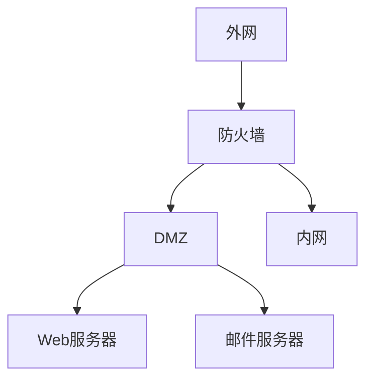
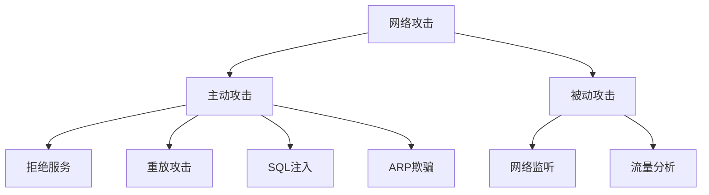

# chapter 12 - 信息安全

- 适用对象：软件设计师新手备考

# 一、当前整理范围

```text
chapter 12 - 信息安全
├─ 1. 防火墙
│  ├─ 包过滤防火墙
│  ├─ 应用级网关防火墙
│  ├─ 状态检测防火墙
│  ├─ DMZ区域
│  └─ 防火墙功能边界
├─ 2. 病毒与恶意代码
│  ├─ 文件型病毒
│  ├─ 引导型病毒
│  ├─ 宏病毒
│  ├─ 蠕虫病毒
│  ├─ 特洛伊木马
│  └─ 病毒防范措施
├─ 3. 网络攻击
│  ├─ DoS与DDoS
│  ├─ SYN Flooding
│  ├─ ARP攻击
│  ├─ 重放攻击
│  ├─ SQL注入
│  ├─ 网络监听
│  └─ 端口扫描
├─ 4. 网络安全与安全协议
│  ├─ SSL / TLS / HTTPS
│  ├─ SSH
│  ├─ IPSec
│  ├─ PGP / MIME
│  ├─ 漏洞扫描
│  ├─ 入侵检测
│  └─ 安全体系层次
└─ 5. 杂题选讲
   ├─ 访问控制
   ├─ 路由协议
   ├─ Windows用户组
   ├─ IIS身份验证
   ├─ netstat命令
   └─ Web邮件与邮件代理
```

# 二、复习建议

| 轮次 | 目标 | 建议做法 | 关注重点 |
|---|---|---|---|
| 第 1 轮 | 建立安全知识框架 | 先背总表，不急着做题 | 防火墙、病毒、攻击、协议四大块 |
| 第 2 轮 | 能识别题眼 | 每题只圈关键词，如“DMZ”“重放”“443” | 题眼与答案的一一对应 |
| 第 3 轮 | 处理易混题 | 做对照表：SSL/TLS/HTTPS/SSH/IPSec，病毒/木马/蠕虫 | 相似概念区别 |
| 第 4 轮 | 冲刺提分 | 背口诀表 + 刷原题 | 防火墙功能边界、安全协议默认用途 |

# 三、章节笔记

## 总记忆表

| 模块 | 记忆句 |
|---|---|
| 防火墙 | 包过滤看 IP 和端口，代理看应用层；防火墙能过滤、代理、记录，但不能查毒、不能漏洞扫描 |
| DMZ | 保护程度：内网最高，DMZ居中，外网最低；Web 等公共服务器通常放 DMZ |
| 病毒 | 宏病毒看 Macro 和 Word/Excel；木马看“远程控制、主动外连、盗取信息”；蠕虫看网络传播 |
| 网络攻击 | 请求耗尽是 DoS；SYN Flooding 是 DoS；旧报文再发是重放；SQL 注入目标是数据库权限 |
| 网络安全协议 | HTTPS = HTTP + SSL/TLS，默认 443；SSH 是安全远程登录；IPSec 加密 IP 数据报文；PGP 管安全邮件 |
| 漏洞扫描 | 漏洞扫描找系统弱点，不负责发现入侵者 |
| 入侵检测 | IDS 常见技术：专家系统、模型检测、简单匹配 |
| 访问控制 | 核心任务是授权、确定权限、实施权限；审计不是访问控制本身的任务 |
| 路由协议 | RIP、OSPF 是内部网关协议；BGP 是外部网关协议 |
| 常用命令 | netstat 看连接和端口；ipconfig 看 IP；nslookup 查 DNS |

## 防火墙

### 1. 知识点

| 类型 | 工作层次 | 核心特点 | 常考题眼 | 考试答案方向 |
|---|---|---|---|---|
| 包过滤防火墙 | 网络层为主 | 检查源/目的 IP、端口、协议；对用户透明；速度快 | “包过滤”“网络层”“透明” | 不看 MAC，不查毒，不做漏洞扫描 |
| 应用级网关防火墙 | 应用层 | 可检查应用层通信，安全性较高，但效率较低 | “应用层监控和过滤” | 应用级网关 |
| 状态检测防火墙 | 网络层/传输层状态 | 兼顾包过滤速度与代理安全性 | “状态”“连接状态” | 状态检测 |
| DMZ | 网络边界隔离区 | 放置对外公开服务器 | “Web服务器”“公共服务器” | Web 放 DMZ |

### 2. 模板

```text
防火墙保护程度：
内网 > DMZ > 外网

如果题目问“从高到低”：
内网 → DMZ → 外网

如果题目问“从低到高”：
外网 → DMZ → 内网
```



### 3. 例题分析

#### 例 1：包过滤依据

包过滤防火墙检查的是 IP 数据包头部中的字段，如源 IP、目的 IP、源端口、目的端口和协议类型。MAC 地址属于链路层地址，不是包过滤防火墙最典型的过滤依据。

| 题眼 | 判断 |
|---|---|
| 源 IP 地址 | 可以过滤 |
| 源端口号 | 可以过滤 |
| 目的 IP 地址 | 可以过滤 |
| MAC 地址 | 不是典型依据 |

**结论：看到“包过滤依据不包括”，优先选 MAC 地址。**

#### 例 2：防火墙不能做什么

防火墙能做访问控制、包过滤、代理、日志审计，也能隐藏内部网络结构。但防火墙不是杀毒软件，也不是漏洞扫描器。

| 功能 | 防火墙是否具备 |
|---|---|
| 包过滤 | 是 |
| 代理 | 是 |
| 记录访问过程 | 是 |
| 查毒 | 否 |
| 漏洞扫描 | 否 |

### 4. 记忆技巧

```text
包过滤：看地址、看端口、看协议。
代理墙：看应用，安全高，速度慢。
DMZ：公共服务放中间。
防火墙：能挡门，不能治病，不能体检。
```

## 病毒与恶意代码

### 1. 知识点

| 类型 | 典型特征 | 感染对象 / 行为 | 常见题眼 |
|---|---|---|---|
| 文件型病毒 | 感染可执行文件 | EXE、COM | “可执行文件” |
| 引导型病毒 | 感染引导区 | 磁盘引导扇区 | “引导区” |
| 宏病毒 | 利用宏语言传播 | Word、Excel、DOC | “Macro”“Melissa”“DOC” |
| 蠕虫病毒 | 借网络复制传播 | 红色代码、爱虫、熊猫烧香、震网 | “网络传播”“Stuxnet” |
| 特洛伊木马 | 伪装、潜伏、远程控制 | 主动外连、盗取信息 | “未知程序建立连接”“远程控制” |

### 2. 病毒与木马对照

| 比较项 | 病毒 | 木马 |
|---|---|---|
| 核心目的 | 破坏、传播、感染 | 窃取、控制、潜伏 |
| 是否自我复制 | 通常具备 | 通常不强调 |
| 典型现象 | 文件异常、系统异常 | 未知程序试图连接外部主机 |
| 考试关键词 | 传染性、隐蔽性、触发性 | 客户端在攻击者机器，服务端在受害者机器 |

### 3. 记忆技巧

```text
Macro看宏，DOC中招。
Trojan看外连，木马来偷。
Worm会自跑，网络里跑。
病毒有传染，木马重控制。
```

## 网络攻击

### 1. 知识点

| 攻击方式 | 题眼 | 作用 / 目标 | 答案方向 |
|---|---|---|---|
| DoS | 大量请求耗尽资源 | 使系统不能提供服务 | 拒绝服务 |
| DDoS | 多个来源同时攻击 | 分布式拒绝服务 | DDoS |
| SYN Flooding | 大量半连接 | 典型 DoS | SYN Flooding |
| ARP攻击 | 伪造网关 ARP | 数据包不能发到网关 | 网关 ARP 被伪造 |
| 重放攻击 | 发送已接受过的报文 | 破坏认证正确性 | 重放 |
| SQL注入 | 提交数据库查询片段 | 获取数据库权限 | 数据库权限 |
| 网络监听 | 截获通信内容 | 窃听账号、口令 | 数据加密防范 |
| 端口扫描 | 检测开放端口 | 判断远程主机状态 | 端口扫描 |

### 2. 主动攻击与被动攻击

| 类型 | 特点 | 例子 |
|---|---|---|
| 主动攻击 | 会改变系统状态或影响服务 | DoS、重放、篡改、欺骗 |
| 被动攻击 | 主要是窃听和收集信息 | 网络监听、流量分析 |

### 3. Mermaid 关系图



### 4. 记忆技巧

```text
请求打爆是DoS。
老包重发是重放。
假冒网关是ARP。
查开放口是端扫。
拼SQL是注入。
偷听链路靠加密。
```

## 网络安全与安全协议

### 1. 协议总表

| 协议 / 技术 | 作用 | 常考题眼 |
|---|---|---|
| SSL | Web 安全通信基础协议 | “与 TLS 最接近”“HTTPS 基于 SSL” |
| TLS | SSL 后续版本 | “TLS 最接近” |
| HTTPS | HTTP + SSL/TLS | “加密网页”“443端口” |
| SSH | 安全远程登录 | “命令行管理路由器”“远程站点安全连接” |
| IPSec | IP 层安全 | “为 IP 数据报文加密” |
| PGP | 安全电子邮件 | “邮件加密软件” |
| MIME | 多用途互联网邮件扩展 | “邮件附件扩展” |
| RFB | 远程图形控制 | “远程控制” |
| IGMP | 组播管理 | 不是远程登录 |

### 2. 常见协议端口与用途

| 项目 | 结论 |
|---|---|
| HTTP 默认端口 | 80 |
| HTTPS 默认端口 | 443 |
| 安全远程登录 | SSH |
| 不安全远程登录 | Telnet |
| IP 数据报文加密 | IPSec |
| 安全邮件 | PGP、MIME、SSL 可相关 |
| 与安全电子邮件无关 | HTTPS |

### 3. 网络安全体系

| 层次 | 例子 |
|---|---|
| 物理线路安全 | 机房安全、线路保护 |
| 网络安全 | 入侵检测、防火墙 |
| 系统安全 | 漏洞补丁、操作系统安全 |
| 应用安全 | 数据库安全、数据库容灾 |

### 4. 记忆技巧

```text
HTTPS看SSL，端口443。
远程登录要安全，选SSH。
IP报文要加密，选IPSec。
邮件安全看PGP，附件扩展看MIME。
漏洞扫描找漏洞，入侵检测看入侵。
```

## 访问控制、路由与命令

### 1. 访问控制

| 任务 | 是否属于访问控制 |
|---|---|
| 授权 | 是 |
| 确定存取权限 | 是 |
| 实施存取权限 | 是 |
| 审计 | 不是访问控制本身的任务 |

### 2. 路由协议

| 类别 | 协议 |
|---|---|
| 内部网关协议 | RIP、OSPF |
| 外部网关协议 | BGP |
| 非路由协议干扰项 | UDP |

### 3. 常用命令

| 命令 | 作用 |
|---|---|
| ipconfig | 查看或刷新本机 IP 配置 |
| traceroute / tracert | 跟踪路由 |
| netstat | 查看网络连接、端口、路由表 |
| nslookup | 查询 DNS 解析 |

# 四、按专题插入原题与解析

## 专题一：防火墙

### 题 1：包过滤防火墙的过滤依据

**原题**  
包过滤防火墙对数据包的过滤依据不包括（8）。

- A. 源IP地址
- B. 源端口号
- C. MAC地址
- D. 目的IP地址

**解析**  
先抓题眼：题目问“不包括”。包过滤主要看网络层/传输层字段，如源IP、目的IP、端口和协议；MAC地址属于链路层地址，不是包过滤防火墙常见依据。

**正确答案**  
C

**答案方向**  
看到“包过滤依据不包括”，优先排除 MAC 地址。

---
### 题 2：DMZ保护程度从高到低

**原题**  
防火墙通常分为内网、外网和DMZ三个区域，按照受保护程度，从高到低正确的排列次序为（8）。

- A. 内网、外网和DMZ
- B. 外网、内网和DMZ
- C. DMZ、内网和外网
- D. 内网、DMZ和外网

**解析**  
先抓题眼：内网最需要保护，DMZ放对外公共服务器，外网最不受保护。因此从高到低是内网、DMZ、外网。

**正确答案**  
D

**答案方向**  
高到低：内网 → DMZ → 外网；低到高反过来。

---
### 题 3：防火墙工作层次

**原题**  
防火墙的工作层次是决定防火墙效率及安全的主要因素，以下叙述中，正确的是（8）。

- A. 防火墙工作层次越低，工作效率越高，安全性越高
- B. 防火墙工作层次越低，工作效率越低，安全性越低
- C. 防火墙工作层次越高，工作效率越高，安全性越低
- D. 防火墙工作层次越高，工作效率越低，安全性越高

**解析**  
先抓题眼：层次越低，检查内容越少，速度越快，但安全性较低；层次越高，检查内容越细，安全性更高，但效率降低。

**正确答案**  
D

**答案方向**  
效率和安全性常反向：低层快但粗，高层慢但细。

---
### 题 4：包过滤与代理服务

**原题**  
以下关于包过滤防火墙和代理服务防火墙的叙述中，正确的是（9）。

- A. 包过滤技术实现成本较高，所以安全性能高
- B. 包过滤技术对应用和用户是透明的
- C. 代理服务技术安全性较高，可以提高网络整体性能
- D. 代理服务技术只能配置成用户认证后才建立连接

**解析**  
先抓题眼：包过滤直接检查并转发数据包，对应用和用户透明；代理服务安全性较高但处理开销大，通常会降低整体性能。

**正确答案**  
B

**答案方向**  
包过滤：透明、快、粗；代理：安全、慢、细。

---
### 题 5：DMZ中放置的服务器

**原题**  
网络系统中，通常把（7）置于DMZ区。

- A. 网络管理服务器
- B. Web服务器
- C. 入侵检测服务器
- D. 财务管理服务器

**解析**  
先抓题眼：DMZ用于放置需要对外提供服务、但又不能直接放在内网中的公共服务器，如Web服务器、邮件服务器。

**正确答案**  
B

**答案方向**  
看到 DMZ，优先想到 Web、Mail 等公共服务器。

---
### 题 6：防火墙不具备的功能

**原题**  
防火墙不具备（8）功能。

- A. 记录访问过程
- B. 查毒
- C. 包过滤
- D. 代理

**解析**  
先抓题眼：防火墙可以记录访问过程、进行包过滤和代理，但杀毒是防病毒软件的任务。

**正确答案**  
B

**答案方向**  
防火墙不是杀毒软件。

---
### 题 7：防火墙功能边界

**原题**  
以下关于防火墙功能特性的叙述中，不正确的是（11）。

- A. 控制进出网络的数据包和数据流向
- B. 提供流量信息的日志和审计
- C. 隐藏内部IP以及网络结构细节
- D. 提供漏洞扫描功能

**解析**  
先抓题眼：防火墙可以控制流量、记录日志、隐藏内部结构，但不负责漏洞扫描。

**正确答案**  
D

**答案方向**  
看到“漏洞扫描”，优先想到漏洞扫描系统，不是防火墙。

---
### 题 8：应用级网关防火墙

**原题**  
（7）防火墙是内部网和外部网的隔离点，它可对应用层的通信数据流进行监控和过滤。

- A. 包过滤
- B. 应用级网关
- C. 数据库
- D. Web

**解析**  
先抓题眼：题眼是“应用层的通信数据流”。应用层监控和过滤对应应用级网关防火墙。

**正确答案**  
B

**答案方向**  
看到应用层过滤，选应用级网关。

---
### 题 9：包过滤检查层次

**原题**  
包过滤防火墙对（10）的数据报文进行检查。

- A. 应用层
- B. 物理层
- C. 网络层
- D. 链路层

**解析**  
先抓题眼：包过滤防火墙主要检查IP数据包，典型工作层次是网络层。

**正确答案**  
C

**答案方向**  
包过滤 = 网络层数据报文。

---
### 题 10：DMZ保护程度从低到高

**原题**  
防火墙通常分为内网、外网和DMZ三个区域，按照受保护程度，从低到高正确的排列次序为（11）。

- A. 内网、外网和DMZ
- B. 外网、DMZ和内网
- C. DMZ、内网和外网
- D. 内外、DMZ和外网

**解析**  
先抓题眼：保护程度从低到高为外网、DMZ、内网。

**正确答案**  
B

**答案方向**  
低到高：外网 → DMZ → 内网。

---

## 专题二：病毒与恶意代码

### 题 11：特洛伊木马典型现象

**原题**  
计算机感染特洛伊木马后的典型现象是（9）。

- A. 程序异常退出
- B. 有未知程序试图建立网络连接
- C. 邮箱被垃圾邮件填满
- D. Windows系统黑屏

**解析**  
先抓题眼：木马的典型行为是潜伏并与外部攻击者建立连接，便于远程控制和盗取信息。

**正确答案**  
B

**答案方向**  
木马题眼：未知程序外连、远程控制、盗取信息。

---
### 题 12：Macro.Melissa病毒类型

**原题**  
杀毒软件报告发现病毒Macro.Melissa，由该病毒名称可以推断病毒类型是（8），这类病毒主要感染目标是（9）。

- A. 文件型；EXE或COM可执行文件
- B. 引导型；磁盘引导区
- C. 目录型；DLL系统文件
- D. 宏病毒；Word或Excel文件

**解析**  
先抓题眼：Macro 表示宏病毒。宏病毒常感染 Word、Excel 等带宏功能的文档。

**正确答案**  
D

**答案方向**  
看到 Macro，选宏病毒；目标是 Word/Excel。

---
### 题 13：宏病毒感染对象

**原题**  
宏病毒一般感染以（8）为扩展名的文件。

- A. EXE
- B. COM
- C. DOC
- D. DLL

**解析**  
先抓题眼：宏病毒依附于办公文档中的宏语言，典型扩展名是DOC。

**正确答案**  
C

**答案方向**  
宏病毒：DOC、Word、Excel。

---
### 题 14：主动外连的恶意代码

**原题**  
通过内部发起连接与外部主机建立联系，由外部主机控制并盗取用户信息的恶意代码为（8）。

- A. 特洛伊木马
- B. 蠕虫病毒
- C. 宏病毒
- D. CIH病毒

**解析**  
先抓题眼：题眼是“外部主机控制”“盗取用户信息”。这正是木马程序的典型目的。

**正确答案**  
A

**答案方向**  
外连 + 控制 + 盗取 = 木马。

---
### 题 15：手机木马病毒

**原题**  
近年来，在我国出现各类病毒中，（9）病毒通过木马形式感染智能手机。

- A. 欢乐时光
- B. 熊猫烧香
- C. X卧底
- D. CIH

**解析**  
先抓题眼：X卧底常作为手机木马相关考点出现。

**正确答案**  
C

**答案方向**  
手机木马题眼：X卧底。

---
### 题 16：木马程序叙述

**原题**  
以下关于木马程序的叙述中，正确的是（7）。

- A. 木马程序主要通过移动磁盘传播
- B. 木马程序的客户端运行在攻击者的机器上
- C. 木马程序的目的是使计算机或网络无法提供正常的服务
- D. Sniffer是典型的木马程序

**解析**  
先抓题眼：木马通常分为控制端和被控端，攻击者机器上运行客户端，受害者机器上运行服务端。

**正确答案**  
B

**答案方向**  
木马：攻击者是客户端，受害者是服务端。

---
### 题 17：不是蠕虫病毒

**原题**  
（9）不是蠕虫病毒。

- A. 熊猫烧香
- B. 红色代码
- C. 冰河
- D. 爱虫病毒

**解析**  
先抓题眼：熊猫烧香、红色代码、爱虫病毒常按蠕虫类记忆；冰河是典型木马。

**正确答案**  
C

**答案方向**  
冰河是木马，不是蠕虫。

---
### 题 18：病毒特征

**原题**  
计算机病毒的特征不包括（8）。

- A. 传染性
- B. 触发性
- C. 隐蔽性
- D. 自毁性

**解析**  
先抓题眼：病毒常见特征包括传染性、破坏性、隐蔽性、潜伏性、触发性等，自毁性不是常规特征。

**正确答案**  
D

**答案方向**  
病毒特征不背“自毁性”。

---
### 题 19：震网病毒类型

**原题**  
震网（Stuxnet）病毒是一种破坏工业基础设施的恶意代码，利用系统漏洞攻击工业控制系统，是一种危害性极大的（11）。

- A. 引导区病毒
- B. 宏病毒
- C. 木马病毒
- D. 蠕虫病毒

**解析**  
先抓题眼：Stuxnet 常作为蠕虫病毒考点记忆。

**正确答案**  
D

**答案方向**  
震网 = 工控系统 = 蠕虫。

---
### 题 20：防病毒策略

**原题**  
以下可以有效防止计算机病毒的策略是（7）。

- A. 部署防火墙
- B. 部署入侵监测系统
- C. 安装并及时升级防病毒软件
- D. 定期备份数据文件

**解析**  
先抓题眼：防病毒最直接有效的措施是安装并及时更新防病毒软件。备份可降低损失，但不是直接防止感染。

**正确答案**  
C

**答案方向**  
防病毒：装杀毒软件并及时升级。

---

## 专题三：网络攻击

### 题 21：拒绝服务攻击

**原题**  
如果使用大量的连接请求攻击计算机，使得所有可用的系统资源都被消耗殆尽，最终计算机无法再处理合法用户的请求，这种手段属于（7）攻击。

- A. 拒绝服务
- B. 口令入侵
- C. 网络监听
- D. IP欺骗

**解析**  
先抓题眼：题眼是“大量连接请求”“资源耗尽”“无法处理合法请求”。这是拒绝服务攻击。

**正确答案**  
A

**答案方向**  
耗尽资源导致不能服务 = DoS。

---
### 题 22：ARP攻击原因

**原题**  
ARP攻击造成网络无法跨网段通信的原因是（8）。

- A. 发送大量ARP报文造成网络拥塞
- B. 伪造网关ARP报文使得数据包无法发送到网关
- C. ARP攻击破坏了网络的物理连通性
- D. ARP攻击破坏了网关设备

**解析**  
先抓题眼：ARP攻击常通过伪造网关MAC地址，使主机把数据发到错误位置，导致无法正常到达网关。

**正确答案**  
B

**答案方向**  
ARP攻击题眼：伪造网关ARP。

---
### 题 23：DoS攻击类型

**原题**  
下列网络攻击行为中，属于DoS攻击的是（7）。

- A. 特洛伊木马攻击
- B. SYN Flooding攻击
- C. 端口欺骗攻击
- D. IP欺骗攻击

**解析**  
先抓题眼：SYN Flooding通过大量半连接消耗服务器资源，是典型DoS攻击。

**正确答案**  
B

**答案方向**  
SYN Flooding = DoS 高频考点。

---
### 题 24：拒绝服务攻击错误叙述

**原题**  
以下关于拒绝服务攻击的叙述中，不正确的是（8）。

- A. 拒绝服务攻击的目的是使计算机或者网络无法提供正常的服务
- B. 拒绝服务攻击是不断向计算机发起请求来实现的
- C. 拒绝服务攻击会造成用户密码的泄漏
- D. DDoS是一种拒绝服务攻击形式

**解析**  
先抓题眼：DoS的目标是让服务不可用，不是直接窃取密码。

**正确答案**  
C

**答案方向**  
DoS = 拒绝服务，不等于泄露密码。

---
### 题 25：远程主机状态检测

**原题**  
为了攻击远程主机，通常利用（9）技术检测远程主机状态。

- A. 病毒查杀
- B. 端口扫描
- C. QQ聊天
- D. 身份认证

**解析**  
先抓题眼：攻击前常用端口扫描发现开放端口和服务状态。

**正确答案**  
B

**答案方向**  
检测开放端口和服务 = 端口扫描。

---
### 题 26：不属于入侵检测技术

**原题**  
（10）不属于入侵检测技术。

- A. 专家系统
- B. 模型检测
- C. 简单匹配
- D. 漏洞扫描

**解析**  
先抓题眼：入侵检测技术包括专家系统、模型检测、简单匹配等；漏洞扫描是发现弱点，不是入侵检测技术。

**正确答案**  
D

**答案方向**  
漏洞扫描找漏洞，入侵检测看入侵行为。

---
### 题 27：重放攻击

**原题**  
攻击者通过发送一个目的主机已经接受过的报文来达到攻击目的，这种攻击方式属于（11）攻击。

- A. 重放
- B. 拒绝服务
- C. 数据截获
- D. 数据流分析

**解析**  
先抓题眼：题眼是“已经接受过的报文再次发送”。这就是重放攻击。

**正确答案**  
A

**答案方向**  
旧报文再发 = 重放。

---
### 题 28：Kerberos防重放

**原题**  
Kerberos系统中可通过在报文中加入（9）来防止重放攻击。

- A. 会话密钥
- B. 时间戳
- C. 用户ID
- D. 私有密钥

**解析**  
先抓题眼：重放攻击利用旧报文，时间戳可以判断报文是否过期，从而防止旧报文重复使用。

**正确答案**  
B

**答案方向**  
防重放：时间戳。

---
### 题 29：以不能服务为目标

**原题**  
下列攻击类型中，（8）是以被攻击对象不能继续提供服务为首要目标。

- A. 跨站脚本
- B. 拒绝服务
- C. 信息篡改
- D. 口令猜测

**解析**  
先抓题眼：题目直接描述“不能继续提供服务”，对应拒绝服务攻击。

**正确答案**  
B

**答案方向**  
不能提供服务 = 拒绝服务。

---
### 题 30：SQL注入首要目标

**原题**  
SQL是一种数据库结构化查询语言，SQL注入攻击的首要目标是（10）。

- A. 破坏Web服务
- B. 窃取用户口令等机密信息
- C. 攻击用户浏览器，以获得访问权限
- D. 获得数据库的权限

**解析**  
先抓题眼：SQL注入通过构造SQL语句与数据库交互，首要落点是获得数据库权限；之后才可能进一步窃取、修改数据。

**正确答案**  
D

**答案方向**  
SQL注入先打数据库权限。

---

## 专题四：网络安全与安全协议

### 题 31：漏洞扫描系统错误叙述

**原题**  
下面关于漏洞扫描系统的叙述，错误的是（7）。

- A. 漏洞扫描系统是一种自动检测目标主机安全弱点的程序
- B. 黑客利用漏洞扫描系统可以发现目标主机的安全漏洞
- C. 漏洞扫描系统可以用于发现网络入侵者
- D. 漏洞扫描系统的实现依赖于系统漏洞库的完善

**解析**  
先抓题眼：漏洞扫描系统用于发现安全弱点，不是用于发现网络入侵者。发现入侵是入侵检测系统的任务。

**正确答案**  
C

**答案方向**  
漏洞扫描找漏洞，入侵检测找入侵。

---
### 题 32：数据库容灾所属层次

**原题**  
网络安全体系设计可从物理线路安全、网络安全、系统安全、应用安全等方面来进行，其中，数据库容灾属于（7）。

- A. 物理线路安全和网络安全
- B. 应用安全和网络安全
- C. 系统安全和网络安全
- D. 系统安全和应用安全

**解析**  
先抓题眼：数据库既运行在系统平台之上，也属于应用数据安全的重要对象，因此数据库容灾归入系统安全和应用安全。

**正确答案**  
D

**答案方向**  
数据库相关题通常落到应用安全，也可涉及系统安全。

---
### 题 33：防范网络监听

**原题**  
下列选项中，防范网络监听最有效的方法是（9）。

- A. 安装防火墙
- B. 采用无线网络传输
- C. 数据加密
- D. 漏洞扫描

**解析**  
先抓题眼：网络监听的本质是窃听传输内容。即使被截获，只要数据已加密，也难以获得明文。

**正确答案**  
C

**答案方向**  
防窃听最有效：加密。

---
### 题 34：IE安全区域

**原题**  
在IE浏览器中，安全级别最高的区域设置是（9）。

- A. Internet
- B. 本地Intranet
- C. 可信站点
- D. 受限站点

**解析**  
先抓题眼：受限站点区域限制最多，安全级别最高。

**正确答案**  
D

**答案方向**  
IE区域安全级别：受限站点最高。

---
### 题 35：获取FTP可写目录信息

**原题**  
利用（7）可以获取某FTP服务器中是否存在可写目录的信息。

- A. 防火墙系统
- B. 漏洞扫描系统
- C. 入侵检测系统
- D. 病毒防御系统

**解析**  
先抓题眼：可写目录属于安全弱点，应用漏洞扫描系统检测。

**正确答案**  
B

**答案方向**  
发现目标主机弱点 = 漏洞扫描。

---
### 题 36：Windows最低默认权限组

**原题**  
在Windows系统中，默认权限最低的用户组是（8）。

- A. everyone
- B. administrators
- C. power users
- D. users

**解析**  
先抓题眼：Administrators权限最高，Power Users次之，Users为普通用户组，默认权限较低。考试通常将Users作为默认权限最低的用户组处理。

**正确答案**  
D

**答案方向**  
Windows用户组权限：管理员最高，普通用户最低。

---
### 题 37：IIS身份验证安全级别

**原题**  
IIS6.0支持的身份验证安全机制有4种验证方法，其中安全级别最高的验证方法是（9）。

- A. 匿名身份验证
- B. 集成Windows身份验证
- C. 基本身份验证
- D. 摘要式身份验证

**解析**  
先抓题眼：匿名安全性最低，基本身份验证安全性较弱；集成Windows身份验证安全级别较高。

**正确答案**  
B

**答案方向**  
IIS安全身份验证优先记集成Windows身份验证。

---
### 题 38：TLS最接近协议

**原题**  
下列安全协议中，与TLS最接近的协议是（7）。

- A. PGP
- B. SSL
- C. HTTPS
- D. IPSec

**解析**  
先抓题眼：TLS是SSL的后续版本，两者最接近。

**正确答案**  
B

**答案方向**  
TLS ≈ SSL。

---
### 题 39：安全远程连接

**原题**  
（7）协议在终端设备与远程站点之间建立安全连接。

- A. ARP
- B. Telnet
- C. SSH
- D. WEP

**解析**  
先抓题眼：SSH用于安全远程登录和安全命令行管理。

**正确答案**  
C

**答案方向**  
安全远程登录 = SSH。

---
### 题 40：SSL加密网页

**原题**  
传输经过SSL加密的网页所采用的协议是（8）。

- A. HTTP
- B. HTTPS
- C. S-HTTP
- D. HTTP-S

**解析**  
先抓题眼：HTTPS是在HTTP基础上加入SSL/TLS加密的安全Web协议。

**正确答案**  
B

**答案方向**  
SSL加密网页 = HTTPS。

---
### 题 41：HTTPS封装协议

**原题**  
HTTPS使用（7）协议对报文进行封装。

- A. SSH
- B. SSL
- C. SHA-1
- D. SET

**解析**  
先抓题眼：HTTPS通常基于SSL/TLS实现安全封装。

**正确答案**  
B

**答案方向**  
HTTPS 基于 SSL/TLS。

---
### 题 42：HTTPS基础与端口

**原题**  
与HTTP相比，HTTPS协议对传输的内容进行加密，更加安全。HTTPS基于（7）安全协议，其默认端口是（8）。

- A. SSL，443
- B. DES，80
- C. SSH，8080
- D. RSA，1023

**解析**  
先抓题眼：HTTPS基于SSL/TLS，默认端口号为443。

**正确答案**  
A

**答案方向**  
HTTPS = SSL/TLS + 443。

---
### 题 43：路由器安全管理

**原题**  
网络管理员通过命令行方式对路由器进行管理，需要确保ID、口令和会话内容的保密性，应采取的访问方式是（7）。

- A. 控制台
- B. AUX
- C. TELNET
- D. SSH

**解析**  
先抓题眼：Telnet明文传输，不安全；SSH能加密会话内容。

**正确答案**  
D

**答案方向**  
安全命令行远程管理 = SSH。

---
### 题 44：内防内控策略

**原题**  
在网络安全管理中，加强内防内控可采取的策略有（10）：①控制终端接入数量；②终端访问授权，防止合法终端越权访问；③加强终端的安全检查与策略管理；④加强员工上网行为管理与违规审计。

- A. ②③
- B. ②④
- C. ①②③④
- D. ②③④

**解析**  
先抓题眼：内防内控既包括终端接入控制、访问授权，也包括终端安全检查和员工行为审计。

**正确答案**  
C

**答案方向**  
内防内控题看到多项均合理，通常全选。

---
### 题 45：安全电子邮箱无关协议

**原题**  
下述协议中与安全电子邮箱服务无关的是（8）。

- A. SSL
- B. HTTPS
- C. MIME
- D. PGP

**解析**  
先抓题眼：PGP用于邮件加密，MIME用于邮件扩展，SSL可用于邮件传输安全；HTTPS主要服务Web访问，与安全电子邮箱服务无直接关系。

**正确答案**  
B

**答案方向**  
安全邮件：PGP、MIME、SSL；无关常选HTTPS。

---
### 题 46：安全远程登录协议

**原题**  
下列协议中，属于安全远程登录协议的是（7）。

- A. TLS
- B. TCP
- C. SSH
- D. TFTP

**解析**  
先抓题眼：SSH是安全远程登录协议。

**正确答案**  
C

**答案方向**  
远程登录 + 安全 = SSH。

---
### 题 47：IP报文加密

**原题**  
通常使用（11）为IP数据报文进行加密。

- A. IPSec
- B. PP2P
- C. HTTPS
- D. TLS

**解析**  
先抓题眼：IPSec工作在IP层，用于保护IP数据报文。

**正确答案**  
A

**答案方向**  
IP层加密 = IPSec。

---
### 题 48：不能远程登录或控制

**原题**  
下列不能用于远程登录或控制的是（9）。

- A. IGMP
- B. SSH
- C. Telnet
- D. RFB

**解析**  
先抓题眼：SSH和Telnet可远程登录，RFB用于远程图形控制；IGMP是组播管理协议。

**正确答案**  
A

**答案方向**  
IGMP不是远程登录/控制协议。

---

## 专题五：杂题选讲

### 题 49：Outlook Express错误说法

**原题**  
Outlook Express作为邮件代理软件有诸多优点，以下说法中，错误的是（7）。

- A. 可以脱机处理邮件
- B. 可以管理多个邮件账号
- C. 可以使用通讯簿存储和检索电子邮件地址
- D. 不能发送和接收安全邮件

**解析**  
先抓题眼：Outlook Express可以进行常见邮件管理，也可配合相关协议发送和接收安全邮件，因此说“不能发送和接收安全邮件”错误。

**正确答案**  
D

**答案方向**  
邮件代理软件基本功能题，绝对化否定常错。

---
### 题 50：Web方式收发邮件

**原题**  
使用Web方式收发电子邮件时，以下描述错误的是（11）。

- A. 无须设置简单邮件传输协议
- B. 可以不设置帐号密码登录
- C. 邮件可以插入多个附件
- D. 未发送邮件可以保存到草稿箱

**解析**  
先抓题眼：Web邮件一般通过浏览器访问，不需要用户手工配置SMTP，但仍需要账号和口令登录。

**正确答案**  
B

**答案方向**  
Web邮件不配SMTP，但仍要账号密码。

---
### 题 51：访问控制任务

**原题**  
访问控制是对信息系统资源进行保护的重要措施。计算机系统中，访问控制的任务不包括（8）。

- A. 审计
- B. 授权
- C. 确定存取权限
- D. 实施存取权限

**解析**  
先抓题眼：访问控制关注授权、确定权限和实施权限；审计属于安全管理和追踪，不是访问控制本身任务。

**正确答案**  
A

**答案方向**  
访问控制不等于审计。

---
### 题 52：外部网关协议

**原题**  
路由协议称为内部网关协议，自治系统之间的协议称为外部网关协议，以下属于外部网关协议的是（9）。

- A. RIP
- B. OSPF
- C. BGP
- D. UDP

**解析**  
先抓题眼：RIP和OSPF属于内部网关协议，BGP用于自治系统之间，是外部网关协议。

**正确答案**  
C

**答案方向**  
外部网关协议 = BGP。

---
### 题 53：完整性

**原题**  
所有资源只能由授权方或以授权的方式进行修改，即信息未经授权不能进行改变的特性是指信息的（10）。

- A. 完整性
- B. 可用性
- C. 保密性
- D. 不可抵赖性

**解析**  
先抓题眼：未经授权不能修改，强调信息不被非法改变，属于完整性。

**正确答案**  
A

**答案方向**  
不能被非法改 = 完整性。

---
### 题 54：查看端口对应程序命令

**原题**  
在Windows操作系统下，要获取某个网络开放端口所对应的应用程序信息，可以使用命令（11）。

- A. ipconfig
- B. traceroute
- C. netstat
- D. nslookup

**解析**  
先抓题眼：netstat可查看网络连接、端口及相关状态信息。

**正确答案**  
C

**答案方向**  
端口和连接信息 = netstat。

---

# 五、本章总结

## 先抓最稳的分

信息安全章节最稳的分来自“名词—用途”对应关系：

| 题眼 | 直接答案 |
|---|---|
| HTTPS 默认端口 | 443 |
| HTTPS 基于 | SSL/TLS |
| 安全远程登录 | SSH |
| IP报文加密 | IPSec |
| 安全邮件 | PGP |
| 邮件附件扩展 | MIME |
| 外部网关协议 | BGP |
| 端口连接状态 | netstat |
| 漏洞弱点检测 | 漏洞扫描 |
| 入侵行为检测 | 入侵检测 |

## 再抓辨析题

| 易混组合 | 区分方法 |
|---|---|
| 防火墙 vs 杀毒软件 | 防火墙管访问控制，杀毒软件管病毒查杀 |
| 防火墙 vs 漏洞扫描 | 防火墙挡流量，漏洞扫描找弱点 |
| 漏洞扫描 vs 入侵检测 | 扫描找漏洞，检测看入侵 |
| 木马 vs 蠕虫 | 木马重控制和盗取，蠕虫重自传播 |
| HTTPS vs SSH | HTTPS保护网页访问，SSH保护远程登录 |
| PGP vs MIME | PGP加密邮件，MIME扩展邮件内容类型 |
| DoS vs SQL注入 | DoS让服务不可用，SQL注入攻击数据库 |

## 最后处理零散题

零散题不要硬背大段概念，建议按“关键词触发”处理：

```text
受限站点 → IE安全级别最高
Users → Windows普通低权限组
集成Windows身份验证 → IIS安全级别较高
审计 → 不属于访问控制本身任务
完整性 → 未授权不能修改
外网DMZ内网 → 低到高
内网DMZ外网 → 高到低
```

## 冲刺版口诀总表

```text
防火墙
包过滤，看IP，看端口，不看MAC。
层次低，效率高，安全低。
层次高，效率低，安全高。
内网最安全，DMZ放Web，外网最低。
防火墙能过滤能代理能记录，不能查毒不能扫漏洞。

病毒
Macro是宏，DOC中招。
EXE COM看文件型，引导扇区看引导型。
木马外连偷信息，客户端在攻击者。
冰河是木马，不是蠕虫。
震网是蠕虫，工控危害大。
防病毒最直接，杀毒软件要升级。

攻击
请求打爆是DoS，SYN Flooding也算DoS。
旧报文再发送，名字叫重放。
Kerberos防重放，时间戳来帮忙。
伪造网关是ARP，跨网段会失败。
查端口是扫描，拼SQL打数据库。
监听怕加密，加密防窃听。

协议
HTTPS等于HTTP加SSL，默认端口443。
TLS是SSL后续版。
安全登录用SSH，明文Telnet不安全。
IP报文加密找IPSec。
PGP管邮件加密，MIME管邮件扩展。
RIP OSPF是内部，BGP是外部。

杂项
漏洞扫描找弱点，入侵检测看行为。
访问控制管授权，不把审计当本体。
完整性防篡改，保密性防泄露，可用性防中断。
netstat查连接端口，nslookup查域名解析。
```
