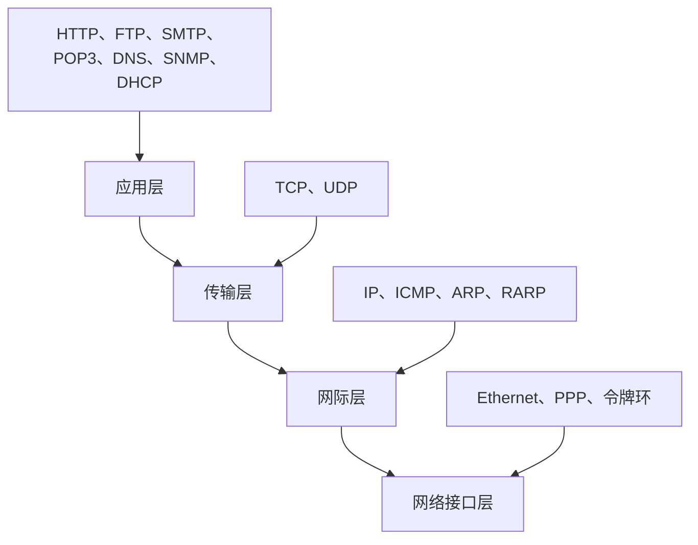
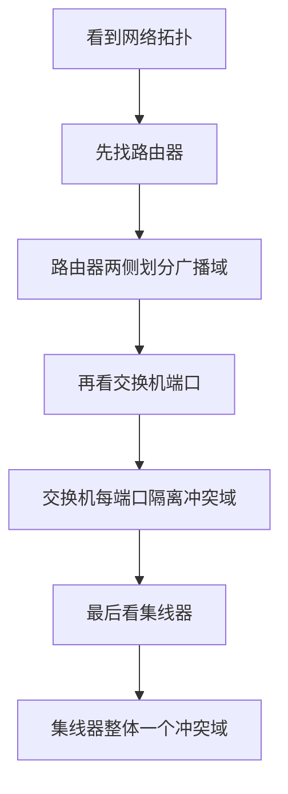
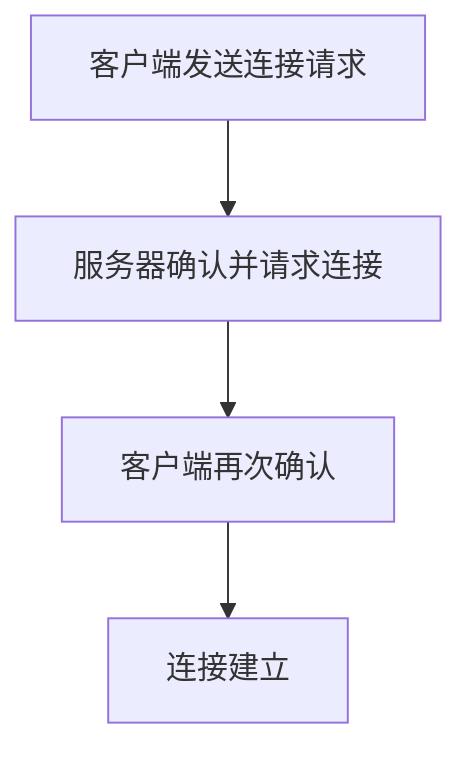
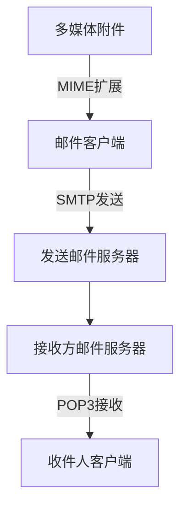
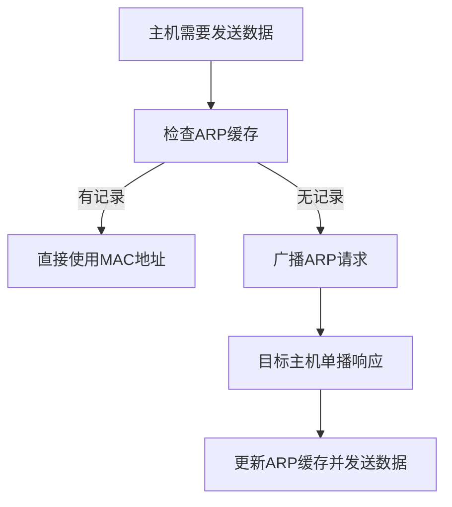
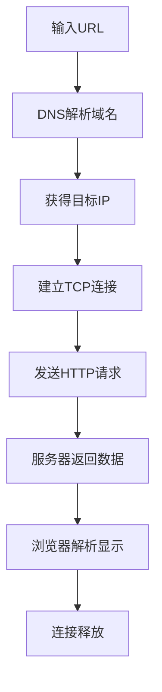
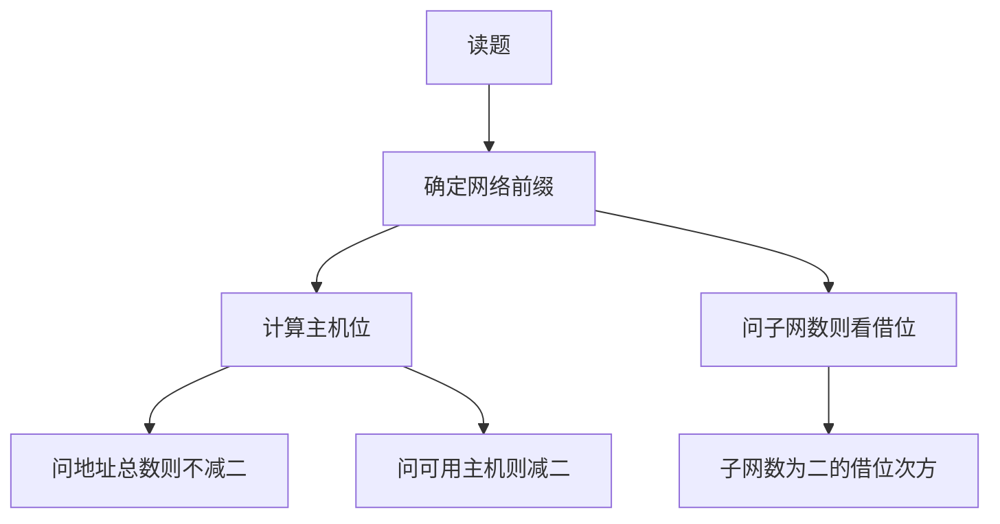

# chapter 13 - 计算机网络

适用对象：软件设计师新手备考  
# 一、当前整理范围

```text
chapter 13 - 计算机网络
├─ 1. 网络体系结构与分层模型
│  ├─ OSI 七层模型
│  ├─ TCP/IP 四层模型
│  ├─ OSI 与 TCP/IP 的对应关系
│  └─ 协议封装与层次判断
├─ 2. 网络互连设备
│  ├─ 物理层：中继器、集线器
│  ├─ 数据链路层：网桥、交换机
│  ├─ 网络层：路由器
│  ├─ 应用层：网关
│  └─ 冲突域、广播域划分
├─ 3. TCP/IP 协议簇
│  ├─ IP、ICMP、ARP、RARP
│  ├─ TCP 与 UDP
│  ├─ FTP、HTTP、HTTPS、Telnet
│  ├─ SMTP、POP3、IMAP、MIME
│  ├─ DNS、DHCP、SNMP、TFTP
│  └─ 常见端口号
├─ 4. Internet 应用
│  ├─ URL 结构
│  ├─ 域名层次与顶级域
│  ├─ 浏览器访问网页过程
│  ├─ DNS 查询与缓存
│  └─ 无痕浏览常见考点
├─ 5. IP 地址与子网划分
│  ├─ IPv4 地址分类
│  ├─ CIDR 与斜杠记法
│  ├─ 子网数与主机数计算
│  ├─ 网络地址、广播地址、可用地址
│  ├─ 路由表最长前缀匹配
│  └─ 默认网关与同网段判断
├─ 6. IPv6 与无线网络
│  ├─ IPv6 地址长度
│  ├─ IPv6 地址空间
│  ├─ 蓝牙、WiFi、ZigBee、WiMAX
│  └─ 覆盖范围与通信距离判断
├─ 7. Windows 网络命令
│  ├─ ipconfig
│  ├─ ipconfig /all
│  ├─ ipconfig /flushdns
│  ├─ ipconfig /release
│  ├─ ipconfig /renew
│  └─ netstat、arp、tracert、nslookup
└─ 8. 网络工程与综合应用
   ├─ PPP、PPPoE、CHAP
   ├─ VLAN、NAT、VPN
   ├─ 层次化网络设计
   ├─ SNMP 管理模型
   ├─ 异步通信有效数据率
   ├─ 网络系统设计目标取舍
   └─ 支付网关
```

# 二、复习建议

| 轮次 | 目标 | 建议做法 | 关注重点 |
|---|---|---|---|
| 第 1 轮 | 建立网络分层框架 | 先背 OSI、TCP/IP、设备、协议所在层 | 看到“路由器、交换机、集线器、网关”能立刻判断层次 |
| 第 2 轮 | 背熟协议和端口 | 把 FTP、HTTP、DNS、SMTP、POP3、SNMP、DHCP、TFTP 做成速记表 | 端口号、TCP/UDP、发送/接收邮件、域名解析 |
| 第 3 轮 | 训练计算题 | 每天做 5 道子网划分和路由匹配题 | `/n` 中主机位、可用主机数减 2、最长前缀匹配 |
| 第 4 轮 | 原题回看与错题归因 | 按专题复盘原题，不按年份记 | 把“题眼”写在题目前：如“控制端口”“广播请求”“默认协议” |

# 三、章节笔记

## 总记忆表

| 模块 | 记忆句 |
|---|---|
| 分层模型 | OSI 七层从上到下：应表会传网数物；TCP/IP 常考四层：应用、传输、网际、网络接口。 |
| 设备层次 | 中继器、集线器在物理层；网桥、交换机在数据链路层；路由器在网络层；网关常按应用层理解。 |
| 冲突域与广播域 | 集线器不隔离；交换机隔离冲突域不隔离广播域；路由器隔离广播域。 |
| TCP | 面向连接、可靠、三次握手、可变滑动窗口、首部开销较大。 |
| UDP | 无连接、不可靠、开销小，常用于 VoIP、DNS、DHCP、SNMP、TFTP 等。 |
| 邮件协议 | SMTP 发邮件 25；POP3 收邮件 110；多媒体附件靠 MIME。 |
| ARP | IP 找 MAC：请求广播，响应单播。RARP：MAC 找 IP。 |
| DHCP | 自动分配 IP、网关、DNS 等；Windows 获取失败常见 169.254.X.X。 |
| URL | `协议://主机名.域名/路径/文件名`，浏览器输入域名默认 HTTP。 |
| DNS | 域名解析为 IP；排除 DNS 缓存故障用 `ipconfig /flushdns`。 |
| 子网划分 | 子网数看借了几位；主机数看剩几位；可用主机数通常减 2。 |
| IPv6 | IPv6 地址 128 bit，地址空间是 IPv4 的 $2^{96}$ 倍。 |
| 无线网络 | 蓝牙通常覆盖范围最小、通信距离最短。 |
| 网络设计 | 多目标不能同时最优，应优先满足优先级较高目标。 |

## 1. 网络体系结构与分层模型

### 1. 知识点

| 模型 | 层次 | 主要功能 | 考试判断方式 |
|---|---|---|---|
| OSI 七层 | 应用层 | 面向具体应用服务 | HTTP、FTP、SMTP、POP3、DNS、SNMP 等多归到这里 |
| OSI 七层 | 表示层 | 数据表示、加密、压缩、格式转换 | 上午题较少直接考 |
| OSI 七层 | 会话层 | 会话建立、管理、释放 | 常作为干扰项 |
| OSI 七层 | 传输层 | 端到端通信、端口寻址、可靠传输 | TCP、UDP 位于传输层 |
| OSI 七层 | 网络层 | 路由选择、逻辑地址、分组转发 | IP、ICMP、ARP、RARP、路由器 |
| OSI 七层 | 数据链路层 | 成帧、MAC 地址、差错检测、介质访问 | 交换机、网桥、以太网帧 |
| OSI 七层 | 物理层 | 比特传输、电气机械特性 | 中继器、集线器 |
| TCP/IP 模型 | 应用层 | 合并 OSI 应用层、表示层、会话层 | FTP、HTTP、SMTP 等 |
| TCP/IP 模型 | 传输层 | TCP、UDP | 端口和端到端进程通信 |
| TCP/IP 模型 | 网际层 | IP、ICMP、ARP、RARP | 网络间寻址和转发 |
| TCP/IP 模型 | 网络接口层 | 以太网、令牌环、PPP 等 | 负责把 IP 数据报发到物理网络 |

### 2. 文字讲解

计算机网络题最忌讳“看到协议就孤立背”。分层模型的价值在于：每一层只解决一类问题。物理层只管比特能不能传出去，不理解 MAC 地址和 IP 地址；数据链路层开始处理同一链路上的帧和 MAC；网络层解决跨网络转发，所以路由器、IP、ICMP、ARP 常落在这一层；传输层面向进程通信，所以一出现“端口”“三次握手”“可靠传输”，就应想到 TCP 或 UDP；应用层则是直接为用户应用服务，如网页、邮件、文件传输、域名解析、网络管理。

OSI 七层模型在考试中常用来考“对应关系”。TCP/IP 模型则更贴近实际协议簇。题目若问“TCP/IP 协议栈中某协议属于哪一层”，不要机械套 OSI 七层，而应按 TCP/IP 四层理解：TCP/UDP 是传输层，IP/ICMP/ARP/RARP 是网际层，FTP/HTTP/SMTP/POP3/DNS/DHCP/SNMP 多数按应用层处理。

### 3. 协议层次图



### 4. 例题分析

#### 例 1：ICMP 属于哪一层，封装在哪里

**题眼**：ICMP 是“因特网控制报文协议”，用于网络控制和差错报告。  
**套知识点**：ICMP 属于 TCP/IP 的网际层，ICMP 报文封装在 IP 数据报中传送。  
**结论**：层次选网络层，封装选 IP 数据报。

#### 例 2：SNMP 属于应用层还是网络层

**题眼**：SNMP 是简单网络管理协议，虽然管理网络设备，但它是应用层协议。  
**套知识点**：SNMP 通常使用 UDP 封装，常见端口 161。  
**结论**：SNMP 属于应用层，传输层多选 UDP。

### 5. 记忆技巧

```text
层次判断三步走：
看设备：集线中继物理层，网桥交换链路层，路由器在网络层。
看协议：IP/ICMP/ARP在网际层，TCP/UDP在传输层，其余常用服务多在应用层。
看功能：端口是传输层，路由是网络层，MAC是数据链路层，比特是物理层。
```

## 2. 网络互连设备、冲突域与广播域

### 1. 知识点

| 设备 | 所在层 | 作用 | 是否隔离冲突域 | 是否隔离广播域 | 常见题眼 |
|---|---|---|---|---|---|
| 中继器 | 物理层 | 放大、再生信号 | 否 | 否 | 物理层设备 |
| 集线器 | 物理层 | 多端口中继器 | 否 | 否 | 所有端口一个冲突域 |
| 网桥 | 数据链路层 | 根据 MAC 地址转发帧 | 是 | 否 | 数据链路层设备 |
| 交换机 | 数据链路层 | 多端口网桥 | 是 | 否 | 每端口一个冲突域 |
| 路由器 | 网络层 | 根据 IP 地址转发分组 | 是 | 是 | 划分广播域 |
| 网关 | 应用层常考 | 协议转换 | 视情况 | 视情况 | 异构网络互联 |

### 2. 文字讲解

网络设备题的核心不是背设备名称，而是理解“设备看到的数据单位”。集线器只在物理层工作，它看到的是电信号或比特流，不认识帧地址，也不会智能转发。因此，集线器收到一个端口的数据后会向其他端口扩散，所有端口仍处在同一个冲突域和广播域内。交换机工作在数据链路层，能够识别 MAC 地址，知道某个 MAC 地址在哪个端口上，因此可把不同端口的冲突隔离开。可是广播帧仍会被交换机转发到同一 VLAN 内的其他端口，所以普通交换机不隔离广播域。路由器工作在网络层，按 IP 网络转发，它不会转发二层广播，因此路由器可以隔离广播域。

很多题会把“交换机是一种多端口网桥”和“集线器是一种多端口中继器”放在一起考。二者形式上都多端口，但层次完全不同：集线器不自动寻址，交换机会学习 MAC 地址；集线器下所有主机争用同一冲突域，交换机每个端口形成独立冲突域。

### 3. 冲突域与广播域判断流程



### 4. 例题分析

#### 例 1：物理层设备与网络层设备

**题眼**：问“属于物理层”和“属于网络层”。  
**套知识点**：中继器、集线器属于物理层；路由器属于网络层；交换机、网桥属于数据链路层。  
**结论**：物理层选中继器，网络层选路由器。

#### 例 2：集线器与交换机描述错误项

**题眼**：题目问“错误的是”。  
**套知识点**：交换机是多端口网桥；交换机所有端口默认在一个广播域；集线器所有端口组成一个冲突域；集线器不能自动寻址。  
**结论**：“集线器可以起到自动寻址的作用”错误。

### 5. 记忆技巧

```text
集线器：傻转发，不寻址，不隔离。
交换机：看MAC，隔冲突，不隔广播。
路由器：看IP，隔冲突，也隔广播。
```

## 3. TCP/IP 协议簇与常见端口

### 1. 知识点

| 协议 | 层次 | 使用 TCP/UDP | 常见端口 | 功能 | 高频题眼 |
|---|---|---|---|---|---|
| IP | 网际层 | 无 | 无 | 分组传输、逻辑寻址 | 无连接、不可靠 |
| ICMP | 网际层 | 封装在 IP | 无 | 差错报告、网络控制 | ping、网络是否可达 |
| ARP | 网际层常考 | 无 | 无 | IP 地址解析为 MAC 地址 | 请求广播、响应单播 |
| RARP | 网际层常考 | 无 | 无 | MAC 地址解析为 IP 地址 | 无盘工作站 |
| TCP | 传输层 | TCP | 无固定端口 | 可靠、面向连接 | 三次握手、滑动窗口 |
| UDP | 传输层 | UDP | 无固定端口 | 无连接、开销小 | VoIP、DNS、DHCP、SNMP |
| FTP | 应用层 | TCP | 20/21 | 文件传输 | 21 控制，20 数据 |
| HTTP | 应用层 | TCP | 80 | Web 访问 | 浏览器默认协议 |
| HTTPS | 应用层 | TCP | 443 | 安全 Web | SSL/TLS 加密 |
| Telnet | 应用层 | TCP | 23 | 远程登录 | 明文远程登录 |
| SMTP | 应用层 | TCP | 25 | 发送邮件 | ASCII、发邮件 |
| POP3 | 应用层 | TCP | 110 | 接收邮件 | C/S、收邮件 |
| DNS | 应用层 | UDP 常考 | 53 | 域名解析 | 域名到 IP |
| DHCP | 应用层 | UDP | 67/68 | 动态分配地址 | 自动分配 IP |
| TFTP | 应用层 | UDP | 69 | 简单文件传输 | 小文件、不可靠 |
| SNMP | 应用层 | UDP | 161 | 网络管理 | 异步请求/响应 |

### 2. 文字讲解

协议簇题有一个很实用的判断方法：先看它是不是“端到端进程通信”的通用协议。如果是 TCP 或 UDP，那就是传输层；如果是具体应用服务，如网页、邮件、文件传输、域名解析、动态地址分配、网络管理，多数是应用层；如果是 IP 相关的控制、寻址、地址解析，则往网际层判断。

端口题往往考固定搭配。FTP 比较特殊：21 是控制端口，20 是数据端口。题目中出现“控制端口”就选 21，出现“上传文件时的数据传输端口”常选 20。邮件协议中 SMTP 是发送邮件，端口 25；POP3 是接收邮件，端口 110。DNS 常见端口 53，HTTP 80，HTTPS 443，Telnet 23，SNMP 161，DHCP 服务器端口 67，客户端端口 68，TFTP 69。

### 3. 协议速查图

```text
应用层：HTTP 80 | HTTPS 443 | FTP 21/20 | SMTP 25 | POP3 110 | DNS 53 | DHCP 67/68 | SNMP 161 | TFTP 69 | Telnet 23
传输层：TCP | UDP
网际层：IP | ICMP | ARP | RARP
网络接口层：Ethernet | PPP | Token Ring | FDDI
```

### 4. 例题分析

#### 例 1：FTP 控制端口和上传端口

**题眼**：控制端口、上传文件。  
**套知识点**：FTP 使用 TCP，控制连接端口为 21，数据传输端口为 20。  
**结论**：控制端口选 21，上传文件端口选 20。

#### 例 2：SNMP 采用什么协议封装

**题眼**：SNMP 是异步请求/响应协议。  
**套知识点**：SNMP 是应用层网络管理协议，通常采用 UDP 封装。  
**结论**：选 UDP。

### 5. 记忆技巧

```text
网页八十，安全四四三；
远登二三，邮件二五一一零；
FTP控制二一，数据二零；
DNS五三，DHCP六七六八；
TFTP六九，SNMP一六一。
```

## 4. TCP 和 UDP

### 1. 知识点

| 对比项 | TCP | UDP |
|---|---|---|
| 连接方式 | 面向连接 | 无连接 |
| 可靠性 | 可靠传输 | 不可靠传输 |
| 建立连接 | 三次握手 | 不建立连接 |
| 流量控制 | 有，可变大小滑动窗口 | 无 |
| 拥塞控制 | 有 | 无 |
| 差错处理 | 差错校验和重传 | 有校验但不保证重传 |
| 首部开销 | 20B 起 | 8B |
| 适用场景 | 文件传输、网页、邮件等 | VoIP、视频、DNS、DHCP、SNMP 等 |
| 共同点 | 都属于传输层，都提供端口寻址 | 都属于传输层，都提供端口寻址 |

### 2. 文字讲解

TCP 的关键词是“可靠”。可靠不是靠一个机制完成的，而是连接管理、确认、重传、流量控制、拥塞控制等共同保证的。考试中出现“三次握手”“可靠通信”“可变大小滑动窗口”，优先选 TCP。UDP 的关键词是“简单、快、开销小”。它不保证可靠传输，因此更适合实时语音、视频、简单请求响应等场景。VoIP 一般选 UDP，因为语音通信更重视实时性，个别语音包丢失比大延迟更可接受。

TCP 和 UDP 的共同点也常考：二者都在传输层，都通过端口号区分不同应用进程。因此“端口寻址”是共同能力；“连接管理、差错校验和重传、流量控制、拥塞控制”则不能说是 UDP 也提供。

### 3. 三次握手简图



### 4. 例题分析

#### 例 1：TCP 属于哪一层，几次握手

**题眼**：TCP、建立连接。  
**套知识点**：TCP 属于传输层，通过三次握手建立连接。  
**结论**：传输层，3 次。

#### 例 2：TCP 和 UDP 均提供什么能力

**题眼**：问共同能力。  
**套知识点**：UDP 没有连接管理、重传、流量控制，但 TCP 和 UDP 都通过端口识别应用进程。  
**结论**：端口寻址。

### 5. 记忆技巧

```text
TCP：连得上、传得稳、管得多、开销大。
UDP：不连接、不保证、速度快、开销小。
共同点：都在传输层，都有端口号。
```

## 5. SMTP、POP3 与电子邮件

### 1. 知识点

| 协议 | 功能 | 端口 | 传输层 | 常见题眼 |
|---|---|---|---|---|
| SMTP | 发送邮件 | 25 | TCP | 客户端向服务器发送邮件、邮件发送服务器 |
| POP3 | 接收邮件 | 110 | TCP | 从服务器取邮件、C/S 模式 |
| IMAP4 | 接收和管理邮件 | 常见 143 | TCP | 服务器端管理邮件 |
| MIME | 多媒体邮件扩展 | 非端口协议 | 依附邮件体系 | 附件、图片、音频、非 ASCII 内容 |

### 2. 文字讲解

邮件协议题常把 SMTP、POP3、MIME 放在一起干扰。SMTP 是“发”，POP3 是“收”，MIME 不是用来建立连接的邮件收发协议，而是对邮件内容格式进行扩展，使邮件能够携带多媒体附件。SMTP 原本主要传输 ASCII 文本，若要发送图片、音频等附件，就需要 MIME 支持。

若题目说“服务器只开放 25 和 110 两个端口”，25 对应 SMTP，110 对应 POP3，因此该服务器可以提供电子邮件服务。若问“客户与 POP3 服务器建立什么连接”，要选 TCP，因为 POP3 运行在 TCP 之上。

### 3. 邮件发送与接收流程



### 4. 例题分析

#### 例 1：POP3 默认 TCP 端口号

**题眼**：POP3、默认端口。  
**套知识点**：POP3 是接收邮件协议，使用 TCP 110 端口。  
**结论**：110。

#### 例 2：发送邮件附加多媒体数据

**题眼**：附加多媒体数据。  
**套知识点**：SMTP 负责发送邮件，但多媒体附件需要 MIME 扩展支持。  
**结论**：选 MIME。

### 5. 记忆技巧

```text
SMTP：S 可记 Send，发邮件，25。
POP3：P 可记 Pick up，取邮件，110。
MIME：M 可记 Multimedia，多媒体附件。
```

## 6. ARP、RARP 与 DHCP

### 1. 知识点

| 协议 | 功能 | 关键过程 | 常见答案方向 |
|---|---|---|---|
| ARP | IP 地址转换为 MAC 地址 | Request 广播，Response 单播 | IP 到 MAC |
| RARP | MAC 地址转换为 IP 地址 | 反向地址解析 | MAC 到 IP |
| DHCP | 动态分配 IP 地址等配置 | 客户机向服务器申请租约 | 自动分配 IP、网关、DNS |

### 2. 文字讲解

ARP 的实质是解决“知道对方 IP，但不知道对方网卡 MAC 地址”的问题。主机先查本地 ARP 缓存，若没有对应项，就在局域网内广播 ARP Request。拥有该 IP 的主机收到请求后，用单播方式返回 ARP Response，其中包含自己的 MAC 地址。所以题目常考“ARP Request 广播、ARP Response 单播”。

DHCP 解决的是“主机自动获得网络配置”的问题。DHCP 分配的不仅是 IP 地址，还可能包括默认网关、DNS 服务器地址、DHCP 服务器地址等。若 Windows 主机没有从 DHCP 服务器获得地址，常会自动获得 169.254.X.X 这样的地址，这类地址表示自动私有地址，通常说明 DHCP 租约获取失败。

### 3. ARP 工作流程



### 4. 例题分析

#### 例 1：ARP 的作用

**题眼**：ARP 协议作用。  
**套知识点**：ARP 是 Address Resolution Protocol，完成 IP 地址到 MAC 地址的解析。  
**结论**：实现 IP 地址与 MAC 地址之间的变换。

#### 例 2：DHCP 获取失败后的地址

**题眼**：开机后没有得到 DHCP 服务器响应。  
**套知识点**：Windows 自动私有地址常为 169.254.X.X。  
**结论**：选择 169.254.0.0/16。

### 5. 记忆技巧

```text
ARP：IP找MAC，请求广播，响应单播。
RARP：MAC找IP，反过来。
DHCP：自动发地址，失败看169.254。
```

## 7. URL、域名与浏览器访问过程

### 1. 知识点

| 内容 | 说明 | 考试题眼 |
|---|---|---|
| URL 格式 | `协议://主机域名/路径/文件名` | 协议、主机名、域名、路径、文件名 |
| 主机名 | 域名前最左侧的主机标识 | `www.abc.com` 中 `www` |
| 域名 | 主机所在的域 | `abc.com`、`dailynews.com.cn` |
| 文件名 | URL 最后一段资源名 | `welcome.html` |
| 默认协议 | 浏览器地址栏直接输入域名，默认 HTTP | `www.abc.com` 默认 HTTP |
| 顶级域 | com、edu、gov、net、org、cn、uk 等 | uk、cn 属于国家或地区顶级域 |
| 无痕浏览 | 不保存浏览历史等，但下载文件仍在磁盘 | “依然会保存”常选下载文件 |

### 2. 文字讲解

URL 题的关键是从左到右拆分。`http://www.dailynews.com.cn/channel/welcome.html` 中，`http` 是协议类型，`www.dailynews.com.cn` 是主机域名，`channel` 是路径或目录，`welcome.html` 是网页文件名。若题目只给 `wb.xyz.com.cn` 并问 `wb` 是什么，`wb` 位于最左侧，一般是主机名。

域名系统是层次结构。`com`、`edu`、`gov`、`net`、`org` 多属于组织类顶级域；`cn`、`uk`、`us`、`jp` 等属于国家或地区顶级域。注意大小写不改变域名本质，题目选项中 `UK` 仍可视为国家顶级域。

浏览器访问网页时，一般先输入 URL，再进行域名解析，得到 IP 后建立 TCP 连接，然后发送 HTTP 请求，服务器返回网页数据，浏览器解析显示，最后连接关闭。某些教材或题目将“断开连接”放在“显示页面”之前，是因为浏览器收到完整数据后可以先释放连接，再解析显示；做题时应以题目给出的标准选项为准。

### 3. HTTP 请求过程



### 4. 例题分析

#### 例 1：URL 中的主机名

**题眼**：`wb.xyz.com.cn` 中 `wb` 是什么。  
**套知识点**：最左侧通常是主机名，后面是域名层次。  
**结论**：`wb` 是主机名。

#### 例 2：国家顶级域

**题眼**：哪个顶级域属于国家顶级域。  
**套知识点**：`COM`、`EDU`、`NET` 是组织类；`UK` 是英国国家或地区顶级域。  
**结论**：UK。

### 5. 记忆技巧

```text
URL拆分：协议看冒号，主机看双斜杠后，文件看最后一段。
顶级域：com商业，edu教育，gov政府，net网络，org组织；cn中国，uk英国，jp日本。
```

## 8. IP 地址与子网划分

### 1. 知识点

| 概念 | 说明 | 做题公式 |
|---|---|---|
| IPv4 地址 | 32 位，四段十进制，每段 8 位 | 每段范围 0～255 |
| 子网掩码 | 网络号为 1，主机号为 0 | `/n` 表示前 n 位为网络位 |
| 主机位数 | $32-n$ | 斜杠记法 `/n` |
| 地址总数 | $2^{主机位数}$ | 包括网络地址和广播地址 |
| 可用主机数 | $2^{主机位数}-2$ | 通常主机位全 0 和全 1 不可用 |
| 子网数 | $2^{借位数}$ | 从原主机位借几位作子网号 |
| C 类子网个数 | 地址块大小除以 256 | `/20` 到 `/24` 差 4 位，故 $2^4=16$ |
| 最长前缀匹配 | 多条路由可匹配时选网络前缀最长者 | `/26` 优先于 `/22` |

### 2. 文字讲解

子网划分题应先把题目转换为“网络位和主机位”。例如 `/26` 表示网络位 26 位，主机位 $32-26=6$ 位，地址总数 $2^6=64$，可用主机数 $64-2=62$。若题目问“一个 B 类网络使用 255.255.224.0 掩码划分成几个子网”，B 类默认网络位是 16 位，而 255.255.224.0 的二进制网络位为 19 位，因此从原主机位借了 3 位作子网号，子网数为 $2^3=8$。

路由匹配题要用“最长前缀匹配”。所谓最长前缀，并不是看选项地址数值最接近，而是看哪一条路由的网络前缀与目的地址匹配，并且前缀长度最长。若某地址与 `/22` 路由匹配，就要看第三段按块大小 4 对齐；若是 `/26`，第四段按块大小 64 对齐。块大小计算方法是：某段掩码值为 $m$，块大小为 $256-m$。

### 3. 子网计算模板

$$
主机位数 = 32 - 网络前缀长度
$$

$$
地址总数 = 2^{主机位数}
$$

$$
可用主机数 = 2^{主机位数} - 2
$$

$$
子网数 = 2^{借用的主机位数}
$$

### 4. 子网划分流程



### 5. 例题分析

#### 例 1：222.125.80.128/26 包含多少可用主机地址

**题眼**：`/26`、可用主机地址。  
**套知识点**：主机位 $32-26=6$，地址总数 $2^6=64$，可用主机数 $64-2=62$。  
**结论**：62 个可用主机地址。

#### 例 2：210.115.192.0/20 可以划分为几个 C 类子网

**题眼**：`/20` 地址块、C 类子网。  
**套知识点**：C 类网络前缀是 `/24`。从 `/20` 到 `/24` 多出 4 位，因此可划分 $2^4=16$ 个 C 类子网。  
**结论**：16。

### 6. 记忆技巧

```text
斜杠后是网络位，32减它是主机位。
问总数不减二，问可用要减二。
问子网看借位，借几位就是二的几次方。
```

## 9. IPv6 与无线网络

### 1. 知识点

| 考点 | 结论 | 常见题眼 |
|---|---|---|
| IPv4 | 32 bit | 四段十进制 |
| IPv6 | 128 bit | 地址空间巨大 |
| IPv6 是 IPv4 的多少倍 | $2^{128}/2^{32}=2^{96}$ | 地址空间倍数 |
| 蓝牙 | 覆盖范围较小、通信距离较短 | 802.15.1 |
| WiFi | 无线局域网 | 802.11 |
| ZigBee | 低速、低功耗、短距离 | 802.15.4 |
| WiMAX | 无线城域网 | 802.16 |

### 2. 文字讲解

IPv6 的两个最稳定考点是“地址长度 128 bit”和“相对 IPv4 的地址空间倍数”。IPv4 是 32 bit，IPv6 是 128 bit，因此 IPv6 地址空间是 IPv4 的 $2^{128-32}=2^{96}$ 倍，而不是 4 倍、96 倍或 128 倍。

无线网络题常问覆盖范围或通信距离。软件设计师考试中通常按“蓝牙最短、WiFi 局域、WiMAX 城域”理解。蓝牙对应 802.15.1，ZigBee 对应 802.15.4，WiFi 对应 802.11，无线城域网 WiMAX 对应 802.16。

### 3. 记忆技巧

```text
IPv4三十二，IPv6一二八；
相差九十六，倍数二的九十六次方。
蓝牙最短，WiFi局域，WiMAX城域。
```

## 10. Windows 网络命令

### 1. 知识点

| 命令 | 功能 | 题眼 |
|---|---|---|
| `ipconfig` | 显示 IP、子网掩码、默认网关 | 查看基本网络配置 |
| `ipconfig /all` | 显示完整 TCP/IP 配置，包括 DHCP、DNS 等 | 完整信息 |
| `ipconfig /displaydns` | 显示本地 DNS 缓存 | 查看缓存 |
| `ipconfig /flushdns` | 清除本地 DNS 缓存 | DNS 解析故障、刷新缓存 |
| `ipconfig /registerdns` | DNS 客户端向服务器注册 | 手工注册 DNS |
| `ipconfig /release` | 释放 DHCP 租约地址 | 手工释放 IP |
| `ipconfig /renew` | 重新申请 DHCP 地址 | 刷新请求、重新获取 IP |
| `netstat -r` | 显示路由表 | 路由表相关 |
| `arp -a` | 显示 ARP 缓存 | IP 与 MAC 映射 |
| `tracert` | 跟踪路由 | 路径跟踪 |
| `nslookup` | 查询 DNS 解析 | 域名解析查询 |

### 2. 文字讲解

Windows 命令题的得分很稳定，关键是区分“DNS 缓存”和“DHCP 地址租约”。如果题目说“域名解析故障”“DNS 服务器更新了某域名 IP 地址”“刷新 DNS 解析器缓存”，答案一般是 `ipconfig /flushdns`。如果题目说“释放 IP 地址”，就是 `ipconfig /release`；如果题目说“重新申请 IP 地址”，就是 `ipconfig /renew`；如果题目说“完整 TCP/IP 配置信息”，就是 `ipconfig /all`。

### 3. 记忆技巧

```text
flush 清缓存，display 看缓存；
release 释放地址，renew 重新申请；
all 看完整配置，普通 ipconfig 看基本配置。
```

## 11. PPP、VLAN、NAT、VPN 与网络设计

### 1. 知识点

| 考点 | 说明 | 高频题眼 |
|---|---|---|
| PPP | 点到点协议 | 拨号、链路层、认证 |
| PPPoE | 以太网上承载 PPP | ADSL 接入常考 |
| PAP | 口令认证协议 | 明文、两次握手 |
| CHAP | 挑战握手认证协议 | 三次握手、密文 |
| VLAN | 虚拟局域网 | 逻辑划分网段，一个 VLAN 一个广播域 |
| NAT | 网络地址转换 | 私网地址访问公网，节省公网 IP |
| VPN | 虚拟专用网 | 在公网上建立专用逻辑通道 |
| 层次化网络核心层 | 高速转发 | 将分组高速从一个区域转发到另一区域 |
| 支付网关 | Internet 与银行专用网之间交换支付数据 | 网上银行、电子商务支付 |

### 2. 文字讲解

PPP 相关题通常考认证协议。PAP 是口令认证协议，安全性较弱；CHAP 是挑战握手认证协议，通过三次握手传送密文，因此题目出现“三次握手的会话过程传送密文”，应选 CHAP。ADSL 接入 Internet 时，用户端常安装 PPPoE，即在以太网上运行 PPP。

VLAN 的核心是“逻辑划分”，它让不同物理位置的设备按部门、业务或功能划入同一个逻辑网络。VLAN 的优点不是减少冲突域，而是允许逻辑划分网段、控制广播范围、提高安全性。一个 VLAN 通常就是一个广播域，VLAN 之间通信需要三层设备。

网络系统设计题常出现“成本、安全性、故障时间、性能”等多个目标。工程实践中不可能让所有目标都最优，合理做法是根据业务需求和目标优先级进行权衡，即让优先级较高的目标尽量达到最优，而不是单纯追求最低成本或最高安全。

### 3. 记忆技巧

```text
CHAP三次握手密文，PAP口令明文。
VLAN逻辑划网段，NAT私网换公网，VPN公网建专网。
核心层不做复杂检查，主要高速转发。
```

# 四、按专题插入原题与解析

## 专题一：网络设备与层次判断

### 题 1

**原题**  
下列网络互连设备中，属于物理层的是（66），属于网络层的是（67）。（2009 年下半年）

（66）A. 中继器  B. 交换机  C. 路由器  D. 网桥  
（67）A. 中继器  B. 交换机  C. 路由器  D. 网桥

**解析**  
先抓题眼：题目问设备对应层次。  
中继器只负责信号再生，是物理层设备；交换机和网桥属于数据链路层；路由器根据 IP 地址转发分组，属于网络层。  
因此（66）选中继器，（67）选路由器。

**正确答案**  
（66）A；（67）C

**答案方向**  
看到“物理层设备”优先选中继器、集线器；看到“网络层设备”优先选路由器。

### 题 2

**原题**  
下面关于集线器与交换机的描述中，错误的是（68）。（2011 年上半年）

A. 交换机是一种多端口网桥  
B. 交换机的各个端口形成一个广播域  
C. 集线器的所有端口组成一个冲突域  
D. 集线器可以起到自动寻址的作用

**解析**  
先抓题眼：题目问“错误的是”。  
交换机工作在数据链路层，是多端口网桥；普通交换机所有端口默认属于一个广播域；集线器工作在物理层，所有端口处于同一个冲突域。集线器不识别 MAC 地址，也不能自动寻址。  
因此 D 错。

**正确答案**  
D

**答案方向**  
集线器不寻址、不隔离；交换机能学习 MAC 地址。

### 题 3

**原题**  
网络配置中使用了一台路由器、一台交换机和一台集线器，对于这种配置，下面论断正确的是（66）。（2013 年上半年）

A. 2 个广播域和 2 个冲突域  
B. 1 个广播域和 2 个冲突域  
C. 2 个广播域和 5 个冲突域  
D. 1 个广播域和 8 个冲突域

**解析**  
先抓题眼：路由器、交换机、集线器同时出现，考广播域和冲突域。  
路由器隔离广播域，路由器两侧通常形成不同广播域，所以广播域数为 2。交换机每个端口隔离冲突域；集线器连接的一组设备整体算一个冲突域。结合该类经典拓扑，交换机多个端口和集线器侧合计形成 5 个冲突域。  
因此选 2 个广播域和 5 个冲突域。

**正确答案**  
C

**答案方向**  
先数路由器划分广播域，再数交换机端口和集线器整体划分冲突域。

### 题 4

**原题**  
集线器与网桥的区别是（66）。（2015 年下半年）

A. 集线器不能检测发送冲突，而网桥可以检查冲突  
B. 集线器是物理层设备，而网桥是数据链路层设备  
C. 网桥只有两个端口，而集线器是一种多端口网桥  
D. 网桥是物理层设备，而集线器是数据链路层设备

**解析**  
先抓题眼：比较集线器和网桥。  
集线器工作在物理层，网桥工作在数据链路层，这是最本质区别。C 错在“集线器是一种多端口网桥”，正确说法是“交换机是一种多端口网桥”；D 层次颠倒；A 不是最准确的层次区别。  
因此选 B。

**正确答案**  
B

**答案方向**  
设备比较题优先按层次判断。

### 题 5

**原题**  
以下关于网络层次与主要设备对应关系的叙述中，配对正确的是（7）。（2016 年上半年）

A. 网络层——集线器  
B. 数据链路层——网桥  
C. 传输层——路由器  
D. 会话层——防火墙

**解析**  
先抓题眼：层次与设备配对。  
集线器属于物理层；网桥属于数据链路层；路由器属于网络层；防火墙不属于会话层典型设备。  
因此 B 正确。

**正确答案**  
B

**答案方向**  
网桥、交换机都落数据链路层。

### 题 6

**原题**  
下列网络互连设备中，属于物理层的是（66）。（2018 年上半年）

A. 交换机  B. 中继器  C. 路由器  D. 网桥

**解析**  
先抓题眼：物理层设备。  
中继器负责信号放大和再生，属于物理层；交换机、网桥属于数据链路层；路由器属于网络层。  
因此选 B。

**正确答案**  
B

**答案方向**  
中继器、集线器是物理层送分项。

## 专题二：协议簇与常见端口

### 题 7

**原题**  
ICMP 协议属于因特网中的（67）协议，ICMP 协议数据单元封装在（68）中传送。（2014 年下半年）

（67）A. 数据链路层  B. 网络层  C. 传输层  D. 会话层  
（68）A. 以太帧  B. TCP 段  C. UDP 数据报  D. IP 数据报

**解析**  
先抓题眼：ICMP。  
ICMP 是网际控制报文协议，属于网络层或 TCP/IP 网际层。ICMP 报文不是封装在 TCP 或 UDP 中，而是封装在 IP 数据报中。  
因此（67）选 B，（68）选 D。

**正确答案**  
（67）B；（68）D

**答案方向**  
ICMP 和 IP 同层相关，ICMP 报文装进 IP 数据报。

### 题 8

**原题**  
默认情况下，FTP 服务器的控制端口为（66），上传文件时的端口为（67）。（2016 年上半年）

（66）A. 大于 1024 的端口  B. 20  C. 80  D. 21  
（67）A. 大于 1024 的端口  B. 20  C. 80  D. 21

**解析**  
先抓题眼：FTP 控制端口、上传文件。  
FTP 使用两个端口：21 用于控制连接，20 用于数据传输。上传文件属于数据传输，因此使用 20。  
因此（66）选 D，（67）选 B。

**正确答案**  
（66）D；（67）B

**答案方向**  
FTP：控制 21，数据 20。

### 题 9

**原题**  
以下协议中属于应用层协议的是（66），该协议的报文封装在（67）中传送。（2016 年下半年）

（66）A. SNMP  B. ARP  C. ICMP  D. X.25  
（67）A. TCP  B. IP  C. UDP  D. ICMP

**解析**  
先抓题眼：应用层协议。  
SNMP 是简单网络管理协议，属于应用层；ARP 和 ICMP 属于网际层相关协议，X.25 是广域网协议。SNMP 通常采用 UDP 封装。  
因此（66）选 A，（67）选 C。

**正确答案**  
（66）A；（67）C

**答案方向**  
SNMP 是应用层协议，常用 UDP。

### 题 10

**原题**  
SNMP 是一种异步请求/响应协议，采用（68）协议进行封装。（2017 年下半年）

A. IP  B. ICMP  C. TCP  D. UDP

**解析**  
先抓题眼：SNMP。  
SNMP 是应用层网络管理协议，采用 UDP 进行封装，常见端口为 161。  
因此选 D。

**正确答案**  
D

**答案方向**  
SNMP、DNS、DHCP、TFTP 多与 UDP 搭配考。

## 专题三：TCP 和 UDP

### 题 11

**原题**  
TCP 是互联网中的（68）协议，使用（69）次握手协议建立连接。（2011 年下半年）

（68）A. 传输层  B. 网络层  C. 会话层  D. 应用层  
（69）A. 1  B. 2  C. 3  D. 4

**解析**  
先抓题眼：TCP、建立连接。  
TCP 属于传输层，是面向连接的可靠传输协议。连接建立使用三次握手。  
因此（68）选 A，（69）选 C。

**正确答案**  
（68）A；（69）C

**答案方向**  
TCP = 传输层 + 三次握手。

### 题 12

**原题**  
通常工作在 UDP 协议上的应用是（69）。（2013 年上半年）

A. 浏览网页  B. Telnet 远程登录  C. VoIP  D. 发送邮件

**解析**  
先抓题眼：工作在 UDP 上。  
浏览网页通常使用 HTTP/TCP；Telnet 使用 TCP；发送邮件 SMTP 使用 TCP；VoIP 重视实时性，通常使用 UDP。  
因此选 C。

**正确答案**  
C

**答案方向**  
实时语音、视频优先想到 UDP。

### 题 13

**原题**  
TCP 使用的流量控制协议是（68）。（2015 年下半年）

A. 固定大小的滑动窗口协议  
B. 后退 N 帧的 ARQ 协议  
C. 可变大小的滑动窗口协议  
D. 停等协议

**解析**  
先抓题眼：TCP 流量控制。  
TCP 采用滑动窗口机制，并且窗口大小可以动态变化，用于进行流量控制。  
因此选 C。

**正确答案**  
C

**答案方向**  
TCP 流量控制 = 可变大小滑动窗口。

### 题 14

**原题**  
相比于 TCP，UDP 的优势为（66）。（2017 年下半年）

A. 可靠传输  B. 开销较小  C. 拥塞控制  D. 流量控制

**解析**  
先抓题眼：UDP 的优势。  
UDP 不提供可靠传输、拥塞控制和流量控制，但首部短、机制简单，因此开销较小。  
因此选 B。

**正确答案**  
B

**答案方向**  
UDP 优势：简单、快、开销小。

### 题 15

**原题**  
在一台安装好 TCP/IP 协议的计算机上，当网络连接不可用时，为了测试编写好的网络程序，通常使用的目的主机 IP 地址为（69）。（2017 年下半年）

A. 0.0.0.0  B. 127.0.0.1  C. 10.0.0.1  D. 210.225.21.255/24

**解析**  
先抓题眼：网络不可用、测试本机网络程序。  
127.0.0.1 是本地回环地址，用于测试本机 TCP/IP 协议栈和本机网络程序。  
因此选 B。

**正确答案**  
B

**答案方向**  
本机测试 = 127.0.0.1。

### 题 16

**原题**  
TCP 和 UDP 协议均提供了（68）能力。（2019 年上半年）

A. 连接管理  B. 差错校验和重传  C. 流量控制  D. 端口寻址

**解析**  
先抓题眼：TCP 和 UDP 均提供。  
TCP 有连接管理、重传和流量控制，UDP 没有这些可靠性机制。但二者都属于传输层，都用端口号区分应用进程。  
因此选 D。

**正确答案**  
D

**答案方向**  
共同点只抓“端口寻址”。

### 题 17

**原题**  
在 TCP/IP 网络中，建立连接进行可靠通信是在（66）完成的，此功能在 OSI/RM 中是在（67）层来实现的。（2019 年下半年）

（66）A. 网络层  B. 数据链路层  C. 应用层  D. 传输层  
（67）A. 应用层  B. 会话层  C. 表示层  D. 传输层

**解析**  
先抓题眼：建立连接、可靠通信。  
可靠连接由 TCP 完成，TCP 位于传输层。OSI 参考模型中端到端可靠传输也属于传输层。  
因此两个空都选传输层。

**正确答案**  
（66）D；（67）D

**答案方向**  
可靠通信、端到端、端口号，均指向传输层。

## 专题四：SMTP、POP3 与邮件协议

### 题 18

**原题**  
POP3 服务默认的 TCP 端口号是（70）。（2010 年上半年）

A. 20  B. 25  C. 80  D. 110

**解析**  
先抓题眼：POP3 默认端口。  
POP3 用于接收邮件，默认 TCP 端口号为 110。20 是 FTP 数据端口，25 是 SMTP，80 是 HTTP。  
因此选 D。

**正确答案**  
D

**答案方向**  
POP3 收邮件，端口 110。

### 题 19

**原题**  
SMTP 传输的邮件报文采用（67）格式表示。（2012 年上半年）

A. ASCII  B. ZIP  C. PNP  D. HTML

**解析**  
先抓题眼：SMTP 邮件报文格式。  
SMTP 主要传输 ASCII 文本。非文本、多媒体内容需要 MIME 扩展。  
因此选 A。

**正确答案**  
A

**答案方向**  
SMTP 原始邮件报文格式抓 ASCII。

### 题 20

**原题**  
POP3 协议采用（69）模式进行通信，当客户机需要服务时，客户端软件与 POP3 服务器建立（70）连接。（2013 年下半年）

（69）A. Browser/Server  B. Client/Server  C. Peer to Peer  D. Peer to Server  
（70）A. TCP  B. UDP  C. PHP  D. IP

**解析**  
先抓题眼：POP3 模式、连接。  
POP3 是客户端/服务器模式，客户端与 POP3 服务器通过 TCP 连接传送数据。  
因此（69）选 B，（70）选 A。

**正确答案**  
（69）B；（70）A

**答案方向**  
POP3 = C/S + TCP + 110。

### 题 21

**原题**  
POP3 协议采用（67）模式，客户端代理与 POP3 服务器通过建立 TCP 连接来传送数据。（2015 年下半年）

A. Browser/Server  B. Client/Server  C. Peer to Peer  D. Peer to Server

**解析**  
先抓题眼：POP3 通信模式。  
POP3 使用客户端/服务器模式，不是 B/S，也不是 P2P。  
因此选 B。

**正确答案**  
B

**答案方向**  
邮件客户端与邮件服务器之间一般按 C/S 模式理解。

### 题 22

**原题**  
若一台服务器只开放了 25 和 110 两个端口，那么这台服务器可以提供（67）服务。（2017 年下半年）

A. E-Mail  B. WEB  C. DNS  D. FTP

**解析**  
先抓题眼：25 和 110。  
25 是 SMTP，110 是 POP3，二者共同构成电子邮件收发服务。WEB 常见端口 80/443，DNS 端口 53，FTP 端口 20/21。  
因此选 A。

**正确答案**  
A

**答案方向**  
25 + 110 = 电子邮件服务。

### 题 23

**原题**  
在发送电子邮件附加多媒体数据时需采用（70）协议来支持邮件传输。（2019 年下半年）

A. MIME  B. SMTP  C. POP3  D. IMAP4

**解析**  
先抓题眼：附加多媒体数据。  
SMTP 负责发送邮件，但要支持多媒体附件，需要 MIME 对邮件内容进行扩展。  
因此选 A。

**正确答案**  
A

**答案方向**  
多媒体附件 = MIME。

### 题 24

**原题**  
当修改邮件时，客户与 POP3 服务器之间通过（68）建立连接，所使用的端口是（69）。（2020 年下半年）

（68）A. HTTP  B. TCP  C. UDP  D. HTTPS  
（69）A. 52  B. 25  C. 1100  D. 110

**解析**  
先抓题眼：POP3 服务器、连接、端口。  
POP3 基于 TCP，默认端口为 110。25 是 SMTP 端口。  
因此（68）选 B，（69）选 D。

**正确答案**  
（68）B；（69）D

**答案方向**  
POP3 看到连接和端口，就选 TCP、110。

### 题 25

**原题**  
使用电子邮件客户端向服务器发送邮件的协议是（68）。（2021 年上半年）

A. SMTP  B. POP3  C. IMAP4  D. MIME

**解析**  
先抓题眼：发送邮件。  
SMTP 是发送邮件协议；POP3 和 IMAP4 偏接收或管理邮件；MIME 支持附件格式扩展。  
因此选 A。

**正确答案**  
A

**答案方向**  
发邮件 SMTP，收邮件 POP3。

## 专题五：ARP 与 DHCP

### 题 26

**原题**  
ARP 协议属于（66）协议，它的作用是（67）。（2011 年上半年）

（66）A. 物理层  B. 数据链路层  C. 网络层  D. 传输层  
（67）A. 实现 MAC 地址与主机名之间的映射  
B. 实现 IP 地址与 MAC 地址之间的变换  
C. 实现 IP 地址与端口号之间的映射  
D. 实现应用进程与物理地址之间的变换

**解析**  
先抓题眼：ARP 的层次和作用。  
ARP 在 TCP/IP 中常归入网际层相关协议，作用是将 IP 地址解析为 MAC 地址。不是主机名映射，也不是端口映射。  
因此（66）选 C，（67）选 B。

**正确答案**  
（66）C；（67）B

**答案方向**  
ARP = IP 地址到 MAC 地址。

### 题 27

**原题**  
ARP 报文分为 ARP Request 和 ARP Response，其中 ARP Request 采用（67）进行传送，ARP Response 采用（68）进行传送。（2021 年下半年）

（67）A. 广播  B. 组播  C. 多播  D. 单播  
（68）A. 广播  B. 组播  C. 多播  D. 单播

**解析**  
先抓题眼：ARP Request、ARP Response。  
主机不知道目标 MAC 地址时，只能广播请求；目标主机知道请求方地址后，用单播响应。  
因此请求广播，响应单播。

**正确答案**  
（67）A；（68）D

**答案方向**  
ARP 口诀：请求广播，响应单播。

### 题 28

**原题**  
DHCP 客户端可从 DHCP 服务器获得（69）。（2014 年下半年）

A. DHCP 服务器的地址和 Web 服务器的地址  
B. DNS 服务器的地址和 DHCP 服务器的地址  
C. 客户端地址和邮件服务器地址  
D. 默认网关的地址和邮件服务器地址

**解析**  
先抓题眼：DHCP 客户端获得什么。  
DHCP 可为客户机提供 IP 地址、子网掩码、默认网关、DNS 服务器地址、DHCP 服务器地址等。Web 服务器和邮件服务器地址不是 DHCP 的典型配置项。  
因此 B 更符合 DHCP 常见配置项。

**正确答案**  
B

**答案方向**  
DHCP 分配网络配置：IP、网关、DNS、DHCP 服务器等。

### 题 29

**原题**  
DHCP 协议的功能是（69）；FTP 使用的传输层协议为（70）。（2015 年上半年）

（69）A. WINS 名字解析  B. 静态地址分配  C. DNS 名字登录  D. 自动分配 IP 地址  
（70）A. TCP  B. IP  C. UDP  D. HDLC

**解析**  
先抓题眼：DHCP 功能、FTP 传输层协议。  
DHCP 用于动态主机配置，核心是自动分配 IP 地址等配置；FTP 是可靠文件传输协议，使用 TCP。  
因此（69）选 D，（70）选 A。

**正确答案**  
（69）D；（70）A

**答案方向**  
DHCP 自动分配 IP；FTP 用 TCP。

### 题 30

**原题**  
采用 DHCP 动态分配 IP 地址，如果某主机开机后没有得到 DHCP 服务器的响应，则该主机获取的 IP 地址属于网络（66）。（2020 年下半年）

A. 202.117.0.0/24  B. 192.168.1.0/24  C. 172.16.0.0/16  D. 169.254.0.0/16

**解析**  
先抓题眼：DHCP 没有响应。  
Windows 主机无法获取 DHCP 租约时，常自动分配 169.254.X.X 地址。该地址位于 169.254.0.0/16。  
因此选 D。

**正确答案**  
D

**答案方向**  
DHCP 失败，看 169.254.0.0/16。

## 专题六：URL、DNS 与浏览器

### 题 31

**原题**  
以下关于 URL 的叙述中，不正确的是（68）。（2015 年上半年）

A. 使用 www.abc.com 和 abc.com 打开的是同一页面  
B. 在地址栏中输入 www.abc.com 默认使用 http 协议  
C. www.abc.com 中的 “www” 是主机名  
D. www.abc.com 中的 “abc.com” 是域名

**解析**  
先抓题眼：不正确的是。  
浏览器中直接输入域名通常默认使用 HTTP；`www` 是主机名；`abc.com` 是域名。`www.abc.com` 和 `abc.com` 是否打开同一页面取决于服务器配置，不一定相同。  
因此 A 不正确。

**正确答案**  
A

**答案方向**  
`www` 与裸域名是否相同取决于配置，不能绝对化。

### 题 32

**原题**  
某公司内部使用 `wb.xyz.com.cn` 作为访问某服务器的地址，其中 `wb` 是（68）。（2016 年下半年）

A. 主机名  B. 协议名  C. 目录名  D. 文件名

**解析**  
先抓题眼：`wb.xyz.com.cn` 的最左侧部分。  
在域名中，最左侧通常表示具体主机名，后面的 `xyz.com.cn` 表示域名层次。  
因此选 A。

**正确答案**  
A

**答案方向**  
域名前最左侧常是主机名。

### 题 33

**原题**  
在地址 `http://www.dailynews.com.cn/channel/welcome.html` 中，`www.dailynews.com.cn` 表示（67），`welcome.html` 表示（68）。（2018 年上半年）

（67）A. 协议类型  B. 主机域名  C. 网页文件名  D. 路径  
（68）A. 协议类型  B. 主机域名  C. 网页文件名  D. 路径

**解析**  
先抓题眼：URL 各部分。  
`http` 是协议，`www.dailynews.com.cn` 是主机域名，`channel` 是路径，`welcome.html` 是网页文件名。  
因此（67）选 B，（68）选 C。

**正确答案**  
（67）B；（68）C

**答案方向**  
双斜杠后到下一斜杠前是主机域名，最后一段常是文件名。

### 题 34

**原题**  
在浏览器的地址栏中输入 `xxxftp.abc.can.cn`，在该 URL 中（67）是要访问的主机名。（2020 年下半年）

A. xxxftp  B. abc  C. can  D. cn

**解析**  
先抓题眼：主机名。  
域名最左侧 `xxxftp` 指向具体主机，`abc.can.cn` 表示域名层次。  
因此选 A。

**正确答案**  
A

**答案方向**  
最左侧标签优先判为主机名。

### 题 35

**原题**  
因特网中的域名系统是一个分层的域名，在根域下面是顶级域，以下顶级域中（70）属于国家顶级域。（2020 年下半年）

A. NET  B. EDU  C. COM  D. UK

**解析**  
先抓题眼：国家顶级域。  
NET、EDU、COM 是组织类顶级域；UK 是英国国家或地区顶级域。  
因此选 D。

**正确答案**  
D

**答案方向**  
两字母国家/地区代码常为国家顶级域，如 cn、uk、jp、us。

### 题 36

**原题**  
在地址栏输入 `www.abc.com`，浏览器默认的应用层协议是（67）。（2021 年上半年）

A. HTTP  B. DNS  C. TCP  D. FTP

**解析**  
先抓题眼：浏览器地址栏直接输入域名。  
浏览器访问网页默认使用 HTTP。DNS 是解析域名的协议，TCP 是传输层协议，FTP 是文件传输协议。  
因此选 A。

**正确答案**  
A

**答案方向**  
浏览网页默认 HTTP。

### 题 37

**原题**  
在浏览器地址栏输入一个正确的网址后，本地主机将首先在（66）查询该网址对应的 IP 地址。（2017 年上半年）

A. 本地 DNS 缓存  B. 本机 hosts 文件  C. 本地 DNS 服务器  D. 根域名服务器

**解析**  
先抓题眼：本地主机首先查询。  
常见解析流程中，主机一般先查本地缓存，再查 hosts 文件或本地 DNS 服务器；该题按给定选项和考试口径，优先选本地 DNS 缓存。  
因此选 A。

**正确答案**  
A

**答案方向**  
看到“本地主机首先查询”，优先考虑本地 DNS 缓存。

### 题 38

**原题**  
主域名服务器在接收到域名请求后，首先查询的是（70）。（2018 年上半年）

A. 本地 hosts 文件  B. 转发域名服务器  C. 本地缓存  D. 授权域名服务器

**解析**  
先抓题眼：主域名服务器接收请求后首先查询。  
域名服务器收到请求后通常先查本地缓存，若没有再查本地数据库或转发。hosts 文件是客户端本机文件。  
因此选 C。

**正确答案**  
C

**答案方向**  
DNS 服务器端也会先查本地缓存。

### 题 39

**原题**  
浏览器开启了无痕浏览模式后，（66）依然会被保存下来。（2019 年上半年）

A. 浏览历史  B. 搜索历史  C. 下载文件  D. 临时文件

**解析**  
先抓题眼：无痕浏览后仍保存。  
无痕浏览通常不保存浏览历史、搜索历史、临时文件等本地痕迹，但用户下载的文件会实际保存在磁盘上。  
因此选 C。

**正确答案**  
C

**答案方向**  
无痕不等于不落盘，下载文件仍存在。

### 题 40

**原题**  
下面是 HTTP 的一次请求过程，正确的顺序是（67）。（2019 年上半年）

①浏览器向 DNS 服务器发出域名解析请求并获得结果  
②在浏览器中输入 URL，并按下回车键  
③服务器将网页数据发送给浏览器  
④根据目的 IP 地址和端口号，与服务器建立 TCP 连接  
⑤浏览器向服务器发送数据请求  
⑥浏览器解析收到的数据并显示  
⑦通信完成，断开 TCP 连接

A. ②①④⑤③⑦⑥  
B. ②①⑤④③⑦⑥  
C. ②①④⑤③⑥⑦  
D. ②①④③⑤⑦⑥

**解析**  
先抓题眼：HTTP 请求过程排序。  
正常过程应先输入 URL，再做 DNS 解析，拿到 IP 后建立 TCP 连接，然后发送 HTTP 请求，服务器返回网页数据。题目给出的标准选项将“通信完成、断开连接”放在“解析显示”之前，即浏览器收到完整数据后可释放连接，再解析显示。  
因此按该题选项应选 A。

**正确答案**  
A

**答案方向**  
输入 URL → DNS → TCP 连接 → HTTP 请求 → 返回数据 → 断开 → 显示。

## 专题七：IP 地址、子网划分与路由

### 题 41

**原题**  
一个 B 类网络的子网掩码为 255.255.224.0，则这个网络被划分成了（66）个子网。（2009 年上半年）

A. 2  B. 4  C. 6  D. 8

**解析**  
先抓题眼：B 类网络、255.255.224.0。  
B 类默认网络前缀为 16 位。255.255.224.0 中第三段 224 的二进制为 `11100000`，说明又借了 3 位作为子网号，所以子网数为 $2^3=8$。  
因此选 D。

**正确答案**  
D

**答案方向**  
B 类默认 /16，224 表示第三段借 3 位。

### 题 42

**原题**  
IP 地址块 `222.125.80.128/26` 包含了（66）个可用主机地址。

**解析**  
先抓题眼：`/26`、可用主机地址。  
主机位数为 $32-26=6$，地址总数为 $2^6=64$。可用主机地址需去掉主机位全 0 的网络地址和主机位全 1 的广播地址，因此为 $64-2=62$。  
因此可用主机地址为 62 个。

**正确答案**  
62

**答案方向**  
`/26` 可用主机数固定为 62。

### 题 43

**原题**  
分配给某公司网络的地址块是 `210.115.192.0/20`，该网络可以被划分为（70）个 C 类子网。（2014 年下半年）

A. 4  B. 8  C. 16  D. 32

**解析**  
先抓题眼：`/20` 划分为 C 类子网。  
C 类子网前缀可按 `/24` 理解。从 `/20` 到 `/24` 增加 4 位，因此可划分 $2^4=16$ 个 C 类子网。  
因此选 C。

**正确答案**  
C

**答案方向**  
从 `/20` 到 `/24` 差 4 位，答案是 $2^4$。

### 题 44

**原题**  
在网络配置中，发现工作站 B 无法与服务器 A 通信。（66）故障影响了两者互通。（2015 年上半年）

A. 服务器 A 的 IP 地址是广播地址  
B. 工作站 B 的 IP 地址是网络地址  
C. 工作站 B 与网关不属于同一子网  
D. 服务器 A 与网关不属于同一子网

**解析**  
先抓题眼：无法与跨网段服务器通信，选项涉及网关。  
主机访问外部网络时，默认网关必须与本机 IP 位于同一子网，否则主机无法把发往外部网络的数据交给网关。该类题的典型故障是工作站 B 与网关不在同一子网。  
因此选 C。

**正确答案**  
C

**答案方向**  
默认网关必须和本机同网段；否则无法出网。

### 题 45

**原题**  
与地址 `220.112.179.92` 匹配的路由表的表项是（70）。（2016 年下半年）

A. 220.112.145.32/22  
B. 220.112.145.64/22  
C. 220.112.147.64/22  
D. 220.112.177.64/22

**解析**  
先抓题眼：路由表匹配、`/22`。  
`/22` 的掩码是 255.255.252.0，第三段块大小为 $256-252=4$。目的地址第三段为 179，它所在的 `/22` 网段第三段范围为 176～179。因此网络地址应为 `220.112.176.0/22` 附近。选项中只有 D 的第三段 177 落在该范围表达中，按题目选项应选 D。  
严格 CIDR 网络地址应按块边界书写，题中选项可能采用了非规范表项表达，考试按匹配范围选 D。

**正确答案**  
D

**答案方向**  
`/22` 看第三段，块大小 4，179 属于 176～179 这一组。

## 专题八：IPv6、无线网络与 Windows 命令

### 题 46

**原题**  
IPv6 的地址空间是 IPv4 的（68）倍。（2019 年下半年）

A. 4  B. 96  C. 128  D. $2^{96}$

**解析**  
先抓题眼：IPv6 与 IPv4 地址空间倍数。  
IPv4 地址长度为 32 bit，IPv6 地址长度为 128 bit，因此倍数为 $2^{128}/2^{32}=2^{96}$。  
因此选 D。

**正确答案**  
D

**答案方向**  
不是 96 倍，而是 $2^{96}$ 倍。

### 题 47

**原题**  
IPv6 地址长度为（66）bit。（2021 年上半年）

A. 16  B. 32  C. 64  D. 128

**解析**  
先抓题眼：IPv6 地址长度。  
IPv4 是 32 bit，IPv6 是 128 bit。  
因此选 D。

**正确答案**  
D

**答案方向**  
IPv6 = 128 bit。

### 题 48

**原题**  
下列无线网络技术中，覆盖范围最小的是（70）。（2019 年上半年）

A. 802.15.1 蓝牙  B. 802.11n 无线局域网  C. 802.15.4 ZigBee  D. 802.16m 无线城域网

**解析**  
先抓题眼：覆盖范围最小。  
802.16m 是无线城域网，范围最大；802.11n 是无线局域网；蓝牙属于近距离无线通信，覆盖范围很小。  
因此选 A。

**正确答案**  
A

**答案方向**  
覆盖范围最小优先选蓝牙。

### 题 49

**原题**  
下列无线通信技术中，通信距离最短的是（69）。（2019 年下半年）

A. 蓝牙  B. 窄带微波  C. CDMA  D. 蜂窝通信

**解析**  
先抓题眼：通信距离最短。  
蓝牙是近距离通信技术，相比窄带微波、CDMA、蜂窝通信，通信距离最短。  
因此选 A。

**正确答案**  
A

**答案方向**  
距离最短也优先选蓝牙。

### 题 50

**原题**  
在 Windows 系统中，为排除 DNS 域名解析故障，需要刷新 DNS 解析器缓存，应使用的命令是（70）。（2011 年下半年）

A. `ipconfig /renew`  B. `ipconfig /flushdns`  C. `netstat -r`  D. `arp -a`

**解析**  
先抓题眼：刷新 DNS 解析器缓存。  
`ipconfig /flushdns` 用于清除本地 DNS 缓存；`renew` 是重新申请 DHCP 地址；`netstat -r` 看路由表；`arp -a` 看 ARP 缓存。  
因此选 B。

**正确答案**  
B

**答案方向**  
DNS 缓存故障 = `ipconfig /flushdns`。

### 题 51

**原题**  
如果 DNS 服务器更新了某域名的 IP 地址，造成客户端域名解析故障，在客户端可以用两种方法解决此问题，其中一种是在 Windows 命令行下执行（70）命令。（2012 年下半年）

A. `ipconfig /all`  B. `ipconfig /renew`  C. `ipconfig /flushdns`  D. `ipconfig /release`

**解析**  
先抓题眼：DNS 更新、客户端解析故障。  
客户端可能仍使用旧的 DNS 缓存，清除缓存应使用 `ipconfig /flushdns`。  
因此选 C。

**正确答案**  
C

**答案方向**  
域名解析缓存问题，仍然选 `flushdns`。

## 专题九：综合应用与网络工程

### 题 52

**原题**  
PPP 中的安全认证协议是（66），它使用三次握手的会话过程传送密文。（2014 年下半年）

A. MD5  B. PAP  C. CHAP  D. HASH

**解析**  
先抓题眼：PPP、安全认证、三次握手、密文。  
CHAP 是挑战握手认证协议，通过三次握手进行认证，比 PAP 更安全。PAP 是口令认证协议，安全性较弱。  
因此选 C。

**正确答案**  
C

**答案方向**  
三次握手认证 = CHAP。

### 题 53

**原题**  
以下关于 VLAN 的叙述中，属于其优点的是（67）。（2015 年上半年）

A. 允许逻辑地划分网段  
B. 减少了冲突域的数量  
C. 增加了冲突域的大小  
D. 减少了广播域的数量

**解析**  
先抓题眼：VLAN 优点。  
VLAN 的核心是把网络按逻辑划分为多个虚拟局域网，而不是受物理位置限制。它通常用于控制广播范围、提高安全性和管理灵活性。选项 A 正确。B、C 都围绕冲突域，不是 VLAN 的核心优点；D 表述不严谨，因为 VLAN 是划分广播域，不是简单说减少数量。  
因此选 A。

**正确答案**  
A

**答案方向**  
VLAN = 逻辑划分网段。

### 题 54

**原题**  
以下关于层次化局域网模型中核心层的叙述，正确的是（70）。（2015 年下半年）

A. 为了保障安全性，对分组要进行有效性检查  
B. 将分组从一个区域高速地转发到另一个区域  
C. 由多台二、三层交换机组成  
D. 提供多条路径来缓解通信瓶颈

**解析**  
先抓题眼：核心层。  
层次化网络中，核心层的主要任务是高速、可靠地转发数据，不宜承担复杂策略检查。安全检查更偏向边界或分布层。  
因此 B 最符合核心层定位。

**正确答案**  
B

**答案方向**  
核心层关键词：高速转发。

### 题 55

**原题**  
某 PC 的 Internet 协议属性参数中，默认网关的 IP 地址是（69）。（2016 年上半年）

A. 8.8.8.8  B. 202.117.115.3  C. 192.168.2.254  D. 202.117.115.18

**解析**  
先抓题眼：默认网关。  
默认网关通常是与本机 IP 地址处于同一局域网内的路由器接口地址。8.8.8.8 是公共 DNS，不是默认网关。结合该类配置题，`192.168.2.254` 常作为本地网段网关地址。  
因此选 C。

**正确答案**  
C

**答案方向**  
默认网关必须与本机 IP 同网段，公共 DNS 不能当作网关。

### 题 56

**原题**  
在异步通信中，每个字符包含 1 位起始位、7 位数据位和 2 位终止位，若每秒钟传送 500 个字符，则有效数据速率为（69）。

**解析**  
先抓题眼：有效数据速率。  
每个字符中只有 7 位是有效数据位，起始位和终止位是同步控制开销。每秒传送 500 个字符，则有效数据速率为：

$$
500 \times 7 = 3500\text{ bit/s}
$$

因此有效数据速率为 3500 bps。

**正确答案**  
3500 bit/s

**答案方向**  
有效速率只乘数据位，不乘起始位和终止位。

### 题 57

**原题**  
使用 ADSL 接入 Internet，用户端需要安装（66）协议。（2018 年下半年）

A. PPP  B. SLIP  C. PPTP  D. PPPoE

**解析**  
先抓题眼：ADSL 接入 Internet。  
ADSL 用户端通常使用 PPPoE，即在以太网上运行 PPP。  
因此选 D。

**正确答案**  
D

**答案方向**  
ADSL 宽带拨号常考 PPPoE。

### 题 58

**原题**  
在网络系统设计时，不可能使所有设计目标都能达到最优，下列措施中最为合理的是（70）。（2021 年上半年）

A. 尽量让最低建设成本目标达到最优  
B. 尽量让最短的故障时间达到最优  
C. 尽量让最大的安全性目标达到最优  
D. 尽量让优先级较高的目标达到最优

**解析**  
先抓题眼：多个设计目标不能同时最优。  
工程设计要做权衡，应根据业务需求和目标优先级进行优化，而不是盲目追求最低成本、最高安全或最短故障时间。  
因此选 D。

**正确答案**  
D

**答案方向**  
多目标冲突时，按优先级取舍。

### 题 59

**原题**  
用户在电子商务网站上使用网上银行支付时，必须通过（66）在 Internet 与银行专用网之间进行数据交换。（2021 年下半年）

A. 支付网关  B. 病毒网关  C. 出口路由器  D. 堡垒主机

**解析**  
先抓题眼：电子商务网站、网上银行支付、Internet 与银行专用网之间交换数据。  
支付网关用于连接商户、用户、银行等支付系统，完成支付信息的安全转接和处理。病毒网关负责病毒过滤，出口路由器负责网络出口转发，堡垒主机偏运维访问控制。  
因此选 A。

**正确答案**  
A

**答案方向**  
网上银行支付与银行专网交换数据，选支付网关。

# 五、本章总结

## 先抓最稳的分

本章最稳的分来自记忆型题。网络设备层次、协议端口、邮件协议、ARP/DHCP、Windows 命令通常不需要复杂推导，只要把固定搭配背牢即可。复习时应优先掌握以下内容：

| 高频考点 | 必背结论 |
|---|---|
| 物理层设备 | 中继器、集线器 |
| 数据链路层设备 | 网桥、交换机 |
| 网络层设备 | 路由器 |
| TCP | 传输层、可靠、三次握手、可变滑动窗口 |
| UDP | 传输层、无连接、开销小、VoIP 常用 |
| FTP | 控制 21，数据 20，使用 TCP |
| SMTP | 发邮件，25，ASCII |
| POP3 | 收邮件，110，C/S，TCP |
| MIME | 多媒体附件扩展 |
| ARP | IP 到 MAC，请求广播，响应单播 |
| DHCP | 自动分配 IP、网关、DNS 等 |
| HTTP | 80，浏览器默认 |
| DNS | 53，域名解析 |
| SNMP | UDP，161，网络管理 |
| `ipconfig /flushdns` | 清除 DNS 缓存 |

## 再抓计算题

计算题主要集中在子网划分、IPv6 地址空间、异步通信速率。做题时不要凭感觉选“看起来接近”的数，而应写出中间步骤。

| 类型 | 解题模板 | 易错点 |
|---|---|---|
| `/n` 主机数 | 主机位 $=32-n$，可用主机 $=2^{主机位}-2$ | 忘记减 2 |
| 子网数 | 借几位，子网数就是 $2^{借位数}$ | 把主机数当子网数 |
| C 类子网个数 | 从当前前缀到 `/24` 差几位 | `/20` 到 `/24` 是 4 位，结果 16 |
| IPv6 倍数 | $2^{128}/2^{32}=2^{96}$ | 误选 96 或 128 |
| 异步通信有效速率 | 字符数 × 数据位数 | 起始位、终止位不是有效数据 |

## 最后处理零散题

零散题包括 VLAN、PPPoE、CHAP、支付网关、无痕浏览、核心层等。这些题分值不高，但经常作为干扰项出现。处理方法不是扩展学习大量网络工程知识，而是把考试题眼记牢：

| 题眼 | 答案方向 |
|---|---|
| 三次握手认证、密文 | CHAP |
| ADSL 接入 | PPPoE |
| VLAN 优点 | 逻辑划分网段 |
| 核心层 | 高速转发 |
| 无痕浏览仍保存 | 下载文件 |
| 电子商务、银行专网 | 支付网关 |
| DNS 解析故障 | `ipconfig /flushdns` |
| 默认网关 | 必须与本机同网段 |

## 冲刺版口诀总表

```text
一、设备层次
中继集线物理层，网桥交换链路层；
路由工作网络层，网关常按应用层。

二、域划分
集线不隔离，交换隔冲突；
路由隔广播，VLAN划广播。

三、协议端口
HTTP八十HTTPS四四三，Telnet二三远登录；
FTP控制二一数据二零，DNS五三域名清；
SMTP二五负责发，POP3一一零负责收；
DHCP六七六八，TFTP六九，SNMP一六一。

四、TCP与UDP
TCP可靠要连接，三次握手窗口变；
UDP无连接开销小，语音视频常用它；
二者共同传输层，端口寻址都具备。

五、邮件协议
发信用SMTP，收信用POP3；
附件多媒体，MIME来扩展。

六、ARP与DHCP
ARP找MAC，请求广播响应单播；
RARP反向查，MAC再找IP；
DHCP自动配，失败看一六九点二五四。

七、URL与DNS
协议冒号双斜杠，主机域名在中央；
路径文件往后看，默认网页HTTP；
DNS故障清缓存，flushdns最常见。

八、子网划分
斜杠后面网络位，三十二减得主机位；
问总数不减二，问可用要减二；
借位求子网，二的借位次方。

九、IPv6与无线
IPv4三十二，IPv6一二八；
地址倍数二九六，蓝牙距离通常短。

十、综合小题
CHAP三握手，PPPoE接ADSL；
VLAN逻辑划网段，核心层负责高速转；
网上银行支付走支付网关，多目标取优先级高者。
```
