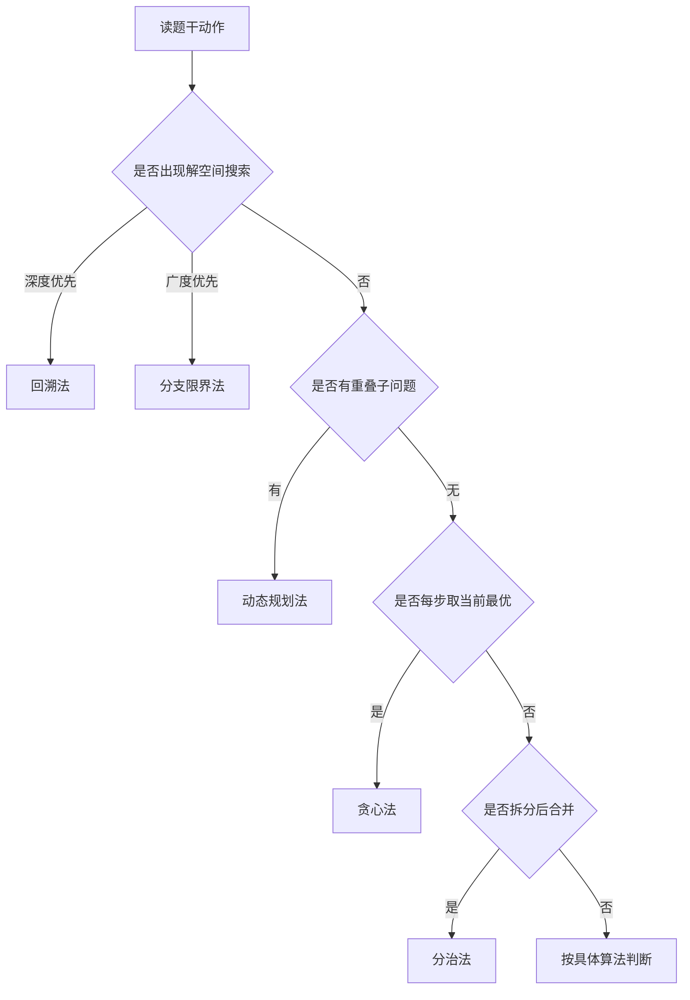

# chapter 14 - 算法

适用对象：软件设计师新手备考  

# 一、当前整理范围

```text
chapter 14 - 算法
├─ 1. 回溯法
│  ├─ 解空间树
│  ├─ 深度优先搜索
│  ├─ 试探、失败、退回
│  └─ N 皇后问题
├─ 2. 分治法
│  ├─ 分解、求解、合并
│  ├─ 假币问题
│  ├─ 第 i 小元素选择
│  ├─ 归并排序
│  └─ 最大子段和
├─ 3. 动态规划法
│  ├─ 最优子结构
│  ├─ 重叠子问题
│  ├─ 自底向上填表
│  ├─ 0-1 背包
│  ├─ 矩阵连乘
│  ├─ 装配线调度
│  └─ 最长公共子序列
├─ 4. 贪心法
│  ├─ 局部最优选择
│  ├─ 部分背包
│  ├─ 最近邻旅行路径
│  ├─ 活动场地安排
│  └─ 消防栓覆盖
└─ 5. 算法综合题
   ├─ 循环次数计算
   ├─ 0-1 背包最优性
   ├─ Dijkstra 算法
   ├─ 深度优先与广度优先搜索
   └─ 四类策略快速辨析
```

# 二、复习建议

| 轮次 | 目标 | 建议做法 | 关注重点 |
|---|---|---|---|
| 第 1 轮 | 先分清四类算法 | 每类只抓一句判断标准：分治“拆合”、动态规划“重叠填表”、贪心“当前最优”、回溯“试探回退” | 不急着刷复杂题，先会识别策略 |
| 第 2 轮 | 背经典问题归属 | 把 N 皇后、归并排序、0-1 背包、矩阵连乘、部分背包、Dijkstra 归入对应算法 | 题干出现经典模型时直接落答案 |
| 第 3 轮 | 练复杂度与表格题 | 重点做循环次数、分治递推式、动态规划复杂度、贪心排序复杂度 | 先写过程，再选选项 |
| 第 4 轮 | 冲刺易混点 | 对比 0-1 背包与部分背包、回溯与分支限界、分治与动态规划 | 防止看到“最优”就误选动态规划 |

# 三、章节笔记

## 总记忆表

| 模块 | 记忆句 |
|---|---|
| 回溯法 | **深度优先搜解空间，走不通就退回。** |
| 分治法 | **大问题拆成小问题，小问题解完再合并。** |
| 动态规划法 | **最优子结构 + 重叠子问题，用表保存避免重复算。** |
| 贪心法 | **每一步都选眼前最优，不一定总能全局最优。** |
| 分支限界 | **广度优先搜解空间，常配合限界函数剪枝。** |
| 0-1 背包 | **动态规划能保证最优，贪心通常不能保证。** |
| 部分背包 | **按单位重量价值从高到低装，贪心可得最优。** |
| Dijkstra | **每次选当前距离最短的未确定点，本质是贪心。** |
| 矩阵连乘 | **只改括号顺序，不改矩阵顺序，典型动态规划。** |
| 最长公共子序列 | **二维表，匹配加 1，不匹配取左/上最大。** |

## 1. 四类算法设计策略总览

### 1. 知识点

| 策略 | 核心动作 | 典型题眼 | 常见问题 | 是否常用于求最优解 |
|---|---|---|---|---|
| 分治法 | 分解、递归求解、合并 | 分成若干子问题；分别求解；合并结果 | 归并排序、快速选择、最大子段和 | 可以，但不专门针对重叠子问题 |
| 动态规划法 | 建表保存子问题结果 | 最优子结构；重叠子问题；自底向上 | 0-1 背包、矩阵连乘、LCS | 是，常考“求最优解” |
| 贪心法 | 每一步选局部最优 | 单位价值最大；最近；最早结束；当前最优 | 部分背包、Dijkstra、活动选择 | 有些问题能保证，有些不能 |
| 回溯法 | 深度优先试探与回退 | 解空间；约束条件；不能满足则退回 | N 皇后、排列组合、0-1 背包搜索 | 可求可行解或所有解，也可配合剪枝求最优 |
| 分支限界法 | 广度优先或优先队列搜索 | 队列、活结点、限界函数 | 0-1 背包、旅行商搜索 | 可求最优，常用限界剪枝 |

对新手来说，算法策略题的第一步不是看选项，而是读题干的“动作”。如果题干反复出现“将问题分成若干规模较小的子问题”，一般是分治；如果题干强调“子问题被重复求解”，就要想到动态规划；如果题干说“每次选择当前最小、当前最大、当前最近、单位价值最高”，多数是贪心；如果题干出现“解空间、深度优先、试探、回退”，基本就是回溯。

### 2. 算法选择流程图



### 3. 例题分析

**例 1：题干说“具有最优子结构，子问题被重复求解”。**  
先抓题眼：“重叠子问题”是动态规划最稳定的标志。分治法也会递归分解，但分治通常不强调大量重复子问题；贪心只强调每一步最优；回溯强调搜索和回退。因此答案方向是动态规划。

**例 2：题干说“定义问题解空间，以深度优先方式搜索”。**  
先抓题眼：“解空间 + 深度优先”直接对应回溯法。若改成“广度优先方式搜索解空间”，通常对应分支限界法。

### 4. 记忆技巧

```text
拆了再合是分治，重复填表动态规。
当前最优是贪心，深搜回退叫回溯。
广搜限界分支限，背包问题要分清。
```

## 2. 回溯法

### 1. 知识点

| 项目 | 内容 |
|---|---|
| 基本思想 | 在解空间树中按深度优先方式搜索，若当前选择不满足约束条件，则撤销选择并退回上一层 |
| 关键动作 | 试探、检查、深入、回退 |
| 常见题眼 | “解空间”“所有可行解”“约束条件”“不能冲突”“深度优先” |
| 典型问题 | N 皇后、排列问题、组合问题、图着色、迷宫搜索 |
| 与分支限界区别 | 回溯多为深度优先；分支限界多为广度优先或优先队列搜索 |

回溯法不是简单的“递归”。递归只是实现方式，回溯法的本质是：先做一个选择，然后判断这个选择是否还能导向可行解。如果不能，就撤销选择，换另一个选择。N 皇后问题中，“第 j 行皇后放在哪一列”就是选择；“是否同列或同对角线冲突”就是约束条件；“不合法则换列或退回上一行”就是回溯。

### 2. 模板

```text
回溯法通用模板
1. 定义解空间：每一层表示一个决策位置。
2. 从第一层开始试探一个候选值。
3. 检查候选值是否满足约束条件。
4. 若满足，进入下一层；若不满足，换下一个候选值。
5. 若当前层没有候选值可选，则退回上一层。
6. 到达叶结点时，得到一个可行解或最优解候选。
```

N 皇后合法性判断公式常用如下：

$$
q_i = q_j \quad \text{表示同列冲突}
$$

$$
|i-j| = |q_i-q_j| \quad \text{表示同一对角线冲突}
$$

其中，$i,j$ 表示行号，$q_i,q_j$ 表示对应皇后所在列号。

### 3. 例题分析

**例 1：N 皇后问题为什么选回溯？**  
N 皇后要求任意两个皇后不能在同一行、同一列、同一对角线上。通常做法是按行放置皇后，每行尝试不同列。若某列导致冲突，就继续试下一列；若当前行所有列都不行，就退回上一行重新选择。题干中“摆放”“不能冲突”“尝试位置”都指向解空间搜索，因此一般采用回溯法。

**正确答案**：D  
**答案方向**：看到 N 皇后、排列组合、约束满足，优先想到回溯。

### 4. 代码理解示意

```c
int check(int j) {
    for (int i = 1; i < j; i++) {
        if (q[i] == q[j] || abs(i - j) == abs(q[i] - q[j])) {
            return 0;
        }
    }
    return 1;
}
```

这段代码的核心不是 C 语言语法，而是两个冲突判断：同列冲突、对角线冲突。考试中即使不考代码，也会考“这种问题一般采用什么算法”。

### 5. 记忆技巧

```text
N皇后，试位置；
同列斜线都不许；
能放就深入，不能就退回。
```

## 3. 分治法

### 1. 知识点

| 项目 | 内容 |
|---|---|
| 基本思想 | 把规模较大的问题划分为若干规模较小、结构相同或相似的子问题，分别求解后合并结果 |
| 三个步骤 | 问题划分、递归求解、合并解 |
| 常见题眼 | “划分为两个子数组”“分别求解”“跨越中间”“合并” |
| 典型问题 | 归并排序、快速排序、快速选择、二分查找、假币问题、最大子段和 |
| 易错点 | 分治不一定必须用递归实现；子问题也不一定规模完全相等 |

分治法适合问题能够被拆成较小问题，并且子问题的解能够合并为原问题的解。归并排序是最标准的分治：先把数组分成左右两半，分别排序，再合并两个有序序列。最大子段和的分治也类似：最大子段可能在左半边、右半边，或者跨越中点，三者取最大。

### 2. 公式/模板

分治法常见递推式：

$$
T(n)=aT\left(\frac{n}{b}\right)+f(n)
$$

例如最大子段和的分治求解，每次分成左右两半，并用线性时间计算跨越中点的最大子段和：

$$
T(n)=2T\left(\frac{n}{2}\right)+O(n)=O(n\log n)
$$

假币问题若每次二分称重，16 枚硬币查找 1 枚较轻假币，比较次数为：

$$
16 \rightarrow 8 \rightarrow 4 \rightarrow 2 \rightarrow 1
$$

需要 4 次比较。

### 3. 例题分析

**例 1：16 枚硬币中找较轻假币。**  
先抓题眼：题目明确说“采用分治法”。按二分思想，每次把候选集合缩小一半：16 枚分成 8 和 8，称一次确定假币在哪一半；再 4 和 4；再 2 和 2；最后 1 和 1。因此至少比较 4 次。

**正确答案**：B  
**答案方向**：看到“16 个对象，每次二分缩小范围”，按 $\,\log_2 16=4\,$ 计算。

**例 2：分治算法设计技术的一般步骤。**  
先抓题眼：问的是“设计技术”。分治的经典三步就是“问题划分、递归求解、合并解”。B 错在“一定递归”过于绝对；C 错在子问题不一定规模相等；D 错在分治不要求划分代价小且合并代价大。

**正确答案**：A  
**答案方向**：分治三件事：拆、治、合。

**例 3：查找第 i 小的数。**  
题干描述“任意取一个元素 r，用划分操作确定其位置，再在前半部分或后半部分递归查找”。这与快速排序中的 partition 思想一致，也称快速选择。它每次把问题划分到一个子区间继续处理，因此属于分治。

**正确答案**：A  
**答案方向**：看到“划分位置 + 递归到一边”，优先选分治。

**例 4：最大子段和的分治复杂度。**  
每次把数组分为两个 $n/2$ 的子数组，分别求左半最大子段和、右半最大子段和，再用 $O(n)$ 时间求跨越中间的最大子段和。因此：

$$
T(n)=2T(n/2)+O(n)=O(n\log n)
$$

**正确答案**：$O(n\log n)$（原题选项公式在 Word 中未稳定抽取，按该复杂度对应选项选择）  
**答案方向**：两个一半子问题 + 一次线性合并，复杂度就是 $O(n\log n)$。

### 4. 记忆技巧

```text
分治三步：分、治、合。
归并排序：分到单个，再合并。
最大子段：左边、右边、跨中间。
```

## 4. 动态规划法

### 1. 知识点

| 项目 | 内容 |
|---|---|
| 基本思想 | 把原问题分解为子问题，用表保存子问题结果，避免重复计算 |
| 两个条件 | 最优子结构、重叠子问题 |
| 常见实现 | 自底向上填表；自顶向下记忆化搜索 |
| 典型问题 | 0-1 背包、矩阵连乘、最长公共子序列、装配线调度 |
| 常考复杂度 | 0-1 背包 $O(nW)$；矩阵连乘 $O(n^3)$；LCS $O(mn)$ |

动态规划题的题干通常会显式给出“最优子结构”和“重复子问题”。所谓最优子结构，是指原问题的最优解包含子问题的最优解；所谓重叠子问题，是指不同求解路径会反复计算同一批小问题。动态规划的价值就在于把这些小问题结果保存起来，下次直接查表。

### 2. 0-1 背包

0-1 背包的特点是：每件物品只有“选”或“不选”两种状态，不能只装一部分。设 $f[i][j]$ 表示前 $i$ 件物品、背包容量为 $j$ 时的最大价值，则状态转移为：

$$
f[i][j]=f[i-1][j] \quad \text{不选第 } i \text{ 件}
$$

若 $j \ge w_i$，还可以选择第 $i$ 件：

$$
f[i][j]=\max\{f[i-1][j],\ f[i-1][j-w_i]+v_i\}
$$

| 符号 | 含义 |
|---|---|
| $i$ | 当前考虑前 $i$ 件物品 |
| $j$ | 当前背包容量 |
| $w_i$ | 第 $i$ 件物品重量 |
| $v_i$ | 第 $i$ 件物品价值 |
| $f[i][j]$ | 前 $i$ 件物品、容量 $j$ 的最大价值 |

时间复杂度和空间复杂度通常为：

$$
O(nW)
$$

其中 $n$ 是物品数，$W$ 是背包容量。

### 3. 部分背包与 0-1 背包的区别

| 问题 | 是否可拆分物品 | 常用策略 | 是否保证最优 |
|---|---|---|---|
| 0-1 背包 | 不可拆分 | 动态规划、回溯、分支限界 | 动态规划可保证最优；贪心一般不能保证 |
| 部分背包 | 可以拆分 | 按单位重量价值从高到低贪心装入 | 贪心可保证最优 |

这个对比是本章最容易考的点之一。看到“每件物品或者全部装入或者全部不装入”，就是 0-1 背包；看到“物品可以部分装入”，就是部分背包。0-1 背包不能简单按单位价值贪心，因为某个单位价值高的物品可能占据容量，导致无法组合出总价值更高的方案。

### 4. 矩阵连乘

矩阵连乘问题不是改变矩阵顺序，而是改变括号位置。例如 $A_1A_2A_3$ 可以写成 $(A_1A_2)A_3$ 或 $A_1(A_2A_3)$。不同括号次序会带来不同乘法次数。

若矩阵 $A_i$ 的维度为 $p_{i-1}\times p_i$，则 $A_i\cdots A_j$ 的最少乘法次数记为 $m[i,j]$：

$$
m[i,i]=0
$$

$$
m[i,j]=\min_{i\le k<j}\{m[i,k]+m[k+1,j]+p_{i-1}p_kp_j\}
$$

时间复杂度和空间复杂度通常为：

$$
O(n^3),\quad O(n^2)
$$

题目若问“矩阵连乘采用什么算法策略”，应选动态规划。若问“两个矩阵相乘次数”，设 $A$ 为 $p\times q$，$B$ 为 $q\times r$，则乘法次数为：

$$
pqr
$$

### 5. 最长公共子序列

最长公共子序列（LCS）注意是“子序列”，不是“子串”。子序列可以不连续，但相对顺序不能改变。设 $C[i,j]$ 表示 $X$ 的前 $i$ 个字符与 $Y$ 的前 $j$ 个字符的 LCS 长度：

$$
C[i,j]=0 \quad (i=0 \text{ 或 } j=0)
$$

若 $x_i=y_j$：

$$
C[i,j]=C[i-1,j-1]+1
$$

若 $x_i\ne y_j$：

$$
C[i,j]=\max\{C[i-1,j], C[i,j-1]\}
$$

时间复杂度为：

$$
O(mn)
$$

如果两个序列长度都为 $n$，则为 $O(n^2)$。

### 6. 装配线调度

装配线调度问题也属于动态规划。题干往往会说“两条装配线”“每个工位时间不同”“工位之间可迁移”“求最短装配时间”。核心是：到达某条线第 $j$ 个工位的最短时间，只可能来自本线第 $j-1$ 个工位，或者另一条线第 $j-1$ 个工位再加迁移时间。

设 $f_1[j]$ 表示到达装配线 1 的第 $j$ 个工位的最短时间，$f_2[j]$ 表示到达装配线 2 的第 $j$ 个工位的最短时间：

$$
f_1[j]=\min\{f_1[j-1]+a_{1j},\ f_2[j-1]+t_{2,j-1}+a_{1j}\}
$$

$$
f_2[j]=\min\{f_2[j-1]+a_{2j},\ f_1[j-1]+t_{1,j-1}+a_{2j}\}
$$

该问题只需从左到右扫描工位，时间复杂度为 $O(n)$。

### 7. 例题分析

**例 1：动态规划以获取问题最优解为目标。**  
先抓题眼：“最优解”是动态规划的高频表述，但要注意贪心也可能求最优。此题在四个选项中，动态规划是典型以最优解为目标并通过子问题递推求解的策略。

**正确答案**：C  
**答案方向**：问“以获取最优解为目标”的经典算法策略，优先选动态规划。

**例 2：0-1 背包的最大装包价值与复杂度。**  
先抓题眼：题干明确给出 $f[i,j]$，并说“自底向上的动态规划方法”，因此策略和复杂度都不需要猜。最大价值要通过表格填充得到；时间复杂度是物品数乘容量，即 $O(nW)$。

**正确答案**：最大装包价值按题目数据对应选项；时间复杂度为 $O(nW)$  
**答案方向**：0-1 背包看到 $f[i,j]$，直接想到二维 DP 表。

**例 3：矩阵连乘复杂度。**  
矩阵连乘要枚举区间长度、区间左端点、断开位置 $k$，所以有三层循环，时间复杂度为 $O(n^3)$；保存 $m[i,j]$ 表需要二维数组，空间复杂度为 $O(n^2)$。

**正确答案**：时间复杂度 $O(n^3)$，空间复杂度 $O(n^2)$（按题目选项对应项选择）  
**答案方向**：矩阵连乘不是贪心，固定选动态规划。

**例 4：最长公共子序列。**  
蛮力法需要枚举 $X$ 的所有子序列，数量级为 $2^n$，再判断是否为 $Y$ 的子序列，所以复杂度通常按指数级理解。动态规划用二维表 $C[i,j]$，若两个序列长度均为 $n$，时间复杂度为 $O(n^2)$。

**正确答案**：蛮力法指数级；动态规划 $O(n^2)$（按题目选项对应项选择）  
**答案方向**：LCS 看到“最长公共子序列”，直接想到二维表。

### 8. 记忆技巧

```text
动态规划两条件：最优子结构、重叠子问题。
背包看 f[i][j]，矩阵看 m[i][j]。
LCS 二维表，匹配加一，不匹配取大。
```

## 5. 贪心法

### 1. 知识点

| 项目 | 内容 |
|---|---|
| 基本思想 | 每一步都选择当前看来最好的方案，希望最终得到全局最优 |
| 常见题眼 | 最近、最小、最大、单位价值最高、当前最优 |
| 典型问题 | 部分背包、Dijkstra、活动选择、最小生成树、区间覆盖 |
| 易错点 | 贪心不一定总能得到全局最优，必须证明贪心选择性质 |
| 考试常见判断 | 部分背包可用贪心得最优；0-1 背包不能保证 |

贪心法的难点不是“会不会选当前最优”，而是“当前最优能否推出全局最优”。在软件设计师考试中，题目通常不要求证明，只要求识别策略或判断是否保证最优。部分背包中，由于物品可拆分，按单位重量价值从高到低装入一定最优；0-1 背包中，物品不可拆分，贪心可能错失更优组合。

### 2. 部分背包模板

```text
部分背包贪心策略
1. 计算每件物品的单位重量价值 v[i]/w[i]。
2. 按单位重量价值从大到小排序。
3. 能全部装入就全部装。
4. 装不下时，装入当前物品的一部分。
5. 背包满时结束。
```

时间复杂度主要由排序决定。若使用归并排序或快速排序，通常为：

$$
O(n\log n)
$$

### 3. 活动场地安排

题目要求“最少场地数”，先按活动开始时间排序，再依次把活动放入第一个不冲突的场地；若所有已有场地都冲突，就开新场地。这种“当前活动尽量放入已有场地，否则新增场地”的过程属于贪心。若前面使用快速排序，则排序属于分治，后续安排属于贪心。

整体复杂度要看实现方式。若排序 $O(n\log n)$，之后对每个活动扫描已有场地，最坏可能达到 $O(n^2)$。若用优先队列维护最早结束的场地，则可优化为 $O(n\log n)$。本章题干采用逐个场地检查，通常按 $O(n^2)$ 对应选项判断。

### 4. 消防栓覆盖

从最左边未覆盖房子开始，在其右侧 $m$ 米处安装消防栓，可以覆盖从该房子到该点右侧 $m$ 米范围内的所有房子。然后删除已覆盖房子，继续处理下一个未覆盖房子。这是区间覆盖类贪心。

若房子坐标已排序，线性扫描即可，复杂度为 $O(n)$；若坐标未排序，需要先排序，复杂度为 $O(n\log n)$。

### 5. 例题分析

**例 1：旅行路径每次选择最近的未访问目的地。**  
先抓题眼：“每次在未访问过的目的地中选择离当前目的地最近的目的地”。这是典型局部最优选择，因此策略是贪心。时间复杂度方面，每一步都要在未访问点中寻找最近点，若有 $n$ 个目的地，总体通常为 $O(n^2)$。

**正确答案**：策略 C；复杂度 $O(n^2)$（按题目选项对应项选择）  
**答案方向**：每次选最近，就是贪心。

**例 2：0-1 背包与部分背包。**  
题干说“按单位重量价值从大到小装入”。这明显是贪心策略。对部分背包，由于可以装入一部分物品，贪心可以保证最优；对 0-1 背包，由于物品不能拆分，贪心可能不最优。因此同一组物品在两类背包中的最大价值可能不同。

**正确答案**：B；605 和 630  
**答案方向**：部分背包可以拆，价值通常不小于 0-1 背包。

**例 3：场地安排。**  
题干第一步用快速排序按开始时间排序，快速排序是分治；后续把每个活动尽量放入已有场地，否则开新场地，是贪心。若按题干描述逐场地扫描，整体复杂度通常按 $O(n^2)$ 判断。

**正确答案**：排序策略 A；安排策略 C；复杂度 $O(n^2)$；最少场地数按表格数据为对应选项  
**答案方向**：先排序是分治，后安排是贪心。

**例 4：消防栓覆盖。**  
先抓题眼：“从左端第一栋房子开始，在其右侧 m 米处安装”。这是典型区间覆盖贪心。给定坐标 $10,20,30,35,60,80,160,210,260,300$，半径 20：

| 步骤 | 最左未覆盖房子 | 安装位置 | 可覆盖范围 | 覆盖房子 |
|---|---:|---:|---:|---|
| 1 | 10 | 30 | $[10,50]$ | 10,20,30,35 |
| 2 | 60 | 80 | $[60,100]$ | 60,80 |
| 3 | 160 | 180 | $[160,200]$ | 160 |
| 4 | 210 | 230 | $[210,250]$ | 210 |
| 5 | 260 | 280 | $[260,300]$ | 260,300 |

共需要 5 个消防栓。

**正确答案**：策略 C；复杂度 $O(n)$ 或按题目选项对应项；数量 B；算法可以求得问题的一个最优解 A  
**答案方向**：线性覆盖题，最左未覆盖点决定当前消防栓位置。

### 6. 记忆技巧

```text
贪心看“当前”：最近、最大、最小、单位价值最高。
部分背包能贪心，0-1 背包别乱贪。
Dijkstra 也是贪心，每次定最短点。
```

## 6. 算法复杂度与综合判断

### 1. 知识点

| 题型 | 解题方法 | 常见答案 |
|---|---|---|
| 双重循环次数 | 外层列出每次 i 的取值，内层求和 | 具体执行次数 |
| 快速排序、归并排序 | 分治思想 | 平均或标准复杂度 $O(n\log n)$ |
| 0-1 背包 | 不能用贪心保证最优 | 动态规划、回溯、分支限界可求最优 |
| Dijkstra | 每次选当前最短路径顶点 | 贪心 |
| 深度优先搜索解空间 | DFS + 回退 | 回溯 |
| 广度优先搜索解空间 | BFS + 限界 | 分支限界 |

### 2. 循环次数例题

```c
for (int i = 1; i <= 11; i *= 2)
    for (int j = 1; j <= i; j++)
        count++;
```

外层 $i$ 的取值为：

```text
1, 2, 4, 8
```

因为下一次 $i=16$ 时已经大于 11，不再进入循环。内层执行次数分别为：

$$
1+2+4+8=15
$$

**正确答案**：A  
**答案方向**：不要把 $16$ 算进去，外层只到 $8$。

### 3. 0-1 背包最优性判断

**题眼**：问“不能保证求得 0-1 背包问题最优解”。  
分支限界法、回溯法、动态规划策略都可以用于 0-1 背包最优解；贪心算法一般不能保证 0-1 背包最优解。

**正确答案**：B  
**答案方向**：0-1 背包不拆分，贪心不稳。

### 4. Dijkstra 算法

Dijkstra 算法每次从未确定最短路径的顶点中，选择当前距离源点最近的顶点，并将其最短路径确定下来。这个“每次选当前最短”的过程就是贪心选择。

**正确答案**：C  
**答案方向**：Dijkstra、Prim、Kruskal 都常按贪心理解。

### 5. 深搜与广搜辨析

| 描述 | 策略 |
|---|---|
| 定义解空间，以深度优先方式搜索 | 回溯法 |
| 定义解空间，以广度优先方式搜索 | 分支限界法 |
| 有最优子结构和重叠子问题 | 动态规划法 |
| 每次选择局部最优 | 贪心法 |

题目中若同时出现“最优子结构”和“重复求解”，优先选动态规划；若出现“深度优先搜索解空间”，选回溯；若出现“广度优先搜索解空间”，选分支限界。

# 四、按专题插入原题与解析

## 专题一：回溯法

### 题 1
**原题**  
要在 8×8 的棋盘上摆放 8 个“皇后”，要求“皇后”之间不能发生冲突，即任何两个“皇后”不能在同一行、同一列和相同的对角线上，则一般采用（62）来实现。（2011 年上半年）

- A. 分治法
- B. 动态规划法
- C. 贪心法
- D. 回溯法

**解析**  
先抓题眼：8 皇后是典型约束满足问题。每一行尝试放一个皇后，若当前列与前面皇后同列或同斜线，则该位置不合法，需要尝试下一列；若本行没有合法位置，则退回上一行重新选择。这正是“试探—检查—回退”的回溯过程。

**正确答案**  
D

**答案方向**  
看到 N 皇后、图着色、排列组合、迷宫路径，优先想到回溯。

## 专题二：分治法

### 题 2
**原题**  
现有 16 枚外形相同的硬币，其中有一枚比真币的重量轻的假币，若采用分治法找出这枚假币，至少比较（63）次才能够找出该假币。（2009 年上半年）

- A. 3
- B. 4
- C. 5
- D. 6

**解析**  
先抓题眼：采用分治法找较轻假币。按二分比较：16 枚分成 8 与 8，比较后确定假币所在一半；再 4 与 4；再 2 与 2；最后 1 与 1。共需要 4 次。

**正确答案**  
B

**答案方向**  
二分缩小规模时，比较次数常按 $\log_2 n$ 判断。

### 题 3
**原题**  
分治算法设计技术（63）。（2011 年上半年）

- A. 一般由三个步骤组成：问题划分、递归求解、合并解
- B. 一定是用递归技术来实现
- C. 将问题划分为规模相等的子问题
- D. 划分代价很小而合并代价很大

**解析**  
先抓题眼：题目问分治法的一般设计步骤。分治法通常包括“划分子问题、求解子问题、合并子问题解”。B 的“一定”过于绝对；C 的“规模相等”不是必要条件；D 不是分治法定义。

**正确答案**  
A

**答案方向**  
分治法固定记“三步”：划分、求解、合并。

### 题 4
**原题**  
在有 $n$ 个无序无重复元素值的数组中查找第 $i$ 小的数。算法描述为：任意取一个元素 $r$，用划分操作确定其在数组中的位置，假设元素 $r$ 为第 $k$ 小的数。若 $i=k$，则返回该元素值；若 $i<k$，则在划分的前半部分递归查找；否则在划分的后半部分递归查找。该算法是一种基于（63）策略的算法。（2011 年下半年）

- A. 分治
- B. 动态规划
- C. 贪心
- D. 回溯

**解析**  
先抓题眼：“划分操作”“前半部分或后半部分递归”。这是快速选择算法，与快速排序一样基于划分思想。它把原问题缩小为一个子问题继续求解，属于分治。

**正确答案**  
A

**答案方向**  
看到 partition、划分、递归到一边，选分治。

### 题 5
**原题**  
最大子段和问题：在 $n$ 个整数的数组中，求和最大的非空连续子数组。求解时将数组分为两个 $n/2$ 的子数组，最大子段和可能在前半段、后半段或跨越中间元素，通过继续划分直至求出最大子段和。该算法的时间复杂度为（63）。（2021 年上半年）

**解析**  
先抓题眼：最大子段和被分成“左半、右半、跨中间”三类讨论。左半和右半分别递归求解；跨中间部分需要从中点向两边扫描，代价为 $O(n)$。因此递推式为：

$$
T(n)=2T(n/2)+O(n)=O(n\log n)
$$

**正确答案**  
$O(n\log n)$（原题公式选项未稳定抽取，按选项中对应项选择）

**答案方向**  
两个一半子问题 + 一次线性合并，复杂度为 $O(n\log n)$。

## 专题三：动态规划法

### 题 6
**原题**  
以下的算法设计方法中，（64）以获取问题最优解为目标。（2009 年上半年）

- A. 回溯方法
- B. 分治法
- C. 动态规划
- D. 递推

**解析**  
先抓题眼：题目直接问“获取问题最优解”。动态规划是求解最优化问题的典型策略，尤其适合具有最优子结构和重叠子问题的问题。

**正确答案**  
C

**答案方向**  
出现“最优解 + 子问题递推”，优先想到动态规划。

### 题 7
**原题**  
用动态规划策略求解矩阵连乘问题，给定若干矩阵维度，求最优计算次序。（2010 年下半年）

**解析**  
先抓题眼：矩阵连乘的本质是选择最佳括号位置。它具有最优子结构：$A_i\cdots A_j$ 的最优解包含 $A_i\cdots A_k$ 和 $A_{k+1}\cdots A_j$ 的最优解。常用递推式为：

$$
m[i,j]=\min_{i\le k<j}\{m[i,k]+m[k+1,j]+p_{i-1}p_kp_j\}
$$

由于上传 Word 中矩阵维度和选项以公式对象呈现，文本抽取不完整，复习时应掌握计算方法：列出所有可能断点 $k$，比较乘法次数最小者。

**正确答案**  
按题目维度计算后选择乘法次数最小的括号方案

**答案方向**  
矩阵连乘固定是动态规划，考试重点是 $p_{i-1}p_kp_j$ 的乘法次数。

### 题 8
**原题**  
考虑 0-1 背包问题，共有若干物品，背包容量为 $W$，给出物品重量和价值。采用自底向上的动态规划方法求解，问最大装包价值和算法时间复杂度。若为部分背包问题，按单位重量价值排序后贪心装入，问最大价值和复杂度。（2016 年上半年）

**解析**  
先抓题眼：题目同时考 0-1 背包和部分背包。0-1 背包用动态规划，状态为 $f[i][j]$；部分背包用贪心，按单位重量价值排序。0-1 背包时间复杂度是 $O(nW)$；部分背包若先归并排序，复杂度是 $O(n\log n)$。

| 问题 | 策略 | 复杂度 | 是否可拆物品 |
|---|---|---|---|
| 0-1 背包 | 动态规划 | $O(nW)$ | 否 |
| 部分背包 | 贪心 + 排序 | $O(n\log n)$ | 是 |

**正确答案**  
0-1 背包最大价值按表格填表所得；复杂度 $O(nW)$。部分背包最大价值按单位价值贪心所得；复杂度 $O(n\log n)$。（选项公式在原文中未稳定抽取，按对应项选择）

**答案方向**  
0-1 背包不要用贪心；部分背包优先按单位价值贪心。

### 题 9
**原题**  
多个矩阵相乘满足结合律，不同乘法顺序所需乘法次数不同。采用动态规划确定 $n$ 个矩阵相乘的顺序，其时间复杂度为（64）。若四个矩阵维度序列为 2、6、3、10、3，求乘法次数。（2016 年下半年）

- 乘法次数选项：A. 156　B. 144　C. 180　D. 360

**解析**  
先抓题眼：矩阵连乘，固定动态规划。时间复杂度为 $O(n^3)$。对维度序列 $2,6,3,10,3$，矩阵为：

```text
A1: 2×6
A2: 6×3
A3: 3×10
A4: 10×3
```

用动态规划比较不同断点后，最少乘法次数为 156。

**正确答案**  
时间复杂度：$O(n^3)$；乘法次数：A

**答案方向**  
矩阵连乘复杂度记 $O(n^3)$，具体值按区间 DP 表算。

### 题 10
**原题**  
某汽车加工工厂有两条装配线，每条装配线有 $n$ 个工位，工位加工时间和迁移时间不同，要求最快完成一辆汽车装配。题干分析该问题具有最优子结构和重复子问题，问采用的算法策略、复杂度、最短装配时间和装配路线。（2017 年上半年）

**解析**  
先抓题眼：题目已经提示“最优子结构”和“重复子问题”，应选动态规划。每个工位只需要根据上一工位在两条线上的最短时间进行转移，因此从左到右扫描，时间复杂度为 $O(n)$。最短时间和路线根据题中给出的表格逐项填表得到。

**正确答案**  
策略：B；复杂度：$O(n)$；最短时间和路线按表格填表结果选择对应选项

**答案方向**  
装配线调度是动态规划，复杂度通常是线性。

### 题 11
**原题**  
求解两个长度为 $n$ 的序列 $X$ 和 $Y$ 的最长公共子序列。蛮力法对 $X$ 的每个子序列判断其是否也是 $Y$ 的子序列；动态规划自底向上求解，问两种方法的时间复杂度。（2017 年下半年）

**解析**  
先抓题眼：最长公共子序列是典型动态规划。蛮力法要枚举 $X$ 的所有子序列，数量级为 $2^n$，因此是指数级；动态规划填二维表，若两个序列长度均为 $n$，复杂度为 $O(n^2)$。

**正确答案**  
蛮力法：指数级，通常记 $O(2^n)$ 或含判断代价的指数级；动态规划：$O(n^2)$（按选项对应项选择）

**答案方向**  
LCS：蛮力指数级，DP 二维表平方级。

### 题 12
**原题**  
已知矩阵相乘时间复杂度，确定 $n$ 个矩阵相乘的最优计算顺序具有最优子结构。采用自底向上的方法求最优顺序，问算法策略、时间复杂度、空间复杂度和给定实例的最优计算顺序。（2019 年上半年）

**解析**  
先抓题眼：“最优子结构”“自底向上”“矩阵连乘”。策略是动态规划；时间复杂度 $O(n^3)$；空间复杂度 $O(n^2)$。具体最优次序需要根据题中维度列区间表计算。

**正确答案**  
策略：B；时间复杂度：$O(n^3)$；空间复杂度：$O(n^2)$；具体括号次序按区间 DP 表选择

**答案方向**  
矩阵连乘的三个答案常绑定出现：动态规划、$O(n^3)$、$O(n^2)$。

## 专题四：贪心法

### 题 13
**原题**  
某货车运输公司从中央仓库出发到所有目的地，每次在未访问过的目的地中选择离当前目的地最近的目的地，最后回到中央仓库。问采用的算法设计策略和时间复杂度。（2012 年上半年）

**解析**  
先抓题眼：“每次选择最近”。这是局部最优选择，属于贪心策略。若每次都扫描所有未访问目的地找最近点，则总时间复杂度通常为 $O(n^2)$。

**正确答案**  
策略：C；复杂度：$O(n^2)$（按题目选项对应项选择）

**答案方向**  
“每次最近”就是贪心，但旅行商问题中这种贪心不一定全局最优。

### 题 14
**原题**  
有 5 件物品，背包容量为 100，物品已按单位重量价值从大到小排好序，根据单位重量价值大的优先装入。问采用的设计策略；对 0-1 背包和部分背包求得的最大价值分别为（61）。（2013 年上半年）

- A. 605 和 630
- B. 605 和 605
- C. 430 和 630
- D. 630 和 430

**解析**  
先抓题眼：“单位重量价值大优先”是典型贪心。部分背包允许装入物品的一部分，因此贪心可得到更高或相等的最优值；0-1 背包不能拆分，结果通常不超过部分背包。本题对应结果为 605 和 630。

**正确答案**  
策略：B；价值：A

**答案方向**  
部分背包可拆，通常价值不小于 0-1 背包。

### 题 15
**原题**  
现需要申请一些场地举办一批活动。先采用快速排序对活动开始时间排序，再依次把活动安排到第一个不冲突的场地，若所有已有场地都冲突，则新增场地。问排序策略、后续策略、整体复杂度和最少场地数。（2018 年上半年）

**解析**  
先抓题眼：快速排序是分治；后续“能放已有场地就放，否则新开场地”是贪心。若每个活动都可能扫描已有场地，整体最坏为 $O(n^2)$。具体最少场地数由题目表格逐项模拟得到。

**正确答案**  
排序策略：A；后续策略：C；复杂度：$O(n^2)$；最少场地数按表格模拟结果选择对应选项

**答案方向**  
题中出现两个阶段时，要分别判断，不要把快速排序误认为贪心。

### 题 16
**原题**  
在一条笔直公路边安装消防栓，每个消防栓半径为 20 米。房子坐标为 $10,20,30,35,60,80,160,210,260,300$。从左端第一栋房子开始，在其右侧 $m$ 米处安装消防栓，去掉被覆盖房子，重复直到全部覆盖。问策略、复杂度、需要安装几个消防栓，以及算法性质。（2018 年下半年）

**解析**  
先抓题眼：每次从最左未覆盖房子出发，把消防栓放在能尽量向右覆盖的位置，这是区间覆盖贪心。模拟过程如下：

| 消防栓 | 最左未覆盖房子 | 安装位置 | 覆盖范围 | 覆盖房子 |
|---|---:|---:|---:|---|
| 1 | 10 | 30 | 10–50 | 10,20,30,35 |
| 2 | 60 | 80 | 60–100 | 60,80 |
| 3 | 160 | 180 | 160–200 | 160 |
| 4 | 210 | 230 | 210–250 | 210 |
| 5 | 260 | 280 | 260–300 | 260,300 |

所以共 5 个消防栓。若坐标已排序，扫描一遍即可，复杂度 $O(n)$。该贪心策略可以得到一个最优解，但不是列出所有最优解。

**正确答案**  
策略：C；复杂度：$O(n)$（按选项对应项选择）；数量：B；性质：A

**答案方向**  
区间覆盖题：先覆盖最左未覆盖点，并尽量向右覆盖。

## 专题五：算法综合

### 题 17
**原题**  
下面 C 程序段中 `count++` 语句执行的次数为（64）。（2010 年下半年）

```c
for (int i = 1; i <= 11; i *= 2)
    for (int j = 1; j <= i; j++)
        count++;
```

- A. 15
- B. 16
- C. 31
- D. 32

**解析**  
先抓题眼：外层 $i$ 不是从 1 到 11 每次加 1，而是每次乘 2。外层取值为 $1,2,4,8$。内层分别执行 $1,2,4,8$ 次，总数为：

$$
1+2+4+8=15
$$

**正确答案**  
A

**答案方向**  
循环次数题先列外层变量取值，再累加内层次数。

### 题 18
**原题**  
（65）不能保证求得 0-1 背包问题的最优解。（2010 年下半年）

- A. 分支限界法
- B. 贪心算法
- C. 回溯法
- D. 动态规划策略

**解析**  
先抓题眼：0-1 背包不能拆分物品。动态规划可以求最优；回溯可以搜索解空间求最优；分支限界也可用于求最优。贪心按单位价值选物品时可能错过更优组合，因此不能保证最优。

**正确答案**  
B

**答案方向**  
0-1 背包最怕“贪心保证最优”的说法。

### 题 19
**原题**  
Dijkstra 算法用于求解图上的单源点最短路径。该算法按路径长度递增次序产生最短路径，本质上说，该算法是一种基于（62）策略的算法。（2011 年下半年）

- A. 分治
- B. 动态规划
- C. 贪心
- D. 回溯

**解析**  
先抓题眼：“按路径长度递增次序产生最短路径”。Dijkstra 每次选取当前距离源点最近且尚未确定的顶点，这就是局部最优选择。

**正确答案**  
C

**答案方向**  
Dijkstra 单源最短路径按贪心记。

### 题 20
**原题**  
在求解某问题时，经过分析发现该问题具有最优子结构性质，求解过程中子问题被重复求解，则采用（64）算法设计策略；若定义问题的解空间，以深度优先的方式搜索解空间，则采用（65）算法设计策略。（2013 年下半年）

（64）
- A. 分治
- B. 动态规划
- C. 贪心
- D. 回溯

（65）
- A. 动态规划
- B. 贪心
- C. 回溯
- D. 分支限界

**解析**  
先抓题眼：最优子结构 + 子问题重复求解，是动态规划；解空间 + 深度优先搜索，是回溯。

**正确答案**  
（64）B；（65）C

**答案方向**  
“重叠子问题”选动态规划；“深度优先解空间”选回溯。

### 题 21
**原题**  
采用贪心算法保证能求得最优解的问题是（63）。（2019 年下半年）

- A. 0-1 背包
- B. 矩阵链乘
- C. 最长公共子序列
- D. 部分（分数）背包

**解析**  
先抓题眼：问“贪心算法保证最优”。0-1 背包、矩阵链乘、最长公共子序列通常用动态规划；部分背包允许拆分物品，按单位重量价值从大到小贪心装入可以保证最优。

**正确答案**  
D

**答案方向**  
部分背包 = 贪心可最优；0-1 背包 = 贪心不保证。

### 题 22
**原题**  
在求解某问题时，经过分析发现该问题具有最优子结构和重叠子问题性质，则适合（64）算法设计策略得到最优解。若了解问题的解空间，并以广度优先的方式搜索解空间，则采用的是（65）算法策略。（2021 年上半年）

（64）
- A. 分治
- B. 贪心
- C. 动态规划
- D. 回溯

（65）
- A. 动态规划
- B. 贪心
- C. 回溯
- D. 分支限界

**解析**  
先抓题眼：最优子结构 + 重叠子问题，选动态规划；解空间 + 广度优先，选分支限界。回溯通常对应深度优先。

**正确答案**  
（64）C；（65）D

**答案方向**  
深搜回溯，广搜限界。

# 五、本章总结

## 先抓最稳的分

本章最稳的分来自“算法策略识别”。这类题往往不需要计算，只要识别题眼即可：

| 题眼 | 答案方向 |
|---|---|
| N 皇后、约束、试探、回退 | 回溯法 |
| 划分子问题、递归求解、合并 | 分治法 |
| 最优子结构、重叠子问题、自底向上 | 动态规划法 |
| 每次选最近、最大、最小、单位价值最高 | 贪心法 |
| 解空间、广度优先、限界函数 | 分支限界法 |

## 再抓计算题

计算题主要有三类：

1. **循环次数计算**：列出外层变量取值，再累加内层次数。
2. **复杂度判断**：分治看递推式，动态规划看表规模，贪心看排序与扫描。
3. **经典模型计算**：背包填表、矩阵连乘填区间表、区间覆盖逐步模拟。

新手做计算题时不要直接心算选项。应先写出关键中间过程，例如最大子段和写出 $T(n)=2T(n/2)+O(n)$，循环题写出 $1+2+4+8$，这样最不容易被选项干扰。

## 最后处理零散题

零散题主要考“哪个算法不保证最优”“哪个问题可用贪心求最优”。记住以下结论即可：

| 问题 | 常用最优策略 |
|---|---|
| 0-1 背包 | 动态规划、回溯、分支限界 |
| 部分背包 | 贪心 |
| 矩阵连乘 | 动态规划 |
| 最长公共子序列 | 动态规划 |
| Dijkstra 单源最短路径 | 贪心 |
| N 皇后 | 回溯 |
| 归并排序 | 分治 |

## 冲刺版口诀总表

```text
算法四兄弟，题眼要分清：
拆分合并是分治，归并假币最大段。
最优重叠动态规，背包矩阵LCS。
当前最优是贪心，部分背包能保证。
试探回退是回溯，N皇后题最典型。
深搜回溯，广搜限界。
0-1背包别贪心，分数背包贪心行。
Dijkstra选最短，本质就是贪心。
矩阵连乘三次方，空间一般平方级。
LCS二维表，匹配加一不等取大。
循环次数先列值，别把越界那轮算进去。
```
