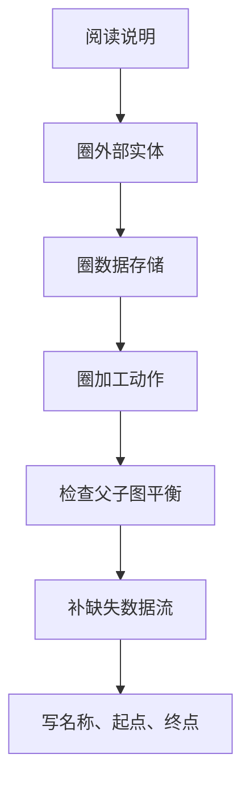

# chapter I - 试题一

适用对象：软件设计师下午题新手备考  

# 一、当前整理范围

```text
chapter I - 试题一：数据流图 DFD
├─ 1. 上下文图
│  ├─ 外部实体识别
│  ├─ 系统边界判断
│  └─ 顶层输入输出数据流
├─ 2. 0层数据流图
│  ├─ 加工识别
│  ├─ 数据存储识别
│  ├─ 数据流补全
│  └─ 父图与子图平衡
├─ 3. 常考问题
│  ├─ E1～En：外部实体命名
│  ├─ D1～Dn：数据存储命名
│  ├─ 缺失数据流：名称、起点、终点
│  ├─ 加工分解：子加工、输入、输出
│  └─ 图中错误：黑洞、奇迹、灰洞、实体直连
├─ 4. 高频年份题型
│  ├─ 医院病人监控系统
│  ├─ 巴士维修系统
│  ├─ 匹萨信息系统
│  ├─ 考试系统
│  ├─ 在线作业批改系统
│  ├─ 会议预订系统
│  ├─ 证券交易平台
│  ├─ 采购系统
│  ├─ 共享单车系统
│  ├─ 医疗管理系统
│  ├─ 房屋中介信息系统
│  ├─ 学生跟踪系统
│  ├─ 二手车物流系统
│  ├─ 智能检测系统
│  ├─ 无人值守停车系统
│  └─ 智慧农业平台
└─ 5. 作答能力
   ├─ 从文字说明反推图
   ├─ 从父图反推子图
   ├─ 从加工描述补数据流
   └─ 用结构化语言描述加工逻辑
```

# 二、复习建议

| 轮次 | 目标 | 建议做法 | 关注重点 |
|---|---|---|---|
| 第1轮 | 看懂 DFD 基本符号 | 先背外部实体、加工、数据流、数据存储四类元素 | 不要把“人/系统/文件/处理动作”混在一起 |
| 第2轮 | 能从说明中圈答案 | 每读一条功能，分别圈“谁发起、处理什么、存到哪里、返回给谁” | 实体、数据存储、加工名必须尽量使用题干原词 |
| 第3轮 | 能补缺失数据流 | 对照上下文图与0层图，逐个检查父图输入输出是否在子图出现 | 父子图平衡、加工输入输出完整性 |
| 第4轮 | 能写规范答案 | 用表格写“数据流名称 + 起点 + 终点”，用结构化语言写加工逻辑 | 术语统一、不要自造名词、不要写成程序代码 |

# 三、章节笔记

## 总记忆表

| 模块 | 记忆句 |
|---|---|
| 外部实体 | 系统外的人、组织、设备、其他系统才是实体 |
| 加工 | 动词短语通常是加工，如“生成报告”“检查库存”“确认预订” |
| 数据存储 | “表、文件、记录、档案、库”通常是数据存储 |
| 数据流 | 名词短语在箭头上，如“订单信息”“查询请求”“确认信息” |
| 上下文图 | 只看系统与外界交换什么，不展开内部细节 |
| 0层图 | 把系统拆成若干加工，并显示加工、存储、实体之间的数据流 |
| 平衡原则 | 父图有的外部输入输出，子图必须能找到对应数据流 |
| 禁止实体直连 | 实体与实体之间不能直接有数据流，必须经过加工 |
| 黑洞 | 加工只有输入没有输出 |
| 奇迹 | 加工只有输出没有输入 |
| 灰洞 | 输入不足以产生输出 |

## 1. 数据流图 DFD 的四类元素

### 1. 知识点

| 元素 | 常见画法 | 题干关键词 | 判断方法 | 常见错误 |
|---|---|---|---|---|
| 外部实体 | 方框 | 客户、医生、教师、管理员、传感器、支付系统 | 在系统外部，与系统交换数据 | 把内部数据库当实体 |
| 加工 | 圆角矩形/圆 | 检查、生成、维护、查询、处理、更新、记录 | 对数据进行处理或转换 | 加工名写成名词，不体现处理动作 |
| 数据存储 | 开口矩形/平行线 | 表、文件、记录、档案、清单、库存 | 系统内部保存数据的位置 | 把外部系统当数据存储 |
| 数据流 | 箭头 | 信息、请求、结果、报告、通知、订单 | 表示数据从一处到另一处 | 数据流名写成动作 |

### 2. 文字讲解

试题一最稳定的考法，是给一段业务说明，再给上下文图和0层图，让考生补 E、D 或缺失数据流。新手最容易犯的错，是看到“医生”“客户”“管理员”就全部写成实体，但有些“管理员”如果只维护系统内部数据，确实是外部实体；而“日志文件”“病历文件”“订单表”则不是实体，而是系统内部的数据存储。

判断时要先问一句：**它是在系统外面与系统交换数据，还是在系统里面保存数据？** 如果是前者，就是外部实体；如果是后者，就是数据存储。加工则一般是动词短语，表达“系统做了什么”。例如“生成成绩报告”是加工，“成绩报告”是数据流，“成绩报告表”才可能是数据存储。

### 3. 例题分析

**例 1：医院病人监控系统**  
题眼是“病人、医生、护理人员与系统交互”。病人通过设备提供生命特征，医生维护范围、生成病历和治疗意见，护理人员请求报告或查询治疗意见。因此它们是外部实体。日志文件、生命特征范围文件、病历文件、治疗意见文件用于保存数据，是数据存储。

**例 2：考试系统**  
教师制定试题、考试信息和学生信息；学生接收题目并提交解答。这里“教师”“学生”是外部实体；“试题表”“考试信息表”“学生信息表”“解答结果表”是数据存储。题目、答案、考试说明、学生解答等在加工之间流动，是数据流。

### 4. 记忆技巧

```text
人机组织在外边，文件表库存放里边；
动词短语是加工，名词短语走箭头。
```

## 2. 上下文图与0层图的平衡

### 1. 知识点

| 概念 | 含义 | 做题用法 |
|---|---|---|
| 上下文图 | 把整个系统看成一个加工 | 只出现系统、外部实体、进出系统的数据流 |
| 0层图 | 把系统分解为若干加工 | 出现多个加工、数据存储和更细的数据流 |
| 平衡 | 父图中的外部输入输出，在子图中不能丢失 | 缺失数据流题经常从这里下手 |
| 分解 | 把一个加工细分为若干子加工 | 题目问“某加工可以分解为哪些子加工” |

### 2. 文字讲解

上下文图像“系统的大门”，只看谁跟系统交换了什么；0层图像“系统内部车间”，要看这些数据进入系统后被哪些加工处理，最后存到哪些表或返回给哪些外部实体。考试常见缺失数据流，通常不是凭空猜，而是通过两条线索找出来。

第一条线索是**父子图平衡**。如果上下文图中有“客户订单”进入系统，而0层图中没有任何加工接收“客户订单”，就说明0层图缺少这条输入流。第二条线索是**加工语义完整**。如果加工叫“生成病历”，却没有读取生命特征或输出病历，那么这个加工要么缺输入，要么缺输出。

### 3. Mermaid 稳定图示



### 4. 记忆技巧

```text
父图有，子图要有；
加工要能说得通；
输入足够，输出合理。
```

## 3. 缺失数据流的标准找法

### 1. 知识点

| 检查角度 | 问题 | 修正方向 |
|---|---|---|
| 父图输入 | 上下文图进系统的数据，在0层图有没有入口？ | 补“外部实体 → 加工”的数据流 |
| 父图输出 | 上下文图出系统的数据，在0层图有没有出口？ | 补“加工 → 外部实体”的数据流 |
| 数据存储读 | 加工需要查询某表，但图中没有读入 | 补“数据存储 → 加工”的数据流 |
| 数据存储写 | 加工生成数据后应存储，但图中没有写入 | 补“加工 → 数据存储”的数据流 |
| 加工完整性 | 加工是否只有输入无输出、只有输出无输入？ | 修正黑洞或奇迹 |

### 2. 文字讲解

补数据流题必须写完整三项：**数据流名称、起点、终点**。答案中最好不用“从A到B”这种口语写法，而是写成表格。数据流名称尽量使用说明和图中的原词，比如“维修情况”“生产计划”“题目”“答案”“支付细节”。如果题干中某个数据流可以拆分，答案通常也接受等价名称，但不要自造业务外的新词。

对于“读表”和“写表”要区分方向。加工从文件中取得数据，是“文件 → 加工”；加工把结果存入文件，是“加工 → 文件”。例如“生成病历”根据日志文件形成病历并存入病历文件，至少涉及“日志文件 → 生成病历”的生命特征数据，以及“生成病历 → 病历文件”的病历数据。

## 4. 加工分解与结构化语言

### 1. 知识点

| 题型 | 要求 | 常见答法 |
|---|---|---|
| 分解某加工 | 写出子加工名称 | 用说明中的动词短语拆分 |
| 描述加工逻辑 | 用结构化语言写判断和处理过程 | IF/THEN/ELSE/ENDIF |
| 分解注意事项 | 说明常见错误 | 黑洞、奇迹、灰洞 |

### 2. 文字讲解

当题目问“某加工可以分解为哪些子加工”，不能把功能说明整段照抄，而要将复杂加工拆成几个职责明确的小加工。例如“使用单车”可以拆为“扫码/手动开锁”“骑行单车”“锁车结账”；“数据处理”可以拆为“监测分析实时监测信息”“综合统计和预测历史监测信息”“分析结果可视化与存储”“预测信息可视化与存储”。

当题目要求写结构化语言，应该像伪代码一样表达判断逻辑，但不要写成具体编程语言。比如“道闸控制”题，可以先写收到道闸控制请求，再判断道闸执行状态是否正常，最后区分入场车辆和出场车辆分别更新停车记录和空余车位数。

### 3. 结构化语言模板

```text
接收[输入数据]
IF [条件]
    THEN [处理1]
         [输出或存储1]
ELSE
    [处理2]
    [输出或存储2]
ENDIF
```

# 四、按专题插入原题与解析

## 专题一：外部实体与数据存储识别

### 题 1：2011年上半年 病人监控系统

**原题摘要**  
系统通过设备监控病人的生命特征，在生命特征异常时向医生和护理人员报警；系统包括本地监控、格式化生命特征、检查生命特征、维护生命特征范围、提取报告、生成病历、查询病历、生成治疗意见、查询治疗意见等功能。

**解析**  
先抓题眼：题目问 E1～E3 和 D1～D4。说明中与系统直接交互的人有病人、护理人员、医生。病人提供生命特征；护理人员接收报警、请求报告、查询治疗意见；医生维护范围、查询病历、生成病历和治疗意见。

再看数据存储：带有“文件”的词语基本就是 D。生命特征范围文件用于比较正常范围；日志文件保存格式化后的生命特征；病历文件保存病历；治疗意见文件保存处方等治疗意见。

**参考答案**  

| 项目 | 答案 |
|---|---|
| E1 | 病人 |
| E2 | 护理人员 |
| E3 | 医生 |
| D1 | 生命特征范围文件 |
| D2 | 日志文件 |
| D3 | 病历文件 |
| D4 | 治疗意见文件 |

**缺失数据流**

| 数据流名称 | 起点 | 终点 |
|---|---|---|
| 重要生命特征 | 本地监控 | 格式化生命特征 |
| 格式化后的生命特征 | 格式化生命特征 | 检查生命特征 |
| 病例/病历 | 生成病历 | D3 或 病历文件 |
| 生命特征 | D2 或 日志文件 | 生成病历 |

**答案方向**  
实体之间不能直接连数据流。E1 和 E3 之间不可以有数据流，因为 DFD 中数据流的起点或终点至少有一个必须是加工，外部实体之间的数据交换不属于系统内部建模范围。

---

### 题 2：2014年上半年 巴士维修系统

**原题摘要**  
系统记录巴士ID和维修问题，确定所需部件，完成维修，记录维修工时，计算维修总成本。

**解析**  
先抓题眼：外部实体是系统外部参与者。巴士司机查看已维修机械问题；机械师完成维修并登记维修情况；会计接收维修工时和部件成本；主管接收维修总结；库存管理系统监控部件使用情况。数据存储则是巴士列表文件、维修记录文件、部件清单、人事档案。

图中问题常考“黑洞/奇迹/父子图不平衡”。如果某加工只有输出没有输入，就是奇迹；如果父图中有“维修情况”进入系统，而0层图没有体现，也属于父子图不平衡。

**参考答案**

| 项目 | 答案 |
|---|---|
| E1 | 巴士司机 |
| E2 | 机械师 |
| E3 | 会计 |
| E4 | 主管 |
| E5 | 库存管理系统 |
| D1 | 巴士列表文件 |
| D2 | 维修记录文件 |
| D3 | 部件清单 |
| D4 | 人事档案 |

**图中问题**  
处理3“完成维修”只有输出数据流，没有输入数据流；图1-2中还缺少上下文图中的“维修情况”。

**补充数据流**

| 数据流名称 | 起点 | 终点 |
|---|---|---|
| 待维修机械问题 | D2 或 维修记录文件 | 3 或 完成维修 |
| 实际所用部件 | D3 或 部件清单 | 5 或 计算总成本 |
| 维修情况 | E2 或 机械师 | 3 或 完成维修 |

**答案方向**  
看到“机械师根据维修记录文件中的待维修机械问题完成维修”，就要补“维修记录文件 → 完成维修”。看到“登记维修情况”，就要补“机械师 → 完成维修”。

---

### 题 3：2014年下半年 匹萨信息系统

**原题摘要**  
系统包括销售、生产控制、生产、采购、运送、财务管理、存储等功能。

**解析**  
先抓题眼：客户提交订单并接收费用清单、收据和匹萨；供应商接收采购订单、提供供应量并接收支付细节。因此 E1 和 E2 是客户与供应商。数据存储由说明中的“表”确定：销售订单表、库存表、生产计划表、配方表、采购订单表。

缺失数据流主要围绕“生产计划”“未完成订单”“销售订单”“原材料数量”“库存量”“支付细节”展开。方向判断时要问：这个数据是被谁读取，还是由谁写入？生产根据生产计划做匹萨，因此生产计划从生产计划表流向生产；采购得到供应量后更新库存，因此原材料数量从采购流向库存表。

**参考答案**

| 项目 | 答案 |
|---|---|
| E1 | 客户 |
| E2 | 供应商 |
| D1 | 销售订单表 |
| D2 | 库存表 |
| D3 | 生产计划表 |
| D4 | 配方表 |
| D5 | 采购订单表 |

**缺失数据流**

| 数据流名称 | 起点 | 终点 |
|---|---|---|
| 生产计划 | D3 或 生产计划表 | 3 或 生产 |
| 未完成订单 | D1 或 销售订单表 | 7 或 存储 |
| 销售订单 | D1 或 销售订单表 | 5 或 运送 |
| 原材料数量 | 4 或 采购 | D2 或 库存表 |
| 库存量 | D2 或 库存表 | 4 或 采购 |
| 支付细节 | 6 或 财务管理 | E2 或 供应商 |

**答案方向**  
凡是“根据某表制定/生产/支付/交付”，多半是“数据存储 → 加工”；凡是“记录在某表中”，多半是“加工 → 数据存储”。

---

### 题 4：2015年上半年 考试系统

**原题摘要**  
系统由教师设置考试，学生在有效时间内接收考试说明和题目并提交解答，系统处理解答，生成成绩报告、成绩单，并发送通知。

**解析**  
先抓题眼：与考试有关的外部参与者只有教师和学生。系统管理员创建考试基础信息，但题目说明强调教师和学生进行考试相关工作，因此上下文图中的 E 多为教师、学生。数据存储包括试题表、学生信息表、考试信息表、解答结果表。

缺失数据流中，处理解答必须读取“答案”；显示并接收解答必须读取“题目”。如果图中只有学生解答流入处理解答，而没有答案，则加工输入不足，属于灰洞。

**参考答案**

| 项目 | 答案 |
|---|---|
| E1 | 教师 |
| E2 | 学生 |
| D1 | 试题表 / 题目和答案表 |
| D2 | 学生信息表 |
| D3 | 考试信息表 |
| D4 | 解答结果表 |

**缺失数据流**

| 数据流名称 | 起点 | 终点 |
|---|---|---|
| 答案 | D1 或 试题表 | 3 或 处理解答 |
| 题目 | D1 或 试题表 | 2 或 显示并接收解答 |

**加工分解**  
“发送通知”可分解为两个加工：**创建通知** 和 **发送通知**。

| 数据流名称 | 起点 | 终点 |
|---|---|---|
| 报告数据 | 生成成绩报告 | 创建通知 |
| 成绩单数据 | 生成成绩单 | 创建通知 |
| 通知数据 | 创建通知 | 发送通知 |

**答案方向**  
发送通知不是一个简单动作，而是“根据成绩数据创建通知，再把通知发给对应对象”。因此分解时要保留输入来源和输出方向。

---

### 题 5：2015年下半年 在线作业批改系统

**原题摘要**  
学生提交电子作业，讲师下载未批改作业、批改并上传批改后的作业，系统记录分数和评价；教务人员进行作业抽检。

**解析**  
先抓题眼：外部实体是学生、讲师、教务人员。题干明确说学生表和讲师表已初始化为数据库中的表，因此它们是数据存储而不是外部实体。还会有作业表、批改后作业表或抽检报告相关存储。

做题时要特别注意“通知”。通知若由系统直接发送给学生和讲师，则是系统输出数据流；若通过第三方 Email 系统发送，则 Email 系统要作为新的外部实体加入上下文图和0层图。

**参考答案方向**

| 项目 | 推荐答案 |
|---|---|
| 外部实体 | 学生、讲师、教务人员 |
| 数据存储 | 学生表、讲师表、作业表、批改后作业/批改作业表 |

**常见缺失数据流方向**

| 数据流名称 | 起点 | 终点 | 判断依据 |
|---|---|---|---|
| 学生标识 | 学生 | 提交作业 / 获取已批改作业 | 需要验证学生标识 |
| 讲师标识 | 讲师 | 下载未批改作业 | 需要验证讲师标识 |
| 批改后的作业 | 上传批改后的作业 | 数据存储 | 返回系统并存储 |
| 分数和评价 | 记录分数和评价 | 学生信息/学生表 | 记录在学生信息中 |

**问题4答案方向**  
如果通知通过第三方 Email 系统发送，则应在上下文图中增加外部实体“Email系统”；系统发送给学生和讲师的通知应改为发送给 Email 系统，再由 Email 系统完成邮件发送。在0层图中，也要增加“通知数据/邮件通知”从发送通知加工到 Email 系统的数据流。

---

### 题 6：2016年上半年 会议预订系统

**原题摘要**  
客户提交预订请求；管理员确认临时预订、确认预订、变更预订、要求付款、确认余款支付；系统维护客户、预订、设施和设备等信息。

**解析**  
先抓题眼：客户与管理员是主要外部实体。数据存储通常包括预订表、客户记录、设施表、设备表。缺失数据流常与“检查可用性”“分配设施与设备”“确认预订”“要求付款”有关。

这类题的难点是一个业务流会多次使用“客户记录”和“预订表”。例如发送临时预订确认信息、支付定金要求、预订确认信息和余款要求，都需要从客户记录中得到客户联系方式；判断场地是否可用，则需要读取预订表。

**参考答案方向**

| 项目 | 推荐答案 |
|---|---|
| 外部实体 | 客户、会议中心管理员/管理员 |
| 数据存储 | 预订表、客户记录、设施表、设备表 |

**常见缺失数据流方向**

| 数据流名称 | 起点 | 终点 | 判断依据 |
|---|---|---|---|
| 预订请求 | 客户 | 检查可用性 | 客户提交预订请求 |
| 可用性信息/不可用信息 | 检查可用性 | 客户 | 不可用时返回不可用信息 |
| 设施与设备需求 | 临时预订/变更预订 | 分配设施与设备 | 分配依据 |
| 客户记录 | 客户记录 | 发送确认/要求付款相关加工 | 需要客户联系方式 |

**Email 修改题答案方向**  
如果确认信息通过 Email 系统发送，应在上下文图中增加外部实体“Email系统”，并将原来直接发给客户的确认信息改为由系统发送邮件数据到 Email 系统。0层图中相应加工输出的“确认信息/付款要求”等数据流终点改为 Email 系统，必要时从客户记录读取电子邮件地址。

---

### 题 7：2016年下半年 证券交易平台

**原题摘要**  
客户服务助理提交开户信息；客户进行存款、取款、证券交易；经纪人通过电话进行证券交易；平台记录客户、账户和交易信息，并检查交易返回交易明细。

**解析**  
外部实体来自说明中的角色：客户服务助理、客户、经纪人。数据存储来自“客户记录、账户记录、交易记录”。缺失数据流重点在开户信息、存款金额、取款金额、交易信息、交易明细，以及对账户记录的读取和更新。

**参考答案方向**

| 项目 | 推荐答案 |
|---|---|
| E1～E3 | 客户服务助理、客户、经纪人 |
| D1～D3 | 客户记录、账户记录、交易记录 |

**常见缺失数据流方向**

| 数据流名称 | 起点 | 终点 | 判断依据 |
|---|---|---|---|
| 开户信息 | 客户服务助理 | 开户 | 开户输入 |
| 存款金额 | 客户 | 存款 | 修改账户余额 |
| 取款金额 | 客户 | 取款 | 修改账户余额 |
| 交易明细 | 检查交易 | 客户 | 返回给客户 |

**问题4答案方向**  
若实际交易要在证券交易中心完成，则应把“证券交易中心”作为新的外部实体加入上下文图；在0层图中，“证券交易”加工需要向证券交易中心发送交易信息，并接收交易结果或交易确认，再将交易信息/结果写入交易记录。这样才能反映平台与外部交易中心之间的真实交互。

---

### 题 8：2017年上半年 采购系统

**原题摘要**  
采购部门检查库存水平并下达采购订单；供应商提交提单并交运部件；S/R 部门验证装运部件；检验员检验质量；库管员更新库存。

**解析**  
本题实体较多，最容易漏。只要在说明中看到“部门/人员/供应商”且与系统交换数据，就应优先考虑外部实体。数据存储包括供应商文件、采购订单文件、质量标准、部件库存等。

缺失数据流要围绕三步接收货物过程检查：验证装运部件需要采购订单和提单；检验质量需要质量标准；更新库存需要接受的部件列表。

**参考答案方向**

| 项目 | 推荐答案 |
|---|---|
| 外部实体 | 采购部门、供应商、S/R职员、检验员、库管员 |
| 数据存储 | 供应商文件、采购订单文件、质量标准、部件库存 |

**常见缺失数据流方向**

| 数据流名称 | 起点 | 终点 | 判断依据 |
|---|---|---|---|
| 供应商数据 | 供应商文件 | 下达采购订单 | 通过供应商文件访问供应商数据 |
| 采购订单 | 采购订单文件 | 验证装运部件 | 与提单比较 |
| 质量标准 | 质量标准 | 检验部件质量 | 检查质量依据 |
| 接受的部件列表 | 检验部件质量 | 更新部件库存 | 合格部件用于更新库存 |

**问题4答案方向**  
保持 DFD 平衡，就是保证上下文图中系统与外部实体之间的输入输出数据流，在0层图中仍然存在；0层图对系统内部加工进行了分解，但不能丢失父图的数据流，也不能新增与父图矛盾的外部输入输出。

---

### 题 9：2017年下半年 共享单车系统

**原题摘要**  
系统支持用户注册登录、使用单车、辅助管理、管理与监控。使用单车包括扫码/手动开锁、骑行单车、锁车结账。

**解析**  
外部实体包括用户、商家和北斗定位/单车设备相关外部端。数据存储通常包括用户信息、单车信息、行程信息、故障信息、计费规则等。题目若问“使用单车”分解，不能泛泛写“骑车”，而要按说明中三级编号拆成三个子加工。

**参考答案方向**

| 项目 | 推荐答案 |
|---|---|
| 外部实体 | 用户、商家、单车/定位系统 |
| 数据存储 | 用户信息、单车信息、行程信息、故障信息、计费规则 |

**“使用单车”子加工**

```text
使用单车
├─ 扫码/手动开锁
├─ 骑行单车
└─ 锁车结账
```

**答案方向**  
扫码/手动开锁处理开锁密码和单车状态；骑行单车处理位置上传和行程更新；锁车结账处理费用计算、支付状态、开锁密码重置和单车状态重置。

---

### 题 10：2018年上半年 医疗管理系统

**原题摘要**  
系统包括通用信息查询、医生聘用、预约处理、药品管理、报表创建。

**解析**  
外部实体包括客户、医生、主管。数据存储包括通用信息表、医生表、医生出诊时间表、预约表、药品数据。预约处理是复杂加工，可以进一步分解为医生安排出诊时间、预约查询、创建预约、更新医生出诊时间、反馈预约结果等。

**参考答案方向**

| 项目 | 推荐答案 |
|---|---|
| 外部实体 | 客户、医生、主管 |
| 数据存储 | 通用信息表、医生表、医生出诊时间表、预约表、药品数据 |

**“预约处理”可分解为**

```text
预约处理
├─ 安排出诊时间
├─ 处理预约查询
├─ 创建预约
├─ 更新医生出诊时间
└─ 反馈预约结果与预约通知
```

**平衡说明**  
上下文图中客户的预约查询请求、预约请求以及系统返回的预约结果，在0层图中都应由“预约处理”相关子加工接收或输出；医生的出诊安排和预约通知也必须在0层图中体现。

---

### 题 11：2018年下半年 房屋中介信息系统

**原题摘要**  
系统包括房源采集与管理、客户管理、房源推荐、交易管理、信息查询。

**解析**  
外部实体包括客户、经纪人、财务人员、外部网站。数据存储包括潜在房源、房源、客户、订单/交易信息等。问题4要求写“客户信息”“房源信息”的组成，应直接从说明中抽取字段，不要补充题干没有出现的字段。

**参考答案方向**

| 数据流 | 组成 |
|---|---|
| 客户信息 | 身份证号、姓名、手机号、需求情况、委托方式等 |
| 房源信息 | 基本情况、配套设施、交易类型、委托方式、业主等 |

**答案方向**  
看到“信息包括……”就是组成题的直接答案来源。组成题不要求画图，通常用“字段1、字段2、字段3……”作答即可。

---

### 题 12：2019年上半年 学生跟踪系统

**原题摘要**  
系统采集学生状态，进行健康状态告警、到课检查、汇总在校情况、家长注册和基础信息管理。

**解析**  
外部实体包括学生卡传感器、班主任、家长、医护机构健康服务系统、学校管理人员。数据存储包括学生状态/状态记录、学生信息、课表/校园场所、家长信息等。数据流组成题直接从说明提取。

**参考答案方向**

| 数据流 | 组成 |
|---|---|
| 学生状态 | 学生心率、体温、所在位置、学生卡ID等 |
| 学生信息 | 学生基本信息、学生卡标识、班级、家长ID、班主任等 |

**缺失数据流常见方向**

| 数据流名称 | 起点 | 终点 |
|---|---|---|
| 学生状态 | 采集学生状态 | 健康状态告警 / 到课检查 |
| 课表信息 | 课表数据存储 | 到课检查 |
| 家长注册申请 | 家长 | 家长注册 |
| 注册结果 | 基础信息管理 | 家长 |

---

### 题 13：2019年下半年 二手车物流系统

**原题摘要**  
系统包括订单管理、路线管理、合约管理、寻找物流商、物流商注册。

**解析**  
外部实体包括车辆交易系统、帮买顾问、物流商。数据存储包括订单、路线、合约、物流商账号/物流商信息等。加工“寻找物流商”适合用结构化语言描述，因为它有明确的条件分支：保卖车或全国购走竞拍体系；普通二手车若符合固定路线或包车路线则分配合约物流商，否则进入竞拍体系。

**结构化语言参考**

```text
接收新订单
IF 订单类型为保卖车或全国购
    THEN 将订单分配到竞拍体系
ELSE
    IF 符合固定路线或包车路线
        THEN 自动分配给合约物流商
    ELSE
        将订单信息分配到竞拍体系
    ENDIF
ENDIF
竞拍体系将订单信息推送给有相关路线的物流商
物流商竞拍出价
选择最优报价的物流商中标
发送物流消息给承运物流商
更新订单的物流信息
向车辆交易系统发送物流信息
```

**答案方向**  
结构化语言要体现选择条件和处理结果。不要只写“寻找合适物流商”，那只是功能名，不是加工逻辑。

---

### 题 14：2020年下半年 智能检测系统

**原题摘要**  
系统包括基础信息管理、检测模型部署、图像采集、缺陷检测、质量检测、模型监控。

**解析**  
先抓题眼：管理员维护基础信息和部署模型；检测设备提供产品图像或接收控制指令；检测业务员接收质量情况并发起远程控制命令；监控人员接收模型运行情况。

**参考答案**

| 项目 | 答案 |
|---|---|
| E1 | 检测设备 |
| E2 | 管理员 |
| E3 | 检测业务员 |
| E4 | 监控人员 |
| D1 | 模型信息表 |
| D2 | 检测信息表 |
| D3 | 基础信息表 |

**缺失数据流**

| 数据流名称 | 起点 | 终点 |
|---|---|---|
| 产品检测信息 | P2 | P3 |
| 监控规则 | D3 | P5 |
| 远程控制命令 | E3 | P5 |
| 基础信息 | D3 | P6 |

**缺陷检测加工逻辑**

```text
接收到产品检测信息
对所有图像进行检测
IF 一个产品出现一张图像检测不合格
    THEN 该产品不合格
         检测结果包括产品型号和不合格类型
ELSE
    该产品检测合格
ENDIF
```

**答案方向**  
本题核心是“只要一个产品的一张图像不合格，该产品就不合格”。结构化语言必须表达这个条件。

---

### 题 15：2021年上半年 无人值守停车系统

**原题摘要**  
系统包括信息维护、会员注册、车牌识别、计费、道闸控制。

**解析**  
实体包括车辆、车主、支付系统、管理人员、道闸控制系统。数据存储包括停车记录表、会员信息表、基础信息表。道闸控制是本题的逻辑重点，需要区分入场车辆与出场车辆，并根据道闸执行状态正常与否进行处理。

**参考答案**

| 项目 | 答案 |
|---|---|
| E1 | 车辆 |
| E2 | 车主 |
| E3 | 支付系统 |
| E4 | 管理人员 |
| E5 | 道闸控制系统 |
| D1 | 停车记录表 |
| D2 | 会员信息表 |
| D3 | 基础信息表 |

**缺失数据流**

| 数据流名称 | 起点 | 终点 |
|---|---|---|
| 道闸控制请求 | P1 | P5 |
| 计费规则 | D3 | P3 |
| 更新余额 | P3 | D2 |
| 修改空余车位数 | P5 | D3 |

**道闸控制加工逻辑**

```text
收到道闸控制请求
向道闸控制系统发送放行指令
接收道闸执行状态
IF 道闸执行状态为正常放行
    THEN
        IF 入场车辆
            THEN 将车牌号及入场时间存入停车记录
                 修改空余车位数
        ELSE
            更新停车状态
            修改空余车位数
        ENDIF
ELSE
    向管理人员发送异常告警信息
ENDIF
```

**答案方向**  
本题不能只写“控制道闸放行”。必须把“正常放行”和“异常告警”两个分支写清楚。

---

### 题 16：2021年下半年 智慧农业平台

**原题摘要**  
系统包括信息维护、数据采集、数据处理、远程控制、可视化。

**解析**  
实体包括传感器、农业专家、农业人员、控制器。数据存储包括监控处理规则表、监测信息表、分析结果表、预测信息表。题目问“数据处理”可以分解为什么，说明中已经给出分解线索：实时监测分析、结果可视化和存储、远程控制、历史统计预测、预测信息可视化和存储。

**参考答案**

| 项目 | 答案 |
|---|---|
| E1 | 传感器 |
| E2 | 农业专家 |
| E3 | 农业人员 |
| E4 | 控制器 |
| D1 | 监控处理规则表 |
| D2 | 监测信息表 |
| D3 | 分析结果表 |
| D4 | 预测信息表 |

**缺失数据流**

| 数据流名称 | 起点 | 终点 |
|---|---|---|
| 分析结果 | P3 | P5 |
| 历史监测信息 | D2 | P3 |
| 预测信息 | P3 | P5 |
| 监控处理规则 | D1 | P4 |
| 请求 | E2 | P5 |

**“数据处理”可分解为**

```text
数据处理
├─ 监测分析实时监测信息
├─ 分析结果可视化、存储、远程控制
├─ 综合统计和预测历史监测信息
└─ 预测信息可视化、存储
```

**进一步分解时需要注意的三类错误**

| 错误 | 含义 | 记忆 |
|---|---|---|
| 黑洞 | 加工有输入但没有输出 | 吃进去不吐出来 |
| 奇迹 | 加工有输出但没有输入 | 没来由地产生数据 |
| 灰洞 | 输入不足以产生输出 | 输入太少，输出太大 |

---

# 五、本章总结

## 先抓最稳的分

试题一最稳的分来自问题1和问题2，也就是外部实体和数据存储。做题时只需牢牢抓住两句话：**外部实体是系统外的人、组织、设备或其他系统；数据存储是系统内的表、文件、记录、档案、清单。** 这两类题不要过度推理，优先使用说明中的原词。

## 再抓数据流题

补数据流题要分三步：第一步，对照上下文图，看父图中的外部输入输出有没有在0层图中出现；第二步，逐个加工检查是否有足够输入和合理输出；第三步，根据说明中的“根据……”“存入……”“返回……”确定方向。答案必须写成“数据流名称、起点、终点”。

## 最后处理分解和逻辑题

加工分解题按说明中的子功能拆，不要自由发挥。结构化语言题用 IF/THEN/ELSE 写清楚条件分支，尤其是“若……则……否则……”这类句子。题目问数据流组成时，直接从说明的“信息包括……”中摘取字段。

## 冲刺版口诀总表

```text
试题一，看说明，先圈名词再圈动词。
人和系统是实体，文件表库是存储。
动词短语是加工，名词短语是数据流。
父图有的子图有，父图没有别乱加。
加工不能黑洞，不能奇迹，也不能灰洞。
读表方向表到加工，写表方向加工到表。
实体之间不直连，必须经过一个加工。
分解加工看编号，结构语言写判断。
组成题看“包括”，字段照抄最稳妥。
答案表格三列写：名称、起点、终点。
```
