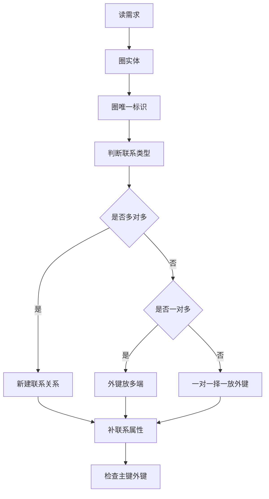

# chapter II - 试题二

适用对象：软件设计师新手备考  

# 一、当前整理范围

```text
chapter II - 试题二：数据库设计
├─ 1. E-R 图基本元素
│  ├─ 实体
│  ├─ 属性
│  ├─ 联系
│  ├─ 联系类型：1:1、1:n、m:n
│  ├─ 弱实体
│  └─ ISA / 子类型
├─ 2. 从需求文字抽取数据库对象
│  ├─ 名词多为实体或属性
│  ├─ 动词多为联系
│  ├─ “唯一标识”提示主键
│  ├─ “一个……多个……”提示联系类型
│  └─ “记录……时间/数量/评价”等提示联系属性
├─ 3. E-R 图转换为关系模式
│  ├─ 实体转关系
│  ├─ 1:1 联系转换
│  ├─ 1:n 联系转换
│  ├─ m:n 联系转换
│  ├─ 弱实体转换
│  └─ 多值属性转换
├─ 4. 主键与外键判断
│  ├─ 主键：唯一标识元组
│  ├─ 外键：引用其他关系主键
│  ├─ 组合主键
│  └─ 全码
├─ 5. 规范化与异常
│  ├─ 复合属性拆分
│  ├─ 多值属性拆表
│  ├─ 部分依赖
│  ├─ 传递依赖
│  └─ 插入、删除、修改异常
└─ 6. 历年试题二专题解析
   ├─ 邮件客户端系统
   ├─ 物流 / 快递 / 维修 / 配送类系统
   ├─ 电视台 / 超市 / 宾馆 / 租赁类系统
   ├─ 电商 / 代购 / 团购类系统
   ├─ 公司组织 / 部门员工类系统
   └─ 项目投资 / 培训管理类系统
```

# 二、复习建议

| 轮次 | 目标 | 建议做法 | 关注重点 |
|---|---|---|---|
| 第 1 轮 | 看懂 E-R 图题 | 先不急着画图，把题干中“实体、属性、唯一标识、一个/多个”圈出来 | 实体、属性、联系、联系类型 |
| 第 2 轮 | 会补关系模式 | 每题把空缺字段填出来，再判断主键和外键 | 1:n 外键放 n 端，m:n 单独建表 |
| 第 3 轮 | 会处理变化需求 | 专练“新增实体/新增联系/多值属性/历史记录”题 | 是否要新建关系，是否改变联系类型 |
| 第 4 轮 | 冲刺答题模板 | 直接背固定话术和转换规则 | 弱实体、复合属性、传递依赖、全码 |

# 三、章节笔记

## 总记忆表

| 模块 | 记忆句 |
|---|---|
| 实体识别 | 题干中的核心业务对象通常是实体，如客户、员工、订单、车辆、商品。 |
| 属性识别 | “包括……”后面列出的通常是属性；“唯一标识”后面的通常是主键。 |
| 联系识别 | 题干中的业务动作通常是联系，如购买、受理、安排、管理、签约、配送。 |
| 联系类型 | 看到“一个 A 多个 B，一个 B 一个 A”就是 A 与 B 为 1:n。 |
| 1:n 转换 | 外键放在 n 端关系中。 |
| m:n 转换 | 必须单独建立联系关系，主键通常由两端实体主键组合而成。 |
| 1:1 转换 | 外键可放任一端，通常放在参与更紧密或题目已给出的关系中。 |
| 弱实体 | 自己的局部码不能全局唯一，必须依赖强实体主键共同标识。 |
| 多值属性 | 一个对象有多个电话、多个技能、多个家属，通常单独建关系。 |
| 规范性问题 | 一个关系中反复出现同一实体的多组值，常导致冗余和更新异常。 |

## 1. E-R 图基本元素

### 1. 知识点

| 元素 | 含义 | 试题中的提示词 | 答题落点 |
|---|---|---|---|
| 实体 | 现实中可独立区分的对象 | 客户、员工、部门、商品、订单、车辆 | 画矩形，转换为关系模式 |
| 属性 | 描述实体或联系的数据项 | 包括、信息有、记录…… | 写入对应关系模式 |
| 联系 | 实体之间的业务关系 | 管理、属于、购买、受理、安排、签约 | 画菱形或在文字中说明 |
| 联系属性 | 描述一次联系本身的数据 | 时间、数量、金额、评价、完成时间 | 放入联系关系或 n 端关系 |
| 联系类型 | 实体参与联系的数量约束 | 一个、多名、只能、可以多个 | 标 1:1、1:n、m:n |

### 2. 文字讲解

试题二最常见的错误，是把“实体的属性”和“联系的属性”混在一起。例如“员工有姓名、电话”明显属于员工属性；但“业务员受理申请的受理时间”不是员工本身属性，也不是申请本身天然属性，而是“受理”这次联系的属性。下午题经常把联系属性放到联系关系中考查，例如“安排承运（申请号，装货时间，到达时间，业务员）”“执行（申请号，策划员，实际完成时间，用户评价）”。

判断实体时，优先找能独立存在、能被多次引用、具有唯一编号的对象。判断属性时，优先看“包括……”。判断联系时，抓动词。判断联系类型时，抓数量词。

### 3. 例题分析

#### 例 1：客户与订单

题干：一个客户可以有多个订单，一个订单只属于一个客户。

**解析**  
先抓题眼：“一个客户多个订单，一个订单一个客户”。这就是客户到订单的 1:n 联系。转换关系模式时，外键放在 n 端，即订单表中加入客户号。

**结论**  
客户 1:n 订单，订单关系中应含有客户号外键。

#### 例 2：学生与课程

题干：一个学生可以选多门课程，一门课程可以被多个学生选择，并记录成绩。

**解析**  
先抓题眼：“多对多”且“成绩”描述的是选课这次联系，而不是学生天然属性，也不是课程天然属性。因此应增加联系关系：选课（学生号，课程号，成绩）。

**结论**  
学生 m:n 课程，新增选课关系，主键通常是（学生号，课程号）。

### 4. 记忆技巧

```text
实体看名词，属性看“包括”；
联系看动词，类型看“一个/多个”；
1:n 外键放多端，m:n 必须新建表；
联系若有时间数量，别塞错实体表。
```

## 2. E-R 图到关系模式的转换

### 1. 知识点

| E-R 结构 | 转换规则 | 主键处理 | 外键处理 |
|---|---|---|---|
| 实体 | 每个实体转换为一个关系 | 实体标识符作为主键 | 无或按联系加入 |
| 1:1 联系 | 可并入任一实体关系 | 保持原实体主键 | 一端加入另一端主键作外键 |
| 1:n 联系 | 一般并入 n 端关系 | n 端主键不变 | n 端加入 1 端主键作外键 |
| m:n 联系 | 单独转换为一个联系关系 | 两端主键组合作主键 | 两端主键同时为外键 |
| 弱实体 | 弱实体单独建表 | 强实体主键 + 弱实体局部码 | 强实体主键为外键 |
| 多值属性 | 单独转换为关系 | 实体主键 + 多值属性 | 实体主键为外键 |

### 2. 文字讲解

关系模式填空题的本质是“外键放在哪里”。一看到 1:n，通常 n 端缺的就是 1 端主键。例如“一个部门有多名员工，每名员工只属于一个部门”，则员工表中必须有部门号。题目给出员工（员工号，姓名，……，（a）），空（a）大概率就是部门号。

m:n 联系不能简单把对方主键放进某一方，因为会出现多值重复。必须单独建表。例如“一个策划任务可由多名策划员执行，一名策划员可以执行多项策划任务”，应有执行（申请号，策划员，实际完成时间，用户评价），其中（申请号，策划员）共同标识一次执行关系。

### 3. 转换流程图



### 4. 记忆技巧

```text
一对多，看多端；
多对多，建中间；
弱实体，带主人；
多值项，拆出去。
```

## 3. 主键、外键与全码

### 1. 知识点

| 名称 | 判断方法 | 常见题眼 | 示例 |
|---|---|---|---|
| 主键 | 能唯一标识关系中的一行 | 唯一标识、唯一确定 | 员工号、客户号、订单编号 |
| 组合主键 | 单个属性不能唯一，多个属性组合才能唯一 | 在……内唯一、一个……多个…… | 附件（邮件号，附件号） |
| 外键 | 引用另一个关系的主键 | 属于、对应、由……负责 | 员工表中的部门号 |
| 全码 | 关系中所有属性共同作为候选码 | 每个属性都参与唯一标识 | 某些纯联系关系可能接近全码 |

### 2. 文字讲解

主键不是“看起来重要”的字段，而是“能唯一确定一行”的字段。比如“联系人编号唯一标识一个联系人”，则联系人编号就是地址簿中的关键标识。但如果题目说“附件号仅在一封邮件内唯一”，说明附件号不能单独做全局主键，必须与邮件号组合成主键。

外键的本质是引用。若员工属于部门，则员工中的部门号引用部门的部门号；若订单属于顾客，则订单中的顾客编号引用顾客的顾客编号。

### 3. 例题分析

#### 例 1：附件是否为弱实体

题干：一个附件只属于一封邮件，附件号仅在一封邮件内唯一。

**解析**  
先抓题眼：“附件号仅在一封邮件内唯一”。这说明附件脱离邮件后不能独立唯一标识。附件必须依赖邮件号 + 附件号共同标识，所以附件具有弱实体特征。

**结论**  
附件可视为弱实体；关系模式可写为附件（邮件号，附件号，附件文件名，附件大小），主键为（邮件号，附件号）。

#### 例 2：多值电话

题干：每个租客有多个联系电话。

**解析**  
“多个联系电话”是典型多值属性。如果把电话1、电话2、电话3放在租客表中，会造成扩展性差；若一个租客有 5 个电话就无法表达。规范做法是单独建联系电话（电话号码，租客编号）。

**结论**  
多值属性应拆为独立关系。

### 4. 记忆技巧

```text
唯一标识是主键，引用别人是外键；
局部唯一要组合，多值属性单独建。
```

## 4. 规范化、复合属性与多值属性

### 1. 知识点

| 问题类型 | 题眼 | 典型处理 |
|---|---|---|
| 复合属性 | 地址可分为邮编、省、市、街道 | 说明它是复合属性，可按需要拆分 |
| 多值属性 | 一个职员有多名家属、一个租客有多个电话 | 单独建立新关系 |
| 传递依赖 | 员工号 → 岗位，岗位 → 基本工资 | 将岗位与工资拆成岗位关系 |
| 历史记录 | 记录历任主管、任职时间、任职年限 | 通常增设任职/管理联系关系 |
| 重复组 | 同一行中出现多组同类信息 | 拆表，消除冗余和异常 |

### 2. 文字讲解

下午试题二的规范化问题通常不复杂。题目不会让考生完整推导范式，而是要求识别明显的设计问题：

1. 一个属性还能继续拆，例如通信地址能拆成省、市、街道，它就是复合属性。
2. 一个实体有多个同类值，例如多个电话、多个家庭成员、多个技能，不能放在同一行反复出现，应拆成新表。
3. 某个非主属性依赖另一个非主属性，例如“岗位决定基本工资”，员工表中同时放岗位和基本工资，就可能产生传递依赖。
4. 如果要记录历史，不能只在当前实体中放一个主管号或经理号，应建立“任职/管理”关系，并记录起止时间。

### 3. 例题分析

#### 例 1：职员家庭成员

题干：职员关系包含职员号、姓名、岗位、业务部编号、电话、家庭成员姓名、成员关系；每个职员有多名家属成员。

**解析**  
先抓题眼：“每个职员有多名家属成员”。若仍放在职员表中，一个职员会重复出现多行，姓名、岗位、电话等数据会重复，产生数据冗余、修改异常、插入异常和删除异常。

**结论**  
应分解为：
- 职员（职员号，姓名，岗位，所属业务部编号，电话）
- 职员家属（职员号，家庭成员姓名，成员关系）

#### 例 2：员工岗位与基本工资

题干：不同岗位设置不同的基本工资。

**解析**  
先抓题眼：“岗位 → 基本工资”。员工号决定岗位，岗位又决定基本工资，员工号对基本工资存在传递依赖。若岗位工资变动，要修改多个员工记录。

**结论**  
应考虑拆出岗位（岗位，基本工资）或岗位（岗位号，岗位名，基本工资）关系。

### 4. 记忆技巧

```text
地址能拆是复合；
电话多值要拆表；
岗位决定工资，警惕传递依赖；
要记历史，别只放当前主管。
```

# 四、按专题插入原题与解析

## 专题一：E-R 图与联系类型判断

### 题 1：2009 年下半年 电子邮件客户端系统

**原题**  
系统支持多个用户；一个用户可以拥有多个邮件地址；一个用户可拥有一个地址簿，地址簿中一个联系人只能属于一个用户；一个邮件账号可以含有多封邮件；一封邮件可以含有多个附件，附件号仅在一封邮件内唯一。要求判断联系类型，补充地址簿、邮件、附件关系模式，并说明附件是否为弱实体。

**解析**  
先抓题眼：

| 题眼 | 判断 |
|---|---|
| 一个用户可拥有一个地址簿；地址簿中一个联系人只能属于一个用户 | 用户与联系人/地址簿记录通常为 1:n |
| 一个邮件账号可以含有多封邮件 | 邮件账号与邮件为 1:n |
| 一封邮件可以含有多个附件，一个附件只属于一封邮件 | 邮件与附件为 1:n |
| 附件号仅在一封邮件内唯一 | 附件依赖邮件，是弱实体倾向 |

关系模式填空：

| 关系 | 应补字段 | 说明 |
|---|---|---|
| 地址簿 | 用户名 | 联系人属于某个用户，用户名为外键 |
| 邮件 | 邮件号、发件人地址 | 邮件号唯一标识邮件，发件人地址来自邮件账号 |
| 附件 | 邮件号 | 附件号仅在邮件内唯一，邮件号参与标识 |

主键与外键：

| 关系 | 主键 | 外键 |
|---|---|---|
| 地址簿 | 联系人编号 | 用户名 |
| 邮件 | 邮件号 | 发件人地址可引用邮件账号 |
| 附件 | 邮件号 + 附件号 | 邮件号 |

附件属于弱实体，因为附件号不能全局唯一，必须依赖所属邮件的邮件号共同标识。

**正确答案**  
联系类型：地址簿与用户 1:n；电子邮件账号与邮件 1:n；邮件与附件 1:n。  
（a）用户名；（b）邮件号、发件人地址；（c）邮件号。  
附件属于弱实体。

**答案方向**  
看到“仅在某实体内唯一”，优先想到弱实体或组合主键。

---

### 题 2：2011 年下半年 物流公司信息系统

**原题**  
物流公司包含部门、员工、客户、托运申请。一个部门有多名员工，每名员工只能在一个部门工作；每个部门有一名经理；客户可提出多个托运申请；业务员可安排多个托运申请，一个申请只由一个业务员处理。要求补充联系、关系模式空缺、主外键，并处理新增权限需求。

**解析**  
先抓题眼：

| 需求语句 | 联系类型 | 转换结果 |
|---|---|---|
| 一个部门多名员工，每名员工一个部门 | 部门 1:n 员工 | 员工加部门号 |
| 每个部门一名经理，只管理本部门 | 部门 1:1 经理员工 | 部门中经理可引用员工号 |
| 一个客户多个托运申请，一个申请一个客户 | 客户 1:n 托运申请 | 托运申请加客户号 |
| 一个业务员多个托运申请，一个申请一个业务员 | 业务员 1:n 安排承运 | 安排承运中加业务员或申请号 |

关系模式补充：

| 空 | 内容 | 理由 |
|---|---|---|
| （a） | 部门号 | 员工属于部门 |
| （b） | 客户号 | 客户号唯一标识客户 |
| （c） | 申请号，客户号 | 申请号是主键，客户号是外键 |
| （d） | 申请号 | 安排承运围绕申请进行 |

主键与外键：

| 关系 | 主键 | 外键 |
|---|---|---|
| 部门 | 部门号 | 经理 |
| 员工 | 员工号 | 部门号 |
| 安排承运 | 申请号 | 申请号、业务员 |

新增权限需求中，“权限”应作为新实体或新关系处理。员工登录时系统检查权限，权限由部门经理设置，可增加权限实体：权限（权限号，权限内容），并建立“设置”联系：经理/员工与权限之间形成设置关系；也可在员工与权限之间建立授权关系。

**正确答案**  
（a）部门号；（b）客户号；（c）申请号，客户号；（d）申请号。新增权限实体及员工/经理与权限之间的设置或授权联系。

**答案方向**  
组织类题先画“部门—员工—岗位/经理”，业务类题再画“客户—申请—业务员”。

---

### 题 3：2013 年上半年 电视台信息管理系统

**原题**  
系统管理员工、栏目、广告、演播厅。栏目占用演播厅并使用多名场务；栏目可插播多条广告，广告可在多档栏目插播；栏目有多个主持人，主持人只能主持一档栏目；编辑人员可以编辑多条广告，一条广告只能由一名编辑人员编辑。

**解析**  
先抓题眼：

| 对象 | 联系类型 | 说明 |
|---|---|---|
| 栏目—演播厅 | n:1 | 一档栏目只占一个演播厅，演播厅可循环使用 |
| 栏目—场务 | m:n | 一档栏目多名场务，场务可服务多档栏目 |
| 栏目—广告 | m:n | 通过插播单实现 |
| 栏目—主持人 | 1:n | 一档栏目多个主持人，一名主持人一档栏目 |
| 编辑人员—广告 | 1:n | 一名编辑多条广告，一条广告一名编辑 |

关系模式补充：

| 空 | 内容 | 理由 |
|---|---|---|
| （1） | 编辑人员工号 | 广告由编辑人员编辑 |
| （2） | 栏目名称 | 主持人属于某档栏目 |
| （3） | 栏目名称，广告编号 | 插播是栏目与广告的 m:n 联系 |
| （4） | 栏目名称，房间号，场务工号 | 调度协调栏目、演播厅和场务 |

**正确答案**  
（1）编辑人员工号；（2）栏目名称；（3）栏目名称，广告编号；（4）栏目名称，房间号，场务工号。广告商新增后，广告商 1:n 广告。

**答案方向**  
“插播、调度”都是联系实体；只要两边都可以多个，就新建关系。

---

### 题 4：2014 年上半年 家电销售电子商务系统

**原题**  
系统维护员工、客户、家电、家电厂商。每个家电属于一个厂商；每个家电厂商只能由一名部门经理负责；客户在线购买家电。后续增加客户经理与基金经理进行理财。

**解析**  
先抓题眼：

| 需求 | 关系设计 |
|---|---|
| 家电有所属厂商 | 家电表中加入厂商ID |
| 一个厂商由一名部门经理负责 | 家电厂商表中加入部门经理工号 |
| 客户购买家电 | 购买关系包含客户ID、家电条码、客服/订单信息、金额 |
| 客户理财由一名客户经理和一名基金经理负责 | 客户与客户经理 1:n，客户与基金经理 1:n |

关系模式补充：

| 空 | 内容 |
|---|---|
| （1） | 厂商ID |
| （2） | 部门经理工号 |
| （3） | 客户ID，家电条码，客服工号或相关购买字段 |

**正确答案**  
家电主键：家电条码；家电厂商主键：厂商ID；购买主键：订购单号。理财扩展中增加基金经理实体，并建立客户经理—客户、基金经理—客户联系。

**答案方向**  
“所属厂商”通常是外键；“负责某厂商”也是外键。

---

## 专题二：组织、部门、员工类题

### 题 5：2013 年下半年 快递公司物品运送系统

**原题**  
快递公司有多个分公司，每个分公司多名员工，每个分公司一名经理并记录任职时间。客户提交快件申请单，业务员受理，调度员安排承运，执行承运的业务员可执行多个承运业务。

**解析**  
本题的核心是分清三类员工角色：经理、业务员、调度员。它们都属于员工子类型。主要联系如下：

| 联系 | 类型 | 说明 |
|---|---|---|
| 分公司—员工 | 1:n | 员工只在一个分公司工作 |
| 分公司—经理 | 1:1 | 每个分公司一名经理，记录任职时间 |
| 客户—申请单 | 1:n | 一个客户多个申请单 |
| 业务员—申请单 | 1:n | 一个业务员受理多个申请单 |
| 调度员/业务员—安排承运 | 1:n / 1:n | 调度员安排，业务员执行 |

关系模式补充：

| 空 | 内容 |
|---|---|
| （a） | 分公司编号 |
| （b） | 申请号，客户号 |
| （c） | 申请号，执行业务员 |

主键外键：

| 关系 | 主键 | 外键 |
|---|---|---|
| 员工 | 员工号 | 分公司编号 |
| 申请单 | 申请号 | 客户号、业务员 |
| 安排承运 | 申请号 | 申请号、调度员、执行业务员 |

通信地址若可分为邮编、省、市、街道，则不是简单属性，而是复合属性。若分公司增设一位经理，分公司与经理联系由 1:1 变为 1:n，若要记录多位经理及任职信息，应增加管理/任职关系。

**正确答案**  
（a）分公司编号；（b）申请号，客户号；（c）申请号，执行业务员。通信地址是复合属性。分公司增设经理后联系类型改为 1:n，需用组合方式记录经理任职。

**答案方向**  
角色题不要把“经理、业务员、调度员”当成完全无关实体，它们通常是员工的子类型或岗位属性。

---

### 题 6：2014 年下半年 超市信息管理系统

**原题**  
集团公司有多个超市，超市有多个部门，部门有多名员工，每个部门一名部门经理，商品由多名业务员配给，一名业务员可负责多种商品配给。

**解析**  
先抓题眼：

| 需求 | 联系类型 |
|---|---|
| 超市设有多个部门 | 超市 1:n 部门 |
| 部门有多名员工，员工只属于一个部门 | 部门 1:n 员工 |
| 每个部门一名部门经理 | 部门 1:1 部门经理 |
| 业务员与商品互相多个 | 业务员 m:n 商品，形成配给关系 |

关系模式补充：

| 空 | 内容 |
|---|---|
| （a） | 超市名称，部门名称 |
| （b） | 员工号，超市名称，部门名称 |
| （c） | 商品号，业务员 |

部门主键为（超市名称，部门名称），外键为超市名称、部门经理。配给主键可为（商品号，业务员，配给时间）或（商品号，业务员），视图中是否用配给时间区分多次配给；外键为商品号、业务员。

地址若能拆为邮编、省、市、街道，是复合属性。超市增设一个经理职位后，若一个超市可有多名经理，则超市与经理联系变为 1:n，需要建立管理/任职关系记录经理和任职信息。

**正确答案**  
（a）超市名称，部门名称；（b）员工号，超市名称，部门名称；（c）商品号，业务员。地址为复合属性。

**答案方向**  
“超市名称 + 部门名称”才能唯一确定部门，这是组合主键典型题。

---

### 题 7：2018 年下半年 集团分公司管理系统

**原题**  
集团公司有多个分公司，分公司设立多个部门，部门有主管和多名员工，员工隶属于一个部门。要求补充联系、关系模式空缺、主外键，并判断是否需要增设实体记录历任主管。

**解析**  
联系可整理为：

| 联系 | 类型 |
|---|---|
| 分公司—部门 | 1:n |
| 部门—员工 | 1:n |
| 分公司—经理员工 | 1:1 |
| 部门—主管员工 | 1:1 |

关系模式补充：

| 空 | 内容 |
|---|---|
| （a） | 经理 |
| （b） | 主管号，分公司编号 |
| （c） | 隶属部门，岗位 |

部门关系主键为部门号，外键为主管号、分公司编号。员工关系主键为员工号，外键为隶属部门。

若要记录部门历任主管的任职时间和任职年限，需要增设一个联系关系，例如部门主管任职（部门号，主管号，任职开始时间，任职年限）。因为单纯在部门表中放一个主管号只能表示当前主管，无法保存历史。

**正确答案**  
（a）经理；（b）主管号，分公司编号；（c）隶属部门，岗位。需要增设任职联系关系。

**答案方向**  
“历任”“历史”“任职时间”基本都要新建联系关系，不能只覆盖原字段。

---

### 题 8：2020 年下半年 分公司职员管理平台

**原题**  
M 集团有多个分公司，分公司有多个业务部，业务部有主管和多名职员。职员关系中包含家庭成员姓名和成员关系，若每个职员有多名家属成员，问存在什么问题及如何解决。

**解析**  
关系模式补充：

| 空 | 内容 |
|---|---|
| （a） | 经理号，电话 |
| （b） | 地址，分公司编号，主管号 |
| （c） | 所属业务部编号 |

主键外键：

| 关系 | 主键 | 外键 |
|---|---|---|
| 分公司 | 分公司编号 | 经理号 |
| 业务部 | 业务部编号 | 分公司编号，主管号 |

规范性问题：职员表中若保存多名家属，则同一职员的姓名、岗位、电话等数据会重复，造成数据冗余，并引发修改、插入、删除异常。应拆分为：

- 职员（职员号，姓名，岗位，所属业务部编号，电话）
- 职员家属（职员号，家庭成员姓名，成员关系）

**正确答案**  
（a）经理号，电话；（b）地址，分公司编号，主管号；（c）所属业务部编号。多家属应拆表。

**答案方向**  
一个实体有多个同类值，十有八九考多值属性拆表。

---

## 专题三：订单、电商、配送类题

### 题 9：2016 年上半年 销售公司网络销售系统

**原题**  
系统记录员工、商品、顾客、购物车、订单、分拣、配送和实体店销售。订单由顾客生成，可通过第三方支付平台支付；一份订单的多个商品可能由多名分拣员从仓库分拣；配送员根据收货地址配送。

**解析**  
先抓题眼：

| 需求 | 设计落点 |
|---|---|
| 商品所在仓库信息 | 商品关系中需要仓库信息 |
| 订单支付成功记录支付凭证编号 | 订单关系中需要支付平台/支付凭证/收货信息 |
| 分拣员根据订单和商品分拣 | 分拣关系需要订单ID、商品条码等 |
| 配送员根据配送单收货地址配送 | 配送联系关联分拣、配送员工、收货地点 |

关系模式补充：

| 空 | 内容 |
|---|---|
| （a） | 仓库信息或仓库编号 |
| （b） | 支付平台，支付凭证编号，收货ID |
| （c） | 订单ID，商品条码 |

若实体店销售也要送货上门并纳入订单统一管理，应让订单支持来源类型和营业员工号：

订单（订单ID，顾客编号，商品条码，商品数量，支付平台，支付凭证编号，收货ID，订单来源，营业员工号）

其中订单来源可区分“网购订单/实体店订单”。

**正确答案**  
（a）仓库信息；（b）支付平台，支付凭证编号，收货ID；（c）订单ID，商品条码。扩展时订单增加营业员工号、订单来源等字段。

**答案方向**  
“统一管理”意味着不要另建完全割裂的实体店订单表，而是在订单关系中补充来源与经办人。

---

### 题 10：2018 年上半年 海外代购管理系统

**原题**  
员工分为代购员和配送员；商品在超市代购；顾客下订单购买商品并指定运送方式；代购员根据订单采购商品，一份订单多个商品可能由多名代购员采购；配送员组合装箱后交给托运公司运送。后续允许顾客保存多组收货地址。

**解析**  
关系模式补充：

| 空 | 内容 | 理由 |
|---|---|---|
| （a） | 顾客编号，商品条码 | 订单由顾客购买商品形成 |
| （b） | 订单ID，商品条码，采购时间等 | 代购围绕订单商品进行 |

允许顾客保存多组收货地址，应增加弱实体或普通实体“顾客地址”：

顾客地址（地址ID，顾客编号，收货地址，收货人，联系电话）

同时修改运送关系：

运送（运送ID，配送员工号，托运公司编号，订单ID，地址ID，发运时间）

**正确答案**  
（a）顾客编号，商品条码；（b）订单ID，商品条码。新增顾客地址关系，并在运送关系中引用地址ID。

**答案方向**  
“多组收货地址”不是顾客表里的地址1、地址2，而是独立地址表。

---

### 题 11：2021 年上半年 社区蔬菜团购网站

**原题**  
记录蔬菜供货商、社区团购点、客户、订单。客户可以在不同社区团购点下订单，不直接与蔬菜供应商发生联系。后续增加代收快递业务。

**解析**  
先抓题眼：客户不直接与供货商联系，而通过团购点下订单。供货商与团购点之间存在供货联系。

关系模式补充：

| 空 | 内容 |
|---|---|
| （a） | 团购点编号 |
| （b） | 客户电话 |

完整性约束：供货中的供货商编号引用蔬菜供货商，团购点编号引用社区团购点；订单中的团购点编号引用社区团购点，客户电话引用客户。

若增加快递实体：

快递（快递编号，客户电话，日期）

客户与快递之间是 1:n 的“收取”联系：一个客户可收取多个快递，一个快递对应一个客户。

**正确答案**  
（a）团购点编号；（b）客户电话。新增快递（快递编号，客户电话，日期）。

**答案方向**  
题目明确“不直接联系”的实体，不能强行画直接联系。

---

### 题 12：2021 年下半年 汽车维修管理系统

**原题**  
客户至少有一辆车，一辆车只属于一个客户；部门有多名员工，每名员工只属于一个部门；业务员填写维修单；一个维修工可接多张维修单，一张维修单只对应一个维修工。若一张维修单涉及多项维修内容，需要多个维修工处理，应如何变化。

**解析**  
关系模式补充：

| 空 | 内容 |
|---|---|
| （a） | 客户性质 |
| （b） | 客户号 |
| （c） | 部门号 |
| （d） | 车牌号，业务员，维修工 |

主键与外键：

| 关系 | 主键 | 外键 |
|---|---|---|
| 车辆 | 车牌号 | 客户号 |
| 维修单 | 维修单号 | 车牌号、业务员、维修工 |

若一张维修单需要多个维修工处理，则“维修工—维修单”的联系由 1:n 变成 m:n。应新增维修明细或维修安排关系，例如：

维修安排（维修单号，维修工号，维修内容，工时）

此时维修单中不再只放一个维修工字段。

**正确答案**  
（a）客户性质；（b）客户号；（c）部门号；（d）车牌号，业务员，维修工。维修单与维修工改为 m:n，并新增维修安排关系。

**答案方向**  
“一张单多个维修工”是联系类型变化题，核心是把单外键改成中间关系。

---

## 专题四：宾馆、租赁、合同与弱实体

### 题 13：2016 年下半年 宾馆信息管理系统

**原题**  
宾馆有部门和员工，客户提交预订申请，业务员根据预订申请安排入住客房。客房有客房类型、收费标准、入住状态，不同客房类型具有不同收费标准。

**解析**  
关系模式补充：

| 空 | 内容 |
|---|---|
| （a） | 部门号 |
| （b） | 客户号，单位名称 |
| （c） | 申请号，客户号 |
| （d） | 身份证号，入住时间 |

主键外键：

| 关系 | 主键 | 外键 |
|---|---|---|
| 预订申请 | 申请号 | 客户号 |
| 安排 | 申请号，客房号，身份证号，入住时间 | 申请号、客房号、业务员 |

规范性问题：客房关系中“客房类型 → 收费标准”，如果多个客房同类型，就会重复保存收费标准，存在冗余和修改异常。可拆为：

- 客房（客房号，客房类型，入住状态）
- 客房类型（客房类型，收费标准）

**正确答案**  
（a）部门号；（b）客户号，单位名称；（c）申请号，客户号；（d）身份证号，入住时间。客房关系建议拆分客房类型。

**答案方向**  
“不同类型具有不同收费标准”常提示传递依赖或冗余。

---

### 题 14：2017 年上半年 房屋租赁公司管理系统

**原题**  
公司拥有多幢公寓楼，每幢楼有多套公寓，公寓号只在楼内唯一。租客有多个联系电话。租客与公寓签合同，合同由一个或多个租客与公寓楼经理签订。后续增加故障登记和维修。

**解析**  
关键题眼：

| 题眼 | 结论 |
|---|---|
| 公寓号在楼内唯一 | 公寓主键为（楼编号，公寓号） |
| 每个租客多个联系电话 | 联系电话单独建表 |
| 合同可能多个租客合租 | 合同与租客可能 m:n，题中简化模式常放租客编号 |
| 每幢楼必须由一个经理管理 | 公寓楼中加入经理编号 |

关系模式补充：

| 空 | 内容 |
|---|---|
| （a） | 业务技能 |
| （b） | 楼编号 |
| （c） | 月租金 |

故障维修扩展可新增：

故障维修（故障编号，租客编号，楼编号，公寓号，维修工编号，故障描述，维修日期，维修内容）

若一次故障可由多个维修工处理，则还可以拆为故障和维修两个关系。

**正确答案**  
（a）业务技能；（b）楼编号；（c）月租金。新增故障维修关系。

**答案方向**  
“在楼内唯一”就是组合主键；“多个联系电话”就是多值属性拆表。

---

## 专题五：培训、办公、会议与项目类题

### 题 15：2015 年下半年 办公自动化系统

**原题**  
企业有部门、员工、岗位、消息、公告。员工对应一个岗位，一个岗位可对应多名员工。消息可以发给多个接收人，一个接收人可接收多条消息。公告由部门发布，一份公告可被多名员工阅读。

**解析**  
关系模式补充：

| 空 | 内容 |
|---|---|
| （a） | 部门号，名称 |
| （b） | 编号，内容，接收人 |
| （c） | 编号，标题 |
| （d） | 公告编号，员工号 |

主键外键：

| 关系 | 主键 | 外键 |
|---|---|---|
| 消息 | 编号，接收人 | 接收人、发送人 |
| 阅读公告 | 公告编号，员工号 | 公告编号、员工号 |

消息和公告中都有“编号”不一定属于命名冲突。因为它们处在不同关系中，语义分别是消息编号和公告编号；若在同一语境中容易混淆，可改名为消息编号、公告编号。

**正确答案**  
（a）部门号，名称；（b）编号，内容，接收人；（c）编号，标题；（d）公告编号，员工号。不属于实质命名冲突，但可重命名提高可读性。

**答案方向**  
“编号”在不同实体中可以重复命名，但答题时最好写清实体前缀。

---

### 题 16：2017 年下半年 会议策划系统

**原题**  
部门有主管和员工；业务员受理用户申请；策划部主管为已受理申请制定策划任务；一个策划任务可由多名策划员执行，一名策划员可执行多项任务。

**解析**  
关系模式补充：

| 空 | 内容 |
|---|---|
| （a） | 职位，部门号 |
| （b） | 用户号，银行账号 |
| （c） | 预算，业务员 |
| （d） | 要求完成时间 |

主键外键：

| 关系 | 主键 | 外键 |
|---|---|---|
| 用户申请 | 申请号 | 用户号、业务员 |
| 策划任务 | 申请号 | 申请号 |
| 执行 | 申请号，策划员 | 申请号、策划员 |

“执行”关系模式的主键为全码的说法通常不正确。如果执行关系包含申请号、策划员、实际完成时间、用户评价，则真正能唯一标识执行记录的是（申请号，策划员），实际完成时间和用户评价只是非主属性，不必都参与主键。

**正确答案**  
（a）职位，部门号；（b）用户号，银行账号；（c）预算，业务员；（d）要求完成时间。执行主键不是全码，应为（申请号，策划员）。

**答案方向**  
判断全码要谨慎：不是所有字段都有“唯一标识”作用。

---

### 题 17：2019 年上半年 创业项目投资系统

**原题**  
记录孵化公司、创业公司、员工、投资方和项目。创业项目属于一个创业公司，可接受若干投资方投资，由孵化公司员工协调。若项目还需要记录投资额和投资时间，问是否增加新实体。

**解析**  
关系模式补充：

| 空 | 内容 |
|---|---|
| （a） | 所属公司代码 |
| （b） | 投资方编号 |

完整性约束：员工所属公司代码引用孵化公司或创业公司；项目中创业公司代码引用创业公司，投资方编号引用投资方，孵化公司员工工号引用员工。

若一个项目可以接受若干投资方投资，而投资额和投资时间是“某投资方投资某项目”这次联系的属性，应增加投资关系：

投资（项目编号，投资方编号，投资额，投资时间）

这样比把投资额放在项目表中更合理，因为同一项目可能有多个投资方、多个投资额和投资时间。

**正确答案**  
（a）所属公司代码；（b）投资方编号。需要增加投资关系（项目编号，投资方编号，投资额，投资时间）。

**答案方向**  
属性属于实体还是联系，要看它描述的是“对象本身”还是“一次业务关系”。

---

### 题 18：2019 年下半年 新员工技能培训系统

**原题**  
部门有员工和负责人；员工岗位有新入职员工、培训师、部门负责人，不同岗位设置不同基本工资。新员工选择多门课程培训并取得成绩；培训师可讲授多门课程，一门课程可由多名培训师讲授。

**解析**  
图中空一般对应子类型：新入职员工、培训师、部门负责人。缺失联系包括部门与员工的 1:n 联系、部门与负责人 1:1 联系、新入职员工与课程的培训 m:n 联系、培训师与课程的讲授 m:n 联系。

关系模式补充：

| 空 | 内容 |
|---|---|
| （d） | 岗位，基本工资或岗位 |
| （e） | 课程号 |
| （f） | 新入职员工，成绩 |

主键外键：

| 关系 | 主键 | 外键 |
|---|---|---|
| 员工 | 员工号 | 部门号 |
| 讲授 | 课程号，培训师 | 课程号、培训师 |

员工关系存在传递依赖的风险：员工号决定岗位，岗位决定基本工资，因此员工号通过岗位间接决定基本工资。应将岗位和基本工资拆成岗位关系，或用岗位号引用岗位表。

**正确答案**  
（d）岗位，基本工资；（e）课程号；（f）新入职员工，成绩。员工关系存在传递依赖，应考虑拆分岗位工资。

**答案方向**  
“不同岗位设置不同工资”是传递依赖高频题眼。

---

## 专题六：赛事、广告、赞助与多对多联系

### 题 19：2015 年上半年 足球联赛信息系统

**原题**  
系统维护球队、球员、主教练、主裁判、比赛。每支球队一名主教练和若干球员；一名主教练只能受聘一支球队；一名球员只能效力一支球队；比赛有两支球队参加，一支为主队，一支为客队；一场比赛一名主裁判。后续增加赞助商。

**解析**  
关系模式补充：

| 空 | 内容 |
|---|---|
| （1） | 球队编号 |
| （2） | 球队编号 |

比赛联系属性包括比赛编码、比分、日期。由于比赛同时联系主队、客队和主裁判，所以比赛关系中有主队编号、客队编号、主裁判身份证号。

赞助商扩展：

| 新需求 | 设计 |
|---|---|
| 一个赞助商可赞助多支球队，一支球队只能有一个赞助商 | 赞助商 1:n 球队，球队中可加赞助商编号 |
| 一名球员可为多个赞助商代言，赞助商可赞助多个球员 | 赞助商 m:n 球员，新增代言关系 |

可新增：

赞助商（赞助商编号，赞助商名称）  
代言（赞助商编号，球员身份证号）

**正确答案**  
（1）球队编号；（2）球队编号。比赛联系属性：比赛编码、比分、日期。新增赞助商与球队 1:n、赞助商与球员 m:n。

**答案方向**  
同一个实体参与同一联系可有不同角色，如主队、客队，要写成不同外键。

---

# 五、本章总结

## 先抓最稳的分

试题二最稳的分来自实体、联系类型和主外键。看到“唯一标识”，直接落主键；看到“一个 A 多个 B，一个 B 一个 A”，直接判断 A 到 B 为 1:n；看到“一个 A 多个 B，一个 B 多个 A”，直接新建中间关系。新手不需要把图画得很漂亮，但必须把主键、外键和联系类型判断清楚。

## 再抓转换题

关系模式填空题的套路非常固定：

1. 1:n：把 1 端主键放到 n 端。
2. m:n：新建联系关系，放入两端主键和联系属性。
3. 弱实体：强实体主键 + 弱实体局部码共同作为主键。
4. 多值属性：单独建表。
5. 历史记录：新建任职、管理、维修、投资等联系关系。

## 最后处理零散题

规范性说明题通常用固定话术回答：

- 若属性可再分，则为复合属性，不是简单属性。
- 若一个实体有多个同类属性值，应拆成独立关系，否则会出现数据冗余、修改异常、插入异常和删除异常。
- 若非主属性依赖另一个非主属性，存在传递依赖，应拆分关系。
- 若要记录历史信息，不能只在实体表中保存当前值，应增加联系关系并记录时间等属性。

## 冲刺版口诀总表

```text
试题二，先圈词：名词实体，动词联系。
唯一标识做主键，属于对应看外键。
一个多个判类型，多对多要建中间。
一对多，外键放多端；一对一，择一放外键。
弱实体，靠主人；局部码，要组合。
多个电话、多名家属、多项技能，统统拆表。
地址能拆是复合，岗位定工资是传递。
时间、数量、金额、评价，多半是联系属性。
主队客队同实体，不同角色不同外键。
历任主管、投资记录、维修记录，要建联系保存历史。
题目问是否全码，别把普通属性也算主键。
```
