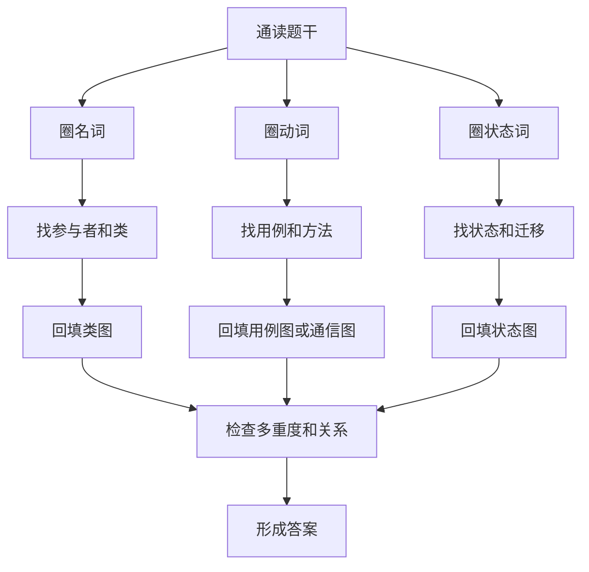
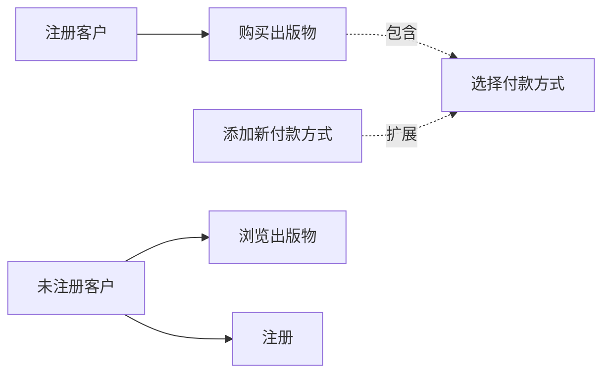

# chapter III - 试题三

> 适用对象：软件设计师下午题新手备考  

---

# 一、当前整理范围

```text
chapter III - 试题三
├─ 1. 用例图
│  ├─ 参与者识别
│  ├─ 用例识别
│  ├─ include 包含关系
│  ├─ extend 扩展关系
│  └─ generalization 泛化关系
├─ 2. 类图
│  ├─ 类名补全
│  ├─ 属性补全
│  ├─ 方法补全
│  ├─ 多重度判断
│  ├─ 继承、实现、关联
│  ├─ 聚合、组合、依赖
│  └─ 关联类与中间类
├─ 3. 状态图
│  ├─ 状态名补全
│  ├─ 迁移事件补全
│  ├─ 条件迁移
│  └─ 业务流程状态还原
├─ 4. 通信图/协作图
│  ├─ 对象识别
│  ├─ 消息顺序
│  ├─ 方法名匹配
│  └─ 事件流映射
├─ 5. 设计模式题
│  ├─ 状态模式
│  ├─ 策略模式
│  ├─ 组合模式
│  ├─ 观察者模式
│  ├─ 备忘录/模板方法等可能扩展
│  └─ 模式改造说明题
└─ 6. 历年原题
   ├─ 2010下半年 网上药店
   ├─ 2012上半年 网上购物平台
   ├─ 2012下半年 小木屋和营地预定
   ├─ 2013上半年 城市黄页
   ├─ 2013下半年 航空会员积分
   ├─ 2014上半年 图书馆借书
   ├─ 2014下半年 选民信息管理
   ├─ 2015上半年 拍卖网站
   ├─ 2015下半年 学术出版物商店
   ├─ 2016上半年 虚拟世界仿真
   ├─ 2016下半年 自动售货机
   ├─ 2017上半年 电动玩具订单
   ├─ 2017下半年 数字图书馆
   ├─ 2018上半年 ETC系统
   ├─ 2018下半年 社交网络群组
   ├─ 2019上半年 书籍销售系统
   ├─ 2019下半年 牙科诊所
   ├─ 2020下半年 房产信息管理
   ├─ 2021上半年 线上抓药APP
   └─ 2021下半年 吃金币游戏
```

---

# 二、复习建议

| 轮次 | 目标 | 建议做法 | 关注重点 |
|---|---|---|---|
| 第 1 轮 | 建立 UML 读图能力 | 先看题干，不急着看图；把名词、动词、状态词分别圈出来 | 名词找类，动词找用例/方法，状态词找状态图 |
| 第 2 轮 | 掌握类图和用例图 | 每题先列“参与者、用例、核心类、关系”四张草表 | 多重度、继承、聚合/组合、include/extend |
| 第 3 轮 | 攻克图题填空 | 用题干语句逐条映射到图中编号，不凭感觉填 | 缺失类名、状态名、方法名、迁移事件 |
| 第 4 轮 | 冲刺拿分 | 只背高频模板和历年题眼；把设计模式说明题整理成固定句式 | 状态、策略、组合、观察者最常考 |

> 试题三不是单纯背 UML 符号，而是把“题干中的业务描述”翻译成“图中的元素”。做题时应先读业务，再看图，最后写答案。

---

# 三、章节笔记

## 总记忆表

| 模块 | 记忆句 |
|---|---|
| 用例图 | **外部人/外部系统是参与者，系统提供的服务是用例。** |
| 类图 | **名词多半是类，属性是类的静态信息，动词多半是方法或关联。** |
| 多重度 | **一个、多个、至少一个、可选，是多重度题的四个题眼。** |
| 状态图 | **状态是“结果”，迁移是“触发事件”。** |
| 通信图 | **事件流第几步，通常对应第几条消息。** |
| include | **必做的公共步骤，用 include。** |
| extend | **可选、条件发生、异常分支，用 extend。** |
| 泛化 | **同类对象抽共同父类，用泛化。** |
| 组合模式 | **整体和部分结构类似，且可递归包含。** |
| 状态模式 | **对象行为随状态变化，状态独立成类。** |
| 策略模式 | **算法可替换，规则可变化，策略独立成类。** |
| 观察者模式 | **一变多知，发布更新后自动通知依赖对象。** |

---

## 1. 试题三整体解题方法

### 1. 知识点

试题三通常给出一段较长的业务说明，再给出一张或多张 UML 图，要求补全图中的类名、参与者、用例、状态、迁移、多重度或设计模式。新手容易一上来就盯着图看，结果被编号和箭头绕晕。正确顺序应当是：

1. 先读说明，圈出**业务对象**；
2. 再圈出**动作或服务**；
3. 再圈出**状态变化**；
4. 最后回到 UML 图中对号入座。

也就是说，题干才是答案来源，UML 图只是把题干结构化展示出来。

| 题干词语 | 常见对应 | 举例 |
|---|---|---|
| 顾客、医生、管理员、快递人员 | 参与者或类 | 用例图中常是参与者，类图中也可能是类 |
| 订单、处方、合同、发票、预约 | 实体类 | 通常有属性和状态 |
| 注册、登录、提交订单、确认处方 | 用例或方法 | 用例图中作为系统功能 |
| 已提交、审核中、已付款、已完成 | 状态 | 状态图中的状态名 |
| 计算费用、验证信息、发送通知 | 方法或控制类职责 | 类图/通信图中常对应消息 |
| 支付方式、赔偿规则、会员等级 | 策略/状态/泛化结构 | 设计模式题常围绕这些变化点 |

### 2. 解题流程图



### 3. 例题分析

#### 例 1：看到“顾客登录后可以在线购买书籍”

**思路**  
先抓题眼：“顾客”是系统外部使用者，“在线购买书籍”是系统提供的功能。因此在用例图中，顾客应作为参与者，购买书籍应作为用例。如果类图中还出现 Customer、Book、Order，则顾客也可能同时是业务类。

**结论**  
用例图中优先填：参与者 Customer / 顾客，用例 Buy books / 购买书籍。

**答案方向**  
看到“某某使用系统做某事”，先判断“某某”为参与者，“做某事”为用例。

#### 例 2：看到“订单支付成功后进入备货状态，超时未支付自动取消”

**思路**  
“支付成功”“超时未支付”是迁移事件，“备货”“取消”是状态结果。状态图填空时不要把事件和状态写反。

**结论**  
状态填“备货”“取消”；迁移填“支付成功”“超时未支付”。

**答案方向**  
看到“……后，订单变为……”，前半句通常是迁移事件，后半句通常是目标状态。

### 4. 记忆技巧

```text
读题三圈：圈人、圈物、圈动作。
图题三问：谁使用？谁保存？谁变化？
状态两分：名词是状态，动词是迁移。
类图两看：名词找类，数量词找多重度。
```

---

## 2. 用例图：参与者、用例和三种关系

### 1. 知识点

用例图描述的是“外部参与者如何使用系统”。它关注系统边界之外的对象与系统功能之间的关系，不描述系统内部类的详细结构。

| 元素 | 含义 | 题眼 | 易错点 |
|---|---|---|---|
| 参与者 Actor | 系统外部与系统交互的人、组织或外部系统 | 顾客、管理员、支付系统、医生、快递人员 | 不一定是人，外部系统也可以是参与者 |
| 用例 Use Case | 系统对外提供的一项完整服务 | 注册、登录、购买、查询、支付、打印 | 不要把数据库表或内部类当用例 |
| include | 一个用例必然调用另一个公共用例 | 每次都要做、共同步骤 | 箭头从基本用例指向被包含用例 |
| extend | 满足条件时才扩展执行 | 如果、可选、异常、没有则添加 | 箭头从扩展用例指向被扩展用例 |
| 泛化 generalization | 参与者或用例之间的父子关系 | A 是 B 的一种 | 子类指向父类 |

### 2. include / extend / generalization 对照

| 关系 | 中文理解 | 做题判断 | 例子 |
|---|---|---|---|
| include | 必须包含 | 没有它，基本用例不能完整完成 | 结账必须选择付款方式 |
| extend | 条件扩展 | 满足条件才发生，不发生也不影响主流程 | 没有地址时才添加新地址 |
| generalization | 泛化继承 | 子用例/子参与者继承父元素含义 | 注册客户、未注册客户都是客户 |

### 3. Mermaid 示意



> Mermaid 图只是帮助理解。考试答题时不需要画这种图，但要能读出箭头含义。

### 4. 例题分析

#### 例 1：2015 下半年网上商店 ACShop

**题眼**  
注册客户结账时要选择地址和付款方式；如果没有地址信息，则添加新地址；如果没有付款方式信息，则添加新付款方式。

**解析**  
“选择地址”“选择付款方式”是结账必经步骤，应理解为被结账包含的功能。  
“添加新地址”“添加新付款方式”只有在没有已有信息时才发生，是典型的条件扩展。

**正确答案方向**  
“添加新地址”扩展“选择地址”；“添加新付款方式”扩展“选择付款方式”。

#### 例 2：2021 上半年线上抓药 APP

**题眼**  
患者、药师、快递人员都与系统发生交互；确认处方、处理处方、药品派送、送药上门属于系统功能。

**解析**  
患者使用系统注册、登录、确认处方、支付费用；药师处理处方；快递人员根据验证码确认送达。它们都在系统边界外，因此是参与者。抓药业务本身可拆为确认处方、处理处方、药品派送、送药上门等用例。

**正确答案方向**  
参与者优先填：患者、药师、快递人员。用例优先从功能描述标题中选取。

### 5. 记忆技巧

```text
用例图先问外部谁。
外部人、外部系统都是参与者。
系统给外部办的事才是用例。
必做公共步骤 include，条件可选步骤 extend。
```

---

## 3. 类图：类、属性、方法和关系

### 1. 知识点

类图是试题三中最核心的题型。类图题通常要求填 C1、C2、C3 对应的类名，或者填多重度、属性、方法。做这类题，题干中的名词要重点关注。

| 类图元素 | 含义 | 题眼 | 答题方法 |
|---|---|---|---|
| 类 | 具有共同属性和行为的一组对象 | 订单、商品、顾客、处方、会员 | 从题干名词和英文词汇中找 |
| 属性 | 类的静态数据 | 名称、编号、价格、地址、状态 | “包括……”后面的名词多为属性 |
| 方法 | 类的行为 | 计算、验证、添加、删除、打印 | 动词短语常为方法 |
| 关联 | 类之间有业务联系 | 一个订单包含多个商品 | 看题干数量词 |
| 聚合 | 整体—部分，部分可独立存在 | 群组包含成员 | 空心菱形 |
| 组合 | 强整体—部分，部分依赖整体 | 订单与订单项 | 实心菱形 |
| 泛化 | 继承关系 | 学生、教师都是用户 | 空心三角箭头指向父类 |
| 实现 | 类实现接口 | 支付策略实现支付接口 | 虚线空心三角 |
| 依赖 | 临时使用 | 控制类调用服务类 | 虚线箭头 |

### 2. 多重度模板

| 题干说法 | UML 多重度 |
|---|---|
| 一个 A 对应一个 B | `1` |
| 一个 A 对应零个或多个 B | `0..*` 或 `*` |
| 一个 A 至少对应一个 B | `1..*` |
| 一个 A 至多对应一个 B | `0..1` |
| 一个 A 对应 n 个 B | `n` |
| 一个 A 对应 m 到 n 个 B | `m..n` |

### 3. 文字讲解

类图填空题最容易出错的是把“角色”与“类”混在一起。例如某题中“顾客”既可能是用例图参与者，也可能是类图中的 Customer 类。判断方法是：若图是用例图，顾客通常作为参与者；若图是类图，且系统要保存顾客姓名、地址、电子邮箱，则顾客就是一个类。

另一个常见错误是多重度方向看反。题干说“一个订单包含多种商品”，并不意味着订单端写 `*`。多重度写在关联线两端，表示“对端一个对象能够关联本端多少个对象”。答题时建议用一句话翻译：

```text
站在 A 看 B：一个 A 对应几个 B？
站在 B 看 A：一个 B 对应几个 A？
```

### 4. 例题分析

#### 例 1：2012 上半年网上购物平台

**题眼**  
顾客在线创建订单；订单列出商品及其数量；商品有名称、造价、售价、包装体积；订单有付款方式、订单量、限时发送要求。

**解析**  
核心类应包括 Customer、Order、Product。由于“订单中列出所订购的商品及其数量”，订单与商品之间通常需要一个中间类或订单项来记录 quantities。若图中 C2/C3 要补属性，应优先从题干括号中的英文属性选择，如 `name`、`cost price`、`sale price`、`cubic volume`、`quantities`、`delivery date`、`Delivery Time Window`。

**正确答案方向**  
类名从 Customer、Order、Product、Delivery Slip、Delivery Plan 等业务名词中选；属性严格使用题干给出的英文词汇。

#### 例 2：2017 下半年数字图书馆

**题眼**  
Publication 有多种子类：ConfPaper、JournalArticle、TechReport；User 有 Student、Faculty、Staff；出版物之间可以相互引用；用户可以注册引用通知。

**解析**  
这是典型的继承结构题。Publication 是父类，会议文章、期刊文章、技术报告是子类；User 是父类，学生、教师、工作人员是子类。引用通知功能常可用观察者模式理解：当某出版物被新出版物引用时，订阅通知的用户收到邮件。

**正确答案方向**  
C1〜C9 优先在 User、Student、Faculty、Staff、Publication、ConfPaper、JournalArticle、TechReport、Author、Proceedings、Edition 等题干类名中匹配。

### 5. 记忆技巧

```text
名词入类，形容入属性，动词入方法。
一个、多个、至少、至多，决定多重度。
父类抽共同点，子类写差异点。
中间有数量、时间、角色，常需要关联类。
```

---

## 4. 状态图：状态名与迁移名

### 1. 知识点

状态图描述一个对象在生命周期中的状态变化。试题三中常给订单、处方、会员、自动售货机、业务流程等画状态图。

| 元素 | 含义 | 题眼 |
|---|---|---|
| 状态 | 对象在某一阶段的稳定情况 | 已提交、审核中、准许付款、已完成 |
| 迁移 | 从一个状态到另一个状态的变化 | 支付成功、审核通过、超时、取消 |
| 初态 | 生命周期开始 | 创建、提交、选择 |
| 终态 | 生命周期结束 | 已取消、已完成、结束 |
| 条件 | 迁移发生条件 | 若……则……，否则…… |

### 2. 状态与事件的区别

| 题干表达 | 应填类型 | 例子 |
|---|---|---|
| “处方状态设置为审核中” | 状态 | 审核中 |
| “医生回复处方无效” | 迁移事件 | 医生回复无效 |
| “系统自动取消处方” | 迁移事件或动作 | 取消处方 |
| “订单支付成功后进入备货状态” | 支付成功是事件，备货是状态 | 事件 → 状态 |

### 3. 例题分析

#### 例 1：2010 下半年网上药店处方状态图

**题眼**  
题干直接给出处方状态：处方已提交、医生信息无效、审核中、无效处方、无法审核、准许付款。

**解析**  
这种题不需要发挥，只需把题干状态词和状态图的流向对应起来。状态迁移包括“核实医生信息无效”“医生信息正确并发送确认请求”“医生回复处方无效”“7天内无答复”“医生确认有效”等。

**正确答案方向**  
S1〜S4 从“处方已提交、审核中、医生信息无效、无效处方、无法审核、准许付款”等状态词中选择；迁移名从“医生信息无效、医生信息正确、处方无效、7天未答复、处方有效”等事件中选择。

#### 例 2：2013 下半年航空会员积分状态图

**题眼**  
非会员、普卡会员、银卡会员、金卡会员；年底根据里程升级或降级。

**解析**  
会员等级天然是状态。办理会员卡后从非会员转为普卡；普卡满 25000 但不足 50000 升银卡，50000 以上升金卡；银卡满 50000 升金卡，不足 25000 降普卡；金卡不足 25000 降普卡，25000 到 50000 降银卡。

**正确答案方向**  
S1〜S3 多半为普卡、银卡、金卡。T1〜T3 填对应的里程条件迁移。

### 4. 状态图复习口诀

```text
状态是阶段，迁移是触发。
“变成什么”填状态，“因为什么”填迁移。
订单、处方、会员、售货机，优先想到状态图。
```

---

## 5. 通信图/协作图：消息与方法

### 1. 知识点

通信图强调对象之间如何发送消息完成一个用例。考试中通常把用例的事件流转成对象间方法调用，让考生补 M1〜M4 方法名。

| 事件流表达 | 通信图对应 |
|---|---|
| 输入读者 ID | 控制对象接收读者标识 |
| 确认读者能否借阅 | 调用读者对象或规则对象的验证方法 |
| 输入图书 ID | 调用图书目录查询方法 |
| 生成借阅记录 | 调用借阅记录创建方法 |
| 通知归还时间 | 返回借阅期限或提示信息 |

### 2. 例题分析：2014 上半年图书馆借书

**题眼**  
用例“借书”的典型事件流非常清楚：输入读者 ID、确认读者能否借阅、输入图书 ID、确认图书可借、计算归还时间、生成借阅记录、通知读者。

**解析**  
通信图中的消息名通常直接来自类图中的方法名，不能随便改写。若类图中给出 `checkOut(bookID)`、`getPatron()`、`getBook()`、`createLoan()` 等方法，答案应使用图中的英文方法名。

**正确答案方向**  
M1〜M4 应按事件流顺序匹配：确认读者、查询图书、计算归还时间、生成借阅记录。

### 3. 记忆技巧

```text
通信图看顺序号。
事件流第几步，消息常是第几条。
题干动词找方法，类图已有方法名优先照抄。
```

---

## 6. 设计模式高频考点

### 1. 状态模式

状态模式适用于对象的行为依赖其状态，并且状态变化会导致行为变化的场景。航空会员等级、订单处理流程、处方审核流程都容易与状态模式联系。

| 角色 | 含义 | 例子 |
|---|---|---|
| Context | 持有当前状态的对象 | CFrequentFlyer、Order、Prescription |
| State | 抽象状态 | MemberLevel、OrderState |
| ConcreteState | 具体状态类 | Basic、Silver、Gold、Pending、Paid |

**例题方向：2013 下半年航空会员积分**  
CFrequentFlyer 持有当前会员状态；CBasic、CSilver、CGold、CNonMember 是不同状态类。travel 方法应根据当前状态处理里程累积与等级调整相关行为。

### 2. 策略模式

策略模式适用于算法可替换的情况。赔偿金计算规则、付款方式、折扣计算、费用计算都可能用策略模式。

| 题眼 | 模式判断 |
|---|---|
| 不同规则可替换 | 策略模式 |
| 同一操作有多种算法 | 策略模式 |
| 根据条件选择不同计算方式 | 策略模式 |

**例题方向：2012 下半年预定取消赔偿金**  
若要根据预定时段和需求量设置不同赔偿规则，可以抽象出赔偿金计算策略接口，不同策略类实现不同赔偿算法，预定对象组合一个策略对象。

### 3. 组合模式

组合模式适用于整体和部分具有一致接口，且整体可以递归包含部分的情况。

**例题方向：2015 上半年拍卖参与者**  
个人参与者和团体参与者都可参与拍卖；团体还能由其他团体组成。个人与团体都应抽象为参与者，团体内部可包含多个参与者，因此适合组合模式。

### 4. 观察者模式

观察者模式适用于“一对多依赖”，一个对象状态变化后，依赖它的对象自动收到通知。

**例题方向：2018 下半年社交网络群组**  
群组主页发布或更新信息后，群组成员自动收到信息。群组相当于 Subject，用户成员相当于 Observer。

### 5. 模式对照表

| 模式 | 关键词 | 常见题型 | 答题句式 |
|---|---|---|---|
| 状态模式 | 状态改变，行为改变 | 会员等级、订单状态 | 将状态封装为独立状态类，由上下文持有当前状态 |
| 策略模式 | 多种算法，运行时替换 | 费用、折扣、赔偿金 | 定义策略接口，不同规则实现不同策略 |
| 组合模式 | 树形结构，整体部分一致 | 团体包含个人/团体 | 抽象公共构件，叶子和组合对象统一处理 |
| 观察者模式 | 发布更新，自动通知 | 群组消息、引用通知 | 目标维护观察者列表，变化时通知观察者 |
| 模板方法 | 固定流程，部分步骤变化 | 处理流程固定 | 父类定义流程，子类实现可变步骤 |

---

# 四、按专题插入原题与解析

> 说明：本节按照历年试题组织。由于原始题目大量依赖 UML 图片，下面重点整理“题眼—知识点—答案方向”。实际作答时，编号 C1、U1、A1、S1 等必须结合原图位置填写，不能脱离图形关系孤立背诵。

---

## 专题一：用例图题

### 题 1：2012 上半年 网上购物平台

**原题**  
某网上购物平台涉及创建订单、提交订单、处理订单、派单、送货/收货、收货确认等功能。题目要求补全用例图中的参与者 A1〜A3 和用例 U1〜U2，并补全类图中的类名、多重度和属性。

**解析**  
先抓题眼：顾客创建并提交订单，订单处理人员处理订单并进行收货确认，派送人员完成送货。  
因此参与者应从 Customer、订单处理人员、派送人员中定位。用例则从“创建订单、提交订单、处理订单、派单、送货/收货、收货确认”中选。  
类图部分要抓住三类核心对象：Customer、Order、Product。题干明确要求类名使用英文词汇，因此答案不应翻译成中文。属性则从题干括号中的英文词中找，如 `name`、`address`、`form of payment`、`volume`、`cost price`、`sale price`、`cubic volume` 等。

**正确答案**  
- 参与者方向：Customer、订单处理人员、派送人员。  
- 用例方向：创建订单、提交订单、处理订单、派单、送货/收货、收货确认。  
- 类名方向：Customer、Order、Product。  
- 属性方向：Product 应含 `name`、`cost price`、`sale price`、`cubic volume`；Order/订单项应含 `quantities`、付款方式、订单量、限时发送要求等。

**答案方向**  
看到英文类名要求时，优先照抄题干英文；看到“数量”要考虑订单项或关联属性。

---

### 题 2：2015 下半年 学术出版物网上商店 ACShop

**原题**  
ACShop 销售论文、学术报告、讲座资料等出版物。未注册客户可浏览、检索、添加购物车；注册后成为注册客户。注册客户登录后可添加购物车并结账，结账包括选择地址、选择付款方式、提交购物车生成订单。管理员维护出版物目录。

**解析**  
先抓题眼：未注册客户、注册客户、管理员是三类参与者；浏览/检索/添加购物车/注册/登录/结账/维护目录是用例。  
“添加新地址”只有在没有地址信息时才发生，因此它是对“选择地址”的扩展。  
“添加新付款方式”只有在没有付款方式信息时才发生，因此它是对“选择付款方式”的扩展。  
学术出版物包括论文、学术报告、讲座资料，属于泛化结构。客户也分为未注册客户和注册客户，也属于泛化结构。

**正确答案**  
- 用例方向：浏览出版物、检索出版物、添加到购物车、注册、登录、结账、维护出版物目录。  
- 扩展关系：添加新地址 `extend` 选择地址；添加新付款方式 `extend` 选择付款方式。  
- 类名方向：ACShop、Publication、Paper、Report、LectureMaterial、Customer、RegisteredCustomer、UnregisteredCustomer、ShoppingCart、Order、Address、PaymentMethod、CreditCard、BankAccount 等，具体编号按图定位。

**答案方向**  
看到“如果没有……则添加……”就是 extend，不是 include。

---

### 题 3：2016 上半年 虚拟世界仿真系统

**原题**  
虚拟世界由用户通过编辑器编写文件并导入系统建立；机器人有自动控制、单步控制和手动控制。手动控制包括 Move、Left、Read、Write。若 Write 前没有 Read，需要 Show Errors。

**解析**  
先抓题眼：用户是参与者；Load File、Setup World、Setup Program、Run Program、Run、Step、Manipulate Robots、Select Robot、Move、Left、Read、Write、Show Errors 都是候选用例。  
自动控制 Run 与单步控制 Step 都属于执行机器人程序的控制方式；Step 可看作 Run 的特殊形式。Show Errors 通常是 Write 失败条件下的扩展。

**正确答案**  
- U1〜U6 答案方向：Load File、Setup World、Setup Program、Run Program、Run、Step、Manipulate Robots、Select Robot、Move、Left、Read、Write、Show Errors 中按图中位置填。  
- 关系方向：Step 与 Run 可按特殊化/泛化理解；Show Errors 对 Write 是条件扩展；Load File 常被 Setup World/Setup Program 包含或关联。

**答案方向**  
手动控制的四个动作要直接使用题干术语：Move、Left、Read、Write。

---

### 题 4：2018 上半年 ETC 系统

**原题**  
ETC 系统涉及驾驶员、邮局付款机、交通广播电台、中心系统、区域系统、龙门架、车道、传感器、相机、交易等。题目要求补用例图参与者、用例和类图类名。

**解析**  
先抓题眼：驾驶员充值、车辆通过车道、区域系统计算通行费、中心系统更新账户、交通广播电台分析交通事件。参与者应从 Driver、Post payment machine、Traffic advice center、Central system 等外部交互对象中选。  
类图中核心类包括 Toll gantry、Traffic lane、Radar sensor、Radio transceiver、Digital Camera、Regional center、Central system、Transaction、Traffic events、Driver、Account 等。

**正确答案**  
- 参与者方向：Driver、Post payment machine、Traffic advice center、Central system。  
- 用例方向：自动收费、充值、失败交易记录、交通事件获取/发布等。  
- 类名方向：Toll gantry、Traffic lane、Radar sensor、Radio transceiver、Digital Camera、Regional center、Central system。

**答案方向**  
设备名若在题干中给出英文，应优先照抄英文。

---

### 题 5：2019 上半年 书籍销售系统

**原题**  
顾客注册、购买书籍、打印订单；派送人员获取派送列表；采购人员采购、添加书籍、促销书籍；仓库管理员更新库存。

**解析**  
先抓题眼：Customer、Dispatcher、Buyer、Warehouseman 是明显参与者。Register detail、Buy books、Print order、Produce picklist、Reorder books、Add books、Promote books、Update stock 是用例。  
U3 若要求写用例描述，通常是“购买书籍 Buy books”。基本事件流包括浏览书籍、选择书籍和数量、检查库存、验证注册码、生成订单、可选打印订单。备选事件流包括库存为 0 不显示、购买数量超过库存提示不足、注册码错误提示。

**正确答案**  
- A1〜A3 方向：Customer、Dispatcher、Buyer、Warehouseman 中按图定位。  
- U1〜U3 方向：Register detail、Buy books、Produce picklist、Reorder books、Add books、Promote books、Update stock、Print order 中按图定位。  
- U3 用例描述：应包含基本事件流和库存不足、注册码错误等备选事件流。

**答案方向**  
“用例描述”题不能只写用例名，必须写基本事件流与备选事件流。

---

### 题 6：2019 下半年 牙科诊所系统

**原题**  
系统记录病人信息、就诊信息、治疗信息、打印发票、更新支付状态、维护医护人员信息、查询打印治疗项目。

**解析**  
先抓题眼：Receptionist 维护病人和就诊信息；DentalStaff 记录治疗并查询治疗项目；OfficeStaff 打印发票、更新支付状态、维护医护人员信息。类图中 Patient、MedicalInsurance、OfficeVisit、Procedure、DentalStaff、Invoice、InsuranceInvoice、PatientInvoice 是核心类。

**正确答案**  
- 参与者方向：Receptionist、DentalStaff、OfficeStaff。  
- 用例方向：Maintain patient info、Record office visit info、Record dental procedure、Print invoices、Enter payment、Maintain dental staff info、Search and print procedure info。  
- 类名方向：Patient、MedicalInsurance、OfficeVisit、Procedure、Invoice、InsuranceInvoice、PatientInvoice、DentalStaff。

**答案方向**  
发票分两种，优先想到 Invoice 父类 + 两个子类。

---

### 题 7：2021 上半年 线上抓药 APP

**原题**  
患者注册、登录、确认处方并支付；药师处理处方；快递人员送药上门并用验证码确认。

**解析**  
先抓题眼：患者、药师、快递人员是参与者。确认处方、处理处方、药品派送、送药上门是核心用例。处方、患者、药师、快递人员、配送信息、支付信息、收货信息等是类图候选类。

**正确答案**  
- A1〜A3 方向：患者、药师、快递人员。  
- U1〜U4 方向：注册、登录、确认处方、处理处方、药品派送、送药上门。  
- C1〜C5 方向：患者、处方、药师、配送信息/快递人员、支付/取药信息等，具体编号按图定位。  
- include：必做子功能；extend：条件扩展；generalize：一般与特殊继承关系。

**答案方向**  
“送药上门”比“药品派送”更靠近快递人员，二者不要混淆。

---

### 题 8：2021 下半年 吃金币游戏

**原题**  
游戏中有 Maze、Robos、PacMan、Ghost、FrontSensor、ProxiSensor、Timer、Editor。用户通过编辑器编写迷宫文件并导入系统建立迷宫。

**解析**  
先抓题眼：建立迷宫是用户参与的用例，导入迷宫文件是其子功能。机器人有传感器和计时器，PacMan 和 Ghost 都是 Robos 的子类。FrontSensor 和 ProxiSensor 是两类传感器。

**正确答案**  
- U1〜U3 方向：建立迷宫、编写迷宫文件、导入迷宫文件。  
- 关系方向：导入迷宫文件通常被建立迷宫包含；编写迷宫文件与 Editor 相关。  
- C1〜C8 方向：Maze、Robos、PacMan、Ghost、FrontSensor、ProxiSensor、Timer、Editor。

**答案方向**  
看到“有两种类型的机器人”，立即想到 Robos 父类与 PacMan、Ghost 子类。

---

## 专题二：类图与多重度题

### 题 9：2013 上半年 城市黄页

**原题**  
系统发布客户基本信息；网络用户可以搜索信息；客户通过认证后成为授权用户；授权用户可更新自己的信息；系统管理员可删除客户。

**解析**  
先抓题眼：网络用户、客户、授权用户、系统管理员。搜索信息面向所有 Internet 用户；认证是客户成为授权用户的前置操作；更新信息只能由授权用户进行；删除客户由系统管理员进行。  
类图中候选类通常来自表 3-1，需根据图中的继承、关联和多重度匹配。

**正确答案**  
- 参与者方向：网络用户、客户/授权用户、系统管理员。  
- 用例方向：搜索信息、认证、更新信息、删除客户。  
- 用例关系方向：认证与更新信息之间通常存在登录/认证前置关系；客户和授权用户可能存在泛化或状态变化关系。  
- 类图方向：从客户、授权用户、系统管理员、城市黄页信息等类名中匹配。

**答案方向**  
“授权用户”不是普通客户的另一个无关对象，而是认证后的客户身份。

---

### 题 10：2014 下半年 选民信息管理

**原题**  
每个人可以是合法选民或无效选民；合法选民必须注册一个选区；地址可以是镇或城市；某些选区包含多个镇，某些城市包含多个选区。

**解析**  
先抓题眼：Person 是父类，Eligible 和 Ineligible 是子类。Address 是父类，Town 和 City 是子类。合法选民与 Registration、Riding 相关；每个合法选民仅能注册一个选区。  
多重度题要注意“每个人只有一个地址”，所以 Person 到 Address 是一对一方向；“某些选区可能包含多个镇”表示 Riding 与 Town 存在一对多或多对多的可能，结合图判断。

**正确答案**  
- C1〜C4 方向：Person、Eligible、Ineligible、Address、Town、City、Riding、Registration 中按图定位。  
- 多重度方向：每个人一个地址；每个合法选民一个注册选区；选区和镇/城市按题干“多个”关系判断。  
- 新需求方向：若某些人可注册多个选区，应把 Eligible 与 Registration/Riding 的多重度改为允许多个；并增加主要居住地属性或关联，用于确定主要投票选区。

**答案方向**  
“某些人拥有多个选区投票权”本质是把原来的 `1` 改为 `1..*` 或 `0..*`。

---

### 题 11：2017 下半年 数字图书馆

**原题**  
用户包括 Student、Faculty、Staff；出版物包括 ConfPaper、JournalArticle、TechReport；可以查询作者出版物、会议集或期刊期次文章、下载出版物、注册引用通知。

**解析**  
先抓题眼：这是两个明显继承结构：User 泛化为 Student、Faculty、Staff；Publication 泛化为 ConfPaper、JournalArticle、TechReport。  
会议文章关联 Proceedings；期刊文章关联 Edition；出版物之间存在引用关系，是 Publication 到 Publication 的自关联。注册引用通知涉及用户与出版物之间的订阅关系。

**正确答案**  
- C1〜C9 方向：User、Student、Faculty、Staff、Publication、ConfPaper、JournalArticle、TechReport、Author、Proceedings、Edition。  
- C6〜C9 属性方向：ConfPaper 有会议名称、召开时间、地点；JournalArticle 有期刊名称、出版月份、期号、主办单位；TechReport 有学校分配的唯一 ID；Publication 有题目、作者、出版年份、下载次数。  
- 设计模式方向：引用通知功能可对应观察者模式。

**答案方向**  
出版物自引用是难点：一篇出版物可以引用多篇出版物，也可以被多篇出版物引用。

---

### 题 12：2018 上半年 ETC 系统

**原题**  
龙门架包含 6 条车道；车道安装雷达传感器、无线传输器和数码相机；区域系统计算通行费并创建交易；中心系统维护驾驶员账户。

**解析**  
先抓题眼：Toll gantry 与 Traffic lane 是整体—部分关系，且一个龙门架下有 6 条车道；每条车道安装三类设备。车辆通过车道产生 Transaction；账户透支会记录透支交易；失败交易由相机拍照触发。

**正确答案**  
- 类名方向：Toll gantry、Traffic lane、Radar sensor、Radio transceiver、Digital Camera、Regional center、Central system、Transaction、Traffic events、Driver、Account。  
- 多重度方向：一个 Toll gantry 对应 6 条 Traffic lanes；一个 Traffic lane 对应一个或多个设备；一个 Driver 对应一个 Account 或磁卡账户，按图判断。  
- 用例方向：收费、充值、记录失败交易、获取交通事件、播报路况。

**答案方向**  
“6条车道”是固定多重度题眼，不能写成泛泛的 `*`。

---

### 题 13：2019 下半年 牙科诊所

**原题**  
病人与医保信息关联；病人多次就诊；每次就诊可有多项治疗；每项治疗可能由多位医护人员服务；发票分医保机构发票和病人发票。

**解析**  
类图核心为 Patient、MedicalInsurance、OfficeVisit、Procedure、DentalStaff、Invoice、InsuranceInvoice、PatientInvoice。  
多重度上，一个 Patient 可以有多次 OfficeVisit；一个 OfficeVisit 可以包含多个 Procedure；DentalStaff 与 Procedure 是多对多。

**正确答案**  
- C1〜C5 方向：MedicalInsurance、OfficeVisit、Procedure、Invoice、InsuranceInvoice、PatientInvoice 等。  
- 必要属性方向：Patient 应有姓名、身份证号、出生日期、性别、首次就诊时间、最后一次就诊时间；OfficeVisit 应有就诊时间、费用、支付代码、病人支付费用、医保支付费用；Procedure 应有治疗项目名称、描述、牙齿、费用；DentalStaff 应有姓名、职位、身份证号、家庭住址、联系电话。

**答案方向**  
“多位医护人员服务一项治疗”说明 Procedure 与 DentalStaff 不是一对一。

---

## 专题三：状态图题

### 题 14：2010 下半年 网上药店

**原题**  
处方提交后要验证医生信息；医生信息无效则取消；医生信息正确则进入审核中；医生回复无效或 7 天无答复则取消；医生确认有效则准许付款。

**解析**  
处方状态直接在题干出现。题目问 S1〜S4 时，要从状态词中选；问迁移 T 或编号时，要填事件名。  
注意“系统取消处方”是动作，不一定是状态；“无效处方”“无法审核”“准许付款”才是状态。

**正确答案**  
- 状态方向：处方已提交、医生信息无效、审核中、无效处方、无法审核、准许付款。  
- 迁移方向：医生信息无效、医生信息正确、医生回复处方无效、7天内未答复、医生确认有效。

**答案方向**  
若图中有一条从“审核中”到“无法审核”的边，迁移应是“7天内未给出确认答复”。

---

### 题 15：2013 下半年 航空会员积分

**原题**  
乘客办理会员卡成为普卡；按年度里程升级或降级为普卡、银卡、金卡；非会员不能累积里程。

**解析**  
会员等级就是状态。等级变化由年度里程条件触发。类图中若问设计模式，应优先考虑状态模式，因为会员对象的行为和等级状态密切相关。

**正确答案**  
- 状态方向：非会员、普卡会员、银卡会员、金卡会员。  
- 迁移方向：办理会员卡；满 25000 不足 50000；50000 以上；不足 25000；达到 25000 但不足 50000。  
- 设计模式：状态模式。  
- CFrequentFlyer 必须具有当前状态属性。  
- travel 方法：根据当前状态累积里程并在年末调整会员等级。

**答案方向**  
有“等级随着条件自动变化”，优先想到状态图和状态模式。

---

### 题 16：2016 下半年 自动售货机

**原题**  
顾客选择饮料和数量，投入硬币；若金额足够且饮料足够，则推出饮料并找零；若金额不足或库存不足，则提示并返回选择/投币；退币按钮退还已投入硬币。状态包括空闲、准备服务、可购买、饮料出售。

**解析**  
这是状态图题。S1〜S4 直接从题干给出的四个状态填。E1〜E4 是事件，来自顾客选择、投币、金额足够、饮料足够、推出饮料、退币等动作。

**正确答案**  
- S1〜S4：空闲、准备服务、可购买、饮料出售，按图中流程定位。  
- E1〜E4 方向：选择饮料及数量、投入硬币、金额足够且饮料足够、推出饮料/返回找零/退币。  
- 类名方向：Vending Machine、Coin Slot/硬币器、Drink、Storage、Customer、Button 等按图定位。

**答案方向**  
“金额不足”和“饮料不足”是备选事件流，常导致回到前面状态。

---

### 题 17：2017 上半年 电动玩具在线销售订单

**原题**  
会员创建订单；可取消订单；支付失败标记为挂起；挂起超过 30 分钟未支付自动取消；支付成功后常规订单进入备货，定制订单进入定制；打包后发货；会员收货后结束。

**解析**  
订单状态按流程顺序梳理即可：新建、取消、挂起、备货、定制、发货、收货/完成。若 S1〜S5 是状态填空，优先填这些状态词。

**正确答案**  
- 状态方向：挂起、取消、备货、定制、发货、收货/完成。  
- 迁移方向：取消订单、支付失败、挂起超时、支付成功且常规订单、支付成功且定制订单、打包完成、确认收货。

**答案方向**  
状态图题先写出完整生命周期，再回图上找缺失位置。

---

## 专题四：设计模式题

### 题 18：2012 下半年 小木屋和营地预定

**原题**  
游客取消预定时按不同规则计算赔偿金。后来提出新需求：根据预定时段和场地需求量设计不同层次赔偿金计算规则。

**解析**  
原先只有两条规则：入住前 48 小时内取消赔 10%，入住后取消赔 50%。新需求意味着赔偿规则将频繁变化且有多种算法。此时不宜把计算逻辑写死在预定类中，应抽象出赔偿金计算策略。

**正确答案**  
采用**策略模式**。增加赔偿金计算策略接口或抽象类，不同赔偿规则作为具体策略类；预定类组合一个策略对象，运行时根据预定时段和场地需求量选择策略。

**答案方向**  
看到“不同规则、不同算法、可替换计算方式”，写策略模式。

---

### 题 19：2014 上半年 图书馆借书

**原题**  
读者能否借阅图书取决于借书制度；若借书制度会不断扩充，并需要根据实际运行情况调整具体使用哪些制度，问采用何种设计模式。

**解析**  
借书制度本质是判定规则。规则会不断扩充，并且运行时可调整使用哪些规则。可以将不同借书规则封装成独立策略或责任链节点。若题目强调“制度规则可扩充、可选择”，通常可答策略模式；若强调“依次检查多条规则直到某条拒绝”，也可解释为职责链模式。软件设计师考试常希望考生答一种能隔离变化的模式。

**正确答案**  
优先答案：**策略模式**。将借书制度抽象为策略接口，不同借书制度实现不同策略，系统可根据实际情况选择或替换策略。

**答案方向**  
“规则不断扩充并可调整”说明要把规则从业务类中解耦。

---

### 题 20：2015 上半年 拍卖网站

**原题**  
拍卖参与者分为个人参与者和团体参与者，不同团体也可以组成新的团体参与拍卖活动。

**解析**  
个人与团体都可以作为参与者；团体内部又可以包含个人或团体，形成递归树形结构。客户端希望统一处理个人和团体。

**正确答案**  
采用**组合模式**。定义抽象参与者，个人参与者是叶子对象，团体参与者是组合对象，组合对象可以包含多个参与者。

**答案方向**  
看到“团体里还能有团体”，基本就是组合模式。

---

### 题 21：2018 下半年 社交网络群组

**原题**  
群组成员可以加入或退出群组；群组主页发布或更新信息后，群组成员自动接收信息；退出后不再接收。

**解析**  
这是“一对多通知”的标准场景。群组是被观察目标，成员是观察者。加入群组相当于注册观察者，退出群组相当于删除观察者，主页更新相当于通知观察者。

**正确答案**  
采用**观察者模式**。该模式定义对象间一对多依赖，当一个对象状态改变时，所有依赖对象都会得到通知并自动更新。

**答案方向**  
看到“发布更新后自动通知成员”，答观察者模式。

---

### 题 22：2017 下半年 数字图书馆引用通知

**原题**  
用户可以为某篇出版物注册引用通知，若有新的出版物引用了该出版物，系统将发送电子邮件通知用户。

**解析**  
这是观察者模式的另一种表达。出版物被引用相当于主题状态发生变化，注册了引用通知的用户相当于观察者。

**正确答案**  
设计模式：**观察者模式**。实现功能：引用通知。

**答案方向**  
“注册通知—发生变化—自动邮件通知”就是观察者模式。

---

# 五、本章总结

## 先抓最稳的分

试题三最稳的分来自三个部分：参与者、用例、类名。只要题干读得仔细，这些答案通常都能从说明中直接找到。做题时应优先圈出人、外部系统、业务实体和功能标题。

| 最稳考点 | 做题办法 |
|---|---|
| 参与者 | 找系统外部交互对象 |
| 用例 | 找系统对外提供的完整服务 |
| 类名 | 找题干中的核心业务名词 |
| 属性 | 找“包括……”后面的信息项 |
| 状态 | 找“状态设置为……”后的词 |

## 再抓计算/判断题

试题三中的“计算”不多，但有大量判断：多重度判断、include/extend 判断、设计模式判断。它们的本质都是读题干中的数量词和条件词。

| 判断对象 | 题眼 |
|---|---|
| 多重度 | 一个、多个、至少、至多、唯一 |
| include | 必须、每次、公共步骤 |
| extend | 如果、没有则、可选、异常 |
| 状态模式 | 状态变化导致行为变化 |
| 策略模式 | 多种规则、多种算法可替换 |
| 组合模式 | 整体包含部分，部分也可以是整体 |
| 观察者模式 | 发布更新后自动通知 |

## 最后处理零散题

零散题主要是“新增需求如何修改类图”。这类题不要长篇空泛解释，应按固定句式答：

1. 增加什么类；
2. 增加什么关联；
3. 修改什么多重度；
4. 是否需要新增属性或关联类；
5. 为什么这样修改能满足需求。

例如：

```text
为了支持一个用户拥有多个地址，应增加“地址”类，
用户与地址之间建立一对多关联，
并将原来用户类中的地址属性移到地址类中。
```

---

## 冲刺版口诀总表

```text
试题三，先读题，别先盯图乱猜题。
人和系统是参与，系统功能是用例。
名词大多变成类，动词常常变方法。
包括编号和名称，基本都是属性家。
一个多个看多重，至少至多别写错。
必做公共 include，可选条件 extend。
父子同类是泛化，接口实现虚线画。
状态是结果，迁移是触发。
支付成功是事件，已付款才是状态。
规则多变用策略，等级变化用状态。
整体递归用组合，一变多知观察者。
新增需求别空谈，增类、连线、改多重。
图上编号按位置，题干原词优先填。
```

---

# 附：试题三常用答题模板

## 1. 类图填空模板

```text
先从题干中提取核心名词：
参与者类：……
业务实体类：……
边界/控制类：……
父类/子类：……

再根据图中关系判断：
有泛化箭头：填父类或子类。
有组合/聚合：填整体或部分。
有关联类：通常填带有时间、数量、角色的类。
```

## 2. 多重度答题模板

```text
题干说“一个A可以有多个B”，则A到B方向为多。
题干说“每个B只属于一个A”，则B到A方向为1。
若允许没有，写0..*或0..1；若至少一个，写1..*。
```

## 3. 状态图答题模板

```text
状态名：填对象经过某事件后“变成什么”。
迁移名：填导致状态变化的“事件或条件”。
```

## 4. 设计模式说明模板

```text
本题适合采用[模式名]。
原因是：[题干中的变化点/结构特点]。
可将[变化部分]抽象为[接口/抽象类]，
由[具体类]实现不同情况，
从而降低[原类]与具体规则之间的耦合，便于扩展和替换。
```


# 六、历年题快速定位表

| 年份 | 业务场景 | 主要图型 | 高频考点 | 复习提示 |
|---|---|---|---|---|
| 2010下半年 | 网上药店 | 类图、状态图 | 处方状态、类名、多重度 | 处方审核状态直接来自题干 |
| 2012上半年 | 网上购物平台 | 用例图、类图 | 参与者、订单类、商品属性 | 英文属性名要照抄题干 |
| 2012下半年 | 小木屋和营地预定 | 用例图、类图 | 用例、类名、策略模式 | 赔偿金规则变化用策略 |
| 2013上半年 | 城市黄页 | 用例图、类图 | 授权用户、认证、候选类 | 客户认证后成为授权用户 |
| 2013下半年 | 航空会员积分 | 状态图、类图 | 状态模式、会员等级 | 普卡/银卡/金卡是状态 |
| 2014上半年 | 图书馆借书 | 类图、通信图 | 方法名、事件流、设计模式 | 方法名优先用图中英文 |
| 2014下半年 | 选民系统 | 类图 | 泛化、多重度、新需求修改 | Person/Address 都有子类 |
| 2015上半年 | 拍卖网站 | 类图 | 组合模式、参与者结构 | 团体包含团体是组合模式 |
| 2015下半年 | ACShop | 用例图、类图 | extend、泛化、结账流程 | 没有地址才添加地址是扩展 |
| 2016上半年 | 虚拟世界仿真 | 用例图、类图 | include/extend、控制动作 | Move/Left/Read/Write 要记准 |
| 2016下半年 | 自动售货机 | 状态图、类图 | 状态与事件 | 空闲、准备服务、可购买、出售 |
| 2017上半年 | 电动玩具订单 | 类图、状态图 | 候选设计类、订单状态 | 支付失败挂起，超时取消 |
| 2017下半年 | 数字图书馆 | 类图、设计模式 | 继承、观察者模式 | 引用通知是观察者模式 |
| 2018上半年 | ETC | 用例图、类图 | 设备类、多重度 | 龙门架固定 6 条车道 |
| 2018下半年 | 社交网络群组 | 类图、设计模式 | 观察者、组合扩展 | 群组更新通知成员 |
| 2019上半年 | 书籍销售 | 用例图、类图 | 用例描述、库存判断 | U3 常要求写基本/备选流 |
| 2019下半年 | 牙科诊所 | 用例图、类图 | 发票继承、治疗多对多 | Procedure 与 DentalStaff 多对多 |
| 2020下半年 | 房产信息管理 | 用例图、类图 | 缺失图题、审批扩展 | 已知答案不全时按题干推导 |
| 2021上半年 | 线上抓药 | 用例图、类图 | 参与者、include/extend/generalize | 患者、药师、快递人员最关键 |
| 2021下半年 | 吃金币游戏 | 用例图、类图 | 机器人继承、传感器类 | Robos 父类，PacMan/Ghost 子类 |

---

# 七、最后 30 分钟背诵清单

```text
1. 用例图：外部交互对象是参与者，系统功能是用例。
2. include：必做；extend：可选或异常；generalization：父子继承。
3. 类图：名词找类，括号里的英文词常是属性。
4. 多重度：一个写1，多个写*，可选写0..1，至少一个写1..*。
5. 状态图：状态是“已……”，迁移是“发生……”。
6. 通信图：按事件流顺序找方法。
7. 状态模式：会员等级、订单状态、处方状态。
8. 策略模式：付款、折扣、赔偿、费用计算规则变化。
9. 组合模式：团体中含个人，团体中还含团体。
10. 观察者模式：订阅通知、群组更新、引用提醒。
```
