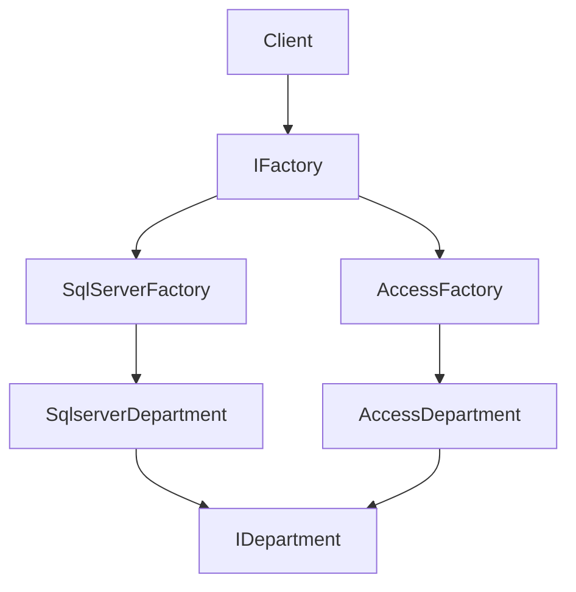
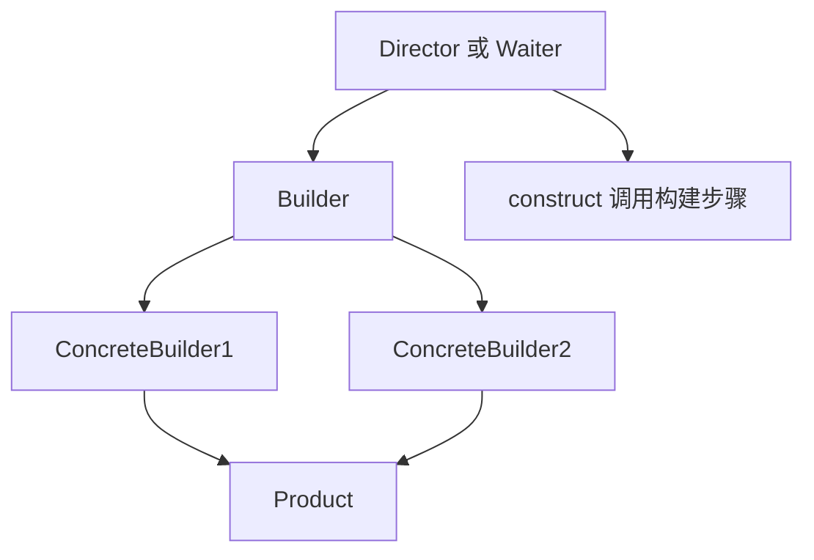
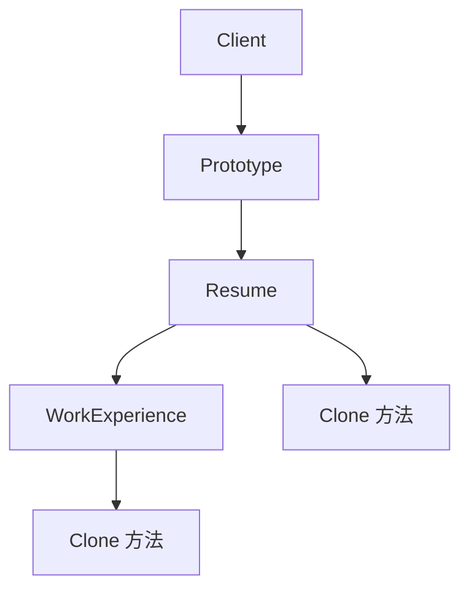
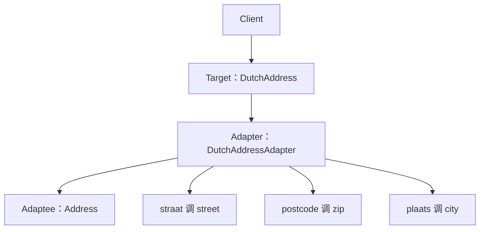
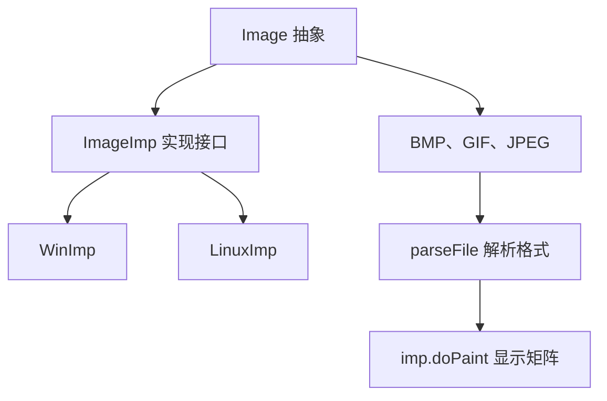
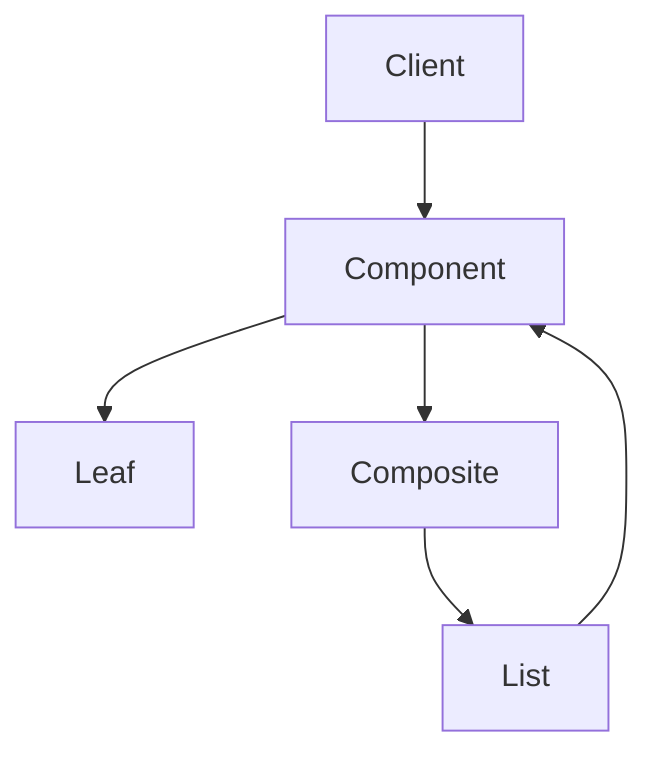
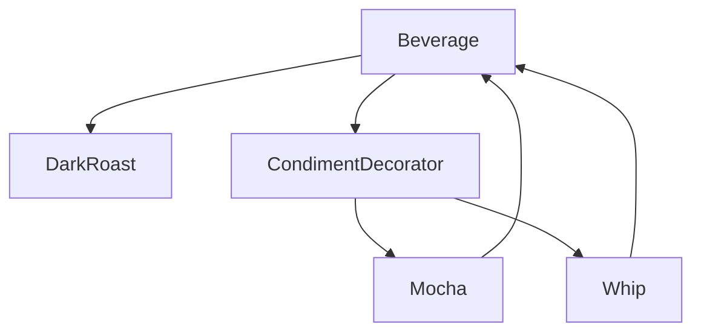
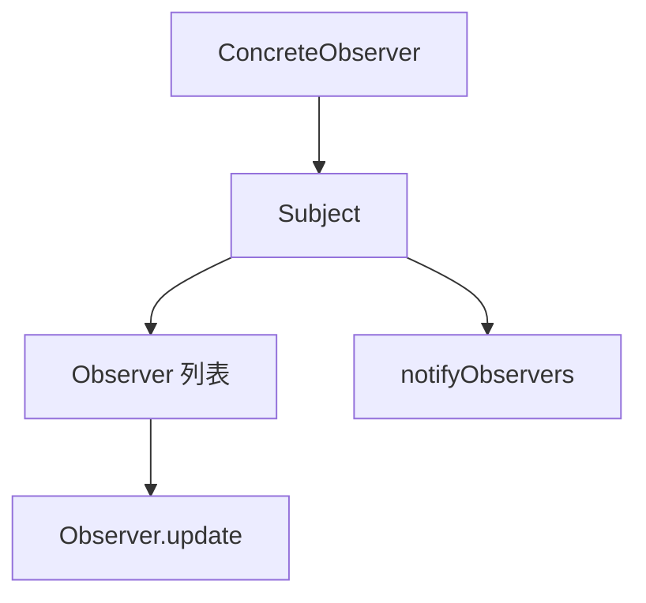
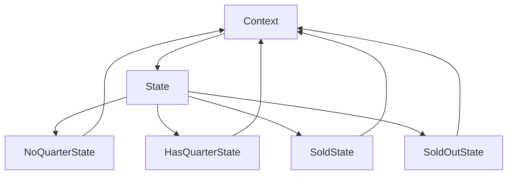
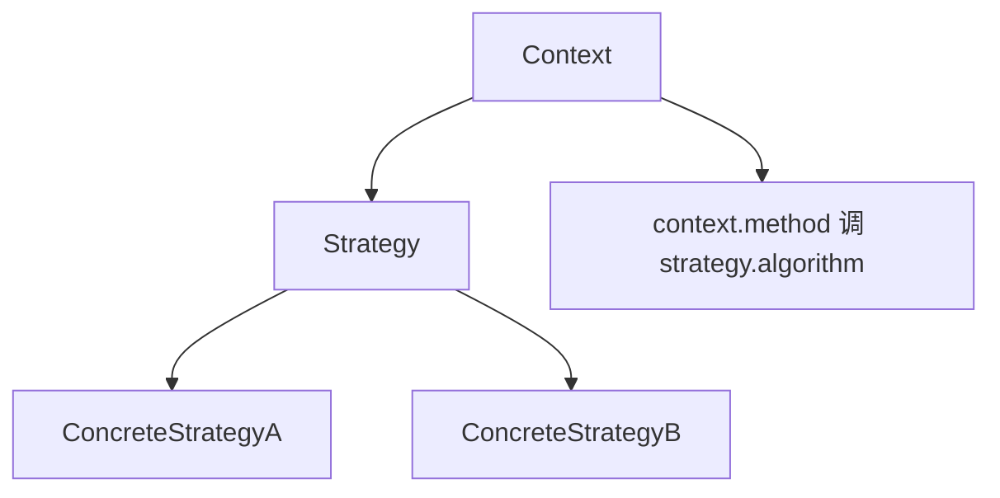

# chapter IV - 试题四

适用对象：软件设计师下午题新手备考  

---

# 一、当前整理范围

```text
chapter IV - 试题四
└─ 设计模式代码填空专题
   ├─ 一、创建型模式
   │  ├─ 抽象工厂模式
   │  │  └─ 2012年下半年：多数据库访问，Department表
   │  ├─ 生成器模式
   │  │  ├─ 2017年上半年：儿童套餐 Pizza
   │  │  └─ 2018年上半年：Product 的 partA、partB 构建
   │  └─ 原型模式
   │     └─ 2013年上半年：简历 Resume 与工作经历 WorkExperience
   │
   ├─ 二、结构型模式
   │  ├─ 适配器模式
   │  │  └─ 2016年上半年：Address 转 DutchAddress 接口
   │  ├─ 桥接模式
   │  │  ├─ 2009年上半年：图像格式 × 操作系统
   │  │  ├─ 2013年下半年：图形 × 绘图程序
   │  │  └─ 2017年下半年：图像预览程序
   │  ├─ 组合模式
   │  │  ├─ 2009年下半年：文件与目录树
   │  │  ├─ 2010年下半年：公司组织结构
   │  │  ├─ 2011年上半年：饭店菜单
   │  │  └─ 2021年上半年：层叠菜单
   │  ├─ 装饰器模式
   │  │  ├─ 2012年上半年：咖啡加配料计价
   │  │  └─ 2016年下半年：发票打印头部和脚注
   │  └─ 享元模式
   │     └─ 2021年下半年：网络围棋棋子对象复用
   │
   ├─ 三、行为型模式
   │  ├─ 命令模式
   │  │  └─ 2014年下半年：灯具遥控器
   │  ├─ 观察者模式
   │  │  ├─ 2014年上半年：实验室环境监测
   │  │  └─ 2019年下半年：文件管理系统文档变化通知
   │  ├─ 状态模式
   │  │  ├─ 2011年下半年：纸巾售卖机
   │  │  └─ 2018年下半年：航空会员等级调整
   │  ├─ 策略模式
   │  │  ├─ 2010年上半年：飞机飞行与起飞策略
   │  │  ├─ 2015年下半年：商场收费策略
   │  │  └─ 2019年上半年：汽车刹车痕迹策略
   │  ├─ 访问者模式
   │  │  └─ 2015年上半年：统计馆藏文献页数
   │  ├─ 中介者模式
   │  │  └─ 2020年下半年：对象之间通过中介协调
   │  └─ 备忘录、外观等
   │     └─ 近年分类表中出现，作为补充识别项
   │
   └─ 四、通用答题能力
      ├─ 看说明识别模式
      ├─ 看类名识别角色
      ├─ 看接口方法补签名
      ├─ 看调用链补对象创建与委托调用
      ├─ 看输出结果倒推代码
      └─ 区分 extends、implements、abstract、interface、return、this 等高频空
```

---

# 二、复习建议

| 轮次 | 目标 | 建议做法 | 关注重点 |
|---|---|---|---|
| 第一轮 | 先认模式 | 不急着背代码，先把每道题的业务场景和模式名称对应起来 | “图像格式 × 操作系统”是桥接；“咖啡加配料”是装饰；“文件夹套文件夹”是组合 |
| 第二轮 | 认角色 | 对每个模式画出角色表：抽象产品、具体产品、工厂、上下文、策略、观察者等 | 代码填空本质上考“角色之间怎么调用” |
| 第三轮 | 补代码 | 对每道题只看空格前后 3 行，判断要填类型、方法签名、对象创建还是方法调用 | `implements`、`extends`、`new`、`this.xxx`、`return` 是高频答案 |
| 第四轮 | 做混合题 | 打乱模式题目顺序，先判断模式，再补答案方向 | 重点区分桥接/适配器/策略/状态/装饰/组合 |

> 本章不建议一开始直接背答案。下午题设计模式代码填空的规律很明显：只要模式角色和 Java 基本语法清楚，大多数空可以从上下文推出来。

---

# 三、章节笔记

## 总记忆表

| 模块 | 记忆句 |
|---|---|
| 抽象工厂 | 一组产品一起创建，工厂接口返回抽象产品 |
| 生成器 | 指挥者控制流程，建造者负责每一步构建 |
| 原型 | `clone` 复制对象，深拷贝要复制引用对象 |
| 适配器 | 老接口不合用，包一层转成目标接口 |
| 桥接 | 两个维度都变化，抽象和实现分离 |
| 组合 | 树形结构，叶子和容器统一抽象 |
| 装饰器 | 外面套一层，功能和费用逐层叠加 |
| 享元 | 内部状态共享，外部状态由环境传入 |
| 命令 | 请求封装成对象，调用者只执行命令 |
| 观察者 | 主题变化，通知所有观察者更新 |
| 状态 | 状态变，行为跟着变，对象像换了类 |
| 策略 | 算法可替换，上下文委托策略对象 |
| 访问者 | 操作封装成访问者，元素接受访问 |
| 中介者 | 多对象乱连线，统一交给中介协调 |
| 代码填空 | 先看角色，再看语法，最后看输出 |

---

## 1. 下午设计模式代码题的通用解法

### 1. 知识点

| 步骤 | 该看什么 | 判断方法 | 常见答案形式 |
|---|---|---|---|
| 第一步 | 题干业务 | 从“同时支持多数据库”“不同格式不同系统”“加配料”等关键词识别模式 | 模式名称 |
| 第二步 | 类名 | 找抽象类、接口、具体类、客户端类 | `interface`、`abstract class`、`extends`、`implements` |
| 第三步 | 空格位置 | 看空格是在类声明、属性、方法体还是客户端 | 类型名、方法签名、对象创建、方法调用 |
| 第四步 | 调用链 | 谁持有谁，谁委托谁 | `this.xxx = xxx`、`obj.method()` |
| 第五步 | 输出结果 | 根据输出倒推构造顺序 | 装饰器、生成器、状态题常用 |

代码填空题的难点不在 Java 语法本身，而在“类之间的角色关系”。例如看到 `class LightOnCommand implements Command`，就能判断空格大概率是 `interface Command` 或 `light.on()`；看到 `abstract class Image` 里有 `protected ImageImp imp`，就要想到桥接模式中抽象部分持有实现部分。

### 2. 公式/模板

设计模式代码题可以用下面这个通用模板做：

```text
先读说明：系统为什么要用这个模式？
再看类图：哪个类是抽象角色？哪个类是具体角色？
再看空格：
  类声明空：多为 abstract/interface/extends/implements
  属性空：多为抽象角色类型
  方法签名空：多为接口方法
  方法体空：多为委托调用或对象创建
  客户端空：多为 new 具体类、set 具体对象、调用统一方法
最后检查：返回值类型、大小写、变量名是否与上下文一致
```

### 3. 例题分析

#### 例 1：类声明处空格

**题眼**：`class SqlserverDepartment   (3)   { ... }`，前面已经有 `interface IDepartment`。  
**思路**：`SqlserverDepartment` 是具体产品类，必须实现抽象产品接口。  
**结论**：填 `implements IDepartment`。

#### 例 2：方法体处空格

**题眼**：`public void brake() {   (3)  ; }`，类中有 `protected BrakeBehavior wheel;`。  
**思路**：策略模式中上下文不自己实现算法，而是调用策略对象。  
**结论**：填 `wheel.stop()`。

### 4. 记忆技巧

```text
类声明看继承，方法声明看接口；
方法体看委托，客户端看new；
输出看顺序，状态看setState。
```

---

## 2. 创建型模式

### 2.1 抽象工厂模式

#### 1. 知识点

| 项目 | 内容 |
|---|---|
| 意图 | 提供一个创建一系列相关或相互依赖对象的接口，而无需指定它们的具体类 |
| 题眼 | 多个产品族、多种数据库、多种平台、同一套业务表要适配不同实现 |
| 典型角色 | 抽象工厂、具体工厂、抽象产品、具体产品、客户端 |
| 高频代码 | `interface IFactory`、`implements IFactory`、`return new ConcreteProduct()` |
| 易错点 | 抽象工厂返回的是抽象产品类型，不是具体产品类型 |

抽象工厂题通常有两层“抽象”。第一层是产品抽象，例如 `IDepartment` 表示部门表访问接口；第二层是工厂抽象，例如 `IFactory` 表示创建数据库访问对象的工厂接口。客户端不直接写 `new SqlserverDepartment()`，而是通过 `SqlServerFactory.CreateDepartment()` 得到 `IDepartment`。这样换 Access 数据库时，只需要换工厂对象。

#### 2. 结构图



#### 3. 例题分析

**例：2012年下半年抽象工厂**  
题目要求系统同时支持 SQL Server 和 Access 两种数据库，并以 Department 表为例。  
先抓题眼：**多数据库 + 相同业务表 + 创建对象族**。  
再看代码角色：

| 代码元素 | 模式角色 | 填空方向 |
|---|---|---|
| `IDepartment` | 抽象产品 | 声明 `Insert`、`GetDepartment` |
| `SqlserverDepartment` | 具体产品 | `implements IDepartment` |
| `AccessDepartment` | 具体产品 | `implements IDepartment` |
| `IFactory` | 抽象工厂 | 声明 `CreateDepartment()` |
| `SqlServerFactory` | 具体工厂 | 返回 `new SqlserverDepartment()` |
| `AccessFactory` | 具体工厂 | 返回 `new AccessDepartment()` |

**参考填空方向**：

```java
void Insert(Department department)
Department GetDepartment(int id)
implements IDepartment
implements IDepartment
interface IFactory
IDepartment CreateDepartment()
```

**答案方向**  
看到“数据库表访问对象 + 多数据库切换”，优先找 `IProduct` 和 `IFactory` 两类接口。

#### 4. 记忆技巧

```text
抽象工厂两层抽象：
产品有接口，工厂也有接口；
具体工厂只负责 new 具体产品。
```

---

### 2.2 生成器模式

#### 1. 知识点

| 项目 | 内容 |
|---|---|
| 意图 | 将复杂对象的构建过程与表示分离，使同样的构建过程可以创建不同表示 |
| 题眼 | 制作过程固定，但产品表现不同；套餐、产品部件、对象分步构建 |
| 典型角色 | Product、Builder、ConcreteBuilder、Director |
| 高频代码 | `builder.buildPartA()`、`builder.buildPartB()`、`builder.getResult()` |
| 易错点 | Director 负责调用步骤，不负责具体部件内容 |

生成器模式最容易和抽象工厂混淆。抽象工厂强调“创建一组相关产品”，生成器强调“按步骤构造一个复杂对象”。例如做 Pizza，流程是固定的：创建新 Pizza、构建部件、返回 Pizza；但夏威夷 Pizza 和辣味 Pizza 的部件不同。

#### 2. 结构图



#### 3. 例题分析

**例：2017年上半年 Pizza 生成器**  
题眼：儿童套餐制作过程相同，但餐品种类不同；Waiter 调度厨师。  
模式：生成器模式。  
关键代码关系：

| 空格位置 | 判断依据 | 参考填法 |
|---|---|---|
| `PizzaBuilder` 中的抽象方法 | 具体建造者都实现 `buildParts()` | `abstract void buildParts()` |
| `Waiter.setPizzaBuilder` | 设置当前建造者 | `this.pizzaBuilder = pizzaBuilder` |
| `Waiter.construct` | 指挥者调用构建步骤 | `pizzaBuilder.buildParts()` |
| 客户端 | 设置具体建造者并构建 | `waiter.setPizzaBuilder(hawaiian_pizzabuilder)`、`waiter.construct()` |

**例：2018年上半年 Product 生成器**  
题眼：Product 由 partA、partB 构成，Builder 定义构建接口，ConcreteBuilder 生成 Product。  
参考填空方向：

```java
void buildPartA()
Product getResult()
product.setPartA
product.setPartB
builder.buildPartA()
```

如果后续代码省略了 `buildPartB()`，也要结合 Director 的 `construct()` 函数判断是否需要连续调用 `buildPartA()` 和 `buildPartB()`。

#### 4. 记忆技巧

```text
生成器四件套：产品、抽象建造者、具体建造者、指挥者。
指挥者不造零件，只安排步骤。
```

---

### 2.3 原型模式

#### 1. 知识点

| 项目 | 内容 |
|---|---|
| 意图 | 用原型实例指定创建对象的种类，并通过复制这些原型创建新对象 |
| 题眼 | 自动生成相似对象，减少重复代码；简历复制、对象克隆 |
| 典型角色 | Prototype、ConcretePrototype、Client |
| 高频代码 | `implements Cloneable`、`clone()` 或 `Clone()`、复制引用属性 |
| 易错点 | 引用对象若只复制地址是浅拷贝，复制对象本身才是深拷贝 |

原型模式题常考“深拷贝”。在简历题中，`Resume` 持有 `WorkExperience`。如果只复制 `Resume` 的基本字段，却让多个简历对象共享同一个 `WorkExperience` 对象，则修改一份简历的工作经历会影响另一份。因此 `Resume` 的私有构造函数中要对 `WorkExperience` 进行克隆。

#### 2. 结构图



#### 3. 例题分析

**例：2013年上半年简历原型**  
题眼：希望每份简历基本信息相似，工作经历不同，减少重复代码。  
模式：原型模式。  
关键填空方向：

| 空格 | 作用 | 参考答案方向 |
|---|---|---|
| WorkExperience 类声明 | 支持克隆 | `implements Cloneable` |
| WorkExperience.Clone | 创建新对象并复制字段 | `WorkExperience obj = new WorkExperience()` |
| Resume 类声明 | 支持克隆 | `implements Cloneable` |
| `private Resume(WorkExperience work)` | 深拷贝工作经历 | `(WorkExperience) work.Clone()` |
| `Resume.Clone()` | 基于当前工作经历创建新简历 | `new Resume(this.work)` |
| 客户端复制 | 复制 a 得到 b | `(Resume) a.Clone()` |

**答案方向**  
看到“引用成员对象 + clone”，必须判断是浅拷贝还是深拷贝；本题为避免工作经历相互影响，应使用深拷贝。

#### 4. 记忆技巧

```text
原型不是 new 空对象，而是复制已有对象；
有引用成员时，优先检查是否要深拷贝。
```

---

## 3. 结构型模式

### 3.1 适配器模式

#### 1. 知识点

| 项目 | 内容 |
|---|---|
| 意图 | 将一个类的接口转换成客户希望的另一个接口 |
| 题眼 | 已有类不能改，但需要兼容新接口、新语言、新协议 |
| 典型角色 | Target、Adapter、Adaptee、Client |
| 高频代码 | Adapter 持有 Adaptee，并在目标方法中调用被适配者方法 |
| 易错点 | 适配器不是继承后重写业务，而是做接口转换和委托调用 |

适配器模式的核心是“换接口，不换功能”。例如原系统中已有 `Address.street()`、`Address.zip()`、`Address.city()`，现在要提供荷兰语接口 `DutchAddress.straat()`、`postcode()`、`plaats()`。适配器类一边继承或实现目标接口，一边持有原始对象。

#### 2. 结构图



#### 3. 例题分析

**例：2016年上半年地址适配器**  
题眼：已实现 Address，要求提供 Dutch 语言接口，以后可能还有新语言接口。  
模式：适配器模式。  
参考填空方向：

```java
private Address address;
address.street();
address.zip();
address.city();
DutchAddress addrAdapter = new DutchAddressAdapter(addr);
```

**答案方向**  
看到“Dutch 方法名里面调用英文 Address 方法”，就是接口转换；空格基本都填“被适配对象类型、被适配对象方法调用、创建适配器对象”。

#### 4. 记忆技巧

```text
适配器像转接头：
外面看是新接口，里面调用旧对象。
```

---

### 3.2 桥接模式

#### 1. 知识点

| 项目 | 内容 |
|---|---|
| 意图 | 将抽象部分与实现部分分离，使它们都可以独立变化 |
| 题眼 | 两个维度都可能扩展，如图像格式 × 操作系统、图形 × 绘图程序 |
| 典型角色 | Abstraction、RefinedAbstraction、Implementor、ConcreteImplementor |
| 高频代码 | 抽象类持有实现接口对象；具体抽象类调用 `imp.doPaint(m)` |
| 易错点 | 桥接不是“接口不兼容”，而是避免多维度继承导致类爆炸 |

桥接模式的题眼非常明显：一个系统有两个变化维度。若用继承实现“3种图片格式 × 2种操作系统”，需要 6 个组合子类；如果未来支持 10 种格式和 5 种操作系统，就会产生大量类。桥接模式把“图片格式解析”和“操作系统显示”拆开，图片类持有操作系统实现对象。

#### 2. 结构图



#### 3. 公式/模板

若有 $m$ 个抽象维度对象、$n$ 个实现维度对象：

- 不用桥接：可能出现 $m \times n$ 个组合类。
- 使用桥接：至少需要 $m + n + 2$ 类左右，其中包括抽象类和实现接口。

例如 10 种图像格式、5 种操作系统：

$$
10 + 5 + 2 = 17
$$

其中 2 通常指 `Image` 抽象类和 `ImageImp` 实现接口/抽象类，不考虑 `Matrix`。

#### 4. 例题分析

**例：2009年上半年图像浏览系统**  
题眼：BMP、JPEG、GIF 三种格式；Windows、Linux 两种操作系统；还要支持新格式和新系统。  
模式：桥接模式。  
参考填空方向：

```java
this.imp
ImageImp
imp.doPaint(m)
new BMP()
new WinImp()
image1.setImp(imageImp1)
17
```

**例：2013年下半年绘图软件**  
题眼：不同图形与不同绘图程序均可能扩展。  
参考填空方向：

```java
interface Drawing
void drawLine(double x1, double y1, double x2, double y2)
void drawCircle(double x, double y, double r)
DP1.draw_a_circle(x, y, r)
DP2.drawcircle(x, y, r)
public abstract void draw()
```

**例：2017年下半年图像预览程序**  
题眼与 2009 年类似。  
参考填空方向：

```java
abstract void doPaint(Matrix m)
imp.doPaint(m)
new GIFImage()
new LinuxImp()
image.setImp(imageImp)
```

#### 5. 记忆技巧

```text
桥接看两轴：
一轴是抽象业务，一轴是实现平台；
抽象类里放实现接口，具体类里委托实现对象。
```

---

### 3.3 组合模式

#### 1. 知识点

| 项目 | 内容 |
|---|---|
| 意图 | 将对象组合成树形结构，使客户可以一致地处理单个对象和组合对象 |
| 题眼 | 文件/目录、组织结构、菜单、层叠菜单、树形结构 |
| 典型角色 | Component、Leaf、Composite、Client |
| 高频代码 | 抽象组件定义 `add/remove/getChildren/print`，Composite 持有 `List<Component>` |
| 易错点 | 叶子节点不能添加子节点，通常返回 `false` 或 `null` |

组合模式常考 Java 泛型、递归遍历。`File` 是叶子节点，`Folder` 是容器节点，但客户端都通过 `AbstractFile` 操作。打印树时，先打印当前节点，再递归打印子节点。

#### 2. 结构图



#### 3. 例题分析

**例：2009年下半年文件/目录树**  
参考填空方向：

```java
abstract
null
List
childList
printTree(file)
```

解题时先看 `AbstractFile`，它定义了 `addChild`、`removeChild`、`getChildren`。`File` 是叶子节点，不能添加子节点，`getChildren()` 返回 `null`；`Folder` 是组合节点，内部持有 `childList`。

**例：2010年下半年公司组织结构**  
参考填空方向：

```java
abstract class
this.name
Company
Company
children
children
root.Add(comp)
comp.Add(comp1)
```

公司组织结构中，总公司、分公司、办事处和部门都可以看作 `Company`，但只有具体公司类能包含子公司或部门。

**例：2011年上半年饭店菜单**  
参考填空方向：

```java
abstract class
public abstract void add(MenuComponent menuComponent)
add(menuComponent)
menuComponent.print()
allMenus.print()
```

**例：2021年上半年层叠菜单**  
材料中已给出参考答案方向：

```java
protected
abstract boolean addMenuElement(MenuComponent element)
abstract List<MenuComponent> getElement()
List<MenuComponent> elementList
mainMenu.addMenuElement(subMenu)
```

#### 4. 记忆技巧

```text
组合就是树：
Component 统一接口，Leaf 没孩子，Composite 有 List。
遍历时先自己，再递归孩子。
```

---

### 3.4 装饰器模式

#### 1. 知识点

| 项目 | 内容 |
|---|---|
| 意图 | 动态地给对象添加额外职责，比继承更灵活 |
| 题眼 | 咖啡加配料、发票加抬头和脚注、对象外层套对象 |
| 典型角色 | Component、ConcreteComponent、Decorator、ConcreteDecorator |
| 高频代码 | 装饰器持有组件对象，调用被装饰对象后再追加行为 |
| 易错点 | 装饰器本身也继承 Component，才能一层层套起来 |

装饰器模式代码题最常见的空是“把当前对象继续包进去”。例如咖啡题：先创建 `DarkRoast`，再 `new Mocha(beverage)`，再 `new Whip(beverage)`。每一层装饰器都保存一个 `Beverage` 引用，调用 `beverage.cost()` 后再加自己的价格。

#### 2. 结构图



#### 3. 例题分析

**例：2012年上半年咖啡计价**  
题眼：根据顾客要求加入各种配料，并按配料计算费用。  
参考填空方向：

```java
abstract
String getDescription
public abstract int cost()
Beverage beverage
beverage
beverage
```

如果执行顺序是：

```java
Beverage beverage = new DarkRoast();
beverage = new Mocha(beverage);
beverage = new Whip(beverage);
```

最终输出为：

```text
DarkRoast, Mocha, Whip ￥38
```

计算逻辑是：深度烘焙咖啡 20 + 摩卡 10 + 奶泡 8 = 38。

**例：2016年下半年发票打印**  
题眼：发票内容固定，但可动态添加抬头和脚注。  
参考填空方向：

```java
ticket.printInvoice()
super.printInvoice()
super.printInvoice()
new FootDecorator(new HeadDecorator(t))
new HeadDecorator(new FootDecorator(null))
```

第二个构造输出只有头和脚，没有正文，因为最内层传入 `null` 后不会调用原始发票内容。

#### 4. 记忆技巧

```text
装饰器像俄罗斯套娃：
每层都继承同一抽象类，
每层都包一个同类对象，
每层都先调旧功能再加新功能。
```

---

### 3.5 享元模式

#### 1. 知识点

| 项目 | 内容 |
|---|---|
| 意图 | 运用共享技术有效支持大量细粒度对象 |
| 题眼 | 对象数量巨大、需要节省内存、棋子、字符、图标、连接对象 |
| 典型角色 | Flyweight、ConcreteFlyweight、FlyweightFactory、Client |
| 高频代码 | 共享对象存放在集合或工厂中；外部状态由调用时传入 |
| 易错点 | 享元真正的重点是“共享内部状态”，不是简单地创建对象 |

上传材料中的围棋程序题虽然用的是享元模式，但代码片段中仍直接 `new BlackPiece`、`new WhitePiece`，填空主要考抽象类、集合泛型和 `draw()` 调用。考试层面先按题干指定模式答，不必过度纠结完整享元工厂是否出现。

#### 2. 例题分析

**例：2021年下半年网络围棋**  
参考填空方向：

```java
public abstract void draw()
Piece
Piece
piece.draw()
piece.draw()
```

解题时先看 `Piece` 抽象类，`BlackPiece` 和 `WhitePiece` 都实现 `draw()`。`PieceBoard` 中 `m_arrayPiece` 保存棋盘已有棋子，因此泛型是 `Piece`。

#### 3. 记忆技巧

```text
享元抓两个词：大量对象、共享。
内部状态放对象里，外部状态由环境给。
```

---

## 4. 行为型模式

### 4.1 命令模式

#### 1. 知识点

| 项目 | 内容 |
|---|---|
| 意图 | 将请求封装为对象，使不同请求可以参数化、排队、记录和撤销 |
| 题眼 | 遥控器、按钮、菜单命令、宏命令、撤销操作 |
| 典型角色 | Command、ConcreteCommand、Receiver、Invoker、Client |
| 高频代码 | `execute()` 调用接收者方法；Invoker 保存命令数组 |
| 易错点 | 遥控器不直接开灯，而是调用命令对象的 `execute()` |

命令模式的核心是“把动作封装成对象”。灯是接收者，开灯命令和关灯命令分别把 `Light.on()` 和 `Light.off()` 封装起来。遥控器只知道某个插槽里有一个命令对象，不关心这个命令到底控制哪盏灯。

#### 2. 例题分析

**例：2014年下半年灯具遥控器**  
参考填空方向：

```java
interface Command
light.on()
light.off()
onCommands[slot]
offCommands[slot]
onCommands[slot].execute()
offCommands[slot].execute()
```

#### 3. 记忆技巧

```text
命令模式五角色：
Command 定接口，ConcreteCommand 包动作，Receiver 真干活，Invoker 只调用，Client 负责组装。
```

---

### 4.2 观察者模式

#### 1. 知识点

| 项目 | 内容 |
|---|---|
| 意图 | 定义对象间一对多依赖，当一个对象状态改变时，所有依赖者自动得到通知并更新 |
| 题眼 | 数据变化自动刷新、订阅通知、主题与观察者、文档变化更新浏览器 |
| 典型角色 | Subject、ConcreteSubject、Observer、ConcreteObserver |
| 高频代码 | `registerObserver`、`removeObserver`、`notifyObservers`、`update` |
| 易错点 | 主题通知观察者，不是观察者主动轮询主题 |

观察者模式题最稳定：主题中有观察者集合，状态变化后循环调用每个观察者的 `update()`。观察者构造时通常把自己注册到主题中。

#### 2. 结构图



#### 3. 例题分析

**例：2014年上半年环境监测**  
参考填空方向：

```java
Subject
observer.update(temperature, humidity, cleanness)
notifyObservers()
measurementsChanged()
Observer
envData.registerObserver(this)
```

**例：2019年下半年 OfficeDoc 与 DocExplorer**  
参考填空方向：

```java
void update()
Observer
obs.update()
Subject
Attach(this)
```

#### 4. 记忆技巧

```text
观察者三步：注册、通知、更新。
Subject 有 List，Observer 有 update。
```

---

### 4.3 状态模式

#### 1. 知识点

| 项目 | 内容 |
|---|---|
| 意图 | 允许对象在内部状态改变时改变它的行为，看起来像修改了对象所属的类 |
| 题眼 | 售货机状态、会员等级、订单状态、状态图 |
| 典型角色 | Context、State、ConcreteState |
| 高频代码 | `context.setState(newState)`、不同状态类实现同一方法 |
| 易错点 | 状态模式把状态判断分散到各状态类中，而不是写一个巨大的 `if-else` |

状态模式和策略模式都把行为委托给另一个对象。区别在于：策略通常由外部选择算法；状态通常由对象内部状态迁移决定行为。例如会员积分等级会根据里程自动升级或降级，售货机根据投币、出货、售完等状态改变行为。

#### 2. 结构图



#### 3. 例题分析

**例：2011年下半年纸巾售卖机**  
参考填空方向：

```java
State
getHasQuarterState()
getNoQuarterState()
getNoQuarterState()
getSoldOutState()
```

解释：没有投币状态接收投币后转为有 2 元状态；有 2 元状态退币后转为无投币状态；售出纸巾后若还有库存则回到无投币状态，否则进入售完状态。

**例：2018年下半年会员等级调整**  
参考填空方向：

```java
abstract double travel(int miles, CFrequentFlyer context)
context.setState(new CSilver())
context.setState(new CGold())
context.setState(new CSilver())
context.setState(new CBasic())
```

#### 4. 记忆技巧

```text
状态模式看 setState：
行为由当前状态类决定，状态类内部负责迁移到下一个状态。
```

---

### 4.4 策略模式

#### 1. 知识点

| 项目 | 内容 |
|---|---|
| 意图 | 定义一系列算法，把它们封装起来，并使它们可以相互替换 |
| 题眼 | 多种算法、多种收费方式、多种飞行方式、多种刹车痕迹 |
| 典型角色 | Strategy、ConcreteStrategy、Context |
| 高频代码 | Context 持有策略接口，调用策略对象的方法 |
| 易错点 | 策略模式解决“算法变化”，不是“状态自动迁移” |

策略模式代码题通常很直观：抽象类或上下文类中有一个策略接口属性，例如 `FlyBehavior flyBehavior`、`TakeOffBehavior takeOffBehavior`、`CashSuper cs`、`BrakeBehavior wheel`。上下文类的方法只是简单转发给策略对象。

#### 2. 结构图



#### 3. 例题分析

**例：2010年上半年飞机飞行模拟**  
参考填空方向：

```java
FlyBehavior flyBehavior
TakeOffBehavior takeOffBehavior
flyBehavior.fly()
takeOffBehavior.takeOff()
extends
SubSonicFly()
VerticalTakeOff()
```

**例：2015年下半年商场收费策略**  
参考填空方向：

```java
double acceptCash(double money)
cs = new CashNormal()
cs = new CashDiscount(0.8)
cs = new CashReturn(300, 100)
return cs.acceptCash(money)
```

**例：2019年上半年汽车刹车痕迹策略**  
参考填空方向：

```java
void stop()
BrakeBehavior
wheel.stop()
this.wheel = behavior
brake()
```

#### 4. 记忆技巧

```text
策略模式口诀：
算法一族，分别封装；
上下文持有接口，运行时换算法。
```

---

### 4.5 访问者模式

#### 1. 知识点

| 项目 | 内容 |
|---|---|
| 意图 | 表示作用于对象结构中各元素的操作，使得可以在不改变元素类的前提下定义新操作 |
| 题眼 | 对一组对象结构增加统计、检查、导出等操作；元素类型稳定，操作经常变化 |
| 典型角色 | Visitor、ConcreteVisitor、Element、ConcreteElement、ObjectStructure |
| 高频代码 | `accept(visitor)` 内部调用 `visitor.visit(this)` |
| 易错点 | Visitor 中通常对每种元素类型都有一个重载的 `visit` 方法 |

访问者模式的代码题不难。它最典型的形式是：`Book.accept(visitor)` 调 `visitor.visit(this)`；`Article.accept(visitor)` 也调 `visitor.visit(this)`。由于 `this` 类型不同，会进入不同的重载方法。

#### 2. 例题分析

**例：2015年上半年统计馆藏文献页数**  
参考填空方向：

```java
void visit(Book p_book)
void visit(Article p_article)
void accept(LibraryVisitor visitor)
visitor.visit(this)
visitor.visit(this)
```

**答案方向**  
看到 `accept` 方法，几乎可以直接想到访问者；看到 `visit(Book)` 和 `visit(Article)`，就是双分派的典型写法。

#### 3. 记忆技巧

```text
访问者口诀：
元素说 accept，访问者说 visit；
accept 里永远是 visitor.visit(this)。
```

---

### 4.6 中介者模式、备忘录模式与外观模式补充

上传分类材料中列出了 2020 年下半年中介者模式、2022 年上半年备忘录模式、2022 年下半年外观模式等题型。虽然本次题目正文片段主要集中在前述模式，但冲刺时仍建议掌握以下判断：

| 模式 | 题眼 | 代码落点 |
|---|---|---|
| 中介者模式 | 多个同事对象互相通信复杂，改为通过中介对象通信 | `Mediator` 接口、`ConcreteMediator` 持有同事对象、同事调用 `mediator.send()` |
| 备忘录模式 | 保存对象历史状态，之后恢复 | `Memento` 保存状态，`Originator` 创建/恢复备忘录，`Caretaker` 保存备忘录 |
| 外观模式 | 给复杂子系统提供统一入口 | `Facade` 中持有多个子系统对象，客户端只调用外观类 |

---

# 四、按专题插入原题与解析

## 专题一：创建型模式代码填空

### 题 1：抽象工厂模式，2012年下半年

**原题**  
系统要求能够同时支持 SQL Server 和 Access 两种数据库，并以 Department 表为例，采用抽象工厂模式设计。代码中包含 `IDepartment`、`SqlserverDepartment`、`AccessDepartment`、`IFactory`、`SqlServerFactory` 和 `AccessFactory`。

**解析**  
先抓题眼：多数据库访问，且同一业务表有不同数据库实现。  
再套知识点：抽象工厂模式中，具体产品实现抽象产品接口，具体工厂实现抽象工厂接口并返回抽象产品类型。  
最后落答案：

| 空 | 题眼 | 答案方向 |
|---|---|---|
| 1 | `IDepartment` 中插入部门 | `void Insert(Department department)` |
| 2 | `IDepartment` 中根据 id 获取部门 | `Department GetDepartment(int id)` |
| 3 | SQL Server 具体产品 | `implements IDepartment` |
| 4 | Access 具体产品 | `implements IDepartment` |
| 5 | 抽象工厂声明 | `interface IFactory` |
| 6 | 创建 Department 访问对象 | `IDepartment CreateDepartment()` |

**正确答案**  
（1）`void Insert(Department department)`  
（2）`Department GetDepartment(int id)`  
（3）`implements IDepartment`  
（4）`implements IDepartment`  
（5）`interface IFactory`  
（6）`IDepartment CreateDepartment()`

**答案方向**  
看到“产品接口 + 多个具体产品 + 工厂返回产品接口”，就按抽象工厂角色补。

---

### 题 2：生成器模式，2017年上半年

**原题**  
快餐厅制作儿童套餐，Pizza 的餐品种类可能不同，但制作过程相同。Waiter 调度厨师制作套餐，采用 Builder 模式。

**解析**  
先抓题眼：制作流程固定，但具体产品表示不同。  
再套知识点：`PizzaBuilder` 是抽象建造者，`HawaiianPizzaBuilder` 是具体建造者，`Waiter` 是指挥者。  
最后落答案：Waiter 先设置 builder，再调用 builder 的构建步骤。

**正确答案**  
（1）`abstract void buildParts()`  
（2）`this.pizzaBuilder = pizzaBuilder`  
（3）`pizzaBuilder.buildParts()`  
（4）`waiter.setPizzaBuilder(hawaiian_pizzabuilder)`  
（5）`waiter.construct()`

**答案方向**  
生成器题中，Director/Waiter 的核心代码一定是“设置建造者 + 调用构建步骤”。

---

### 题 3：生成器模式，2018年上半年

**原题**  
生成器模式将复杂对象的构建与表示分离，Product 包括 `partA` 和 `partB`。Builder 定义构建接口，ConcreteBuilder1 负责设置部件。

**解析**  
先抓题眼：Product 分步构建。  
再套知识点：Builder 中必须有 `buildPartA`、`buildPartB` 和 `getResult`；ConcreteBuilder 调用 product 的 setter；Director 调用 builder 的构建方法。

**正确答案**  
（1）`void buildPartA()`  
（2）`Product getResult()`  
（3）`product.setPartA`  
（4）`product.setPartB`  
（5）`builder.buildPartA()`

**答案方向**  
如果题目要求完整构建过程，`construct()` 中还可能继续调用 `builder.buildPartB()`，应结合省略代码和空格数量判断。

---

### 题 4：原型模式，2013年上半年

**原题**  
自动生成求职简历，每份简历基本内容相似，但工作经历不同。采用 Prototype 模式。

**解析**  
先抓题眼：复制已有简历，减少重复代码。  
再套知识点：`Resume` 和 `WorkExperience` 都要支持克隆；工作经历是引用对象，要深拷贝。  
最后落答案：`Resume.Clone()` 中通过私有构造方法复制工作经历。

**正确答案**  
（1）`implements`  
（2）`WorkExperience obj = new WorkExperience()`  
（3）`implements`  
（4）`(WorkExperience) work.Clone()`  
（5）`new Resume(this.work)`  
（6）`(Resume) a.Clone()`

**答案方向**  
原型题重点看 `Cloneable`、`Clone()` 和深拷贝。

---

## 专题二：结构型模式代码填空

### 题 5：适配器模式，2016年上半年

**原题**  
系统已有 `Address` 类，提供 `street()`、`zip()`、`city()`；现要求提供 Dutch 语言接口 `straat()`、`postcode()`、`plaats()`，采用 Adapter 模式。

**解析**  
先抓题眼：已有接口与目标接口不一致。  
再套知识点：适配器继承目标类 `DutchAddress`，内部持有 `Address`，并把 Dutch 方法转发给 Address 方法。  
最后落答案：

**正确答案**  
（1）`Address address`  
（2）`address.street()`  
（3）`address.zip()`  
（4）`address.city()`  
（5）`DutchAddress addrAdapter = new DutchAddressAdapter(addr)`

**答案方向**  
适配器代码空经常就是“持有旧对象、调用旧方法、创建适配器”。

---

### 题 6：桥接模式，2009年上半年

**原题**  
图像浏览系统支持 BMP、JPEG、GIF 三种格式，并能在 Windows、Linux 两种操作系统上运行。采用 Bridge 模式。

**解析**  
先抓题眼：图像格式和操作系统是两个独立变化维度。  
再套知识点：`Image` 是抽象部分，`ImageImp` 是实现部分；具体图像类解析文件后调用 `imp.doPaint(m)`。  
最后落答案：

**正确答案**  
（1）`this.imp`  
（2）`ImageImp`  
（3）`imp.doPaint(m)`  
（4）`new BMP()`  
（5）`new WinImp()`  
（6）`image1.setImp(imageImp1)`  
（7）`17`

**答案方向**  
桥接题看到“格式 × 平台”就先数两个维度，再找抽象类中的实现接口属性。

---

### 题 7：桥接模式，2013年下半年

**原题**  
绘图软件需要使用不同绘图程序绘制不同图形，未来会扩展新图形和新绘图程序。

**解析**  
先抓题眼：图形和绘图程序两个维度变化。  
再套知识点：`Shape` 抽象类持有 `Drawing` 接口，具体图形调用 `drawLine`、`drawCircle`，具体绘图实现类适配不同绘图程序。  
最后落答案：

**正确答案**  
（1）`interface`  
（2）`void drawLine(double x1, double y1, double x2, double y2)`  
（3）`void drawCircle(double x, double y, double r)`  
（4）`DP1.draw_a_circle(x, y, r)`  
（5）`DP2.drawcircle(x, y, r)`  
（6）`public abstract void draw()`

**答案方向**  
桥接中的实现接口通常把底层平台或绘图程序的差异统一起来。

---

### 题 8：桥接模式，2017年下半年

**原题**  
图像预览程序能查看 BMP、JPEG、GIF，且能在 Windows 和 Linux 上运行。

**解析**  
本题与 2009 年图像浏览系统类似。空格主要落在 Implementor 的抽象方法、具体图像类的委托调用、客户端对象创建和注入实现对象。

**正确答案**  
（1）`abstract void doPaint(Matrix m)`  
（2）`imp.doPaint(m)`  
（3）`new GIFImage()`  
（4）`new LinuxImp()`  
（5）`image.setImp(imageImp)`

**答案方向**  
桥接题最后一般要在客户端写：创建抽象对象、创建实现对象、把实现对象设置给抽象对象。

---

### 题 9：组合模式，2009年下半年

**原题**  
构造文件/目录树，采用 Composite 模式。

**解析**  
先抓题眼：文件和目录组成树形结构。  
再套知识点：`AbstractFile` 是抽象构件，`File` 是叶子，`Folder` 是组合节点。叶子没有孩子，组合节点用 `List<AbstractFile>` 保存孩子。  
最后落答案：

**正确答案**  
（1）`abstract`  
（2）`null`  
（3）`List`  
（4）`childList`  
（5）`printTree(file)`

**答案方向**  
组合题中，叶子方法常返回 `false` 或 `null`，容器方法操作 `childList`。

---

### 题 10：组合模式，2010年下半年

**原题**  
某公司组织结构包含总公司、分公司、办事处和部门，采用 Composite 模式。

**解析**  
先抓题眼：组织结构树。  
再套知识点：`Company` 是抽象构件，`ConcreteCompany` 是组合节点，`HRDepartment` 和 `FinanceDepartment` 是叶子。  
最后落答案：

**正确答案**  
（1）`abstract class`  
（2）`this.name`  
（3）`Company`  
（4）`Company`  
（5）`children`  
（6）`children`  
（7）`root.Add(comp)`  
（8）`comp.Add(comp1)`

**答案方向**  
组织结构题中，分公司/办事处可以继续包含部门，部门通常作为叶子。

---

### 题 11：组合模式，2011年上半年

**原题**  
饭店菜单可包含多种餐饮形式，每种菜单又可以添加子菜单或菜式。

**解析**  
先抓题眼：菜单和菜单项形成树形结构。  
再套知识点：`MenuComponent` 是抽象构件，`Menu` 是组合，`MenuItem` 是叶子。  
最后落答案：

**正确答案**  
（1）`abstract class`  
（2）`public abstract void add(MenuComponent menuComponent)`  
（3）`add(menuComponent)`  
（4）`menuComponent.print()`  
（5）`allMenus.print()`

**答案方向**  
菜单题中的 `print()` 常用递归遍历。

---

### 题 12：组合模式，2021年上半年

**原题**  
层叠菜单中可能包含菜单项，也可能包含子菜单，采用 Composite 模式。

**解析**  
先抓题眼：层叠菜单是树。  
再套知识点：菜单项无子元素，菜单有子元素列表。  
最后落答案：

**正确答案**  
（1）`protected`  
（2）`abstract boolean addMenuElement(MenuComponent element)`  
（3）`abstract List<MenuComponent> getElement()`  
（4）`List<MenuComponent> elementList`  
（5）`mainMenu.addMenuElement(subMenu)`

**答案方向**  
层叠菜单、文件目录、组织结构，本质都是组合模式。

---

### 题 13：装饰器模式，2012年上半年

**原题**  
咖啡店出售咖啡，并可根据顾客要求加入摩卡、奶泡等配料，按配料动态计算费用。

**解析**  
先抓题眼：对象功能和费用逐层叠加。  
再套知识点：`Beverage` 是抽象组件，`CondimentDecorator` 是抽象装饰器，`Mocha` 和 `Whip` 是具体装饰器。  
最后落答案：

**正确答案**  
（1）`abstract`  
（2）`String getDescription`  
（3）`public abstract int cost()`  
（4）`Beverage beverage`  
（5）`beverage`  
（6）`beverage`

**答案方向**  
装饰器题重点看构造函数：`new 装饰器(被装饰对象)`。

---

### 题 14：装饰器模式，2016年下半年

**原题**  
发票由抬头、正文、脚注组成，采用 Decorator 模式打印发票。

**解析**  
先抓题眼：发票内容可动态添加头部和脚注。  
再套知识点：装饰器持有 `Invoice ticket`，在 `printInvoice()` 中调用被装饰对象。  
最后落答案：

**正确答案**  
（1）`ticket.printInvoice()`  
（2）`super.printInvoice()`  
（3）`super.printInvoice()`  
（4）`new FootDecorator(new HeadDecorator(t))`  
（5）`new HeadDecorator(new FootDecorator(null))`

**答案方向**  
装饰器输出顺序取决于外层装饰器和内层装饰器的调用顺序。

---

### 题 15：享元模式，2021年下半年

**原题**  
网络围棋程序允许多个玩家联机下棋，为节省服务器内存，采用 Flyweight 模式。

**解析**  
先抓题眼：大量棋子对象、节省内存。  
再套知识点：`Piece` 是抽象享元，`BlackPiece` 和 `WhitePiece` 是具体享元。  
最后落答案：

**正确答案**  
（1）`public abstract void draw()`  
（2）`Piece`  
（3）`Piece`  
（4）`piece.draw()`  
（5）`piece.draw()`

**答案方向**  
享元题中，集合保存的通常是抽象享元类型。

---

## 专题三：行为型模式代码填空

### 题 16：命令模式，2014年下半年

**原题**  
灯具遥控器有 7 个可编程插槽，每个插槽有开关按钮，采用 Command 模式。

**解析**  
先抓题眼：遥控器按钮触发不同请求。  
再套知识点：`Command` 统一定义 `execute()`；开灯命令调用 `light.on()`，关灯命令调用 `light.off()`；遥控器保存命令数组。  
最后落答案：

**正确答案**  
（1）`interface Command`  
（2）`light.on()`  
（3）`light.off()`  
（4）`onCommands[slot]`  
（5）`offCommands[slot]`  
（6）`onCommands[slot].execute()`  
（7）`offCommands[slot].execute()`

**答案方向**  
命令模式的 Invoker 不直接调用 Receiver，而是调用 Command 的 `execute()`。

---

### 题 17：观察者模式，2014年上半年

**原题**  
实验室环境监测系统显示温度、湿度和洁净度。当获取最新环境数据时，显示数据自动更新。

**解析**  
先抓题眼：数据变化自动通知显示对象更新。  
再套知识点：`EnvironmentData` 是主题，`CurrentConditionsDisplay` 是观察者。  
最后落答案：

**正确答案**  
（1）`Subject`  
（2）`observer.update(temperature, humidity, cleanness)`  
（3）`notifyObservers()`  
（4）`measurementsChanged()`  
（5）`Observer`  
（6）`envData.registerObserver(this)`

**答案方向**  
观察者题核心是：主题维护观察者集合，状态变化时通知所有观察者。

---

### 题 18：观察者模式，2019年下半年

**原题**  
OfficeDoc 发生变化时，DocExplorer 的所有对象都要更新状态，采用 Observer 模式。

**解析**  
先抓题眼：一个主题变化，多个浏览器对象更新。  
再套知识点：`Subject.Attach()` 注册观察者，`Notify()` 循环调用观察者 `update()`。  
最后落答案：

**正确答案**  
（1）`void update()`  
（2）`Observer`  
（3）`obs.update()`  
（4）`Subject`  
（5）`Attach(this)`

**答案方向**  
构造观察者时通常把自己注册到主题中。

---

### 题 19：状态模式，2011年下半年

**原题**  
纸巾售卖机有售完、无投币、有 2 元、售出纸巾等状态，采用 State 模式。

**解析**  
先抓题眼：同一动作在不同状态下行为不同。  
再套知识点：售卖机是 Context，各具体状态类实现 `State` 接口，并在动作后调用 `setState()` 迁移状态。  
最后落答案：

**正确答案**  
（1）`State`  
（2）`tissueMachine.getHasQuarterState()`  
（3）`tissueMachine.getNoQuarterState()`  
（4）`tissueMachine.getNoQuarterState()`  
（5）`tissueMachine.getSoldOutState()`

**答案方向**  
状态模式填空重点是“当前状态执行动作后转到哪个状态”。

---

### 题 20：状态模式，2018年下半年

**原题**  
航空公司会员分为非会员、普卡、银卡、金卡，等级根据一年内累积里程调整，采用 State 模式。

**解析**  
先抓题眼：会员等级是状态，飞行里程触发状态变化。  
再套知识点：各状态类的 `travel()` 方法根据里程数调用 `context.setState()`。  
最后落答案：

**正确答案**  
（1）`abstract double travel(int miles, CFrequentFlyer context)`  
（2）`context.setState(new CSilver())`  
（3）`context.setState(new CGold())`  
（4）`context.setState(new CSilver())`  
（5）`context.setState(new CBasic())`

**答案方向**  
会员等级题先画状态迁移，再填 `setState(new 状态类())`。

---

### 题 21：策略模式，2010年上半年

**原题**  
飞机飞行模拟系统需要模拟不同种类飞机的飞行特征和起飞特征，采用 Strategy 模式。

**解析**  
先抓题眼：飞行行为和起飞行为是可替换算法。  
再套知识点：`AirCraft` 持有 `FlyBehavior` 和 `TakeOffBehavior`，具体飞机在构造函数中设置策略。  
最后落答案：

**正确答案**  
（1）`FlyBehavior flyBehavior`  
（2）`TakeOffBehavior takeOffBehavior`  
（3）`flyBehavior.fly()`  
（4）`takeOffBehavior.takeOff()`  
（5）`extends`  
（6）`SubSonicFly()`  
（7）`VerticalTakeOff()`

**答案方向**  
策略模式中，抽象上下文类的方法往往只是调用策略对象的方法。

---

### 题 22：策略模式，2015年下半年

**原题**  
购物中心收银软件支持正常收费、打折、满额返利等促销活动，采用 Strategy 模式。

**解析**  
先抓题眼：多种收费算法可替换。  
再套知识点：`CashSuper` 是策略接口，`CashContext` 根据类型选择具体策略。  
最后落答案：

**正确答案**  
（1）`double acceptCash(double money)`  
（2）`cs = new CashNormal()`  
（3）`cs = new CashDiscount(0.8)`  
（4）`cs = new CashReturn(300, 100)`  
（5）`return cs.acceptCash(money)`

**答案方向**  
收费题先确定促销算法，再由上下文调用统一接口。

---

### 题 23：策略模式，2019年上半年

**原题**  
汽车竞速游戏模拟长轮胎和短轮胎急刹车时的不同痕迹，后续还可能扩展更多轮胎痕迹，采用 Strategy 模式。

**解析**  
先抓题眼：刹车痕迹算法可替换。  
再套知识点：`BrakeBehavior` 是策略接口，`Car` 持有策略对象。  
最后落答案：

**正确答案**  
（1）`void stop()`  
（2）`BrakeBehavior`  
（3）`wheel.stop()`  
（4）`this.wheel = behavior`  
（5）`brake()`

**答案方向**  
策略题看到 `behavior` 形参，常填 `this.xxx = behavior`。

---

### 题 24：访问者模式，2015年上半年

**原题**  
图书管理系统管理图书和论文，要求统计所有馆藏文献的总页码，采用 Visitor 模式。

**解析**  
先抓题眼：对象结构稳定，但要增加统计操作。  
再套知识点：访问者对不同元素类型重载 `visit()`，元素类通过 `accept()` 接受访问。  
最后落答案：

**正确答案**  
（1）`void visit(Book p_book)`  
（2）`void visit(Article p_article)`  
（3）`void accept(LibraryVisitor visitor)`  
（4）`visitor.visit(this)`  
（5）`visitor.visit(this)`

**答案方向**  
访问者题最稳定的填法：`accept` 方法内就是 `visitor.visit(this)`。

---

# 五、本章总结

## 先抓最稳的分

最稳的分来自“模式识别 + 角色对应”。下列题眼几乎可以直接判定模式：

| 题眼 | 模式 |
|---|---|
| 多数据库、多产品族 | 抽象工厂 |
| 制作步骤固定，产品表示不同 | 生成器 |
| 复制已有对象 | 原型 |
| 已有接口转成新接口 | 适配器 |
| 两个维度独立变化 | 桥接 |
| 文件夹、菜单、组织结构 | 组合 |
| 咖啡加配料、发票加头脚 | 装饰器 |
| 遥控器按钮封装请求 | 命令 |
| 数据变化自动通知 | 观察者 |
| 售货机、会员等级、订单状态 | 状态 |
| 多种算法可切换 | 策略 |
| `accept` + `visit` | 访问者 |

## 再抓代码填空

代码填空应按位置判断：

| 空格位置 | 常见答案 |
|---|---|
| 类名前 | `abstract class`、`interface`、`class` |
| 类名后 | `extends X`、`implements X` |
| 属性类型 | 抽象接口类型，如 `Command`、`Beverage`、`BrakeBehavior` |
| 接口方法 | `void xxx()`、`Product getResult()`、`double acceptCash(double money)` |
| 方法体 | `obj.method()`、`return obj`、`this.xxx = xxx` |
| 客户端 | `new ConcreteClass()`、`setXxx(obj)`、`context.method()` |

## 最后处理零散题

本章部分题目会考类数量、输出结果或状态迁移。处理方法如下：

| 类型 | 解法 |
|---|---|
| 类数量 | 先数变化维度，再加抽象类和实现接口 |
| 输出结果 | 按构造顺序和调用顺序模拟 |
| 状态迁移 | 先画状态图，再填 `setState` |
| 递归打印 | 组合模式先打印自己，再递归孩子 |
| 深拷贝 | 原型模式检查引用对象是否也复制 |

---

## 冲刺版口诀总表

```text
抽象工厂：产品族一起造，工厂返回接口型。
生成器：流程交给指挥者，部件交给建造者。
原型：clone复制已有物，引用对象要深拷。
适配器：接口不合包一层，外调新名内调旧名。
桥接：两轴变化要拆开，抽象持有实现类。
组合：树形结构统一看，叶子无孩容器有List。
装饰：一层一层往外套，先调旧的再加新的。
享元：对象太多要共享，内部状态存对象。
命令：请求封成对象，按钮只会execute。
观察者：主题有列表，变化就update。
状态：状态类管行为，迁移就setState。
策略：算法可替换，上下文调接口。
访问者：元素accept，访问者visit。
中介者：对象别乱聊，有事找中介。
备忘录：保存旧状态，之后可恢复。
外观：复杂子系统，统一入口调。

代码填空最后一句：
类声明看继承实现，方法体看委托调用，客户端看new和set。
```
